# 1.1 连续时间和离散时间信号

# 1.1.1 举例与数学表示

信号可以描述范围极为广泛的一类物理现象。虽然信号可以用许多方式来表示, 但是在所有的情况下, 信号所包含的信息总是寄寓在某种变化形式的波形之中。考虑一下图1.1这个简单电路, 此时电压源  $\boldsymbol{v}_{s}$  和电容器上的电压  $\boldsymbol{v}_{c}$  的变化形式都是可以作为信号的例子。类似地, 示于图1.2的外作用力  $f$  及所得到的汽车速度  $\boldsymbol{v}$  随时间的变化也都是信号的例子。作为另一个例子, 考虑一下人的声道系统, 该系统根据在声压上的起伏变化而产生语音信号。图1.3示出某一段语音信号的录音波形, 它

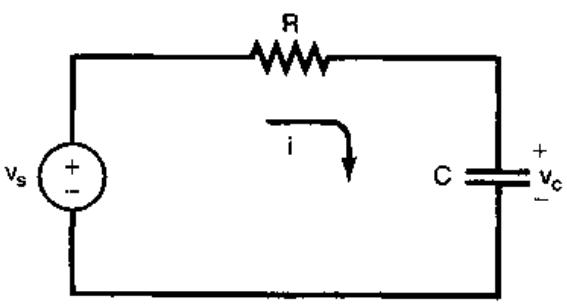  
图1.1 含有电压源  $\boldsymbol{v}_{s}$  和电容器电压  $\boldsymbol{v}_{c}$  的简单电路

是通过拾音器来感受到声压的变化, 然后再转换为某种电信号。由图可见, 不同的语音相应有不同的声压变化波形, 并且声道系统产生的可懂语言就对应着一串特定的波形。另外, 示于图1.4是一幅黑白照片, 这时整个照片上各点的亮度变化波形才是重要的。

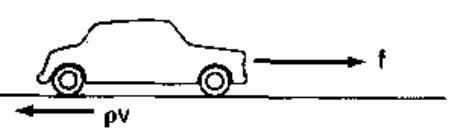  
图1.2 一部汽车。  $f$  系来自发动机的外加力,  $\rho v$  系正比于汽车速度  $\boldsymbol{v}$  的摩擦力

在数学上, 信号可以表示为一个或者多个变量的函数。例如, 一个语音信号就可以表示为声压随时间变化的函数;

一张黑白照片就可以用亮度随二维空间变量变化的函数来表示。本书的讨论范围仅限于单一变量的函数, 而且为了方便起见, 以后在讨论中一般总是用时间来表示自变量, 尽管在某些具体应用中自变量不一定是时间。例如, 在地球物理学研究中, 用于研究地球结构的一些物理量像密度、气隙度和电阻率等就是随地球深度变化的信号; 在气象观察中, 有关气压、温度和风速

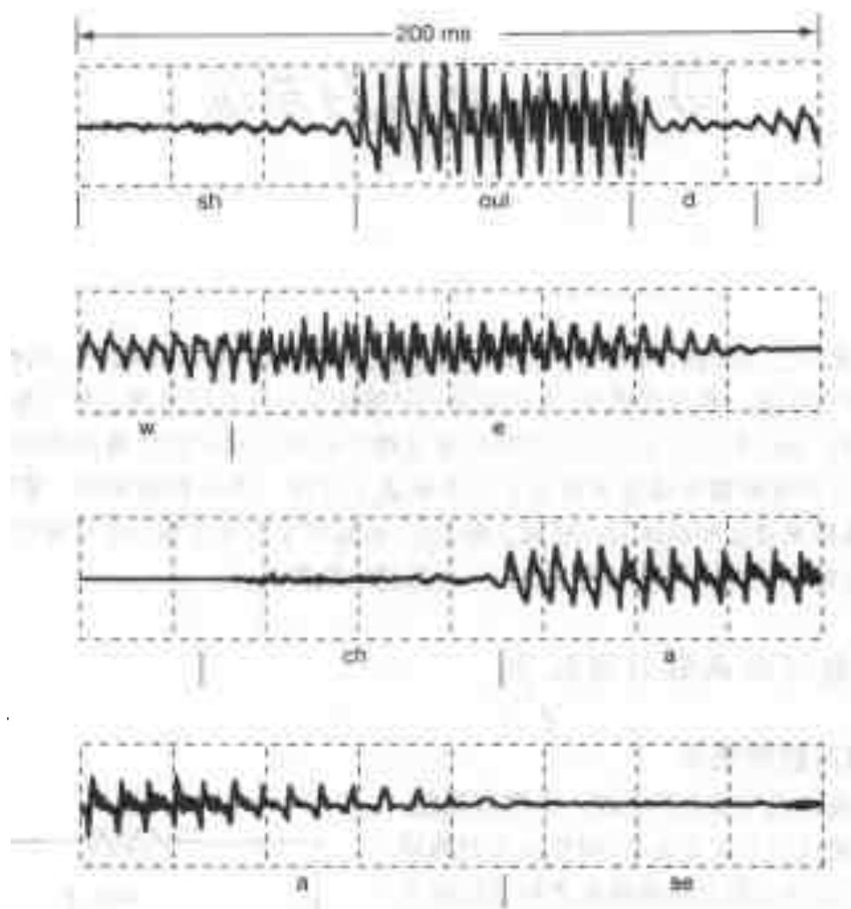  
图1.3 一个语音信号的波形[摘引自“Applications of Digital Signal Processing”, A.V.Oppenheim, ed. (Englewood Cliffs, N.J.: Prentice-Hall, Inc., 1978), p.121.]该信号代表“Should we chase”这句话的声压随时间的变化波形。图的上部相应于字“Should”, 第二行是字“we”, 最下面两行是“chase”。(图中还大致标出了每个字中逐个音的起始和结束部位)

  
图1.4 一瞬黑白照片

随高度的变化也是很重要的一类信号。图1.5示出的是一个典型的年平均沿垂直方向风速随高度变化的分布图, 这种风速随高度的变化情况用于气象图的研究以及研究某些风的状况, 后

者可能会影响飞机接近机场和降落。

全书将考虑两种基本类型的信号：连续时间信号和离散时间信号。在前一种情况下，自变量是连续可变的，因此信号在自变量的连续值上都有定义；而后者是仅仅定义在离散时间点上，也就是自变量仅取在一组离散值上。作为时间函数的语音信号和随高度变化的大气压都是连续时间信号的例子；如图1.6所示的每周道- 琼斯（DowJones)股票市场指数就是离散时间信号的一个例子。在人口统计学的研究中还可以找到其它离散时间信号的例子，例如像平均预算、犯罪率或捕鱼量等都可以分别对家庭大小、总人口或捕鱼船的类型等离散变量列成表格形式。

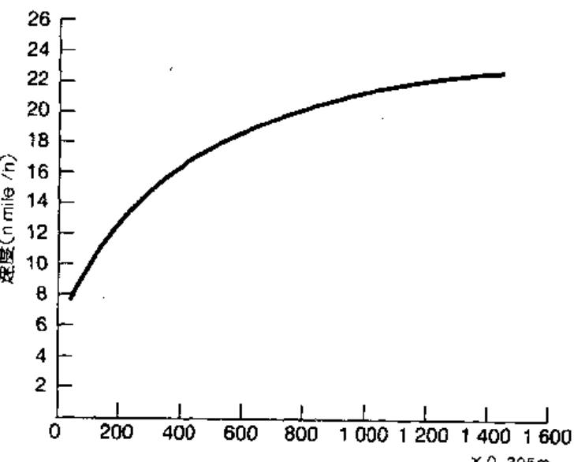  
高度 图1.5 典型的年平均沿垂直方向风速分布图（摘引自 Crawford and Hubson, National Severe Storms Laboratory Report,ESSA FRLTM- NSSL 48, August 1970)

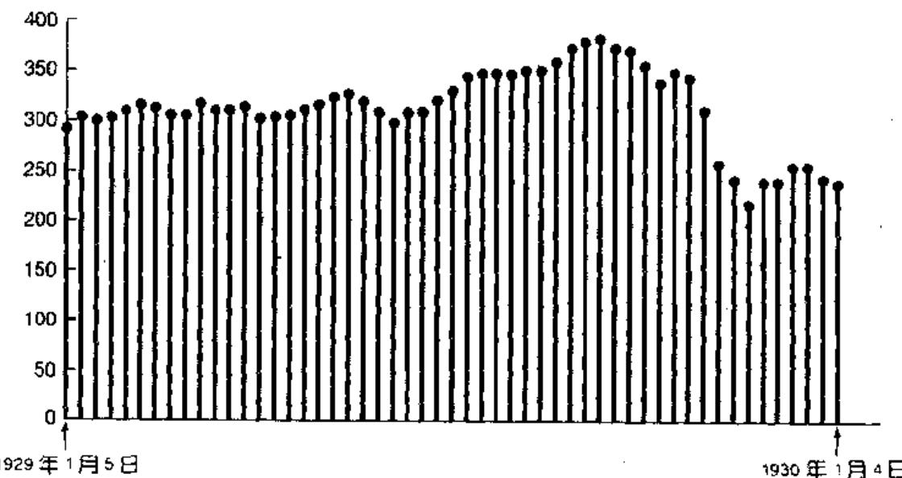

为了区分这两类信号,我们用  $t$  表示连续时间变量,而用  $\pmb{n}$  表示离散时间变量。另外,连续时间信号用圆括号  $(\cdot)$  把自变量括在里面,而离散时间信号则用方括号  $[ \cdot ]$  来表示。当用图的方法来表示信号是有利时,也常常这样做。图1.7 就是给出一个连续时间信号  $x(t)$  和一个离散时间信号  $x[n]$  的例子。值得注意的是,离散时间信号  $x[n]$  仅仅在自变量的整数值上有定义。把  $x[n]$  用图来表示就是为了强调这一点,有时为了更加强调这一点,就干脆称  $x[n]$  为离散时间序列。

当然。一个离散时间信号  $x[n]$  可以表示一个其自变量变化本来就是离散的现象，例如在有关人口统计学中的一些数据就属于这类信号的例子。另一方面，有些很重要的离散时间

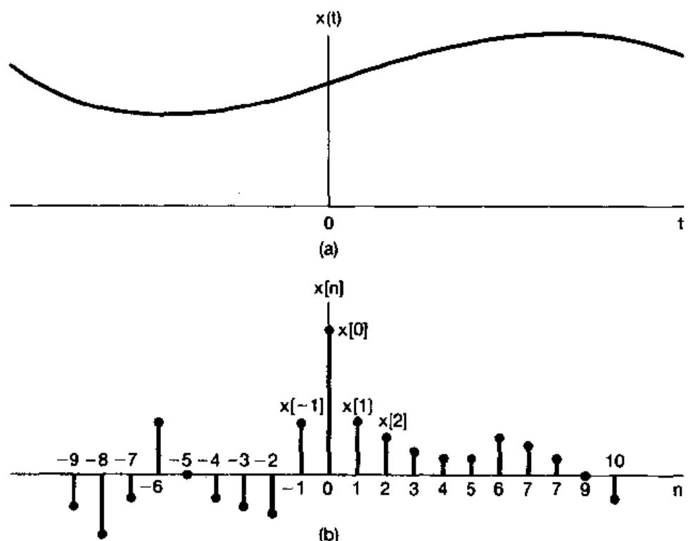

信号则是通过对连续时间信号的采样而得到的,这时该离散时间信号  $x[n]$  则代表了一个自变量是连续变化的连续时间信号在相继的离散时刻点上的样本值。由于近代数字处理器在速度、计算能力及灵活性等方面的进展,因此被用来实现许多这样的实际系统,其范围涉及从数字自动驾驶仪到一般的数字音频系统。这样的系统都要求利用代表连续时间信号经采样过的离散时间样本序列,这就是飞机的位置、速度和航向,或是音频系统的语音和音乐。同样,报纸以及本书中所用的照片实际上也都是由很多细小的点格所组成的,其中每一点就代表着相应于原照片上该点亮度的采样。无论这些离散时间信号来源是什么,信号  $x[n]$  总是在  $\pmb{n}$  的整数值上有定义,因此像所谓一个数字语音信号的第  $3 \frac{1}{2}$  个样本,以及对某一家庭的  $2 \frac{1}{2}$  个家庭成员的平均预算等等都是毫无意义的。

本书大部分都采用分别地,但是并行地讨论离散时间信号和连续时间信号,以使我们能在一种信号类型中所获得的细节有助于对另一种信号类型的理解。到第7章再回到采样问题中来,这样我们就可以把连续时间信号和离散时间信号的概念结合起来,以披露这两种信号之间的关系。

# 1.1.2 信号能量与功率

从到目前为止所给出的例子可以看到,信号可以表示范围很广的一些现象。在很多(但不是全部)应用中,所考虑的信号是直接与在某一物理系统中具有功率和能量的一些物理量有关的。例如,若  $\boldsymbol {v}(t)$  和  $i(t)$  分别是阻值为  $R$  的某一电阻上的电压和电流,那么其瞬时功率就是

$$
p(t) = v(t) i(t) = \frac{1}{R} v^{2}(t) \tag{1.1}
$$

在时间间隔  $t_{1} \leq t \leq t_{2}$  内消耗的总能量就是

$$
\int_{t_{1}}^{t_{2}} p(t) \mathrm{d}t = \int_{t_{1}}^{t_{2}} \frac{1}{R} v^{2}(t) \mathrm{d}t \tag{1.2}
$$

其平均功率为

$$
\frac{1}{t_{2} - t_{1}}\int_{t_{1}}^{t_{2}}p(t) \mathrm{d}t = \frac{1}{t_{2} - t_{1}}\int_{t_{1}}^{t_{2}}\frac{1}{R} v^{2}(t) \mathrm{d}t \tag{1.3}
$$

相类似,对于图1.2中的汽车,由于摩擦所耗散的瞬时功率是  $\pmb {\mathscr{p}}(\pmb {\mathscr{t}}) = b v^{2}(\pmb {\mathscr{t}})$  ,然后就可以按(1.2)式和(1.3)式来定义在其一段时间内的总能量和平均功率。

利用这些简单的实际例子作为楔子,就可以对任何连续时间信号  $x(t)$  或离散时间信号 $x[n]$  采用类似的功率和能量的术语。然而,不久将会看到,往往把信号看作具有复数值更为方便,这时在  $t_{1}{\leqslant}t{\leqslant}t_{2}$  内的总能量对于一个连续时间信号  $x(t)$  来说就定义为

$$
\int_{t_{1}}^{t_{2}}\mid x\left(t\right)\mid^{2}\mathrm{d}t \tag{1.4}
$$

这里  $\mid x\mid$  记作  $x$  (可能为复散)的模。其平均功率将(1.4)式用  $t_{2} - t_{1}$  除就可得到。相类似,在 $n_{1}{\leqslant}n{\leqslant}n_{2}$  内的离散时间信号  $x[n]$  的总能量就是

$$
\sum_{n = n_{1}}^{n_{2}}\mid x[n]\mid^{2} \tag{1.5}
$$

将其除以  $n_{2} - n_{1} + 1$  就得到在该区间内的平均功率。要牢记的是,这里所用的"功率"和"能量"与(1.4)式和(1.5)式中的量是否与真正的物理量相联系是无关的  $①$  。尽管如此,我们仍发现采用这些术语在一般意义上是方便的。

再者,在很多系统中关心的是信号在一个无穷区间内(即  $- \infty < t< +\infty$  或  $- \infty < n< +\infty$  )的功率和能量,在这些情况下,将总能量定义成按(1.4)式和(1.5)式,将其区间趋于无穷的极限来考虑,在连续时间情况下就是

$$
E_{\infty}\triangleq \lim_{T\to \infty}\int_{-T}^{T}\mid x(t)\mid^{2}\mathrm{d}t = \int_{-\infty}^{+\infty}\mid x(t)\mid^{2}\mathrm{d}t \tag{1.6}
$$

而在离散时间情况下就是

$$
E_{\infty}\triangleq \lim_{N\to \infty}\sum_{n = -N}^{+N}\mid x[n]\mid^{2} = \sum_{n = -\infty}^{+\infty}\mid x[n]\mid^{2} \tag{1.7}
$$

注意,对某些信号(1.6)式的积分,或(1.7)式的求和可能不收敛,譬如若  $x(t)$  或  $x[n]$  在全部时间内都为某一非零的常数值就是这样。这样的信号具有无限的能量,而  $E_{\infty}< \infty$  的信号具有有限的能量。

关于在无限区间内的平均功率,可以类似的方式分别定义为

$$
P_{\infty}\triangleq \lim_{T\to \infty}\frac{1}{2T}\int_{-T}^{T}\mid x(t)\mid^{2}\mathrm{d}t \tag{1.8}
$$

和

$$
P_{\infty}\triangleq \lim_{N\to \infty}\frac{1}{2N + 1}\sum_{n = -N}^{+N}\mid x[n]\mid^{2} \tag{1.9}
$$

利用这些定义就可以区分三种重要的信号。其中之一是信号具有有限的总能量,即  $E_{\infty}< \infty$  。这种信号的平均功率必须为零,因为在连续时间情况下,由(1.8)式可看出

$$
P_{\infty} = \lim_{T\to \infty}\frac{E_{\infty}}{2T} = 0 \tag{1.10}
$$

信号在  $0\leqslant t\leqslant 1$  内其值为1,而在此以外均为0就是有限能量信号的另一个例子,这时 $E_{\infty} = 1,P_{\infty} = 0_{\circ}$

第二类信号是其平均功率  $P_{\infty}$  有限的信号。根据刚才看到的,如果  $P_{\infty} > 0$  ,就必然有  $E_{\infty}$ $= \infty$  。这是很自然的,因为如果单位时间内有某一个非零的平均能量(也就是非零功率),那么在无限区间内积分或求和就必然得出无限大的能量值。例如,常数信号  $x[n] = 4$  就具有无限能量,但是平均功率  $P_{\infty} = 16$  。第三类信号就是  $P_{\infty}$  和  $E_{\infty}$  都不是有限的,一个例子就是信号 $x(t) = t$  。对于这三类信号的其它例子,本章稍后部分及后续各章中都会碰到。

# 1.2 自变量的变换

信号与系统分析中一个重要的概念是关于信号的变换概念。例如,在飞机控制系统中对应于驾驶员动作的信号,经由电的和机械的系统变换为在飞机推力或飞机控制翼面(如舵或副翼)位置上的改变,进而再经过该机体的动力学和运动学原理变换为在飞机速度和航向上的变化。同样,在高保真度音频系统中,代表录制在一盘磁带或密纹唱片上的音乐信号,为了增强所要求的特性、除去录制噪音、或者平衡几种信号分量(如高音和低音)也作了变换。这一节只放在很有限的但是很重要的几种最基本的信号变换上,这些变换只涉及自变量的简单变换,也就是时间轴的变换。正如在这一节以及本章后续节中所看到的,这些基本变换可以引入信号与系统的几个基本性质。在以后的各章中将会发现它们在定义和表征更为丰富和更加重要的类系统中也起着重要的作用。

# 1.2.1 自变量变换举例

一种简单而很重要的信号自变量变换的例子是时移。在离散时间情况下的时移如图1.8所示,这里有两个信号  $x[n]$  和 $x[n - n_{0}]$  ,它们在形状上是完全一样的,但在位置上互相有一个移位。在连续时间情况遇到的时移就如图1.9所示,这里  $x(t - t_{0})$  代表一个延时  $\left(t_{0}\right)$  为正)的  $x(t)$  ,或是一个超前  $\left(t_{0}\right)$  为负)的  $x(t)$  。这种形式关联的信号可以在声纳、地震信号处理以及雷达等应用中找到。配置在不同地点的几台接收机观察经由某一媒质(水、岩石、空气等)传来的同一台发射机发来的信号,由于各个接收点与发射机的距离不等而造成传播时间上的差别就形成了信号间的不同时移。

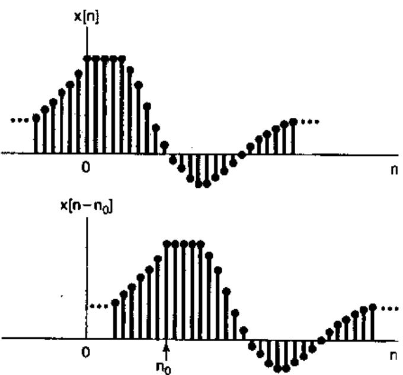

时间轴的第二种基本变换是时间反转

图1.8. 用时移关联的离散时间信号。图中  $n_{0} > 0$  ,所以  $x[n - n_{0}]$  是  $x[n]$  的延时(即  $x[n]$  中的每一点在  $x[n - n_{0}]$  中都稍后出现)

(time reversal)。例如在图1.10 中,  $x[- n]$  就是将  $x[n]$  以  $\pmb {n} = \mathbf{0}$  为轴反转而得到的。同样图1.11 中,  $x(- t)$  也是从信号  $x(t)$  以  $\pmb {t} = \mathbf{0}$  为轴反转而得的。这样,如果  $x(t)$  是代表 盘录制的声音磁带的话,那么  $x(- t)$  就代表同样一盘磁带倒过来放(即从末尾向前倒放)的结果。第二种基本变换是时间尺度变换(time scaling)。在图1.12 中示出了  $x(t)$  ,  $x(2t)$  和  $x(t / 2)$  三个信号,这三个信号是与自变量的线性尺度变换联系着的。倘若我们再一次把  $x(t)$  想象为一盘录音磁带的话,那么  $x(2t)$  将是这盘磁带以两倍的速度放音的结果,而  $x(t / 2)$  则代表原磁带将放音速度降低一半。

  
图1.9用时移关联的连续时间信号。图中  $t_{0}< 0$  所以  $x(t - t_{0})$  就是一个超前的  $x(t)$  （即在  $x(t)$  中的每一点在  $x(t - t_{0})$  中都提前出现）

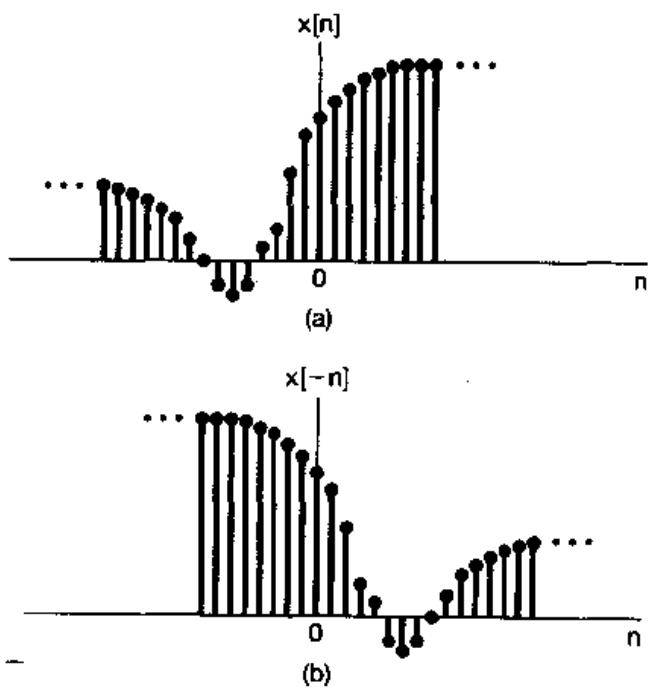

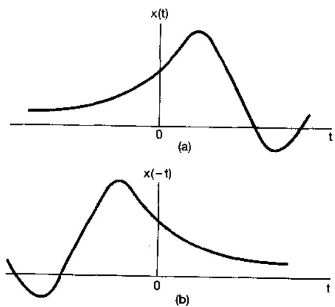

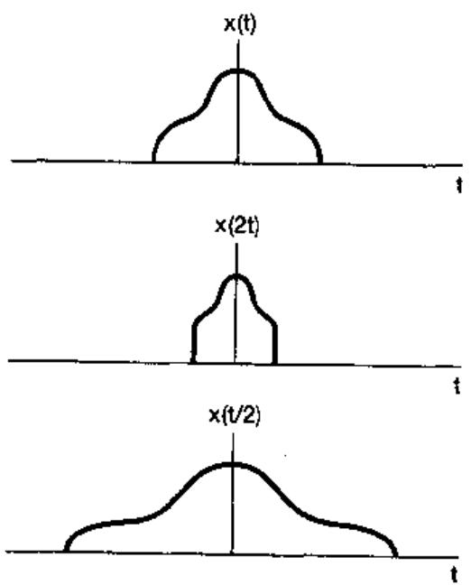

常常关注的是对某一个已知的信号  $x(t)$  通过自变量变换以求得一个形式如  $x(\alpha t + \beta)$ 的信号,这里  $\alpha$  和  $\beta$  是一个给定的数。这样一种自变量变换所得到的信号除了有一个线性的扩展(若  $|\alpha |< 1)$  或压缩  $(|\alpha | > 1)$  ,时间上的反转  $(\alpha < 0)$  及移位  $(\beta \neq 0)$  外,仍旧保持有  $x(t)$  的形状。现用下面的一组例子给予说明。

例1.1已知信号  $x(t)$  如图1.13(a)所示,  $x(t + 1)$  就是  $x(t)$  沿  $t$  轴左移一个单位如图1.13(b)所示。具体地说,  $x(t)$  在  $\scriptstyle t = t_{0}$  取得到值,在  $x(t + 1)$  中发生在  $\scriptstyle t = t_{0} - 1$  ,例如  $x(t)$  在  $\scriptstyle t = 1$  的值在  $x(t + 1)$  中是在  $\scriptstyle t = 1 - 1 = 0$  处得到。同样,因为  $x(t)$  在  $t< 0$  为零,所以  $x(t + 1)$  在  $t< - 1$  为零;相类似,因为  $x(t)$  在  $t > 2$  为零,所以  $x(t + 1)$  在  $t > 1$  为零。

现在考虑信号  $x(- t + 1)$  ,这可以在  $x(t + 1)$  由以  $- t$  代替  $\scriptstyle{\mathfrak{t}}$  来得到,这就是说,  $x(- t + 1)$  就是  $x(t$ $+1)$  的时间反转。因此  $x(- t + 1)$  可以在图上以  $\scriptstyle t = 0$  为轴将  $x(t + 1)$  反转而得到,如图1.13(c)所示

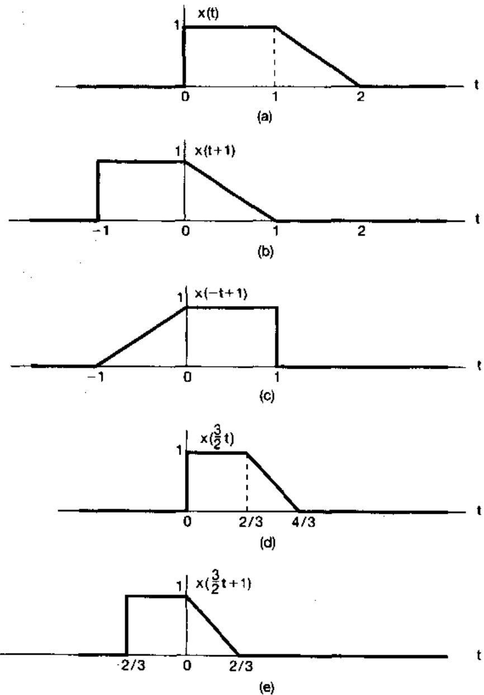

图1.13(a)用于例  $1.1\sim 1.3$  的连续时间信号  $x(t)$  ,图示说明自变量变换;(b)时移信号  $x(t + 1)$  (c)用时移和反转得到的  $x(- t + 1)$  (d)时间尺度变换信号  $x(\frac{3}{2} t)$  (e)由时移和尺度变换得到的  $x(\frac{3}{2} t + 1)$

例1.2已知信号  $x(t)$  知图1.13(a)所示,信号  $x(\frac{3}{2} t)$  就相应于  $x(t)$  以因子2/3作线性时间压缩,如图1.13(d)所示。具体一点就是  $x(t)$  在  $t = t_{0}$  所取得的值,在  $x(\frac{3}{2} t)$  中是在  $t = \frac{2}{3} t_{0}$  时刻得到。例如,  $x(t)$  在  $\scriptstyle t = 1$  时的值,在  $x(\frac{3}{2} t)$  中是在  $t = \frac{2}{3} (1) = \frac{2}{3}$  求得。同样,因为  $x(t)$  在  $t< 0$  为零,所以有  $x(\frac{3}{2} t)$  在  $t< 0$  也为零;因为  $x(t)$  在  $t > 2$  为零,所以  $x(\frac{3}{2} t)$  就在  $t > 4 / 3$  时为零。

例1.3假设对于一个给定信号  $x(t)$  ,想看看自变量变换的效果,以求得一个形如  $x(\alpha t + \beta)$  的信号,这里 $\alpha ,\beta$  都是已知的某个数。为此,一种有条不紊的途径是首先根据  $\beta$  的值将  $x(t)$  延时或超前,然后再根据  $\alpha$  的值来对这个已经延时或超前的信号进行时间尺度变换和/或时间反转。如果  $|\alpha |< 1$  就将该已被延时或超前的信号进行线性扩展;如果  $|\alpha | > 1$  ,就实行线性压缩,而若  $\alpha < 0$  就再作时间反转。

为了说明这个办法,看看  $x(\frac{3}{2} t + 1)$  是怎么由图1.13(a)的  $x(t)$  求得的。因为  $\beta = 1$  ,所以首先将 $x(t)$  超前1(即左移1),如图1.13(b)所示。因为  $|\alpha | = 3 / 2$  ,所以就应将图1.13(b)已左移的信号线性压缩,压缩因子是2/3,于是就得到如图1.13(e)所示的信号,这就是  $x(\frac{3}{2} t + 1)$  。

自变量变换除了在表示一些物理现象(如声纳信号的时移、磁带的快放或倒放等)中的应用外,它在信号与系统分析中是极为有用的。在1.6节和第2章都将应用自变量变换来引入和分析系统的性质。这些变换在定义和研究信号的某些重要性质上也是很重要的。

# 1.2.2 周期信号

在全书中都会常常遇到的一类重要信号就是周期信号。一个周期连续时间信号  $x(t)$  具有这样的性质,即存在一个正值的  $T$  ,对全部  $\mathbf{\Psi}_{t}$  来说,有

$$
x(t) = x(t + T) \tag{1.11}
$$

换句话说,当一个周期信号时移  $T$  后其值不变。这时就说  $x(t)$  是一个周期信号,周期为  $T$  。周期的连续时间信号出现在各种场合。例如在习题2.61中所说明的具有能量储存系统的自然响应,像无电阻损耗的理想  $LC$  电路和无摩擦损耗的理想机械系统的自然响应都是周期的;而且事实上它们都是由一些基本的周期信号所组成的,这些都将在1.3节讨论。

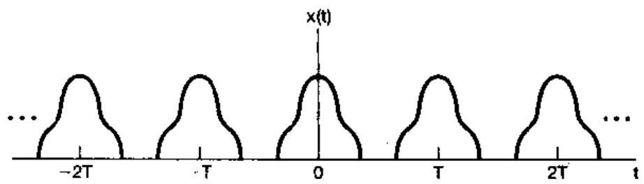  
图1.14 连续时间周期信号

图1.14给出了一个周期连续时间信号的例子。从该图或者从(1.11)式都能很快得出;如果  $x(t)$  是周期的,周期为  $T$  ,那么对全部  $\mathbf{\Psi}_{t}$  和任意整数  $\mathbf{\nabla}_{m}$  来说就有  $x(t) = x(t + m T)$  ,由此 $x(t)$  对于周期  $2T,3T,4T,\dots$  等等都是周期的。对于使(1.11)式成立的最小正值  $T$  称为 $x(t)$  的基波周期  $\pmb{T}_{0}$  。除了  $x(t)$  为一个常数外,基本周期的定义都成立;在  $x(t)$  为一常数的

情况下，基波周期无定义，因为这时对任意  $\pmb{T}$  来说  $\pmb {x}\left(\pmb {t}\right)$  都是周期的（所以不存在最小的正值T)。一个信号  $\pmb {x}\left(\pmb {t}\right)$  不是周期的就称为非周期信号。

在离散时间下可类似地定义出周期信号，这就是：如果- 个离散时间信号  $x[n]$  时移一个

N后其值不变，即对全部n值有

则  $x[n]$  是周期的，周期为  $N,N$  为某一个正整数。若(1.12)式成立，那么  $x[n]$ 对于周期  $2N,3N,4N,$  也都是周期的，其中使(1.12)式成立的最小正值  $N$ 就是它的基波周期  $\pmb{N_{0}}$  。图1.15示出一个基波周期  $N_{0} = 3$  的离散时间周期信号的例子。

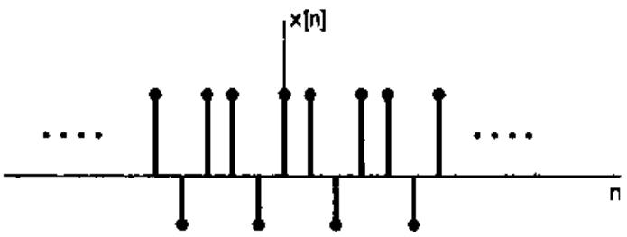

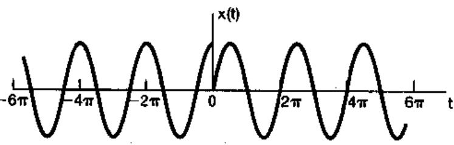

例1.4现在来解这么·个类型的问题，即要确定所给信号是否是周期性的。这里要确认的信号是

\[
x(t)=\left\{\begin{array}{l l}{\cos\left(t\right)}&{\;\;\;\;\;\;\;\;\;\;\;\;\;\;\;\;\;\;\;\;\;\;\;\;\;\;\;\;\;\;\;\;\;\;\;\;\;\;\;\;\;\;\;\;\;\;\;\;\;\;\;\;\;\;\;\;\;\;\;\;\;\;\;\;\;\;\;\;\;\;\;\;\;\;\;\;\;\;\;\;\;\;\;\;\;\;\;\;\;\;\;\;\;\;\;\;\;\;\;\;\;}\end{array}\right.
\]  

\[
\begin{array}{r}{\mathbf{\nabla}\cdot\mathbf{\nabla}x\left(t\right)=\left\{\begin{array}{l l}{\cos\left(t\right)}&{\;\;\;\;\;\;\;\;\;\;\;\;\;\;\;\;\;\;\;\;\;\;\;\;\;\;\;\;\;\;\;\;\;\;\;\;\;\;\;\;\;\;\;\;\;\;\;\;\;\;\;\;\;\;\;\;\;\;\;\;\;\;\;\;\;\;\;\;\;\;\;\;\;\;\;\;\;\;}\end{array}\right.}\end{array}
\]  

图1.16所讨论的信号  $x(t)$

由三角学可知  $\cos \left(t + 2\pi\right) = \cos \left(t\right)$  ，sin  $(t + 2\pi) = \sin \left(t\right)$  因此分别对  $t > 0$  和  $t < 0$  考虑，  $\mathbf{\nabla}_{x}(t)$  在相距每  $_{2\pi}$  上都确实重复无疑。然而，正如在图1.16所示出的，  $\mathbf{\nabla}_{x}(t)$  在原点有一个不连续点，而这样的不连续点并不在其它地方重现。因为一个周期信号在形状上的每一个特点都必须周期性地重现，所以可以得出  $\mathbf{\nabla}_{x}(t)$  不是周期的。

# 1.2.3 偶信号与奇信号

信号的另一种有用的性质是在时间反转之下有关信号的对称性问题。如果一个信号 $\mathbf{\nabla}_{x}(t)$  或  $\mathbf{\nabla}_{x}[ \pmb {n} ]$  ，以原点为轴反转后不变，就称其为偶信号。在连续时间下，一个偶信号就有

$$
x(- t) = x(t) \tag{1.14}
$$

而在离散时间下就有

$$
x[- n] = x[n] \tag{1.15}
$$

如果有

$$
x(- t) = - x(t) \tag{1.16}
$$

$$
x[- n] = - x[n] \tag{1.17}
$$

就称该信号为奇信号。一个奇信号在  $\pmb {t} = \mathbf{0}$  或 $\pmb {n} = \mathbf{0}$  必须为0,因为(1.16)式和(1:17)式要求 $x(0) = - x(0)$  和  $x[0] = - x[0]$  。图1.17示出奇、偶连续时间信号的例子。

任何信号都能分解为两个信号之和，其中

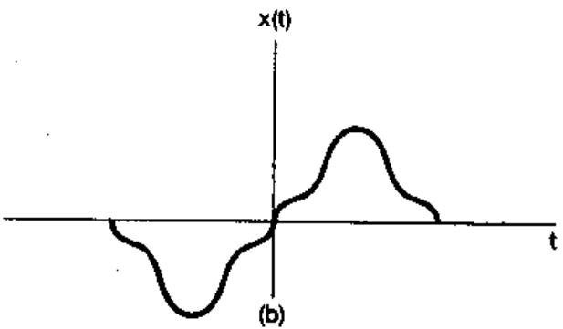

之一为偶信号，另一个为奇信号。为此考虑下列信号

$$
\mathcal{E}_{\bullet}\{x(t)\} = \frac{1}{2} [x(t) + x(-t)]
$$

$$
\mathcal{O}\mathcal{U}\{x(t)\} = \frac{1}{2} [x(t) - x(-t)]
$$

$\mathcal{E}_{\mathfrak{u}}\{x\left(t\right)\} ,\mathcal{E}_{\mathfrak{u}}\{x\left(t\right)\}$  分别称为  $x\left(t\right)$  的偶部和奇部。很简单地就可确认偶部是偶信号，而奇部是奇信号，且  $x\left(t\right)$  就是两者之和。在离散时间下上述结论也完全成立。图1.18示出一个离散时间信号奇偶分解的例子。

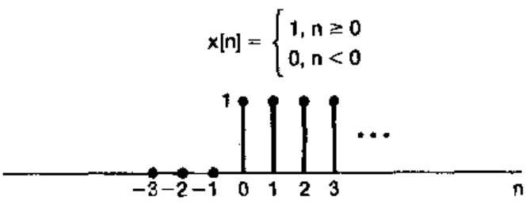

# 1.3 指数信号与正弦信号

这一节和下一节要介绍几个基本的连续时间和离散时间信号。这样做不仅仅是因为这些信号经常出现，更重要的是它们可以用作基本的信号构造单元来构成其它许多信号。

# 1.3.1 连续时间复指数信号与正弦信号

连续时间复指数信号具有如下形式：

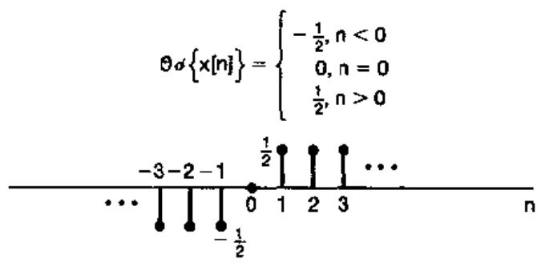

式中  $c$  和  $\pmb{a}$  一般为复数。根据这些参数值的不同，复指数信号可有几种不同的特征。

# 实指数信号

如图1.19 所示,若  $c$  和  $\pmb{a}$  都是实数(这时  $\mathbf{\nabla}_{x}(t)$  就称为实指数信号),就有两种类型的特性。若  $\pmb{a}$  是正实数,那么  $\mathbf{\nabla}_{x}(t)$  随  $\pmb{t}$  的增加而指数增长。这种类型的信号可以用来描述原子爆炸或复杂化学反应中的链锁反应等很多不同的物理过程。若  $\pmb{a}$  是负实数,则  $\mathbf{\nabla}_{x}(t)$  随  $\pmb{t}$  的增加而指数衰减。这类信号也可用来描述诸如放射性衰变、  $\mathbf{\nabla}_{\mathbf{\mathcal{R}C}}$  电路以及有阻尼的机械系统的响应等范围广泛的各种现象。特别是,如同在习题2.61 和2.62 中所指出的,图1.1 电路和图1.2 中的汽车,它们的自然响应都是指数衰减的。对于  $\pmb {a} = \pmb{0}$  ,  $\mathbf{\nabla}_{x}(t)$  就为一常数。

# 周期复指数和正弦信号

第二种重要的复指数信号是将  $\pmb{a}$  限制为纯虚数，特别是考虑如下信号：

$$
x(t) = e^{i\omega_{0}t} \tag{1.21}
$$

该信号的一个重要性质是它是周期信号。为了证明这一点，可以根据（1.11）式，如果存在一个  $\boldsymbol{\tau}$  而使下式成立：

$$
\mathbf{e}^{\mathrm{j}\omega_{0}t} = \mathbf{e}^{\mathrm{j}\omega_{0}(t + T)} \tag{1.22}
$$

则  $\pmb {x}(\pmb {t})$  就是周期的。为此

$$
\mathbf{e}^{\mathrm{j}\omega_{0}(t + T)} = \mathbf{e}^{\mathrm{j}\omega_{0}t}\mathbf{e}^{\mathrm{j}\omega_{0}T}
$$

必须有

$$
\mathrm{e}^{\mathrm{j}\omega_{0}T} = 1 \tag{1.23}
$$

若  $\omega_{0} = 0$  ，  $x\left(t\right) = 1$  ,这时对任何  $T$  值都是周期的；若  $\omega_{0}\neq 0$  ，那么使(1.23)式成立的最小正  $T$  值，即基波周期  $T_{0}$ 应为

$$
T_{0} = \frac{2\pi}{\mid\omega_{0}\mid} \tag{1.24}
$$

可见  $\mathbf{e}^{\mathrm{i}\omega_{0}t}$  和  $\mathbf{e}^{- \mathrm{i}\omega_{0}t}$  都是具有同一基波周期的周期信号。

和周期复指数信号密切有关的一种信号是正弦信号

$$
x(t) = A\cos (\omega_{0}t + \phi) \tag{1.25}
$$

如图 所示 用秒作  $\pmb{\tau}$  的单位,则  $\pmb{\phi}$ 的单位就是弧度,而  $\omega_{0}$  的单位就是 $\mathrm{rad} / \mathrm{s}_{\circ}$  一般又可写成  $\omega_{0} = 2\pi f_{0},f_{0}$  的单位是周期数/秒,即  $\mathbf{H}\mathbf{z}_{\circ}$  和复指数信号一样,正弦信号也是周期信号,其基波周期  $T_{0}$  由 式确定。正弦和周期复指数信号也可以用来描述很多物理过程的特性,尤其是储存能量的物理系统。例如在习题 指出的电路的自然响应是正弦的,机械系统的简谐振动以及音乐中的单音声压振动都是正弦的。

利用欧拉（Euler）关系  $\mathfrak{V}$  ，复指数信号可以用与其相同基波周期的正弦信号来表示，即

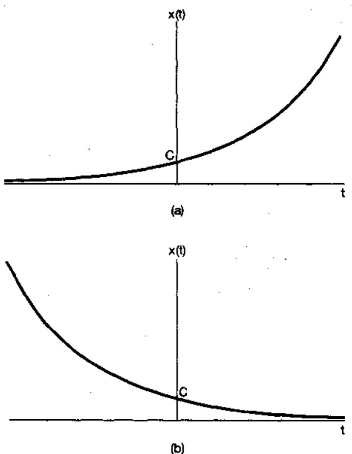

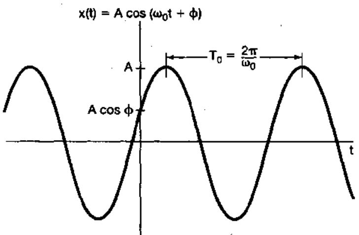  
图1.20 连续时间正弦信号

$$
e^{j\omega_{0}t} = \cos \omega_{0}t + \mathrm{j}\sin \omega_{0}t \tag{1.26}
$$

而（1.25）式的正弦信号也能用相同基波周期的复指数信号来表示，即

$$
\begin{array}{c}{{A\cos\left(\omega_{0}t+\phi\right)}}\\ {{=\frac{A}{2}\mathrm{e}^{\mathrm{i}\phi}\mathrm{e}^{\mathrm{i}\omega_{0}t}+\frac{A}{2}\mathrm{e}^{-\mathrm{i}\phi}\mathrm{e}^{-\mathrm{i}\omega_{0}}}}\end{array}
$$

注意，（1.27）式中的两个指数信号都有复数振幅，所以正弦信号还可以用复指数信号表示为如下形式：

$$
A \cos (\omega_{0}t + \phi) = A \sin \{e^{j(\omega_{0}t + \phi)}\}
$$

这里若  $c$  是一个复数,则  $\{k_{i}\} c\}$ 记作它的实部。也用  $\{k_{i}\} c\}$  记作  $c$  的虚部,这样就有

$$
A \sin (\omega_{0}t + \phi) = A \sin \{e^{j(\omega_{0}t + \phi)}\}
$$

从(1.24)式可以看到,连续时间正弦信号或一个周期复指数信号其基波周期  $T_{0}$  是与  $\omega_{0}$ 成反比的(也称  $\omega_{0}$  为基波频率)。由图1.21可以看出这意味着什么。如果  $\omega_{0}$  减小,就减慢了  $x\left(t\right)$  的振荡速率,因此周期增长;相反,  $\omega_{0}$  增加,振荡速率加快,周期缩短。现在考虑  $\omega_{0}$ $= 0$  的情况,正如早先已经指出的,这时  $x\left(t\right)$  为一常数,因此对于任意正值  $T$  它都是周期的,所以常数信号的基波周期无定义。另一方面,在这种情况下若定义一个常数信号的基波频率为零,也就是说振荡速率为零,这也不会引起什么混淆。

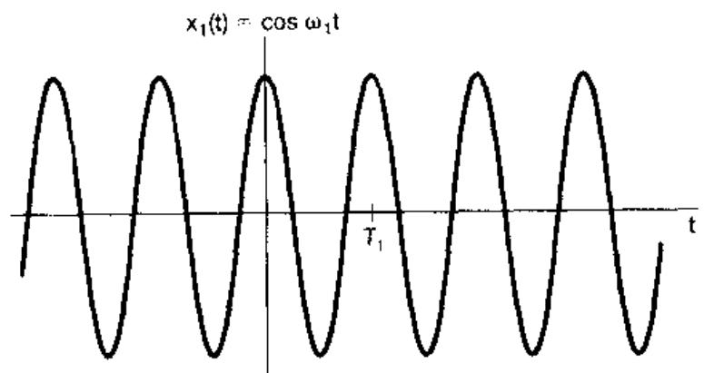

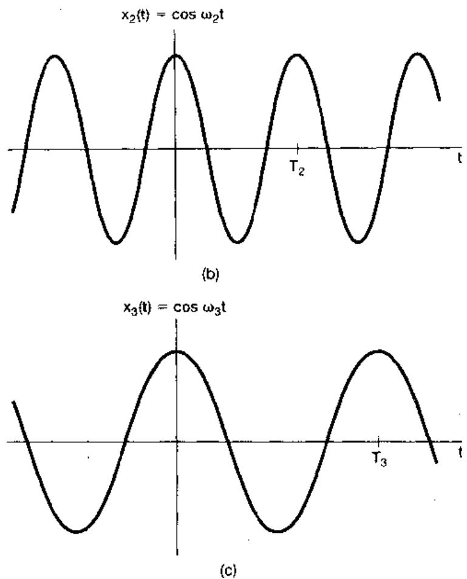

周期信号，尤其是（1.21）式的复指数信号和（1.25）式的正弦信号给出了具有无限能量但有有限平均功率的这类信号的例子。例如考虑一下（1.21）式的周期复指数信号，假设在一个周期内计算该信号的总能量和平均功率

$$
\begin{array}{r l} & {E_{\mathrm{p r i n d}} = \int_{0}^{T_{0}}\mid \mathrm{e}^{\mathrm{i}\omega_{0}t}\mid^{2}\mathrm{d}t}\\ & {\qquad = \int_{0}^{T_{0}}\mid \mathbf{\cdot}\mathrm{d}t = T_{0}} \end{array} \tag{1.30}
$$

$$
P_{\mathrm{period}} = \frac{1}{T_{0}} E_{\mathrm{period}} = 1 \tag{1.31}
$$

因为随着  $\pmb{\tau}$  从  $- \infty$  到  $+\infty$  有无穷多个周期，所以在整个全部时间内积分其总能量就是无限大。该信号的每个周期都完全是- 样的，因为在每个周期内信号的平均功率等于1,所以在多个周期上平均也总是得到1的平均功率。这就是说，周期复指数信号具有有限平均功率等于

$$
P_{\infty} = \lim_{T\to \infty}\frac{1}{2T}\int_{-T}^{T} |\mathrm{~e~}^{\mathrm{i}\omega_{0}t} |^{2}\mathrm{d}t = 1 \tag{1.32}
$$

在习题1.3中还给出了另外几个有关计算周期和非周期信号能量和功率的例子。

周期复指数信号在讨论信号与系统的大部分问题中都起着十分重要的作用,部分原因是由于对许多其它信号来说,它们可用作极其有用的信号基本构造单元。同时,一组成谱波关系的复指数信号也是很有用的;也就是周期复指数信号的集合,该集合内的全部信号都是周期的,且有一个公共周期  $T_{0}$  。对一个复指数信号  $\mathrm{e}^{\mathrm{i}\omega t}$  要成为具有周期为  $T_{0}$  的周期信号的必要条件是

$$
\mathrm{e}^{\mathrm{i}\omega T_{0}} = 1 \tag{1.33}
$$

这就意味着  $\omega T_{0}$  是  $2\pi$  的倍数，即

$$
\omega T_{0} = 2\pi k, k = 0,\pm 1,\pm 2,\dots \tag{1.34}
$$

由此,若定义

$$
\omega_{0} = \frac{2\pi}{T_{0}} \tag{1.35}
$$

可以得出，为满足(1.34)式，  $\pmb{\omega}$  必须是  $\omega_{0}$  的整倍数。这就是说，一个成谐波关系的复指数信号的集合就是一组其基波频率是某一正频率  $\omega_{0}$  的整倍数的周期复指数信号，即

$$
\phi_{k}(t) = \mathrm{e}^{\mathrm{i}k\omega_{0}t},\qquad k = 0,\pm 1,\pm 2,\dots \tag{1.36}
$$

若  $k = 0,\phi_{k}(t)$  就是一个常数;而对任何其它的  $\pmb{k}$  值,  $\phi_{k}(t)$  是周期的,其基波频率为  $| k | \omega_{0}$  ,基波周期为

$$
\frac{2\pi}{\mid k\mid \omega_{0}} = \frac{T_{0}}{\mid k\mid} \tag{1.37}
$$

因为在任何长度为  $T_{0}$  的时间间隔内，恰好通过了  $\mid k\mid$  个基波周期，所以第  $k$  次谐波  $\phi_{k}\left(t\right)$  对 $T_{0}$  来说仍然是周期的。

这里用的术语“谐波”与在音乐中所用的意思是相同的，即由声压振动得到的各种音调其频率都是某一基波频率的整倍数。例如，小提琴上的一根弦的振动模式就能够当作一组成谐波关系的周期指数信号的加权和。在第3章将看到，利用（1.36）式成谐波关系的信号作为基本构造单元可以构成各种各样的周期信号。

例1.5有时希望把两个复指数的和化成单一的复指数和单一的正弦函数的乘积来表示。例如我们要想画出下面信号的模

$$
x(t) = e^{2t} + e^{3t} \tag{1.38}
$$

为此可以首先将(1.38)式右边的两个复指数进行因式分解，其具体作法是将右边和式的两个指数中的频率求得它们的平均值，然后作为公共因子提出来，为此可得

$$
x(t) = e^{2.5t}(e^{-30.5} + e^{0.5t}) \tag{1.39}
$$

根据欧拉关系，上式可写成

$$
x(t) = 2e^{2.5t}\cos (0.5t) \tag{1.40}
$$

从上式中就可以直接得出  $\pmb {x}$  (t)的模的表达式为

$|\mathbf{\Psi}_{x}(t)\mid = 2\mid \cos (0.5t)\mid$  (1.41)在这里已经用到复指数  $\mathbf{e}^{2.5t}$  的模总是1这一点。  $\{x(t)\}$  就是一般的全波整流过的正弦波,如图1.22所示。

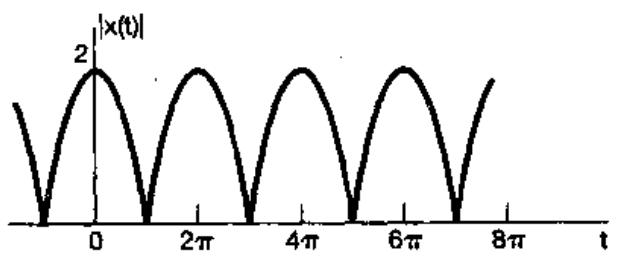

# 一般复指数信号

最一般情况下的复指数信号可以借助于已经讨论过的实指数信号和周期复指数信号来给予表示和说明。考虑某一复指数  $C\mathrm{e}^{a t}$  ,将  $c$  用极坐标,  $\pmb{a}$  用直角坐标表示,分别有

$$
C = \mid C\mid \mathrm{e}^{\mathrm{i}\theta}
$$

和

$$
a = r + \mathrm{j}\omega_{0}
$$

那么

$$
C\mathrm{e}^{a t} = \mid C\mid \mathrm{e}^{\mathrm{j}\theta}\mathrm{e}^{(r + j\omega_{0})t} = \mid C\mid \mathrm{e}^{r\pi}\mathrm{e}^{\mathrm{j}(\omega_{0}t + \theta)} \tag{1.42}
$$

利用欧拉关系,可以进一步展开为

$$
C\mathrm{e}^{a t} = \mid C\mid \mathrm{e}^{r t}\cos (\omega_{0}t + \theta) + j\mid C\mid \mathrm{e}^{r t}\sin (\omega_{0}t + \theta) \tag{1.43}
$$

由此可见,若  $\scriptstyle \pmb {r} = \pmb{0}$  ,则复指数信号其实部和虚部都是正弦型的;而对  $\scriptstyle \pmb {r} > 0$  ,其实部和虚部则是

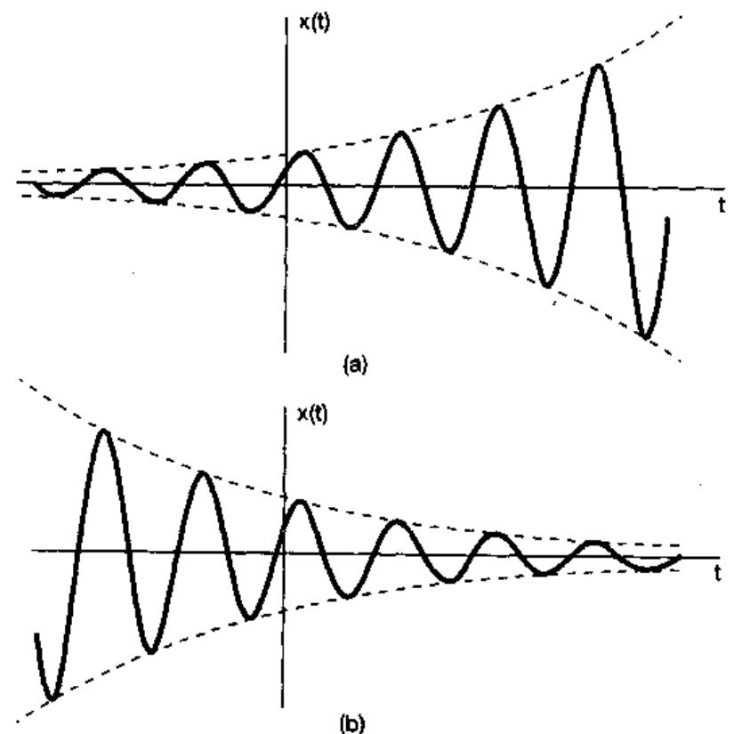

一个振幅为指数增长的正弦信号，以及  $\mathbf{r} < 0$  时为振幅成指数衰减的正弦信号。这两种情况

如图1.23所示,图中的虚线对应于函数  $\pm \left\{C\right\} \mathbf{e}^{\prime \prime}$  。由(1.42)式知道  $\left\{C\right\} \mathbf{e}^{\prime \prime}$  是复指数信号的振幅,可见  $\left\{C\right\} \mathbf{e}^{\prime \prime}$  起着一种振荡变化的包络作用,也就是说每次振荡的峰值正好落在这两条虚线上。这样,包络线给我们提供了一个十分方便的工具,使得我们可以看出振荡幅度的变化趋势。

具有指数衰减振幅的正弦信号常称为阻尼正弦振荡,RLC电路和包括有阻尼和恢复力在内的机械系统(例如汽车减震系统)的响应都是这样一个指数衰减振荡的例子。这样一类系统都具有这样的过程:随着在振荡衰减的过程中,由电阻、摩擦等阻力消耗掉能量。在习题2.61和2.62中还能见到这样的系统,以及它们有阻尼的正弦自然响应的例子。

# 1.3.2 离散时间复指数信号与正弦信号

与连续时间情况下一样,一种重要的离散时间信号是复指数信号或序列,定义为

$$
x[n] = C a^{n} \tag{1.44}
$$

这里  $c$  和  $\alpha$  一般均为复数。若令  $\alpha = e^{\beta}$  ,则有另一种表示形式为

$$
x[n] = C e^{\beta n} \tag{1.45}
$$

虽然从形式上看,(1.45)式更加类似于连续时间复指数信号的表达式(1.20)式,但是在离散时间情况下,往往把离散时间复指数序列写成(1.44)式更为方便和实用些。

# 实指数信号

如果  $c$  和  $\alpha$  都是实数,那么就会有如图1.24所示的几种特性。若  $\mid \alpha \mid >1$  ,信号随  $\pmb{n}$  指数增长;  $\mid \alpha \mid < 1$  ,则随  $\pmb{n}$  指数衰减。另外,若  $\alpha$  是正的话,则  $C a^{n}$  的全部值都具有同一符号;而当 $\alpha$  为负时,则  $x[n]$  的值符号交替变化。同时也注意到若  $\alpha = 1$  ,  $x[n]$  就是一个常数;而当 $\alpha = - 1$  时,  $x[n]$  的值就在  $\pm C$  和  $- C$  之间交替改变。实离散时间指数序列可以用来描述诸如人口增长作为"代"的函数、投资总回收作日、月、或季度的函数等这样一些问题。

# 正弦信号

如果将(1.45)式中的  $\beta$  局限为纯虚数(即  $\mid \alpha \mid = 1)$  的话,就可以得到另一个重要的复指数序列。具体地考虑如下序列:

$$
x[n] = e^{\mathrm{j}\omega_{0}n} \tag{1.46}
$$

和连续时间情况一样,这个信号是与正弦信号密切相关的,即

$$
x[n] = A\cos (\omega_{0}n + \phi) \tag{1.47}
$$

若取  $\pmb{n}$  无量纲的话,那么  $\omega_{0}$  和  $\phi$  的量纲都应是弧度。图1.25中示出了三个正弦序列的例子。

和前面作法一样,利用欧拉公式可以将复指数和正弦序列联系起来为

$$
e^{i\omega_{0}n} = \cos \omega_{0}n + \mathrm{j}\sin \omega_{0}n \tag{1.48}
$$

和

$$
A\cos (\omega_{0}n + \phi) = \frac{A}{2} e^{i\phi}e^{i\omega_{0}n} + \frac{A}{2} e^{-i\phi}e^{-i\omega_{0}n} \tag{1.49}
$$

(1.46)式和(1.47)式的信号就是在离散时间信号中具有无限总能量,而有有限平均功率的例子。因为  $|\mathrm{e}^{\mathrm{j}\omega_{0}n}| = 1$  ,(1.46)式中信号的每个样本在信号能量中的贡献都是1。因此,在  $- \infty$

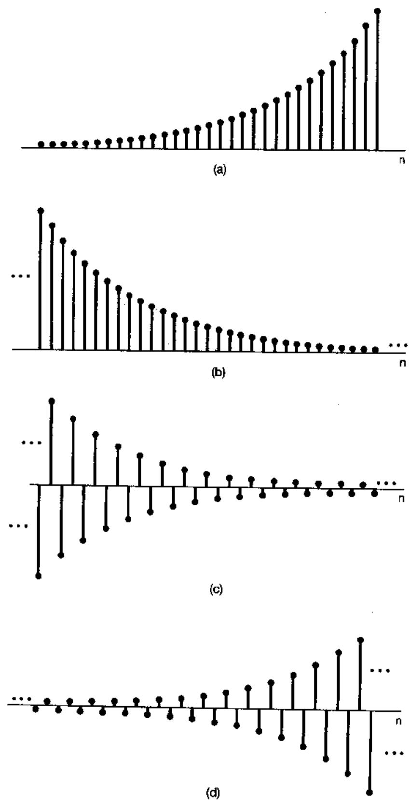

$< n< +\infty$  内的总能量就是无穷大;而在每单位时刻点上的平均功率明显地等于1。在习题1.3中将给出计算离散时间信号能量和功率的其它例子。

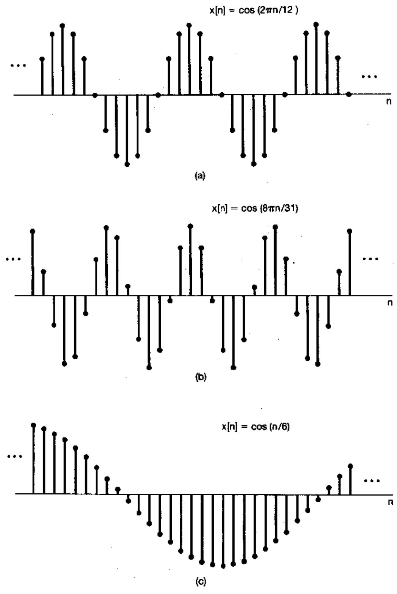

# 一般复指数信号

一般离散时间复指数信号可以用实指数和正弦信号来表示。将  $C$  和  $\alpha$  均以极坐标形式给出,即

$$
C = \{\textbf{C} |\textbf{e}^{\mathrm{i}\theta}
$$

和

$$
\alpha = \mid \alpha \mid \mathrm{e}^{\mathrm{j}\omega_{0}}
$$

则有

$$
Cα" = | C || α |" cos(ω0n + θ) + j | C || α |" sin(ω0n + θ) \tag{1.50}
$$

于是，对  $|\alpha | = 1$  ，复指数序列的实部和虚部都是正弦序列。对  $|\alpha |< 1$  ，其实部和虚部为正弦序列乘以一个按指数衰减的序列。对  $|\alpha | > 1$  ，则乘以一个按指数增长的序列。图1.26示出了这些信号的例子。

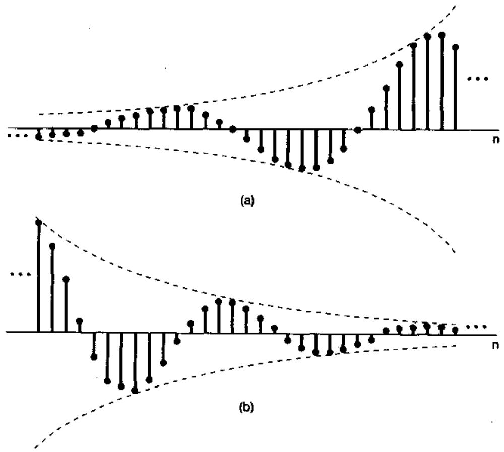

# 1.3.3 离散时间复指数序列的周期性质

虽然在连续时间和离散时间信号之间有很多相似之处，但是也存在一些重要的差别。其中之一就是来看看离散时间指数信号  $\mathbf{e}^{\mathbf{j}\omega_{0}n}$  。在1.3.1节，与其对应的连续时间信号  $\mathbf{e}^{\mathbf{j}\omega_{0}t}$  具有以下两个性质：（1）  $\omega_{0}$  愈大，信号振荡的速率就愈高；  $(2)\mathbf{e}^{\mathbf{j}\omega_{0}t}$  对任何  $\omega_{0}$  值都是周期的。现在，将在这两点上来考察一下  $\mathbf{e}^{\mathbf{j}\omega_{0}n}$  ，就会看到在这两个性质上，两者是肯定不一样的。

第一个性质的不同直接来自于离散时间和连续时间复指数信号之间另一个极为重要的不同之处。为此，研究一下频率为  $\omega_{0} + 2\pi$  的离散时间复指数信号：

$$
\mathrm{e}^{\mathrm{j}(\omega_{0} + 2\pi)n} = \mathrm{e}^{\mathrm{j}2\pi n} \mathrm{e}^{\mathrm{j}\omega_{0}\pi} = \mathrm{e}^{\mathrm{j}\omega_{0}\pi} \tag{1.51}
$$

从(1.51)式说明，离散时间复指数信号在频率  $\omega_{0} + 2\pi$  与频率  $\omega_{0}$  时是完全一样的。这一点和连续时间复指数信号  $\mathbf{e}^{\mathbf{j}\omega_{0}t}$  是完全不同的，在那里，不同的  $\omega_{0}$  就对应着不同的信号；而在离散时

间情况下，具有频率为  $\omega_{0}$  的复指数信号与  $\omega_{0}\pm 2\pi$  ，  $\omega_{0}\pm 4\pi$  ，…等等这些频率的复指数信号则是- - - 样的。因此，在考虑这种离散时间复指数信号时，仅仅需要在某一个  $2\pi$  间隔内选择  $\omega_{0}$  就行了。虽然从(1.51)式来看，任何  $2\pi$  间隔都是可以的，但在大多数情况下总是利用  $0\leqslant \omega_{0}< 2\pi$  ，或者  $- \pi \leqslant \omega_{0}< \pi$  这样一个区间。

由于(1.51)式指出的周期性质,  $\mathbf{e}^{\mathrm{i}\omega_{0}\pi}$  就不具有随  $\omega_{0}$  在数值上的增加而不断增加其振荡速率的特性。事实上如图1.27 所示,而是随着  $\omega_{0}$  从0 开始增加,其振荡速率愈来愈快,直到  $\omega_{0}$ $= \pi$  为止,然后若继续增加  $\omega_{0}$  的话,其振荡速率就下降,直到  $\omega_{0} = 2\pi$  为止,这时又得到与  $\omega_{0}$ $= 0$  时同样的结果(常数序列)。因此,离散时间复指数的低频部分(也就是慢变化)是  $\omega_{0}$  在 $0,2\pi$  和任何其它  $\pi$  的偶数倍值附近;而高频部分(也就是相应于快变化)则是位于  $\omega_{0} = \pm \pi$  以及其它任何  $\pi$  的奇数倍值附近。值得特别注意的是,在  $\omega_{0} = \pi$  或任何其它  $\pi$  的奇数倍处有

$$
\mathbf{e}^{\mathrm{i}\pi \pi} = (\mathbf{e}^{\mathrm{i}\pi})^{\pi} = (- 1)^{n} \tag{1.52}
$$

以致于信号在每一点上都改变符号，产生剧烈振荡[如图1.27(e)所示]。

要讨论的第二个性质是关于离散时间复指数信号的周期性问题。为了使信号  $\mathbf{e}^{\mathrm{i}\omega_{0}\pi}$  是周期的，周期为  $N > 0$  ，就必须有

$$
\mathbf{e}^{\mathrm{i}\omega_{0}(\pi +N)} = \mathbf{e}^{\mathrm{i}\omega_{0}\pi} \tag{1.53}
$$

这就等效于要求

$$
\mathrm{e}^{\mathrm{i}\omega_{0}N} = 1 \tag{1.54}
$$

为了使(1.54)式成立，  $\omega_{0}N$  必须是  $_{2\pi}$  的整数倍，也就是说必须有一个整数  $\pmb{m}$  ，使下式满足

$$
\omega_{0}N = 2\pi m \tag{1.55}
$$

或者

$$
\frac{\omega_{0}}{2\pi} = \frac{m}{N} \tag{1.56}
$$

根据(1.56)式,若  $\omega_{0} / 2\pi$  为一有理数,  $\mathbf{e}^{\mathrm{i}\omega_{0}\pi}$  就是周期的;否则就不是周期的。这一结论对离散时间正弦信号也是成立的。例如图1.25(a)和(b)的信号就是周期的;而图1.25(c)的信号不是周期的。

根据上面的讨论，我们来求离散时间复指数信号的基波周期和基波频率。基波周期和基波频率的定义和连续时间情况一样，即如果  $x\left[n\right]$  是一个周期序列，基波周期为  $N$  ，则它的基波频率就是  $2\pi /N$  。这样，我们来考虑一个周期复指数信号  $x\left[n\right] = \mathbf{e}^{\mathrm{i}\omega_{0}\pi}$  ，其中  $\omega_{0}\neq 0$  。正如刚才所证明的，一定有若干对  $_m$  和  $N(N > 0)$  存在，满足(1.56)式，即  $\omega_{0} / 2\pi = m / N$  。在习题1.35中将证明，如果  $N$  和  $_m$  仅有公共因子，那么  $x\left[n\right]$  的基波周期就是  $N$  。将这一点再与(1.56)式结合起来，可以求得周期信号  $\mathbf{e}^{\mathrm{i}\omega_{0}\pi}$  的基波频率就是

$$
\frac{2\pi}{N} = \frac{\omega_{0}}{m} \tag{1.57}
$$

当然，基波周期也能写为

$$
N = m\left(\frac{2\pi}{\omega_{0}}\right) \tag{1.58}
$$

上面最后两个表示式(1.57)式和(1.58)式与连续时间情况下所对应的(1.24)式是不同的。在表1.1中,综合了  $\mathbf{e}^{\mathrm{i}\omega_{0}t}$  和  $\mathbf{e}^{\mathrm{i}\omega_{0}n}$  之间的一些不同点。当然,若  $\omega_{0} = 0$  ,基波频率为0,基波周期无定义,这与连续时间情况下是相同的。

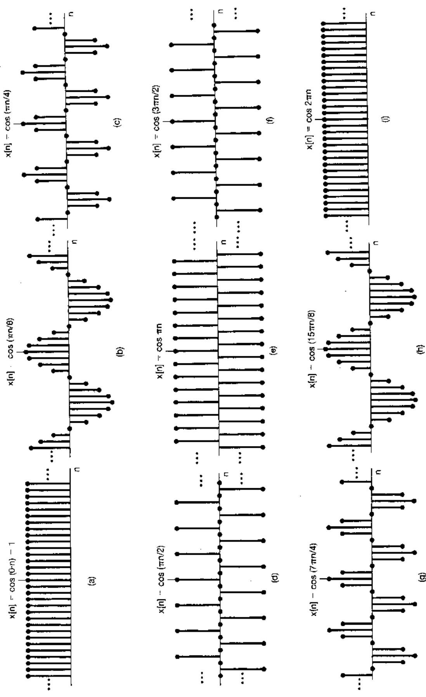

<table><tr><td>e^2h</td><td>e^2h&quot;</td></tr><tr><td>ω0不同,信号不同</td><td>频率相差2π的整倍数,信号相同</td></tr><tr><td>对任何ω0值都是周期的</td><td>仅当ω0=2πm/N时才是周期的,这里N(&amp;gt;0)和m均为整数</td></tr><tr><td>基波频率为ω0</td><td>基波频率* ω0/m</td></tr><tr><td>基波周期:ω0=0,无定义</td><td>ω0=0,无定义</td></tr><tr><td>基波周期:ω0≠0,2π/ω0</td><td>基波周期:ω0≠0,m(2π/ω0)</td></tr></table>

\*这里假设  $\pmb{m}$  和  $N$  无任何公共因子。

为了对以上性质加深理解,再来考察一下图1.25中的几个信号。首先,图1.25(a)中的序列  $x[n] = \cos (2\pi n / 12)$  可以看作是连续时间正弦信号  $x(t) = \cos (2\pi t / 12)$  在整数时刻点上的样本值。这时,  $x(t)$  是基波周期为12的周期信号,  $x[n]$  也是基波周期为12的周期序列。也就是说,  $x[n]$  的值每隔12个点都重复,这与  $x(t)$  的基波周期是完全同步的。

与此相反,图1.25(b)中的序列  $x[n] = \cos (8\pi n / 31)$  ,这可以当作是  $x(t) = \cos (8\pi t / 31)$ 在整数时刻点上的样本值。这时,  $x(t)$  是基波周期为31/4的周期信号;另一方面,  $x[n]$  却是基波周期为31的周期序列。造成这种差别的原因是离散时间信号仅能在自变量的整数值上有定义所致。于是,当  $x(t)$  从  $\scriptstyle t = 0$  开始完成一个整周期时,在时刻  $\scriptstyle t = 31 / 4$  上不能取得样本值。类似地,在  $\scriptstyle t = 2(31 / 4)$  或  $\scriptstyle t = 3(31 / 4)$  上,即当  $x(t)$  走完两个或三个整周期时,也不存在样本点。但是,在  $x(t)$  走完四个整周期,即  $\scriptstyle t = 4(31 / 4) = 31$  ,才有整数的样本点,可取得样本值。这一点从图1.25(b)中就能看出,  $x[n]$  值的变化并不随着  $x(t)$  每单个周期重复,而是每隔4个周期,即每隔31点才重复。

同样,信号  $x[n] = \cos (n / 6)$  能看作是信号  $x(t) = \cos (t / 6)$  在整数时刻点上的样本值。这时,  $x(t)$  的值在整数时刻点永不重复,因为这些样本点从来也不会落在  $x(t)$  的周期  $12\pi$  及其倍数的点上,因此  $x[n]$  不是周期的。虽然人眼看起来好像是周期的,其实这是由于人眼在样本点间进行内插,看到了它的包络  $x(t)$  的结果。在习题1.36中将进一步说明,利用采样概念可对离散时间正弦序列的周期性求得更为深人的理解。

例1.6 假设欲确定如下离散时间信号的基波周期

$$
x[n] = \mathrm{e}^{\mathrm{i}(2\pi /3)n} + \mathrm{e}^{\mathrm{i}(3\pi /4)n} \tag{1.59}
$$

(1.59)式右边第一个常数有一个基波周期是3。虽然这个可以用(1.58)式来证明,但是还有一个比较简单的方法可以得出这一答案。留心一下第一项相角的  $(2\pi /3)n$  ,要使得该指数值开始重复,这个相角就必须增加  $2\pi$  的倍数。于是立即可见,若  $\pmb{n}$  遵增一个3,这个相角就增加了一个  $2\pi_{\circ}$  至于第二项,要使其相角  $(3\pi /4)n$  增加一个  $2\pi ,n$  就必须递增8/3;而这是不可能的,因为  $\pmb{n}$  只能是整数。相仿,要相角增加  $4\pi ,n$  就得递增16/3,仍然是一个非整数的增量。然而,把相角增加  $6\pi$  要求 $\pmb{n}$  有8的增量,这个8就是第二项的基波周期了。

现在,为了使整个信号  $x[n]$  重复,(1.59)式中的每一项都必须通过各自基波周期的整数倍。完成这个过程的  $n$  最小增量是24。也就是说,在24点的间隔内,(1.59)式右边第一项已经穿过了它的8个基波周期,而第二项则穿过了它的3个基波周期,而总的信号  $x[n]$  穿过的只是一个基波周期。

和连续时间情况- - 样,考虑一组成谐波关系的周期离散时间复指数信号在离散时间信号与系统分析中也是有很大价值的。这就是一组具有公共周期  $N$  的周期复指数信号,由(1.56)式可知,这些信号的频率都是基波频率  $2\pi /N$  的整倍数,即

$$
\phi_{k}[n] = \mathrm{e}^{\mathrm{i}k(2\pi /N)n},\qquad k = 0,\pm 1,\dots \tag{1.60}
$$

在连续时间情况下,这些成谐波关系的信号  $\mathrm{e}^{\mathrm{i}k(2\pi /T)t},k = 0,\pm 1,\pm 2,\dots$  都是不相同的。然而,由于(1.51)式的原因,在离散时间情况下却不是这样。因为

$$
\begin{array}{r l} & {\phi_{k + N}[n] = \mathrm{e}^{\mathrm{i}(k + N)(2\pi /N)n}}\\ & {\qquad = \mathrm{e}^{\mathrm{i}k(2\pi /N)n}\mathrm{e}^{\mathrm{i}2\pi n} = \phi_{k}[n]} \end{array} \tag{1.61}
$$

这意味着,由(1.60)式所给出的一组信号中,仅有  $N$  个互不相同的周期复指数信号。例如,

$\phi_{0}[n] = 1,\phi_{1}[n] = \mathrm{e}^{\mathrm{i}2\pi n / N},\phi_{2}[n] = \mathrm{e}^{\mathrm{i}4\pi n / N},\dots ,\phi_{N - 1}[n] = \mathrm{e}^{\mathrm{i}2\pi (N - 1)n / N}$  (1.62)是全不相同的,而任何其它的  $\phi_{k}[n]$  都将与上列中的一个相同(例如  $\phi_{N}[n] = \phi_{0}[n]$  和 $\phi_{- 1}[n] = \phi_{N - 1}[n])$  。

# 1.4 单位冲激与单位阶跃函数

这一节要介绍另外两个基本信号,这就是在连续时间和离散时间情况下的单位冲激与单位阶跃函数,在信号与系统分析中它们都是非常重要的。在第2章将会看到如何利用单位冲激信号作为基本构成单元来构成和表示其它的信号。先讨论离散时间情况。

# 1.4.1 离散时间单位脉冲和单位阶跃序列

最简单的离散时间信号之一就是单位脉冲(或单位样本),定义为

$$
\delta [n] = \left\{ \begin{array}{l l}{0,} & {n\neq 0}\\ {1,} & {n = 0} \end{array} \right. \tag{1.63}
$$

如图1.28所示。全书把  $\delta [n]$  称为单位脉冲或者单位样本,两者都通用。

第二个基本离散时间信号是离散时间单位阶跃  $u[n]$ ,定义为

$$
u[n] = \left\{ \begin{array}{ll}0, & n< 0 \\ 1, & n\geqslant 0 \end{array} \right. \tag{1.64}
$$

单位阶跃序列如图1.29所示。

  
图1.29 离散时间单位阶跃序列

离散时间单位脉冲和单位阶跃之间存在着密切的关系。离散时间单位脉冲是离散时间单位阶跃的一次差分,即

$$
\delta [n] = u[n] - u[n - 1] \tag{1.65}
$$

相反，离散时间阶跃是单位样本的求和函数（runningsum），即

$$
u[n] = \sum_{m = -\infty}^{n}\delta [m] \tag{1.66}
$$

图1.30 示出了（1.66）式的关系。因为单位样本仅在它的宗量为零时不为零，所以（1.66）式的求和在 $n{<}0$  时为0,而在  $n\geqslant 0$  时为1。另外,在(1.66)式中将求和变量从  $m$ 改变为  $k = n - m$  后,离散时间单位阶跃也可用单位样本表示成

$$
u[n] = \sum_{k = \infty}^{0}\delta [n - k]
$$

或者

$$
u[n] = \sum_{k = 0}^{\infty} \delta [n - k]
$$

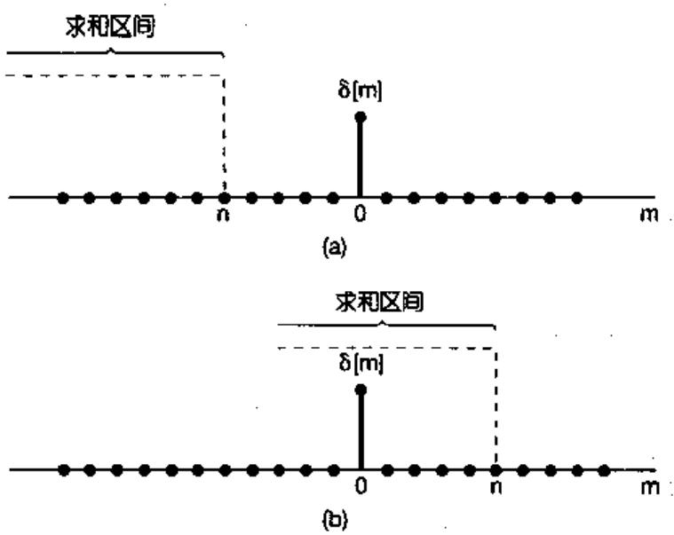

图1.31示出(1.67)式的关系。这时,  $\delta [n - k]$  在  $\pmb{k}$  等于  $\pmb{n}$  时为非零,所以(1.67)式对  $n< 0$ 为0,而对  $\pmb{n}\geqslant 0$  为1。

(1.67)式的一种解释是可以把它看作是一些延时脉冲的叠加,也就是说将其看作是在  $\pmb{n} = 0$  发生的  $\delta [n]$  ,在  $\pmb{n} = \pmb{1}$  发生的  $\delta$ $[n - 1]$  ,以及在  $\pmb{n} = \pmb{2}$  发生的  $\delta [n - 2]$  …等等的和。在第2章将对这种解释作更直接的应用。

单位脉冲序列可以用于一个信号在 $\pmb{n} = \pmb{0}$  时的值的采样，因为  $\delta [n]$  仅在  $\pmb{n} = \pmb{0}$ 为非零值（等于1），所以有

$$
x[n]\delta [n] = x[0]\delta [n] \tag{1.68}
$$

更一般的情况是，若考虑发生在  $n = n_{0}$  处的单位脉冲  $\delta [n - n_{0}]$  ,那么就有

$$
x[n]\delta [n - n_{0}] = x[n_{0}]\delta [n - n_{0}]
$$

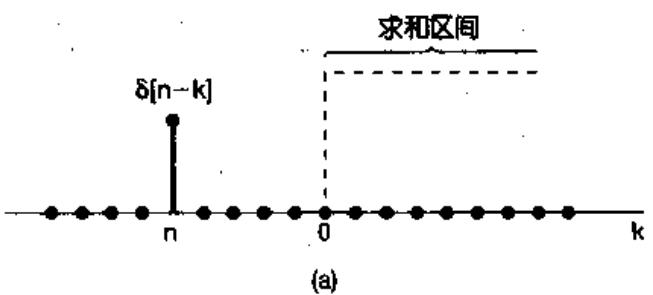

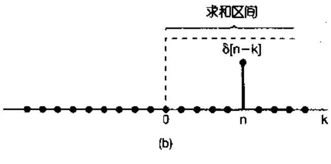

单位脉冲的这种采样性质在第2章和第7章中将起到重要的作用。

# 1.4.2 连续时间单位阶跃和单位冲激函数

与离散时间情况相类似，连续时间单位阶跃函数  $u\left(t\right)$  定义为

$$
u\left(t\right) = \left\{ \begin{array}{l l}{0\qquad t< 0}\\ {1\qquad t > 0} \end{array} \right. \tag{1.70}
$$

如图1.32所示。值得注意的是，单位阶跃在  $t = 0$ 这一点是不连续的。连续时间单位冲激函数  $\delta (t)$ 与单位阶跃的关系也和离散时间单位脉冲与单位阶跃函数之间的关系相类似，即连续时间单位阶跃是单位冲激的积分函数（running integral）

$$
u(t) = \int_{-\infty}^{t}\delta (\tau) \mathrm{d}\tau \tag{1.71}
$$

这就使人联想到  $\delta (t)$  和  $u(t)$  之间还有一种类似于(1.65)式这样的关系存在。根据(1.71)式，连续时间单位冲激能够看作连续时间单位阶跃的一次微分

$$
\delta (t) = \frac{\mathrm{d} u(t)}{\mathrm{d} t} \tag{1.72}
$$

与离散时间情况相比，利用（1.72）式来表示单位冲激函数存在一些困难，这是因为  $u\left(t\right)$  在  $t = 0$ 是不连续的，因此正规来讲是不可微的。然而，可以考虑把（1.72）式解释成图1.33所示信号  $u_{\Delta}(t)$

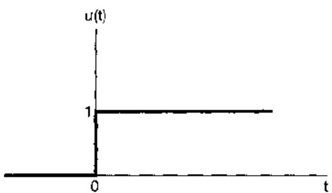

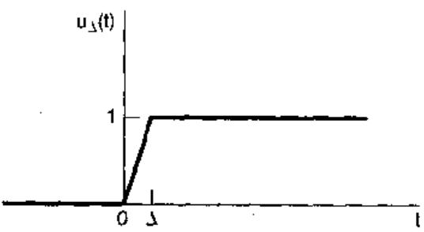

的  $\rightharpoonup$  种近似,这里  $u_{\Delta}(t)$  从0 到1 是在一个较短的时间间隔  $\Delta$ 内完成的。很自然,瞬时变化的单位阶跃可以看作为  $u_{\Delta}(t)$  的一种理想化的结果,因为  $\Delta$  是这样的短暂以致于对任何实际问题来说无关紧要。正规地说,  $u\left(t\right)$  是当  $\Delta \to 0$  时,  $u_{\Delta}(t)$  的极限。现在来考虑这一导数

$$
\delta_{\Delta}(t) = \frac{\mathrm{d}u_{\Delta}(t)}{\mathrm{d}t} \tag{1.73}
$$

如图1.34所示。

注意到  $\delta_{\Delta}(t)$  是一个持续期为  $\Delta$  的短脉冲，而且对任何  $\Delta$ 值，其面积都为1。随着  $\Delta \to 0,\delta_{\Delta}(t)$  变得愈来愈窄，愈来愈高，但始终保持单位面积。它的极限形式

$$
\delta (t) = \lim_{\Delta \to 0}\delta_{\Delta}(t) \tag{1.74}
$$

就能看作  $\Delta$  变成无穷小后，短脉冲  $\delta_{\Delta}(t)$  的一种理想化的结果。事实上，因为  $\delta (t)$  没有持续期，但有面积，因此就用图1.35的符号，用在  $t = 0$  处箭头指出脉冲的面积是集中在  $t = 0$  ，用箭头旁边的高度“1”来表示该冲激的面积，称为冲激强度。更为一般地， $k\delta (t)$  的面积就是  $k$  ，因此有

$$
\int_{-\infty}^{t}k\delta (\tau)\mathrm{d}\tau = k u(t)
$$

如图1.36所示，箭头的高度选为正比于冲激的面积。

和离散时间情况- - 样，（1.71）式的积分可以用图1.37来说

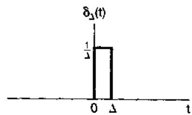

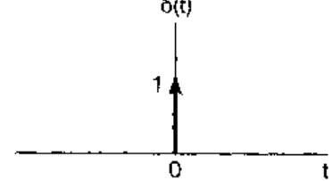

明。因为连续时间单位冲激  $\delta (\tau)$  的面积是集中在  $\tau = 0$  的,因此这个积分从  $- \infty$  开始到  $t< 0$  都是  $0, t > 0$  时则为1。与离散时间(1.67)式相类似,若把(1.71)式的积分变量  $\tau$  置换为  $\sigma = t - \tau$  ,就可以将连续时间单位阶跃和单位冲激函数之间的关系表示成另一种形式,即

$u(t) = \int_{-\infty}^{t}\delta (\tau) \mathrm{d}\tau = \int_{-\infty}^{0}\delta (t - \sigma)(- \mathrm{d}\sigma)$  或等效为

$$
u(t) = \int_{0}^{\infty}\delta (t - \sigma) \mathrm{d}\sigma \tag{1.75}
$$

$u(t)$  和  $\delta (t)$  之间的关系可用图1.38来说明。图为在这种情况下  $\delta (t - \sigma)$  的面积集中于  $\sigma = t$  的点上,因此,(1.75)式的积分对于  $t< 0$  是0,而在  $t > 0$  是1。这种把单位冲激特性在积分意义下给予的图解说明在第2章的讨论中极为有用。

和离散时间单位脉冲函数一样,连续时间冲激函数也具有一个很重要的采样性质。尤其是,有许多理由认为,考虑一个冲激和一些常规连续时间函数  $x(t)$  的乘积是很重要的。这个乘积是最容易按照(1.74)式  $\delta (t)$  的定义来给予说明的,具体来说,考虑下式

$$
x_{1}(t) = x(t) \delta_{\Delta}(t)
$$

在图1.39(a)中已经画出了这两个时间函数  $x(t)$  和  $\delta_{\Delta}(t)$ ,图1.39(b)是乘积的非零部分经过放大的结果。虽然在  $0 \leqslant t \leqslant \Delta$  以外, $x_{1}(t) = 0$ 。现在若  $\Delta$  足够小,以使得  $x(t)$  在  $\Delta$  内可以近似认为是一常数  $x(0)$ ,则有

$$
x(t) \delta_{\Delta}(t) \approx x(0) \delta_{\Delta}(t)
$$

因为  $\delta (t)$  是  $\Delta \rightarrow 0$  时  $\delta_{\Delta}(t)$  的极限,所以有

$$
x(t) \delta (t) = x(0) \delta (t) \tag{1.76}
$$

同理,对出现在任意一点(例如  $t_{0}$  )的冲激应该有一个类似的表示式为

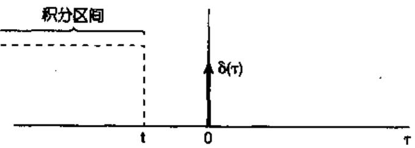  
(a)

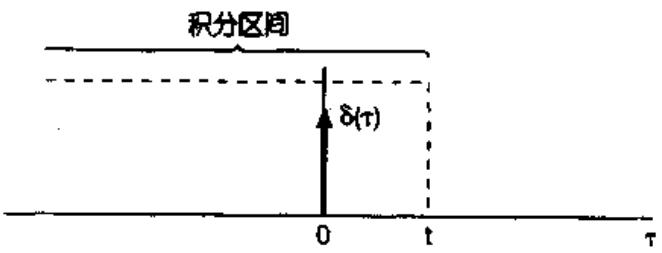  
(b)

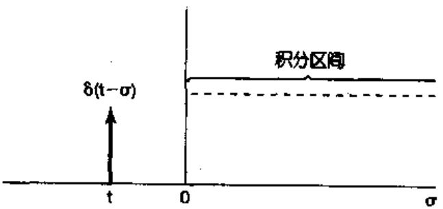  
图1.37（1.71）式的积分：（a）t<0；（b）t>0

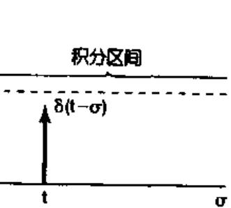  
(b) 图1.38 (1.75)式的积分：(a)  $t< 0$  ;(b)  $t > 0$

$$
x(t) \delta (t - t_{0}) = x(t_{0}) \delta (t - t_{0})
$$

虽然在这一节有关单位冲激函数的讨论多少有些不太正规,但是却给出了这个信号的一些重要的直观形象;而这些在本书自始至终都是很有用的。正如我们已经说过的,单位冲激函数应该把它看成是一种理想化的东西。在2.5节将会更为详细地讨论和说明。任何真实的物理系统都含有惯性存在,因此不可能对输入作出瞬时的响应。这样,如果一个足够窄的脉冲是加到这样的系统上的话,该系统的响应不会受脉冲持续期或脉冲的形状细节有明显的影响,于是,所关注的脉冲的主要特性就是该脉冲一种总的综合效果,也就是它的面积。对于那些比其它系统响应快得多的系统,脉冲就必须具有更短的持续期,以达到脉冲形状的细节或

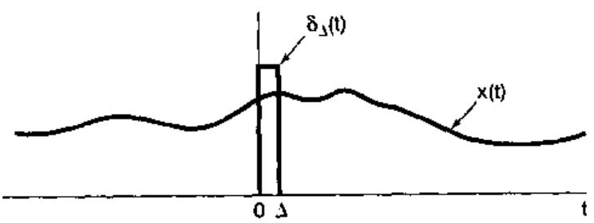  
(a)

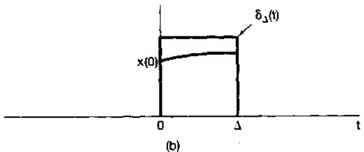  
图1.39 乘积  $x(t) \delta_{\Delta}(t)$

(a)两个相乘函数的图；(b)乘积非零部分的放大

图1.39 乘积  $x(t) \delta_{\Delta}(t)$ (a) 两个相乘函数的图;(b) 乘积非零部分的放大者它的持续期不再起作用为止。对任何物理系统来说,总是可以找到一个"足够窄"的脉冲。这样,单位冲激就是这一概念的理想化结果,即对任何系统来说都是足够窄的那么一个脉冲。在第2章将会看到,一个系统对这个理想化脉冲的响应在信号与系统分析中起着关键的作用,并且在建立和理解这一作用的过程中,对它将会有更进一步的认识①。

例1.7研究一下图1.40(a)中的不连续信号  $x(t)$  。由于连续时间单位冲激和单位阶跃之间的关系,可以很容易地算出并画出该信号的导数。具体一点就是  $x(t)$  的导数除了在那些不连续点外明显地都是0。在单位阶跃的情况下,由(1.72)式已得出,在不连续点的微分就引起一个单位冲激。另外,将(1.72)式两边都乘以任意数  $k$  ,可见大小为  $k$  的阶跃的微分将在不连续点得到面积为  $k$  的冲激。这一规律对任何在不连续点跃变的信号都成立,就像图1.40(a)那样的信号  $x(t)$  。这样就能画出导数  $x(t)$  如图1.40(b)所示,这里冲激是位于  $x(t)$  的每一个不连续点处,面积就是跃变的大小。例如在  $t = 2$  这一点  $x(t)$  的跃变值是  $- 3$  ,所以在  $\dot{x} (t)$  的  $t = 2$  处的冲激就标以  $- 3$  。

作为一种结果的验证,可以证明能够从  $\dot{x} (t)$  将  $x(t)$  恢复出来。因为  $x(t)$  和  $\dot{x} (t)$  在  $t \leqslant 0$  都是0,所以仅需要对  $t > 0$  进行验证,

$$
x(t) = \int_{0}^{1} \dot{x} (t) \mathrm{d}t \tag{1.77}
$$

如图1.40(c)所示,对  $t < 1$ , (1.77)式右边的积分等于0, 因为在这段积分区间内没有任何冲激。对于  $1 < t < 2$ , 第一个冲激(位于  $t = 1$ )在该积分区间内, 所以(1.77)式的积分就等于2(该冲激的面积)。

对于  $2< t< 4$  头两个冲激是在这个积分区间内,积分就是累加了它们两个面积的和,即  $2 - 3 = - 1$  。最后,对于  $t > 4$  ,全部三个冲激都在该积分区间内,积分就等于这三个面积的和,即  $2 - 3 + 2 = 1$  。这个结果与图1.40(a)的  $x(t)$  是完全一样的。

# 1.5 连续时间和离散

# 时间系统

从广义的角度上来看,具体的系统都是一些元件、器件或子系统的互联。从信号处理及通信到电机、各种机动车和化学处理工厂等这些方面来说,一个系统可以看作是一个过程,在其中输入信号被该系统所变换,或者说系统以某种方式对信号作出响应。例如,一个高保真度的音频信号录制系统对输入音频信号进行录制,并重现原输入信号。如果该系统具有音调控制功能的话,那么我们就可以通过音调控制来改变被录制信号的整体质量。类似地,图1.1的电路也能看作是一个系统,其输入电压是  $v_{s}(t)$ ,输出电压是  $v_{t}(t)$ ;而图1.2也能认为是输入为  $f(t)$ ,输出为汽车速度  $v(t)$  的这样一个系统。一个图象增强系统也就是变换一幅输入图象以使得输出图象具有某些所需要性质的系统,如增强图象对比度等。

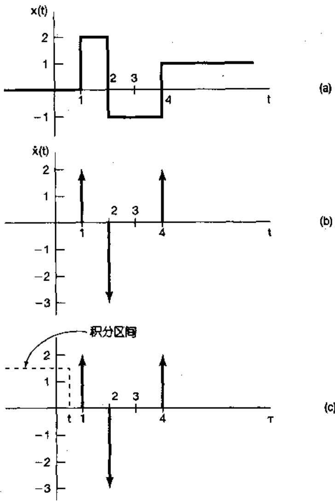

以使得输出图象具有某些所需要性质的系统,如增强图象对比度等。

一个连续时间系统是这样的系统,输入该系统的信号是连续时间信号,系统产生的输出也是连续时间信号。这样的系统可用图1.41(a)来表示,图中  $x(t)$  是输入,而  $y(t)$  是输出,所以也常常用下面符号来表示连续时间系统的输入- 输出关系为

$$
x(t) \rightarrow y(t) \tag{1.78}
$$

同样,一个离散时间系统就是将离散时间输入信号变换为离散时间输出信号,可以用图1.41(b)来表示,也可以用下面符号来代表输入- 输出关系

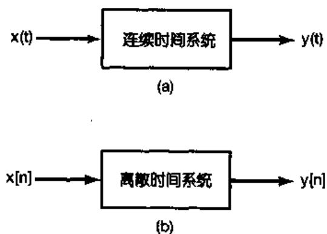  
图1.41（a）连续时间系统；（b）离散时间系统

$$
x[n]\rightarrow y[n] \tag{1.79}
$$

本书大部分都将分别但是并行地讨论这两种系统。到第7章通过采样的概念再把这两种系统结合起来,并研究用离散时间系统来处理已被采样过的连续时间信号的若干细节问题。

# 1.5.1 简单系统举例

要建立分析和设计系统的一般方法的最重要根据之一就是:很多不同应用场合的系统都具有非常类似的数学描述形式。为了说明这一点,来看几个简单的例子。

例1.8 考虑图1.1的RC电路。如果把  $v_{s}(t)$  当作输入,  $v_{c}(t)$  看作输出的话,那么就可以用简单的电路分析方法来导出描述输出和输入之间关系的方程。这就是根据欧姆定律,流经电阻的电流  $i(t)$  是正比于跨在该电阻上的电压降(比例常数为  $1 / R$  ),即

$$
i(t) = \frac{v_{s}(t) - v_{c}(t)}{R} \tag{1.80}
$$

类似地,根据定律一个电容器的基本关系,可以将电流  $i(t)$  与电容器上电压的变化率联系起来,即

$$
i(t) = C \frac{\mathrm{d}v_{c}(t)}{\mathrm{d}t} \tag{1.81}
$$

令(1.80)式和(1.81)式右边相等,就得出描述输入  $v_{s}(t)$  和输出  $v_{c}(t)$  之间关系的微分方程为

$$
\frac{\mathrm{d}v_{c}(t)}{\mathrm{d}t} + \frac{1}{RC} v_{c}(t) = \frac{1}{RC} v_{s}(t) \tag{1.82}
$$

例1.9 考虑图1.2,其中将力  $f(t)$  当作输入,速度  $v(t)$  作为输出。若令  $m$  记作汽车的质量,  $\rho v$  为由于摩擦而产生的阻力,那么令加速度(也就是速度的时间导数)与净力被质量相除后相等,就得

$$
\frac{\mathrm{d}v(t)}{\mathrm{d}t} = \frac{1}{m} [f(t) - \rho v(t)] \tag{1.83}
$$

也即

$$
\frac{\mathrm{d}v(t)}{\mathrm{d}t} + \frac{\rho}{m} v(t) = \frac{1}{m} f(t) \tag{1.84}
$$

比较一下上面两个例子中的(1.82)式和1.84)式,可以看到,对于这两个很不相同的物理系统,联系它们输入- 输出关系的这两个方程却基本上是一样的,它们都是一阶线性微分方程

$$
\frac{\mathrm{d}v(t)}{\mathrm{d}t} + ay(t) = bx(t) \tag{1.85}
$$

的两个例子,其中  $x(t)$  是输入,  $y(t)$  是输出,  $a$  和  $b$  都是常数。这就是一个很简单的例子来阐明这一点,即需要建立分析由(1.85)式所代表的这样一类系统的方法,并且能够在更为广泛的应用中利用它们。

例1.10 作为离散时间系统一个简单例子,考虑某一银行户头按月结余的一个简单模型。令  $y[n]$  记作第  $n$  个月末的结余,假设  $y[n]$  按月依下列方程变化

$$
y[n] = 1.01y[n - 1] + x[n] \tag{1.86}
$$

或者写为

$$
y[n] - 1.01y[n - 1] = x[n] \tag{1.87}
$$

式中  $x[n]$  代表第  $\pmb{n}$  个月当中的净存款（也就是存款减去支取数），而  $1.01y[n - 1]$  则代表每月所增长的利息  $1\%$  。

例1.11作为第二个例子,考虑(1.84)式微分方程的一种简单数字仿真,其中将时间分解成长度为  $\Delta$  的离散间隔,并且用一阶后向差分

$$
v(n\Delta) - v((n - 1)\Delta)
$$

来近似在  $\pmb {\epsilon} = \pmb{n}\Delta$  的  $\mathrm{d}\pmb {v}(t) / \mathrm{d}t$  。这时,若令  $y[n] = v(n\Delta),f[n] = f(n\Delta)$  ,那么关联该采样信号 $f[n]$  和  $v[n]$  的离散时间模型就是

$$
v[n] - \frac{m}{(m + \rho\Delta)} v[n - 1] = \frac{\Delta}{(m + \rho\Delta)} f[n] \tag{1.88}
$$

比较(1.87)式和(1.88)式可见，它们就是下列一阶线性差分方程的两个例子，即

$$
y[n] + ay[n - 1] = bx[n] \tag{1.89}
$$

如同以上例子所表明的，来自各种应用领域的系统，它们的数学描述往往具有惊人的共性；而且，正是由于这一点，为求在信号与系统分析中建立广为适用的方法提供了强大的动力。实现这一任务的关键是要鉴别出一类系统，这类系统应具备两个重要特性：（1）属于这一类的系统都具有一些性质和结构，通过它们可对系统的行为作出透彻地了解，并能对系统的分析建立起有效的方法；（2）很多实际上重要的系统都可以利用这一类系统准确地建模。本书大部分所集中研究的，并针对称之为线性时不变系统这样一个特殊类别的系统所建立的方法，就属于上面所提到的第一个特性方面的问题。在下一节，将介绍用于表征这类系统的这些性质，以及其它几个很重要的基本系统性质。

实际上，对任何系统分析技术来说要是具有实用价值的话，那么上面提到的第二个特性明显地就是重要的了。值得庆幸地是，范围广泛的实际系统（包括例1.8 到例1.10 的系统）都可以用本书集中讨论的这类系统来很好地建模。然而，至关重要的一点是，用于描述或分析一个实际系统的任何模型都是代表了那个系统的一种理想化的情况，由此所得出的任何分析结果都仅仅是模型本身的结果。例如，（1.80）式所表示的一个电阻器和（1.81）式所表示的一个电容器的简单线性模型都是理想化的。然而，在很多应用中这些理想化对真正的电阻器和电容器来说都是相当准确的，因此只要这些电压和电流保持在工作条件范围以内，就不致于使得该线性模型失效，那么使用这样的理想化所作的分析还是给出了许多有用的结果和结论。类似地，用一个线性化的阻力来表示摩擦力效果，如（1.83）式所表示的，也是在某个有限范围内的一种近似。虽然，在本书中并不强调这一问题，重要的是要牢记，工程实际中一个基本问题就是在利用所建立的方法中要识别出加在一个模型上的假设的适用范围，并保证基于这个模型的任何分析或设计都没有违反这些假设。

# 1.5.2 系统的互联

在全书中所使用的一个重要概念就是系统的互联。很多实际系统都可以当作是几个子系统互联构成的。一个例子就是音频系统，它涉及到一台无线电接收机，带有一个放大器的唱片放唱机或磁带机和一个或几个扬声器的互联。另一个例子是一架数字控制的飞机，它是由该机体（用它的运动方程和影响它的空气动力学的各种力所描述的）、各种传感器（用于检测飞机

的各种变量,如加速度、旋转速率及航向等)、数字自动驾驶仪(对测得的变量和来自驾驶员的命令输入,如所要求的航线、高度和速度等作出反应)和各种飞机调节器(对来自自动驾驶仪提供的输入作出反应,以利用飞机的控制翼面,如方向舵、尾翼、副翼等来改变作用在飞机上的空气动力)等的互联。根据将这样一个系统看作它的各组成部分的互联,就可以利用各组成部分的系统特性,以及它们是如何互联的情况来分析整个系统的工作情况和特性表现。另外,借助于一些较简单系统的互联来描述一个系统还可以用一种有用的方式来综合出由这些较为简单的基本构造单元所组成的复杂系统。

虽然可以构造成各式各样的系统互联,但是有几种基本的形式是经常遇到的。两个系统的串联或级联如图1.42(a)所示,这样的图称之为方框图(block diagrams)。这里系统1的输出就是系统2的输入,而整个系统变换输入信号是首先由系统1处理,然后再由系统2处理。级联系统的一个例子就是一台无线电接收机,紧接着一个放大器。当然也可依此来定义三个或更多个系统的级联。

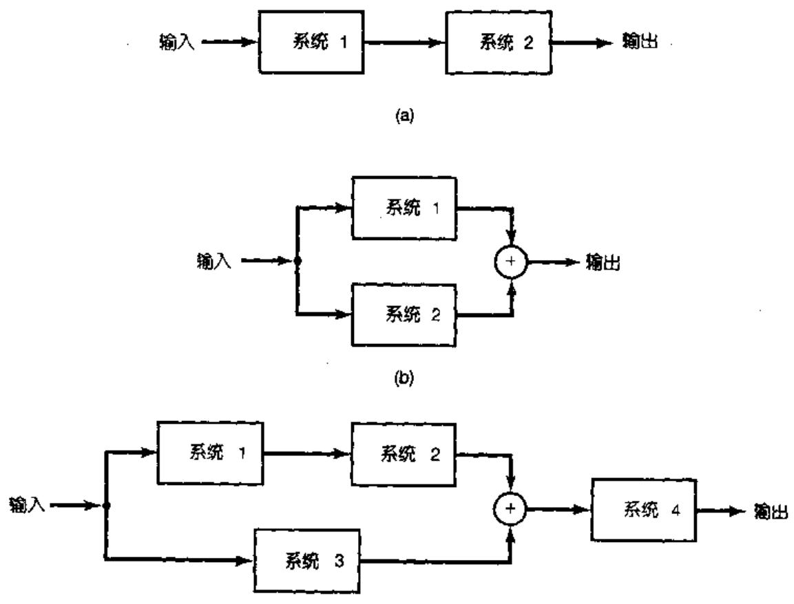

两个系统的并联如图1.42(b)所示,此时,系统1和系统2具有相同的输入。在图中的符号"⊕"记作相加,所以并联后的输出是系统1和2的输出之和。若干个拾音器共用一个放大器和扬声器系统的简单音频系统就是系统并联的一个例子。除了图1.42(b)所示的简单并联外,也能定义两个系统以上的并联,并且还能将级联和并联组合起来以得到更加复杂的互联。图1.42(c)示出其中一个例子①。

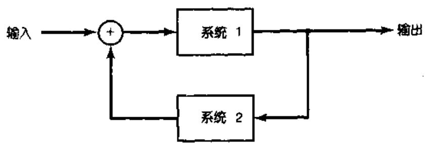

反馈联结是系统互联的另一种重要类型,图1.43 是一个例子。这里系统1 的输出是系统2 的输入,而系统2的输出又反馈回来与外加的输入信号一起组成系统1 的真正输入。反馈系统的应用极为广泛。例如汽车上的缓慢巡行控制系统检测汽车的速度并调节燃料量以保持车速在一个所要求的水平上。相类似,一架数字控制的飞机最为自然地认为是一个反馈系统,在其中真正的和所要求的速度、航向或高度之差经过自动驾驶仪被反馈回来以便校正这些偏差。另外,把电路看成是含有反馈互联也常常是很有用的。作为一个例子,考虑一下图1.44(a)的电路,这个电路可看成是两个电路元件的反馈互联,如图1.44(b)所示。

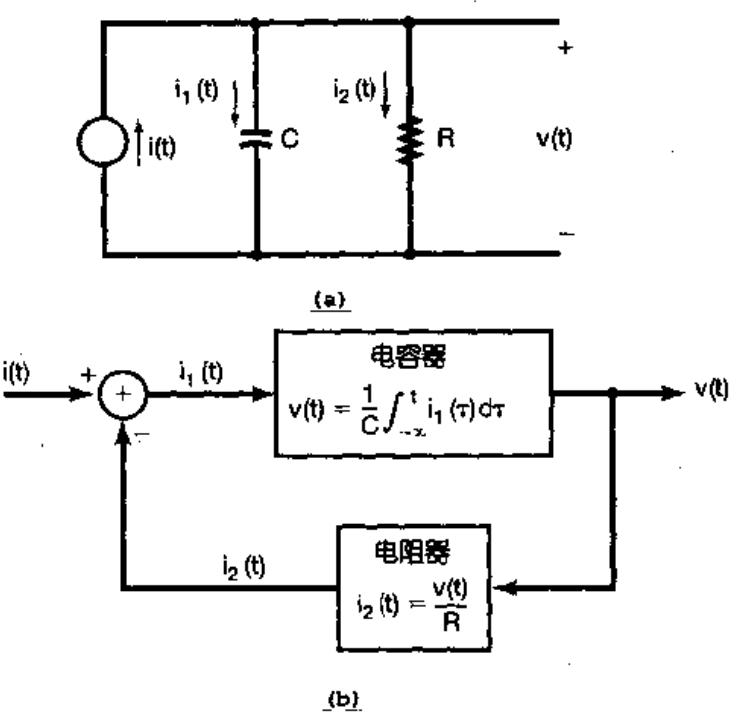

# 1.6 基本系统性质

这一节将介绍并讨论连续时间和离散时间系统的几个基本性质。这些性质具有重要的物理意义,并且利用已经建立的信号与系统的语言又具有相当简单的数学表达式。

# 1.6.1 记忆系统与无记忆系统

如果对自变量的每一个值,一个系统的输出仅仅决定于该时刻的输入,这个系统就称为无记忆系统。例如,由下面关系式所表达的系统:

$$
y[n] = (2x[n] - x^{2}[n])^{2} \tag{1.90}
$$

就是一个无记忆系统。因为在任何特定时刻  $\pmb{n}_{0}$  的输出  $y[n_{0}]$  仅仅决定于该时刻  $\pmb{n}_{0}$  的输入 $x[n_{0}]$  ,而与别的时刻值无关。一个电阻器也是一个无记忆系统,若把电流取作输入  $x(t)$  ,把电压当作输出  $y(t)$  ,则一个电阻器的输入- 输出关系为

$$
y(t) = R x(t) \tag{1.91}
$$

式中  $R$  是电阻器的电阻值。一种特别简单的无记忆系统是所谓恒等系统(identity system),系统的输出就等于输入。这就是说,对连续时间恒等系统而言,其输入- 输出关系就是

$$
y(t) = x(t)
$$

相应地在离散时间情况下就是

$$
y[n] = x[n]
$$

离散时间记忆系统的一个例子就是累加器或相加器

$$
y[n] = \sum_{k = -\infty}^{n}x[k] \tag{1.92}
$$

第二个例子就是一个延迟单元

$$
y[n] = x[n - 1] \tag{1.93}
$$

一个电容器是连续时间记忆系统的一个例子,因为如果输入是取电流,输出为电压的话,那么就有

$$
y(t) = \frac{1}{C}\int_{-\infty}^{t}x(\tau)\mathrm{d}\tau \tag{1.94}
$$

这里  $c$  是电容值。

大致来说,在一个系统中记忆的概念相应于该系统具有保留或存贮不是当前时刻输入信息的功能。例如,(1.93)式的单位延迟系统就必须保留或存贮输入的前一个值;由(1.92)式所表示的累加器就必须"记住"或存贮过去输入的全部信息。特别是:该累加器计算出全部输入的连续求和,直到当前时刻为止,因此该累加器在每一个瞬时都必须将当前的输入加到累计求和的前一个值上去。换句话说,一个累加器的输入和输出之间的关系能够表达如下式:

$$
y[n] = \sum_{k = -\infty}^{n - 1}x[k] + x[n] \tag{1.95}
$$

或等效为

$$
y[n] = y[n - 1] + x[n] \tag{1.96}
$$

在后面这种表示式中,为了得到当前时刻  $n$  的输出,累加器就必须记住以前输入值的连续求和,而这个就是累加器输出的前一个值。

在许多实际系统中,记忆是直接与能量的储存相联系的。例如,由(1.94)式所表示的电容器输入- 输出关系,存储的能量是以电流的积分所表示的累计电荷量。因此在例1.8和图1.1中的这个简单  $RC$  电路就具有存储在电容器中的记忆功能。同样,图1.2中的汽车也具有以储存动能形式的记忆功能。用计算机或数字微处理器实现的离散时间系统中,记忆是直接与具有保留各时钟脉冲之间值的那些移位寄存器相联系的。

虽然一个系统具有记忆的概念,一般总是使人想到存储过去的输入和输出值,但是我们所给出的定义也会导致把具有当前的输出与输入和输出的将来值有关的系统也称之为记忆系统!尽管,与将来值有关的系统可能一看就知道是不寻常的,但是事实上它们也形成了一类重要的系统,我们将在1.6.3节作进一步讨论。

# 1.6.2 可逆性与可逆系统

一个系统如果在不同的输入下,导致不同的输出,就称该系统是可逆的。如果一个系统是可逆的,那么就有一个逆系统存在,当该逆系统与原系统级联后,就会产生一个输出  $w[n]$  等于第一个系统的输入  $x[n]$ ,在离散时间下就如图1.45(a)所示。由此,图1.45(a)的级联系统

就有一个总的输入一输出关系与恒等系统是一样的。

可逆连续时间系统的一个例子是

$$
y(t) = 2x(t) \tag{1.97}
$$

该可逆系统的逆系统是

$$
w(t) = \frac{1}{2} y(t) \tag{1.98}
$$

这个例子如图1.45(b)所示。可逆系统的另一个例子是由(1.92)式所表示的累加器,该系统任意两个相邻的输出值之差就是最后的输入值,即  $y[n] - y[n - 1] = x[n]$ ,因此,其逆系统就是

$$
w[n] = y[n] - y[n - 1] \tag{1.99}
$$

如图1.45(c)所示。

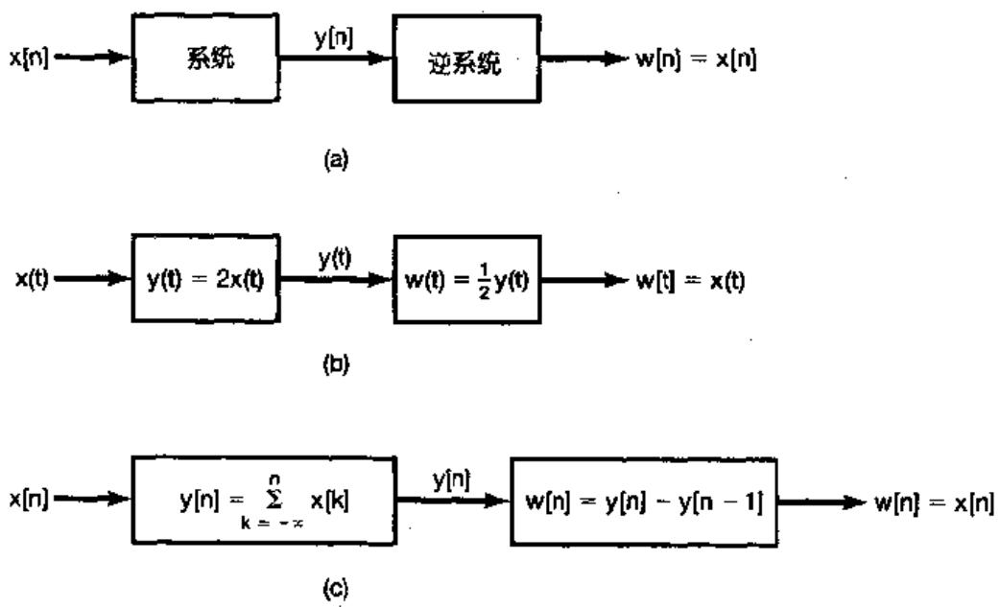

不可逆系统的例子,如

$$
y[n] = 0 \tag{1.100}
$$

即该系统对任何输入序列来说都产生零输出序列,以及

$$
y(t) = x^{2}(t) \tag{1.101}
$$

这时,我们无法根据输出来确定输入的正负号。

可逆性的概念在很多领域是一个重要的概念。一个例子就是在各种通信应用中所用到的编码系统,在这样的系统中,所欲传送的信号是首先加到称之为编码器的系统上作为它的输入。有许多理由要这样做,像想要给原始消息加密以提高安全性或保密通信,在信号中提供某些冗余度(例如附加上奇偶校验码),以使得发生在传输过程中的误差能被检测出来,以及可能还会被校正过来等等。对于无损失编码来说,编码器的输入必须要从输出中完全准确无误地恢复出来,这就是说,该编码器必须是可逆的。

# 1.6.3 因果性

如果一个系统在任何时刻的输出只决定于现在的输入以及过去的输入，该系统就称为因果系统。这样的系统往往也称之为不可预测的系统，因为系统的输出无法预测未来的输入值。因此，对一个因果系统若两个输入直到某一个时间  $\pmb{\ell_{0}}$  或  $\pmb{n_{0}}$  以前都是相同的话，那么在这间一时间以前相应的输出也一定相等。图1.1的  $R C$  电路是因果的，因为电容器上的电压仅对现在的和过去的源电压值作出反应。同样，一部汽车的运动是因果的，因为汽车运动无法预知驾驶员将来的行动。由（1.92）式到（1.94）式描述的系统也都是因果的，但是由

$$
y[n] = x[n] - x[n + 1] \tag{1.102}
$$

和

$$
y(t) = x(t + 1)
$$

定义的系统都是非因果的。所有的无记忆系统都是因果的，因为输出仅仅对当前的输入值作出响应。

虽然因果系统是很重要，但这并不说明所有具有实际意义的系统都是仅由因果系统构成的。例如，在独立变量不是时间的应用中（如图像处理），因果性往往不是一个根本性的限制。另外，在一些数据处理系统中，待处理的数据事先都已记录下来了，这些情况在语音处理、地球物理学及气象学中的信号都常常是这样，在这种情况下决不会一定要局限用因果系统来处理这些数据。作为另一个例子，在很多应用中（其中包括股票市场分析和人口统计学的研究），关注的是某个数据的慢变化趋势，但在这个总的变化趋势中也包含有一些高频起伏。在这种情况下，为了仅仅保留总的变化趋势通常所采用的办法是，在某一段时间间隔内对这些数据取平均以平滑掉这些高频起伏部分。一个非因果的平滑系统的例子就是

$$
y[n] = \frac{1}{2M + 1}\sum_{k = -M}^{M}x[n - k] \tag{1.104}
$$

例1.12当检验一个系统的因果性时，重要的是要仔细看一下系统的输入- 输出关系。为了说明其中涉及的若干问题，我们来检验两个特殊系统的因果性。

第一个系统定义为

$$
y[n] = x[- - n] \tag{1.105}
$$

注意到，在某个正的时刻  $\pmb{n}_{0}$  的输出  $y[n_{0}]$  仅仅决定于输入在时刻  $(- \pi_{0})$  的值  $\left\{x\left[ \begin{array}{l}{- \pi_{0}} \end{array} \right],\left( \begin{array}{l}{- \pi_{0}} \end{array} \right)\right.$ 是负的，因此属于  $\pmb{n}_{0}$  的过去时刻，这时可能要得出所给系统是因果的结论。然而，我们应该总是要仔细地检验在全部时间上的输入- 输出关系，对于  $\pmb {n}< 0$  ，如  $\pmb {n} = - 4$  ，那么  $y[- 4] = x[4]$  ，所以在这一时间上输出就与输入的将来值有关。因此，系统不是因果的。

在检验系统因果性时，另一点也是很重要的，这就是要把输入信号的影响仔细地从在系统定义中所用到的其它函数的影响区分开来。例如，考虑如下系统：

$$
y(t) = x(t)\cos (t + 1) \tag{1.106}
$$

在这个系统中，任何时刻  $\pmb{\tau}$  的输出等于在同一时刻的输入再乘以一个随时间变化的数。具体说来，可将(1.106)试重写成

$$
y(t) = x(t)g(t)
$$

式中  $g(t)$  是一个时变函数,即  $g(t) = \cos (t + 1)$  。因此,仅仅是输入  $x(t)$  的当前值影响了输出 $y(t)$  的当前值,可以得出该系统是因果的(事实上还是无记忆的)。

# 1.6.4 稳定性

稳定性是另一个重要的系统性质。直观上看,一个稳定系统在小的输入下的响应是不会发散的。例如,考虑一下示于图1.46(a)的这个单摆,其中  $x(t)$  是外加力作为输入,输出是相对于垂直方向的角度偏移  $y(t)$  。在这种情况下,重力施加一种恢复力总是企图要把单摆拉回到垂直位置,而由于阻力所引起的摩擦损耗又力图要使单摆摆动减慢下来,这样一来,如果加入一个小的力  $x(t)$  的话,那么离开垂直方向的偏离也不会大。与此相比,再看看图1.46(b)中倒立摆的情况,此时重力的效果是施加一个力使得偏离垂直方向的角度增加,这样,一个小的外加力会导致一个大的垂直偏移,最后引起倒立摆塌倒,尽管这时由于摩擦也有阻力存在。

示于图1.46(a)的系统是稳定系统的一个例子,而图1.46(b)则是不稳定系统的例子。链锁反应的模型,在无限制供给食物并在没有任何食肉类动物存在的条件下所得出的生物种群的增长模型都是不稳定系统的例子,因为系统响应在小的输入下无界的增长。另一个不稳定系统的例子是示于(1.86)式的某个银行户头结余的模型,因为如果最初存了一笔款(即  $x[0] =$  一个正数),并且以后都不支取,由于计及复利的关系,那么存款将按月无界地增长。

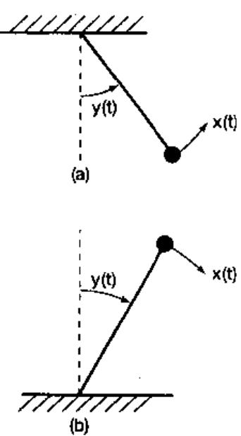  
图1.46（a）稳定的单摆；（b）不稳定的倒立摆

稳定系统的例子也很多。实际系统的稳定性一般来说都是由于存在能量消耗的原因。例如,假设例1.8简单RC电路中都是正的元件值,电阻要消耗能量,这个电路就是一个稳定的系统;例1.9的系统由于通过摩擦要消耗能量,所以也是稳定的。

以上这些例子只是给出了一个有关稳定性概念的直观认识。正规一些,系统的稳定性可以这样来定义:一个稳定系统,若其输入是有界的(即输入的幅度不是无界增长的),则系统的输出也必须是有界的,因此不可能发散。这就是我们在全书中所使用的稳定性定义。例如,若在图1.2的汽车上施加一个恒定不变的力  $f(t) = F$  ,汽车最初是静止的。这时汽车的速度要增加,但不是无界的,因为摩擦引起的阻力也随速度而增加。事实上,速度将一直增加到摩擦力与外加力相等为止。所以由(1.84)式可见最终的速度  $V$  必须满足

$$
{\frac{\rho}{m}}V={\frac{1}{m}}F \tag{107}
$$

也即

$$
V = \frac{F}{\rho} \tag{108}
$$

作为另一个例子,考虑一下由(1.104)式所定义的离散时间系统,假设输入  $x[n]$  是有界的,其界为  $B$  (对全部  $n$  来说),那么  $y[n]$  的最大可能幅度也就是  $B$  ,因为  $y[n]$  是某一段输入值的平均。因此  $y[n]$  是有界的,该系统就是稳定的。另一方面,我们再考虑一下由(1.92)式所表示的累加器,和(1.104)式的系统不一样,这个系统是要将所有的输入过去值相加,而不是只加一段有限值。因为这个和即使在  $x[n]$  是有界之下也会继续不断地增加,所以系统是不稳定的。例如,若输入到该累加器是单位阶跃  $u[n]$  ,输出就是

$$
y[n] = \sum_{k = -\infty}^{n}u[k] = (n + 1)u[n]
$$

也即  $y[0] = 1$  ，  $y[1] = 2$  ，  $y[2] = 3$  一直下去，  $y[n]$  无界增长。

例1.13如果怀疑某一系统是不稳定的话，那么一种实用的办法是力图找一个特别的有界输入是否会导致一个无界的输出来确认它，若找到了这样一个例子就能够得出该系统是不稳定的。如果这样例子不存在或者找起来很困难，那么就必须用一种方法来检验它的稳定性，不过这时就不能再用某些特殊输入信号的例子。为了说明这种办法，检验- - 下以下两个系统的稳定性：

$$
S_{1}:y(t) = t x(t) \tag{1.109}
$$

和

$$
S_{2}:y(t) = e^{r(t)} \tag{1.110}
$$

在寻找一个特殊的反例来证明系统不是稳定的，可以试图用一个常数或阶跃输入这样的简单有界输入来试试。对于由（1.109）式表示的系统  $\mathbf{S}_{1}$  ，当恒定输入  $x(t) = 1$  时，  $y(t) = t$  ，这就是无界的，因为不管取什么样的常数为界，  $|y(t)|$  在某个  $\pmb{t}$  时都会超过这个界，因此得出：  $\mathbf{S}_{1}$  是不稳定的。对于系统  $\mathbf{S}_{2}$  或许可能是稳定的，我们就不可能找到一个有界的输入而产生一个无界的输出，所以就得按在所有有界输入下都产生有界输出的办法来确认它。令  $B$  为一任意正数，并令  $x(t)$  是被 $H$  所界定的某任意信号，也就是说并没有对  $x(t)$  作任何假设，只要对全部  $\pmb{t}$  都有

$$
\mid x(t)\mid < B \tag{1.111}
$$

或

$$
-B< x(t)< B \tag{1.112}
$$

即可。利用  $\mathbf{S}_{2}$  的定义(1.110)式就能看出，若  $x(t)$  满足(1.111)式，那么  $y(t)$  就一定满足

$$
\mathbf{e}^{-B}< \mid y(t) \mid < \mathbf{e}^{B} \tag{1.113}
$$

于是得到：若  $\mathbf{S}_{2}$  的任何输入是被某一任意正数  $B$  所界定的话，那么相应的输出就保证界定在  $\mathbf{e}^{B}$ 所以  $\mathbf{S}_{2}$  是稳定的。

到目前为止这一节所介绍的几个系统性质及概念都是非常重要的,并且还将在本书的稍后作详细的讨论。然而,还剩下有两个另外的性质,即时不变性和线性性质,在本书的后续各章中将起到特别重要的作用,在本节的余下部分将对这两个很重要的概念给予介绍并作初步讨论。

# 1.6.5 时不变性

从概念上来讲,若系统的特性行为不随时间而变,该系统就是时不变的。例如,如果图1.1 的  $R C$  电路其  $R$  和  $C$  的值不随时间而变,它就是时不变的。我们会预期到:今天用这个电路做一个实验所取得的结果与明天来做同一个实验所取得的结果是相同的。另一方面,若  $\pmb{R}$ 和  $C$  的值随时间变化或波动,那么实验的结果就会与什么时间做这个实验有关了。同样,如果图1.2 中的摩擦系数  $B$  和汽车质量  $m$  是不变的,那么汽车的响应特性与何时驾驶它是无关的。另一方面,如果有一天给自动行李车装了很重的箱子,也就是增加了  $m$  ,当然会预计到与在负荷不重时比较车子的特性行为会是很不一样的。

时不变性质可以很简单地用已经介绍过的信号与系统的语言来描述。这就是,如果在输入信号上有- - 个时移,而在输出信号中产生同样的时移,那么这个系统就是时不变的;也就是说,若  $y[n]$  是一个离散时间时不变系统在输入为  $x[n]$  时的输出,那么当输入为  $x[n - n_{0}]$  时输出就为  $y[n - n_{0}]$  。在连续时间情况下,  $y(t)$  是相应于输入为  $x(t)$  时的输出,- - 个时不变

系统就一定有当输人为  $x\left(t - t_{0}\right)$  时，输出为  $y(t - t_{0})$  的结果。

为了看看如何来判定一个系统是否是时不变的，以便对该性质有更深的了解，我们来讨论以下几个例子：

例1.14 考虑一个连续时间系统，定义如下：

$$
y(t) = sin[x(t)] \tag{1.114}
$$

为了确认这个系统是时不变的，就必须判定对于任何输入和任何时移  $t_{0}$  ，时不变性是否成立。为此，令  $x_{1}(t)$  是系统的任一输入，并令

$$
y_{1}(t) = \sin [x_{1}(t)] \tag{1.115}
$$

是其相应的输出。然后，考虑将  $x_{1}(t)$  时移作为第二个输入：

$$
x_{2}(t) = x_{1}(t - t_{0}) \tag{1.116}
$$

对于这个输入的输出是

$$
y_{2}(t) = \sin [x_{2}(t)] = \sin [x_{1}(t - t_{0})] \tag{1.117}
$$

根据(1.115)式有

$$
y_{1}(t - t_{0}) = \sin [x_{1}(t - t_{0})] \tag{1.118}
$$

比较一下(1.117)式和(1.118)式，就可以得到  $y_{2}(t) = y_{1}(t - t_{0})$  ，因此这个系统是时不变的。

例1.15 作为第二个例子，考虑如下离散时间系统：

$$
y[n] = n x[n] \tag{1.119}
$$

这是一个时变系统，采用上面例子那样的正规步骤就能证明它（见习题1.28）。然而，当怀疑一个系统是时变的话，通常采用的办法是找一个反例，也就是根据直观认识，找一个输入信号让时不变的条件不成立。特别是这个例子的系统代表的是一个具有时变增益的系统。譬如，若已知当前的输入值是1，不知道当前的时刻，就不能确定当前的输出是多少。

考虑输入信号  $x_{1}[n] = \delta [n]$  输出  $y_{1}[n]$  就恒为0(因为  $n\delta [n] = 0)$  ，然而当输入  $x_{2}[n] = \delta [n-$ 1]时，输出  $y_{2}[n] = n\delta [n - 1] = \delta [n - 1]$  。因此，当  $x_{2}[n]$  是  $x_{1}[n]$  的时移时，  $y_{2}[n]$  并不是 $y_{1}[n]$  的时移。

上面这个例子，由于系统有一个时变的增益，其结果就是一个时变的系统，而（1.97）式的系统有一个常数的增益，它就是时不变的，由（1.91）式到（1.104）式所给出的系统都是时不变系统的例子，下面再说明一个时变系统的例子。

# 例1.16 考虑这个系统

$$
y(t) = x(2t) \tag{1.120}
$$

这个系统代表一个时间上的尺度变换，也就是说  $y(t)$  是  $x(t)$  的时间压缩（压缩因子是2）。直观上看，任何在输入上时时移都会受到一个因子2 的压缩，这样一来这个系统就不是时不变的。为了用一个反例来说明这一点，考虑输入  $x_{1}(t)$  如图1.47(a)所示，结果  $y_{1}(t)$  就为图1.47(b)所示。若将输入时移2，即  $x_{2}(t) = x_{1}(t - 2)$  ，如图1.47(c)所示，所得到的输出  $y_{2}(t) = x_{2}(2t)$  就是图1.47(d)。比较一下图1.47(d)和(e)，可见  $y_{2}(t)\neq y_{1}(t - 2)$  ，所以这个系统不是时不变的。（事实上，  $y_{2}(t) = y_{1}(t - 1)$  ，由于系统所产生的时间压缩，输出的时移仅有时不变时应该有的一半大)。

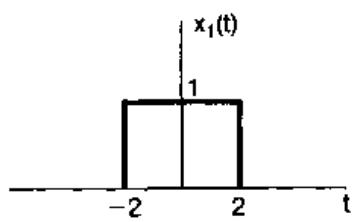  
(a)

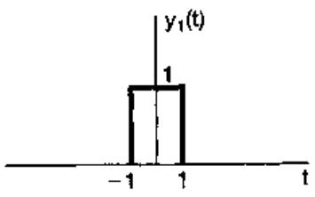  
(b)

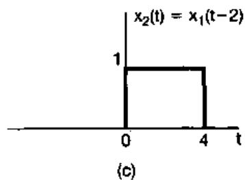

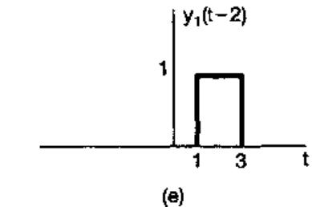  
图1.47 (a)例1.16中的系统输入  $x_{1}(t)$ ; (b)对应于  $x_{1}(t)$  的输出  $y_{1}(t)$ ; (c)经移位的输入  $y_{2}(t) = x_{1}(t - 2)$ ; (d)对应于  $x_{2}(t)$  的输出  $y_{2}(t)$ ; (e)移位信号  $y_{2}(t - 2)$  注意:  $y_{2}(t) \neq y_{1}(t - 2)$ , 说明该系统不是时不变的

# 1.6.6 线性

线性系统(连续时间或离散时间)具有一个很重要的性质就是叠加性质,即:如果某一个输入是由几个信号的加权和组成的话,那么输出也就是系统对这组信号中每一个的响应的加权和。更准确地说,令  $y_{1}(t)$  是一个连续时间系统对  $x_{1}(t)$  的响应,而  $y_{2}(t)$  是对应于  $x_{2}(t)$  的输出,那么一个线性系统就应该有:

$1. y_{1}(t) + y_{2}(t)$  是对  $x_{1}(t) + x_{2}(t)$  的响应;

$2. a y_{1}(t)$  是对  $a x_{1}(t)$  的响应,此处  $a$  为任意复常数。

上面的第一个性质称为可加性(additivity);而第二个则称之为比例性(scaling)或齐次性(homogeneity)。虽然以上都是用连续时间信号来对线性系统下的定义,对离散时间情况也同样适用。前面所举的(1.91)式到(1.100)式、(1.102)式到(1.104)式和(1.119)式所代表的系统都是线性的;而由(1.101)式和(1.114)式所定义的系统都是非线性的。应该注意的是一个系统可以是线性的,而不必是时不变的,像(1.119)式的系统就是一例;同样,系统是时不变的却不一定是线性的,如(1.101)式和(1.114)式所代表的系统就属于这一类。

把定义一个线性系统的两个性质结合在一起,可以简单地写成:

连续时间:  $a x_{1}(t) + b x_{2}(t) \rightarrow a y_{1}(t) + b y_{2}(t)$  (1.121)

离散时间:  $a x_{1}[n] + b x_{2}[n] \rightarrow a y_{1}[n] + b y_{2}[n]$  (1.122)

式中  $\pmb{a}$  和  $\pmb{b}$  是任何复常数。再者,从线性的定义中可直接证明出:如果  $x_{k}[n]$  ,  $k = 1,2,3,\dots$  ,是某一个离散时间线性系统的一组输入,其相应的输出为  $y_{k}[n],k = 1,2,3,\dots$  ,那么对由这一组输入的线性组合

$$
x[n] = \sum_{k}a_{k}x_{k}[n] = a_{1}x_{1}[n] + a_{2}x_{2}[n] + a_{3}x_{3}[n] + \dots \tag{1.123}
$$

的响应就是

$$
y[n] = \sum_{k}a_{k}x_{k}[n] = a_{1}y_{1}[n] + a_{2}y_{2}[n] + a_{3}y_{3}[n] + \dots \tag{1.124}
$$

这个很重要的事实就称为叠加性质，对连续时间和离散时间线性系统都成立。

对于线性系统来说，叠加性质的一个直接结果就是：在全部时间为零的输入，其输出也恒为零，即零输入产生零输出。例如，若有一个系统  $x[n]\rightarrow y[n]$  ，那么根据齐次性应有

$$
0 = 0\cdot x[n]\to 0\cdot y[n] = 0 \tag{1.125}
$$

下面这些例子用来说明如何根据线性的定义来检验一个系统的线性性质。

例1.17考虑一个系统S,其输入  $x(t)$  和输出  $y(t)$  的关系为

$$
y(t) = t x(t)
$$

为了判断S是否是线性的，我们来考虑如下两个任意输入  $x_{1}(t)$  和  $x_{2}(t)$

$$
x_{1}(t)\rightarrow y_{1}(t) = t x_{1}(t)
$$

$$
x_{2}(t)\rightarrow y_{2}(t) = t x_{2}(t)
$$

令  $x_{3}(t)$  是  $x_{1}(t)$  和  $x_{2}(t)$  的线性组合为

$$
x_{3}(t) = a x_{1}(t) + b x_{2}(t)
$$

式中  $\pmb{a}$  和  $\pmb{b}$  都是任意常数。若  $x_{3}(t)$  是S的输入,那么相应的输出可以表示为

$$
\begin{array}{r l} & {y_{3}(t) = t x_{3}(t) = t(a x_{1}(t) + b x_{2}(t)}\\ & {\qquad = a t x_{1}(b) + b t x_{2}(t) = a y_{1}(t) + b y_{2}(t)} \end{array}
$$

结论：S是线性的。

例1.18利用前面例子的相同步骤来检验另一系统S,其输入  $x(t)$  和输出  $y(t)$  的关系为

$$
y(t) = x^{2}(t)
$$

定义  $x_{1}(t),x_{2}(t)$  和  $x_{3}(t)$  与上例一样，就有

$$
\begin{array}{r}{x_{1}(t)\rightarrow y_{1}(t) = x_{1}^{2}(t)}\\ {x_{2}(t)\rightarrow y_{2}(t) = x_{2}^{2}(t)} \end{array}
$$

和

$$
\begin{array}{r l} & {x_{3}(t)\rightarrow y_{3}(t) = x_{3}^{2}(t)}\\ & {\qquad \qquad \qquad = \langle a x_{1}(t) + b x_{2}(t)\rangle^{2}}\\ & {\qquad \qquad \qquad = a^{2}x_{1}^{2}(t) + b^{2}x_{2}^{2}(t) + 2a b x_{1}(t)x_{2}(t)}\\ & {\qquad \qquad \qquad = a^{2}y_{1}(t) + b^{2}y_{2}(t) + 2a b x_{1}(t)x_{2}(t)} \end{array}
$$

很显然，一旦给定  $x_{1}(t),x_{2}(t),a$  和  $b,y_{3}(t)$  就不是与  $a y_{1}(t) + b y_{2}(t)$  一样的了。例如，若 $x_{1}(t) = 1$  ，  $x_{2}(t) = 0$  ，  $a = 2$  和  $b = 0$  ，那么  $y_{3}(t) = (2x_{1}(t))^{2} = 4$  ，而  $2y_{1}(t) = 2(x_{1}(t))^{2} = 2_{\circ}$  结论就是系统S不是线性的。

例1.19在检验一个系统的线性时，重要的是要牢记：系统必须同时满足可加性和齐次性，而信号和任何比

例常数都可以是复数。为了强调这一重要性,考虑一下如下系统:

$$
y[n] = \{x_{1}[n]\} \tag{1.126}
$$

如习题1.29所证明的,这个系统是可加的;然而它却不满足齐次性。现在来证明这一点。令

$$
x_{1}[n] = r_{-}^{*}n] + \mathrm{j}s[n] \tag{1.127}
$$

是一个实部为  $r[n]$ , 炼部为  $s[n]$  的任意复输入, 相应的输出就应是

$$
y_{1}[n] = r[n] \tag{1.128}
$$

现在把  $x_{1}[n]$  乘以一个复数  $a = \mathbf{j}$ , 也即考虑输入为

$$
\begin{array}{c}{{x_{2}[n]=\mathrm{j}x_{1}[n]=\mathrm{j}(r[n]+\mathrm{j}s[n])}}\\ {{{}}}\\ {{=-s[n]+\mathrm{j}r[n]}}\end{array} \tag{1.129}
$$

对应于  $x_{2}[n]$  的输出就是

$$
y_{2}[n] = \{x_{2}[n]\} = -s[n] \tag{1.130}
$$

它并不等于  $a y_{1}[n]$  为

$$
a y_{1}[n] = \mathrm{j}r[n] \tag{1.131}
$$

因此,这个系统违反了齐次性,所以不是线性的。

例1.20 考虑系统为

$$
y[n] = 2x[n] + 3 \tag{1.132}
$$

可以用几种方法证明这个系统不是线性的。譬如,这个系统不满足可加性。若  $x_{1}[n] = 2, x_{2}[n] = 3$ , 则

$$
x_{1}[n] \rightarrow y_{1}[n] = 2x_{1}[n] + 3 = 7 \tag{1.133}
$$

$$
x_{2}[n] \rightarrow y_{2}[n] = 2x_{2}[n] + 3 = 9 \tag{1.134}
$$

然而,对  $x_{3}[n] = x_{1}[n] + x_{2}[n]$  的响应却是

$$
y_{3}[n] = 2[x_{1}[n] + x_{2}[n]] + 3 = 13 \tag{1.135}
$$

它不等于  $y_{1}[n] + x_{2}[n] = 16$ 。另外,因为若  $x[n] = 0, y[n] = 3$ , 它也不满足"零输入/零输出"的性质。

对于这个例子的系统是一个非线性系统似乎有些吃惊,因为(1.132)式明明是一个线性方程;另一方面,如图1.48所示,这个系统的输出可以表示为一个线性系统的输出与另一个等于该系统的零输入响应的信号之和。对于(1.132)式的系统,这个线性系统是

$$
x[n]\rightarrow 2x[n]
$$

而零输入响应为

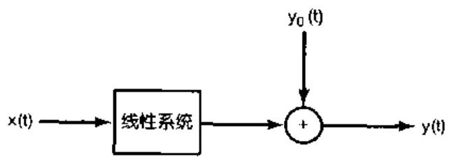  
图1.48 一种增量线性系统的结构。图中  $y_{0}[n]$  是系统的零输入响应

$$
y_{0}[n] = 3
$$

事实上,在连续时间和离散时间系统中存在着大量的类系统是能够由图1.48来表示的,也就足系统的总输出由一个线性系统的响应与一个零输入响应的叠加来组成。正如在习题1.47所指出的,这样的系统相应于一类增量线性系统(incrementally linear systems),即在连续或离散时间系统中,其响应对输入中的变化是线性的。换句话说,对增量线性系统而言,对任意两个输入的响应的差是两个输入差的线性函数(即可加的且齐次的)。例如,若  $x_{1}[n]$  和

$x_{2}[n]$  是由(1.132)式所表征的系统的两个输入,而  $y_{1}[n]$  和  $y_{2}[n]$  是其对应的输出,那么

$$
y_{1}[n] - y_{2}[n] = 2x_{1}[n] + 3 - \{2x_{2}[n] + 3\} = 2\{x_{1}[n] - x_{2}[n]\} \tag{1.136}
$$

# 1.7小结

在这一章讨论了有关连续时间与离散时间信号及系统的一些基本概念,通过几个例子说明了信号与系统的直观形象,又介绍了在全书中将用到的信号与系统的数学表示。具体的就是介绍了信号的图解表示和数学表示,并用这些表示讨论了自变量的变换。我们还定义和研究了在连续时间和离散时间情况下的几个基本信号,这些包括复指数信号、正弦信号、单位冲激和单位阶跃函数等。另外,还研究了连续时间和离散时间信号的周期性概念。

在讨论有关系统的基本概念时,引入了方框图以便于讨论系统间的相互联结问题,并定义了几个重要的系统性质,其中包括因果性、稳定性、时不变性和线性等性质。

本书的大部分内容都是集中在具有线性时不变(LTI)系统上的,包括连续时间和离散时间。这类系统在系统分析和设计中起着特别重要的作用,这部分原因是由于实际中遇见的很多系统都可以成功地按照线性和时不变性来建模;另外,在后续的各章中将会看到,线性和时不变性可以使我们对该类系统的特性进行深入而详细地研究。

# 习题

基本题:利用课文中解例题的方式,强调应用概念和方法的技巧。

深入题:深入研究和钻研课文内容的根本原理和实际内涵。

习题的第一部分属于基本的,答案在书末给出。接下来分别包括基本的和深入的两部分题。最后一部分数学复习,是在复数运算和代数的基本概念方面给出一些练习题作为复习。

# 基本题(附答案)

1.1用直角坐标形式  $(x + \mathrm{j}y)$  表示下列复数:  $\frac{1}{2}\mathrm{e}^{\mathrm{i}\pi}$ $\frac{1}{2}\mathrm{e}^{- \mathrm{i}\pi}$ $\mathrm{e}^{\mathrm{i}\pi /2}$ $\mathrm{e}^{- \mathrm{i}\pi /2}$ $\sqrt{2}\mathrm{e}^{\mathrm{i}\pi /4}$ $\sqrt{2}\mathrm{e}^{\mathrm{i}\pi /4}$ $\sqrt{2}\mathrm{e}^{- \mathrm{i}\pi /4}$ $\sqrt{2}\mathrm{e}^{- \mathrm{i}\pi /4}$ $\sqrt{2}\mathrm{e}^{- \mathrm{i}\pi /4}$  。

1.2用极坐标形式  $(r\mathrm{e}^{\mathrm{i}\theta}$ $- \pi < \theta < \pi ,$  )表示下列复数:5,  $- 2, - 3\mathrm{j},\frac{1}{2} - \mathrm{j}\frac{\sqrt{3}}{2},1 + \mathrm{j},(1 - \mathrm{j})^{2},\mathrm{j}(1 - \mathrm{j}),$ $(1 + \mathrm{j})(1 - \mathrm{j})$  ,  $(\sqrt{2} +\mathrm{j}\sqrt{2}) / (1 + \mathrm{j}\sqrt{3})$  。

1.3对下列每一个信号求  $P_{\infty}$  和  $E_{\mathrm{min}}$

(a)  $x_{1}(t) = \mathrm{e}^{-2t}u(t)$ $(\mathbf{b})x_{2}(t) = \mathrm{e}^{\mathrm{i}(2t + \pi /4)}$

(c)  $x_{3}(t) = \cos (t)$ $(\mathbf{d})x_{3}[n] = (\frac{1}{2})^{n}u[n]$

$(\mathbf{e})x_{2}[n] = \mathrm{e}^{\mathrm{i}(x / 2\pi +\pi /8)}$ $(\mathbf{f})x_{3}[n] = \cos (\frac{\pi}{4} n)$

1.4设  $x[n] = 0$  ,  $\pi < - 2$  ,和  $\pi >4$  ,对以下每个信号确定其值保证为零的  $\pmb{n}$  值。

(a)  $x[n - 3]$  
(b)  $x[n + 4]$  
(c)  $x[-n]$  
(d)  $x[-n + 2]$  
(e)  $x[-n - 2]$

1.5设  $x(t) = 0$  ,  $t< 3$  ,对以下每个信号确定其值保证为零的  $\pmb{t}$  值。

(a)  $x(1 - t)$  
(b)  $x(1 - t) + x(2 - t)$  
(c)  $x(1 - t)x(2 - t)$  
(d)  $x(3t)$  
(e)  $x(t / 3)$

1.6判断如下信号的周期性:

$$
\begin{array}{l l l}{{\mathrm{~\left(a\right)~}x_{1}(t)=2\mathrm{e}^{\mathrm{i}(t+\pi/4)}\ u\left(t\right)}}&{{\mathrm{~\left(b\right)~}x_{2}[n]=u\left[n\right]+u\left[-n\right]}}\\ {{\mathrm{~\left(c\right)~}x_{3}[n]=\sum_{k=-\infty}^{\infty}\left\{\delta\left[n-4k\right]-\delta\left[n-1-4k\right]\right\}}}\end{array}
$$

1.7对以下每个信号求信号的偶部保证为零的所有自变量值。

$$
\begin{array}{l l l}{{x_{1}[n]=u[n]-u[n-4]}}&{{\qquad(\mathrm{b})\ x_{2}(t)=\sin(\frac{1}{2}t)}}\\ {{x_{3}[n]=(\frac{1}{2})^{n}u[n-3]}}&{{\qquad(\mathrm{d})\ x_{4}(t)=\mathrm{e}^{-5t}u(t+2)}}\end{array}
$$

1.8将下列信号的实部表示成  $A\mathrm{e}^{- \mathrm{i}t}\mathrm{cos}(\omega t + \phi)$  的形式,这里  $A,a,\omega$  和  $\phi$  都是实数,且  $A > 0$  和  $- \pi < \phi \leqslant$ $\pi$

$$
\begin{array}{l l l}{{x_{1}(t)=-2}}&{{\qquad(\mathrm{b})\ x_{2}(t)=\sqrt{2}\mathrm{e}^{\mathrm{i}\pi/4}\mathrm{cos}(3t+2\pi)}}\\ {{x_{3}(t)=\mathrm{e}^{-\mathrm{i}}\mathrm{sin}(3t+\pi)_{\circ}}}&{{\qquad(\mathrm{d})\ x_{4}(t)=\mathrm{je}^{(-2+\mathrm{i}100)t}}}\end{array}
$$

1.9判断下列信号的周期性。若是周期的,给出它的基波周期。

(a)  $x_{1}(t) = \mathrm{je}^{10t}$  
(b)  $x_{2}(t) = \mathrm{e}^{(-1 + t)t}$  
(c)  $x_{3}[n] = \mathrm{e}^{j\pi n}$

(d)  $x_{4}[n] = 3\mathrm{e}^{3\pi (n + 1 / 2)}$  
(e)  $x_{5}[n] = 3\mathrm{e}^{3\pi (n + 1 / 2)}$

1.10求信号  $x\{t\} = 2\mathrm{cos}(1(t + 1) - \mathrm{sin}(4t - 1)$  的基波周期。

1.11求信号  $x[n] = 1 + \mathrm{e}^{j\pi n / 7} - \mathrm{e}^{j2\pi n / 5}$  的基波周期。

1.12考虑离散时间信号

$$
x[n] = 1 - \sum_{k = 3}^{\infty}\delta [n - 1 - k]
$$

试确定整数  $M$  和  $\scriptstyle n_{0}$  的值,以使得  $x[n]$  可表示为

$$
x[n] = u_{\mathrm{L}}M n - n_{0}]
$$

1.13考虑连续时间信号

$$
x(t) = \delta (t + 2) - \delta (t - 2)
$$

试对

$$
y(t) = \int_{-\infty}^{t}x(\tau)\mathrm{d}\tau
$$

计算  $E_{\infty}$  值。

1.14考虑一个周期信号

$$
x(t) = \begin{array}{l l}{\{1,} & {\qquad 0\leqslant t\leqslant 1}\\ {\cdot -2,} & {\qquad 1< t< 2} \end{array}
$$

周期为  $T = 2$  。这个信号的导数是"冲激串"(impulse train)

$$
g(t) = \sum_{k = -\infty}^{\infty}\delta (t - 2k)
$$

周期仍为  $T = 2$  。可以证明

$$
\frac{\mathrm{d}x(t)}{\mathrm{d}t} = A_{1}g(t - t_{1}) + A_{2}g(t - t_{2})
$$

求  $A_{1}, t_{1}, A_{2}$  和  $t_{2}$  的值。

1.15考虑一系统S,其输入为  $x[n]$  ,输出为  $y[n]$  ,这个系统是经由系统  $\mathbf{S}_{1}$  和  $\mathbf{S}_{2}$  级联后得到的,  $\mathbf{S}_{1}$  和  $\mathbf{S}_{2}$  的输入-输出关系为

$$
\begin{array}{r l}{\mathsf{S}_{1}\colon} & {y_{1}[n] = 2x_{1}[n] + 4x_{1}[n - 1]} \end{array}
$$

$$
\begin{array}{r l}{\mathsf{S}_{2}\colon} & {y_{2}[n] = x_{2}[n - 2] + \frac{1}{2} x_{2}[n - 3]} \end{array}
$$

这里  $x_{1}[n]$  和  $x_{2}[n]$  都为输入信号。

(a)求系统S的输入-输出关系。

(b)若  $\mathbf{S}_{1}$  和  $\mathbf{S}_{2}$  的级联次序颠倒的话(也即  $\mathbf{S}_{1}$  在后),系统S的输入-输出关系改变吗?

1.16考虑一离散时间系统,其输入为  $x[n]$  ,输出为  $y[n]$  ,系统的输入-输出关系为

$$
y[n] = x[n]x[n - 2]
$$

(a)系统是无记忆的吗？

(b）当输入为  $A\delta [n]$  ，A为任意实数或复数，求系统输出。

(c）系统是可逆的吗？

1.17考虑一连续时间系统，其输入  $x(t)$  和输出  $y(t)$  的关系为

$$
y(t) = x(sin(t))
$$

(a)该系统是因果的吗？

(b)该系统是线性的吗？

1.18考虑一个离散时间系统其输入  $x[n]$  和输出  $y[n]$  关系为

$$
y[n] = \sum_{k = n - n_{0}}^{n + n_{0}}x[k]
$$

式中  $\pmb{n}_{0}$  为某一有限正整数。

(a）系统是线性的吗？

(b）系统是时不变的吗？

(c)若  $x[n]$  为有界且界定为一有限整数  $B$  （即对全部  $n,|x[n]|< B)$  ，可以证明  $y[n]$  是被界定到某一有限数  $C$  。因此可以得出该系统是稳定的。诸用  $B$  和  $\pmb{n}_{0}$  来表示  $C$  。

1.19判定下列输入-输出关系的系统是否是线性、时不变性，或两者俱有。

(a)  $y(t) = t^{2}x(t - 1)$  
(b)  $y[n] = x^{2}[n - 2]$  
(c)  $y[n] = x[n + 1] - x[n - 1]$  
(d)  $y[n] = \beta u|x(t)\}$

1.20一连续时间线性系统S,其输入为  $x(t)$  ,输出为  $y(t)$  ,有下面输人-输出关系：

$$
x(t) = e^{2t} - y(t) = e^{3t}
$$

$$
x(t) = e^{-2t} - y(t) = e^{-2t}
$$

(a)若  $x_{1}(t) = \cos (2t)$  ，求系统S的输出  $y_{1}(t)$

(b)若  $x_{2}(t) = \cos (2(t - \frac{1}{2}))$  ，求系统S的输出  $y_{2}(t)$

# 基本题

1.21一连续时间信号  $x(t)$  如图P1.21所

示，请画出下列信号并给以标注。

(a)  $x(t - 1)$  
(b)  $x(2 - t)$  
(c)  $x(2t + 1)$  
(d)  $x(4 - t / 2)$  
(e)  $[x(t) + x(-t)]u(t)$

(f)  $x(t)[\delta (t + \frac{3}{2}) - \delta (t - \frac{3}{2})]$

1.22·离散时间信号  $x[n]$  如图P1.22所示，请画出下列信号并给以标注。

$$
(a) \(x[n - 4]\) (b) \(x[3 - n]\) (c) \(x[3n]\) (d) \(x[3n + 1]\) (e) \(x[n]u[3 - n]\) (f) \(x[n - 2]\delta [n - 2]\) (g) \(\frac{1}{2} x[n] + \frac{1}{2} (-1)^{n}x[n]\) (h) \(x[(n - 1)^{2}]\)
$$

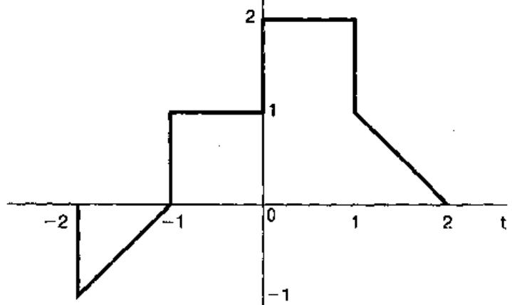

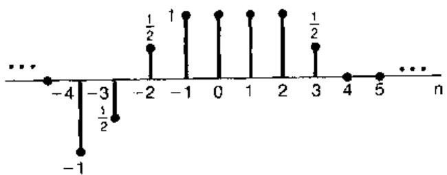

1.23确定并画出图P1.23信号的奇部和偶部，并给以标注。

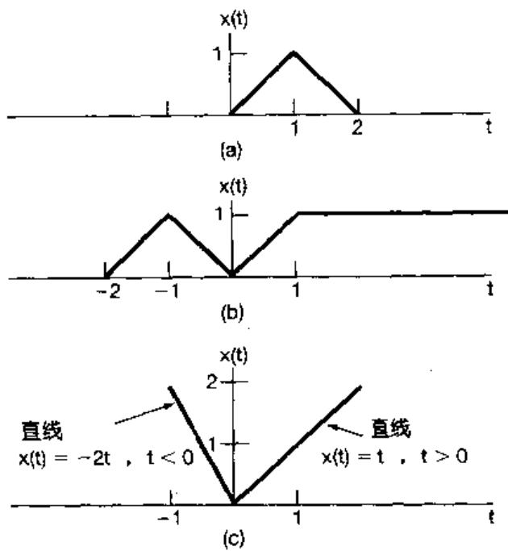

1.24确定并画出图P1.24信号的奇部和偶部，并给以标注。

1.25判定下列连续时间信号的周期性；若是周期的，确定它的基波周期。

$$
\begin{array}{l}{{\mathrm{~\left(a\right)~}x\left(t\right)=3\mathrm{cos}(4t+\frac{\pi}{3})}}\\ {{\mathrm{~\left(b\right)~}x\left(t\right)=\mathrm{e}^{\mathrm{j}(\pi t-1)}}}\\ {{\mathrm{~\left(d\right)~}x\left(t\right)=\delta v\left\{\cos(4\pi t)u\left(t\right)\right\}}}\end{array}\qquad\begin{array}{l}{{\mathrm{~\left(c\right)~}x\left(t\right)=\left[\cos(2t-\frac{\pi}{3})\right]^{2}}}\\ {{\mathrm{~\left(e\right)~}x\left(t\right)=\delta v\left\{\sin\left(4\pi t\right)u\left(t\right)\right\}}}\end{array}
$$

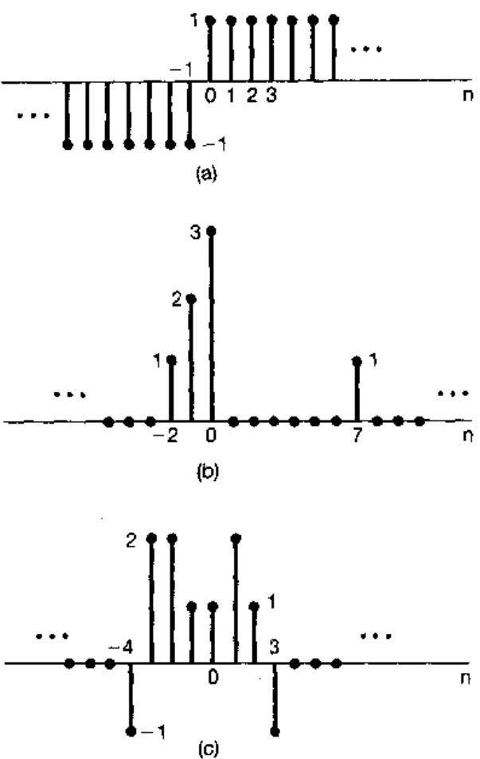

1.26判定下列离散时间信号的周期性;若是周期的，确定它的基波周期。

$$
{\begin{array}{l l l l}{{\mathrm{~\left(a\right)~}}x[n]=\sin\left({\frac{6\pi}{7}}n+1\right)}&{{\mathrm{~\left(b\right)~}}x[n]=\cos\left({\frac{n}{8}}-n\right)}&{{\mathrm{~\left(c\right)~}}x[n]=\cos\left({\frac{\pi}{8}}n^{2}\right)}\\ {{\mathrm{~\left(d\right)~}}x[n]=\cos\left({\frac{\pi}{2}}n\right)\cos(\frac{\pi}{4}n)}&{{\mathrm{~\left(e\right)~}}x[n]=2\cos\left({\frac{\pi}{4}}n\right)+\sin(\frac{\pi}{8}n)-2\cos(\frac{\pi}{2}n+{\frac{\pi}{6}})}\end{array}}
$$

1.27在这一章介绍了系统的几个一般性质，这就是一个系统可能是或不是：

（1）无记忆；（2）时不变；（3）线性；（4）因果；（5）稳定。

对以下连续时间系统确定哪些性质成立，哪些不成立，并陈述你的理由。下例中  $y(t)$  和  $x(t)$  分别都记作系统的输出和输入。

$$
\begin{array}{r l}&{\mathrm{~\dot{~}~}y(t)=x(t-2)+x(2-t)}\\ &{\mathrm{~\dot{~}~}y(t)=\int^{2t}\infty x(\tau)\mathrm{d}\tau}\\ &{\mathrm{~\dot{~}~}y(t)={\begin{array}{l l}{0,}&{x(t)< 0}\\ {x(t)+x(t-2),}&{x(t)\geqslant0}\end{array}}\\ &{\mathrm{~\dot{~}~}y(t)=\frac{\mathrm{d}x(t)}{\mathrm{d}t}}\end{array}
\]  

\[
\begin{array}{r l}&{\mathrm{~\dot{~}~}y(t)={\begin{array}{l l}{0,}&{x(t)< 0}\\ {x(t)+x(t-2),}&{x(t)\geqslant0}\end{array}}\\ &{\mathrm{~\dot{~}~}y(t)=\frac{\mathrm{d}x(t)}{\mathrm{d}t}}\end{array}
 \tag{g}
\]  

1.28对以下离散时间系统确定习题1.27中所列诸性质哪些成立，哪些不成立，并陈述你的理由。下例中\(y[n]\) 和 \(x[n]\) 分别都记作系统的输出和输入。  

(a) \(y[n] = x[-n]\) \(\begin{array}{r l} & {\mathrm{~(b)~}y[n] = x[n - 2] - 2x[n - 8]}\\ & {\mathrm{~(d)~}y[n] = \delta v\{x[n - 1]\}}\\ & {\mathrm{~(x[n],\qquad~}n\geqslant 1}\\ & {\mathrm{~(f)~}y[n] = { \begin{array}{l l}{x[n],} & {\qquad n\geqslant 1}\\ {0,} & {\qquad 0}\\ {x[n],} & {\qquad n\leqslant -1} \end{array} } \end{array}\) (c) \(y[n] = n x[n]\) (e) \(y[n] = { \begin{array}{l l}{x[n],} & {\qquad n\geqslant 1}\\ {0,} & {\qquad n = 0}\\ {x[n + 1],} & {\qquad n\leqslant -1} \end{array} \) (g) \(g_{\cdot}^{\cdot}n = x[4n + 1]\)  

1.29(a)证明输入 \(x[n]\) 和输出 \(y[n]\) 的关系为 \(y[n] = \mathcal{R}_{0}\{x[n]\}\) 的离散时间系统是可加的。若其关系变为 \(y[n] = \mathcal{R}_{0}\{\mathrm{e}^{\mathrm{i}\pi n / 4}x[n]\}\) 仍是可加的吗？（此题中不要假设 \(x[n]\) 为实数)。  

(b)在正文中讨论到一个系统的线性性质等效为既具有可加性，又具有齐次性，试对下列系统确定它们的可加性和/或齐次性。对每一性质若成立请给出证明；若不成立请给出一个反例。  

\[
\begin{array}{r l r l}&{\mathrm{~(~i~)~}y(t)=\frac{1}{x(t)}[\frac{\mathrm{d}x(t)}{\mathrm{d}t}]^{2}}&{\mathrm{~(~ii~)~}y[n]={\begin{array}{l l}{x[n]\frac{x[n-2]}{x[n-1]},}&{x[n-1]\neq0}\\ {0}&{x[n-1]=0}\end{array}}\end{array}
$$

1.28对以下离散时间系统确定习题1.27中所列诸性质哪些成立，哪些不成立，并陈述你的理由。下例中 $y[n]$  和  $x[n]$  分别都记作系统的输出和输入。

$$
\begin{array}{r l}&{y[n]=x[-n]}\\ &{y[n]=n x[n]}\\ &{y[n]=\left\{\begin{array}{l l}{x[n],}&{n\geqslant1}\\ {0,}&{n=0}\\ {x[n+1],}&{n\leqslant-1}\end{array}\right.}\\ &{g_{\cdot}^{\cdot}n=x[4n+1]}\end{array}
\]  

\[
\begin{array}{r l}&{y[n]=x[n-2]-2x[n-8]}\\ &{y[n]=\delta v\{x[n-1]\}}\\ &{y[n]=\left\{\begin{array}{l l}{x[n],}&{n\geqslant1}\\ {0,}&{n\leqslant-1}\end{array}\right.}\end{array}
$$

1.29（a）证明输入  $x[n]$  和输出  $y[n]$  的关系为  $y[n] = \mathcal{R}_{0}\{x[n]\}$  的离散时间系统是可加的。若其关系变为  $y[n] = \mathcal{R}_{0}\{\mathrm{e}^{\mathrm{i}\pi n / 4}x[n]\}$  仍是可加的吗？（此题中不要假设  $x[\,n\,]$  为实数)。

(b)在正文中讨论到一个系统的线性性质等效为既具有可加性，又具有齐次性，试对下列系统确定它们的可加性和/或齐次性。对每一性质若成立请给出证明；若不成立请给出一个反例。

$$
\begin{array}{r}{\mathrm{~(~\mathrm{~)~}~}y(t)=\frac{1}{x(t)}[\frac{\mathrm{d}x(t)}{\mathrm{d}t}]^{2}\qquad\mathrm{~(~\mathrm{~)~}~}y[n]={\begin{array}{l l}{\frac{x[n]x[n-2]}{x[n-1]},}&{x[n-1]\neq0}\\ {0}&{x[n-1]=0}\end{array}}\end{array}
$$

1.30判定下列系统的可逆性。若是，求其逆系统；若不是，请找到两个输入信号，其输出是相同的。

$$
\begin{array}{r l}&{y(t)=x(t-4)\qquad\qquad\qquad\qquad\qquad\qquad\qquad\qquad\qquad\qquad\qquad\qquad\qquad\qquad\qquad\qquad\qquad\qquad\qquad\qquad\qquad\qquad\qquad\qquad\qquad\qquad\qquad\qquad\qquad\qquad\qquad\qquad\qquad\qquad\mathrm{~\qquad~}}\\ &{y[n]=n x[n]\qquad\qquad\qquad\qquad\qquad\qquad\qquad\qquad\qquad\qquad\qquad\qquad\qquad\qquad\qquad\qquad\qquad\qquad\qquad\qquad\qquad\qquad\qquad\qquad\qquad\qquad\qquad\qquad\qquad\qquad\qquad\qquad\qquad\quad}\\ &{y[n]=\left\{\begin{array}{l l}{x[n-1],}&{n\geqslant1}\\ {0,}&{n=0}\\ {x[n],}&{n\leqslant-1}\end{array}\right.}\\ &{y[n]=x[1-n]\qquad\qquad\qquad\qquad\qquad\qquad\qquad\qquad\qquad\qquad\qquad\qquad\qquad\qquad\qquad\qquad\qquad\qquad\qquad\qquad\qquad\qquad\qquad\qquad\qquad\qquad\qquad\qquad\qquad\qquad\qquad\qquad\qquad}\\ &{y[n]=\frac{\mathrm{~\qquad~}}{\mathrm{~\qquad~}}\left(\frac{1}{2}\right)^{n-1}x[k]\qquad\qquad\qquad\qquad\qquad\qquad\qquad\qquad\qquad\qquad\qquad\qquad\qquad\qquad\qquad\qquad\qquad\qquad\qquad\qquad\qquad\qquad\qquad\qquad\qquad\qquad\qquad\qquad\qquad\qquad\qquad\qquad\qquad}\end{array}
$$

1.31在本题中将要说明线性时不变性质的最重要结果之一，即一旦知道了一个线性系统或线性时不变(LTI)系统对某单一输入的响应，或者对若干个输入的响应，就能直接计算出对许多其它输入信号的响应。本书剩下的绝大部分都是利用这一点来建立分析与综合LTI系统的一些结果和方法的。

（a）考虑一个LTI系统，它对示于图P1.31(a)的信号  $x_{1}(t)$  的响应  $y_{1}(t)$  示于图P1.31(b)中，确定并画出该系统对示于图P1.31（c)的信号  $x_{2}(t)$  的响应。

(b）确定并画出上述(a)中的系统对示于图P1.31(d)的信号  $x_{3}(t)$  的响应。

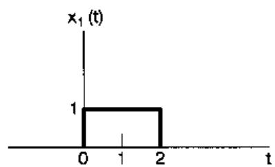  
(a)

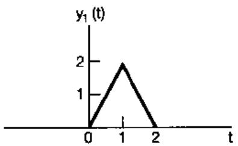  
(b)

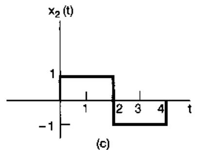  
(c)

  
(d) 图P1.31

# 深入题

1.32 设  $x(t)$  是一连续时间信号,并令

$$
y_{1}(t) = x(2t) \text{和} y_{2}(t) = x(t / 2)
$$

信号  $y_{1}(t)$  代表  $x(t)$  的一种加速的形式,即信号的持续期减了一半;而  $y_{2}(t)$  代表  $x(t)$  的一种减慢的形式,即信号的持续期加倍。考虑以下说法:

(1)若  $x(t)$  是周期的,  $y_{1}(t)$  也是周期的。

(2)若  $y_{1}(t)$  是周期的,  $x(t)$  也是周期的。

(3)若  $x(t)$  是周期的,  $y_{2}(t)$  也是周期的。

(4)若  $y_{2}(t)$  是周期的,  $x(t)$  也是周期的。

对于以上每一种说法判断是否对。若对,确定这两个信号基波周期之间的关系;若不对,给出一个反例。

1.33 设  $x[n]$  是一离散时间信号,并令

信号  $y_{1}[n]$  和  $y_{2}[n]$  分别代表  $x[n]$  一种加速和减慢的形式。然而,应该注意在离散时间下的加速和减慢与连续时间下相比有一些细微的差别。考虑以下说法:

(1)若  $x[n]$  是周期的,  $y_{1}[n]$  也是周期的。

(2)若  $y_{1}[n]$  是周期的,  $x[n]$  也是周期的。

(3)若  $x[n]$  是周期的,  $y_{2}[n]$  也是周期的。

(4)若  $y_{2}[n]$  是周期的,  $x[n]$  也是周期的。

对以上每一种说法判断是否对。若对,确定这两个信号基波周期之间的关系;若不对,给出一个反例。

1.34 在本题中要研究奇、偶信号的几个性质

(a)证明,若  $x[n]$  是奇信号,则

$$
\sum_{n = -\infty}^{\infty} x[n] = 0
$$

(b)若  $x_{1}[n]$  是一个奇信号,  $x_{2}[n]$  是一个偶信号,证明  $x_{1}[n]x_{2}[n]$  是一个奇信号。

(c)  $x[n]$  为一任意信号,其偶部和奇部分别记作

$$
x_{e}[n] = \delta v\{x[n]\}
$$

和

$$
x_{0}[n] = \mathcal{O}d\{x[n]\}
$$

证明

$$
\sum_{n = -\infty}^{\infty}x^{2}[n] = \sum_{n = -\infty}^{+\infty}x_{e}^{2}[n] + \sum_{n = -\infty}^{+\infty}x_{e}^{2}[n]
$$

(d)虽然以上  $(a)\sim (c)$  都针对对离散时间信号说的,相类似的性质对连续时间信号也成立,为此证明

$$
\int_{-\infty}^{+\infty}x^{2}(t)\mathrm{d}t = \int_{-\infty}^{+\infty}x^{2}(t)\mathrm{d}t + \int_{-\infty}^{+\infty}x_{e}^{2}(t)\mathrm{d}t
$$

式中  $x_{e}(t)$  和  $x_{0}(t)$  分别为  $x(t)$  的偶部和奇部。

1.35 考虑周期离散时间指数时间信号

$$
x_{-}^{*}n\} = \mathrm{e}^{\mathrm{i}m(2\pi /N)n}
$$

证明该信号的基波周期是

$$
N_{0} = N / \mathrm{gcd}(m,N)
$$

式中  $\gcd (m,N)$  是  $m$  和  $N$  的最大公约数(greatest common divisor),也就是将  $m$  和  $N$  都能约成整数的最大整数,例如

$$
\gcd \left(2,3\right) = 1,\quad \gcd \left(2,4\right) = 2,\quad \gcd \left(8,12\right) = 4
$$

注意:若  $m,N$  无公共因子,则  $N_{0} = N$  。

1.36 设  $x(t)$  是连续时间复指数信号

$$
x(t) = \mathrm{e}^{\mathrm{i}\omega_{0}}
$$

基波频率为  $\omega_{0}$ ,基波周期  $T_{0} = 2\pi /\omega_{0}$  。将  $x(t)$  取等间隔样本得到一个离散时间信号

$$
\mathbf{\dot{x}}[n] = x(T_{0}) = \mathrm{e}^{\mathrm{i}\omega_{0}n T}
$$

(a)证明,仅当  $T / T_{0}$  为一有理数,  $x[n]$  才是周期的;也就是说,仅当采样间隔的某一倍数是  $x(t)$  周期的倍数时,  $x[n]$  才是周期的。

(b)假设  $x[n]$  是周期的,也即有

$$
\frac{T}{T_{0}} = \frac{T}{q} \tag{P1.36-1}
$$

式中  $\pmb{\mathscr{p}}$  和  $\pmb{q}$  都是整数。  $x[n]$  的基波周期和基波频率是什么?将基波频率表示成  $\omega_{0}T$  的分式。

(c)还是假设  $T / T_{0}$  满足(P1.36-1),确定需要多少个  $x(t)$  的周期才能得到  $x[n]$  的一个周期的样本。

1.37 在很多通信系统应用中一个重要的概念是两个信号之间的相关。在第2章的习题中还将更多的提到这一问题,并给出一些实际应用。现在,我们只求对相关函数及其有关性质作简单介绍。

设  $x(t)$  和  $y(t)$  是两个信号,相关函数定义为

$$
\phi_{\mathbf{z}}(t) = \int_{-\infty}^{\infty}x(t + \tau)y(\tau)\mathrm{d}\tau
$$

函数  $\phi_{\mathbf{z}}(t)$  通常称为信号  $x(t)$  的自相关函数,而  $\phi_{\mathbf{z}}(t)$  则称为互相关函数。

(a)  $\phi_{\mathbf{z}}(t)$  和  $\phi_{\mathbf{z}}(t)$  之间是什么关系?

(b)求  $\phi_{\mathbf{z}}(t)$  的奇部。

(c)假设  $y(t) = x(t + T)$ ,将  $\phi_{\mathbf{z}}(t)$  和  $\phi_{\mathbf{z}}(t)$  用  $\phi_{\mathbf{z}}(t)$  来表示。

1.38 本题将讨论单位冲激函数的几个性质

(a)证明

$$
\delta (2t) = \frac{1}{2}\delta (t)
$$

提示:考察  $\delta_{\Delta}(t)$  (见图1.34)。

(b)在1.4节将连续时间单位冲激定义成  $\delta_{\Delta}(t)$  的极限,现在根据考察  $\delta_{\Delta}(t)$  的性质来定义  $\delta (t)$  的几个性质。

例如,因为信号

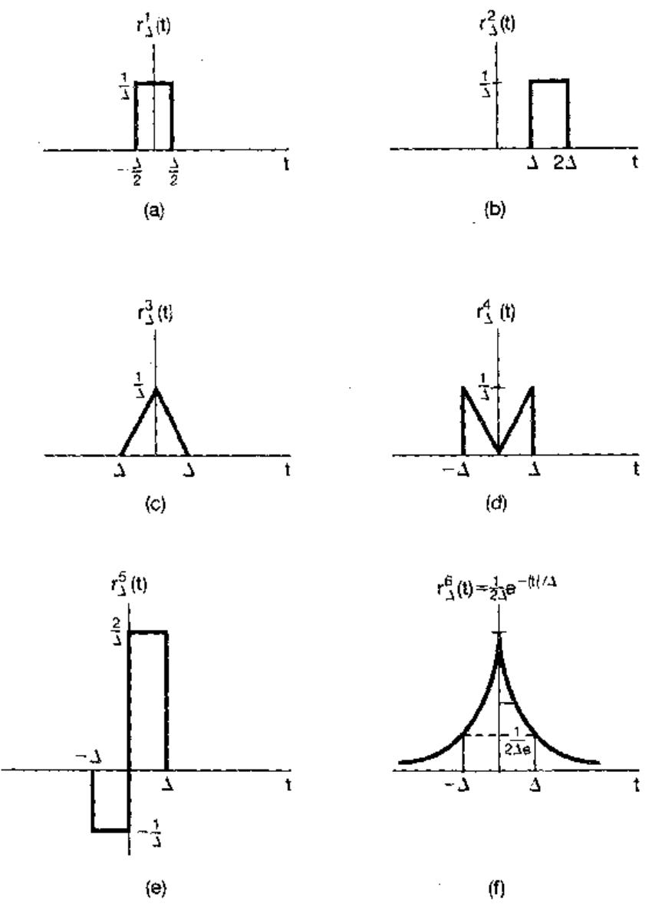

$$
u_{\Delta}(t) = \int_{-\infty}^{t}\delta_{\Delta}(t)\mathrm{d}\tau
$$

收敛于单位阶跃

$$
u(t) = \lim_{\Delta \to 0} u_{\Delta}(t) \tag{P1.38-1}
$$

于是就可通过如下方程

$$
u(t) = \int_{-\infty}^{t}\delta (\tau)\mathrm{d}\tau
$$

来解释  $\delta (t)$ , 或者把  $\delta (t)$  算成  $u(t)$  的导数。

这种讨论方式是很重要的, 因为事实上我们是想通过它的性质而不是给出在每一  $t$  时的值来定义  $\delta (t)$  的。在第 2 章将给出单位冲激行为的一种很简单的特性, 而这个特性在线性时不变系统的研究中是极其有用的。现在, 我们要集中说明, 在应用单位冲激中的重要概念是要明白它是如何表现的。为此, 考虑图 P1.38 中的 6 个信号, 要证明其中每一个随  $\Delta \to 0$ , 在"表现都像一个冲激"。如果令

$$
u_{\Delta}^{i}(t) = \int_{-\infty}^{t}r_{\Delta}^{i}(\tau)\mathrm{d}\tau
$$

那么

$$
\lim_{\Delta \to 0}u_{\Delta}^{i}(t) = u(t)
$$

在每一种情况下, 画出信号  $u_{\Delta}^{i}(t)$ , 并给以标注。注意

$$
r_{\Delta}^{2}(0) = r_{\Delta}^{1}(0) = 0, \quad \text{对全部} \Delta
$$

因此, 定义  $\delta (t)$  或把  $\delta (t)$  想作  $t \neq 0$  时为零,  $t = 0$  时为无穷大是不够的, 而宁肯用一些性质来定义冲激, 臂如(P1.38- 1)式那样的性质。在2.5节将对称之为奇异函数(singularity functions)的一类信号给予定义, 而这些信号都是与单位冲激有关的, 而且都是用它们的性质而不是它们的值来定义的。

1.39  $u(t), \delta (t)$  以及其它的奇异函数在线性时不变系统的研究中所起的作用就在于一种物理现象理想化的作用。将会看到, 利用这些理想化会对这样的系统得到一种极其重要而又非常简单的表示。然而, 在应用奇异函数时要特别小心。尤其是必须记住它们的是理想化了的。因此, 每当利用它们来完成某一计算时, 都隐含着假设: 这个计算所代表的是对理想化了的信号特征的精确描述。为了说明这一点, 考虑下面式子:

$$
x(t)\delta (t) = x(0)\delta (t) \tag{P1.39-1}
$$

这个式子是基于如下观察:

$$
x(t)\delta_{\Delta}(t) \approx x(0)\delta_{\Delta}(t) \tag{P1.39-2}
$$

将这一关系取极限, 就可得到(P1.39- 1)式所给出的理想化关系。然而, 更仔细地考查一下(P1.39- 2)式的导出, 就会发现这个式子真正有意义只有在  $t = 0$  时,  $x(t)$  是连续的才行; 否则, 对于小的  $t$  时, 就不会有  $x(t) \approx x(0)$  。

为了使这一点更为清楚, 看看单位阶跃信号  $u(t)$  。由(1.70)式,  $t < 0, u(t) = 0; t > 0, u(t) = 1$ , 但是在  $t = 0$ , 它的值不确定。[注意, 对所有的  $\Delta , u_{\Delta}(0) = 0$ , 而  $u_{\Delta}^{1}(0) = \frac{1}{2}$  (由习题1.38(b)所到)] 只要利用  $u(t)$  所进行的计算不依赖于对  $u(0)$  的特定选取, 那么  $u(0)$  不确定这一点就不会带来特别的麻烦。例如, 若  $f(x)$  是一个在  $t = 0$  连续的信号, 那么

$$
\int_{-\infty}^{+\infty} f(x) \mathrm{d}x = \int_{-\infty}^{+\infty} f(x) \mathrm{d}x = 0
$$

的值就与  $u(0)$  的选择无关。另一方面,  $u(0)$  无定义这一点是有意义的, 它意味着涉及奇异函数的某些计算是没有定义的。考虑一下试图对乘积  $u(t) \delta (t)$  定义一个值。为了看出这是不能定义的, 只需证明

$$
\lim_{\Delta \to 0} [u_{\Delta}(\tau) \delta (\tau)] = 0
$$

但是

$$
\lim_{\Delta \to 0} [u_{\Delta}(\tau) \delta_{\Delta}(\tau)] = \frac{1}{2} \delta (t)
$$

一般来说, 只要这些信号不包括位置重合的奇异点(不连续点、冲激或者在2.5节介绍的其它奇异点), 定义两个信号的乘积不会有任何困难。当这些奇异点的位置重合时, 奔积就没有定义。作为一个例子, 证明

$$
g(t) = \int_{-\infty}^{+\infty} u(\tau) \delta (t - \tau) \mathrm{d}\tau
$$

与  $u(t)$  是恒等的。也就是, 当  $t < 0$ , 它为零;  $t > 0$ , 等于1, 而在  $t = 0$  无定义。

1.40 (a) 证明如果一个系统无论是可加的, 或是齐次的, 它都有这个性质, 即若输入恒为零, 那么输出也恒为零。

(b) 确定一个系统(无论是连续时间或离散时间), 它既不可加, 又不齐次; 但当输入恒为零时, 它有零的输出。

(c) 根据(a), 你能得出: 若一个线性系统的输入在连续时间下, 在  $t_{1}$  到  $t_{2}$  之间; 或者在离散时间下, 在  $n_{1}$  到  $n_{2}$  之间为零, 那么在同样的时间间隔内输出也必须为零的结论吗? 为什么?

1.41 考虑一系统S, 其输入  $x[n]$  与输出  $y[n]$  的关系为

$$
y[n] = x[n]\{g[n] + g[n - 1]\}
$$

(a)若对所有的  $n,g[n] = 1$  ,证明S是时不变的。

(b)若  $g[n] = n$  ,证明S不是时不变的。

(c)若  $g[n] = 1 + (-1)^{n}$  ,证明S是时不变的。

1.42(a)下列说法是对还是错?说明理由。

两个线性时不变系统的级联还是一个线性时不变系统。

(b)下列说法是对还是错?说明理由。

两个非线性系统的级联还是非线性的。

(c)考虑具有下列输人-输出关系的三个系统:

系统1:  $y[n] = \{x[n / 2],\qquad n$  为偶 0 n为奇

系统2:  $y[n] = x[n] + \frac{1}{2} x[n - 1] + \frac{1}{4} x[n - 2]$

系统3:  $y[n] = x[2n]$

假设这三个系统按图P1.42级联,求整个系统的输人- 输出关系。它是线性的吗?是时不变的吗?

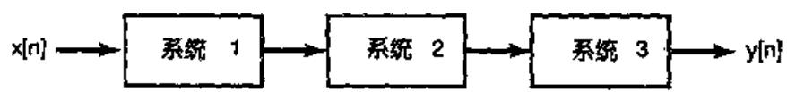  
图P1.42

1.43(a)有一时不变系统,其输人为  $x(t)$  ,输出为  $y(t)$  ,证明:若  $x(t)$  是周期的,周期为  $\boldsymbol{\tau}$  ,则  $y(t)$  也是周期的,周期为  $\boldsymbol{\tau}$  。同时证明在离散时间下也有同样结论。

(b)给出一个时不变系统的例子,在输人  $x(t)$  为非周期时,输出是周期的。

1.44(a)证明对连续时间线性系统而言,其因果性就等效于下面说法:

对任何  $\scriptstyle \ell_{0}$  和任意输入  $x(t)$  ,若  $\scriptstyle t< t_{0},x(t) = 0$  ,则对应的输出  $y(t)$  在  $\scriptstyle t< t_{0}$  也必定为零。

(b)找出一个非线性系统,它满足上面的条件,但不是因果的。

(c)找出一个非线性系统,它是因果的但不满足上述条件。

(d)证明一个离散时间线性系统的可逆性就等效于下面说法:

对所有  $n$  都产生  $y[n] = 0$  的唯一输人是在全部  $\pmb{n}$  下的  $x[n] = 0$

对连续时间线性系统类似的说法也成立。

(e)找出一个非线性系统,它满足(d)中的条件,但不是可逆的。

1.45在习题1.37中介绍了相关函数的概念。在实践中往往重要的是要计算相关函数  $\phi_{\mathrm{hz}}(t)$  ,这里  $h(t)$  是一个固定的已知函数,而  $x(t)$  可能是任何其它的信号。这种情况下,要做的是设计一个系统S,其输入为  $x(t)$  ,输出为  $\phi_{\mathrm{hz}}(t)$  。

(a)S是线性的吗?是对不变的吗?是因果的吗?为什么?

(b)如果做的是  $\phi_{\mathrm{hz}}(t)$  而不是  $\phi_{\mathrm{hz}}(t)$  ,(a)中的答案有任何变化吗?

1.46考虑图P1.46的反馈系统,假设  $n< 0$  ,  $y[n] = 0$

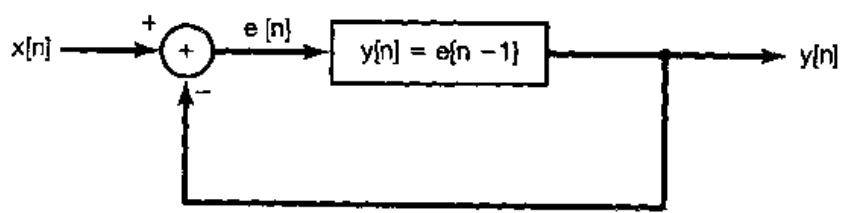  
图P1.46

(a)当  $x[n] = \delta [n]$  时,画出输出图形。

(b)当  $x[n] = u[n]$  时,画出输出图形。

1.47 (a)设S为一增量线性系统,  $x_{1}[n]$  为任一输入信号,当  $x_{1}[n]$  输入到S时其相应输出为  $y_{1}[n]$  。现在考虑图P1.47(a)的系统,证明该系统是线性的。并且事实上  $x[n]$  和  $y[n]$  之间的总输人-输出关系与  $x_{1}[n]$  的选取无关。

(b)利用(a)所得的结果,证明S可以用图1.48来表示。

(c)下面哪个系统是增量线性的?为什么?如果某一系统是增量线性的,请将线性系统L和零输入响应  $y_{0}[n]$  或  $y_{0}(t)$  鉴别出来,表示成图1.48的形式。

$$
(\textsf{i}) y[n] = n + x[n] + 2x[n + 4]
$$

$(\parallel)$ $y[n] = \left\{ \begin{array}{l l}{n / 2,}\\ {\{n - 1\} /2 + \underset {k = - \infty}{\overset{\{n\}}{\sum}}x[k],} \end{array} \right.$  n为偶

$(\parallel)$ $y[n] = \left\{ \begin{array}{l l}{x[n] - x[n - 1] + 3,}\\ {x[n] - x[n - 1] - 3,} \end{array} \right.$  若  $x[0]\geqslant 0$

(lv)示于图P1.47(b)的系统。

(V)示于图P1.47(d)的系统。

(d)假设一特定的增量线性系统有如图1.48的表示,L记为线性系统,  $y_{0}[n]$  记为零输入响应。证明:当仅当L是时不变系统和  $y_{0}[n]$  是常数时,S才是时不变的。

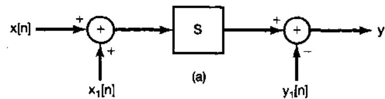

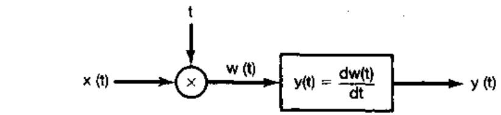  
(b)

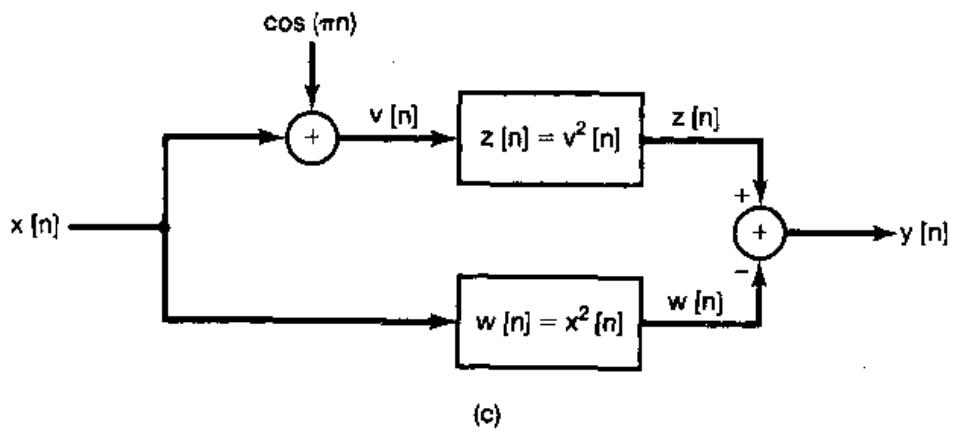  
图P1.47

# 数学复习

复数  $\mathbf{\Psi}_{z}$  可以用几种方法来表示。  $\mathbf{\Psi}_{z}$  的直角坐标形式为

$$
z = x + j y
$$

式中  $\mathbf{j} = \sqrt{- 1},x$  和  $\mathbf{\nabla}_{y}$  都是实数,且分别称为  $\mathbf{\Psi}_{z}$  的实部和虚部。正如早先已指出过的,也常用下列符号来表示复数的实部和虚部:

$$
x = \Re e\{z\} ,\qquad y = \mathcal{R}m\{z\}
$$

复数  $\mathbf{\Psi}_{z}$  也可以用极坐标形式表示为

$$
z = r\mathrm{e}^{\mathrm{j}\theta}
$$

式中  $r > 0$  是  $\mathbf{\Psi}_{z}$  的模,  $\theta$  是  $\mathbf{\Psi}_{z}$  的相角或相位。它们也经常写成

$$
\gamma = \gamma \in \gamma ,\qquad \theta = \mathcal{R}\mathcal{Z}
$$

这两种复数表示法之间的关系可以根据欧拉公式

$$
\mathrm{e}^{\mathrm{j}\theta} = \cos \theta +\mathrm{j}\sin \theta
$$

来确定,也可以将  $\mathbf{\Psi}_{z}$  图示在复平面上来确定,如图P1.48所示。图中  $\mathcal{R}\{z\}$  是坐标轴的水平轴,  $\mathcal{R}\{z\}$  是其垂直轴。对于这种图形表示来说,  $\mathbf{\Psi}_{x}$  和  $\mathbf{\nabla}_{y}$  就是  $\mathbf{\Psi}_{z}$  的直角坐标,而  $\mathbf{\nabla}_{r}$  和  $\theta$  就是它的极坐标。

1.48设  $\mathbf{\sigma}_{z_{0}}$  是一个复数,其极坐标是  $(r_{0},\theta_{0})$  ,直角坐标是  $\{x_{0}$ $y_{0})$  。求下列复数用  $\mathbf{\nabla}_{x_{0}}$  和  $\mathbf{\nabla}_{y_{0}}$  的直角坐标表示式,当  $r_{0} =$  2,  $\theta_{0} = \pi /4$  和  $r_{0} = 2$  ,  $\theta_{0} = \pi /2$  时,在复数平面上标出点 $\mathbf{\sigma}_{z_{0}}$  ,  $z_{1}$  ,  $z_{2}$  ,  $z_{3}$  ,  $\mathbf{\sigma}_{z_{4}}$  和  $\mathbf{\sigma}_{z_{5}}$  ,并示出每一点的实部和虚部。

(a)  $z_{1} = r_{0} \mathrm{e}^{-\mathrm{j}\theta_{0}}$  
(b)  $z_{2} = r_{0}$

(c)  $z_{3} = r_{0} \mathrm{e}^{\mathrm{i}(\theta_{0} + \pi)}$  
(d)  $z_{4} = r_{0} \mathrm{e}^{\mathrm{i}(-\theta_{0} + \pi)}$

(e)  $z_{5} = r_{0} \mathrm{e}^{\mathrm{i}(\theta_{0} + 2\pi)}$

1.49将下列复数用极坐标表示,并在复平面上画出它们,指出每个数的模和相角。

(a)  $1 + \mathrm{j}\sqrt{3}$  
(b) -5 
(c) -5 -5j

(d)  $3 + 4\mathrm{j}$  
(e)  $(1 - \mathrm{j}\sqrt{3})^{3}$  
(f)  $(1 + \mathrm{j})^{5}$

(g)  $(\sqrt{3} +\mathrm{j}^{3})(1 - \mathrm{j})$  
(h)  $\frac{2 - \mathrm{j}(6\sqrt{3})}{2 + \mathrm{j}(6\sqrt{3})}$  
(i)  $\frac{1 + \mathrm{j}\sqrt{3}}{\sqrt{3} + \mathrm{j}}$

(j)  $\mathrm{j}(1 + \mathrm{j})\mathrm{e}^{\mathrm{j}\pi /6}$  
(k)  $(\sqrt{3} +\mathrm{j})2\sqrt{2}\mathrm{e}^{-\mathrm{i}\pi /4}$  
(l)  $\frac{\mathrm{e}^{\mathrm{j}\pi / 3} - 1}{1 + \mathrm{j}\sqrt{3}}$

1.50(a)利用欧拉公式或图P1.48求用  $\boldsymbol{r}$  和  $\theta$  对  $\mathbf{\Psi}_{x}$  和  $\mathbf{\nabla}_{y}$  的表示式。

(b)求用  $\mathbf{\Psi}_{x}$  和  $\mathbf{\nabla}_{y}$  对  $\boldsymbol{r}$  和  $\theta$  的表示式。

(c)若仅给出  $\boldsymbol{r}$  和  $\tan \theta$  ,能唯一确定  $\mathbf{\Psi}_{x}$  和  $\mathbf{\nabla}_{y}$  吗?为什么?

1.51 利用欧拉公式,导出下列关系:

$$
\begin{array}{l l}{{\cos\theta=\frac{1}{2}\left(\mathrm{e}^{\mathrm{j}\theta}+\mathrm{e}^{-\mathrm{j}\theta}\right)}}&{{\quad(\mathrm{h})\sin\theta=\frac{1}{2\mathrm{j}}\left(\mathrm{e}^{\mathrm{j}\theta}-\mathrm{e}^{-\mathrm{j}\theta}\right)}}&{{\quad(\mathrm{c})\cos^{2}\theta=\frac{1}{2}\left(1+\cos2\theta\right)}}\\ {{\left(\sin\theta\right)\left(\sin\phi\right)=\frac{1}{2}\cos\left(\theta-\phi\right)-\frac{1}{2}\cos\left(\theta+\phi\right)}}&{{\quad(\mathrm{e})\sin\left(\theta+\phi\right)=\sin\theta\cos\phi+\cos\theta\sin\phi}}\end{array}
$$

1.52 设  $\mathbf{\Psi}_{z}$  是一复变量,即

$$
z = x + \mathrm{j}y = r\mathrm{e}^{\mathrm{j}\theta}
$$

$\mathbf{\Psi}_{z}$  的复数共轭是

$$
\dot{\mathbf{\Psi}}_{z} = \mathbf{\Psi}_{x} - \mathrm{j}y = r\mathrm{e}^{-\mathrm{j}\theta}
$$

试导出下列关系式,其中  $\mathbf{\Psi}_{z},\mathbf{\Psi}_{z_{1}}$  和  $\mathbf{\Psi}_{z_{2}}$  都是任意复数:

(a)  $\frac{z}{z} = r^{2}$  
(b)  $\frac{z}{z} = \mathrm{e}^{\mathrm{j}2\theta}$

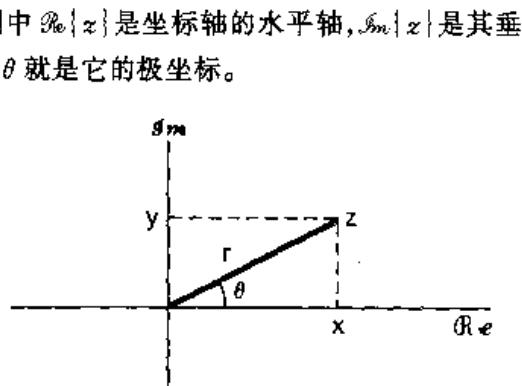  
图P1.48

(c)  $z + \frac{z}{z} = 2\mathcal{R}_{0}\{z\}$  
(d)  $z - \frac{z}{z} = 2j_{\infty}a_{0}\{z\}$

(e)  $(z_{1} + z_{2})^{*} = z_{1} + z_{2}$  
(f)  $(a z_{1}z_{2})^{*} = a z_{1}^{*}z_{2}$ $\alpha$  为任一实数

(g)  $(\frac{z_{1}}{z_{2}})^{*} = \frac{z_{1}}{z_{2}}$  
(h)  $\mathcal{R}_{0}\{\frac{z_{1}}{z_{2}}\} = \frac{1}{2} [\frac{z_{1}z_{2} + z_{1}z_{2}}{z_{2}z_{2}} ]$

1.53 试导出下列关系式,这里  $z,z_{1}$  和  $z_{2}$  都是任意复数:

(a)  $(e^{z})^{*} = e^{\frac{z}{z}}$  
(b)  $z_{1}\dot{z}_{2} + \dot{z}_{1}z_{2} = 2\mathcal{R}_{0}\{z_{1}\dot{z}_{2}\} = 2\mathcal{R}_{0}\{z_{1}z_{2}\}$

(c)  $|z| = |\frac{z}{z} |$  
(d)  $\left|z_{1}z_{2}\right| = \left|z_{1}\right|\left|z_{2}\right|$

(e)  $\mathcal{R}_{0}\{z\} \leqslant |z|$  ,  $\mathcal{A}_{m}\{z\} \leqslant |z|$  
(f)  $\left|z_{1}z_{2} + z_{1}z_{2}\right| \leqslant 2\left|z_{1}z_{2}\right|$

(g)  $(|z_{1}| - |z_{2}|)^{2} \leqslant |z_{1} + z_{2}|^{2} \leqslant (|z_{1}| + |z_{2}|)^{2}$

1.54 本题所提到这些关系式在全书的很多场合都会用到。

(a) 证明下面表示式成立

$$
\sum_{n = 0}^{N - 1} \alpha^{n} = \left\{ \begin{array}{ll} N, & \alpha = 1 \\ 1 - \alpha^{N} & \text{对任意复数} |a| \neq 1 \end{array} \right.
$$

该式常称为有限项和公式

(b) 证明,若  $|\alpha | < 1$ ,则

$$
\sum_{n = 0}^{\infty} \alpha^{n} = \frac{1}{1 - \alpha}
$$

该式常称无限项和公式

(c) 证明,若  $|\alpha | < 1$ ,则

$$
\sum_{n = 0}^{\infty} n \alpha^{n} = \frac{\alpha}{(1 - \alpha)^{2}}
$$

(d) 求

$$
\sum_{n = 0}^{\infty} \alpha^{n}
$$

假设  $|\alpha | < 1$

1.55 利用习题 1.54 的结果,求下列各和式,并将结果用直角坐标表示:

(a)  $\sum_{n = 0}^{\infty} e^{jn / 2}$  
(b)  $\sum_{n = 2}^{7} e^{jn / 2}$  
(c)  $\sum_{n = 0}^{\infty} \left(\frac{1}{2}\right)^{n} e^{jn / 2}$

(d)  $\sum_{n = 2}^{\infty} \left(\frac{1}{2}\right)^{n} e^{jn / 2}$  
(e)  $\sum_{n = 0}^{\infty} \cos \left(\frac{\pi}{2} n\right)$  
(f)  $\sum_{n = 0}^{\infty} \left(\frac{1}{2}\right)^{n} \cos \left(\frac{\pi}{2} n\right)$

1.56 求下列各积分值,并将结果用直角坐标表示:

(a)  $\int \oint e^{jn / 2} \mathrm{d}t$  
(b)  $\int \oint e^{jn / 2} \mathrm{d}t$

(c)  $\int \frac{8}{2} e^{jn / 2} \mathrm{d}t$  
(d)  $\int \frac{\infty}{0} e^{-(1 + j)t} \mathrm{d}t$

(e)  $\int \frac{\infty}{0} e^{-t} \cos (t) \mathrm{d}t$  
(f)  $\int \frac{\infty}{0} e^{-2t} \sin (3t) \mathrm{d}t$