# SIGNALS AND SYSTEMS

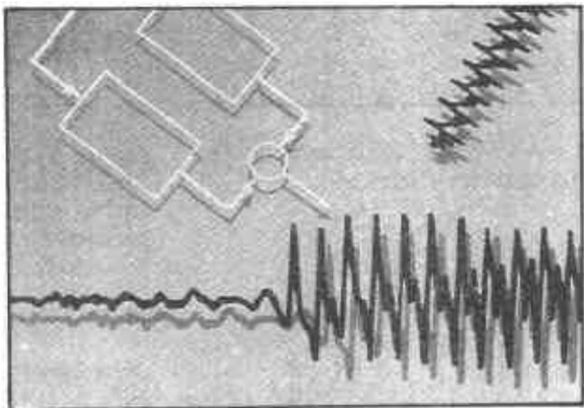

# 1.0 INTRODUCTION

As described in the Foreword, the intuitive notions of signals and systems arise in a rich variety of contexts. Moreover, as we will see in this book, there is an analytical framework—that is, a language for describing signals and systems and an extremely powerful set of tools for analyzing them—that applies equally well to problems in many fields. In this chapter, we begin our development of the analytical framework for signals and systems by introducing their mathematical description and representations. In the chapters that follow, we build on this foundation in order to develop and describe additional concepts and methods that add considerably both to our understanding of signals and systems and to our ability to analyze and solve problems involving signals and systems that arise in a broad array of applications.

# 1.1 CONTINUOUS-TIME AND DISCRETE-TIME SIGNALS

# 1.1.1 Examples and Mathematical Representation

Signals may describe a wide variety of physical phenomena. Although signals can be represented in many ways, in all cases the information in a signal is contained in a pattern of variations of some form. For example, consider the simple circuit in Figure 1.1. In this case, the patterns of variation over time in the source and capacitor voltages,  $\nu_{x}$  and  $\nu_{r}$ , are examples of signals. Similarly, as depicted in Figure 1.2, the variations over time of the applied force  $f$  and the resulting automobile velocity  $\nu$  are signals. As another example, consider the human vocal mechanism, which produces speech by creating fluctuations in acoustic pressure. Figure 1.3 is an illustration of a recording of such a speech signal, obtained by

  
Figure 1.1 A simple RC circuit with source voltage  $v_{s}$  and capacitor voltage  $v_{c}$ .

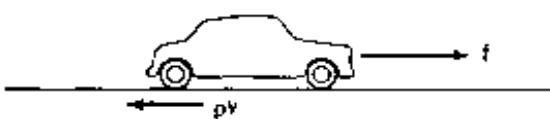  
Figure 1.2 An automobile responding to an applied force  $f$  from the engine and to a retarding frictional force  $\rho v$  proportional to the automobile's velocity  $v$ .

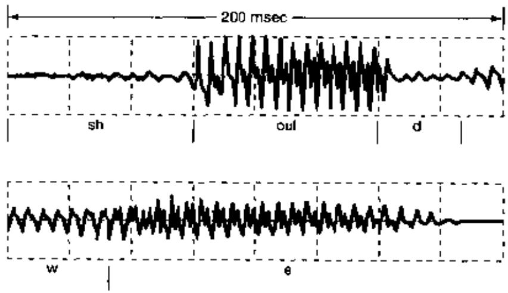  
Figure 1.3 Example of a recording of speech. [Adapted from Applications of Digital Signal Processing, A.V. Oppenheim, ed. (Englewood Cliffs, N.J.: Prentice-Hall, Inc., 1978). p. 121.] The signal represents acoustic pressure variations as a function of time for the spoken words "should we chase." The top line of the figure corresponds to the word "should," the second line to the word "we," and the last two lines to the word "chase." (We have indicated the approximate beginnings and endings of each successive sound in each word.)

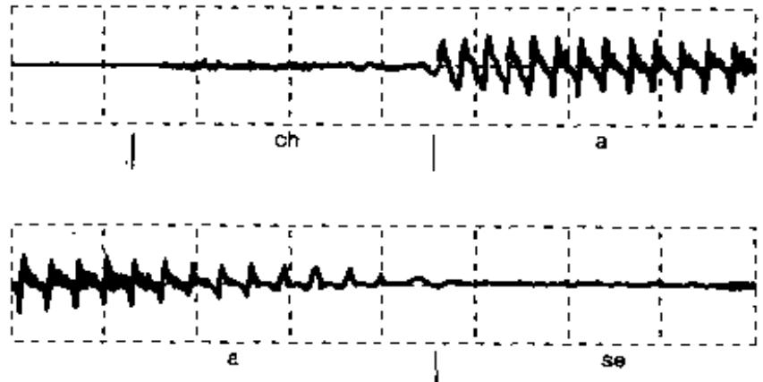

using a microphone to sense variations in acoustic pressure, which are then converted into an electrical signal. As can be seen in the figure, different sounds correspond to different patterns in the variations of acoustic pressure, and the human vocal system produces intelligible speech by generating particular sequences of these patterns. Alternatively, for the monochromatic picture, shown in Figure 1.4, it is the pattern of variations in brightness across the image that is important.

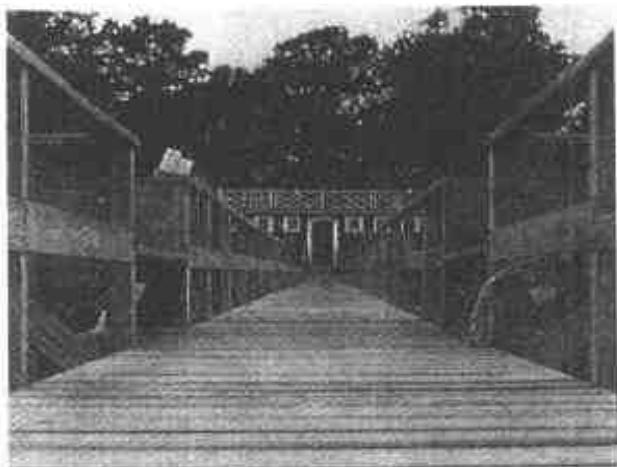  
Figure 1.4 A monochromatic picture.

Signals are represented mathematically as functions of one or more independent variables. For example, a speech signal can be represented mathematically by acoustic pressure as a function of time, and a picture can be represented by brightness as a function of two spatial variables. In this book, we focus our attention on signals involving a single independent variable. For convenience, we will generally refer to the independent variable as time, although it may not in fact represent time in specific applications. For example, in geophysics, signals representing variations with depth of physical quantities such as density, porosity, and electrical resistivity are used to study the structure of the earth. Also, knowledge of the variations of air pressure, temperature, and wind speed with altitude are extremely important in meteorological investigations. Figure 1.5 depicts a typical example of annual average vertical wind profile as a function of height. The measured variations of wind speed with height are used in examining weather patterns, as well as wind conditions that may affect an aircraft during final approach and landing.

Throughout this book we will be considering two basic types of signals: continuous- time signals and discrete- time signals. In the case of continuous- time signals the independent variable is continuous, and thus these signals are defined for a continuum of values

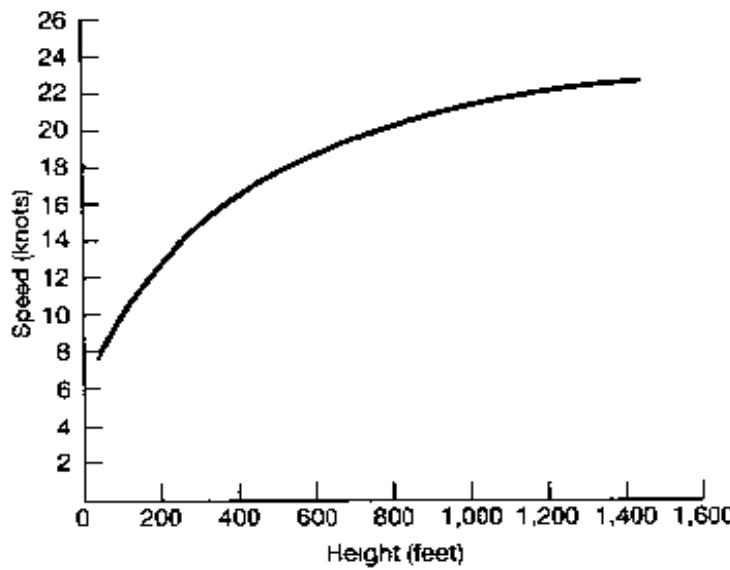  
Figure 1.5 Typical annual vertical wind profile. (Adapted from Crawford and Hudson, National Severe Storms Laboratory Report, ESSA ERLTM-NSSL 48, August 1970.)

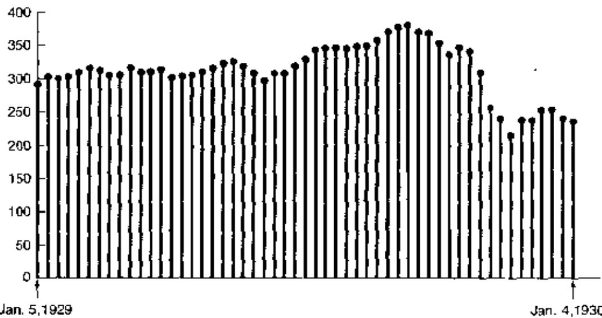  
Figure 1.6 An example of a discrete-time signal: The weekly Dow-Jones stock market index from January 5, 1929, to January 4, 1930.

of the independent variable. On the other hand, discrete- time signals are defined only at discrete times, and consequently, for these signals, the independent variable takes on only a discrete set of values. A speech signal as a function of time and atmospheric pressure as a function of altitude are examples of continuous- time signals. The weekly Dow- Jones stock market index, as illustrated in Figure 1.6, is an example of a discrete- time signal. Other examples of discrete- time signals can be found in demographic studies in which various attributes, such as average budget, crime rate, or pounds of fish caught, are tabulated against such discrete variables as family size, total population, or type of fishing vessel, respectively.

To distinguish between continuous- time and discrete- time signals, we will use the symbol  $t$  to denote the continuous- time independent variable and  $n$  to denote the discrete- time independent variable. In addition, for continuous- time signals we will enclose the independent variable in parentheses  $(\cdot)$ , whereas for discrete- time signals we will use brackets  $[\cdot ]$  to enclose the independent variable. We will also have frequent occasions when it will be useful to represent signals graphically. Illustrations of a continuous- time signal  $x(t)$  and a discrete- time signal  $x[n]$  are shown in Figure 1.7. It is important to note that the discrete- time signal  $x[n]$  is defined only for integer values of the independent variable. Our choice of graphical representation for  $x[n]$  emphasizes this fact, and for further emphasis we will on occasion refer to  $x[n]$  as a discrete- time sequence.

A discrete- time signal  $x[n]$  may represent a phenomenon for which the independent variable is inherently discrete. Signals such as demographic data are examples of this. On the other hand, a very important class of discrete- time signals arises from the sampling of continuous- time signals. In this case, the discrete- time signal  $x[n]$  represents successive samples of an underlying phenomenon for which the independent variable is continuous. Because of their speed, computational power, and flexibility, modem digital processors are used to implement many practical systems, ranging from digital autopilots to digital audio systems. Such systems require the use of discrete- time sequences representing sampled versions of continuous- time signals—e.g., aircraft position, velocity, and heading for an

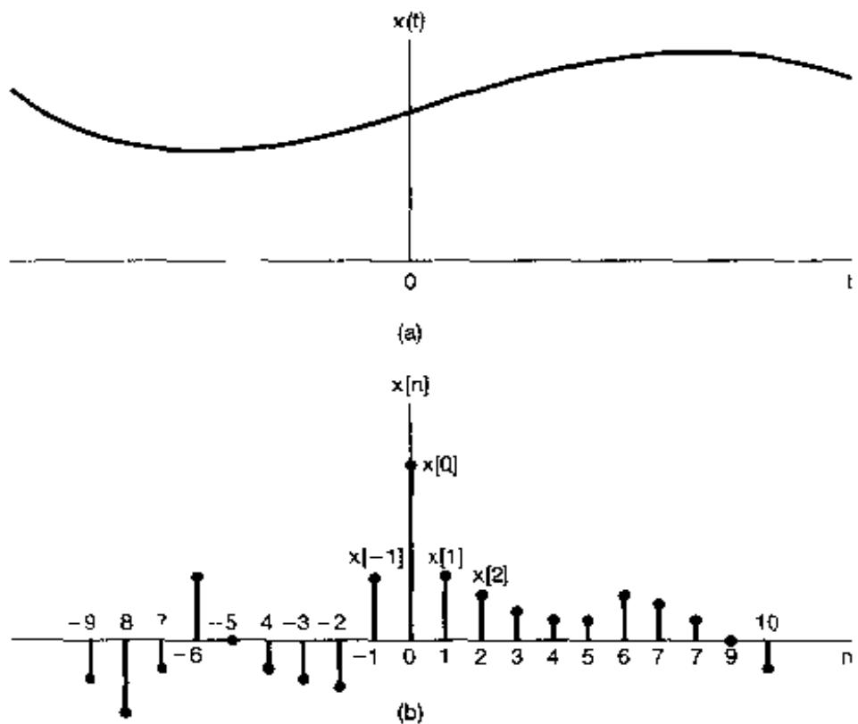  
Figure 1.7 Graphical representations of (a) continuous-time and (b) discrete-time signals.

autopilot or speech and music for an audio system. Also, pictures in newspapers—or in this book, for that matter—actually consist of a very fine grid of points, and each of these points represents a sample of the brightness of the corresponding point in the original image. No matter what the source of the data, however, the signal  $j[n]$  is defined only for integer values of  $n$ . It makes no more sense to refer to the  $3\frac{1}{2}$ th sample of a digital speech signal than it does to refer to the average budget for a family with  $2\frac{1}{2}$  family members.

Throughout most of this book we will treat discrete- time signals and continuous- time signals separately but in parallel, so that we can draw on insights developed in one setting to aid our understanding of another. In Chapter 7 we will return to the question of sampling, and in that context we will bring continuous- time and discrete- time concepts together in order to examine the relationship between a continuous- time signal and a discrete- time signal obtained from it by sampling.

# 1.1.2 Signal Energy and Power

From the range of examples provided so far, we see that signals may represent a broad variety of phenomena. In many, but not all, applications, the signals we consider are directly related to physical quantities capturing power and energy in a physical system. For example, if  $\nu (t)$  and  $i(t)$  are, respectively, the voltage and current across a resistor with resistance  $R$ , then the instantaneous power is

$$
p(t) = \nu (t)i(t) = \frac{1}{R}\nu^2 (t). \tag{1.1}
$$

The total energy expended over the time interval  $t_{1} \leq t \leq t_{2}$  is

$$
\int_{t_{1}}^{t_{2}}p(t)dt = \int_{t_{1}}^{t_{2}}\frac{1}{R}\nu^{2}(t)dt, \tag{1.2}
$$

and the average power over this time interval is

$$
\frac{1}{t_{2} - t}\int_{t_{1}}^{t_{2}}p(t)dt = \frac{1}{t_{2} - t_{1}}\int_{t_{1}}^{t_{2}}\frac{1}{R}\nu^{2}(t)dt. \tag{1.3}
$$

Similarly, for the automobile depicted in Figure 1.2, the instantaneous power dissipated through friction is  $p(t) = b\nu^{2}(t)$ , and we can then define the total energy and average power over a time interval in the same way as in eqs. (1.2) and (1.3).

With simple physical examples such as these as motivation, it is a conimon and worthwhile convention to use similar terminology for power and energy for any continuous- time signal  $x(t)$  or any discrete- time signal  $x[n]$ . Moreover, as we will see shortly, we will frequently find it convenient to consider signals that take on complex values in this case, the total energy over the time interval  $t_{1} \leq t \leq t_{2}$  in a continuous- time signal  $x(t)$  is defined as

$$
\int_{t_{1}}^{t_{2}}|x(t)|^{2}dt, \tag{1.4}
$$

where |x| denotes the magnitude of the (possibly complex) number x. The time- averaged power is obtained by dividing eq. (1.4) by the length,  $n - t_{1}$  of the time interval. Similarly, the total energy in a discrete- time signal  $x[n]$  over the time interval  $n_{1}\leq n\leq n_{2}$  is defined as

$$
\sum_{n = n_{1}}^{n_{2}}|x[n]|^{2}, \tag{1.5}
$$

and dividing by the number of points in the interval,  $n_{2} - n_{1} + 1$ , yields the average power over the interval. It is important to remember that the terms "power" and "energy" are used here independently of whether the quantities in eqs. (1.4) and (1.5) actually are related to physical energy. Nevertheless, we will find it convenient to use these terms in a general fashion.

Furthermore, in many systems we will be interested in examining power and energy in signals over an infinite time interval, i.e., for  $- \infty < n < +\infty$  or for  $- \infty < n < +\infty$ . In these cases, we define the total energy as limits of eqs. (1.4) and (1.5) as the time interval increases without bound. That is, in continuous time,

$$
E_{\infty} \triangleq \lim_{T \to \infty} \int_{-T}^{T} |x(t)|^{2} dt = \int_{-\infty}^{+\infty} |x(t)|^{2} dt, \tag{1.6}
$$

and in discrete time.

$$
E_{\infty} \triangleq \lim_{N \to \infty} \sum_{n = -N}^{+N} |x[n]|^{2} = \sum_{n = -N}^{+\infty} |x[n]|^{2}. \tag{1.7}
$$

Even if such a relationship does exist, eqs. (1.4) and (1.5) may have the wrong dimensions and scalings. For example, comparing eqs. (1.2) and (1.4), we see that if  $x(t)$  represents the voltage across a resistor, then eq. (1.4) must be divided by the resistance (measured, for example, in ohms) to obtain units of physical energy.

Note that for some signals the integral in eq. (1.6) or sum in eq. (1.7) might not converge—e.g., if  $x(t)$  or  $x[n]$  equals a nonzero constant value for all time. Such signals have infinite energy, while signals with  $E_{\infty} < \infty$  have finite energy.In an analogous fashion, we can define the time- averaged power over an infinite interval as

In an analogous fashion, we can define the time- averaged power over an infinite interval as

$$
P_{\infty} \triangleq \lim_{t \to \infty} \frac{1}{2T} \int_{t}^{T} |x(t)|^{2} dt \tag{1.8}
$$

and

$$
P_{\infty} \triangleq \lim_{N \to \infty} \frac{1}{2N + 1} \sum_{n = -N}^{+N} |x[n]|^{2} \tag{1.9}
$$

in continuous time and discrete time, respectively. With these definitions, we can identify three important classes of signals. The first of these is the class of signals with finite total energy, i.e., those signals for which  $E_{\infty} < \infty$ . Such a signal must have zero average power, since in the continuous time case, for example, we see from eq. (1.8) that

$$
P_{\infty} = \lim_{T \to \infty} \frac{E_{\infty}}{2T} = 0. \tag{1.10}
$$

An example of a finite- energy signal is a signal that takes on the value 1 for  $0 \leq t \leq 1$  and 0 otherwise. In this case,  $E_{\infty} = 1$  and  $P_{\infty} = 0$

A second class of signals are those with finite average power  $P_{\infty}$  From what we have just seen, if  $P_{\infty} > 0$  then, of necessity,  $E_{\infty} = \infty$  . This, of course, makes sense, since if there is a nonzero average energy per unit time (i.e., nonzero power), then integrating or summing this over an infinite time interval yields an infinite amount of energy. For example, the constant signal  $x[n] = 4$  has infinite energy, but average power  $P_{\infty} = 16$  There are also signals for which neither  $P_{\infty}$  nor  $E_{\infty}$  are finite. A simple example is the signal  $x(t) = t$  . We will encounter other examples of signals in each of these classes in the remainder of this and the following chapters.

# 1.2 TRANSFORMATIONS OF THE INDEPENDENT VARIABLE

A central concept in signal and system analysis is that of the transformation of a signal. For example, in an aircraft control system, signals corresponding to the actions of the pilot are transformed by electrical and mechanical systems into changes in aircraft thrust or the positions of aircraft control surfaces such as the rudder or ailerons, which in turn are transformed through the dynamics and kinematics of the vehicle into changes in aircraft velocity and heading. Also, in a high- fidelity audio system, an input signal representing music as recorded on a cassette or compact disc is modified in order to enhance desirable characteristics, to remove recording noise, or to balance the several components of the signal (e.g., treble and bass). In this section, we focus on a very limited but important class of elementary signal transformations that involve simple modification of the independent variable, i.e., the time axis. As we will see in this and subsequent sections of this chapter, these elementary transformations allow us to introduce several basic properties of signals and systems. In later chapters, we will find that they also play an important role in defining and characterizing far richer and important classes of systems.

# 1.2.1 Examples of Transformations of the Independent Variable

A simple and very important example of transforming the independent variable of a signal is a time shift. A time shift in discrete time is illustrated in Figure 1.8, in which we have two signals  $x[n]$  and  $x[n - n_{0}]$  that are identical in shape, but that are displaced or shifted relative to each other. We will also encounter time shifts in continuous time, as illustrated in Figure 1.9, in which  $x(t - t_{0})$  represents a delayed (if  $t_{0}$  is positive) or advanced (if  $t_{1}$  is negative) version of  $x(t)$ . Signals that are related in this fashion arise in applications such as radar, sonar, and seismic signal processing, in which several receivers at different locations observe a signal being transmitted through a medium (water, rock, air, etc.) In this case, the difference in propagation time from the point of origin of the transmitted signal to any two receivers results in a time shift between the signals at the two receivers.

A second basic transformation of the time axis is that of time reversal. For example. as illustrated in Figure 1.10, the signal  $\lambda [- n]$  is obtained from the signal  $x[n]$  by a reflection about  $n = 0$  (i.e., by reversing the signal). Similarly, as depicted in Figure 1.11, the signal  $x(- t)$  is obtained from the signal  $x(t)$  by a reflection about  $t = 0$ . Thus, if  $x(t)$  represents an audio tape recording, then  $x(- t)$  is the same tape recording played backward. Another transformation is that of time scaling. In Figure 1.12 we have illustrated three signals.  $x(t)$ ,  $x(2t)$ , and  $x(t / 2)$ , that are related by linear scale changes in the independent variable. If we again think of the example of  $x(t)$  as a tape recording, then  $x(2t)$  is that recording played at twice the speed, and  $x(t / 2)$  is the recording played at half- speed.

It is often of interest to determine the effect of transforming the independent variable of a given signal  $x(t)$  to obtain a signal of the form  $x(\alpha t + \beta)$ , where  $\alpha$  and  $\beta$  are given numbers. Such a transformation of the independent variable preserves the shape of  $x(t)$ , except that the resulting signal may be linearly stretched if  $|\alpha | < 1$ , linearly compressed if  $|\alpha | > 1$ , reversed in time if  $\alpha < 0$ , and shifted in time if  $\beta$  is nonzero. This is illustrated in the following set of examples.

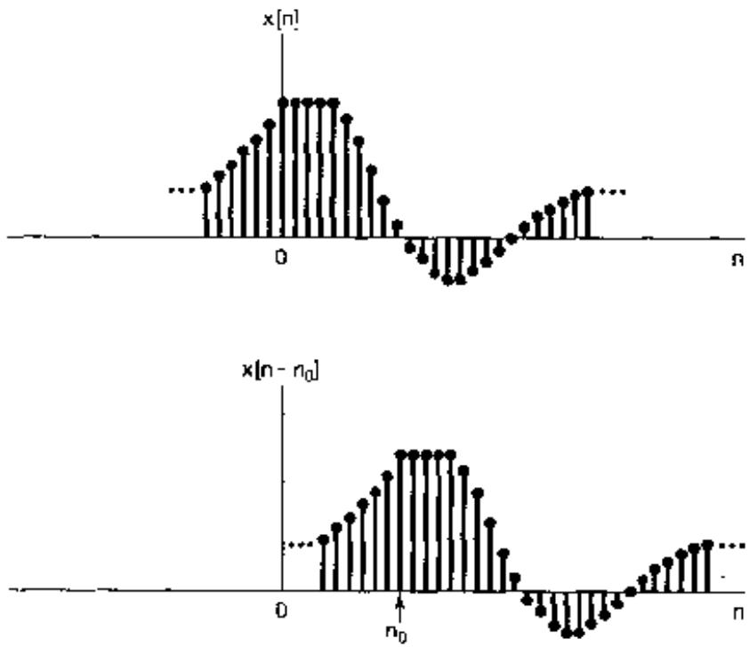  
Figure 1.8 Discrete-time signals related by a time shift. In this figure  $n > 0$ , so that  $x[n - n_{0}]$  is a delayed version of  $x[n]$  (i.e., each point in  $x[n]$  occurs later in  $x[n - n_{0}]$ ).

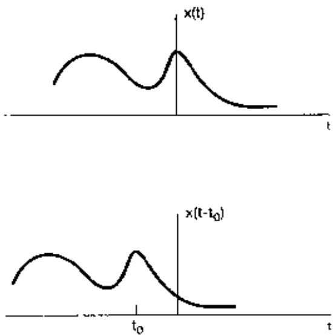  
Figure 1.9 Continuous-time signals related by a time shift. In this figure  $t_0 < 0$ , so that  $x(t - t_0) \leq \text{an advanced version of} x(t)$  (i.e., each point in  $x(t)$  occurs at an earlier time in  $x(t - t_0)$ )

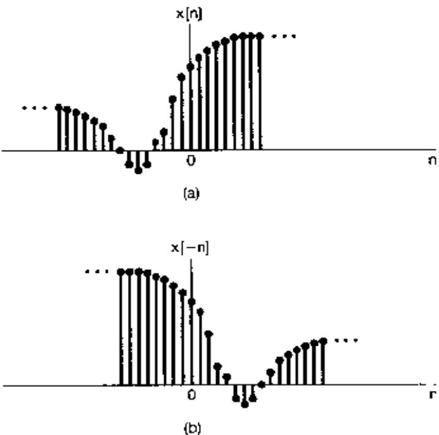  
Figure 1.10 (a) A discrete-time signal  $x(t)$ ; (b) its reflection  $x(-t)$  about  $t = 0$ .

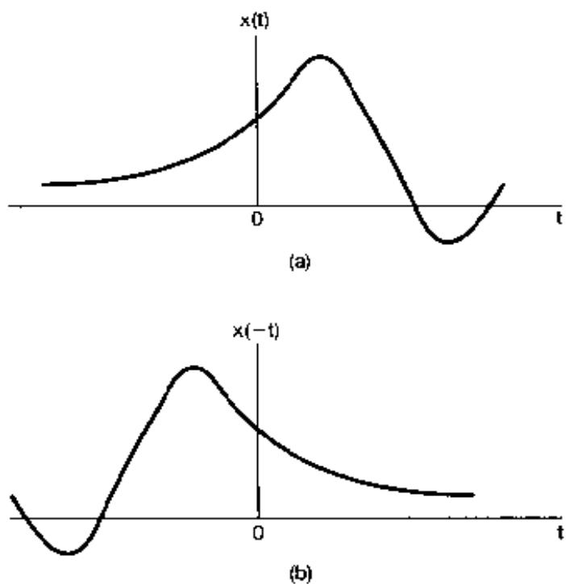  
Figure 1.11 (a) A continuous-time signal  $x(t)$ ; (b) its reflection  $x(-t)$  about  $t = 0$ .

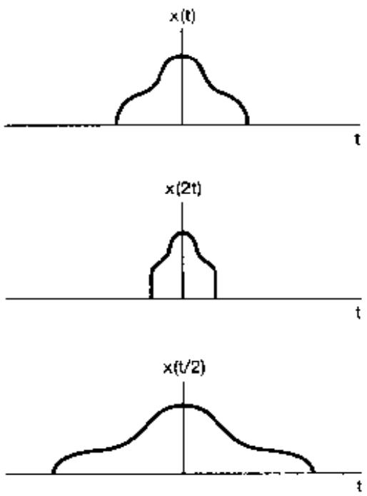  
Figure 1.12 Continuous-time signals related by time scaling.

# Example 1.1

Given the signal  $x(t)$  shown in Figure 1.13(a), the signal  $x(t + 1)$  corresponds to an advance (shift to the left) by one unit along the  $t$  axis as illustrated in Figure 1.13(b). Specifically, we note that the value of  $x(t)$  at  $t = t_0$  occurs in  $x(t + 1)$  at  $t = t_1 - 1$ . For

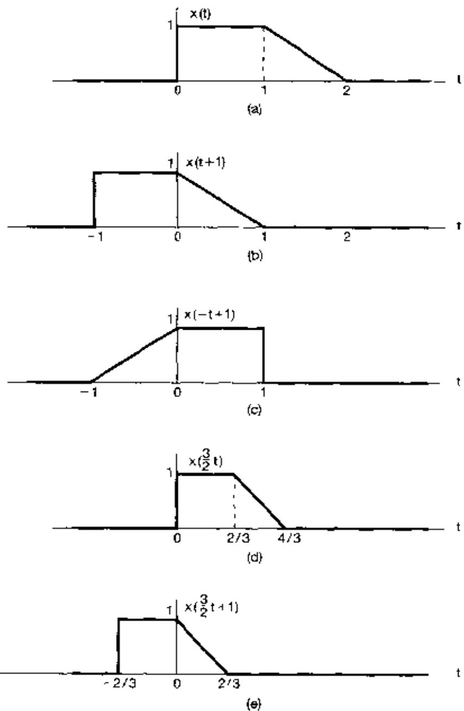  
Figure 1.13 (a) The continuous-time signal  $x(t)$  used in Examples 1.1-1 3 to illustrate transformations of the independent variable. (bj the time-shifted signal  $x(t + 1)$ ; (c) the signal  $x(-t + 1)$  obtained by a time shift and a time reversal; (d) the time-scaled signal  $x(\frac{3}{2} t)$ ; and (e) the signal  $x(\frac{3}{2} t + 1)$  obtained by time-shifting and scaling.

example, the value of  $x(t)$  at  $t = 1$  is found in  $x(t + 1)$  at  $t = 1 - 1 - 0$ . Also, since  $x(t)$  is zero for  $t< 0$ , we have  $x(t + 1)$  zero for  $t< - 1$ . Similarly, since  $x(t)$  is zero for  $t > 2$ ,  $x(t + 1)$  is zero for  $t > 1$ .

Let us also consider the signal  $x(- t + 1)$ , which may be obtained by replacing  $t$  with  $- t$  in  $x(t + 1)$ . That is,  $x(- t + 1)$  is the time reversed version of  $x(t + 1)$ . Thus,  $x(- t + 1)$  may be obtained graphically by reflecting  $x(t + 1)$  about the  $t$  axis as shown in Figure 1.13(c).

# Example 1.2

Given the signal  $x(t)$  shown in Figure 1.13(a), the signal  $x(\frac{3}{2} t)$  corresponds to a linear compression of  $x(t)$  by a factor of  $\frac{2}{3}$  as illustrated in Figure 1.13(d). Specifically we note that the value of  $x(t)$  at  $t = t_{0}$  occurs in  $x(\frac{3}{2} t)$  at  $t = \frac{1}{t_{0}}$ . For example, the value of  $x(t)$  at  $t = 1$  is found in  $x(\frac{3}{2} t)$  at  $t = \frac{2}{3}$  (1) =  $\frac{2}{3}$ . Also, since  $x(t)$  is zero for  $t< 0$ , we have  $x(\frac{3}{2} t)$  zero for  $t< 0$ . Similarly, since  $x(t)$  is zero for  $t > 2$ ,  $x(\frac{3}{2} t)$  is zero for  $t > \frac{4}{3}$ .

# Example 1.3

Suppose that wc would like to determine the effect of transforming the independent variable of a given signal,  $x(t)$  to obtain a signal of the form  $x(\alpha t + \beta)$  ,where  $\alpha$  and  $\beta$  are given numbers. A systematic approach to doing this is to first delay or advance  $x(t)$  in accordance with the value of  $\beta$  and then to perform time scaling and/or time reversal on the resulting signal m accordance with the value of  $\alpha$  . The delayed or advanced signal is linear,y stretched if  $|\alpha |< 1$  ,linearly compressed if  $|\alpha | > 1$  and reversed in time if  $\alpha < 0$  0 To illustrate this approach, let us show how  $x(\frac{3}{2} t + 1)$  may be determined for the signal  $x(t)$  shown in Figure 1.13(a). Since  $\beta = 1$  ,we first advance (shift to the left)  $x(t)$  by 1 as shown in Figure 1.13(b). Since  $|\alpha | = \frac{2}{3}$  , we may linearly compress the shifted signal of Figure 1.13(b) by a factor of  $\frac{2}{3}$  to obtain the signal shown in Figure 1.13(c).

In addition to their use in representing physical phenomena such as the time shift in a sonar signal and the speeding up or reversal of an audiotape, transformations of the independent variable are extremely useful in signal and system analysis. In Section 1.6 and in Chapter 2, we will use transformations of the independent variable to introduce and analyze the properties of systems. These transformations are also important in defining and examining some important properties of signals.

# 1.2.2 Periodic Signals

An important class of signals that we will encounter frequently throughout this book is the class of periodic signals. A periodic continuous- time signal  $x(t)$  has the property that there is a positive value of  $T$  for which

$$
x(t) = x(t + T) \tag{1.11}
$$

for all values of  $t$ . In other words, a periodic signal has the property that it is unchanged by a time shift of  $T$ . In this case, we say that  $x(t)$  is periodic with period  $T$ . Periodic continuous- time signals arise in a variety of contexts. For example, as illustrated in Problem 2.61, the natural response of systems in which energy is conserved, such as ideal  $LC$  circuits without resistive energy dissipation and ideal mechanical systems without frictional losses, are periodic and, in fact, are composed of some of the basic periodic signals that we will introduce in Section 1.3.

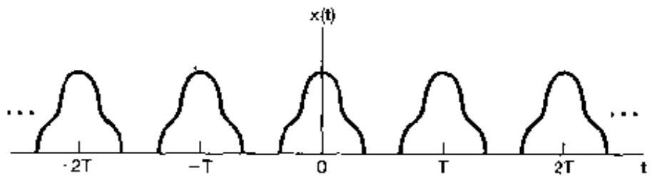  
Figure 1.14 A continuous-time periodic signal

An example of a periodic continuous- time signal is given in Figure 1 14. From the figure or from eq. (1.11), we can readily deduce that if  $x(t)$  is periodic with period  $T_{i}$  then  $x(t) = x(t + nT)$  for all  $t$  and for any integer m. Thus,  $x(t)$  is also periodic with period 2T,3T,4T,...The fundamental period  $T_{0}$  of  $x(t)$  is the smallest positive value of  $T$  for which eq. (1.11) holds. This definition of the fundamental period works, except if  $x(t)$  is a constant. In this case the fundamental period is undefined, since  $x(t)$  is periodic for any choice of  $T$  (so there is no smallest positive value). A signal  $x(t)$  that is not periodic will be referred to as an aperiodic signal.

Periodic signals are defined analogously in discrete time. Specifically, a discrete- time signal  $x[n]$  is periodic with period  $N$ , where  $N$  is a positive integer, if it is unchanged by a time shift of  $N$ , i.e., if

$$
x[n] = x[n + N] \tag{1.12}
$$

for all values of n.If eq.1.12) holds, then  $x[n]$  is also periodic with period 2N,3A,.. The fundamental period  $N_{0}$  is the smallest positive value of  $N$  for which cq.(1.12) holds. An example of a discrete- time periodic signal with fundamental period  $N_{0} = 3$  is shown in Figure 1.15.

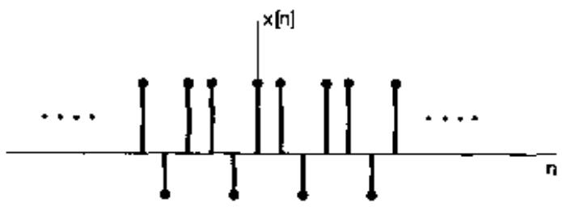  
Figure 1.15 A discrete-time periodic signal with fundamental period  $N_{0} = 3$ .

# Example 1.4

Let us illustrate the type of problem solving that may be required in determining whether or not a given signal is periodic. The signal whose periodicity we wish to check is given by

$$
x(t) = \left\{ \begin{array}{ll}\cos (t) & \text{if} t < 0 \\ \sin (t) & \text{if} t \geq 0 \end{array} \right. \tag{1 13}
$$

From trigonometry, we know that cos(t + 2π) = cos(t) and sin(t + 2π) - sin(t). Thus, considering t > 0 and t < 0 separately, we see that x(t) does repeat itself over every interval of length 2π. However, as illustrated in Figure 1 16, x(t) also has a discontinuity at the time origin that does not recur at any other time. Since every feature in the shape of a periodic signal must recur periodically, we conclude that the signal x(t) is not periodic.

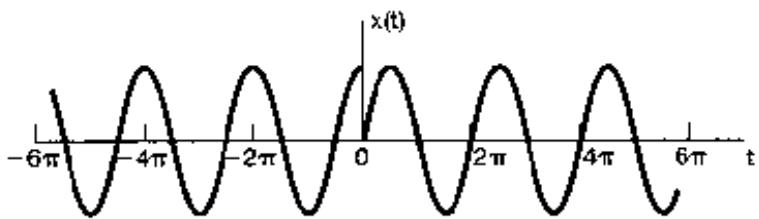  
Figure 1.16 The signal  $x(t)$  considered in Example 1.4.

# 1.2.3 Even and Odd Signals

Another set of useful properties of signals relates to their symmetry under time reversal. A signal  $x(t)$  or  $x[n]$  is referred to as an even signal if it is identical to its time- reversed counterpart, i.e., with its reflection about the origin. In continuous time a signal is even if

$$
x(-t) = x(t), \tag{1.14}
$$

while a discrete- time signal is even if

$$
x[-n] = x[n]. \tag{1 15}
$$

A signal is referred to as odd if

$$
\begin{array}{r}{x(-t) = -x(t),}\\ {x[-n] = -x[n].} \end{array} \tag{1.16}
$$

An odd signal must necessarily be 0 at  $t = 0$  or  $n = 0$ , since eqs. (1.16) and (1.17) require that  $x(0) = - x(0)$  and  $x[0] = - x[0]$ . Examples of even and odd continuous- time signals are shown in Figure 1.17.

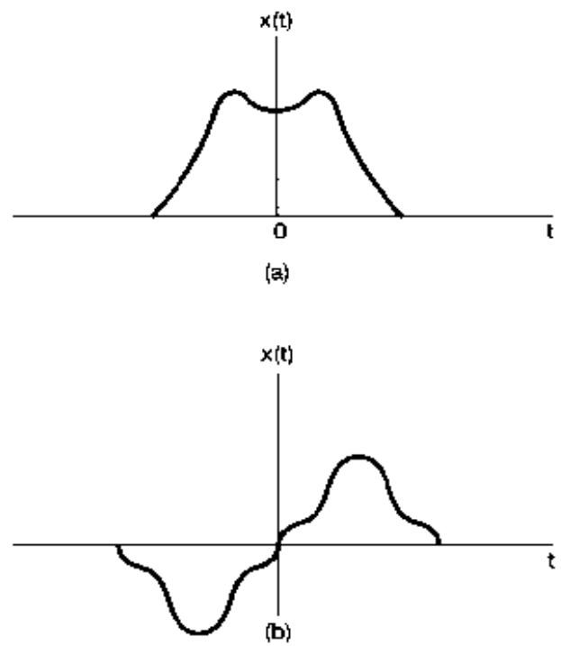  
Figure 1.17 (a) An even continuous-time signal; (b) an odd continuous-time signal.

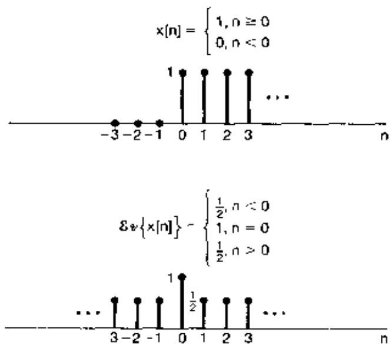

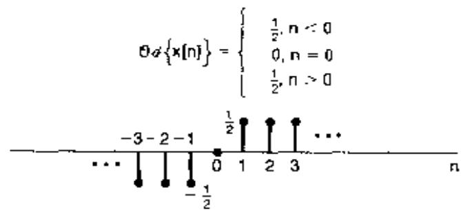  
Figure 1.18 Example of the even-odd decomposition of a discrete-time signal.

An important fact is that any signal can be broken into a sum of two signals, one of which is even and one of which is odd. To see this, consider the signal

$$
\delta \nu \{x(t)\} = \frac{1}{2} [x(t) + x(-t)], \tag{1.18}
$$

which is referred to as the even part of  $x(t)$ . Similarly, the odd part of  $x(t)$  is given by

$$
\theta d\{x(t)\} = \frac{1}{2} [x(t) - x(-t)]. \tag{1.19}
$$

It is a simple exercise to check that the even part is in fact even, that the odd part is odd, and that  $x(t)$  is the sum of the two. Exactly analogous definitions hold in the discrete- time case. An example of the even- odd decomposition of a discrete- time signal is given in Figure 1.18.

# 1.3 EXPONENTIAL AND SINUSOIDAL SIGNALS

In this section and the next, we introduce several basic continuous- time and discrete- time signals. Not only do these signals occur frequently, but they also serve as basic building blocks from which we can construct many other signals.

# 1.3.1 Continuous-Time Complex Exponential and Sinusoidal Signals

The continuous- time complex exponential signal is of the form

$$
x(t) = C e^{a t}, \tag{1.20}
$$

where  $c$  and  $\pmb{a}$  are, in general, complex numbers. Depending upon the values of these parameters, the complex exponential can exhibit several different characteristics.

# Real Exponential Signals

As illustrated in Figure 1.19, if  $c$  and  $\pmb{a}$  are real [in which case  $\pmb {x}(t)$  is called a real exponential], there are basically two types of behavior. If  $\pmb{a}$  is positive, then as t increases  $\pmb {x}(t)$  is a growing exponential, a form that is used in describing many different physical processes, including chain reactions in atomic explosions and complex chemical reactions. If  $\pmb{a}$  is negative. then  $\pmb {x}(t)$  is a decaying exponential, a signal that is also used to describe a wide variety of phenomena, including the process of radioactive decay and the responses of RC circuits and damped mechanical systems. In particular, as shown in Problems 2.61 and 2.62, the natural responses of the circuit in Figure 1.1 and the automobile in Figure 1.2 are decaying exponentials. Also, we note that for  $\pmb {a} = \pmb {0},$ $\pmb {x}(t)$  is constant.

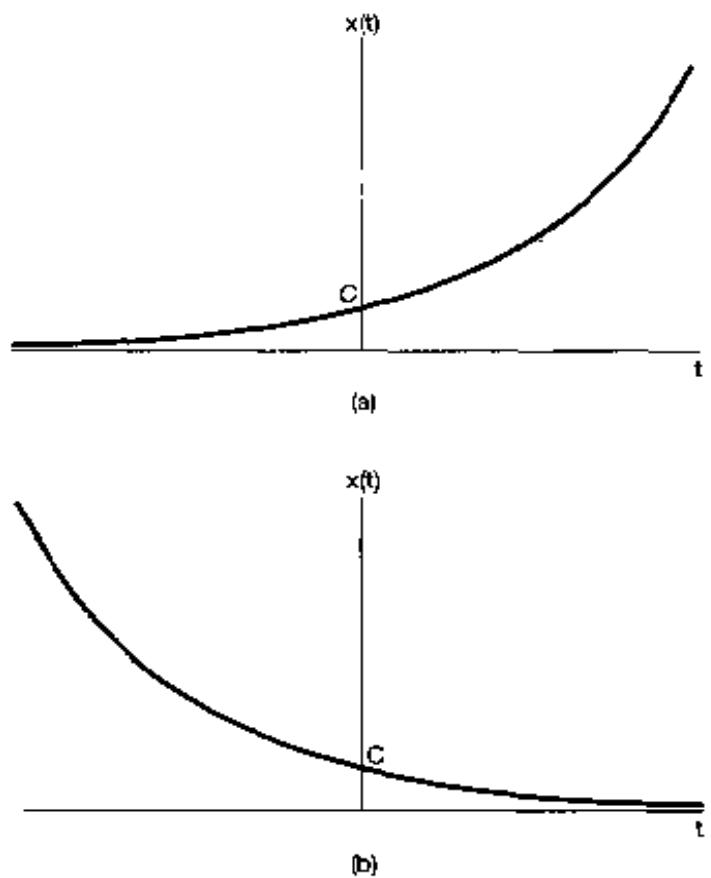  
Figure 1.19 Continuous-time real exponential  $x(t) = C e^{a t}$  : (a)  $a > 0$  (b)  $a< 0$

# Periodic Complex Exponential and Sinusoidal Signals

A second important class of complex exponentials is obtained by constraining a to be purely imaginary. Specifically, consider

$$
x(t) = e^{j\omega_{0}t}. \tag{1.21}
$$

An important property of this signal is that it is periodic. To verify this, we recall from eq (1.11) that  $x(t)$  will be periodic with period  $\pmb{T}$  if

$$
e^{j\omega_{0}t} = e^{j\omega_{0}(t\cdot T)}. \tag{1.22}
$$

Or, since

$$
e^{j\omega_{0}t + T} = e^{j\omega_{0}t}e^{j\omega_{0}T},
$$

it follows that for periodicity, we must have

$$
e^{j\omega_{0}T} = 1. \tag{1.23}
$$

If  $\omega_{0} = 0$  then  $x(t) = 1$  which is periodic for any value of  $\pmb{T}$  If  $\omega_{0}\neq 0$  then the fundamental period  $T_{0}$  of  $\pmb {x}(t)$  that is, the smallest positive value of  $\pmb{T}$  for which eq. (1.23) holds- is

$$
T_{0} = \frac{2\pi}{|u_{0}|}, \tag{1.24}
$$

Thus, the signals  $e^{j\omega_{0}t}$  and  $e^{- j\omega_{0}t}$  have the same fundamental period.

A signal closely related to the periodic complex exponential is the sinusoidal signal

$$
x(t) = A cos(wo + Φ), \tag{1.25}
$$

as illustrated in Figure 1.20. With seconds as the units of t, the units of  $\phi$  and  $\omega_{0}$  are radians and radians per second, respectively. It is also common to write  $\omega_{0} = 2\pi f_{0}$  where  $f_{\parallel}$  has the units of cycles per second, or hertz (Hz). Like the complex exponential signal, the sinusoidal signal is periodic with fundamental period  $T_{0}$  given by eq. (1.24). Sinusoidal and

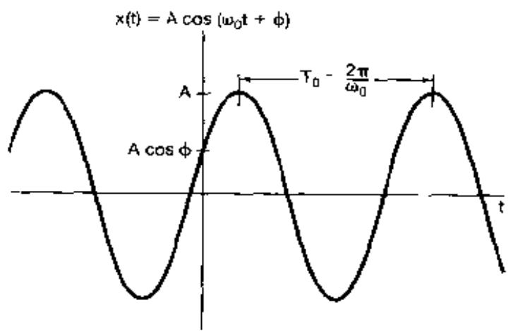  
Figure 1.20 Continuous-time sinusoidal signal.

complex exponential signals are also used to describe the characteristics of many physical processes- in particular, physical systems in which energy is conserved. For example, as shown in Problem 2.61, the natural response of an LC circuit is sinusoidal, as is the simple harmonic motion of a mechanical system consisting of a mass connected by a spring to a stationary support. The acoustic pressure variations corresponding to a single musical tone are also sinusoidal.

By using Euler's relation,² the complex exponential in eq. (1.21) can be written in terms of sinusoidal signals with the same fundamental period:

$$
e^{j\omega_{0}t} = \cos \omega_{0}t + j\sin \omega_{0}t. \tag{1.26}
$$

Similarly, the sinusoidal signal of eq. (1.25) can be written in terms of periodic complex exponentials, again with the same fundamental period:

$$
A\cos (\omega_{0}t + \phi) = \frac{A}{2} e^{j\phi}e^{j\omega_{0}t} + \frac{A}{2} e^{-j\phi}e^{-j\omega_{0}t}. \tag{1.27}
$$

Note that the two exponentials in eq. (1.27) have complex amplitudes. Alternatively, we can express a sinusoid in terms of a complex exponential signal as

$$
A\cos (\omega_{0}t + \phi) = A\{Re\{e^{j(\omega_{0}t + \phi)}\} \} , \tag{1.28}
$$

where, if  $c$  is a complex number,  $\{Re\{c\}\}$  denotes its real part. We will also use the notation  $\{m\} \{c\}$  for the imaginary part of  $c$ , so that, for example,

$$
A\sin (\omega_{0}t + \phi) = A\{m\{e^{j(\omega_{0}t + \phi)}\} \} . \tag{1.29}
$$

From eq. (1.24), we see that the fundamental period  $T_{0}$  of a continuous- time sinusoidal signal or a periodic complex exponential is inversely proportional to  $|\omega_{0}|$ . which we will refer to as the fundamental frequency. From Figure 1.21, we see graphically what this means. If we decrease the magnitude of  $\omega_{0}$ , we slow down the rate of oscillation and therefore increase the period. Exactly the opposite effects occur if we increase the magnitude of  $\omega_{0}$ . Consider now the case  $\omega_{0} = 0$ . In this case, as we mentioned earlier,  $x(t)$  is constant and therefore is periodic with period  $T$  for any positive value of  $T$ . Thus, the fundamental period of a constant signal is undefined. On the other hand, there is no ambiguity in defining the fundamental frequency of a constant signal to be zero. That is, a constant signal has a zero rate of oscillation.

Periodic signals—and in particular, the complex periodic exponential signal in eq. (1.21) and the sinusoidal signal in eq. (1.25)—provide important examples of signals with infinite total energy but finite average power. For example, consider the periodic exponential signal of eq. (1.21), and suppose that we calculate the total energy and average power in this signal over one period:

$$
\begin{array}{l}{{\mathcal{E}_{p e n o d}=\int_{0}^{T_{0}}\left\{e^{j\omega_{0}t}\right\}^{2}d t}}\\ {{=\int_{0}^{T_{0}}\mathrm{i}\cdot d t=T_{0},}}\end{array} \tag{1.30}
$$

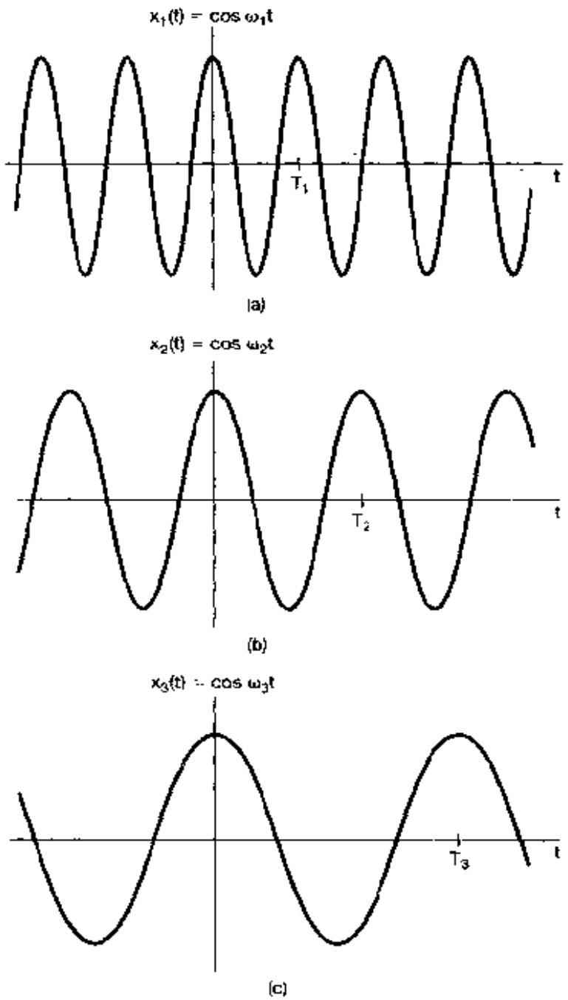  
Figure 1.21 Relationship between the fundamental frequency and period for continuous-time sinusoidal signals; here,  $\omega_{1} > \omega_{2} > \omega_{3}$ , which implies that  $T_{1} < T_{2} < T_{3}$ .

$$
P_{\mathrm{pertud}} = \frac{1}{T_{0}} E_{\mathrm{pertud}} = 1. \tag{1 31}
$$

Since there are an infinite number of periods as  $t$  ranges from  $- \infty$  to  $+\infty$ , the total energy integrated over all time is infinite. However, each period of the signal looks exactly the same. Since the average power of the signal equals 1 over each period, averaging over multiple periods always yields an average power of 1. That is, the complex periodic ex-

potential signal has finite average power equal to

$$
P_{\mathrm{c}} = \lim_{T\rightarrow \infty}\frac{1}{2T}\int_{T}^{T}|e^{i\omega t}|^{2}d t = 1. \tag{1.32}
$$

Problem 1.3 provides additional examples of energy and power calculations for periodic and aperiodic signals.

Periodic complex exponentials will play a central role in much of our treatment of signals and systems, in part because they serve as extremely useful building blocks for many other signals. We will often find it useful to consider sets of harmonically related complex exponentials—that is, sets of periodic exponentials, all of which are periodic with a common period  $T_{0}$ . Specifically, a necessary condition for a complex exponential  $e^{j\omega t}$  to be periodic with period  $T_{0}$  is that

$$
e^{j\omega T_{0}} = 1, \tag{1.33}
$$

which implies that  $\omega T_{0}$  is a multiple of  $2\pi$ , i.e.,

$$
\omega T_{0} = 2\pi k, \qquad k = 0, \pm 1, \pm 2, \ldots \tag{1.34}
$$

Thus, if we define

$$
\omega_{0} = \frac{2\pi}{T_{0}}, \tag{1.35}
$$

we see that, to satisfy eq. (1.34),  $\omega$  must be an integer multiple of  $\omega_{0}$ . That is, a harmonically related set of complex exponentials is a set of periodic exponentials with fundamental frequencies that are all multiples of a single positive frequency  $\omega_{0}$ :

$$
\phi_{k}(t) = e^{j k\omega_{k}t}, \qquad k = 0, \pm 1, \pm 2, \ldots \tag{1.36}
$$

For  $k = 0$ ,  $\phi_{k}(t)$  is a constant, while for any other value of  $k$ ,  $\phi_{k}(t)$  is periodic with fundamental frequency  $|k|\omega_{0}$  and fundamental period

$$
\frac{2\pi}{|k|\omega_{0}} = \frac{T_{0}}{|k|} \tag{1.37}
$$

The  $k$ th harmonic  $\phi_{k}(t)$  is still periodic with period  $T_{0}$  as well, as it goes through exactly  $|k|$  of its fundamental periods during any time interval of length  $T_{0}$ .

Our use of the term "harmonic" is consistent with its use in music, where it refers to tones resulting from variations in acoustic pressure at frequencies that are integer multiples of a fundamental frequency. For example, the pattern of vibrations of a string on an instrument such as a violin can be described as a superposition—i.e., a weighted sum—of harmonically related periodic exponentials. In Chapter 3, we will see that we can build a very rich class of periodic signals using the harmonically related signals of eq. (1.36) as the building blocks.

# Example 1.5

It is sometimes desirable to express the sum of two complex exponentials as the product of a single complex exponential and a single sinusoid. For example, suppose we wish to

plot the magnitude of the signal

$$
x(t) = e^{i2t} + e^{i3t}. \tag{1.38}
$$

To do this, we first factor out a complex exponential from the right side of eq. (1.35), where the frequency of this exponential factor is taken as the average of the frequencies of the two exponentials in the sum. Doing this, we obtain

$$
x(t) = e^{i2t} (e^{-i\theta} + e^{i3t}), \tag{1.39}
$$

which, because of Euler's relation, can be rewritten as

$$
x(t) = 2e^{i2t} \cos (0.5t). \tag{1.40}
$$

From this, we can directly obtain an expression for the magnitude of  $x(t)$ :

$$
|x(t)| = 2|\cos (0.5t)| \tag{1.41}
$$

Here, we have used the fact that the magnitude of the complex exponential  $e^{i2t}$  is always unity. Thus,  $\{x(t)\}$  is what is commonly referred to as a full- wave rectified sinusoid, as shown in Figure 1.22.

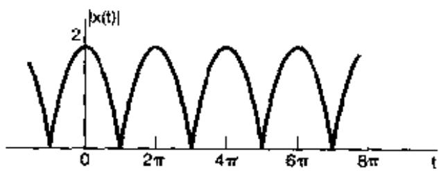  
Figure 1.22 The full-wave rectified sinusoid of Example 1.5.

# General Complex Exponential Signals

The most general case of a complex exponential can be expressed and interpreted in terms of the two cases we have examined so far: the real exponential and the periodic complex exponential. Specifically, consider a complex exponential  $C e^{i\theta}$ , where  $C$  is expressed in polar form and  $a$  in rectangular form. That is,

$$
C = \{C|e^{i\theta}
$$

and

$$
a = r + j\omega_{0}.
$$

Then

$$
C e^{a t} = \{C|e^{j\theta}e^{(r + j\omega_{0})t} = |C|e^{i\theta}e^{j(\omega_{0}t + \theta)}. \tag{1.42}
$$

Using Euler's relation, we can expand this further as

$$
C e^{a t} = \{C|e^{r t} \cos (\omega_{0} t + \theta) + j|C|e^{r t} \sin (\omega_{0} t + \theta). \tag{1.43}
$$

Thus. for  $r = 0$  the real and imaginary parts of a complex exponential are sinusoidal. For  $r > 0$  they correspond to sinusoidal signals multiplied by a growing exponential, and for  $r< 0$  they correspond to sinusoidal signals multiplied by a decaying exponential. These two cases are shown in Figure 1.23. The dashed lines in the figure correspond to the functions  $\pm |C|e^{r t}$  From eq. (1.42), we see that  $|C|e^{r t}$  is the magnitude of the complex exponential. Thus, the dashed curves act as an envelope for the oscillatory curve in the figure in that the peaks of the oscillations just reach these curves, and in this way the envelope provides us with a convenient way to visualize the general trend in the amplitude of the oscillations.

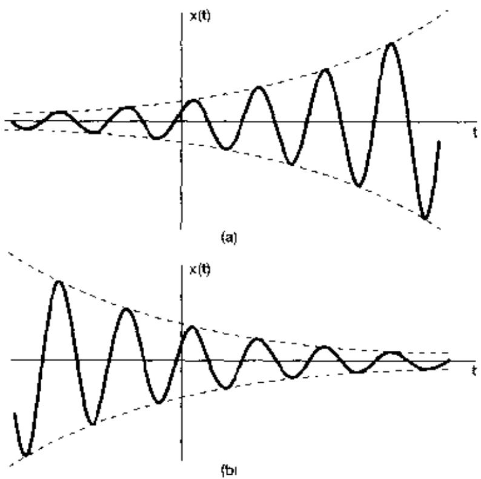  
Figure 1.23 (a) Growing sinusoidal signal  $x(t) = C e^{r t}\cos (u_{0}t + \theta)$ ,  $r > 0$ ; (b) decaying sinusoid  $x(t) = C e^{r t}\cos (u_{0}t + \theta)$ ,  $r< 0$

Sinusoidal signals multiplied by decaying exponentials are commonly referred to as damped sinusoids. Examples of damped sinusoids arise in the response of RLC circuits and in mechanical systems containing both damping and restoring forces, such as automotive suspension systems. These kinds of systems have mechanisms that dissipate energy (resistors, damping forces such as friction) with oscillations that decay in time. Examples illustrating such systems and their damped sinusoidal natural responses can be found in Problems 2.61 and 2.62.

# 1.3.2 Discrete-Time Complex Exponential and Sinusoidal Signals

As in continuous time, an important signal in discrete time is the complex exponential signal or sequence, defined by

$$
x[n] - C\alpha^{n}. \tag{1.44}
$$

where  $C$  and  $\alpha$  are, in general, complex numbers. This could alternatively be expressed in the form

$$
x[n] = C e^{\beta \pi}. \tag{1.45}
$$

where

$$
\alpha = e^{\beta}.
$$

Although the form of the discrete- time complex exponential sequence given in eq. (1.45) is more analogous to the form of the continuous- time exponential, it is often more convenient to express the discrete- time complex exponential sequence in the form of eq (1.42).

# Real Exponential Signals

If  $c$  and  $\alpha$  are real, we can have one of several types of behavior, as illustrated in Figure 1.24. If  $|\alpha | > 1$  the magnitude of the signal grows exponentially with n, while if  $|\alpha |< 1$  we have a decaying exponential. Furthermore, if  $\alpha$  is positive, all the values of  $\cos \pi$  are of the same sign, but if  $\alpha$  is negative then the sign of  $x[n]$  alternates. Note also that if  $\alpha = \mathrm{i}$  then  $x[n]$  is a constant, whereas if  $\alpha = - 1$ $x[n]$  alternates in value between  $- c$  and  $- c$  Real- valued discrete- time exponentials are often used to describe population growth as a function of generation and total return on investment as a function of day, month, or quarter.

# Sinusoidal Signals

Another important complex exponential is obtained by using the form given in eq. (1.45) and by constraining  $\beta$  to be purely imaginary (so that  $|\alpha | = 1$ ). Specifically, consider

$$
x[n] = e^{j\omega_{0}n}. \tag{1.46}
$$

As in the continuous- time case, this signal is closely related to the sinusoidal signal

$$
x[n] = A\cos (\omega_{0}n + \phi). \tag{1.47}
$$

If we take  $n$  to be dimensionless, then both  $\omega_{0}$  and  $\phi$  have units of radians. Three examples of sinusoidal sequences are shown in Figure 1.25.

As before, Euler's relation allows us to relate complex exponentials and sinusoids:

$$
e^{j\omega_{0}n} = \cos \omega_{0}n + j\sin \omega_{0}n \tag{1.48}
$$

and

$$
A\cos (\omega_{0}n + \phi) = \frac{A}{2} e^{j\phi}e^{j\omega_{0}n} + \frac{A}{2} e^{-j\phi}e^{-j\omega_{0}n}. \tag{1.49}
$$

The signals in eqs. (1.46) and (1.47) are examples of discrete- time signals with infinite total energy but finite average power. For example, since  $|e^{j\omega_{0}n}|^{2} = 1$ , every sample of the signal in eq. (1.46) contributes  $j$  to the signal's energy. Thus, the total energy for  $- \infty < n < \infty$  is infinite, while the average power per time point is obviously equal to 1. Other examples of energy and power calculations for discrete- time signals are given in Problem 1.3.

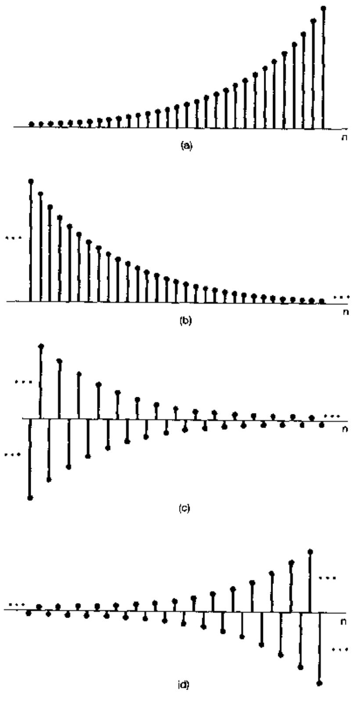

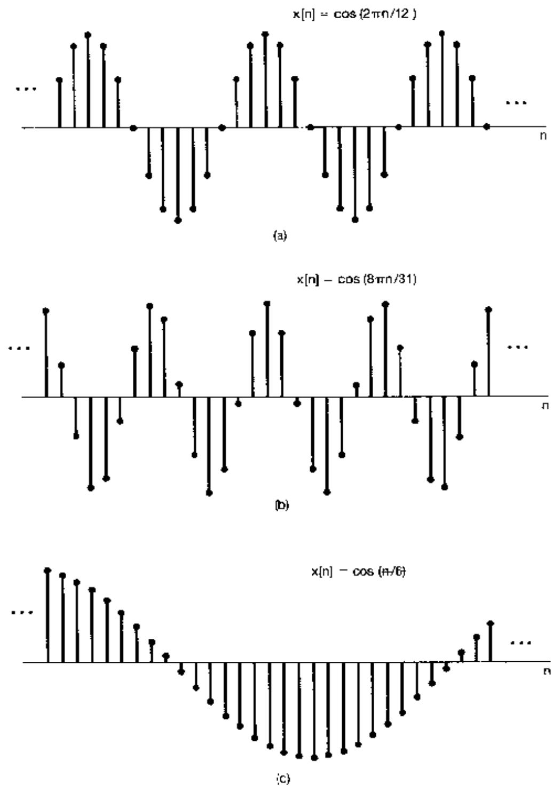

# General Complex Exponential Signals

The general discrete- time complex exponential can be written and interpreted in terms of real exponentials and sinusoidal signals. Specifically, if we write  $C$  and  $\alpha$  in polar form,

viz.,

$$
C = |C|e^{j\theta}
$$

and

$$
\alpha = |\alpha |e^{i\omega_{0}},
$$

then

$$
C\alpha^{n} = |C||\alpha |^{n}\cos (\omega_{0}n + \theta) + j|C||\alpha |^{n}\sin (\omega_{0}n + \theta) \tag{1.50}
$$

Thus, for  $|\alpha | = 1$ , the real and imaginary parts of a complex exponential sequence are sinusoidal. For  $|\alpha |< 1$  they correspond to sinusoidal sequences multiplied by a decaying exponential, while for  $|\alpha | > 1$  they correspond to sinusoidal sequences multiplied by a growing exponential. Examples of these signals are depicted in Figure 1.26.

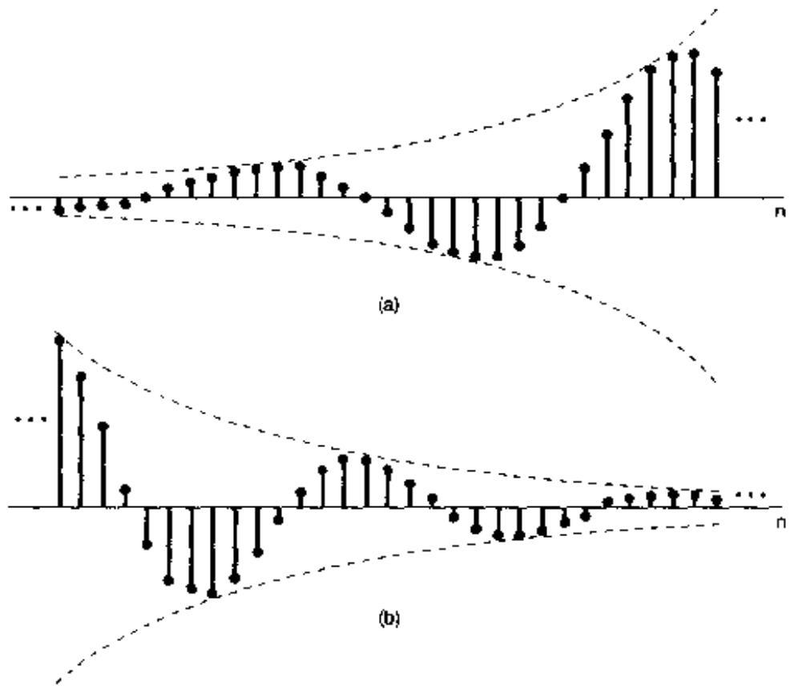  
Figure 1.26 (a) Growing discrete-time sinusoidal signals; (b) decaying discrete-time sinusoid.

# 1.3.3 Periodicity Properties of Discrete-Time Complex Exponentials

While there are many similarities between continuous- time and discrete- time signals, there are also a number of important differences. One of these concerns the discrete- time exponential signal  $e^{j\omega_{0}n}$ . In Section 1.3.1, we identified the following two properties of its

continuous- time counterpart  $e^{j\omega_{0}t}$  : (1) the larger the magnitude of  $\omega_{0}$  the higher is the rate of oscillation in the signal; and (2)  $e^{j\omega_{0}t}$  is periodic for any value of  $\omega_{0}$  . In this section we describe the discrete- time versions of both of these properties, and as we will see, there are definite differences between each of these and its continuous- time counterpart.

The fact that the first of these properties is different in discrete time is a direct consequence of another extremely important distinction between discrete- time and continuous- time complex exponentials. Specifically, consider the discrete- time complex exponential with frequency  $\omega_{0} + 2\pi$

$$
e^{j(\omega_{0} + 2\pi)n} = e^{j2\pi n}e^{j\omega_{0}n} = e^{j\omega_{0}n} \tag{1.51}
$$

From eq. (1.51), we see that the exponential at frequency  $\omega_{0} + 2\pi$  is the same as that at frequency  $\omega_{0}$ . Thus, we have a very different situation from the continuous- time case, in which the signals  $e^{j\omega_{0}t}$  are all distinct for distinct values of  $\omega_{0}$ . In discrete time, these signals are not distinct, as the signal with frequency  $\omega_{0}$  is identical to the signals with frequencies  $\omega_{0} \pm 2\pi$ ,  $\omega_{0} \pm 4\pi$ , and so on. Therefore, in considering discrete- time complex exponentials, we need only consider a frequency interval of length  $2\pi$  in which to choose  $\omega_{0}$ . Although, according to eq. (1.51), any interval of length  $2\pi$  will do, on most occasions we will use the interval  $0 \leq \omega_{0} < 2\pi$  or the interval  $- \pi \leq \omega_{0} < \pi$ .

Because of the periodicity implied by eq. (1.51), the signal  $e^{j\omega_{0}t}$  does not have a continually increasing rate of oscillation as  $\omega_{0}$  is increased in magnitude. Rather, as illustrated in Figure 1.27, as we increase  $\omega_{0}$  from 0, we obtain signals that oscillate more and more rapidly until we reach  $\omega_{0} = \pi$ . As we continue to increase  $\omega_{0}$ , we decrease the rate of oscillation until we reach  $\omega_{0} = 2\pi$ , which produces the same constant sequence as  $\omega_{0} = 0$ . Therefore, the low- frequency (that is, slowly varying) discrete- time exponentials have values of  $\omega_{0}$  near  $0, 2\pi$ , and any other even multiple of  $\pi$ , while the high frequencies (corresponding to rapid variations) are located near  $\omega_{0} = \pm \pi$  and other odd multiples of  $\pi$ . Note in particular that for  $\omega_{0} = \pi$  or any other odd multiple of  $\pi$ ,

$$
e^{j\pi \pi} = (e^{j\pi})^{n} = (-1)^{n}, \tag{1.52}
$$

so that this signal oscillates rapidly, changing sign at each point in time [as illustrated in Figure 1.27(e)].

The second property we wish to consider concerns the periodicity of the discrete- time complex exponential. In order for the signal  $e^{j\omega_{0}t}$  to be periodic with period  $N > 0$ , we must have

$$
e^{j\omega_{0}(n + N)} = e^{j\omega_{0}n}, \tag{1.53}
$$

or equivalently,

$$
e^{j\omega_{0}(n)} = 1. \tag{1.54}
$$

For eq. (1.54) to hold,  $\omega_{0}N$  must be a multiple of  $2\pi$ . That is, there must be an integer  $m$  such that

$$
\omega_{0}N = 2\pi m, \tag{1.55}
$$

or equivalently,

$$
\frac{\omega_{0}}{2\pi} = \frac{m}{N}. \tag{1.56}
$$

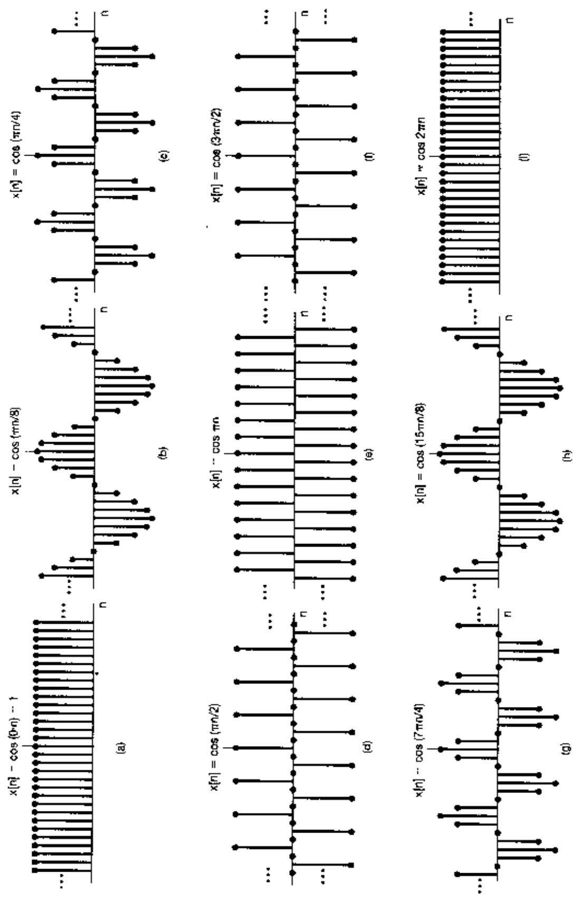

According to eq. (1.56), the signal  $e^{j\omega_{0}n}$  is periodic if  $\omega_{0} / 2\pi$  is a rational number and is not periodic otherwise. These same observations also hold for discrete- time sinusoids. For example, the signals depicted in Figure 1.25(a) and (b) are periodic, while the signal in Figure 1.25(c) is not.

Using the calculations that we have just made, we can also determine the fundamental period and frequency of discrete- time complex exponentials, where we define the fundamental frequency of a discrete- time periodic signal as we did in continuous time. That is, if  $x[n]$  is periodic with fundamental period  $N$ , its fundamental frequency is  $2\pi /N$ . Consider, then, a periodic complex exponential  $x[n] = e^{j\omega_{0}n}$  with  $\omega_{0} \neq 0$ . As we have just seen,  $\omega_{0}$  must satisfy eq. (1.56) for some pair of integers  $m$  and  $N$ , with  $N > 0$ . In Problem 1.35, it is shown that if  $\omega_{0} \neq 0$  and if  $N$  and  $m$  have no factors in common, then the fundamental period of  $x[n]$  is  $N$ . Using this fact together with eq. (1.56), we find that the fundamental frequency of the periodic signal  $e^{j\omega_{0}n}$  is

$$
\frac{2\pi}{N} = \frac{\omega_{0}}{m}. \tag{1.57}
$$

Note that the fundamental period can also be written as

$$
N = m\left(\frac{2\pi}{\omega_{0}}\right). \tag{1.58}
$$

These last two expressions again differ from their continuous- time counterparts. In Table 1.1, we have summarized some of the differences between the continuous- time signal  $e^{j\omega_{0}n}$  and the discrete- time signal  $e^{j\omega_{0}n}$ . Note that, as in the continuous- time case, the constant discrete- time signal resulting from setting  $\omega_{0} = 0$  has a fundamental frequency of zero, and its fundamental period is undefined

TABLE 1.1 Comparison of the signals eow and awo  

<table><tr><td>e^w0</td><td>e^w0</td></tr><tr><td>Distinct signals for distinct values of ω0</td><td>Identical signals for values of ω0
separated by multiples of 2π</td></tr><tr><td>Periodic for any choice of ω0</td><td>Periodic only if ω0 = 2πm/N for some integers N &amp;gt; 0 and m</td></tr><tr><td>Fundamental frequency ω0</td><td>Fundamental frequency ω0/m</td></tr><tr><td>Fundamental period ω0 = 0: undefined ω0 ≠ 0: 2π/ω0</td><td>Fundamental period* ω0 ≠ 0: undefined ω0 ≠ 0: m(2π/ω0)</td></tr></table>

Assumes that w and N do not have any factors in common.

To gain some additional insight into these properties, let us examine again the signals depicted in Figure 1.25. First, consider the sequence  $x[n] = \cos (2\pi n / 12)$ , depicted in Figure 1.25(a), which we can think of as the set of samples of the continuous- time sinusoid  $x(t) = \cos (2\pi t / 12)$  at integer time points. In this case,  $x(t)$  is periodic with fundamental period 12 and  $x[n]$  is also periodic with fundamental period 12. That is, the values of  $x[n]$  repeat every 12 points, exactly in step with the fundamental period of  $x(t)$ .

In contrast, consider the signal  $x[n] = \cos (8\pi /31)$  depicted in Figure 1.25(b), which we can view as the set of samples of  $x(t) = \cos (8\pi /31)$  at integer points in time. In this case,  $x(t)$  is periodic with fundamental period 31/4. On the other hand,  $x[n]$  is periodic with fundamental period 31. The reason for this difference is that the discrete- time signal is defined only for integer values of the independent variable. Thus, there is no sample at time  $t = 31 / 4$  when  $x(t)$  completes one period (starting from  $t = 0$ ). Similarly, there is no sample at  $t = 2$  31/4 or  $t = 3 \cdot 31 / 4$ , when  $x(t)$  has completed two or three periods, but there is a sample at  $t = 4 \cdot 31 / 4 = 31$ , when  $x(t)$  has completed four periods. This can be seen in Figure 1.25(b), where the pattern of  $x[n]$  values does not repeat with each single cycle of positive and negative values. Rather, the pattern repeats after four such cycles, namely, every 31 points.

Similarly, the signal  $x[n] = \cos (n / 6)$  can be viewed as the set of samples of the signal  $x(t) = \cos (t / 6)$  at integer time points. In this case, the values of  $x(t)$  at integer sample points never repeat, as the sample points never span an interval that is an exact multiple of the period,  $12\pi$ , of  $x(t)$ . Thus,  $x[n]$  is not periodic, although the eye visually interpolates between the sample points, suggesting the envelope  $x(t)$ , which is periodic. The use of the concept of sampling to gain insight into the periodicity of discrete- time sinusoidal sequences is explored further in Problem 1.36.

# Example 1.6

Suppose that we wish to determine the fundamental period of the discrete- time signal

$$
x[n] = e^{i2\pi (3 / n)} + e^{i3\pi (4 / n)}. \tag{1.56}
$$

The first exponential on the right- hand side of eq. (1.59) has a fundamental period of 1. While this can be verified from eq. (1.58), there is a simpler way to obtain that answer. In particular, note that the angle  $(2\pi /3)n$  of the first term must be incremented by a multiple of  $2\pi$  for the values of this exponential to begin repeating. We then immediately see that if  $n$  is incremented by 3, the angle will be incremented by a single multiple of  $2\pi$ . With regard to the second term, we see that incrementing the angle  $(3\pi /4)n$  by  $2\pi$  would require  $n$  to be incremented by  $8 / 3$ , which is impossible, since  $n$  is restricted to being an integer. Similarly, incrementing the angle by  $4\pi$  would require a noninteger increment of  $16 / 3$  to  $n$ . However, incrementing the angle by  $6\pi$  requires an increment of  $8$  to  $n$ , and thus the fundamental period of the second term is 8.

Now, for the entire signal  $x[n]$  to repeat, each of the terms in eq. (1.59) must go through an integer number of its own fundamental period. The smallest increment of  $n$  that accomplishes this is 24. That is, over an interval of 24 points, the first term on the right- hand side of eq. (1.59) will have gone through eight of its fundamental periods, the second term through three of its fundamental periods, and the overall signal  $x[n]$  through exactly one of its fundamental periods.

As in continuous time, it is also of considerable value in discrete- time signal and system analysis to consider sets of harmonically related periodic exponentials—that is, periodic exponentials with a common period  $N$ . From eq. (1.56), we know that there are precisely the signals which are at frequencies which are multiple of  $2\pi /N$ . That is,

$$
\phi_{k}[n] = e^{i k(2\pi /N)n},\qquad k = 0, \pm 1, \ldots \tag{1.61}
$$

In the continuous- time case, all of the harmonically related complex exponentials  $e^{j k(2\pi /T) \eta}$ ,  $k = 0, \pm 1, \pm 2, \ldots$ , are distinct. However, because of eq. (1.51), this is not the case in discrete time. Specifically,

$$
\begin{array}{r l} & {\phi_{k + N}|n| = e^{j(k + N)\chi (2\pi /N) / n}}\\ & {\qquad = e^{j k(2\pi /N) / n}e^{j2\pi n} = \phi_{k}[n].} \end{array} \tag{1.61}
$$

This implies that there are only  $N$  distinct periodic exponentials in the set given in eq. (1.60). For example,

$$
\phi_{0}[n] = 1, \phi_{1}[n] = e^{i2\pi n / N}, \phi_{2}[n] = e^{j4\pi n / N}, \ldots , \phi_{N - 1}[n] = e^{j2\pi n / N} \quad 1 / n / N \tag{1.62}
$$

are all distinct, and any other  $\phi_{k}[n]$  is identical to one of these (e.g.,  $\phi_{\Lambda}[n] = \phi_{0}[n]$  and  $\phi_{- 1}[n] = \phi_{N - 1}[n]$ ).

# 1.4 THE UNIT IMPULSE AND UNIT STEP FUNCTIONS

In this section, we introduce several other basic signals—specifically, the unit impulse and step functions in continuous and discrete time—that are also of considerable importance in signal and system analysis. In Chapter 2, we will see how we can use unit impulse signals as basic building blocks for the construction and representation of other signals. We begin with the discrete- time case.

# 1.4.1 The Discrete-Time Unit Impulse and Unit Step Sequences

One of the simplest discrete- time signals is the unit impulse (or unit sample), which is defined as

$$
\omega [n] = \left\{ \begin{array}{ll}0, & n \neq 0 \\ 1, & n = 0 \end{array} \right. \tag{1.63}
$$

and which is shown in Figure 1.28. Throughout the book, we will refer to  $\delta [n]$  interchangeably as the unit impulse or unit sample.

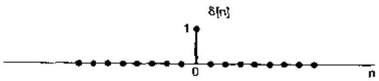  
Figure 1.28 Discrete-time unit impulse (sample).

A second basic discrete- time signal is the discrete- time unit step, denoted by  $u[n]$  and defined by

$$
u[n] = \left\{ \begin{array}{ll}0, & n < 0 \\ 1, & n \geq 0 \end{array} \right. \tag{1.64}
$$

The unit step sequence is shown in Figure 1.29.

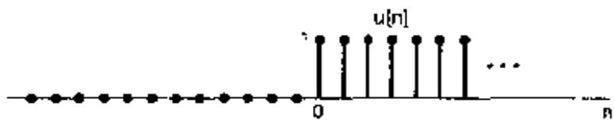  
Figure 1.29 Discrete-time unit step sequence.

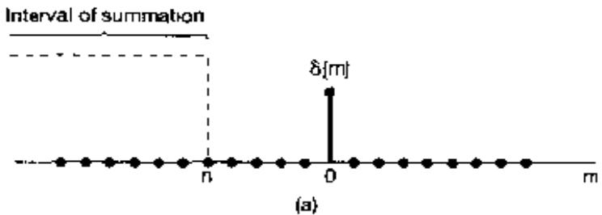  
Figure 1.30 Running sum of eq (1.66): (a)  $n < 0$ , (b)  $n > 0$

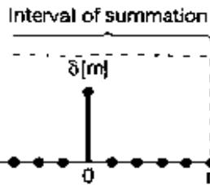  
(b)

There is a close relationship between the discrete- time unit impulse and unit step. In particular, the discrete- time unit impulse is the first difference of the discrete- time step

$$
\delta [n] = u[n] - u[n - 1]. \tag{1.65}
$$

Conversely, the discrete- time unit step is the running sum of the unit sample. That is,

$$
u[n] = \sum_{m = -\infty}^{n} \delta [m]. \tag{1.66}
$$

Equation (1.66) is illustrated graphically in Figure 1.30. Since the only nonzero value of the unit sample is at the point at which its argument is zero, we see from the figure that the running sum in eq. (1.66) is 0 for  $n < 0$  and 1 for  $n \geq 0$ . Furthermore, by changing the variable of summation from  $m$  to  $k = n - m$  in eq. (1.66), we find that the discrete- time unit step can also be written in terms of the unit sample as

$$
u[n] = \sum_{k = n}^{n} \delta [n - k].
$$

or equivalently,

$$
u[n] = \sum_{k = 0}^{\infty} \delta [n - k]. \tag{167}
$$

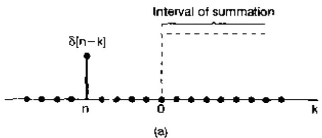

  
Figure 1.31 Relationship given in eq. (1.67): (a)  $n< 0$ ; (b)  $n > 0$ .

Equation (1.67) is illustrated in Figure 1.31. In this case the nonzero value of  $\delta [n - k]$  is at the value of  $k$  equal to  $n$ , so that again we see that the summation in eq. (1.67) is 0 for  $n< 0$  and 1 for  $n\geq 0$ .

An interpretation of eq. (1.67) is as a superposition of delayed impulses; i.e., we can view the equation as the sum of a unit impulse  $\delta [n]$  at  $n = 0$ , a unit impulse  $\delta [n - 1]$  at  $n = 1$ , another,  $\delta [n - 2]$ , at  $n = 2$ , etc. We will make explicit use of this interpretation in Chapter 2.

The unit impulse sequence can be used to sample the value of a signal at  $n = 0$ . In particular, since  $\delta [n]$  is nonzero (and equal to 1) only for  $n = 0$ , it follows that

$$
x[n]\delta [n] = x[0]\delta [n]. \tag{1.68}
$$

More generally, if we consider a unit impulse  $\delta [n - n_0]$  at  $n = n_0$ , then

$$
x[n]\delta [n - n_0] = x[n_0]\delta [n - n_0]. \tag{1.69}
$$

This sampling property of the unit impulse will play an important role in Chapters 2 and 7.

# 1.4.2 The Continuous-Time Unit Step and Unit Impulse Functions

The continuous- time unit step function  $u(t)$  is defined in a manner similar to its discrete- time counterpart. Specifically,

$$
u(t) = \left\{ \begin{array}{ll}0, & t< 0 \\ 1, & t > 0 \end{array} \right. \tag{1.70}
$$

as is shown in Figure 1.32. Note that the unit step is discontinuous at  $t = 0$ . The continuous- time unit impulse function  $\delta (t)$  is related to the unit step in a manner analogous

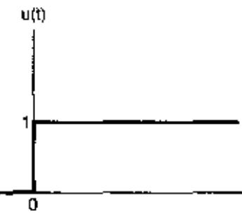  
Figure 1.32 Continuous-time unit step function.

to the relationship between the discrete- time unit impulse and step functions. In particular, the continuous- time unit step is the running integral of the unit impulse

$$
u(t) = \int_{\mathbb{Z}}^{t}\delta (\tau)d\tau . \tag{1.71}
$$

This also suggests a relationship between  $\delta (t)$  and  $u(t)$  analogous to the expression for  $\delta [n]$  in eq. (1.65). In particular, it follows from eq. (1.71) that the continuous- time unit impulse can be thought of as the first derivative of the continuous- time unit step:

$$
\delta (t) = \frac{d u(t)}{d t}. \tag{1.72}
$$

In contrast to the discrete- time case, there is some formal difficulty with this equation as a representation of the unit impulse function, since  $u(t)$  is discontinuous at  $t = 0$  and consequently is formally not differentiable. We can, however, interpret eq. (1.72) by considering an approximation to the unit step  $u_{\Delta}(t)$ , as illustrated in Figure 1.33, which rises from the value 0 to the value 1 in a short time interval of length  $\Delta$ . The unit step, of course, changes values instantaneously and thus can be thought of as an idealization of  $u_{\Delta}(t)$  for  $\Delta$  so short that its duration doesn't matter for any practical purpose. Formally,  $u(t)$  is the limit of  $u_{\Delta}(t)$  as  $\Delta \rightarrow 0$ . Let us now consider the derivative

$$
\delta_{\Delta}(t) = \frac{d u_{\Delta}(t)}{d t}, \tag{1.73}
$$

as shown in Figure 1.34.

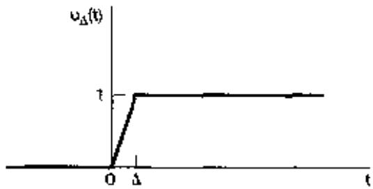  
Figure 1.33 Continuous approximation to the unit step,  $u_{\Delta}(t)$ .

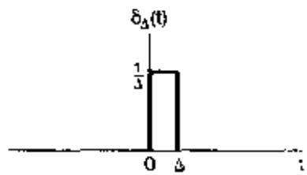  
Figure 1.34 Derivative of  $u_{\Delta}(t)$ .

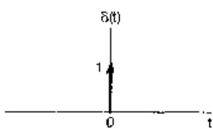  
Figure 1.35 Continuous time unit impulse.

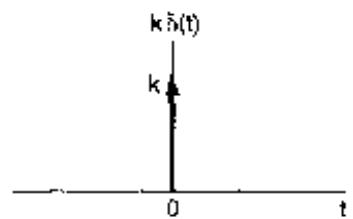  
Figure 1.36 Scaled impulse.

Note that  $\delta_{\Delta}(t)$  is a short pulse, of duration  $\Delta$  and with unit area for any value of  $\Delta$ . As  $\Delta \rightarrow 0$ ,  $\delta_{\Delta}(t)$  becomes narrower and higher, maintaining its unit area. Its limiting form,

$$
\delta (t) = \lim_{\Delta \rightarrow 0}\delta_{\Delta}(t). \tag{1.74}
$$

can then be thought of as an idealization of the short pulse  $\delta_{\Delta}(t)$  as the duration  $\Delta$  becomes insignificant. Since  $\delta (t)$  has, in effect, no duration but unit area, we adopt the graphical notation for it shown in Figure 1.35, where the arrow at  $t = 0$  indicates that the area of the pulse is concentrated at  $t = 0$  and the height of the arrow and the "1" next to the arrow are used to represent the area of the impulse. More generally, a scaled impulse  $k\delta (t)$  will have an area  $k$ , and thus,

$$
\int_{-\infty}^{t} k\delta (\tau) d\tau = k u(t).
$$

A scaled impulse with area  $k$  is shown in Figure 1.36, where the height of the arrow used to depict the scaled impulse is chosen to be proportional to the area of the impulse.

As with discrete time, we can provide a simple graphical interpretation of the running integral of eq. (1.71), this is shown in Figure 1.37. Since the area of the continuous- time unit impulse  $\delta (T)$  is concentrated at  $\tau = 0$ , we see that the running integral is 0 for  $t < 0$  and 1 for  $t > 0$ . Also, we note that the relationship in eq. (1.71) between the continuous- time unit step and impulse can be rewritten in a different form, analogous to the discrete- time form in eq. (1.67), by changing the variable of integration from  $\tau$  to  $\sigma = t - \tau$ :

$$
u(t) = \int_{-\infty}^{t} \delta (\tau) d\tau = \int_{\infty}^{0} \delta (t - \sigma) (-d\sigma),
$$

or equivalently,

$$
u(t) = \int_{t}^{t} \delta (t - \sigma) d\sigma . \tag{1.75}
$$

The graphical interpretation of this form of the relationship between u(i) and 8(t)is given in Figure 1.38. Since in this case the area of 8(t- 0) is concentrated at the point 0= t, we again see that the integral in eq. (1.75) is 0 for t < 0 and 1 for t > 0. This type of graphical interpretation of the behavior of the unit impulse under integration will be extremely useful in Chapter 2.

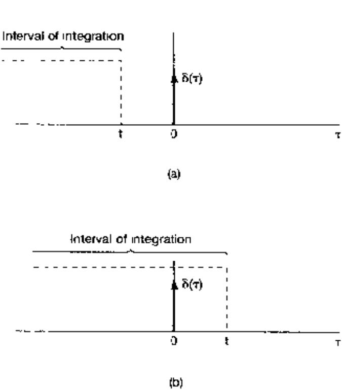  
Figure 1.37 Running integral given in eq (1.71): (a)  $t < 0$ . (b)  $t > 0$ .

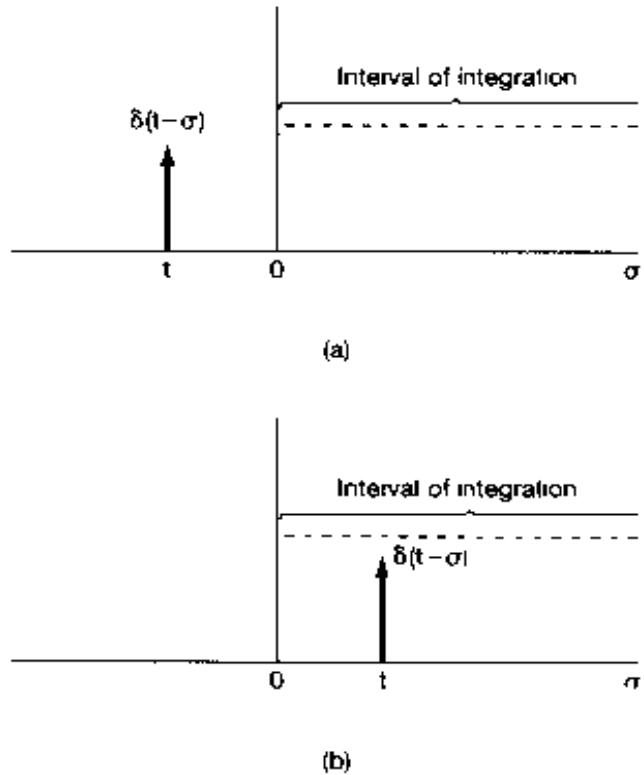  
Figure 1.38 Relationship given in eq (1.75): (a)  $t < 0$ . (b)  $t > 0$ .

As with the discrete- time impulse, the continuous- time impulse has a very important sampling property. In particular, for a number of reasons it will be important to consider the product of an impulse and more well- behaved continuous- time functions  $x(t)$ . The interpretation of this quantity is most readily developed using the definition of  $\delta (t)$  according to eq. (1.74). Specifically, consider

$$
x_{1}(t) = x(t)\delta_{\Delta}(t).
$$

In Figure 1.39(a) we have depicted the two time functions  $x(t)$  and  $\delta_{\Delta}(t)$ , and in Figure 1.39(b) we see an enlarged view of the nonzero portion of their product. By construction,  $x_{1}(t)$  is zero outside the interval  $0 \leq t \leq \Delta$ . For  $\Delta$  sufficiently small so that  $x(t)$  is approximately constant over this interval,

$$
x(t)\delta_{\Delta}(t) \approx x(0)\delta_{\Delta}(t).
$$

Since  $\delta (t)$  is the limit as  $\Delta \to 0$  of  $\delta_{\Delta}(t)$ , it follows that

$$
x(t)\delta (t) = x(0)\delta (t). \tag{176}
$$

By the same argument, we have an analogous expression for an impulse concentrated at an arbitrary point, say,  $t_{0}$ . That is,

$$
x(t)\delta (t - t_{0}) = x(t_{0})\delta (t - t_{0}).
$$

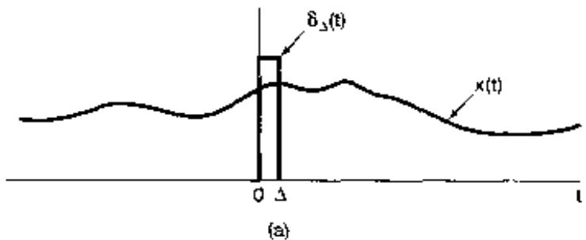

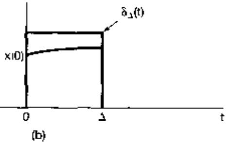  
Figure 1.39 The product  $x(t) \delta_{\Delta}(t)$  (a) graphs of both functions; (b) enlarged view of the nonzero portion of their product

Although our discussion of the unit impulse in this section has been somewhat informal, it does provide us with some important intuition about this signal that will be useful throughout the book. As we have stated, the unit impulse should be viewed as an idealization. As we illustrate and discuss in more detail in Section 2.5, any real physical system has some inertia associated with it and thus does not respond instantaneously to inputs. Consequently, if a pulse of sufficiently short duration is applied to such a system, the system response will not be noticeably influenced by the pulse's duration or by the details of the shape of the pulse, for that matter. Instead, the primary characteristic of the pulse that will matter is the net, integrated effect of the pulse—i.e., its area. For systems that respond much more quickly than others, the pulse will have to be of much shorter duration before the details of the pulse shape or its duration no longer matter. Nevertheless, for any physical system, we can always find a pulse that is "short enough." The unit impulse then is an idealization of this concept—the pulse that is short enough for any system. As we will see in Chapter 2, the response of a system to this idealized pulse plays a crucial role in signal and system analysis, and in the process of developing and understanding this role, we will develop additional insight into the idealized signal.

The unit impulse and other related functions (which are often collectively referred to as "angularity functions) have been thoroughly studied in the field of mathematics under the alternative names of generalized functions and the theory of distributions For more detailed discussions of this subject, see Distribution Theory and Transform Analysis, by A. H. Zemanian (New York: McGraw- Hill Book Company, 1965). Generalised Functions, by R.F. Hrskins (New York. Halsted Press, 1999), or the more advanced text, Founer Analysis and Generalized Functions, by M. J. Lighthill (New York: Cambridge University Press, 1958) Our discussion of singularity functions in Section 2.5 is closely related in spirit to the mathematical theory described in these texts and thus provides an informal introduction to concepts that underlie this topic in mathematics.

# Example 1.7

Consider the discontinuous signal  $x(t)$  depicted in Figure 1.40(a). Because of the relationship between the continuous- time unit impulse and unit step, we can readily calculate and graph the derivative of this signal. Specifically, the derivative of  $x(t)$  is clearly 0, except at the discontinuities. In the case of the unit step, we have seen [eq. 11.72)] that differentiation gives rise to a unit impulse located at the point of discontinuity. Furthermore, by multiplying both sides of eq. (1.72) by any number  $k$ , we see that the derivative of a unit step with a discontinuity of size  $k$  gives rise to an impulse of area  $k$  at the point of discontinuity. This rule also holds for any other signal with a jump discontinuity, such as  $x(t)$  in Figure 1.40(a). Consequently, we can sketch its derivative  $x(t)$ , as in Figure 1.40(b), where an impulse is placed at each discontinuity of  $x(t)$ , with area equal to the size of the discontinuity. Note, for example, that the discontinuity in  $x(t)$  at  $t = 2$  has a value of 3, so that an impulse scaled by  $- 3$  is located at  $t = 2$  in the signal  $x(t)$ .

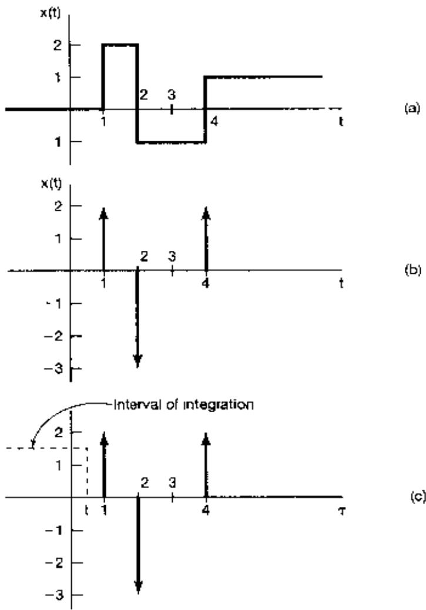  
Figure 1.40 (a) The discontinuous signal  $x(t)$  analyzed in Example 1.7. (b) its derivative  $x(t)$ . (c) depiction of the recovery of  $x(t)$  as the running integral of  $x(t)$ , illustrated for a value of  $t$  between 0 and 1.

As a check of our result, we can verify that we can recover x(t) from t(t). Specifically,since x(t) and x(t) are both zero for t ≤ 0,we need only check that for t > 0,

$$
x(t) = \int_{0}^{t}\dot{x} (\tau)d\tau . \tag{1 77}
$$

As illustrated in Figure 1.40(c), for  $t< 1$  the integral on the right- hand side of eq. (1.77) is zero, since none of the impulses that constitute  $\dot{x} (t)$  are within the interval of integration. For  $1< t< 2$  the first impulse (located at  $t = 1$  ) is the only one within the integration interval, and thus the integral in eq. (1.77) equals 2, the area of this impulse. For  $2< t< 4$  the first two impulses are within the interval of integration, and the integral accumulates the sum of both of their areas, namely,  $2 - 3 = - 1$  . Finally, for  $t > 4$  all three impulses are within the integration interval, so that the integral equals the sum of all three areas- that is,  $2 - 3 + 2 = +1$  . The result is exactly the signal t(t) depicted in Figure 1.40(a)

# 1.5 CONTINUOUS-TIME AND DISCRETE-TIME SYSTEMS

Physical systems in the broadest sense are an interconnection of components, devices, or subsystems. In contexts ranging from signal processing and communications to electromechanical motors, automotive vehicles, and chemical- processing plants, a system can be viewed as a process in which input signals are transformed by the system or cause the system to respond in some way, resulting in other signals as outputs. For example, a highfidelity system takes a recorded audio signal and generates a reproduction of that signal. If the hi- fi system has tone controls, we can change the total quality of the reproduced signal. Similarly, the circuit in Figure 1.1 can be viewed as a system with input voltage  $\nu_{s}(t)$  and output voltage  $\nu_{t}(t)$  , while the automobile in Figure 1.2 can be thought of as a system with input equal to the force  $f(t)$  and output equal to the velocity  $\nu (t)$  of the vehicle. An image- enhancement system transforms an input image into an output image that has some desired properties, such as improved contrast.

A continuous- time system is a system in which continuous- time input signals are applied and result in continuous- time output signals. Such a system will be represented pictorially as in Figure 1.41(a), where x(t) is the input and y(t) is the output. Alternatively, we will often represent the input- output relation of a continuous- time system by the notation

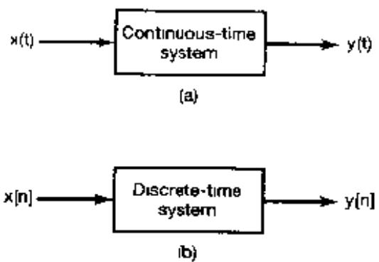  
Figure 1.41 (a) Continuous-time system; (b) discrete-time system.

Similarly, a discrete- time system- - that is, a system that transforms discrete- time inputs into discrete- time outputs- - will be depicted as in Figure 1.41(b) and will sometimes be represented symbolically as

$$
x[n]\rightarrow y[n]. \tag{1.79}
$$

In most of this book, we will treat discrete- time systems and continuous- time systems separately but in parallel. In Chapter 7, we will bring continuous- time and discrete- time systems together through the concept of sampling, and we will develop some insights into the use of discrete- time systems to process continuous- time signals that have been sampled.

# 1.5.1 Simple Examples of Systems

One of the most important motivations for the development of general tools for analyzing and designing systems is that systems from many different applications have very similar mathematical descriptions. To illustrate this, we begin with a few simple examples.

# Example 1.8

Consider the RC circuit depicted in Figure 1.1. If we regard  $\nu_{x}(t)$  as the input signal and  $\nu_{c}(t)$  as the output signal, then we can use simple circuit analysis to derive an equation describing the relationship between the input and output. Specifically, from Ohm's law, the current  $i(t)$  through the resistor is proportional (with proportionality constant  $1 / R$ ) to the voltage drop across the resistor; i.e.,

$$
i(t) = \frac{\nu_{s}(t) - \nu_{s}(t)}{R} \tag{1.80}
$$

Similarly, using the defining constitutive relation for a capacitor, we can relate  $i(t)$  to the rate of change with time of the voltage across the capacitor.

$$
\iota (t) = C\frac{d\nu_{r}(t)}{dt} \tag{1.81}
$$

Equating the right- hand sides of eqs. (1.80) and (1.81), we obtain a differential equation describing the relationship between the input  $\nu_{s}(t)$  and the output  $\nu_{c}(t)$ :

$$
\frac{d\nu_{r}(t)}{dt} + \frac{1}{RC}\nu_{r}(t) = \frac{1}{RC}\nu_{c}(t). \tag{1.82}
$$

# Example 1.9

Consider Figure 1.2, in which we regard the force  $f(t)$  as the input and the velocity  $\nu (t)$  as the output. If we let  $m$  denote the mass of the automobile and  $mpv$  the resistance due to friction, then equating acceleration—i.e., the time derivative of velocity—with net force divided by mass, we obtain

$$
\frac{d\nu(t)}{dt} = \frac{1}{m}\left[f(t) - \rho \nu (t)\right]. \tag{1.83}
$$

i.e.,

$$
\frac{d\nu(t)}{dt} + \frac{\rho}{m} \nu (t) = \frac{1}{m} f(t). \tag{1.84}
$$

Examining and comparing eqs. (1.82) and (1.84) in the above examples, we see that the input- output relationships captured in these two equations for these two very different physical systems are basically the same. In particular, they are both examples of first- order linear differential equations of the form

$$
\frac{d y(t)}{d t} + a y(t) - b x(t), \tag{1.85}
$$

where  $\tau (t)$  is the input,  $y(t)$  is the output, and  $a$  and  $b$  are constants. This is one very simple example of the fact that, by developing methods for analyzing general classes of systems such as that represented by eq. (1.85), we will be able to use them in a wide variety of applications.

# Example 1.10

As a simple example of a discrete- time system, consider a simple model for the balance in a bank account from month to month. Specifically, let y[n] denote the balance at the end of the nth month, and suppose that y[n] evolves from month to month according to the equation

$$
y[n] = 1.01 y[n - 1] + x[n], \tag{1.86}
$$

or equivalently,

$$
y[n] - 1.01 y[n - 1] = x[n], \tag{1.87}
$$

where  $x[n]$  represents the net deposit (i.e., deposits minus withdrawals) during the nth month and the term 1.01 y[n - 1] models the fact that we account 1% interest each month.

# Example 1.11

As a second example, consider a simple digital simulation of the differential equation in eq (1.84) in which we resolve time into discrete intervals of length  $\Delta$  and approximate  $d \nu (t) / d t$  at  $t = n \Delta$  by the first backward difference, i.e.,

$$
\frac{\nu(n \Delta)}{\Delta} - \frac{\nu(n - 1) \Delta}{\Delta}
$$

In this case, if we let  $\nu [n] = \nu (n \Delta)$  and  $f[n] = f(n \Delta)$ , we obtain the following discrete- time model relating the sampled signals  $f[n]$  and  $\nu [n]$ :

$$
\nu [n] - \frac{m}{(m + \rho \Delta)} \nu [n - 1] = \frac{\Delta}{(m + \rho \Delta)} f[n]. \tag{1.88}
$$

Comparing eqs. (1.87) and (1.88), we see that they are both examples of the same general first- order linear difference equation, namely,

$$
y[n] + a y[n - 1] = b x[n]. \tag{1.89}
$$

As the preceding examples suggest, the mathematical descriptions of systems from a wide variety of applications frequently have a great deal in common, and it is this fact that provides considerable motivation for the development of broadly applicable tools for signal and system analysis The key to doing this successfully is identifying classes of systems that have two important characteristics: (1) The systems in this class have properties and structures that we can exploit to gain insight into their behavior and to develop effective tools for their analysis; and (2) many systems of practical importance can be accurately modeled using systems in this class. It is on the first of these characteristics that most of this book focuses, as we develop tools for a particular class of systems referred to as linear, time- invariant systems. In the next section, we will introduce the prop. critie, that characterize this class, as well as a number of other very important basic system properties.

The second characteristic mentioned in the preceding paragraph is of obvious importance for any system analysis technique to be of value in practice. It is a well- established fact that a wide range of physical systems (including those in Examples 1.8- 1.10) can be well modeled within the class of systems on which we focus in this book. However, a critical point is that any model used in describing or analyzing a physical system represents an idealization of that system, and thus, any resulting analysis is only as good as the model itself. For example, the simple linear model of a resistor in eq. (1.80) and that of a capacitor in eq. (1.81) are idealizations. However, these idealizations are quite accurate for real resistors and capacitors in many applications, and thus, analyses employing such idealizations provide useful results and conclusions, as long as the voltages and currents remain within the operating conditions under which these simple linear models are valid. Similarly, the use of a linear retarding force to represent functional effects in eq. (1.83) is an approximation with a range of validity. Consequently, although we will not address this issue in the book, it is important to remember that an essential component of engineering practice in using the methods we develop here consists of identifying the range of validity of the assumptions that have gone into a model and ensuring that any analysis or design based on that model does not violate those assumptions.

# 1.5.2 Interconnections of Systems

An important idea that we will use throughout this book is the concept of the interconnection of systems. Many real systems are built as interconnections of several subsystems. One example is an audio system, which involves the interconnection of a radio receiver, compact disc player, or tapo deck with an amplifier and one or more speakers. Another is a digitally controlled aircraft, which is an interconnection of the aircraft, described by its equations of motion and the aerodynamic forces affecting it; the sensors, which measure various aircraft variables such as accelerations, rotation rates, and heading; a digital autopilot, which responds to the measured variables and to command inputs from the pilot (e.g., the desired course, altitude, and speed); and the aircraft's actuators, which respond to inputs provided by the autopilot in order to use the aircraft control surfaces (rudder, tail, ailerons) to change the aerodynamic forces on the aircraft. By viewing such a system as an interconnection of its components, we can use our understanding of the component

  
Figure 1.42 Interconnection of two systems: (a) series (cascade) interconnection; (b) parallel interconnection, (c) series-parallel interconnection.

systems and of how they are interconnected in order to analyze the operation and behavior of the overall system. In addition, by describing a system in terms of an interconnection of simpler subsystems, we may in fact be able to define useful ways in which to synthesize complex systems out of simpler, basic building blocks.

While one can construct a variety of system interconnections, there are several basic ones that are frequently encountered. A series or cascade interconnection of two systems is illustrated in Figure 1.42(a). Diagrams such as this are referred to as block diagrams. Here, the output of System 1 is the input to System 2, and the overall system transforms an input by processing it first by System 1 and then by System 2. An example of a series interconnection is a radio receiver followed by an amplifier. Similarly, one can define a series interconnection of three or more systems.

A parallel interconnection of two systems is illustrated in Figure 1.42(b). Here, the same input signal is applied to Systems 1 and 2. The symbol " $\# \mathbb{P}^{\prime \prime}$ " in the figure denotes addition, so that the output of the parallel interconnection is the sum of the outputs of Systems 1 and 2. An example of a parallel interconnection is a simple audio system with several microphones feeding into a single amplifier, and speaker system. In addition to the simple parallel interconnection in Figure 1.42(b), we can define parallel interconnections of more than two systems, and we can combine both cascade and parallel interconnections

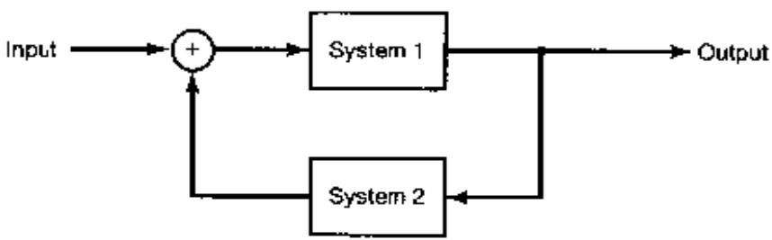  
Figure 1.43 Feedback interconnection.

to obtain more complicated interconnections. An example of such an interconnection is given in Figure 1.42(c).4

Another important type of system interconnection is a feedback interconnection, an example of which is illustrated in Figure 1.43. Here, the output of System 1 is the input to System 2, while the output of System 2 is fed back and added to the external input to produce the actual input to System 1. Feedback systems arise in a wide variety of applications. For example, a cruise control system on an automobile senses the vehicle's velocity and adjusts the fuel flow in order to keep the speed at the desired level. Similarly, a digitally controlled aircraft is most naturally thought of as a feedback system in which differences between actual and desired speed, heading, or altitude are fed back through the autopilot in order to correct these discrepancies. Also, electrical circuits are often usefully viewed as containing feedback interconnections. As an example, consider the circuit depicted in Figure 1.44(a). As indicated in Figure 1.44(b), this system can be viewed as the feedback interconnection of the two circuit elements.

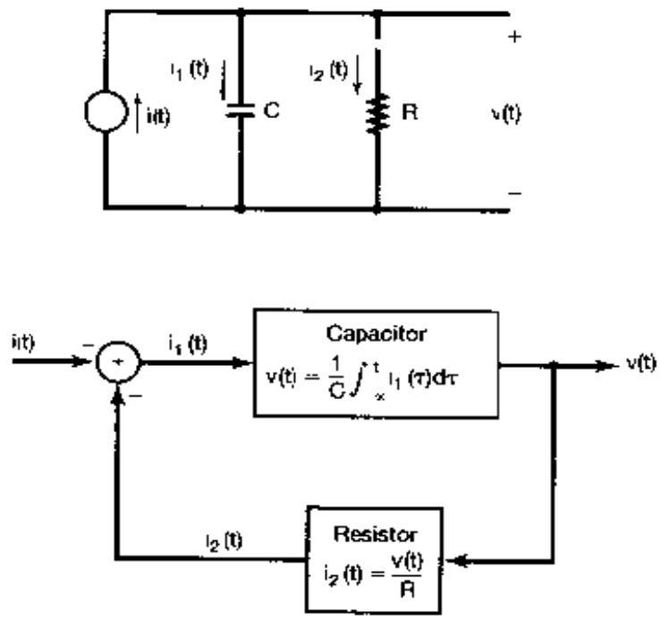  
Figure 1.44 (a) Simple electrical circuit, (b) Block diagram 1r which the circuit is depicted as the feedback interconnection of two circuit elements.

4On occasion, we will also use the symbol  $\mathfrak{S}$  in our pictorial representation of systems to denote the operation of multiplying two signals (see, for example, Figure 4.26)

# 1.6 BASIC SYSTEM PROPERTIES

In this section we introduce and discuss a number of basic properties of continuous- time and discrete- time systems. These properties have important physical interpretations and relatively simple mathematical descriptions using the signals and systems language that we have begun to develop.

# 1.6.1 Systems with and without Memory

A system is said to be memoryless if its output for each value of the independent variable at a given time is dependent only on the input at that same time. For example, the system specified by the relationship

$$
y[n] = (2x[n] - x^{2}[n])^{2} \tag{1.90}
$$

is memoryless, as the value of  $y[n]$  at any particular time  $n_{0}$  depends only on the value of  $x[n]$  at that time. Similarly, a resistor is a memoryless system; with the input  $x(t)$  taken as the current and with the voltage taken as the output  $y(t)$ , the input- output relationship of a resistor is

$$
y(t) = R x(t), \tag{1.91}
$$

where  $R$  is the resistance. One particularly simple memoryless system is the identity system, whose output is identical to its input. That is, the input- output relationship for the continuous- time identity system is

$$
y(t) = x(t),
$$

and the corresponding relationship in discrete time is

$$
y[n] = x[n].
$$

An example of a discrete- time system with memory is an accumulator or summer

$$
y[n] = \sum_{k = -\infty}^{n} x[k], \tag{1.92}
$$

and a second example is a delay

$$
y[n] = x[n - 1]. \tag{1.93}
$$

A capacitor is an example of a continuous- time system with memory, since if the input is taken to be the current and the output is the voltage, then

$$
y(t) = \frac{1}{C} \int_{-\infty}^{1} x(\tau) d\tau , \tag{1.94}
$$

where  $C$  is the capacitance.

Roughly speaking, the concept of memory in a system corresponds to the presence of a mechanism in the system that retains or stores information about input values at times

other than the current time. For example, the delay in eq. (1.93) must retain or store the preceding value of the input. Similarly, the accumulator in eq. (1.92) must "remember" or store information about past inputs. In particular, the accumulator computes the running sum of all inputs up to the current time, and thus, at each instant of time, the accumulator must add the current input value to the preceding value of the running sum. In other words, the relationship between the input and output of an accumulator can be described as

$$
y[n] = \sum_{k = -\infty}^{n - 1}x[k] + x[n], \tag{1.95}
$$

or equivalently,

$$
y[n] = y[n - 1] + x[n]. \tag{1.96}
$$

Represented in the latter way, to obtain the output at the current time  $n$ , the accumulator must remember the running sum of previous input values, which is exactly the preceding value of the accumulator output.

In many physical systems, memory is directly associated with the storage of energy. For example, the capacitor in eq. (1.94) stores energy by accumulating electrical charge, represented as the integral of the current. Thus, the simple RC circuit in Example 1.8 and Figure 1.1 has memory physically stored in the capacitor. Similarly, the automobile in Figure 1.2 has memory stored in its kinetic energy. In discrete- time systems implemented with computers or digital microprocessors, memory is typically directly associated with storage registers that retain values between clock pulses.

While the concept of memory in a system would typically suggest storing past input and output values, our formal definition also leads to our referring to a system as having memory if the current output is dependent on future values of the input and output. While systems having this dependence on future values might at first seem unnatural, they in fact form an important class of systems, as we discuss further in Section 1.6.3.

# 1.6.2 Invertibility and Inverse Systems

A system is said to be invertible if distinct inputs lead to distinct outputs. As illustrated in Figure 1.45(a) for the discrete- time case, if a system is invertible, then an inverse system exists that, when cascaded with the original system, yields an output  $w[n]$  equal to the input  $x[n]$  to the first system. Thus, the series interconnection in Figure 1.45(a) has an overall input- output relationship which is the same as that for the identity system.

An example of an invertible continuous- time system is

$$
y(t) = 2x(t), \tag{1.97}
$$

for which the inverse system is

$$
w(t) = \frac{1}{2} y(t). \tag{1.98}
$$

This example is illustrated in Figure 1.45(b). Another example of an invertible system is the accumulator of eq. (1.92). For this system, the difference between two successive

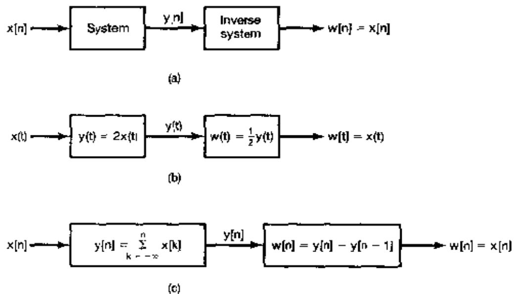  
Figure 1.45 Concept of an inverse system for: (a) a general invertible system, (b) the invertible system described by eq. (1.97); (c) the invertible system defined in eq. (1.92).

values of the output is precisely the last input value. Therefore, in this case, the inverse system is

$$
w[n] = y[n] - y[n - 1], \tag{1.99}
$$

as illustrated in Figure 1.45(c). Examples of noninvertible systems are

$$
y[n] = 0, \tag{1 100}
$$

that is, the system that produces the zero output sequence for any input sequence, and

$$
y(t) = x^{2}(t), \tag{1.101}
$$

in which case we cannot determine the sign of the input from knowledge of the output.

The concept of invertibility is important in many contexts. One example arises in systems for encoding used in a wide variety of communications applications. In such a system, a signal that we wish to transmit is first applied as the input to a system known as an encoder. There are many reasons for doing this, ranging from the desire to encrypt the original message for secure or private communication to the objective of providing some redundancy in the signal (for example, by adding what are known as parity bits) so that any errors that occur in transmission can be detected and, possibly, corrected. For lossless coding, the input to the encoder must be exactly recoverable from the output; i.e., the encoder must be invertible.

# 1.6.3 Causality

A system is causal if the output at any time depends only on values of the input at the present time and in the past. Such a system is often referred to as being nonanticipative, as

the system output does not anticipate future values of the input. Consequently, if two inputs to a causal system are identical up to some point in time  $t_0$  or  $n_0$ , the corresponding outputs must also be equal up to this same time. The RC circuit of Figure 1.1 is causal, since the capacitor voltage responds only to the present and past values of the source voltage. Similarly, the motion of an automobile is causal, since it does not anticipate future actions of the driver. The systems described in eqs. (1.92) - (1.94) are also causal, but the systems defined by

$$
y[n] = x[n] - x[n + 1] \tag{1.102}
$$

and

$$
y(t) = x(t + 1) \tag{1.103}
$$

are not. All memoryless systems are causal, since the output responds only to the current value of the input.

Although causal systems are of great importance, they do not by any means constitute the only systems that are of practical significance. For example, causality is not often an essential constraint in applications in which the independent variable is not time, such as in image processing. Furthermore, in processing data that have been recorded previously, as often happens with speech, geophysical, or meteorological signals, to name a few, we are by no means constrained to causal processing. As another example, in many applications, including historical stock market analysis and demographic studies, we may be interested in determining a slowly varying trend in data that also contain high- frequency fluctuations about that trend. In this case, a commonly used approach is to average data over an interval in order to smooth out the fluctuations and keep only the trend. An example of a noncausal averaging system is

$$
y[n] = \frac{1}{2M + 1} \sum_{k = -M}^{+M} x[n - k]. \tag{1.104}
$$

# Example 1.12

When checking the causality of a system, it is important to look carefully at the input- output relation. To illustrate some of the issues involved in doing this, we will check the causality of two particular systems.

The first system is defined by

$$
y[n] = x[-n]. \tag{1.105}
$$

Note that the output  $y[n_0]$  at a positive time  $n_0$  depends only on the value of the input signal  $x[- n_0]$  at time  $(- n_0)$ , which is negative and therefore in the past of  $n_0$ . We may be tempted to conclude at this point that the given system is causal. However, we should always be careful to check the input- output relation for all times. In particular, for  $n < 0$ ,  $c.g. n = - 4$ , we see that  $y[- 4] = x[4]$ , so that the output at this time depends on a future value of the input. Hence, the system is not causal.

It is also important to distinguish carefully the effects of the input from those of any other functions used in the definition of the system. For example, consider the system

$$
y(t) = x(t) \cos (t + 1). \tag{1.106}
$$

In this system, the output at any time t equals the input at that same time multiplied by a number that vanes with time. Specifically, we can rewnte eq. (1.106) as

$$
y(t) = x(t)g(t).
$$

where  $g(t)$  is a time- varying function, namely  $g(t) = \cos (t + 1)$  Thus, only the current value of the input  $x(t)$  influences the current value of the output  $y(t)$  and we conclude that this system is causal (and, in fact, memoryless).

# 1.6.4 Stability

Stability is another important system property. Informally, a stable system is one in which small inputs lead to responses that do not diverge. For example, consider the pendulum in Figure 1.46(a), in which the input is the applied force  $x(t)$  and the output is the angular deviation  $y(t)$  from the vertical. In this case, gravity applies a restoring force that tends to return the pendulum to the vertical position, and frictional losses due to drag tend to slow it down. Consequently, if a small force  $x(t)$  is applied, the resulting deflection from vertical will also be small. In contrast, for the inverted pendulum in Figure 1.46(b), the effect of gravity is to apply a force that tends to increase the deviation from vertical. Thus, a small applied force leads to a large vertical deflection causing the pendulum to topple over, despite any rewarding forces due to friction.

The system in Figure 1.46(a) is an example of a stable system, while that in Figure 1.46(b) is unstable. Models for chain reactions or for population growth with unlimited food supplies and no predators are examples of unstable systems, since the system response grows without bound in response to small inputs. Another example of an unstable system is the model for a bank account balance in eq. 01.86), since if an initial deposit 1s made (i.e., d0] = a positive amount) and there are no subsequent withdrawals, then that deposit will grow each month without bound. because of the compounding effect of interest payments.

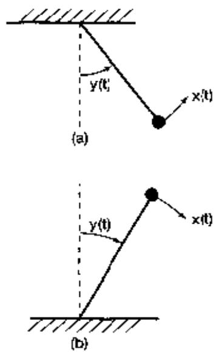  
Figure 1.46 (a) A stable pendulum; (b) an unstable inverted pendulum

There are also numerous examples of stable systems. Stability of physical systems generally results from the presence of mechanisms that dissipate energy. For example, assuming positive component values in the simple RC circuit of Example 1.8, the resistor dissipates energy and this circuit is a stable system. The system in Example 1 9 is also stable because of the dissipation of energy through friction.

The preceding examples provide us with an intuitive understanding of the concept of stability. More formally, if the input to a stable system is bounded (i.e., if its magnitude does not grow without bound), then the output must also be bounded and therefore cannot diverge. This is the definition of stability that we will use throughout this book. For exam. plc, consider applying a constant force  $f(t) = F$  to the automobile in Figure 1 2. with the vehicle initially at rest. In this case the velocity of the car will increase, but not without bound, since the retarding frictional force also increases with velocity. In fact, the velocity will continue to increase until the frictional force exactly balances the applied force: so, from eq. (1.84), we see that this terminal velocity value  $V$  must satisfy

$$
\rho_{m}V = \frac{1}{m} F, \tag{1.107}
$$

i.e.,

$$
V = \frac{F}{\rho}. \tag{1 108}
$$

As another example, consider the discrete- time system defined by eq. (1.104), and suppose that the input  $x[n]$  is bounded in magnitude by some number, say,  $\beta$ , for all values of  $n$ . Then the largest possible magnitude for  $y[n]$  is also  $\beta$ , because  $y[n]$  is the average of a finite set of values of the input. Therefore,  $y[n]$  is bounded and the system is stable. On the other hand, consider the accumulator described by eq. (1.92). Unlike the system in eq. (1.104), this system sums all of the past values of the input rather than just a finite set of values, and the system is unstable, since the sum can grow continually even if  $x[n]$  is bounded. For example, if the input to the accumulator is a unit step  $u[n]$ , the output will be

$$
y[n] = \sum_{k = -\infty}^{n} u[k] = (n + 1)u[n].
$$

That is,  $y[0] = 1$ ,  $y[1] = 2$ ,  $y[2] = 3$ , and so on, and  $y[n]$  grows without bound.

# Example 1.13

If we suspect that a system is unstable, then a useful strategy to verify this is to look for a specific bounded input that leads to an unbounded output. Finding one such example enables us to conclude that the given system is unstable. If such an example does not exist or is difficult to find, we must check for stability by using a method that does not utilize specific examples of input signals. To illustrate this approach, let us check the stability of two systems,

$$
S_{1}: y(t) = t x(t) \tag{1.109}
$$

and

$$
S_{2}:y(t) = e^{x(t)}, \tag{1.110}
$$

In seeking a specific counterexample in order to disprove stability, we might try simple bounded inputs such as a constant or a unit step. For system  $S_{1}$  in eq. (1.109), a constant input  $x(t) = 1$  yields  $y(t) = t$ , which is unbounded, since no matter what finite constant we pick,  $|y(t)|$  will exceed that constant for some  $t$ . We conclude that system  $S_{1}$  is unstable.

For system  $S_{2}$ , which happens to be stable, we would be unable to find a bounded input that results in an unbounded output. So we proceed to verify that all bounded inputs result in bounded outputs. Specifically, let  $B$  be an arbitrary positive number, and let  $x(t)$  be an arbitrary signal bounded by  $B$ ; that is, we are making no assumption about  $x(t)$  except that

$$
|x(t)|< B, \tag{1.111}
$$

or

$$
-B< x(t)< B, \tag{1.112}
$$

for all  $t$ . Using the definition of  $S_{2}$  in eq. (1.110), we then see that if  $x(t)$  satisfies eq. (1.111), then  $y(t)$  must satisfy

$$
e^{-H}< |y(t)|< e^{H}. \tag{1 113}
$$

We conclude that if any input to  $S_{2}$  is bounded by an arbitrary positive number  $B$ , the corresponding output is guaranteed to be bounded by  $e^{H}$ . Thus,  $S_{2}$  is stable.

The system properties and concepts that we have introduced so far in this section are of great importance, and we will examine some of these in more detail later in the book. There remain, however, two additional properties- time invariance and linearity- - that play a particularly central role in the subsequent chapters of the book, and in the remainder of this section we introduce and provide initial discussions of these two very important concepts.

# 1.6.5 Time Invariance

Conceptually, a system is time invariant if the behavior and characteristics of the system are fixed over time. For example, the RC circuit of Figure 1.1 is time invariant if the resistance and capacitance values  $R$  and  $c$  are constant over time: We would expect to get the same results from an experiment with this circuit today as we would if we ran the identical experiment tomorrow. On the other hand, if the values of  $R$  and  $c$  are changed or fluctuate over time, then we would expect the results of our experiment to depend on the time at which we run it. Similarly, if the frictional coefficient  $b$  and mass  $m$  of the automobile in Figure 1.2 are constant, we would expect the vehicle to respond identically independently of when we drive it. On the other hand, if we load the auto's trunk with heavy suitcase one day, thus increasing  $m$ , we would expect the car to behave differently than at other times when it is not so heavily loaded.

The property of time invariance can be described very simply in terms of the signals and systems language that we have introduced. Specifically, a system is time invariant if

a time shift in the input signal results in an identical time shift in the output signal. That is, if y[n] is the output of a discrete- time, time- invariant system when x[n] is the input, then y[n- n] is the output when x[n- n] is applied. In continuous time with y(t) the output corresponding to the input x(t), a time- invariant system will have y(t- n) as the output when x(t- n) is the input.

To see how to determine whether a system is time invariant or not, and to gain some insight into this property, consider the following examples:

# Example 1.14

Consider the continuous- time system defined by

$$
y(t) = \sin |x(t)|. \tag{1 114}
$$

To check that this system is time invariant, we must determine whether the time- invariance property holds for any input and any time shift  $t_0$ . Thus, let  $x_1(t)$  be an arbitrary input to this system, and let

$$
y_{1}(t) = \sin |x_{1}(t)| \tag{1.115}
$$

be the corresponding output. Then consider a second input obtained by shifting  $x_1(t)$  in time:

$$
\ldots , \ldots , t = x_1(t - t_0). \tag{1.116}
$$

The output corresponding to this input is

$$
y_2(t) = \sin |x_2(t)| = \sin |x_1(t - t_0)|. \tag{1.117}
$$

Similarly, from eq. (1.115),

$$
y_{1}(t - t_{0}) = \sin |x_{1}(t - t_{0})|. \tag{1 118}
$$

Comparing eqs. (1.117) and (1.118), we see that  $y_2(t) = y_1(t - t_0)$ , and therefore, this system is time invariant.

# Example 1.15

As a second example, consider the discrete- time system

$$
y[n] = n x[n]. \tag{1.119}
$$

This is a time- varying system, a fact that can be verified using the same formal procedure as that used in the preceding example (see Problem 1.28). However, when a system is suspected of being time varying, an approach to showing this that is often very useful is to seek a counterexample—i.e., to use our intuition to find an input signal for which the condition of time invariance is violated. In particular, the system in this example represents a system with a time- varying gain. For example, if we know that the current input value is 1, we cannot determine the current output value without knowing the current time.

Consequently, consider the input signal  $x_{1}[n] = \delta [n]$  which yields an output  $y_{1}[n]$  that is identically 0 (since  $n\delta [n] = 0$ ). However, the input  $x_{2}[n] = \delta [n - 1]$  yields the output  $y_{2}[n] = n\delta [n - 1] = \delta [n - 1]$ . Thus, while  $x_{2}[n]$  is a shifted version of  $x_{1}[n]$ ,  $y_{2}[n]$  is not a shifted version of  $y_{1}[n]$

While the system in the preceding example has a time- varying gain and as a result is a time- varying system, the system in eq. (1.97) has a constant gain and, in fact, is time invariant. Other examples of time- invariant systems are given by eqs. (1.91)- (1.104). The following example illustrates a time- varying system.

# Example 1.16

Consider the system

$$
y(t) = x(2t). \tag{1.120}
$$

The system represents a time scaling. That is,  $y(t)$  is a time- compressed (by a factor of 2) version of  $x(t)$ . Intuitively, then, any time shift in the input will also be compressed by a factor of 2, and it is for this reason that the system is not time invariant. To demonstrate this by counterexample, consider the input  $x_{1}(t)$  shown in Figure 1.47(a) and the resulting output  $y_{1}(t)$  depicted in Figure 1.47(b). If we then shift the input by 2- 1 e. consider  $x_{2}(t) - x_{1}(t - 2)$ , as shown in Figure 1.47(c)—we obtain the resulting output

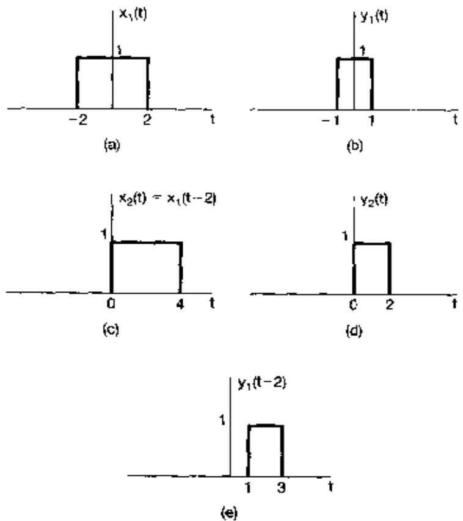  
Figure 1.47 (a) The input  $x_{1}(t)$  to the system in Example 1 '6; (b) the output  $y_{1}(t)$  corresponding to  $x_{1}(t)$ ; (c) the shifted input  $x_{2}(t) = x_{1}(t - 2)$ ; (d) the output  $y_{2}(t)$  corresponding to  $x_{2}(t)$ ; (e) the shifted signal  $y_{1}(t - 2)$ . Note that  $y_{2}(t) \neq y_{1}(t - 2)$ , showing that the system is not time invariant

$y_{2}(t) = x_{2}(2t)$  shown in Figure 1.47(d). Comparing Figures 1.47(d) and (e), we see that  $y_{2}(t) \neq y_{1}(t - 2)$ . So that the system is not time invariant. (In fact,  $y_{2}(t) = y_{1}(t - 1)$ . So that the output time shift is only half as big as it should be for time invariance, due to the time compression imparted by the system.)

# 1.6.6 Linearity

A linear system, in continuous time or discrete time, is a system that possesses the important property of superposition: If an input consists of the weighted sum of several signals, then the output is the superposition- that is, the weighted sum- of the responses of the system to each of those signals. More precisely, let  $y_{1}(t)$  be the response of a continuous- . time system to an input  $x_{1}(t)$  and let  $y_{2}(t)$  be the output corresponding to the input  $x_{2}(t)$  Then the system is linear if:

1. The response to  $x_{1}(t) + x_{2}(t)$  is  $y_{1}(t) + y_{2}(t)$ .

2. The response to  $a x_{1}(t)$  is  $a y_{1}(t)$ , where  $a$  is any complex constant.

The first of these two properties is known as the additivity property; the second is known as the scaling or homogeneity property. Although we have written this description using continuous- time signals, the same definition holds in discrete time. The systems specified by eqs. (1.91)- (1.100), (1.102)- (1.104), and (1.119) are linear, while those defined by eqs. (1.101) and (1.114) are nonlinear. Note that a system can be linear without being time invariant, as in eq. (1.119), and it can be time invariant without being linear, as in eqs. (1.101) and (1.114).

The two properties defining a linear system can be combined into a single statement

$$
\mathbf{\sigma}_{\mathrm{discrete~time:}}a_{X_{1}}[n] + b_{X_{2}}[n]\rightarrow a_{Y_{1}}[n] + b_{Y_{2}}[n]. \tag{1.122}
$$

$$
a_{X_{1}}[n] + b_{X_{2}}[n]\rightarrow a_{Y_{1}}[n] + b_{Y_{2}}[n]. \tag{1.122}
$$

Here,  $a$  and  $b$  are any complex constants. Furthermore, it is straightforward to show from the definition of linearity that if  $x_{k}[n]$ ,  $k = 1, 2, 3, \ldots$ , are a set of inputs to a discrete- time linear system with corresponding outputs  $y_{k}[n]$ ,  $k = 1, 2, 3, \ldots$ , then the response to a linear combination of these inputs given by

$$
x[n] = \sum_{k} a_{k} x_{k}[n] = a_{1} x_{1}[n] + a_{2} x_{2}[n] + a_{3} x_{3}[n] + \ldots \tag{1.123}
$$

is

$$
y[n] = \sum_{k} a_{k} y_{k}[n] = a_{1} y_{1}[n] + a_{2} y_{2}[n] + a_{3} y_{3}[n] + \ldots \tag{1.124}
$$

This very important fact is known as the superposition property, which holds for linear systems in both continuous and discrete time.

A direct consequence of the superposition property is that, for linear systems, an input which is zero for all time results in an output which is zero for all time. For example, if  $x[n] \rightarrow y[n]$ , then the homogeneity property tells us that

$$
0 = 0 \cdot x[n] \rightarrow 0 \cdot y[n] = 0. \tag{1.125}
$$

In the following examples we illustrate how the linearity of a given system can be checked by directly applying the definition of linearity.

# Example 1.17

Consider a system  $S$  whose input  $x(t)$  and output  $y(t)$  are related by

$$
y(t) = t\times t)
$$

To determine whether or not  $S$  is linear, we consider two arbitrary inputs  $x_{1}(t)$  and  $x_{2}(t)$ .

$$
\begin{array}{r}x_{1}(t) \leftrightarrow y_{1}(t) = t x_{1}(t) \\ x_{2}(t) \rightarrow y_{2}(t) = t x_{2}(t) \end{array}
$$

Let  $x_{1}(t)$  be a linear combination of  $x_{1}(t)$  and  $x_{2}(t)$ . That is,

$$
x_{3}(t) = a x_{1}(t) + b x_{2}(t)
$$

where  $a$  and  $b$  are arbitrary scalars. If  $x_{1}(t)$  is the input to  $S$ , then the corresponding output may be expressed as

$$
\begin{array}{r l} & {v_{1}(t) = t x_{3}(t)}\\ & {\qquad = t(a x_{1}(t) - b x_{2}(t))}\\ & {\qquad = a t x_{1}(t) + b t x_{2}(t)}\\ & {\qquad = a y_{1}(t) + b y_{2}(t)} \end{array}
$$

We conclude that the system  $S$  is linear.

# Example 1.18

Let us apply the linearity- checking procedure of the previous example to another system  $S$  whose input  $x(t)$  and output  $y(t)$  are related by

$$
y(t) = x^{2}(t)
$$

Defining  $x_{1}(t), x_{2}(t)$ , and  $x_{3}(t)$  as in the previous example, we have

$$
\begin{array}{r}x_{1}(t) \rightarrow y_{1}(t) = x_{1}^{2}(t) \\ x_{2}(t) \rightarrow y_{2}(t) = x_{2}^{2}(t) \end{array}
$$

and

$$
\begin{array}{r l} & {x_{3}(t)\rightarrow y_{1}(t) = x_{1}^{2}(t)}\\ & {\qquad = (a x_{1}(t) + b x_{2}(t))^{2}}\\ & {\qquad = a^{2}x_{1}^{2}(t) + b^{2}x_{2}^{2}(t) + 2a b x_{1}(t)x_{2}(t)}\\ & {\qquad = a^{2}y_{1}(t) + b^{2}y_{2}(t) + 2a b x_{1}(t)x_{2}(t)} \end{array}
$$

Clearly, we can specify  $x_{1}(t), x_{2}(t), a$  and  $b$  such that  $y_{1}(t)$  is not the same as  $a x_{1}(t) + b y_{2}(t)$ . For example, if  $x_{1}(t) = 1, x_{2}(t) = 0, a = 2$ , and  $b = 0$ , then  $y_{1}(t) = (2x_{1}(t))^{2} = 4$ , but  $2y_{1}(t) = 2(x_{1}(t))^{2} = 2$ . We conclude that the system  $S$  is not linear.

# Example 1.19

In checking the linearity of a system, it is important to remember that the system must satisfy both the additivity and homogeneity properties and that the signals, as well as any scaling constants, are allowed to be complex. To emphasize the importance of these

points, consider the system specified by

$$
y[n] = \mathcal{R}e[\lambda [n]]. \tag{1.126}
$$

As shown in Problem 1.29, this system is additive: however, it does not satisfy the homogeneity property, as we now demonstrate. Let

$$
x[n] = r[n] + j s[n] \tag{1.127}
$$

be an arbitrary complex input with real and imaginary parts  $r[n]$  and  $s[n]$ , respectively. So that the corresponding output is

$$
\mathbf{v}_{1}[n] = r[n]. \tag{1.128}
$$

Now, consider scaling  $x_{1}[n]$  by a complex number, for example,  $a = j$ . i.e., consider the input

$$
\begin{array}{l}x_{2}[n] = j x_{1}[n] = j(r[n] + j s[n]) \\ = -s[n] + j r[n]. \end{array} \tag{1.129}
$$

The output corresponding to  $x_{2}[n]$  is

$$
y_{2}[n] = \mathcal{R}e\{x_{2}[n]\} = -s[n], \tag{1.130}
$$

which is not equal to the scaled version of  $y_{1}[n]$

$$
a y_{1}[n] = j r[n]. \tag{1.131}
$$

We conclude that the system violates the homogeneity property and hence is not linear.

# Example 1.20

Consider the system

$$
\gamma [n] = 2x[n] + 3. \tag{1.132}
$$

This system is not linear, as can be verified in several ways. For example, the system violates the additivity property: If  $x_{1}[n] = 2$  and  $x_{2}[n] = 3$ , then

$$
\begin{array}{r}x_{1}[n] \rightarrow y_{1}[n] = 2x_{1}[n] + 3 = 7, \\ x_{2}[n] \rightarrow y_{2}[n] = 2x_{2}[n] + 3 = 9. \end{array} \tag{1.134}
$$

However, the response to  $x_{3}[n] = x_{1}[n] + x_{2}[n]$  is

$$
y_{3}[n] = 2[x_{1}[n] + x_{2}[n]] + 3 = 13, \tag{1.135}
$$

which does not equal  $y_{1}[n] + y_{2}[n] = 16$ . Alternatively, since  $y[n] = 3$  if  $x[n] = 0$ , we see that the system violates the "zero- in/zero- out" property of linear systems given in eq. (1.125).

It may seem surprising that the system in the above example is nonlinear, since eq. (1.132) is a linear equation. On the other hand, as depicted in Figure 1.48, the output of this system can be represented as the sum of the output of a linear system and another signal equal to the zero- input response of the system. For the system in eq. (1.132), the linear system is

$$
x[n]\rightarrow 2x[n],
$$

and the zero- input response is

$$
y_{0}[n] = 3.
$$

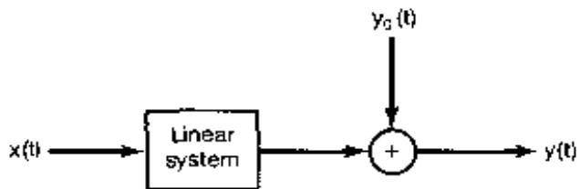  
Figure 1.48 Structure of an incrementally linear system. Here,  $y_{0}[n]$  is the zero-input response of the system.

There are, in fact, large classes of systems in both continuous and discrete time that can be represented as in Figure 1.48- - i.e. for which the overall system output consists of the superposition of the response of a linear system with a zero- input response As shown in Problem 1.47, such systems correspond to the class of int renmentally linear system- - i.e., systems in continuous or discrete time that respond linearly to changes in the input. In other words, the difference between the responses to any two inputs to an incrementally linear system is a linear (i.e., additive and homogencous) function of the difference between the two inputs. For example, if  $x_{1}[n]$  and  $x_{2}[n]$  are two inputs to the system specified by eq. (1.132), and if  $y_{1}[n]$  and  $y_{2}[n]$  are the corresponding outputs, then

$$
y_{1}[n] - y_{2}[n] = 2x_{1}[n] + 3 - \{2x_{2}[n] + 3\} = 2\{x_{1}[n] - x_{2}[n]\} ; \tag{1.136}
$$

# 1.7 SUMMARY

In this chapter, we have developed a number of basic concepts related to continuous- time and discrete- time signals and systems. We have presented both an intuitive picture of what signals and systems are through several examples and a mathematical representation for signals and systems that we will use throughout the book. Specifically, we introduced graphical and mathematical representations of signals and used these representations in performing transformations of the independent variable. We also defined and examined several basic signals, both in continuous time and in discrete time. These included complex exponential signals, sinusoidal signals, and unit impulse and step functions. In addition, we investigated the concept of periodicity for continuous- time and discrete- time signals.

In developing some of the elementary ideas related to systems, we introduced block diagrams to facilitate our discussions concerning the interconnection of systems, and we defined a number of important properties of systems, including causality, stability, time invariance, and linearity.

The primary focus in most of this book will be on the class of linear, time- invariant (LTI) systems, both in continuous time and in discrete time. These systems play a particularly important role in system analysis and design, in part due to the fact that many systems encountered in nature can be successfully modeled as linear and time invariant. Furthermore, as we shall see in the following chapters, the properties of linearity and time invariance allow us to analyze in detail the behavior of LTI systems.

Basic problems emphasize the mechanics of using concepts and methods in a manner similar to that illustrated in the examples that are solved in the text

Advanced problems explore and elaborate upon the foundations and practical implications of the textual material.

The first section of problems belongs to the basic category, and the answers are provided in the back of the book. The next two sections contain problems belonging to the basic and advanced categories, respectively. A final section. Mathematical Review, provides practice problems on the fundamental ideas of complex arithmetic and algebra.

# BASIC PROBLEMS WITH ANSWERS

1.1. Express each of the following complex numbers in Cartesian form \((x + j y)\) \(\frac{1}{2} e^{j\pi}\) \(e^{j\pi}\) \(e^{j\pi}\) \(e^{j\pi}\) \(e^{j\pi}\) \(e^{j\pi}\) \(e^{j\pi}\) \(e^{j\pi}\) \(e^{j\pi}\) \(e^{j\pi}\) \(e^{j\pi}\) \(e^{j\pi}\) \(e^{j\pi}\) \(e^{j\sigma}\) \(e^{j\sigma}\) \(e^{j\sigma}\) \(e^{j\sigma}\) \(e^{j\sigma}\) \(e^{j\sigma}\) \(e^{j\sigma}\) \(e^{j\sigma}\) \(e^{j\sigma}\) \(e^{j\sigma}\) \(e^{j\sigma}\) \(e^{j\sigma}\) \(e^{j\sigma}\) \(i\) \(e^{j\sigma}\) \(e^{j\sigma}\) \(e^{j\sigma}\) \(e^{j\sigma}\) \(e^{j\sigma}\) \(e^{j\sigma}\) \(e^{j\sigma}\) \(e^{j\sigma}\) \(e^{j\sigma}\) \(e^{j\sigma}\) \(e^{j\sigma}\) \(e^{j\sigma}\) \(e^{i\sigma}\) \(e^{j\sigma}\) \(e^{j\sigma}\) \(e^{j\sigma}\) \(e^{j\sigma}\) \(e^{j\sigma}\) \(e^{j\sigma}\) \(e^{j\sigma}\) \(e^{j\sigma}\) \(e^{j\sigma}\) \(e^{j\sigma}\) \(e^{j\sigma}\) \(e^{j\sigma}\)\(e^{j\sigma}\) \(e^{j\sigma}\) \(e^{j\sigma}\) \(e^{j\sigma}\) \(e^{j\sigma}\) \(e^{j\sigma}\) \(e^{j\sigma}\) \(e^{j\sigma}\) \(e^{j\sigma}\) \(e^{j\sigma}\) \(e^{j\sigma}\) \(e^{j\sigma}\) \(e^{j}\) \(e^{j\sigma}\) \(e^{j\sigma}\) \(e^{j\sigma}\) \(e^{j\sigma}\) \(e^{j\sigma}\) \(e^{j\sigma}\) \(e^{j\sigma}\) \(e^{j\sigma}\) \(e^{j\sigma}\) \(e^{j\sigma}\) \(e^{j\sigma}\) \(e^{j\sigma}\) \( e^{j\sigma}\) \(e^{j\sigma}\) \(e^{j\sigma}\) \(e^{j\sigma}\) \(e^{j\sigma}\) \(e^{j\sigma}\) \(e^{j\sigma}\) \(e^{j\sigma}\) \(e^{j\sigma}\) \(e^{j\sigma}\) \(e^{j\sigma}\) \(e^{j\sigma}\) \(e^{j\delta}\) \(e^{j\sigma}\) \(e^{j\sigma}\) \(e^{j\sigma}\) \(e^{j\sigma}\) \(e^{j\sigma}\) \(e^{j\sigma}\) \(e^{j\sigma}\) \(e^{j\sigma}\) \(e^{j\sigma}\) \(e^{j\sigma}\) \(e^{j\sigma}\) \(e^{j\sigma}\) \( \begin{array}{r l} & {\mathrm{~\lambda~}^{*}\mathrm{~\lambda~}^{*}\mathrm{~\lambda~}^{*}\mathrm{~\lambda~}^{*}\mathrm{~\lambda~}^{*}\mathrm{~\lambda~}^{*}\mathrm{~\lambda~}^{*}\mathrm{~\lambda~}^{*}\mathrm{~\lambda~}^{*}\mathrm{~\lambda~}^{*}\mathrm{~\lambda~}^{*}}\\ & {\mathrm{~\lambda~}^{*}\mathrm{~\lambda~}^{*}\mathrm{~\lambda~}^{*}\mathrm{~\lambda~}^{*}\mathrm{~\lambda~}^{*}\mathrm{~\lambda~}^{*}\mathrm{~\lambda~}^{*}\mathrm{~\lambda~}^{*}\mathrm{~\lambda~}^{*}\mathrm{~\lambda~}^{\mathrm{~\lambda~}}\mathrm{~\lambda~}^{*}\mathrm{~\lambda~}^{*}\mathrm{~\lambda~}^{*}\mathrm{~\lambda~}^{*}\mathrm{~\lambda~}^{*}\mathrm{~\lambda~}^{*}\mathrm{~\lambda~}^{*}\mathrm{~\lambda~}^{*}\mathrm{~\lambda~}^{*}\mathrm{~\lambda~}^{*} \mathrm{~\lambda~}^{*}\mathrm{~\lambda~}^{*}\mathrm{~\lambda~}^{*}\mathrm{~\lambda~}^{*}\mathrm{~\lambda~}^{*}\mathrm{~\lambda~}^{*}\mathrm{~\lambda~}^{*}\mathrm{~\lambda~}^{*}\mathrm{~\lambda~}^{*}\mathrm{~\lambda~}^{*}}} \end{array} \) \( \begin{array}{r l} & {\mathrm{~\lambda~}^{*}\mathrm{~\lambda~}^{*}\mathrm{~\lambda~}^{*}\mathrm{~\lambda~}^{*}\mathrm{~\lambda~}^{*}\mathrm{~\lambda~}^{*}\mathrm{~\lambda~}^{*}\mathrm{~\lambda~}^{*}\mathrm{~\lambda~}^{\mathrm{~\lambda~}}\mathrm{~~\lambda~}^{*}\mathrm{~\lambda~}^{*}\mathrm{~\lambda~}^{*}\mathrm{~\lambda~}^{*}\mathrm{~\lambda~}^{*}\mathrm{~\lambda~}^{*}\mathrm{~\lambda~}^{*}\mathrm{~\lambda~}^{*}\mathrm{~\lambda~}^{*}\mathrm{~\lambda~}^{*}\mathrm{~~\lambda~}^{*}\mathrm{~\lambda~}^{*}\mathrm{~~\lambda~}^{*}\mathrm{~~\lambda~}^{*}\mathrm{~~\lambda~}^{*}\mathrm{~~\lambda~}^{*}\mathrm{~~\lambda~}^{*}\mathrm{~~\lambda~}^{*}\mathrm{~~\lambda~}^{*}\mathrm{~~\lambda~}^{*}\mathrm{~~\lambda~}^{*}\mathrm{~~\lambda~}^{*}\mathrm{~\lambda~}^{*}\mathrm{~~\lambda~}^{*}\mathrm{~~\lambda~}^{*}\mathrm{~~\lambda~}^{*}\mathrm{~~\lambda~}^{*}\mathrm{~~\lambda~}^{*}\mathrm{~~\lambda~}^{*}\mathrm{~~\lambda~}^{*}\mathrm{~\lambda~}^{*}\mathrm{~~\lambda~}^{*}\mathrm{~\lambda~}^{*}\mathrm{~~\lambda~}^{*}\mathrm{~\lambda~}^{*}\mathrm{~~\lambda~}^{*}\mathrm{~\lambda~}^{*}\mathrm{~~\lambda~}^{*}\mathrm{~~\lambda~}^{*}\mathrm{~~\lambda~}^{*}\mathrm{~~\lambda~}^{*}\mathrm{~~\lambda~}^{*}\mathrm{~~\lambda~}^{*}\mathrm{~\lambda~}^{*}\mathrm{~~\lambda~}^{*}\mathrm{~~\lambda~}^{*}\mathrm{~\lambda~}^{*}\mathrm{~~\lambda~}^{*}\mathrm{~~\lambda~}^{*}\mathrm{~~\lambda~}^{*}\mathrm{~~\lambda~}^{*}\mathrm{~~\lambda~}^{*}\mathrm{~~\lambda~}^{*}\mathrm{~\lambda~}^{*}\mathrm{~\lambda~}^{*}\mathrm{~\lambda~}^{*}\mathrm{~\lambda~}^{*}\mathrm{~\lambda~}^{*}\mathrm{~\lambda~}^{*}\mathrm{~\lambda~}^{*}\mathrm{~\lambda~}^{*}\mathrm{~\lambda~}^{*} \) \( \begin{array}{r l} & {\mathrm{~\lambda~}^{*}\mathrm{~\lambda~}^{*}\mathrm{~\lambda~}^{*}\mathrm{~\lambda~}^{*}\mathrm{~\lambda~}^{*}\mathrm{~\lambda~}^{*}\mathrm{~\lambda~}^{*}\mathrm{~\lambda~}^{*}\mathrm{~\lambda~~}^{*}\mathrm{~\lambda~~}^{*}\mathrm{~\lambda~~}^{*}\mathrm{~\lambda~~}^{*}\mathrm{~\lambda~~}^{*}\mathrm{~\lambda~~}^{*}\mathrm{~\lambda~~}^{*}\mathrm{~\lambda~~}^{*}\mathrm{~\lambda~~}^{*}\mathrm{~\lambda~~}^{*}\mathrm{~\lambda~}^{*}\mathrm{~\lambda~~}^{*}\mathrm{~\lambda~}^{*}\mathrm{~\lambda~}^{*}\mathrm{~\lambda~}^{*}\mathrm{~\lambda~}^{*}\mathrm{~\lambda~}^{*}\mathrm{~\lambda~}^{*}\mathrm{~\lambda~}^{*}\mathrm{~\lambda~}^{*}\mathrm{~\lambda~}^{*}\mathrm{~\lambda~~}^{*}\mathrm{~\lambda~~}^{*}} \end{array} \) \( \begin{array}{r l} & {\mathrm{~\lambda~}^{*}\mathrm{~\lambda~}^{*}\mathrm{~\lambda~}^{*}\mathrm{~\lambda~}^{*}\mathrm{~\lambda~}^{*}\mathrm{~\lambda~}^{*}\mathrm{~\lambda~}^{*}\mathrm{~\lambda~}^{*}\mathrm{\lambda~}^{*}\mathrm{\lambda~}^{*}\mathrm{\lambda~}^{*}\mathrm{\lambda~}^{*}\mathrm{\lambda~}^{*}\mathrm{\lambda~}^{*}\mathrm{\lambda~}^{*}\mathrm{\lambda~}^{*}\mathrm{\lambda~}^{*}\mathrm{\lambda~}^{*}\mathrm{\lambda~}^{*}\mathrm{\lambda~}^{*}\mathrm{\lambda~}^{\mathrm{\lambda~}}\mathrm{\lambda~}^{*}\mathrm{\lambda~}^{*}\mathrm{\lambda~}^{*}\mathrm{\lambda~}^{*}\mathrm{\lambda~}^{*}\mathrm{\lambda~}^{*}\mathrm{\lambda~}^{*}\mathrm{\lambda~}^{*}\mathrm{\lambda~}^{*}\mathrm{\lambda~}^{*}\mathrm{\lambda~}^{*}\mathrm{\lambda~}^{*}\mathrm{\lambda}^{*}\mathrm{\lambda~}^{*}\mathrm{\lambda~}^{*}\mathrm{\lambda~}^{*}\mathrm{\lambda~}^{*}\mathrm{\lambda~}^{*}\mathrm{\lambda~}^{*}\mathrm{\lambda~}^{*}\mathrm{\lambda~}^{*}\mathrm{\lambda~}^{*}\mathrm{\lambda~}^{*}\mathrm{\lambda~}^{*}\mathrm{\lambda~}^{*}} \end{array} \) \( \begin{array}{r l} & {\mathrm{~\lambda~}^{*}\mathrm{~\lambda~}^{*}\mathrm{~\lambda~}^{*}\mathrm{~\lambda~}^{*}\mathrm{~\lambda~}^{*}\mathrm{~\lambda~}^{*}\mathrm{~\lambda~}^{*}\mathrm{~\lambda~}^{\mathrm{~\lambda~}}\mathrm{~\lambda~}^{*}\mathrm{~~\lambda~}^{*}\mathrm{~\lambda~}^{*}\mathrm{~\lambda~}^{*}\mathrm{~\lambda~}^{*}\mathrm{~\lambda~}^{*}\mathrm{~\lambda~}^{*}\mathrm{~\lambda~}^{*}\mathrm{~\lambda~}^{*}\mathrm{~\lambda~}^{*}\mathrm{~~\lambda~}^{*}\mathrm{~~\lambda~}^{*}\mathrm{~~\lambda~}^{*}\mathrm{~~\lambda~}^{*}\mathrm{~~\lambda~}^{*}\mathrm{~~\lambda~}^{*}\mathrm{~~\lambda~}^{*}\mathrm{~~\lambda~}^{*}\mathrm{~\lambda~}^{*}\mathrm{~\lambda~}^{*}\mathrm{~\lambda~}^{*}\mathrm{~~\lambda~}^{*}\mathrm{~\lambda~}^{*}\mathrm{~\lambda~}^{*}\mathrm{~\lambda~}^{*}\mathrm{~\lambda~}^{*}\mathrm{~\lambda~}^{*}\mathrm{~\lambda~}^{*}\mathrm{~\lambda~}^{*}\mathrm{~\lambda~}^{*}} \end{array} \) \( \begin{array}{r l} & {\mathrm{~\lambda~}^{*}\mathrm{~\lambda~}^{*}\mathrm{~\lambda~}^{*}\mathrm{~\lambda~}^{*}\mathrm{~\lambda~}^{*}\mathrm{~\lambda~}^{*}\mathrm{~\lambda~}^{*}\mathrm{~\lambda~~}^{*}\mathrm{~\lambda~~}^{*}\mathrm{~\lambda~~}^{*}}\\ & {\mathrm{~\lambda~}^{*}\mathrm{~\lambda~}^{*}\mathrm{~\lambda~}^{*}\mathrm{~\lambda~}^{*}\mathrm{~\lambda~}^{*}\mathrm{~\lambda~}^{*}\mathrm{~\lambda~}^{*}\mathrm{~\lambda~}^{*}\mathrm{~\lambda~}^{*}\mathrm{~~\lambda~}^{*}}\\ & {\mathrm{~\lambda~}^{*}\mathrm{~\lambda~}^{*}\mathrm{~\lambda~}^{*}\mathrm{~\lambda~}^{*}\mathrm{~\lambda~}^{*}\mathrm{~\lambda~}^{*}\mathrm{~\lambda~}^{*}\mathrm{~\lambda~}^{*}\mathrm{~\lambda~}^{*}}\\ & {\mathrm{~\lambda~}\mathrm{~\lambda~}^{*}\mathrm{~\lambda~}^{*}\mathrm{~\lambda~}^{*}\mathrm{~\lambda~}^{*}\mathrm{~\lambda~}^{*}\mathrm{~\lambda~}^{*}\mathrm{~\lambda~}^{*}\mathrm{~\lambda~}^{*}\mathrm{~\lambda~}^{*}\mathrm{~\lambda~}^{*\mathrm{~\lambda~}^{*}\mathrm{~\lambda~}^{*}\mathrm{~\lambda~}^{*}\mathrm{~\lambda~}^{*}\mathrm{~\lambda~}^{*}\mathrm{~\lambda~}^{*}\mathrm{~\lambda~}^{*}\mathrm{~\lambda~}^{*}\mathrm{~\lambda~}^{*}\mathrm{~\lambda~}^{*}\\ & {\mathrm{~\lambda~}^{*}\mathrm{~\lambda~}^{*}\mathrm{~\lambda~}^{*}\mathrm{~\lambda~}^{*}\mathrm{~\lambda~}^{*}\mathrm{~\lambda~}^{*}\mathrm{~\lambda~}^{*}\mathrm{~\lambda~}^{*}\mathrm{~\lambda~}^{*}\mathrm{~\lambda~}^{-}\mathrm{~\lambda~}^{*}\mathrm{~\lambda~}^{*}\mathrm{~\lambda~}^{*}\mathrm{~\lambda~}^{*}\mathrm{~\lambda~}^{*}\mathrm{~\lambda~}^{*}\mathrm{~\lambda~}^{*}\mathrm{~\lambda~}^{*}\mathrm{~\lambda~}^{*}\mathrm{~\lambda~}^{*
\]

1.2. Express each of the following complex numbers in polar form  $\{r e^{\prime \beta}$  ,with  $\pi <$ $\theta = \pi_{1} - 5, - 2, - 3j,\frac{1}{2} - j_{2}^{\cdot \cdot \cdot},1 + j,(1 - j)^{2},j(1 - j),(1 + j) / (1\quad j),(v\cdot \overline{{2}} +j\cdot \overline{{2}} / 2)$ $(1 + j\sqrt{3})$

1.3. Determine the values of  $P$  ,and  $F_{\mathrm{w}}$  for each of the following signals:

(a)  $x_{1}(t) = e^{-\pi}u(t)$  
(b)  $x_{2}(t) = e^{j(2t + \pi /4)}$  
(c)  $x_{3}(t) = \cos (t)$

(d)  $x_{1}[n] = (\frac{1}{2})^{n}u[n]$  
(e)  $x_{2}[n] = e^{i(\pi /2n + \pi /8)}$  
(f)  $x_{3}[n] = \cos (\frac{\pi}{2} n)$

1.4. Let  $\lambda [n]$  be a signal with  $x[n] = 0$  for  $n = - 2$  and  $n > 4$  . For each signal given below, determine the values of  $n$  for which it is guaranteed to be zero.

(a)  $x[n - 3]$  
(b)  $x[n + 4]$  
(c)  $x[-n]$

(d)  $x[-n + 2]$  
(e)  $x[-n - 2]$

1.5. Let  $x(t)$  be a signal with  $x(t) = 0$  for  $t = 3$  . For each signal given below, determine the values of  $t$  for which it is guaranteed to be zero.

(a)  $x(1 - t)$  
(b)  $x(1 - t) + x(2 - t)$  
(c)  $x(1 - t)x(2 - t)$

(d)  $x(3t)$  
(e)  $x(t / 3)$

1.6. Determine whether or not each of the following signals is periodic:

(a)  $x_{1}(t) = 2e^{j(t + \pi /4)}u(t)$  
(b)  $x_{2}[n] = u[n] + u[-n]$

(c)  $x_{3}[n] = \sum_{k = -\infty}^{\infty}\delta [n - 4k] - \delta [n - 1 - 4k]$

1.7. For each signal given below, determine all the values of the independent variable at which the even part of the signal is guaranteed to be zero.

(a)  $x_{1}[n] = u[n] - u[n - 4]$  
(b)  $x_{2}(t) = \sin (\frac{1}{2} t)$

(c)  $x_{3}[n] = (\frac{1}{2})^{n}u[n - 3]$  
(d)  $x_{4}(t) = e^{-\delta^{2}u(t + 2)}$

1.8. Express the real part of each of the following signals in the form  $A e^{- a t}\cos (\omega t + \phi)$  where  $A, a, \omega$  ,and  $\phi$  are real numbers with  $A > 0$  and  $- \pi < \phi \leq \pi$

(a)  $x_{1}(t) = -2$  
(b)  $x_{2}(t) = \sqrt{2e^{j\pi / 4}}\cos (3t + 2\pi)$

(c)  $x_{3}(t) = e^{-t}\sin (3t + \pi)$  
(d)  $x_{4}(t) = j e^{(-2 + j100)t}$

1.9. Determine whether or not each of the following signals is periodic. If a signal is periodic, specify its fundamental period.

(a)  $x_{1}(t) = je^{j10t}$  
(b)  $x_{2}(t) = e^{(-1 + \frac{1}{2})t}$  
(c)  $x_{3}[n] = e^{j7\pi n}$

(d)  $x_{4}[n] = 3e^{j3\pi (n + 1 / 2t)}$  
(e)  $x_{5}[n] = 3e^{j3\pi (n + 1 / 2)}$

1.10. Determine the fundamental period of the signal  $x(t) = 2\cos (10t + 1) - \sin (4t - 1)$ . 1.11. Determine the fundamental period of the signal  $x[n] = 1 + e^{j4\pi n\pi} - e^{j2\pi n\pi /5}$ .

1.12. Consider the discrete- time signal

$$
x[n] = 1 - \sum_{k = 1}^{\infty}\delta [n - 1 - k].
$$

Determine the values of the integers  $M$  and  $n_0$  so that  $x[n]$  may be expressed as

$$
x[n] = u[Mn - n_0]
$$

1.13. Consider the continuous- time signal

$$
x(t) = \delta (t + 2) - \delta (t - 2).
$$

Calculate the value of  $E_{\infty}$  for the signal

$$
y(t) = \int_{-\infty}^{t}x(\tau)d\tau .
$$

1.14. Consider a periodic signal

$$
x(t) = \left\{ \begin{array}{ll}1, & 0\leq t\leq 1 \\ -2, & 1< t< 2 \end{array} \right.
$$

with period  $T = 2$ . The derivative of this signal is related to the "impulse train"

$$
g(t) = \sum_{k = -\infty}^{\infty}\delta (t - 2k)
$$

with period  $T = 2$ . It can be shown that

$$
\frac{dx(t)}{dt} = A_1g(t - t_1) + A_2g(t - t_2).
$$

Determine the values of  $A_1, t_1, A_2$ , and  $t_2$ .

1.15. Consider a system S with input  $x[n]$  and output  $y[n]$  . This system is obtained through a series interconnection of a system  $S_{1}$  followed by a system  $S_{2}$  . The input- output relationships for  $s_{1}$  and  $s_{2}$  are

$$
\begin{array}{r l}{S_{1}:} & {\quad y_{1}[n] = 2x_{1}[n] + 4x_{1}[n - 1],}\\ {S_{2}:} & {\quad y_{2}[n] = x_{2}[n - 2] + \frac{1}{2} x_{2}[n - 3],} \end{array}
$$

where  $x_1[n]$  and  $x_2[n]$  denote input signals.

(a) Determine the input-output relationship for system  $S$ .

(b) Does the input-output relationship of system  $S$  change if the order in which  $S_1$  and  $S_2$  are connected in series is reversed (i.e., if  $S_2$  follows  $S_1$ )?

1.16. Consider a discrete- time system with input  $x[n]$  and output  $y[n]$ . The input- output relationship for this system is

$$
y[n] = x[n]x[n - 2].
$$

(a) Is the system memoryless?

(b) Determine the output of the system when the input is  $A\delta [n]$ , where  $A$  is any real or complex number.

(c) Is the system invertible?

1.17. Consider a continuous- time system with input  $x(t)$  and output  $y(t)$  related by

$$
y(t) = x(\sin (t)).
$$

(a) Is this system causal?

(b) Is this system linear?

1.18. Consider a discrete- time system with input  $x[n]$  and output  $y[n]$  related by

$$
y[n] = \sum_{k = n - n_{0}}^{n + n_{0}}x[k],
$$

where  $n_{0}$  is a finite positive integer.

(a) Is this system linear?

(a) Is this system time-invariant?

(c) If  $x[n]$  is known to be bounded by a finite integer  $B$  (i.e.,  $|x[n]|< B$  for all  $n$ ), it can be shown that  $y[n]$  is bounded by a finite number  $C$ . We conclude that the given system is stable. Express  $C$  in terms of  $B$  and  $n_{0}$ .

1.19. For each of the following input- output relationships, determine whether the corresponding system is linear, time invariant or both.

(a)  $y(t) = t^{2}x(t - 1)$  
(b)  $y[n] = x[n - 2]$

(c)  $y[n] = x[n + 1] - x[n - 1]$  
(d)  $y[n] = \delta \delta \{x(t)\}$

1.20. A continuous- time linear system  $S$  with input  $x(t)$  and output  $y(t)$  yields the following input- output pairs:

$$
\begin{array}{l}{{x(t)=e^{j2t}\xrightarrow{S}y(t)=e^{j3t},}}\\ {{x(t)=e^{-j2t}\xrightarrow{S}y(t)=e^{-j3t}.}}\end{array}
$$

(a) If  $x_{1}(t) = \cos (2t)$ , determine the corresponding output  $y_{1}(t)$  for system  $S$ .

(b) If  $x_{2}(t) = \cos (2(t - \frac{1}{2}))$ , determine the corresponding output  $y_{2}(t)$  for system  $S$ .

# BASIC PROBLEMS

1.21. A continuous- time signal  $x(t)$  is shown in Figure P1.21. Sketch and label carefully each of the following signals:

(a)  $x(t - 1)$  
(b)  $x(2 - t)$  
(c)  $x(2t + 1)$

(d)  $x(4 - \frac{1}{2})$  
(e)  $[x(t) + x(-t)]u(t)$  
(f)  $x(t)[\delta (t + \frac{3}{2}) - \delta (t - \frac{3}{2})]$

1.22. A discrete- time signal is shown in Figure P1.22. Sketch and label carefully each of the following signals:

(a)  $x[n - 4]$  
(b)  $x[3 - n]$  
(c)  $x[3n]$

(d)  $x[3n + 1]$  
(e)  $x[n]u[3 - n]$  
(f)  $x[n - 2]\delta [n - 2]$

(g)  $\frac{1}{2} x[n] + \frac{1}{2} (-1)^{n}x[n]$  
(h)  $x[(n - 1)^{2}]$

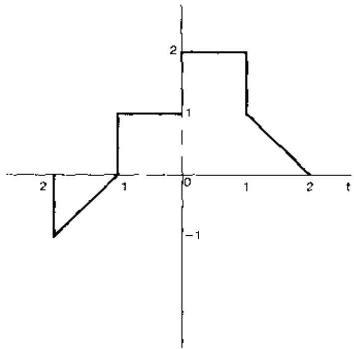  
Figure P1.21

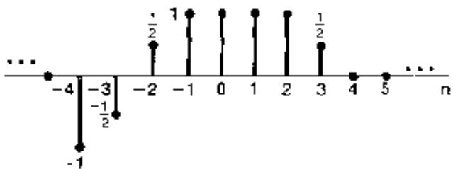  
Figure P1.22

1.23. Determine and sketch the even and odd parts of the signals depicted in Figure P1.23 Label your sketches carefully.

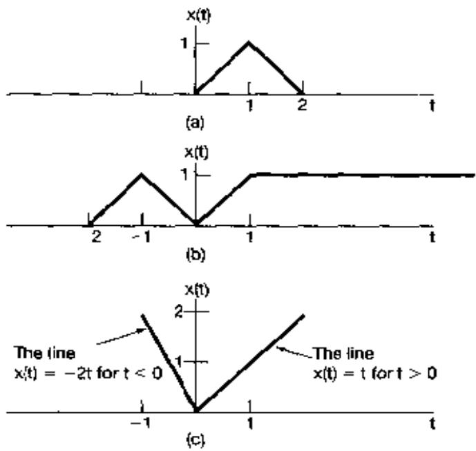  
Figure P1.23

1.24. Determine and sketch the even and odd parts of the signals depicted in Figure P1.24 Label your sketches carefully.

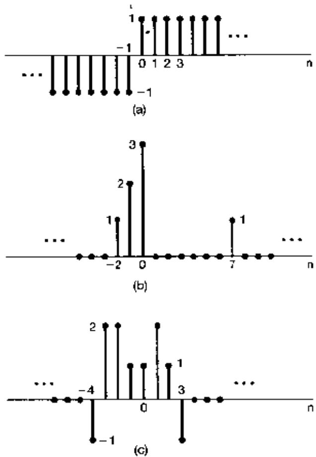

1.25. Determine whether or not each of the following continuous- time signals is periodic If the signal is periodic, determine its fundamental period.

$$
\begin{array}{l l}{{x(t)=3\cos(4t+\frac{\pi}{3})}}&{{\qquad(\mathbf{b})\ x(t)=e^{j(\pi t-1)}}}\\ {{x(t)=[\cos(2t-\frac{\pi}{3})]^{2}}}&{{\qquad(\mathbf{d})\ x(t)=\delta v\{\cos(4\pi t)u(t)\}}}\\ {{x(t)=\delta v\{\sin(4\pi t)u(t)\}}}&{{\qquad(\mathbf{f})\ x(t)=\sum_{n=-\infty}^{\infty}e^{-\left(2t-n\right)}}}\end{array}
$$

1.26. Determine whether or not each of the following discrete- time signals is periodic. If the signal is periodic, determine its fundamental period.

(a)  $\begin{array}{r}{x[n] = \sin (\frac{\theta\pi}{2} n + 1)} \end{array}$  
(b)  $\begin{array}{r}{x[n] = \cos (\frac{\pi}{8} -\pi)} \end{array}$  
(c)  $\begin{array}{r}{x[n] = \cos (\frac{\pi}{8} n^{2})} \end{array}$  
(d)  $\begin{array}{r}{x[n] = \cos (\frac{\pi}{2} n)\cos (\frac{\pi}{4} n)} \end{array}$  
(e)  $\begin{array}{r}{x[n] = 2\cos (\frac{\pi}{4} n) + \sin (\frac{\pi}{8} n) - 2\cos (\frac{\pi}{2} n + \frac{\pi}{6})} \end{array}$

1.27. In this chapter, we introduced a number of general properties of systems. In particular, a system may or may not be

(1) Mercury (2) Time invariant (3) Linear (4) Causal (5) Stable

Determine which of these properties hold and which do not hold for each of the following continuous- time systems. Justify your answers. In each example,  $y(t)$  denotes the system output and  $x(t)$  is the system input.

(a)  $y(t) = x(t - 2) + x(2 - t)$  
(b)  $y(t) = [\cos (3t)]x(t)$  
(c)  $y(t) = \int_{-2\pi}^{2t}x(\tau)d\tau$  
(d)  $y(t) = \left\{ \begin{array}{l l}{0,} & {t< 0}\\ {x(t) + x(t - 2),} & {t\geq 0} \end{array} \right.$

(e)  $y(t) = \left\{ \begin{array}{l l}{0,}\\ {x(t) + x(t - 2),}\\ {x(t) = \frac{d x(t)}{d t}} \end{array} \right.$  
(f)  $y(t) = x(t / 3)$

(g) y(t) = d

1.28. Determine which of the properties listed in Problem 1.27 hold and which do not hold for each of the following discrete- time systems. Justify your answers. In each example,  $y[n]$  denotes the system output and  $x[n]$  is the system input.

(a)  $y[n] = x[-n]$  
(b)  $y[n] = x[n - 2] - 2x[n - 8]$

(c)  $y[n] = nx[n]$  
(d)  $y[n] = \delta \mathbf{e}\{x[n - 1]\}$

(e)  $y[n] = \left\{ \begin{array}{l l}{x[n],} & {n\geq 1}\\ {0,} & {n = 0}\\ {x[n + 1],} & {n\leq -1} \end{array} \right.$  
(f)  $y[n] = \left\{ \begin{array}{l l}{x[n],} & {n\geq 1}\\ {0,} & {n = 0}\\ {x[n],} & {n\leq -1} \end{array} \right.$

(g)  $y[n] = x[4n + 1]$

1.29. (a) Show that the discrete- time system whose input  $x[n]$  and output  $y[n]$  are related by  $y[n] = \{R e\{x[n]\}$  is additive. Does this system remain additive if its inputoutput relationship is changed to  $y[n] = \{R e\{e^{j\pi n / 4}x[n]\} \} ?$  (Do not assume that  $x[n]$  is real in this problem.)

(b) In the text, we discussed the fact that the property of linearity for a system is equivalent to the system possessing both the additivity property and homogeneity property. Determine whether each of the systems defined below is additive and/or homogeneous. Justify your answers by providing a proof for each property if it holds or a counterexample if it does not.

\(\begin{array}{r}{\mathbf{\nabla}\cdot \mathbf{\nabla}\cdot \mathbf{\nabla}\cdot \mathbf{\nabla}\cdot \mathbf{\nabla}\cdot \mathbf{\nabla}\cdot \mathbf{\nabla}\cdot \mathbf{\nabla}\cdot \mathbf{\nabla}\cdot \mathbf{\nabla}\cdot \mathbf{\nabla}\cdot \mathbf{\nabla}\cdot \cdot \mathbf{\nabla}\cdot \mathbf{\nabla}\cdot \mathbf{\nabla}\cdot \mathbf{\nabla}\cdot \mathbf{\nabla}\cdot \mathbf{\nabla}\cdot \mathbf{\nabla}\cdot \mathbf{\nabla}\cdot \mathbf{\nabla}\cdot \mathbf{\nabla}\cdot \mathbf{\nabla}\mathbf{\cdot}\mathbf{\nabla}\cdot \mathbf{\nabla}\cdot \mathbf{\nabla}\cdot \mathbf{\nabla}\cdot \mathbf{\nabla}\cdot \mathbf{\nabla}\cdot \mathbf{\nabla}\cdot \mathbf{\nabla}\cdot \mathbf{\nabla}\cdot \mathbf{\nabla}\cdot \mathbf{\nabla}\cdot \nabla \cdot \mathbf{\nabla}\cdot \mathbf{\nabla}\cdot \mathbf{\nabla}\cdot \mathbf{\nabla}\cdot \mathbf{\nabla}\cdot \mathbf{\nabla}\cdot \mathbf{\nabla}\cdot \mathbf{\nabla}\cdot \mathbf{\nabla}\cdot \mathbf{\nabla}\cdot \mathbf{\nabla} \cdot \mathbf{\nabla}\cdot \mathbf{\nabla}\cdot \mathbf{\nabla}\cdot \mathbf{\nabla}\cdot \mathbf{\nabla}\cdot \mathbf{\nabla}\cdot \mathbf{\nabla}\cdot \mathbf{\nabla}\cdot \mathbf{\nabla}\cdot \mathbf{\nabla}\cdot \mathbf{\nabla\cdot}\mathbf{\nabla}\cdot \mathbf{\nabla\cdot}\mathbf{\nabla\cdot}\mathbf{\nabla\cdot}\mathbf{\nabla\cdot}\mathbf{\nabla\cdot}\mathbf{\nabla\cdot}\mathbf{\nabla\cdot}\mathbf{\nabla\cdot}\mathbf{\nabla\cdot}\mathbf{\nabla\cdot}\mathbf{\nabla\cdot}\mathbf{\nabla\cdot}\cdot \mathbf{\nabla\cdot}\cdot \mathbf{\nabla\cdot}\cdot \mathbf{\nabla\cdot}\cdot \mathbf{\nabla\cdot}\cdot \mathbf{\nabla\cdot}\cdot \mathbf{\nabla\cdot}\cdot \mathbf{\nabla\cdot}\cdot \mathbf{\nabla\cdot}\cdot \mathbf{\nabla\cdot}\cdot \cdot \cdot \cdot \cdot \cdot \cdot \cdot \cdot \cdot \cdot \cdot \cdot \cdot \cdot \cdot \cdot \cdot \cdot \cdot \cdot \cdot \cdot \cdot \cdot \cdot \cdot \cdot \cdot \cdot \cdot \cdot \cdot \cdot \cdot \cdot \cdot \cdot \cdot \cdot \cdot \cdot \cdot \cdot \cdot \cdot \cdot \cdot \cdot \cdot \cdot\cdot \cdot \cdot \cdot \cdot \cdot \cdot \cdot \cdot \cdot \cdot \cdot \cdot \cdot \cdot \cdot \cdot \cdot \cdot \cdot \cdot \cdot \cdot \cdot \cdot \cdot \cdot \cdot \cdot \cdot \cdot \cdot \cdot \cdot \cdot \cdot \cdot \cdot \cdot \cdot \cdot \cdot \cdot \cdot \cdot \cdot \cdot \cdot \cdot \cdot 
\]

1.30. Determine if each of the following systems is invertible. If it is, construct die inverse system. If it is not, find two input signals to the system that have the same output.

(a)  $y(t) = x(t - 4)$  
(b)  $y(t) = \cos [x(t)]$

(c)  $y[t] = n x[n]$  
(d)  $y(t) = \int_{-x}^{t}x(\tau)d\tau$

(e)  $y[n] = \left\{ \begin{array}{l l}{x[n - 1],} & {n\geq 1}\\ {0,} & {n = 0}\\ {x[n],} & {n\leq -1} \end{array} \right.$  
(f)  $y[n] = x[n]x[n - 1]$

(g)  $y[n] = x[1 - n]$  
(b)  $y(t) = \int_{-a}^{t}e^{-t - \tau \tau}x(\tau)d\tau$

(i)  $\begin{array}{r}{y[t] = \sum_{k = -\infty}^{n}(\frac{1}{2})^{t - k}x[k]} \end{array}$  
(j)  $y(t) = \frac{d x(t)}{d t}$

(k)  $y[n] = \left\{ \begin{array}{l l}{x[n + 1],} & {n\geq 0}\\ {x[n],} & {n\leq -1} \end{array} \right.$  
(l)  $y(t) = x(2t)$

(m)  $y[n] = x[2n]$  
(n)  $y[n] = \left\{ \begin{array}{l l}{x[n / 2],} & {\quad n\mathrm{even}}\\ {0,} & {\quad n\mathrm{odd}} \end{array} \right.$

1.31. In this problem, we illustrate one of the most important consequences of the properties of linearity and time invariance. Specifically, once we know the response of a linear system or a linear time- invariant (LTI) system to a single input or the responses to several inputs, we can directly compute the responses to many other

input signals. Much of the remainder of this book deals with a thorough exploitation of this fact in order to develop results and techniques for analyzing and synthesizing LTI systems.

(a) Consider an LTI system whose response to the signal  $x_{1}(t)$  in Figure P1.31(a) is the signal  $y_{1}(t)$  illustrated in Figure P1.31(b). Determine and sketch carefully the response of the system to the input  $x_{2}(t)$  depicted in Figure P1.31(c).

(b) Determine and sketch the response of the system considered in part 
(a) to the input  $x_{3}(t)$  shown in Figure P1.31(d).

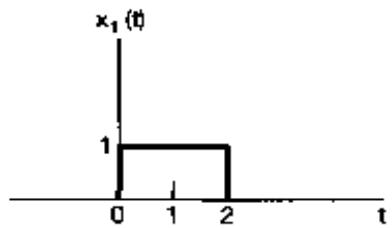  
(a)

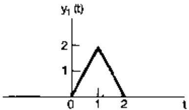  
(b)

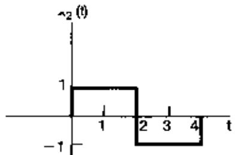  
(c)

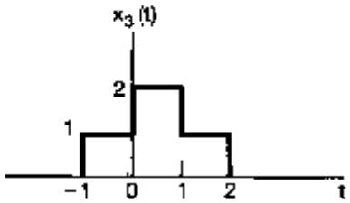  
(d) Figure P1.31

# ADVANCED PROBLEMS

1.32. Let  $x(t)$  be a continuous- time signal, and let

$$
y_{1}(t) = x(2t) \text{and} y_{2}(t) = x(t / 2).
$$

The signal  $y_{1}(t)$  represents a speeded up version of  $x(t)$  in the sense that the duration of the signal is cut in half. Similarly,  $y_{2}(t)$  represents a slowed down version of  $x(t)$  in the sense that the duration of the signal is doubled. Consider the following statements:

(1) If  $x(t)$  is periodic, then  $y_{1}(t)$  is periodic.

(2) If  $y_{1}(t)$  is periodic, then  $x(t)$  is periodic.

(3) If  $x(t)$  is periodic, then  $y_{2}(t)$  is periodic.

(4) If  $y_{2}(t)$  is periodic, then  $x(t)$  is periodic.

For each of these statements, determine whether it is true, and if so, determine the relationship between the fundamental periods of the two signals considered in the statement. If the statement is not true, produce a counterexample to it.

1.33. Let  $x[n]$  be a discrete- time signal, and let

$$
y_{1}[n] = x[2n] \text{and} y_{2}[n] = \begin{cases} x[n / 2], & n \text{even} \\ 0, & n \text{odd} \end{cases}
$$

The signals  $y_{1}[n]$  and  $y_{2}[n]$  respectively represent in some sense the speeded up and slowed down versions of  $x[n]$ . However, it should be noted that the discrete- time notions of speeded up and slowed down have subtle differences with respect to their continuous- time counterparts. Consider the following statements:

(1) If  $x[n]$  is periodic, then  $y_{1}[n]$  is periodic.

(2) If  $y_{1}[n]$  is periodic, then  $x[n]$  is periodic.

(3) If  $x[n]$  is periodic, then  $y_{2}[n]$  is periodic.

(4) If  $y_{2}[n]$  is periodic, then  $x[n]$  is periodic.

For each of these statements, determine whether it is true, and if so, determine the relationship between the fundamental periods of the two signals considered in the statement. If the statement is not true, produce a counterexample to it.

1.34. In this problem, we explore several of the properties of even and odd signals.

(a) Show that if  $x[n]$  is an odd signal, then

$$
\sum_{n = -\infty}^{+\infty}x[n] = 0.
$$

(b) Show that if  $x_{1}[n]$  is an odd signal and  $x_{2}[n]$  is an even signal, then  $x_{1}[n]x_{2}[n]$  is an odd signal.

(c) Let  $x[n]$  be an arbitrary signal with even and odd parts denoted by

$$
x_{e}[n] = \mathcal{E}v[x[n]]
$$

and

$$
x_{\sigma}[n] = \mathcal{O}d[x[n]].
$$

Show that

$$
\sum_{n = -\infty}^{+\infty}x^{2}[n] = \sum_{n = -\infty}^{+\infty}x^{2}[n] + \sum_{n = -\infty}^{+\infty}x_{\sigma}^{2}[n].
$$

(d) Although parts 
(a)-(c) have been stated in terms of discrete-time signals, the analogous properties are also valid in continuous time. To demonstrate this, show that

$$
\int_{-\infty}^{+\infty}x^{2}(t)d t = \int_{-\infty}^{+\infty}x_{\sigma}^{2}(t)d t + \int_{-\infty}^{+\infty}x_{\sigma}^{2}(t)d t,
$$

where  $x_{\sigma}(t)$  and  $x_{\sigma}(t)$  are, respectively, the even and odd parts of  $x(t)$ .

1.35. Consider the periodic discrete- time exponential time signal

$$
x[n] = e^{j\pi (2\pi /N)t}.
$$

Show that the fundamental period of this signal is

$$
N_{0} = N / \mathrm{gcd}(m,N),
$$

where gcd(m,N) is the greatest common divisor of m and N- - that is. the largest integer that divides both m and N an integral number of times. For example,

$$
\gcd (2,3) = 1,\gcd (2,4) = 2,\gcd (8,12) = 4.
$$

Note that  $N_{0} = N$  if  $m$  and  $N$  have no factors in common.

1.36. Let  $x(t)$  be the continuous- time complex exponential signal

$$
x(t) = e^{j\omega_{0}t}
$$

with fundamental frequency  $\omega_{0}$  and fundamental period  $T_{0} = 2\pi i\omega_{0}$ . Consider the discrete- time signal obtained by taking equally spaced samples of  $x(t)$ —that is,

$$
x[n] = x(nT) = e^{j\omega_{0}nT}.
$$

(a) Show that  $x[n]$  is periodic if and only if  $T / T_{0}$  is a rational number—that is, if and only if some multiple of the sampling interval exactly equals a multiple of the period of  $x(t)$ .

(b) Suppose that  $x[n]$  is periodic—that is, that

$$
\frac{T}{T_{0}} = \frac{p}{q}, \tag{P}
$$

where  $p$  and  $q$  are integers. What are the fundamental period and fundamental frequency of  $x[n]$ ? Express the fundamental frequency as a fraction of  $\omega_{0}T$ .

(c) Again assuming that  $T / T_{0}$  satisfies eq. (P1.36-1), determine precisely how many periods of  $x(t)$  are needed to obtain the samples that form a single period of  $x[n]$ .

1.37. An important concept in many communications applications is the correlation between two signals. In the problems at the end of Chapter 2, we will have more to say about this topic and will provide some indication of how it is used in practice. For now, we content ourselves with a brief introduction to correlation functions and some of their properties.

Let  $x(t)$  and  $y(t)$  be two signals; then the correlation function is defined as

$$
\phi_{xy}(t) = \int_{-x}^{\infty}x(t + \tau)y(t)dt.
$$

The function  $\phi_{xx}(t)$  is usually referred to as the autocorrelation function of the signal  $x(t)$ , while  $\phi_{xy}(t)$  is often called a cross- correlation function.

(a) What is the relationship between  $\phi_{xy}(t)$  and  $\phi_{yy}(t)$ ?

(b) Compute the odd part of  $\phi_{xx}(t)$ .

(c) Suppose that  $y(t) = x(t + T)$ . Express  $\phi_{xy}(t)$  and  $\phi_{yy}(t)$  in terms of  $\phi_{xx}(t)$ .

1.38. In this problem, we examine a few of the properties of the unit impulse function. (a) Show that

$$
\delta (2t) = \frac{1}{2}\delta (t).
$$

Hint: Examine  $\delta_{\Delta}(t)$ . (See Figure 1.34. )

(b) In Section 1.4, we defined the continuous-time unit impulse as the limit of the signal  $\delta_{\Delta}(t)$ . More precisely, we defined several of the properties of  $\delta (t)$  by examining the corresponding properties of  $\delta_{\Delta}(t)$ . For example, since the signal

$$
u_{\Delta}(t) = \int_{-x}^{t}\delta_{\Delta}(\tau)dt
$$

converges to the unit step

$$
\mathfrak{u}(t) = \lim_{\Delta \to 0}\mathfrak{u}_{\Delta}(t), \tag{P1.38-1}
$$

we could interpret  $\delta (t)$  through the equation

$$
u(t) = \int_{\infty}^{t}\delta (t)d\tau
$$

or by viewing  $\delta (t)$  as the formal derivative of  $u(t)$ .

This type of discussion is important, as we are in effect trying to define  $\delta (t)$  through its properties rather than by specifying its value for each  $t$ , which is not possible. In Chapter 2, we provide a very simple characterization of the behavior of the unit impulse that is extremely useful in the study of linear time- invariant systems. For the present, however, we concentrate on demonstrating that the important concept in using the unit impulse is to understand how it behaves. To do this, consider the six signals depicted in Figure P1.38. Show

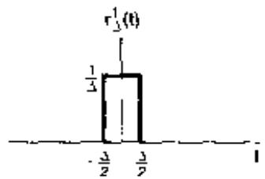  
(a)

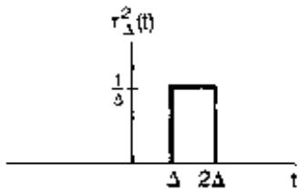  
(b)

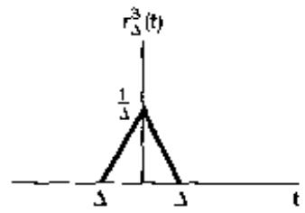  
(c)

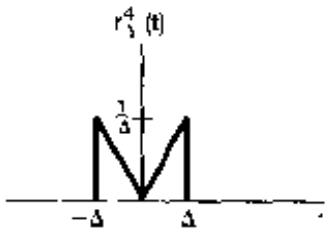  
(d)

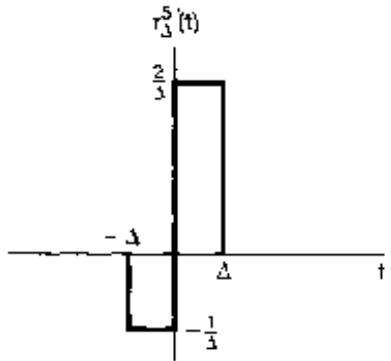  
(e)

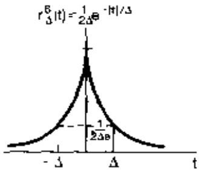  
(f) Figure P1.38

that each "behaves like an impulse" as  $\Delta \rightarrow 0$  in that, if we let

$$
u_{\Delta}^{i}(t) = \int_{-\infty}^{t}r_{\Delta}^{i}(\tau)d\tau ,
$$

then

$$
\lim_{\Delta \to 0}u_{\Delta}^{i}(t) = u(t).
$$

In each case, sketch and label carefully the signal  $u_{\Delta}^{i}(t)$ . Note that

$$
r_{\Delta}^{2}(0) = r_{\Delta}^{4}(0) = 0 \text{for all} \Delta .
$$

Therefore. it is not enough to define or to think of  $\delta (t)$  as being zero for  $t \neq 0$  and infinite for  $t = 0$ . Rather, it is properties such as eq. (P1.38- 1) that define the impulse. In Section 2.5 we will define a whole class of signals known as singularity functions, which are related to the unit impulse and which are also defined in terms of their properties rather than their values.

1.39. The role played by  $u(t), \delta (t)$ , and other singularity functions in the study of linear time- invariant systems is that of an idealization of a physical phenomenon, and, as we will see, the use of these idealizations allows us to obtain an exceedingly important and very simple representation of such systems. In using singularity functions, we need, however, to be careful. In particular, we must remember that they are idealizations, and thus, whenever we perform a calculation using them, we are implicitly assuming that this calculation represents an accurate description of the behavior of the signals that they are intended to idealize. To illustrate, consider the equation

$$
x(t)\delta (t) = x(0)\delta (t). \tag{P1.39-1}
$$

This equation is based on the observation that

$$
x(t)\delta_{\Delta}(t) = x(0)\delta_{\Delta}(t). \tag{P1.39-2}
$$

Taking the limit of this relationship then yields the idealized one given by eq. (P1.39- 1). However, a more careful examination of our derivation of eq. (P1.39- 2) shows that that equation really makes sense only if  $x(t)$  is continuous at  $t = 0$ . If it is not, then we will not have  $x(t) \approx x(0)$  for  $t$  small.

To make this point clearer, consider the unit step signal  $u(t)$  . Recall from eq. (1.70) that  $u(t) = 0$  for  $t< 0$  and  $u(t) = 1$  for  $t > 0$  but that its value at  $\pmb {\tau} = \pmb{0}$  is not defined. (Note, for example, that  $u_{\Delta}(0) = 0$  for all  $\Delta$  , while  $\begin{array}{r}{\mu_{\Delta}^{1}(0) = \frac{1}{2}} \end{array}$  (from Problem 1.38(b).] The fact that  $u(0)$  is not defined is not particularly bothersome, as long as the calculations we perform using  $u(t)$  do not rely on a specific choice for  $u(0)$  . For example, if  $f(t)$  is a signal that is continuous at  $\pmb {\mathscr{t}} = \pmb{0}$  then the value of

$$
\int_{-\infty}^{+\infty}f(\sigma)u(\sigma)d\sigma
$$

does not depend upon a choice for  $u(0)$ . On the other hand, the fact that  $u(0)$  is undefined is significant in that it means that certain calculations involving singularity functions are undefined. Consider trying to define a value for the product  $u(t) \delta (t)$ .

To see that this cannot be defined, show that

$$
\lim_{\Delta \to 0}[u_{\Delta}(t)\delta (t)] = 0,
$$

but

$$
\lim_{\Delta \to 0}[u_{\Delta}(t)\delta_{\Delta}(t)] = \frac{1}{2}\delta (t).
$$

In general, we can define the product of two signals without any difficulty, as long as the signals do not contain singularities (discontinuities, impulses, or the other singularities introduced in Section 2.5) whose locations coincide. When the locations do coincide, the product is undefined. As an example, show that the signal

$$
g(t) = \int_{-\infty}^{+\infty}u(\tau)\delta (t - \tau)d\tau
$$

is identical to  $u(t)$ ; that is, it is 0 for  $t< 0$ , it equals 1 for  $t > 0$ , and it is undefined for  $t = 0$ .

1.40. (a) Show that if a system is either additive or homogeneous, it has the property that if the input is identically zero, then the output is also identically zero.

(b) Determine a system (either in continuous or discrete time) that is neither additive nor homogeneous but which has a zero output if the input is identically zero.

(c) From part 
(a), can you conclude that if the input to a linear system is zero between times  $t_{1}$  and  $t_{2}$  in continuous time or between times  $n_{1}$  and  $n_{2}$  in discrete time, then its output must also be zero between these same times? Explain your answer.

1.41. Consider a system  $S$  with input  $x[n]$  and output  $y[n]$  related by

$$
y[n] = x[n]g[n] + g[n - 1]\} .
$$

(a) If  $g[n] = 1$  for all  $n$ , show that  $S$  is time invariant.

(b) If  $g[n] = n$ , show that  $S$  is not time invariant.

(c) If  $g[n] = 1 + (-1)^{n}$ , show that  $S$  is time invariant.

1.42. (a) Is the following statement true or false?

The series interconnection of two linear time- invariant systems is itself a linear, time- invariant system.

Justify your answer.

(b) Is the following statement true or false?

The series nthereconnection of two nonlinear systems is itself nonlinear.

Justify your answer.

(c) Consider three systems with the following input-output relationships:

$$
y[n] = \left\{ \begin{array}{l l}{x[n / 2],} & {\quad n\mathrm{~even}}\\ {0,} & {\quad n\mathrm{~odd}} \end{array} \right.,
$$

$$
\begin{array}{l l}{{y[n]=x[n]+\frac{1}{2}x[n-1]+\frac{1}{4}x[n-2],}}\\ {{y[n]=x[2n].}}\end{array}
$$

Suppose that these systems are connected in series as depicted in Figure P1.42. Find the input- output relationship for the overall interconnected system. Is this system linear? Is it time invariant?

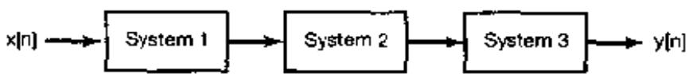  
Figure P1.42

1.43. (a) Consider a time- invariant system with input  $x(t)$  and output  $y(t)$ . Show that if  $x(t)$  is periodic with period  $T$ , then so is  $y(t)$ . Show that the analogous result also holds in discrete time.

(b) Give an example of a time-invariant system and a nonperiodic input signal  $x(t)$  such that the corresponding output  $y(t)$  is periodic.

1.44. (a) Show that causality for a continuous- time linear system is equivalent to the following statement:

For any time  $t_0$  and any input  $x(t)$  such that  $x(t) = 0$  for  $t < t_0$ , the corresponding output  $y(t)$  must also be zero for  $t < t_0$ .

The analogous statement can be made for a discrete- time linear system.

(b) Find a nonlinear system that satisfies the foregoing condition but is not causal.

(c) Find a nonlinear system that is causal but does not satisfy the condition

(d) Show that invertibility for a discrete-time linear system is equivalent to the following statement:

The only input that produces  $y[n] = 0$  for all  $a$  is  $x[n] = 0$  for all  $a$ .

The analogous statement is also true for a continuous- time linear system.

(e) Find a nonlinear system that satisfies the condition of part 
(d) but is not invertible.

1.45. In Problem 1.37, we introduced the concept of correlation functions. It is often important in practice to compute the correlation function  $\phi_{h_{\tau}}(t)$ , where  $h(t)$  is a fixed given signal, but where  $x(t)$  may be any of a wide variety of signals. In this case, what is done is to design a system  $S$  with input  $x(t)$  and output  $\phi_{h_{\tau}}(t)$ .

(a) Is  $S$  linear? Is  $S$  time invariant? Is  $S$  causal? Explain your answers.

(b) Do any of your answers to part 
(a) change if we take as the output  $\phi_{\tau_{\tau}}(t)$  rather than  $\phi_{\tau_{\tau}}(t)$ ?

1.46. Consider the feedback system of Figure P1.46. Assume that  $y[n] = 0$  for  $n < 0$ .

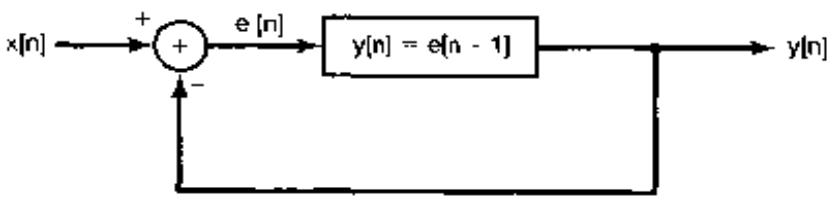  
Figure P1.46

(a) Sketch the output when  $x[n] = \delta [n]$ .

(b) Sketch the output when  $x[n] = u[n]$ .

1.47. (a) Let S denote an incrementally linear system, and let x[n] be an arbitrary input signal to S with corresponding output y[n]. Consider the system illustrated in Figure P1.47(a). Show that this system is linear and that, in fact, the overall input- output relationship between x[n] and y[n] does not depend on the particular choice of x[n].

(b) Use the result of part 
(a) to show that  $S$  can be represented in the form shown in Figure 1.48.

(c) Which of the following systems are incrementally linear? Justify your answers, and if a system is incrementally linear, identify the linear system  $L$  and the zero-input response  $y_{0}[n]$  or  $y_{0}(t)$  for the representation of the system as shown in Figure 1.48.

(i)  $y[n] = n + x[n] + 2x[n + 4]$

n even (ii) y[n] = (n- 1)/2+ x[k], n odd

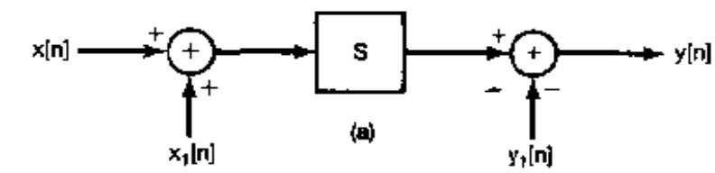

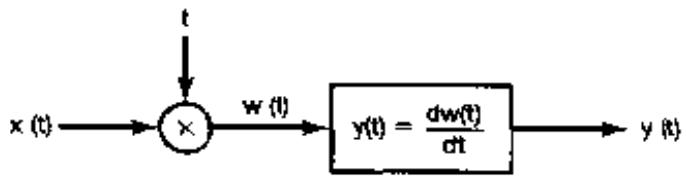  
(b)

  
Figure P1.47

$$
y[n] = \left\{ \begin{array}{ll}x[n] - x[n - 1] + 3, & \text{if} x[0] \geq 0 \\ x[n] - x[n - 1] - 3, & \text{if} x[0] < 0 \end{array} \right.
$$

(iv) The system depicted in Figure P1.47(b).

(v) The system depicted in Figure P1.47(c).

(d) Suppose that a particular incrementally linear system has a representation as in Figure 1.48, with  $L$  denoting the linear system and  $y_{0}[n]$  the zero-input response. Show that  $S$  is time invariant if and only if  $L$  is a time-invariant system and  $y_{0}[n]$  is constant.

# MATHEMATICAL REVIEW

The complex number  $z$  can be expressed in several ways. The Cartesian or rectangular form for  $z$  is

$$
z = x + j y,
$$

where  $j = \sqrt{- 1}$  and  $x$  and  $y$  are real numbers referred to respectively as the real part and the imaginary part of  $z$ . As we indicated earlier, we will often use the notation

$$
x = \Re e\{z\} , y = \Im m\{z\} .
$$

The complex number  $z$  can also be represented in polar form as

$$
z = r e^{j\theta},
$$

where  $r > 0$  is the magnitude of  $z$  and  $\theta$  is the angle or phase of  $z$ . These quantities will often be written as

$$
r = |z| \cdot \theta = x z.
$$

The relationship between these two representations of complex numbers can be determined either from Euler's relation,

$$
e^{j\theta} = \cos \theta + j \sin \theta ,
$$

or by plotting z in the complex plane, as shown in Figure P1.48, in which the coordinate axes are Re{z) along the horizontal axis and 8m{z) along the vertical axis. With respect to this graphical representation, x and y are the Cartesian coordinates of z, and r and 8 are its polar coordinates.

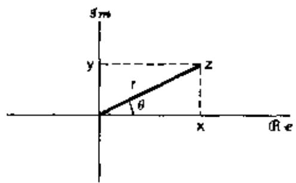  
Figure P1.48

1.48. Let  $\mathbf{\delta z}_{0}$  be a complex number with polar coordinates  $(r_{0},\theta_{0})$  and Cartesian coordinates  $(x_{0},y_{0})$  Determine expressions for the Cartesian coordinates of the following complex numbers in terms of  $\pmb{x_{0}}$  and  $\pmb{y_{0}}$  Plot the points  $z_{0},z_{1},z_{2},z_{3},z_{4}$  and  $z_{5}$  in the complex plane when  $r_{1} = 2$  and  $\theta_{0} = \pi /4$  and when  $r_{0} = 2$  and  $\theta_{0} = \pi /2$  Indicate on your plots the real and imaginary parts of each point.

$$
\begin{array}{l l l}{{z_{1}~=~r_{0}e^{-j\theta_{0}}}}&{{\qquad(\mathbf{b})~z_{2}~=~r_{0}}}&{{\qquad(\mathbf{c})~z_{3}~=~r_{0}e^{j(\theta_{0}-2\pi)}}}\\ {{z_{4}~=~r_{0}e^{j(\theta_{0}-\theta_{0}+\pi)}}}&{{\qquad(\mathbf{e})~z_{5}~=~r_{0}e^{j(\theta_{0}-2\pi)}}}\end{array}
$$

1.49. Express each ot the following complex numbers in polar form, and plot them in the complex plane, indicating the magnitude and angle of each number:

(a)  $1 + j\sqrt{3}$  
(b) -5 
(c) -5 - 5j 
(d)  $3 + 4j$  
(e)  $(1 - j\sqrt{3})^{3}$  
(f)  $(1 + j)^{3}$  
(g)  $(\sqrt{3} +j^{3})(1 - j)$  
(h)  $\frac{2\cdot\mu(6\sqrt{3})}{2\cdot\mu(6\sqrt{3})}$  
(i)  $\frac{1 + j\sqrt{3}}{\sqrt{3} + j}$  
(j)  $j(1 + j)e^{j\pi /6}$  
(k)  $(\sqrt{3} +j)2\sqrt{2} e^{-j\pi /4}$  
(l)  $\frac{e^{j\pi / 4}}{1 + j\sqrt{3}}$

1.50. (a) Using Euler's relationship or Figure P1.48, determine expressions for x and y in terms of  $\pmb{r}$  and  $\pmb{\theta}$

(b) Determine expressions for  $\pmb{r}$  and  $\pmb{\theta}$  in terms of  $\pmb{x}$  and  $\pmb{y}$

(c) If we are given only  $\pmb{r}$  and tan  $\pmb{\theta}$  , can we uniquely determine  $\pmb{x}$  and  $\pmb{y}^{\pmb{\mathscr{P}}}$  Explain your answer.

1.51. Using Euler's relation, derive the following relationships:

(a) cos  $\begin{array}{r}{\theta = \frac{1}{2} (e^{j\theta} + e^{-j\theta})} \end{array}$  
(b) sin  $\begin{array}{r}{\theta = \frac{1}{2} (e^{j\theta} - e^{-j\theta})} \end{array}$  
(c)  $\cos^{2}\theta = \frac{1}{2} (1 + \cos 2\theta)$  
(d)  $(\sin \theta)(\sin \phi) = \frac{1}{2}\cos (\theta -\phi) - \frac{1}{2}\cos (\theta +\phi)$  
(e)  $\sin (\theta +\phi) = \sin \theta \cos \phi +\cos \theta \sin \phi$

1.52. Let z denote a complex variable: that is,

$$
z = x + jy = re'θ.
$$

The complex conjugate of z is

$$
z^{\prime} = x - j y = r e^{-j\theta}.
$$

Derive each of the following relations, where z, z1, and z2 are arbitrary complex numbers.

(a)  $z z^{\star} = e^{2\theta}$  
(b)  $\frac{z}{z} = e^{2\theta}$  
(c)  $z + z^{\star} = 2\theta \mathbf{e}\{z\}$  
(d)  $z - z^{\star} = 2j\theta m\{z\}$  
(e)  $(z_{1} + z_{2})^{\star} = z_{1}^{\star} + z_{2}^{\star}$  
(f)  $(a z_{1}z_{2})^{\star} = a z_{1}^{\star}z_{2}^{\star}$  where a is any real number 
(g)  $(\frac{z_{1}}{z_{2}})^{\star} = \frac{z_{1}}{z_{2}}$ $(\mathbf{h}) \mathcal{R}\mathbf{e}\{z_{1}^{\star}\} = \frac{1}{2} [\frac{z_{1}z_{2}^{\star} + z_{1}^{\star}z_{2}}{z_{2}z_{2}^{\star}} ]$

1.53. Derive the following relations, where z, z1, and z2 are arbitrary complex numbers:

(a)  $(e^{z})^{*} = e^{z^{*}}$  
(b)  $z_{1}z_{2}^{*} + z_{1}^{*}z_{2} = 2\mathbb{R}e\{z_{1}z_{2}^{*}\} = 2\mathbb{R}e\{z_{1}^{*}z_{2}\}$

$$
\begin{array}{l}{|z| = |z^{*}|}\\ {|z_{1}z_{2}| = |z_{1}||z_{2}|}\\ {|\Re_{\mathbf{c}}(z)\leq |z|,\left.\delta m(z)\leq |z|}\\ {|z_{1}z_{2}^{*} + z_{1}^{*}|z_{2}|\leq 2|z z_{2}|}\\ {|z_{1}| - |z_{2}|)^{2}\leq |z_{1} + z_{2}|^{2}\leq (|z_{1}^{*} + |z_{2}|)^{2}} \end{array}
$$

1.54. The relations considered in this problem are used on many occasions throughout the book.

(a) Prove the validity of the following expression:

$$
\sum_{n = 0}^{N - 1}\alpha^{n} = \left\{ \begin{array}{l l}{N_{1}} & {\qquad \alpha = 1}\\ {\frac{1 - \alpha^{n}}{1 - \alpha},} & {\qquad \mathrm{for~any~complex~number~}\alpha \neq 1} \end{array} \right.
$$

This is often referred to as the finite sum formula.

(b) Show that if  $|a|< 1$  ,then

$$
\sum \limits_{n = 0}^{\infty}\alpha^{n} = \frac{1}{1 - \alpha}.
$$

This is often referred to as the infinite sum formula.

(c) Show also if  $|a|< 1$  ,then

$$
\sum_{n = 0}^{\infty}n\alpha^{n} = \frac{\alpha}{(1 - \alpha)^{2}}.
$$

(d) Evaluate

$$
\sum \limits_{n = k}^{\infty}\alpha^{n},
$$

assuming that  $|a|< 1$

1.55. Using the results from Problem 1 54, evaluate each of the following sums and express your answer in Cartesian (rectangular) form:

$$
\begin{array}{l l}{{\sum_{n=0}^{9}e^{j\pi n/2}}}&{{\qquad(\mathbf{b})\sum_{n=-2}^{7}e^{j\pi n/2}}}\\ {{\sum_{n=0}^{9}(\frac{1}{2})^{n}e^{j\pi n/2}}}&{{\qquad(\mathbf{d})\sum_{n=2}^{7}(\frac{1}{2})^{n}e^{j\pi n/2}}}\\ {{\sum_{n=0}^{9}e^{(n+\frac{\pi}{2})n}}}&{{\qquad(\mathbf{f})\sum_{n=0}^{7}(\frac{1}{2})^{n}\cos(\frac{\pi}{2}n)}}\end{array}
$$

1.56. Evaluate each of the following integrals, and express your answer in Cartesian (rectangular) form:

$$
\begin{array}{l l}{{\mathrm{~\bf~\lambda~}}}&{{\mathrm{~\bf~\lambda~}}\mathrm{~\bf~\lambda~}}\\ {{\mathrm{~\bf~\lambda~}}}&{{\mathrm{~\bf~\lambda~}}\mathrm{~\bf~\lambda~}}\\ {{\mathrm{~\bf~\lambda~}}}&{{\mathrm{~\bf~\lambda~}}\mathrm{~\bf~\lambda~}}\\ {{\mathrm{~\bf~\lambda~}}}&{{\mathrm{~\bf~\lambda~}}\in\mathrm{~\bf~\lambda~}}\\ {{\mathrm{~\bf~\lambda~}}}&{{\mathrm{~\bf~\lambda~}}\mathrm{~\bf~\lambda~}}\\ {{\mathrm{~\bf~\lambda~}}}&{{\mathrm{~\bf~\lambda~}}\mathrm{~\bf~\lambda~}}\\ {{\mathrm{~\bf~\lambda~}}}&{\mathrm{~\bf~\lambda~}}\mathrm{~\bf~\lambda~}}\\ {{\mathrm{~\bf~\lambda~}}}&{\mathrm{~\bf~\lambda~}}\mathrm{~\bf~\lambda~}}\\ {{\mathrm{~\bf~\lambda~}}}&{\mathrm{~\bf~\lambda~}}\mathrm{~\bf~\lambda~}}\\ {{\mathrm{~{\bf~\lambda~}}}}&{\mathrm{~\bf~\lambda~}}\mathrm{~\bf~\lambda~}}\\ {{\mathrm{~{\bf~\lambda~}}}}&{\mathrm{~\bf~\lambda~}}\mathrm{~\bf~\lambda~}}\\ {{\mathrm{~{\bf~\lambda~}}}}&{\mathrm{~\bf~\lambda~}}\mathrm{~\bf~\lambda~}}\\ {{\bf~\lambda~}}&{\mathrm{~\bf~\lambda~}}\mathrm{~\bf~\lambda~}}\\ {{\mathrm{~{\bf~\lambda~}}}}&{\mathrm{~\bf~\lambda~}}\mathrm{~\bf~\lambda~}}\\ {{\mathrm{~{\bf~\lambda~}}}}&{\mathrm{~\bf~\lambda~}}\mathrm{~\bf~\lambda~}}\\ {{{\bf~\lambda~}}}&{\mathrm{~\bf~\lambda~}}\mathrm{~\bf~\lambda~}}\\ {{\mathrm{~{\bf~\lambda~}}}}&{\mathrm{~\bf~\lambda~}}\mathrm{~\bf~\lambda~}}\\ {{\mathrm{~{\bf~\lambda~}}}}&{\mathrm{~\bf~\lambda~}}\mathrm{~\bf}}\end{array}
$$