# 概率论与数理统计 (第四版)

电子科技大学数学科学学院徐全智 吕恕

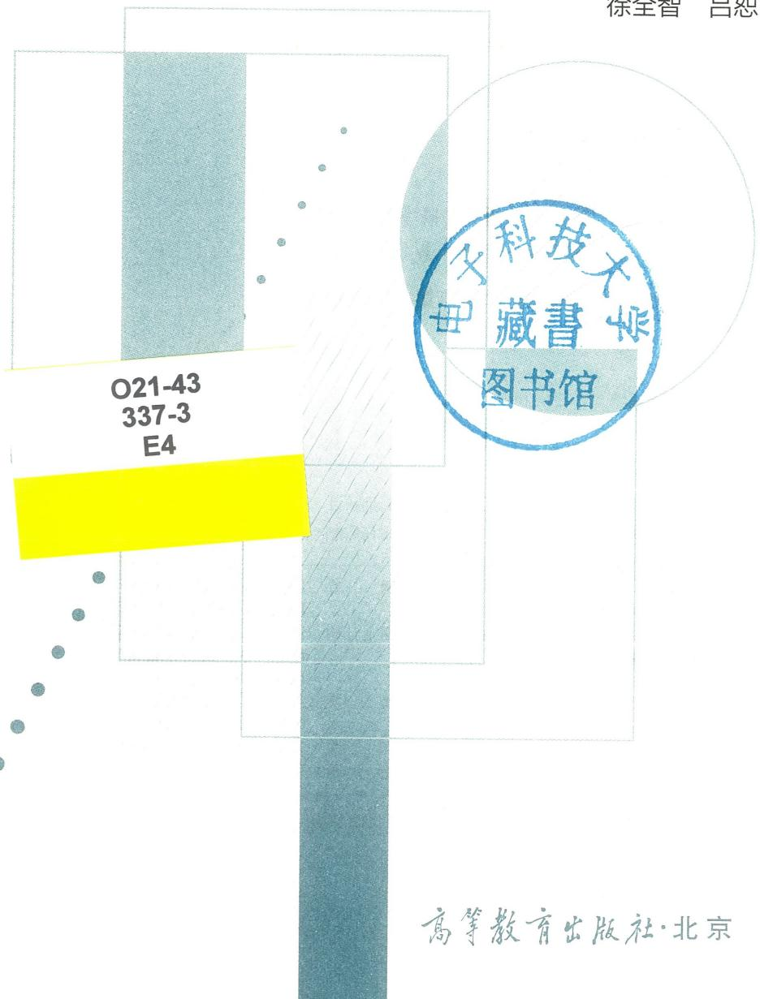

内容提要

本书是普通高等教育"十一五"国家级规划教材。全书内容包括概率论的基本概念、随机变量的分布、多维随机变量、随机变量的数字特征、大数定律和中心极限定理、数理统计的基本概念、参数估计、假设检验、回归分析、方差分析。各章习题中设有练习题和思考题, 书末附有部分习题参考答案。

本书强调概率论与数理统计中的基本理论和基本运算, 着重阐述概率统计思想方法, 并予以加深拓展, 实现将学习过程向课外延续。本书概念准确、条理清晰、简明易读, 可作为高等学校工科、理科 (非数学类专业)、管理等各类专业的教材, 也可供工程技术人员和合学者参考。

# 图书在版编目(CIP)数据

概率论与数理统计/徐全智, 吕恕编著. - - 4 版. - - 北京: 高等教育出版社, 2021.8

ISBN 978- 7- 04- 056435- 8

I.  $①$  概…Ⅱ.  $①$  徐…  $②$  吕…Ⅲ.  $①$  概率论-高等学校-教材  $②$  数理统计-高等学校-教材 IV.  $①$  021

中国版本图书馆CIP数据核字(2021)第129924号

Gailulun yu Shuli Tongji

策划编辑杨帆 责任编辑杨帆 封面设计赵阳 版式设计马云插图绘制邓超 责任校对刘丽娴 责任印制 存怡

出版发行 高等教育出版社

社址 北京市西城区德外大街4号

邮政编码 100120

印刷 唐山嘉德印刷有限公司

开本 787mm×1092mm 1/16

印张 18

字数 390千字

购书热线 010- 58581118

咨询电话 400- 810- 0598

网 址 http://www.hep.edu.cn

http://www.hep.com.cn

网上订购 http://www.hepmall.com.cn

http://www.hepmall.com

http://www.hepmall.cn

版次 2004年7月第1版

2021年8月第4版

印次 2021年8月第1次印刷

定价 39.80元

# 概率论与数理统计（第四版）

电子科技大学数学科学学院徐全智 吕恕

1 计算机访问https://abook.hep.com.cn/1226285，或手机扫描二维码、下载并安装Abook应用。

2 注册并登录，进入“我的课程”。

3 输入封底数字课程账号（20位密码，刮开涂层可见），或通过Abook应用扫描封底数字课程账号二维码，完成课程绑定。

4 单击“进入课程”按钮，开始本数字课程的学习。

课程绑定后一年为数字课程使用有效期。受硬件限制，部分内容无法在手机端显示，请按提示通过计算机访问学习。

如有使用问题，请发邮件至abook@hep.com.cn。

# 第四版前言

本次教材的再版修改，主要内容和框架未做大的改动，在保持原有特色基础上，充分注意到新工科背景下人才培养对数学基础课程的需求，力求增强教材的可读性和实践性，为学生学习后续课程以及未来从事工程技术工作和科研工作打下必要的概率统计理论基础。

本版教材希望更充分地应用现代科技手段，帮助学生掌握概率论与数理统计的基本理论、基本思想及基本方法，训练学生观测实验与理性思维相结合的随机分析思维模式，实践概率统计中观察、分析、描述和处理问题的思想及方法，创建主动外延学习条件，营造实践学习环境。

本版删除了原第10章第4节的正交试验设计。数字资源内容有增减和修改，并增添了部分视频，以帮助学生克服单纯文字阅读理解所致的学习困难。

本书由徐全智负责统稿，并编写第1章至第5章，吕恕编写第6章至第10章，龚丽莎参与部分视频制作工作。

由于编者水平所限，缺点和不当之处在所难免，恳请同行专家和读者批评指正。

编者  2021年1月

# 第三版前言

本次修订教材,主要内容和框架未做大的改动,仍保持原有特色:力求做到概率论部分及数理统计部分两者并重和有机结合;在作为工科教材的前提下,尽量使概念准确、系统、完整;强调基本理论和基本运算,着重对概率统计思想方法进行阐述;强调概率论与数理统计的客观背景和实际应用(每章最后一节均是对应知识的应用和实例);例题、习题与教材内容紧密结合,每章习题分为练习题和思考题两部分;书后附有习题答案和有关图表。

现有国内教材注重数学理论体系的完整性,内容取舍和组织编排上偏重理论陈述。在我校近几年的教学与教学改革实践中,我们深感纯纸质教材相对本课程的学科特点和学生培养目标,确有一定的局限性。在高等教育出版社提供技术平台的支持下,本次修订我们编入了我校近年来教学改革成果中的数字化部分,希望能引导学生深刻理解基本概念、全面掌握理论知识,并能训练学生的科学创新思维及应用数学能力等。我们将逐年补充、更新数字化内容。

本版教材希望应用现代科技手段,突破纯纸质教材、教师、课堂的局限性,为学生主动外延学习创造条件。力求营造一个实践学习环境,训练学生观测实验与理性思维相结合的思维模式,实践概率统计中观察、分析、描述和处理问题的思想及方法,更好掌握基本概念及解决相关实际问题的能力,为后续课程的学习以及从事工程技术工作和科研工作打下必要的概率统计理论基础。

本教材全部讲授需68学时,根据不同学时和不同层次的要求,可酌情取舍讲授内容。

本教材由徐全智主编并负责统稿,编写第1章至第5章,吕恕编写第6章至第10章,另有覃思义、王志勇、高晴、龚丽莎参与数字化部分的编写工作。

由于编者水平所限,缺点和不当之处在所难免,恳请同行专家和读者批评指正。

编者  2016年4月

# 第二版前言

本次再版，教材主要内容和框架未做大的改动，仍保持原有特色：力求做到概率论部分及数理统计部分两者并重和有机结合；作为工科教材，编者尽量做到概念准确、系统、完整；强调基本理论和基本运算，着重对概率统计思想方法的阐述；强调概率论与数理统计的客观背景和实际应用（每章最后一节均是对应知识的应用和实例）；例题、习题与教材内容紧密结合；书后附有习题答案和有关图表。

再版后每章习题分为练习题和思考题两部分，希望其中的思考题对学生理解概念、了解工程背景有一定帮助。

全书讲授需68学时，可根据不同学时和不同层次的要求，酌情取舍讲授内容。

本书由徐全智主编并负责统稿，编写第1章至第5章，吕恕编写第6章至第10章。

该书自1991年开始编写至本次再版，五易其稿。编写过程中得到我校国家工科数学课程教学基地和课程组全体老师的大力支持和帮助，在此表示衷心的感谢，同时也感谢多年来使用本教材的全体教师和学生。

由于编者水平有限，缺点和不当之处在所难免，恳请同行专家和读者批评指正。

编者2010年1月

# 第一版前言

本书是在1999年6月我校自编教材《概率论与数理统计》的基础上修改而成的。

内容包括概率论及数理统计两部分, 有如下特色: 力求做到两者并重和有机结合; 在作为工科教材的条件下, 尽量使概念准确、系统、完整; 强调基本理论和基本运算, 着重对概率统计思想方法的阐述; 强调概率论与数理统计的客观背景和实际应用 (每章最后一节均是对应知识的应用和实例); 例题、习题与教材内容紧密结合; 书后附有习题答案和有关图表, 便于查阅。

全书讲授需68学时, 根据不同学时和不同层次的要求, 可酌情取舍讲授内容。

本书由徐全智主编并负责统稿, 编写第1章至第5章, 吕恕编写第6章至第10章。

该书自1991年开始编写至今再次出版, 四易其稿, 我校的朱济生教授、朱宏教授曾参与编写。本次编写过程中得到我校国家工科数学教学基地和有关老师的大力支持和帮助, 我们表示衷心的感谢, 也感谢多年使用该教材授课的全体教师和用该教材学习的全体学生。

全稿经陈良均教授仔细审阅。由于编者水平所限, 缺点和不当之处在所难免, 恳请同行专家和读者批评指正。

编者  2004年2月

# 目录

# 第1章 概率论的基本概念 001

# $\S 1.1$  随机事件与随机变量 001

一、随机现象及其统计规律 001  
二、随机试验与随机事件 002  
三、样本空间与随机变量 003  
四、事件的关系与运算 005

# $\S 1.2$  概率 008

一、概率 008  
二、频率 008  
三、古典概率 009  
四、概率的公理化定义与性质 011

# $\S 1.3$  条件概率 014

一、条件概率 014  
二、乘法公式 016  
三、全概率公式 017  
四、贝叶斯公式 019

# $\S 1.4$  事件的独立性 021

一、两个事件的独立性 021  
二、 $n$ 个事件的独立性 022

# $\S 1.5$  应用 026

一、患者的选择 026  
二、常染色体遗传模型 027

习题 029

# 第2章 随机变量的分布 033

# $\S 2.1$  随机变量的分布函数 033

# $\S 2.2$  离散型随机变量 036

一、离散型随机变量及其分布律 036

二、伯努利试验与二项分布 038三、泊松分布 040

# $\S 2.3$  连续型随机变量 042

一、概率密度函数 042二、几种连续型分布 044三、正态分布 047

# $\S 2.4$  应用 050

一、元件的寿命 050二、计算的可靠性 052

习题二 053

# 第3章 多维随机变量 057

# $\S 3.1$  二维随机变量及其分布 057

一、联合分布函数 057二、联合分布律 059三、联合概率密度 061四、二维均匀分布（几何概率） 064五、二维正态分布 065

# $\S 3.2$  随机变量的独立性 066

# $\S 3.3$  条件分布 069

一、条件分布律 069二、条件概率密度 070

# $\S 3.4$  随机变量的函数及其分布 073

一、离散型随机变量的函数及其分布律 073二、连续型随机变量的函数及其概率密度 076三、几种特殊函数的分布 079

# $\S 3.5$  应用 083

一、强干扰背景下微弱信号的提取 083二、及时赶上火车的概率问题 085三、随机变量的模拟 086

习题三 088

# 第4章 随机变量的数字特征 093

# $\S 4.1$  数学期望 093

一、随机变量的数学期望 093二、随机变量的函数的数学期望 095三、数学期望的性质 097

# $\S 4.2$  随机变量的方差 099

# $\S 4.3$  几种常见分布的数学期望和方差 101

一、二项分布 101  
二、泊松分布 102  
三、均匀分布 102  
四、指数分布 102  
五、正态分布 103

# $\S 4.4$  协方差、相关系数与矩 104

一、协方差 104  
二、相关系数 105  
三、矩 108

# $\S 4.5$  多维正态随机变量 109

# $\S 4.6$  应用 111

一、风险决策问题 111  
二、报童问题 112

习题四 113

# 第5章 大数定律和中心极限定理 116

# $\S 5.1$  随机变量序列的收敛性 116

# $\S 5.2$  大数定律 117

一、切比雪夫不等式 117  
二、大数定律 118

# $\S 5.3$  中心极限定理 121

# $\S 5.4$  应用 124

蒙特卡罗模拟 124

习题五 125

# 第6章 数理统计的基本概念 127

# $\S 6.1$  总体、样本与统计量 127

一、总体 127  
二、样本 128  
三、统计量 128

# $\S 6.2$  抽样分布 129

一、三个重要分布 129  
二、抽样分布定理 133

# $\S 6.3$  应用 134

一、顺序统计量及其应用 134

# 二、极值的分布及其应用 135

习题六 136

# 第7章 参数估计 139

# $\S 7.1$  参数的点估计 139

一、矩估计法 139

二、最大似然估计法 141

# $\S 7.2$  估计量的优良性准则 144

一、无偏性 144

二、有效性 145

三、相合性 146

# $\S 7.3$  区间估计 148

一、基本概念 148

二、枢轴变量法构造置信区间 148

三、一个正态总体参数的置信区间 149

四、两个正态总体的区间估计 151

五、大样本方法构造置信区间 153

六、单侧置信区间 155

# $\S 7.4$  应用 156

一、柯西分布的参数估计 156

二、样本数据不完全时参数的区间估计 157

习题七 158

# 第8章 假设检验 162

# $\S 8.1$  假设检验的基本概念 162

一、问题的提出 162

二、假设检验的接受域和拒绝域 163

三、假设检验的两类错误和检验水平 163

# $\S 8.2$  参数的假设检验 164

一、单个正态总体均值  $\mu$  的检验 164

二、单个正态总体方差  $\sigma^{2}$  的检验 166

三、两个正态总体均值差  $\mu_{1} - \mu_{2}$  的检验 168

四、两个正态总体方差比  $\frac{\sigma_{1}^{2}}{\sigma_{2}^{2}}$  的检验 170

五、大样本检验方法 172

$\S 8.3$  分布的假设检验 173

一、理论分布完全已知且只取有限个值 174  
二、理论分布只取有限个值但含有未知参数 175  
三、总体分布为一般分布 175

$\S 8.4$  应用 178

一、统计数据中异常值的检验 178  
二、符号检验 179  习题八 179

# 第9章 回归分析 183

# $\S 9.1$  回归分析的模型 183

$\S 9.2$  一元线性回归 185

一、对  $a, b$  和  $\sigma^2$  的估计 185  
二、估计量的统计性质 188  
三、一元线性回归的显著性检验 189

# $\S 9.3$  多元线性回归 193

一、多元线性回归模型的参数估计 193  
二、估计量的统计性质 196  
三、多元线性回归中的假设检验 197

# $\S 9.4$  非线性回归问题的线性化处理 199

一、用变量替换将非线性回归问题线性化 200  
二、一元多项式回归 205

# $\S 9.5$  应用 206

一、预测和控制 206  
二、非线性交调的频率设计 208

习题九 211

# 第10章 方差分析 215

# $\S 10.1$  方差分析概述 215

# $\S 10.2$  单因素方差分析 216

一、单因素方差分析模型 216  
二、离差平方和分解 216  
三、离差平方和的统计性质及显著性检验 218

# $\S 10.3$  双因素方差分析 223

一、双因素方差分析模型 223  
二、无重复试验的双因素方差分析 225  
三、等重复试验的双因素方差分析 230

$\S 10.4$  应用 237

用方差分析法确定最佳培训方案 237

习题十 239

部分习题参考答案 242

附表 251

附表1 治松分布表 251

附表2 标准正态分布表 253

附表3  $\chi^2$  分布表 254

附表4  $t$  分布表 257

附表5  $F$  分布表 259

附表6 相关系数临界值表 271

# §1.1 随机事件与随机变量

# 一、随机现象及其统计规律

在自然科学和社会科学的研究中，随着人们认识的不断发展，发现客观现象大体可分为两大类：确定性现象和非确定性现象.

确定性现象的共同特点是在准确重复某些条件时，它的结果总是确定的；或者根据它过去的状态，在一定条件下完全可以预言将来的发展情况.例如，同性电荷必然相互排斥；在  $101325\mathrm{Pa}(1$  标准大气压)下纯水在  $100^{\circ}\mathrm{C}$  时必沸腾，在  $0^{\circ}\mathrm{C}$  时必结冰；在恒力作用下的质点做等加速运动；等等.研究确定性现象的规律性，可借助于诸如数学分析、几何、代数、微分方程等我们熟悉的数学工具.

非确定性现象具有事前不可预言性，即在相同条件下做重复试验，每次结果未必相同，或者是知道它过去的状态，事前却不能预知未来的情况，比如：

（1）抛一枚均匀硬币若干次，每次抛之前都不知是否会出现正面（数字面）.（2）仪器上某种型号的电子元件使用时间已达  $300\mathrm{~h~}$  ，该元件还能使用多少小时？（3）一名炮手，使用同一门炮，按同样射击条件（初始速度  $v_{0}$  ，发射角  $\theta$  与弹道系数  $C$  )进行射击，但射击前无法预测每次弹着点的确切位置.上面各例所涉及的非确定现象普遍存在，我们称这种不确定现象为随机现象.

为什么在随机现象中，在相同的基本条件下，试验或观测结果会不完全一样呢？这是因为除了基本条件之外，客观上还存在许多变化的偶然因素，它们中每一个对试验或观测的结果影响可能均很小，但它们的综合影响则会使得试验或观测的结果产生差异.譬如，在大炮射击时，炮弹的飞行条件、弹药的成分以及射手的发射状态都不可能完全一致，诸多因素的影响，造成了弹着点的偶然性偏差.

对于随机现象，虽然人们事先无法预料个别试验的确切结果，但经过长期试验和深入研究后发现，在大量重复试验和观察下，随机现象的结果会呈现出某种规律性，历史上不少的科学试验验证了这种规律性十分明显和稳定.例如，抛一枚均匀硬币，无法肯定一次抛掷会出现正面还是反面，但多次重复抛掷同一硬币，就会发现明显的规律性，即出现正面的次数约占抛掷总数的一半.表1.1.1是历史上几位著名学者的抛硬币试验记录.

由上述试验记录可以看出，随着抛掷次数的增多，比值  $\frac{m}{n}$  在0.5附近摆动.随机现象在个别试验中其结果呈现不确定性，在大量重复试验中其结果又具有规律性，我们

称大量同类随机现象所呈现的固有规律为随机现象的统计规律性.

表1.1.1 抛硬币试验记录  

<table><tr><td>实验者</td><td>抛掷次数n</td><td>出现正面次数m</td><td>m/n</td></tr><tr><td>德摩根(De Morgan)</td><td>2 048</td><td>1 061</td><td>0.518 1</td></tr><tr><td>德摩根(De Morgan)</td><td>2 048</td><td>1 048</td><td>0.511 7</td></tr><tr><td>德摩根(De Morgan)</td><td>2 048</td><td>1 017</td><td>0.496 6</td></tr><tr><td>德摩根(De Morgan)</td><td>2 048</td><td>1 039</td><td>0.507 3</td></tr><tr><td>蒲丰(Buffon)</td><td>4 040</td><td>2 048</td><td>0.506 9</td></tr><tr><td>皮尔逊(Pearson)</td><td>12 000</td><td>6 019</td><td>0.501 6</td></tr><tr><td>皮尔逊(Pearson)</td><td>24 000</td><td>12 012</td><td>0.500 5</td></tr><tr><td>维纳(Wiener)</td><td>30 000</td><td>14 994</td><td>0.499 8</td></tr></table>

概率论与数理统计是研究随机现象的统计规律性的数学学科.

# 二、随机试验与随机事件

我们将对社会现象和自然现象进行的观察以及各种科学实验统称为试验.

具有以下特征的试验称为随机试验:

(1)它可在相同条件下重复进行;

(2)试验的全部可能结果,在试验前就明确知道;

(3)一次试验结束之前,不能准确预知哪一个结果将会出现.

例1.1.1 抛一枚质地均匀的硬币一次,观察出现正反面情况,这是随机试验,记为  $E_{1}$ .

试验  $E_{1}$  的可能结果有两个:正面向上和正面向下,试验前不知会出现正面向上还是正面向下,并且重复抛掷同一硬币,使  $E_{1}$  可以在相同条件下重复进行.

例1.1.2 任意抽取100只同一型号的晶体管,记录其中的不合格品个数.这也是随机试验,记为  $E_{2}$ .

在100只晶体管中的不合格品个数可能是0,或1,或2……或100,但完成测试前,不能肯定其中究竟有多少个不合格品,而且在同批次晶体管中,每次重复抽取100件检查其中的不合格品数,即试验  $E_{2}$  在相同条件下可重复进行.

类似地,以下各试验均为随机试验:

$E_{3}$  :检查一条生产线在  $24\mathrm{~h~}$  期间生产出的次品个数.

$E_{4}$  :在一批晶体管中任取一只,测试它的电流放大系数.

$E_{5}$  :观察一枚新发射的导弹,记录这枚导弹在时刻  $t_{1},t_{2},\dots ,t_{n}$  距地面的高度.

$E_{6}$  :测量某团体人员的身高.

我们通过研究随机试验来研究随机现象,本书中所讨论的试验都是指随机试验.进行一次试验,有这样或那样的事情发生,它们各有不同的特性,彼此之间又有一定的联系,称随机试验中可能发生也可能不发生的事情为随机事件,简称事件,通常用大写

英文字母  $A, B, C, \dots$  表示.

例1.1.3 在  $0,1,2, \dots , 9$  十个数字中任意选取一个，可有十种不同的结果：

$$
A_{i} = \{\text{取得的数是} i\} , \quad i = 0,1,2, \dots , 9.
$$

还有其他的可能结果，例如

$B = \{$  取得的数是奇数  $\}$ $C = \{$  取得的数大于  $5\}$ $D = \{$  取得的数是3的倍数  $\}$ $B,C,D,A_{i},i = 0,1,2,\dots ,9$  都是随机事件.

例1.1.4 测试电视显像管的使用寿命，用  $X$  表示其寿命（单位：h），对任意实数  $x > 0, A = \{X = x\}$  表示随机事件“显像管的寿命为  $x$ ”，另外  $B = \{X < 6000\} , C = \{X > 5500\}$  分别表示“显像管寿命不到  $6000 \mathrm{~h}$  ”和“显像管寿命超过  $5500 \mathrm{~h}$ ”， $B$  和  $C$  也是随机事件.

在随机试验中必然发生的事件称为必然事件，用符号  $\Omega$  表示. 在随机试验中必然不发生的事件称为不可能事件，用符号  $\varnothing$  表示. 譬如，例1.1.4中，若  $x < 0$ ，则  $\{X = x\}$  是不可能事件，而  $\{X \geqslant 0\}$  是必然事件，把必然事件和不可能事件看作随机事件，对于我们研究问题是有益的.

# 三、样本空间与随机变量

让我们分析例1.1.3中的诸事件，事件  $B$  可看成由事件  $A_{1}, A_{3}, A_{5}, A_{7}, A_{9}$  组合而成， $C$  和  $D$  也是由部分  $A_{i}$  组成的，而  $A_{i}, i = 0,1,2, \dots , 9$  这十个事件具有“最简单”的“不可分”形式. 另外每做一次例1.1.3中的试验，十个事件  $A_{i}, i = 0,1,2, \dots , 9$  中必有一个发生，且不可能有两个同时发生. 类似地，例1.1.4中的事件  $\{X = x\}$  也是形式最简单的事件，并且每测试一只显像管，它的实际使用寿命只能取一个确定的数.

称在随机试验  $E$  中必发生一个且仅发生一个的最简单事件为试验  $E$  的基本事件，由若干基本事件组合而成的事件称为复合事件.

例1.1.3中的  $A_{i}, i = 0,1,2, \dots , 9$  和例1.1.4中的  $\{X = x\} , x > 0$  都是基本事件，其他事件则是复合事件.

一个事件是否为基本事件是相对于试验目的而言的. 如试验  $E_{6}$ ，若试验的目的仅是测量人的身高，对任意实数  $x > 0$ ，事件“测得人的身高是  $x$ ”都是基本事件，这时试验  $E_{6}$  有无穷多个基本事件. 若测量人的身高是为了判断乘客乘车是否需购全票、购半票或免票，这时仅有三个基本事件.

我们用集合表示事件，对于随机试验  $E$  的每一基本事件，用一个只包含一个元素  $\omega$  的单元素  $\{\omega \}$  表示；由若干基本事件组成的复合事件，则用对应的若干个元素所组成的集合表示；由全体基本事件所对应的全部元素所组成的集合，称为随机试验  $E$  的样本空间，称样本空间的每一个元素  $\omega$  为样本点.  $\omega \in A$  表示事件  $A$  发生.

若将样本空间看作事件，则它是必然事件，样本空间仍用  $\Omega$  表示. 试验  $E$  的任一事件都是样本空间的子集，记为  $A \subset \Omega$ .

前面提到的试验  $E_{1}$  有两个基本事件

则  $E_{1}$  的样本空间  $\Omega_{1} = \{\omega_{1}, \omega_{2}\} = \{$  正面，反面  $\}$ .

例1.1.3中的试验  $E$  有十个基本事件：  $A_{i} = \{\omega_{i}\} , \omega_{i} = i, i = 0,1,2, \dots , 9$ ，则  $E$  的样

本空间为

$$
\Omega = \{0,1,2,\dots ,9\} ,
$$

而且随机事件

$$
B = \{1,3,5,7,9\} ,C = \{6,7,8,9\} ,D = \{0,3,6,9\}
$$

都是样本空间  $\Omega$  的子集.

其他试验  $E_{i}$  的样本空间  $\Omega_{i}$  分别是:

$$
\Omega_{2} = \{0,1,2,\dots ,100\} ;
$$

$\Omega_{3} = \{0,1,2,\dots ,N\}$  ,其中  $N$  为  $24\mathrm{~h~}$  内所生产的产品总数;

$\Omega_{4} = \{\mu \mid \mu >0\} ,\mu$  为电流放大系数;

$$
\Omega_{5} = \{(h_{1},h_{2},\dots ,h_{n})\mid h_{i}\geqslant 0,i = 1,2,\dots ,n\} ;
$$

$$
\Omega_{6} = \{x\mid x > 0\} .
$$

样本空间这个概念能使我们更好地把握随机现象的本质,使研究结果更具广泛性.例如,仅包含两个样本点的样本空间能作为抛硬币出现正反面的模型,也可用来描述射击是否"中靶",产品检验出现"合格品"及"不合格品"等类似问题,尽管问题的实际内容各异,但应用样本空间后却能归结为相同的概率模型.

例1.1.3和例1.1.4中随机试验的结果直接对应一个数值,但有些随机试验的结果不一定是数值,如抛一枚均匀硬币的结果是"正面"和"反面".为了深入研究随机现象,需要将随机试验的结果数量化,即用一个变量来描述试验结果,从而用量化分析方法来研究随机现象的统计规律.

例1.1.5将一枚均匀硬币连续抛两次,用  $H,T$  分别表示硬币的正、反面,其样本空间为  $\Omega = \{T T,H T,T H,H H\}$  ,可令

$$
X(T T) = 0,X(H T) = X(T H) = 1,X(H H) = 2.
$$

$X$  的实际意义是两次抛掷中正面出现的次数,它是定义在样本空间  $\Omega$  上的变量,称  $X$  是一个随机变量,  $X$  完整地描述了该试验的全部结果.随机变量的数学定义将在第2章给出.

例1.1.6 某射手连续向一目标射击,直至命中为止.令

则试验的样本空间为  $\Omega = \{\omega_{1},\omega_{2},\dots \}$  ,最后的射击次数  $Y$  为

$$
Y = Y(\omega) = \left\{ \begin{array}{l l}{1,} & {\omega = \omega_{1},}\\ {2,} & {\omega = \omega_{2},}\\ \dots & \dots \\ {i,} & {\omega = \omega_{i},}\\ \dots & \dots \end{array} \right.
$$

它是样本点  $\omega$  的函数,此函数的取值取决于试验的结果.  $Y$  也是一个随机变量.

通常对随机变量  $X$  ,记

$$
\{X\leqslant x\} = \{\omega \mid X(\omega)\leqslant x\} ,\quad \{X = x\} = \{\omega \mid X(\omega) = x\} ,
$$

它们都是随机事件.如例1.1.5中的随机变量  $X$  有

$$
\{X = 0\} = \{T T\} ,\quad \{X = 2\} = \{H H\} .
$$

# 四、事件的关系与运算

事件是样本空间的子集, 因而事件间的关系与运算可按集合论中集合之间的关系和运算来处理. 下面给出这些关系和运算在概率论中的提法和含义.

设试验的样本空间为  $\Omega$ , 而事件  $A, B, A_{k}, k = 1,2, \dots$  是  $\Omega$  的子集.

1. 包含关系:  $A \subset B$ , 即事件  $A$  发生必然导致事件  $B$  发生, 称事件  $B$  包含事件  $A$ . 在试验  $E_{2}$  中, 考虑事件

$A = \{100$  只晶体管中恰有3只不合格  $\}$

$B = \{100$  只晶体管中不合格品不超过5只  $\}$

则有  $A \subset B$

对例1.1.4中显像管的使用寿命  $X$ , 当实数  $x_{1} < x_{2}$ , 则  $\{X \leqslant x_{1}\} \subset \{X \leqslant x_{2}\}$ .

对任一事件  $A$ , 都有  $\varnothing \subset A \subset \Omega$

若  $A \subset B$  且  $B \subset A$ , 则称  $A$  与  $B$  相等, 记为  $A = B$

2. 和事件: 事件

称为事件  $A$  与事件  $B$  的和, 即当且仅当  $A$  和  $B$  中至少有一个发生时, 事件  $A \cup B$  发生.

类似地, 称  $\bigcup_{k = 1}^{n} A_{k}$  为  $n$  个事件  $A_{1}, A_{2}, \dots , A_{n}$  的和事件; 称  $\bigcup_{k = 1}^{\infty} A_{k}$  为可列个事件  $A_{1}, A_{2}, \dots$  的和事件.

例1.1.7 在试验  $E_{3}$  中, 令

则

$A = \{$  产品中有次品  $\}$  ,  $A_{k} = \{$  产品中有  $k$  件次品  $\}$ $k = 1,2,\dots ,N$

$$
A = \bigcup_{k = 1}^{N} A_{k}.
$$

若将此试验改为在生产线上不限时地进行检查, 直到检查出一件次品为止. 设

则显然有

$$
B = \bigcup_{k = 1}^{\infty} B_{k}.
$$

3. 积事件: 事件

称为事件  $A$  与事件  $B$  的积, 即当且仅当  $A$  和  $B$  同时发生时, 事件  $A \cap B$  发生,  $A \cap B$  也记为  $AB$

类似地, 称  $\bigcap_{k = 1}^{n} A_{k} = A_{1} A_{2} \dots A_{n}$  为  $n$  个事件  $A_{1}, A_{2}, \dots , A_{n}$  的积事件;

称  $\bigcap_{k = 1}^{\infty} A_{k}$  为可列个事件  $A_{1}, A_{2}, \dots$  的积事件.

在例1.1.3中有

$B \cap C = \{$  取得的数是奇数  $\{\cap \}$  取得的数大于  $5\} = \{7,9\}$ $B \cap D = \{$  取得的数是奇数  $\{\cap \}$  取得的数是3的倍数  $\} = \{3,9\}$

例1.1.4中的显像管的使用寿命  $X$  ,有

$$
B\cap C = \{X > 5 500\} \cap \{X< 6 000\} = \{5 500< X< 6 000\} .
$$

4. 互不相容事件:若  $A\cap B = \emptyset$  ,称事件  $A$  与  $B$  互不相容(或称它们是互斥的),即指事件  $A$  与  $B$  不能同时发生.

任意事件  $A$  与不可能事件  $\emptyset$  互不相容

例1.1.4中的事件  $\{X = 5 500\}$  与  $\{X = 6 000\}$  是互不相容事件,而事件  $\{X > 6 000\}$  和  $\{X< 5 500\}$  也是互斥的.

若  $A_{1},A_{2},\dots ,A_{n}$  中任意两个事件都互不相容(互斥),则称  $n$  个事件  $A_{1},A_{2},\dots ,A_{n}$  互不相容(两两互斥).

事件列  $A_{i},k = 1,2,\dots$  互不相容是指事件列的任意有限个事件互不相容.

例1.1.3中的十个事件  $A_{i} = \left\{ \begin{array}{l l} \end{array} \right.$  抽得数"  $\mathbf{\chi}_{i}^{\mathfrak{N}}\mathbf{\chi}_{i}^{\mathfrak{N}}\mathbf{\chi}_{i}^{\mathfrak{N}}\mathbf{\chi}_{i}^{\mathfrak{N}}\mathbf{\chi}_{i}^{\mathfrak{N}}\mathbf{\chi}_{i}^{\mathfrak{N}}\mathbf{\chi}_{i}^{\mathfrak{N}}\mathbf{\lambda}_{i}^{\mathfrak{N}}\mathbf{\lambda}_{i}^{\mathfrak{N}}\mathbf{\lambda}_{i}^{\mathfrak{N}}\mathbf{\lambda}_{i}^{\mathfrak{N}}\mathbf{\lambda}_{i}^{\mathfrak{N}}\mathbf{\lambda}_{i}^{\mathfrak{N}}\mathbf{\lambda}_{i}^{*}\mathbf{\lambda}_{i}^{*}\mathbf{\lambda}_{i}^{*}\mathbf{\lambda}_{i}^{*}\mathbf{\lambda}_{i}^{*}\mathbf{\lambda}_{i}^{*}\mathbf{\lambda}_{i}^{*}\mathbf{\lambda}_{i}^{*}\mathbf{\lambda}_{i}^{*}\mathbf{\lambda}_{i}^{*}\mathbf{\lambda}_{i}^{*}$  是互不相容的.

一般地,根据基本事件的定义可知,同一随机试验的基本事件都是互不相容的.

5. 对立事件:若  $A\cap B = \emptyset$  且  $A\cup B = \Omega$  ,则称事件  $A$  与事件  $B$  互为对立事件(或称它们互为逆事件).这是指对每次试验而言,事件  $A$  与  $B$  必有一个发生,并且仅有一个发生.

事件  $A$  的对立事件记为  $\overline{{A}}$  ,即指做一次试验"  $A$  不发生"这一事件.

在例1.1.3中,事件  $B = \left\{ \begin{array}{l l} \end{array} \right.$  取得奇数  $\}$  ,其对立事件为  $\overline{{B}} = \left\{ \begin{array}{l l} \end{array} \right.$  取得偶数  $\}$

在例1.1.4中,因为

$\{X\geqslant 6 000\} \cap \{X< 6 000\} = \emptyset$  ,且  $\{X\geqslant 6 000\} \cup \{X< 6 000\} = \Omega .$  它们互为对立事件,即有

$$
\overline{{\{X\geqslant6 000\}}} = \{X< 6 000\} ,\quad \overline{{\{X< 6 000\}}} = \{X\geqslant 6 000\} .
$$

6. 差事件:事件  $A - B = \{\omega \mid \omega \in A$  且  $\omega \notin B\}$  称为  $A$  与  $B$  的差事件,当且仅当  $A$  发生而同时  $B$  不发生.

按照对立事件的概念,有  $A - B = A\overline{{B}},\overline{{A}} = \Omega - A$

在例1.1.4中,对实数  $x_{1}< x_{2}$  ,有

$$
\{X\leqslant x_{2}\} -\{X\leqslant x_{1}\} = \{X\leqslant x_{2}\} \cap \{X\leqslant x_{1}\} = \{x_{1}< X\leqslant x_{2}\} .
$$

在上述概念中,我们将样本空间看作全集,事件的各种关系和运算对应样本空间子集间的相应关系和运算,故我们可以用集合论中维恩图(Venn图)来表示事件的关系和运算,如图1.1所示.

在进行事件运算时,常用到下述运算规律:

1. 交换律:  $A\cup B = B\cup A,A B = B A$

2. 结合律:  $A\cup (B\cup C) = (A\cup B)\cup C,A(B C) = (A B)C;$

3. 分配律:  $A(B\cup C) = (A B)\cup (A C)$

$$
A\cup (B\cap C) = (A\cup B)\cap (A\cup C),
$$

$$
A(B - C) = (A B) - (A C)~;
$$

4. 吸收律:若  $A\subset B$  ,则  $A B = A,A\cup B = B$

5. 德摩根公式:  $\overline{{A\cup B}} = \overline{{A}}\cap \overline{{B}},\overline{{A\cap B}} = \overline{{A}}\cup \overline{{B}}.$

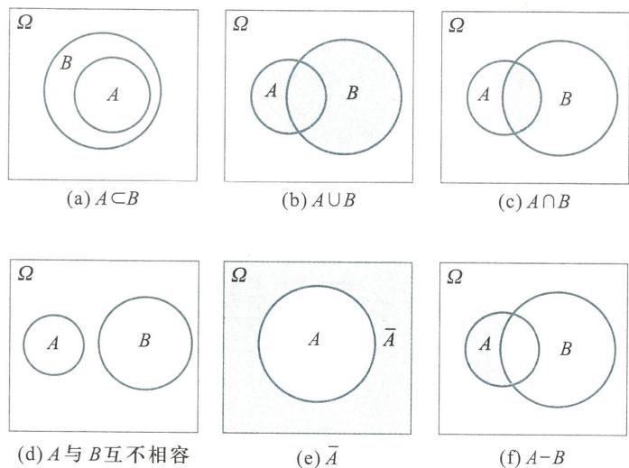  
图1.1

它们可以推广到有限个或可列无穷个事件的情形,如

$$
\bigcup_{k = 1}^{n}A_{k} = \bigcap_{k = 1}^{n}\overline{A}_{k},\quad \bigcup_{k = 1}^{\infty}A_{k} = \bigcap_{k = 1}^{\infty}\overline{A}_{k},\quad \bigcap_{k = 1}^{n}A_{k} = \bigcup_{k = 1}^{n}\overline{A}_{k},\quad \bigcap_{k = 1}^{\infty}A_{k} = \bigcup_{k = 1}^{\infty}\overline{A}_{k}.
$$

例1.1.8 证明:  $A - B = A - AB$ ,  $(A\cup B) - B = A - B$

证

$$
A - B = A\overline{B} = A(\Omega -B) = A\Omega -AB = A - AB,
$$

$$
(A\cup B) - B = (A\cup B)\cap \overline{B} = A\overline{B}\cup B\overline{B} = (A - B)\cup \emptyset = A - B.
$$

例1.1.9 某射手向一目标射击3次,令

则

$$
B_{0} = \overline{A}_{1}\overline{A}_{2}\overline{A}_{3} = \overline{A_{1}\cup A_{2}\cup A_{3}},B_{1} = A_{1}\overline{A}_{2}\overline{A}_{3}\cup \overline{A_{1}A_{2}}\overline{A_{3}}\cup \overline{A_{1}}\overline{A_{2}A_{3}},
$$

$$
B_{2} = A_{1}A_{2}\overline{A}_{3}\cup A_{1}\overline{A}_{2}A_{3}\cup \overline{A}_{1}A_{2}A_{3},\quad B_{3} = A_{1}A_{2}A_{3}.
$$

若  $C_{j} = \left\{ \begin{array}{ll} \end{array} \right.$  在3次射击中,至少命中  $j$  次  $\} ,j = 1,2,3$  ,则有

$$
C_{1} = A_{1}\cup A_{2}\cup A_{3},\quad C_{2} = A_{1}A_{2}\cup A_{2}A_{3}\cup A_{1}A_{3},\quad C_{3} = B_{3} = A_{1}A_{2}A_{3}.
$$

例1.1.10 某电子系统由  $n$  个元件  $e_{1},e_{2},\dots ,e_{n}$  组成,令

则在并联系统(如图1.2(a)所示)中,系统工作正常的事件为

$S = \left\{ \begin{array}{ll} \end{array} \right.$  元件  $e_{1},e_{2},\dots ,e_{n}$  中至少有一个正常工作  $\} = \bigcup_{k = 1}^{n}A_{k}$

$\overline{S} = \left\{ \begin{array}{ll} \end{array} \right.$  系统工作失效  $\} = \{e_{1},e_{2},\dots ,e_{n}$  全部工作失效  $\} = \bigcap_{k = 1}^{n}\overline{A}_{k}$

在串联系统(如图1.2(b)所示)中,系统工作正常的事件为

$$
S = \{e_{1},e_{2},\dots ,e_{n} \} = \bigcap_{k = 1}^{n} A_{k},
$$

整个系统工作失效的事件是

$\overline{S} = \{e_{1},e_{2},\dots ,e_{n} \} = \bigcup_{k = 1}^{n} \overline{A}_{k}.$

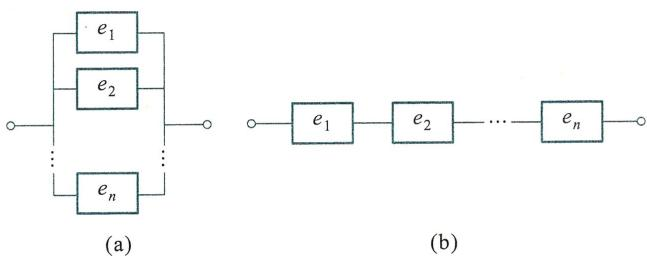  
图1.2

# §1.2 概率

# 一、概率

概率是什么?人们对于概率这个数学术语不一定清楚,却往往有意无意地使用它.对问题"明天是否会下雨?",有人会说:"我有  $80\%$  把握断定明天不会下雨."每个购买福利彩票的人都关心投入一定的资金,获得头等奖的可能性有多大.这些问题实际上都涉及随机事件的概率.

随机试验中的随机事件,有可能发生,也有可能不发生,人们不能事前预知,但它们发生的可能性大小却是客观存在的,不以人们的主观意识为转移.例如,掷一颗骰子,出现偶数点的可能性大于恰出现6点的可能性;购买福利彩票获得头等奖的可能性远远小于获得尾奖的可能性.随机事件发生的可能性大小是一个客观存在的量.概率是对随机事件发生可能性大小的一个客观度量.事件  $A$  的概率记为  $P(A)$

在概率论的发展过程中,人们针对不同的问题,从不同的角度给出了定义概率和计算概率的各种方法.

# 二、频率

人们容易接受这种说法:若一个事件发生的可能性大(小),则在相同条件下重复进行若干次试验,该事件发生的次数就多(少),因而,下面引进的数量指标能在一定程度上反映事件发生的可能性大小.

定义1.2.1 设在相同条件下,进行  $n$  次试验,事件  $A$  发生了  $m$  次,称比值

$$
f_{n}(A) = \frac{m}{n} \tag{1.2.1}
$$

为事件  $A$  发生的频率.

回顾 §1.1 节的表1.1.1,表中列出了各个试验者对于"抛掷硬币出现正面"这一事

件所算得的频率值. 从表中可观察到不同试验者所得的频率是不同的, 甚至同一试验者所做不同序号的试验, 所得的频率也是相异的. 一个事件发生的可能性大小是确定的, 因此频率虽然能在一定程度反映事件发生的可能性大小, 却不是客观量度, 就是说频率不是概率. 另一方面, 从表中我们也可以观察出, 随着抛掷次数的增多, "出现正面"这一事件的频率在  $\frac{1}{2}$  附近摆动, 渐趋稳定.

例1.2.1 检查一大批同型号的产品, 其结果如表1.2.1所示.

表1.2.1一大批同型号产品的抽检情况  

<table><tr><td>抽取数n</td><td>5</td><td>10</td><td>50</td><td>150</td><td>200</td><td>1 800</td><td>3 600</td></tr><tr><td>合格数m</td><td>5</td><td>8</td><td>46</td><td>132</td><td>179</td><td>1 630</td><td>3 241</td></tr><tr><td>频率m/n</td><td>1</td><td>0.8</td><td>0.92</td><td>0.88</td><td>0.895</td><td>0.906</td><td>0.900 3</td></tr></table>

从表中数据可见, 虽然抽到合格品的件数是随机的, 但随着抽取件数的增多, "抽得合格品"的频率值逐渐稳定于0.9.

一般来讲, 在相同的条件下重复进行试验, 随着试验次数增多, 事件的频率总在某一常数的附近摆动, 并且出现较大偏差的可能性很小, 我们称频率的这一性质为频率的稳定性. 第5章的大数定律将揭示频率稳定性的确切含义, 并且可知事件  $A$  的频率就稳定于事件  $A$  的概率  $P(A)$ , 因而在工程实用中, 常进行较多次数的重复试验, 算得的频率作为概率的近似值.

# 三、古典概率

定义1.2.2 设  $E$  是一个随机试验, 若它满足以下两个条件:

(1) 仅有有限个基本事件;

(2) 每个基本事件发生的可能性相等,

则称  $E$  为古典概型试验.

古典概型试验的样本空间仅有有限个样本点.

抛一枚均匀硬币试验  $E_{1}$  是古典概型试验. 例1.1.3中的抽取数字试验也是古典概型试验. 而例1.1.2中抽取100只晶体管进行检查, 观察其中的不合格品数, 此试验则不是古典概型试验, 因为它虽仅有有限基本事件, 但每个基本事件出现的可能性不均等.

定义1.2.3 设试验  $E$  为古典概型试验,  $A_{i}(i = 1,2,\dots ,n)$  是全体基本事件, 则由

$$
P(A) = \frac{A\text{所含基本事件个数}}{\text{基本事件总数}} \tag{1.2.2}
$$

所确定的概率称为事件  $A$  的古典概率.

例1.2.2 将两颗均匀骰子掷一次, 设

$A = \{$  两颗骰子的点数之和不小于6  $\}$  ,  $B = \{$  两颗骰子的点数相同  $\}$

求各事件  $A,\overline{A},A\cup B,A\cap B$  的概率.

解此试验的样本空间  $\Omega$  由36个样本点组成,用  $(i,j)$  代表第一颗骰子的点数为 $i$  ,同时第二颗骰子的点数为  $j$  ,则

$$
\Omega = \left( \begin{array}{l l l l l l l}{(1,1)} & {(1,2)} & {(1,3)} & {(1,4)} & {(1,5)} & {(1,6)}\\ {(2,1)} & {(2,2)} & {(2,3)} & {(2,4)} & {(2,5)} & {(2,6)}\\ {(3,1)} & {(3,2)} & {(3,3)} & {(3,4)} & {(3,5)} & {(3,6)}\\ {(4,1)} & {(4,2)} & {(4,3)} & {(4,4)} & {(4,5)} & {(4,6)}\\ {(5,1)} & {(5,2)} & {(5,3)} & {(5,4)} & {(5,5)} & {(5,6)}\\ {(6,1)} & {(6,2)} & {(6,3)} & {(6,4)} & {(6,5)} & {(6,6)} \end{array} \right),
$$

即试验有36个基本事件,且各基本事件出现的可能性是均等的,经计算各事件所含基本事件数,可得

$$
P(A) = \frac{26}{36},\quad P(\overline{{A}}) = \frac{10}{36},\quad P(B) = \frac{6}{36},
$$

$$
P(A\cup B) = \frac{28}{36},\quad P(A\cap B) = \frac{4}{36}.
$$

例1.2.3某城市的电话号码是8位数码,并且每一个8位数码都对应于一部电话机.如果从电话号码簿中随意指定一个电话号码,求:

(1)号码的头两位是"55"的概率;

(2)头两位号码都不超过5的概率;

(3)八位号码全不相同的概率.

解设基本事件为

$A_{k} = \left\{ \begin{array}{l l} \end{array} \right.$  指定电话簿中第  $k$  个电话号码},  $k = 1,2,\dots ,n$

其中  $n = 10^{8}$  为不同的电话号码的总数.并假定各个电话号码被指定的可能性相等,这是一个古典概型试验.

(1)由于已指定头两位为"55",而"0,1,2,,9"十个数码可任意填写在后面6个位置,故

$$
P(B_{1}) = \frac{10^{6}}{10^{8}} = 0.01.
$$

(2)头两位不超过"5"表明只能用"0,1,2,3,4,5"填写在头两个位置上,有  $6^{2}$  种不同的方式,后6个位置仍可从十个数码中任意选择,故

$$
P(B_{2}) = \frac{6^{2}\times10^{6}}{10^{8}} = 0.36.
$$

(3)八位数码全不相同相当于不允许重复的不完全排列,有

$$
P(B_{3}) = \frac{\mathrm{P}_{10}^{8}}{10^{8}} = \frac{1 814 400}{10^{8}} = 0.018.
$$

例1.2.4设有  $n$  个人,每个人都等可能地被分配到  $N$  个房间中的任意一间去住 $(n\leqslant N)$  ,求下列事件的概率:

(1)指定的  $n$  个房间各有一个人住;

(2)恰好有  $n$  个房间,每间各住一人.

解设  $A = \left\{ \begin{array}{l l} \end{array} \right.$  指定的  $n$  间房各住一人},  $B = \left\{ \begin{array}{l l} \end{array} \right.$  恰有  $n$  个房间,每间各住一人},显然

基本事件的总数为  $N^{n}$ , 指定的房间各住一个人, 有  $n!$  种不同的住法, 故

$$
P(A) = \frac{n!}{N^n}.
$$

从房间中任意选出  $n$  间住人, 并且每间各住一人, 有  $\mathrm{C}_N^n \cdot n!$  种不同的方式, 故

$$
P(B) = \frac{\mathrm{C}_N^n \cdot n!}{N^n} = \frac{N!}{N^n(N - n)!}.
$$

例1.2.5 盒中装有10个同样的小球, 分别写上号码  $1,2, \dots , 10$ , 从盒中任取3个球, 试求3个球的第二大的号码恰是4这一事件  $A$  的概率.

解 试验相当于从十个号码中任取3个, 即有  $\mathrm{C}_{10}^{3}$  个基本事件.

事件  $A$  发生, 即第二大的号码恰是4, 则最小的号码在"1,2,3"中取出, 有  $\mathrm{C}_3^1$  种不同的取法; 最大的号码在"5,6,7,8,9,10"中取出, 有  $\mathrm{C}_6^1$  种不同的取法, 故

$$
P(A) = \frac{\mathrm{C}_3^1 \mathrm{C}_1^1 \mathrm{C}_6^1}{\mathrm{C}_{10}^{3}} = \frac{3}{20}.
$$

在此例中, 实际上是将10个球分成三类, 再从每一类中各取一个. 此例的更一般的提法是: 袋中有  $n$  个球, 第一类有  $n_1$  个, 第2类有  $n_2$  个,  $\dots$ , 第  $M$  类有  $n_M$  个, 并且  $n_1 + n_2 + \dots + n_M = n$ , 从袋中取出  $d(d \leqslant n)$  个球, 求其中恰有  $d_i$  个第  $i$  类球  $(i = 1,2, \dots , M)$  的概率, 其中  $d_1 + d_2 + \dots + d_M = d, d_i \leqslant n_i$ .

用类似的解法, 求得概率为

$$
\frac{\mathrm{C}_{n_1}^{d_1} \mathrm{C}_{n_2}^{d_2} \cdots \mathrm{C}_{n_M}^{d_M}}{\mathrm{C}_n^{d}} \tag{1.2.3}
$$

此类概率计算问题是经典概率模型, 称为分类抽球模型.

性质1.2.1 古典概率满足:

(1) 对任意事件  $A, 0 \leqslant P(A) \leqslant 1$

(2)  $P(\Omega) = 1$

(3) 若  $A_1, A_2, \dots , A_m$  互不相容, 则

$$
P\Big(\bigcup_{i = 1}^{m}A_{i}\Big) = \sum_{i = 1}^{m}P\big(A_{i}\big).
$$

证 (1) 和 (2) 显然成立, 现在证明 (3).

设  $A_i$  含有  $k_i (k_i \leqslant n)$  个基本事件,  $i = 1,2, \dots , m$ , 基本事件总数为  $n$ , 则有

$$
P(A_i) = \frac{k_i}{n}, i = 1,2, \dots , m.
$$

由于  $A_i, i = 1,2, \dots , m$  互不相容, 故  $\bigcup_{i = 1}^{m} A_i$  含有  $\sum_{i = 1}^{m} k_i$  个不同的基本事件, 因此

$$
P\Big(\bigcup_{i = 1}^{m}A_{i}\Big) = \frac{1}{n}\sum_{i = 1}^{m}k_{i} = \sum_{i = 1}^{m}\frac{1}{n} k_{i} = \sum_{i = 1}^{m}P(A_{i}).
$$

# 四、概率的公理化定义与性质

古典概率仅对古典概型试验给出概率定义, 有着不可避免的理论上的缺陷和应用上的局限性. 这里采用数学抽象化的方法, 建立概率的公理化定义.

定义1.2.4设随机试验  $E$  的样本空间为  $\Omega$  ,若对于  $E$  的每一事件  $A$  都对应一个实数  $P(A)$  ,其对应规则满足以下三条:

1. (非负性)对任一事件  $A$  ,有  $0\leqslant P(A)\leqslant 1$

2. (规范性)  $P(\Omega) = 1$

3. (可列可加性)对  $E$  的互不相容事件列  $A_{1},A_{2},\dots$  ,有

$$
P\Big(\bigcup_{i = 1}^{\infty}A_{i}\Big) = \sum_{i = 1}^{\infty}P\big(A_{i}\big), \tag{1.2.4}
$$

则称  $P(A)$  是事件  $A$  的概率.

由概率的公理化定义,可以推得概率的部分重要性质,

性质1.2.2 概率具有以下性质:

1.  $P(\emptyset) = 0$

2. (有限可加性)若试验  $E$  的事件组  $A_{1},A_{2},\dots ,A_{m}$  互不相容,则有

$$
P\Big(\bigcup_{i = 1}^{m}A_{i}\Big) = \sum_{i = 1}^{m}P\big(A_{i}\big);
$$

3. 对任何事件  $A$  有  $P(A) + P(\overline{{A}}) = 1$

4. (单调性)若事件  $A$  和  $B$  满足  $A\subset B$  ,则  $P(A)\leqslant P(B)$  和  $P(B - A) = P(B) - P(A)$  成立.

证1. 因  $\emptyset = \emptyset \cup \emptyset \cup \dots$  ,由概率的可列可加性,有

$$
P(\emptyset) = P(\emptyset) + P(\emptyset) + \dots ,
$$

故  $P(\emptyset) = 0$

2. 在公式(1.2.4)中,令  $A_{m + 1} = A_{m + 2} = \dots = \emptyset$  ,注意到  $P(\emptyset) = 0$  ,得

$$
P\Big(\bigcup_{i = 1}^{m}A_{i}\Big) = P\Big(\bigcup_{i = 1}^{\infty}A_{i}\Big) = \sum_{i = 1}^{\infty}P\big(A_{i}\big) = \sum_{i = 1}^{m}P\big(A_{i}\big).
$$

3. 因  $A\cup \overline{{A}} = \Omega ,A\overline{{A}} = \emptyset$  ,由概率的有限可加性得

$$
1 = P(\Omega) = P(A\cup \overline{{A}}) = P(A) + P(\overline{{A}}).
$$

4. 如图1.3所示,有

$$
B = A\cup (B - A)\boxplus A\cap (B - A) = \emptyset ,
$$

根据概率的有限可加性

$$
P(B) = P(A) + P(B - A),
$$

即

$$
P(B - A) = P(B) - P(A),
$$

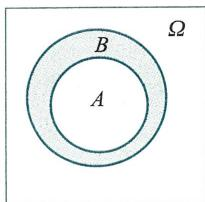  
图1.3

又因  $P(B - A)\geqslant 0$  ,故  $P(A)\leqslant P(B)$

例1.2.6 证明对试验  $E$  的两个事件  $A$  和  $B$  有

(1)  $P(A - B) = P(A) - P(AB)$

(2)  $P(A - B) = P(A\cup B) - P(B)$

证在例1.1.8中已证得

$$
A - B = A - A B,\quad A - B = (A\cup B) - B.
$$

注意到  $A B\subset A,B\subset A\cup B$  均成立,利用概率的单调性可得

$$
P(A - B) = P(A) - P(AB),\quad P(A - B) = P(A\cup B) - P(B).
$$

此例中的结论也可利用概率性质另行证明.

性质1.2.3(概率加法定理) 对试验  $E$  的任意两个事件  $A$  和  $B$ , 有

$$
P(A\cup B) = P(A) + P(B) - P(AB). \tag{1.2.5}
$$

证由图1.4可见,  $A\cup B = A\cup \left[B - (AB)\right],A$  与  $\left[B - (AB)\right]$  互不相容,并且  $AB\subset B$ , 故

$$
P(A\cup B) = P(A) + P\big[B - (AB)\big] = P(A) + P(B) - P(AB).
$$

用数学归纳法可将概率加法定理推广到任意有限个事件的情形:

$$
P(A_{1}\cup A_{2}\cup \dots \cup A_{n})
$$

$$
= \sum_{i = 1}^{n}P(A_{i}) - \sum_{1\leqslant i< j\leqslant n}P(A_{i}A_{j}) + \sum_{1\leqslant i< j< k\leqslant n}P(A_{i}A_{j}A_{k}) - \dots +
$$

$$
(-1)^{n - 1}P(A_{1}A_{2}\dots A_{n}).
$$

概率的公理化定义及性质, 为概率的计算提供了更完善的理论依据和极大的便利.

例1.2.7 古典概率定义是公理化定义的特例

设  $\Omega = \{\omega_{1},\omega_{2},\dots ,\omega_{n}\}$  是古典概型试验  $E$  的样本空间, 其基本事件组  $A_{i} = \{\omega_{i}\} ,i = 1,2,\dots ,n$  是互不相容的, 各个基本事件发生的可能性是均等的. 根据概率的有限可加性, 有

$$
1 = P(\Omega) = P\big(\bigcup_{i = 1}^{n}A_{i}\big) = \sum_{i = 1}^{n}P(A_{i}) = nP(A_{i}),
$$

故

$$
P(A_{i}) = \frac{1}{n},\quad i = 1,2,\dots ,n.
$$

若事件  $A$  包含  $k$  个基本事件, 则由概率的有限可加性, 有  $P(A) = \frac{k}{n}$

例1.2.8从  $1,2,\dots ,2000$  中任取一整数, 求取到的整数能被6或者8整除的概率.

解设  $A = \{$  取得的整数能被6整除  $\} ,B = \{$  取得的整数能被8整除  $\}$ , 则所求概率为

$$
P(A\cup B) = P(A) + P(B) - P(AB).
$$

因

$$
333< \frac{2000}{6}< 334,\quad \frac{2000}{8} = 250,
$$

故  $A$  与  $B$  所含基本事件数分别为333和250. 同时能被6和8整除的数, 也就是能被24整除的数, 由于

$$
83< \frac{2000}{24} < 84,
$$

因此得  $AB$  所含的基本事件数为83.

$$
P(A\cup B) = P(A) + P(B) - P(AB) = \frac{333}{2000} +\frac{250}{2000} -\frac{83}{2000} = \frac{1}{4}.
$$

例1.2.9 盒中装有50块固体组件, 其中有15块次品, 从中任取10块, 求:

(1)最多有两块次品的概率  $p_{1}$ ; 
(2)至少有一块次品的概率  $p_{2}$ .

解设  $A_{i} = \left\{ \begin{array}{ll} \end{array} \right.$  取出的10块固体组件中恰有  $i$  块次品  $\left\{ \begin{array}{l} \end{array} \right.$ $i = 0,1,2,\dots ,10$  ,这11个事件互不相容,故

$$
p_{1} = P\left(A_{0} \cup A_{1} \cup A_{2}\right) = P\left(A_{0}\right) + P\left(A_{1}\right) + P\left(A_{2}\right)
$$

$$
\begin{array}{r l} & {\mathrm{~\frac{C_{35}^{10}}{C_{50}^{10}} + \frac{C_{15}^{1}C_{35}^{9}}{C_{50}^{10}} + \frac{C_{15}^{2}C_{35}^{8}}{C_{50}^{10}}~}} \end{array}
$$

$$
= 0.0179 + 0.1031 + 0.2406 = 0.3616.
$$

$$
p_{2} = P\left(A_{1} \cup A_{2} \cup \dots \cup A_{10}\right) = P\left(\overline{A_{0}}\right) = 1 - P\left(A_{0}\right)
$$

$$
= 1 - \frac{\mathrm{C}_{35}^{10}}{\mathrm{C}_{50}^{10}} = 1 - 0.0179 = 0.9821.
$$

例1.2.10 有十张分别标有  $1,2, \dots , 10$  的卡片,从中任意取出两张,求两张卡片上的数之和等于10的概率.

解用  $X$  和  $Y$  分别表示抽取出的卡片上的两个数,两数之和为10的事件为

$$
\{X + Y = 10\} = \bigcup_{i = 1 \atop i \neq 5}^{9} \{X = i, Y = 10 - i\} .
$$

事件组

$$
\{X = i, Y = 10 - i\} = \{X = i \cap \{Y = 10 - i\} , i = 1, 2, \dots , 9, i \neq 5
$$

是互不相容的.故所求概率为

$$
P\left\{X + Y = 10\right\} = \sum_{\stackrel{i = 1}{i \neq 5}}^{9} P\left\{X = i, Y = 10 - i\right\} = \frac{8}{10 \times 9} = \frac{4}{45}.
$$

# §1.3 条件概率

# 一、条件概率

条件概率是一个重要的概念,它是在已知事件  $B$  发生的条件下,事件  $A$  发生可能性大小的客观度量,记为  $P(A \mid B)$ .由于诸事件之间往往有一定联系,因而事件  $B$  发生以后,事件  $A$  的概率可能会发生变化.

例1.3.1检验某种元件的两个指标  $I_{\alpha}$  和  $P_{M}$  ,两个指标必须均合格才认为元件合格.现有100件产品,其中合格品有30件,而  $I_{\alpha}$  指标合格的有50件.从  $I_{\alpha}$  指标合格品中任意取出一件,求它是合格品的概率.

解设  $A = \left\{ \begin{array}{l} \end{array} \right.$  抽出合格产品  $\left\{ \begin{array}{l} \end{array} \right.$  ,  $B = \left\{ \begin{array}{l} \end{array} \right.$  抽出的产品  $I_{\alpha}$  指标合格  $\}$  ,有

$$
P\left(A\right) = P\left(A B\right) = \frac{30}{100},
$$

所求概率为

$$
P(A\mid B) = \frac{30}{50} = \frac{\frac{30}{100}}{\frac{50}{100}} = \frac{P(AB)}{P(B)}.
$$

例1.3.2 两位工人加工同一种零件共100个，甲加工了40个，其中35个是合格品；乙加工了60个，其中有50个合格.设  $A = \left\{ \begin{array}{ll} \end{array} \right.$  从100个零件中任取一个是合格品  $\}$ $B = \left\{ \begin{array}{ll} \end{array} \right.$  从100个零件中任取一个，取到甲生产的  $\}$  ，求  $P(A),P(B),P(AB),P(A\mid B)$  和 $P(A\mid \overline{B})$

解

$$
P(A) = \frac{85}{100},P(B) = \frac{40}{100},P(AB) = \frac{35}{100},
$$

$$
P(A\mid B) = \frac{35}{40} = \frac{\frac{35}{100}}{\frac{40}{100}} = \frac{P(AB)}{P(B)},\quad P(A\mid \overline{B}) = \frac{50}{60} = \frac{\frac{50}{100}}{\frac{60}{100}} = \frac{P(AB)}{P(\overline{B})}.
$$

若不顾及上述两例的具体背景内容，则可引出条件概率的定义，

定义1.3.1设  $A,B$  是随机试验  $E$  的两个随机事件，且  $P(B) > 0$  ，称

$$
P(A\mid B) = \frac{P(AB)}{P(B)} \tag{1.3.1}
$$

为在事件  $B$  发生的条件下，事件  $A$  发生的条件概率

条件概率  $P(A\mid B)$  一般不等于概率  $P(A)$

性质1.3.1设随机事件  $E$  的样本空间是  $\Omega ,A,B,A_1,A_2,\dots$  都是  $E$  的事件，若 $P(B) > 0$  ，则

（1）对每一事件  $A$  ，有  $0\leqslant P(A\mid B)\leqslant 1$

(2)  $P(\Omega \mid B) = 1$

（3）若事件  $A_{1},A_{2},\dots$  互不相容，有  $P\Big(\bigcup_{i = 1}^{\infty}A_{i}\big|B\Big) = \sum_{i = 1}^{\infty}P(A_{i}\big|B).$

证 (1)与(2)请自证

(3）因  $A_{1},A_{2},\dots$  互不相容，事件列  $A_{1}B,A_{2}B,\dots$  也互不相容，由概率的可列可加性，有

$$
\begin{array}{r l} & {P\Big(\bigcup_{i = 1}^{\infty}A_{i}\big|B\Big) = \frac{P\Big[\Big(\bigcup_{i = 1}^{\infty}A_{i}\Big)\cap B\Big]}{P(B)} = \frac{P\Big[\bigcup_{i = 1}^{\infty}(A_{i}B)\Big]}{P(B)}}\\ & {\qquad = \frac{\sum_{i = 1}^{\infty}P(A_{i}B)}{P(B)} = \sum_{i = 1}^{\infty}\frac{P(A_{i}B)}{P(B)} = \sum_{i = 1}^{\infty}P(A_{i}\mid B).} \end{array}
$$

性质1.3.1说明条件概率满足概率定义中的三条公理，类似于  $\S 1.2$  ，可以证明关于概率的一系列性质同样适用于条件概率.

例1.3.3 证明：（1）  $P(A\mid B) + P(\overline{A}\mid B) = 1$

$$
P(A_{1}\cup A_{2}\mid B) = P(A_{1}\mid B) + P(A_{2}\mid B) - P(A_{1}A_{2}\mid B).
$$

$$
\begin{array}{c}{{P(A\mid B)+P(\overline{{{A}}}\mid B)=\frac{P(A B)}{P(B)}+\frac{P(\overline{{{A}}}B)}{P(B)}=\frac{P(A B\cup\overline{{{A}}}B)}{P(B)}}}\\ {{=\frac{P(\Omega B)}{P(B)}=\frac{P(B)}{P(B)}=1.}}\end{array}
$$

$$
\begin{array}{c}{{P(A_{1}\cup A_{2}\mid B)=\frac{P\big[\ (A_{1}\cup A_{2})\cap B\big]}{P(B)}=\frac{1}{P(B)}P\big[\ (A_{1}B)\cup(A_{2}B)\big]}}\\ {{=\frac{1}{P(B)}P\big[\ (A_{1}B)+(A_{2}B)-(A_{1}A_{2}B)\big]}}\\ {{=P(A_{1}\mid B)+P(A_{2}\mid B)-P(A_{1}A_{2}\mid B).}}\end{array}
$$

在例1.3.1中, 若求“从  $I_{\alpha}$  指标合格的产品中任取一个, 它是不合格品”的概率为

$$
P(\overline{{A}}\mid B) = 1 - P(A\mid B) = 1 - \frac{30}{50} = \frac{20}{50}.
$$

例1.3.4设袋中装有编号为  $1,2,\dots ,10$  的10个小球, 从中抽取两次, 一次一球(看后放回), 第一个球号记为  $X_{1}$ , 第二个球号记为  $X_{2}$ , 令

$$
A = \{X_{1} = 4\} ,\quad B = \{X_{1} + X_{2} = 7\} ,
$$

计算  $P(A\mid B)$  和  $P(B\mid A)$

解

$$
P(A\mid B) = \frac{P(AB)}{P(B)} = \frac{P\{X_{1} = 4, X_{1} + X_{2} = 7\}}{P\{X_{1} + X_{2} = 7\}}
$$

$$
\begin{array}{c}{{P\left\{X_{1}=4,X_{2}=3\right\}=\frac{1}{100}=\frac{1}{6},}}\\ {{P\left\{X_{1}+X_{2}=7\right\}=\frac{100}{100}=\frac{1}{6},}}\end{array}
$$

$$
P(B\mid A) = \frac{P(AB)}{P(A)} = \frac{P\{X_{1} = 4, X_{2} = 3\}}{P\{X_{1} = 4\}} = \frac{\frac{1}{100}}{\frac{10}{100}} = \frac{1}{10}.
$$

注意此例中有  $P(A\mid B)\neq P(A)$ , 并且  $P(A\mid B)\neq P(B\mid A)$

# 二、乘法公式

从条件概率的定义直接可得下面的定理

定理1.3.1(乘法公式)

设  $P(B) > 0$ , 则有

$$
P(AB) = P(B)P(A\mid B); \tag{1.3.2}
$$

若  $P(A) > 0$ , 则有

$$
P(AB) = P(A)P(B\mid A). \tag{1.3.3}
$$

上两式可用来计算两个事件乘积的概率. 概率乘法公式可以推广到任意有限个事件之积的情形, 即

设  $A_{1}, A_{2}, \dots , A_{n}$  是试验  $E$  的  $n$  个事件, 若  $P(A_{1}A_{2}\dots A_{n - 1}) > 0$ , 则

$$
P(A_{1}A_{2}\dots A_{n}) = P(A_{1})P(A_{2}\mid A_{1})P(A_{3}\mid A_{1}A_{2})\dots P(A_{n}\mid A_{1}A_{2}\dots A_{n - 1}). \tag{1.3.4}
$$

证因为  $A_{1}\supset A_{1}A_{2}\supset \dots \supset A_{1}A_{2}\dots A_{n - 1}$  ，所以由概率的单调性有

$$
P(A_{1}) > P(A_{1}A_{2}) > \dots >P(A_{1}A_{2}\dots A_{n - 1}) > 0,
$$

式（1.3.4)右端各个条件概率均有意义，由条件概率的定义，有

$$
\begin{array}{c}{{P(A_{1}A_{2}\cdots A_{n})=P(A_{1})\frac{P(A_{1}A_{2})}{P(A_{1})}\frac{P(A_{1}A_{2}A_{3})}{P(A_{1}A_{2})}\cdots\frac{P(A_{1}A_{2}\cdots A_{n})}{P(A_{1}A_{2}\cdots A_{n-1})}}}\\ {{=P(A_{1})P(A_{2}\mid A_{1})P(A_{3}\mid A_{1}A_{2})\cdots P(A_{n}\mid A_{1}A_{2}\cdots A_{n-1}).}}\end{array}
$$

例1.3.5从装有10个白球和20个红球的盒子中，第一次取出5个红球后，第二次又取出10个球，令  $A = \left\{ \begin{array}{ll} \end{array} \right.$  第一次取出5个红球  $\{,B = \}$  第二次取出5个红球和5个白球，则

$$
P(AB) = P(A)P(B\mid A) = \frac{\mathrm{C}_{20}^{5}}{\mathrm{C}_{30}^{5}}\cdot \frac{\mathrm{C}_{10}^{5}\mathrm{C}_{15}^{5}}{\mathrm{C}_{25}^{10}} = 0.0252.
$$

例1.3.6袋中有  $a$  个白球，  $b$  个黑球，任意取出一球，看后放回，并加入与抽取的球同色的  $c$  个球，如此进行了四次.问前两次出现黑球、后两次出现白球的概率是多少？

解设  $A_{j} = \left\{ \begin{array}{ll} \end{array} \right.$  第  $j$  次取到黑球  $\} ,j = 1,2,3,4$  ，所求概率为

$$
\begin{array}{c}{{P(A_{1}A_{2}\overline{{A}}_{3}\overline{{A}}_{4})=P(A_{1})P(A_{2}\mid A_{1})P(\overline{{A}}_{3}\mid A_{1}A_{2})P(\overline{{A}}_{4}\mid A_{1}A_{2}\overline{{A}}_{3})}}\\ {{=\frac{b}{a+b}\cdot\frac{b+c}{a+b+c}\cdot\frac{a}{a+b+2c}\cdot\frac{a+c}{a+b+3c}.}}\end{array}
$$

例1.3.7对一种产品进行三种损伤性试验，产品没通过第一种试验的概率为0.3，通过了第一种试验而未通过第二种试验的概率为0.2，通过了前两种试验而未通过第三种试验的概率为0.1，试求产品没通过这三种试验的概率.

解设  $A = \left\{ \begin{array}{ll} \end{array} \right.$  产品没通过这三种试验  $\} ,A_{i} = \left\{ \begin{array}{ll} \end{array} \right.$  产品没通过第  $i$  种试验  $\} ,i = 1,2,3$  ，则有  $A = A_{1}\cup A_{2}\cup A_{3}$  或  $\overline{A} = \overline{A}_{1}\overline{A}_{2}\overline{A}_{3}$

$$
P(A) = 1 - P(\overline{A}) = 1 - P(\overline{A}_{1}\overline{A}_{2}\overline{A}_{3}) = 1 - P(\overline{A}_{1})P(\overline{A}_{2}\mid \overline{A}_{1})P(\overline{A}_{3}\mid \overline{A}_{1}\overline{A}_{2}),
$$

依题意知

$$
P(A_{1}) = 0.3,P(A_{2}\mid \overline{A}_{1}) = 0.2,P(A_{3}\mid \overline{A}_{1}\overline{A}_{2}) = 0.1,
$$

从而

$$
P(A) = 1 - 0.7\times 0.8\times 0.9 = 0.496.
$$

另解  $A = A_{1}\cup \overline{A}_{1}A_{2}\cup \overline{A}_{1}\overline{A}_{2}A_{3}$  ，显然  $A_{1},\overline{A}_{1}A_{2},\overline{A}_{1}\overline{A}_{2}A_{3}$  互不相容，故

$$
\begin{array}{r l} & {P(A) = P(A_{1}) + P(\overline{{A}}_{1}A_{2}) + P(\overline{{A}}_{1}\overline{{A}}_{2}A_{3})}\\ & {\qquad = P(A_{1}) + P(\overline{{A}}_{1})P(A_{2}\mid \overline{{A}}_{1}) + P(\overline{{A}}_{1})P(\overline{{A}}_{2}\mid \overline{{A}}_{1})P(A_{3}\mid \overline{{A}}_{1}\overline{{A}}_{2})}\\ & {\qquad = 0.3 + 0.7\times 0.2 + 0.7\times 0.8\times 0.1 = 0.496.} \end{array}
$$

# 三、全概率公式

在概率的计算中，我们希望从已知简单事件的概率去求较复杂事件的概率，全概率公式是重要的公式.先看以下例子.

例1.3.8设甲盒中装有编号  $1,2,\dots ,15$  的15张红色卡片，乙盒中装有编号1，

2,  $\dots$ , 10 的 10 张白色卡片. 现任意挑选一盒, 并从中任取一张卡片, 求卡片号码是偶数的概率.

解 观察抽出的卡片, 有两类结果, 一类是"抽到红色卡片", 另一类是"抽到白色卡片", 令

$A = \left\{ \begin{array}{l l} \end{array} \right.$  抽到偶数号码卡片  $\left\{ \begin{array}{l l} \end{array} \right.$ $B_{1} = \left\{ \begin{array}{l l} \end{array} \right.$  抽到红色卡片  $\left\{ \begin{array}{l l} \end{array} \right.$ $B_{2} = \left\{ \begin{array}{l l} \end{array} \right.$  抽到白色卡片  $\left\{ \begin{array}{l l} \end{array} \right.$  显然有  $B_{1}\cup B_{2} = \Omega ,B_{1}\cap B_{2} = \emptyset$  ,事件  $A$  可"分解"为

$A = \left\{ \begin{array}{l l} \end{array} \right.$  抽到红色偶数卡片  $\left\{ \begin{array}{l l} \end{array} \right.$ $\left\{ \begin{array}{l l} \end{array} \right.$  抽到白色偶数卡片  $\left\{ \begin{array}{l l} \end{array} \right.$ $= A B_{1}\cup A B_{2}$  利用概率的有限可加性和乘法公式, 有

$$
P(A) = P(AB_{1}) + P(AB_{2}) = P(B_{1})P(A\mid B_{1}) + P(B_{2})P(A\mid B_{2})
$$

$$
= \frac{1}{2}\cdot \frac{7}{15} +\frac{1}{2}\cdot \frac{5}{10} = \frac{29}{60}.
$$

此例中, 求  $P(A)$  的关键一步是将事件  $A$  "分解"成互不相容的两个事件.

对于每一个随机试验  $E$ , 都可设法将其样本空间"分解"成若干"部分", 即对全体基本事件进行"分类", 进而"分解"任何一个复合事件. 下面给出这种"分解"的确切定义.

定义1.3.2 设  $\Omega$  为随机试验  $E$  的样本空间,  $B_{1},B_{2},\dots ,B_{n}$  为  $E$  的一组事件, 若

(1)  $B_{i}\cap B_{j} = \emptyset ,i\neq j$

(2)  $B_{1}\cup B_{2}\cup \dots \cup B_{n} = \Omega ,$

则称  $B_{1},B_{2},\dots ,B_{n}$  为  $\Omega$  的一个有限划分.

例1.3.8的事件组  $B_{1}$  和  $B_{2}$  构成了样本空间的划分.

样本空间  $\Omega$  的划分不唯一, 但当划分确定后, 做一次试验  $E$ , 事件  $B_{1},B_{2},\dots ,B_{n}$  中必有一个且仅有一个发生.

定理1.3.2(全概率公式)设随机试验  $E$  的样本空间为  $\Omega ,A\subset \Omega ,B_{1},B_{2},\dots ,B_{n}$  为  $\Omega$  的一个有限划分, 且  $P(B_{i}) > 0,i = 1,2,\dots ,n$ , 则有

$$
P(A) = \sum_{i = 1}^{n}P(B_{i})P(A\mid B_{i}). \tag{1.3.5}
$$

分析式(1.3.5)可见, 实际上是借助于样本空间的一个划分:  $B_{1},B_{2},\dots ,B_{n}$  将事件  $A$  分解成互不相容的部分  $AB_{1},AB_{2},\dots ,AB_{n}$ , 进而将"全"概率  $P(A)$  分成若干部分, 分别进行计算再求和, 这就是将式(1.3.5)称为"全概率公式"的缘由. 它的理论和实际意义在于: 在较复杂的情况下直接计算  $P(A)$  不容易, 但适当地构造划分  $B_{i},i = 1,2,\dots ,n$  可以简化计算.

例1.3.9 某系统中I类元件占  $10\%$ , II类元件占  $40\%$ , III类元件占  $50\%$ .  $t$  小时以后各类元件的损坏率分别为  $30\%$ ,  $25\%$ ,  $10\%$ , 试求  $t$  小时以后, 任意抽取该系统的一个元件, 发现它已损坏的概率.

解设  $A = \left\{ \begin{array}{l l} \end{array} \right.$  抽出的元件已损坏  $\left\{ \begin{array}{l l} \end{array} \right.$ $B_{1} = \left\{ \begin{array}{l l} \end{array} \right.$  所抽元件是I类元件  $\left\{ \begin{array}{l l} \end{array} \right.$ $B_{2} = \left\{ \begin{array}{l l} \end{array} \right.$  所抽元件是Ⅱ类元件  $\left\{ \begin{array}{l l} \end{array} \right.$ $B_{3} = \left\{ \begin{array}{l l} \end{array} \right.$  所抽元件是Ⅲ类元件  $\left\{ \begin{array}{l l} \end{array} \right.$ $B_{1},B_{2},B_{3}$  构成样本空间的划分, 且  $P(B_{i}) > 0$ $i = 1,2,3$ , 由全概率公式

$$
P(A) = P(B_{1})P(A\mid B_{1}) + P(B_{2})P(A\mid B_{2}) + P(B_{3})P(A\mid B_{3})
$$

$$
= 0.1\times 0.3 + 0.4\times 0.25 + 0.5\times 0.1 = 0.18.
$$

例1.3.10 某通信系统的发端以0.7和0.3的概率发出信号"0"和"1",由于信道有干扰,当发出信号"0"时,接收端以概率0.8和0.2收到信号"0"和"1",当发出信号"1"时,接收端以概率0.9和0.1收到信号"1"和"0",计算接收到信号"0"的概率.

解令  $A_{0} = \left\{ \begin{array}{ll} \end{array} \right.$  发端发出信号"0",  $A_{1} = \left\{ \begin{array}{ll} \end{array} \right.$  发端发出信号"1",  $B = \left\{ \begin{array}{ll} \end{array} \right.$  接收到信号"0",  $A_{0},A_{1}$  构成样本空间的一个划分,由全概率公式

$$
P(B) = P(A_{0})P(B\mid A_{0}) + P(A_{1})P(B\mid A_{1})
$$

$$
= 0.7\times 0.8 + 0.3\times 0.1 = 0.59.
$$

例1.3.11 10个人依次抽签,10张签中有5张幸运签可得到球票,另5张是空签.试求第1人,第2人以及第10人抽到幸运签的概率.

解令  $A_{i} = \left\{ \begin{array}{ll} \end{array} \right.$  第  $i$  人抽到幸运签  $\Big\}$ $i = 1,2,\dots ,10$  ,则

$$
P(A_{1}) = \frac{5}{10} = \frac{1}{2},
$$

由全概率公式

$$
\begin{array}{l}P(A_{2}) = P(A_{1})P(A_{2}\mid A_{1}) + P(\overline{{A}}_{1})P(A_{2}\mid \overline{{A}}_{1})\\ = \frac{1}{2}\cdot \frac{4}{9} +\frac{1}{2}\cdot \frac{5}{9} = \frac{1}{2}, \end{array}
$$

再考虑事件  $B = \left\{ \begin{array}{ll} \end{array} \right.$  前9人已抽完5张幸运签  $\Big\}$  ,则

$$
\begin{array}{l}P(A_{10}) = P(B)P(A_{10}\mid B) + P(\overline{{B}})P(A_{10}\mid \overline{{B}})\\ = \frac{\mathrm{C}_{5}^{5}\cdot\mathrm{C}_{5}^{4}}{\mathrm{C}_{10}^{5}}\cdot 0 + \frac{\mathrm{C}_{5}^{4}\cdot\mathrm{C}_{5}^{5}}{\mathrm{C}_{10}^{4}}\cdot 1 = \frac{1}{2}. \end{array}
$$

类似地,利用全概率公式可得

$$
P(A_{1}) = P(A_{2}) = P(A_{3}) = \dots = P(A_{10}) = \frac{1}{2},
$$

即抽签的结果与抽签次序无关,这称为抽签的"公平性"

# 四、贝叶斯公式

借助于样本空间的一个适当划分,可利用全概率公式计算某个事件  $A$  的概率,但我们常常遇到另一类问题.

在例1.3.9中,若  $t$  小时以后系统确有一个元件发生损坏,问查坏元件应从哪一类开始?已知元件发生损坏,即事件  $A$  已发生,此元件是I,Ⅱ,Ⅲ类的条件概率分别为

$$
P(B_{1}\mid A),P(B_{2}\mid A),P(B_{3}\mid A),
$$

比较这三个概率的大小,自然应从其中最大者所对应的一类查找起

在例1.3.10中,收到信号"0",人们会追问发端确实发出信号"0"的概率有多大?

利用乘法公式和全概率公式可得以下定理:

定理1.3.3(贝叶斯公式)设随机试验  $E$  的样本空间为  $\Omega ,A\subset \Omega ,B_{i}(i = 1,2,\dots ,n)$  是  $\Omega$  的一个有限划分,而且  $P(A) > 0,P(B_{i}) > 0$  ,则有

$$
P(B_{i}\mid A) = \frac{P(B_{i})P(A\mid B_{i})}{\sum_{j = 1}^{n}P(B_{j})P(A\mid B_{j})}. \tag{1.3.6}
$$

证 由条件概率定义和乘法公式

$$
P(B_{i}\mid A) = \frac{P(A B_{i})}{P(A)} = \frac{P(B_{i})P(A\mid B_{i})}{P(A)}.
$$

本定理的条件满足全概率公式的条件,故

$$
P(B_{i}\mid A) = \frac{P(B_{i})P(A\mid B_{i})}{\sum_{j = 1}^{n}P(B_{j})P(A\mid B_{j})}
$$

贝叶斯公式是概率论中的一个著名公式,从形式推导来看,它是将乘法公式和全概率公式用于条件概率的计算中,它的重要性在于它的实际意义.如果将事件  $A$  看成"结果",把事件  $B_{1},B_{2},\dots ,B_{n}$  看成导致该结果的"原因".现在"结果"发生了,是"原因"  $B_{i}$  导致该结果发生的概率即为  $P(B_{i}\mid A)$  ,贝叶斯公式告诉我们,此概率与"原因" $B_{i}$  发生的可能性大小  $P(B_{i})$  有关.

现有一个"结果"  $A$  发生了,在众多可能"原因"中,究竟是哪一个导致了这一结果?这是一个在日常生活和科学技术开发中常常遇到的问题.例如在例1.3.9中,已经算出  $P(A) = 0.18$  ,由贝叶斯公式可得

$$
P(B_{1}\mid A) = \frac{P(B_{1})P(A\mid B_{1})}{P(A)} = \frac{0.1\times 0.3}{0.18}\approx 0.17,
$$

$$
P(B_{2}\mid A) = \frac{P(B_{2})P(A\mid B_{2})}{P(A)} = \frac{0.4\times 0.25}{0.18}\approx 0.56,
$$

$$
P(B_{3}\mid A) = \frac{P(B_{3})P(A\mid B_{3})}{P(A)} = \frac{0.5\times 0.1}{0.18}\approx 0.28.
$$

若系统运转  $t$  小时以后有一个元件发生损坏,则应从第Ⅱ类元件开始查找系统故障,这是因为第Ⅱ类元件损坏造成系统故障的可能性最大.

例1.3.12学生中优等生占  $25\%$  ,中等生占  $50\%$  ,较差生占  $25\%$  ,已知优等生通过一项测验的概率为0.8,中等生通过这项测验的概率为0.6,而较差生通过测验的概率为0.3. 现从学生中随机挑选一名进行测验,他通过了测验,求他是优等生的概率和他是较差生的概率.

解设  $A = \left\{ \begin{array}{l l}{\begin{array}{r l r}\end{array}}\end{array}\right.$  选出的学生通过了测验  $\left\{ \begin{array}{l l}{,H_{1} = \left\{ \begin{array}{l l}{\begin{array}{r l r}\end{array}}\end{array}\right.} \end{array}$  选出一名优等生  $\left\{ \begin{array}{l l}{,H_{2} = \left\{ \begin{array}{l l}{\begin{array}{r l r}\end{array}}\end{array}\right.} \end{array}\right.$  选出一名中等生  $\left\{ \begin{array}{l l}{,H_{3} = \left\{ \begin{array}{l l}{\begin{array}{r l r}\end{array}}\end{array}\right.} \end{array}\right.$  选出一名较差生  $\left\{ \begin{array}{l l}{,H_{1},H_{2},H_{3}} \end{array} \right.$  构成样本空间的一个有限划分,由贝叶斯公式

$$
\begin{array}{l}{{P\left(H_{1}\mid A\right)=\frac{P\left(A\mid H_{1}\right)P\left(H_{1}\right)}{\sum_{i=1}^{3}P\left(H_{i}\right)P\left(A\mid H_{i}\right)}}}\\ {{=\frac{0.8\times0.25}{0.8\times0.25+0.6\times0.5+0.3\times0.25}}\approx 0.35,}\end{array}
$$

$$
P(H_{3}\mid A) = \frac{P(A\mid H_{3})P(H_{3})}{P(A)} = \frac{0.3\times 0.25}{0.575}\approx 0.13.
$$

例1.3.13设某种病菌在人口中的带菌率为0.03,进行检查时,由于技术和操作的不完善等种种原因,使带菌者未必呈阳性反应,而不带菌者也可能呈阳性反应.假定

带菌者检查结果呈阳性反应的概率为 0.99, 不带菌者检查结果呈阳性反应的概率为 0.05. 现设某人检查结果呈阳性, 问他确是带菌者的概率是多少?

解设  $A = \left\{ \begin{array}{ll} \end{array} \right.$  检查结果呈阳性  $\Big\}$ $B = \left\{ \begin{array}{ll} \end{array} \right.$  此人是带菌者  $\Big\}$  ，由已知条件有

$$
P(A\mid B) = 0.99,\quad P(A\mid \overline{B}) = 0.05,
$$

且  $P(B) = 0.03$  ，所求概率为  $P(B\mid A)$  ，根据贝叶斯公式

$$
\begin{array}{c}P(B\mid A) = \frac{P(B)P(A\mid B)}{P(B)P(A\mid B) + P(\overline{B})P(A\mid\overline{B})}\\ = \frac{0.03\times 0.99}{0.03\times 0.99 + 0.97\times 0.05}\approx 0.380. \end{array}
$$

# $\S 1.4$  事件的独立性

# 一、两个事件的独立性

一般情况下，  $P(A\mid B)$  与  $P(A)$  不相等，这反映了这两个事件之间存在一定的关联，譬如在例1.3.1中，

$$
P(A) = \frac{30}{100},\quad P(A\mid B) = \frac{30}{50} >P(A),
$$

即事件  $B$  的发生使  $A$  发生的可能性增大了.若有

$$
P(A\mid B) = P(A) \tag{1.4.1}
$$

成立，即事件  $A$  发生的可能性完全不受事件  $B$  的影响，换言之，一个事件发生与否不影响另一个事件发生的概率，我们就说事件  $A$  与事件  $B$  是相互独立的.将式（1.4.1）代入概率乘法公式有

$$
P(AB) = P(A\mid B)P(B) = P(A)P(B).
$$

定义1.4.1 设  $A,B$  是随机试验  $E$  的事件，若满足

$$
P(AB) = P(A)P(B), \tag{1.4.2}
$$

则称事件  $A$  与  $B$  相互独立.

将例1.3.5中的试验改为第一次取5个球，若取后放回，第二次取10个球，对原例中的事件  $A$  和  $B$  ,有

$$
P(AB) = P(A)P(B\mid A) = \frac{\mathrm{C}_{20}^{5}}{\mathrm{C}_{30}^{5}}\cdot \frac{\mathrm{C}_{10}^{5}\mathrm{C}_{20}^{5}}{\mathrm{C}_{30}^{10}} = P(A)P(B),
$$

故  $A$  与  $B$  是相互独立的

实际上，第二次抽取前，盒中的红色球和白色球已恢复原状，因此第二次抽取不受第一次抽取的影响，可直接判断  $A$  与  $B$  是相互独立的.一般而言，我们往往是依据式（1.4.1）从实际角度去分析判断事件的独立性，然后利用式（1.4.2）进行概率计算.例如，两名工人分别在两台机床上进行生产，彼此各不相关，则他们各自是否生产出废品或多少件废品这类事件应是相互独立的.

定理1.4.1 若事件  $A$  与  $B$  相互独立，则下列三对事件：

也分别相互独立.

证因

$$
P(A B) = P(A)P(B)~,
$$

且

$$
P(A\overline{{B}}) = P(A - B) = P(A - A B) = P(A) - P(A B)~,
$$

故

$$
\begin{array}{c}{{P(A B)=P(A)-P(A)P(B)=P(A)\left[1-P(B)\right]}}\\ {{{}}}\\ {{=P(A)P(\overline{{B}}).}}\end{array}
$$

由定义1.4.1知  $A$  与  $\overline{B}$  相互独立,同理可证得  $\overline{A}$  与  $B,\overline{A}$  与  $\overline{B}$  也分别相互独立.

例1.4.1甲乙两名工人在两台机床上独立加工零件,他们的废品率分别是0.05和0.04,现从他们生产的产品中各取一件,试求:

(1)两件产品均是废品的概率  $p_{1}$

(2)至少有一件产品是废品的概率  $p_{2}$

(3)恰有一件产品是废品的概率  $p_{3}$

解令  $A = \left\{ \begin{array}{l l}{\begin{array}{r l r}\end{array}}\end{array}\right.$  抽出的甲工人的产品是废品  $\Big\}$ $B = \left\{ \begin{array}{l l}{\begin{array}{r l r}\end{array}}\end{array}\right.$  抽出的乙工人的产品是废品  $\Big\}$  ,如前分析,  $A$  与  $B$  是相互独立的,从而  $A$  与  $\overline{{B}},\overline{{A}}$  与  $B$  及  $\overline{{A}}$  与  $\overline{{B}}$  也分别相互独立,但  $A$  与 $B$  并不是互不相容的.

$$
p_{1} = P(A B) = P(A)P(B) = 0.05\times 0.04 = 0.002,
$$

$$
p_{2} = P(A\cup B) = 1 - P(\overline{{A}}\overline{{B}}) = 1 - P(\overline{{A}})P(\overline{{B}}) = 1 - 0.95\times 0.96 = 0.088,
$$

$$
p_{3} = P(A\overline{{B}}\cup \overline{{A}} B) = P(A\overline{{B}}) + P(\overline{{A}} B) = P(A)P(\overline{{B}}) + P(\overline{{A}})P(B)
$$

$$
= 0.05\times 0.96 + 0.95\times 0.04 = 0.086.
$$

# 二、  $n$  个事件的独立性

在定义  $n$  个事件的独立性之前,我们先讨论一个例子.

例1.4.2设同时掷两个均匀的正四面体一次,每一四面体的四面分别标有1,2,3,4,令

$A = \left\{ \begin{array}{l l}{\begin{array}{r l r}\end{array}}\end{array}\right.$  第一个四面体向下一面出现偶数  $\Big\}$

$B = \left\{ \begin{array}{l l}{\begin{array}{r l r}\end{array}}\end{array}\right.$  第二个四面体向下一面出现奇数  $\Big\}$

$C = \left\{ \begin{array}{l l}{\begin{array}{r l r}\end{array}}\end{array}\right.$  两个正四面体向下一面同时出现奇数,或者同时出现偶数  $\Big\}$

试验的样本空间为

$$
\left\{ \begin{array}{l l l l l}{(1,1)} & {(1,2)} & {(1,3)} & {(1,4)}\\ {(2,1)} & {(2,2)} & {(2,3)} & {(2,4)}\\ {(3,1)} & {(3,2)} & {(3,3)} & {(3,4)}\\ {(4,1)} & {(4,2)} & {(4,3)} & {(4,4)} \end{array} \right\} ;
$$

由古典概率定义,可得下述概率:

$$
P(A) = P(B) = P(C) = \frac{8}{16} = \frac{1}{2},
$$

$$
P(AB) = P(AC) = P(BC) = \frac{1}{4},
$$

$$
P(ABC) = P(\varnothing) = 0.
$$

可验证下列关系成立

$$
\left\{ \begin{array}{l}P(AB) = P(A)P(B), \\ P(AC) = P(A)P(C), \\ P(BC) = P(B)P(C), \end{array} \right. \tag{1.4.3}
$$

因此  $A, B, C$  中任意两个都是相互独立的, 即对  $A, B, C$  中任意两个, 譬如  $A$  与  $B$ , 一个事件发生的可能性大小不受另一事件影响. 我们进一步问,  $A$  事件发生的可能性大小是否不受  $B$  和  $C$  的“联合”影响呢? 即是否有  $P(A \mid BC) = P(A)$  成立? 在该例中

$$
P(A \mid BC) = 0 \neq \frac{1}{2} = P(A),
$$

对于试验  $E$  的三个事件  $A, B, C$ , 若式 (1.4.3) 和  $P(A \mid BC) = P(A)$  同时成立, 则有

$$
P(ABC) = P(A \mid BC)P(BC) = P(A)P(B)P(C).
$$

定义1.4.2 对于试验  $E$  的三个事件  $A, B, C$ , 若下面四个等式同时成立

$$
\left\{ \begin{array}{l}P(AB) = P(A)P(B), \\ P(AC) = P(A)P(C), \\ P(BC) = P(B)P(C), \\ P(ABC) = P(A)P(B)P(C), \end{array} \right. \tag{1.4.4}
$$

则称  $A, B, C$  所组成的事件组相互独立. 若仅有前三个等式同时成立, 则称此事件组是两两独立的.

由定义1.4.2知  $A, B, C$  相互独立, 则可推出它们两两独立; 反之, 由例1.4.2知仅有  $A, B, C$  两两独立不能得到它们相互独立的结论.

例1.4.3 设事件组  $A, B, C$  相互独立, 证明

(1)  $A$  与  $BC$  相互独立; 
(2)  $A$  与  $B \cup C$  相互独立; 
(3)  $A$  与  $B - C$  相互独立.

证 (1)  $P(ABC) = P(A)P(B)P(C) = P(A)P(BC)$ .

$$
\begin{array}{rl} & P(A\cap (B\cup C)) = P(AB\cup AC) = P(AB) + P(AC) - P(ABC) \\ & \qquad = P(A)P(B) + P(A)P(C) - P(A)P(B)P(C) \\ & \qquad = P(A)[P(B) + P(C) - P(BC)] \\ & \qquad = P(A)P(B\cup C). \end{array}
$$

(3) 由 (1) 的结果可知  $AB$  与  $C$  相互独立, 根据定理1.4.1得  $AB$  与  $\overline{C}$  相互独立, 故

$$
\begin{array}{rl} & P(A\cap (B - C)) = P(ABC) = P(AB)P(\overline{C}) = P(A)P(B)[1 - P(C)] \\ & \qquad = P(A)[P(B) - P(BC)] = P(A)P(B - C). \end{array}
$$

例1.4.4我方地面炮火向一架敌机射击,飞机有两部发动机,由一名驾驶员驾驶.击落这架飞机须击毙驾驶员,或同时击毁两部发动机.已知炮火击毙驾驶员的概率为  $p_{0}$  ,击毁两部发动机的概率分别为  $p_{1}$  和  $p_{2}$  ,试求击落这架飞机的概率.

解令  $A = \left\{ \begin{array}{l l} \end{array} \right.$  击落飞机  $\Big\}$ $B_{0} = \left\{ \begin{array}{l l} \end{array} \right.$  击毙驾驶员  $\Big\}$ $B_{1} = \left\{ \begin{array}{l l} \end{array} \right.$  击毁第一部发动机  $\Big\}$ $B_{2} = \left\{ \begin{array}{l l} \end{array} \right.$  击毁第二部发动机  $\Big\}$  ,则有  $A = B_{0}\cup B_{1}B_{2}$  ,并且  $B_{0},B_{1},B_{2}$  相互独立.

$$
\begin{array}{r l} & {P\left(A\right) = P\left(B_{0}\right) + P\left(B_{1}B_{2}\right) - P\left(B_{0}B_{1}B_{2}\right)}\\ & {\qquad = P\left(B_{0}\right) + P\left(B_{1}\right)P\left(B_{2}\right) - P\left(B_{0}\right)P\left(B_{1}\right)P\left(B_{2}\right)}\\ & {\qquad = p_{0} + p_{1}p_{2} - p_{0}p_{1}p_{2}.} \end{array}
$$

或者,因  $\overline{{B_{0}}}$  和  $\overline{{B_{1}B_{2}}}$  相互独立,有

$$
\begin{array}{r l} & {P(A) = 1 - P(\overline{{A}}) = 1 - P(\overline{{B}}_{0}\cap \overline{{B_{1}B_{2}}}) = 1 - P(\overline{{B}}_{0})P(\overline{{B_{1}B_{2}}})}\\ & {\qquad = 1 - [1 - P(B_{0})][1 - P(B_{1}B_{2})] = 1 - (1 - p_{0})(1 - p_{1}p_{2})}\\ & {\qquad = p_{0} + p_{1}p_{2} - p_{0}p_{1}p_{2}.} \end{array}
$$

定义1.4.3设  $A_{1},A_{2},\dots ,A_{n}$  为随机试验  $E$  的事件,若对任意的  $s\left(1< s\leqslant n\right)$  及  $1\leqslant$ $i_{1}< i_{2}< \dots < i_{s}\leqslant n$  ,有

$$
P(A_{i_{1}}A_{i_{2}}\dots A_{i_{s}}) = P(A_{i_{1}})P(A_{i_{2}})\dots P(A_{i_{s}}), \tag{1.4.5}
$$

则称事件组  $A_{1},A_{2},\dots ,A_{n}$  相互独立.

式(1.4.5)对于任意的  $s = 2,3,\dots ,n$  均成立,即共有

$$
\mathrm{C}^{2} + \mathrm{C}_{1}^{2} + \dots +\mathrm{C}^{n} = (\mathrm{C}_{1}^{0} + \mathrm{C}_{1}^{1} + \dots +\mathrm{C}_{n}^{n}) - \mathrm{C}_{1}^{1} - \mathrm{C}_{n}^{0} = (1 + 1)^{n} - n - 1 = 2^{n} - n - 1
$$

个等式同时成立,才能称事件组  $A_{1},A_{2},\dots ,A_{n}$  相互独立.

这里不予证明给出下述定理

定理1.4.2若  $n$  个事件  $A_{1},A_{2},\dots ,A_{n}$  相互独立,则将  $A_{1},A_{2},\dots ,A_{n}$  中的任意多个事件换成它们的对立事件,所得的  $n$  个事件仍然相互独立.

例1.4.5设一次射击命中的概率为  $p\left(0< p< 1\right)$  ,不断地进行射击,假定各次射击独立进行,令  $B_{k} = \left\{ \begin{array}{l l} \end{array} \right.$  射击进行到第  $k$  次才命中  $\Big\}$ $C_{k} = \left\{ \begin{array}{l l} \end{array} \right.$  前  $k$  次射击中,至少命中一次  $\Big\}$  试求  $B_{k},C_{k}$  发生的概率  $(k\geqslant 2)$

解令  $A_{j} = \left\{ \begin{array}{l l} \end{array} \right.$  第  $j$  次射击命中目标  $\Big\}$ $j = 1,2,\dots ,k$  ,由于各次射击独立进行,故  $A_{j}$ $j = 1,2,\dots ,k$  相互独立.

$$
\begin{array}{c}{{P(B_{k})=P(\overline{{{A}}}_{1}\overline{{{A}}}_{2}\cdots\overline{{{A}}}_{k-1}A_{k})=P(\overline{{{A}}}_{1})P(\overline{{{A}}}_{2})\cdots P(\overline{{{A}}}_{k-1})P(A_{k})}}\\ {{=(1-p)^{k-1}p,}}\end{array}
$$

$$
\begin{array}{c}{{P(C_{k})=P(A_{1}\cup A_{2}\cup\cdots\cup A_{k-1}\cup A_{k})=1-P(\overline{{{A}}}_{1}\overline{{{A}}}_{2}\cdots\overline{{{A}}}_{k-1}\overline{{{A}}}_{k})}}\\ {{=1-P(\overline{{{A}}}_{1})P(\overline{{{A}}}_{2})\cdots P(\overline{{{A}}}_{k-1})P(\overline{{{A}}}_{k})=1-(1-p)^{k}.}}\end{array}
$$

注意到对任意  $0< p< 1$  ,有

$$
\lim_{k\to \infty}P(C_{k}) = \lim_{k\to \infty}\left[1 - (1 - p)^{k}\right] = 1.
$$

我们可以得到结论:若试验  $E$  的某事件  $A$  发生的概率  $p > 0$  ,则不论  $p$  如何小,不断独立地重复试验,事件  $A$  迟早会出现的概率为1.

例1.4.6元件能正常工作的概率称为此元件的可靠性,由多个元件构成的系统

能正常工作的概率称为该系统的可靠性. 设各元件能否正常工作是相互独立的, 且各个元件的可靠性均为  $r(0< r< 1)$ . 试求如图 1.5 所示各系统的可靠性, 并比较它们的优劣.

  
图1.5

解记  $A_{k} = \left\{ \begin{array}{ll} \end{array} \right.$  元件  $a_{k}$  能正常工作  $\left\{ \begin{array}{ll} \end{array} \right.,B_{k} = \left\{ \begin{array}{ll} \end{array} \right.$  元件  $b_{k}$  能正常工作  $\Bigg\}$  ,由题设条件 $P(A_{k}) = P(B_{k}) = r,k = 1,2,\dots ,n.$

系统I的可靠性为

$$
R_{1} = P(A_{1}A_{2}\dots A_{n}) = P(A_{1})P(A_{2})\dots P(A_{n}) = r^{n}.
$$

$n$  越大(即元件越多), 系统的可靠性越低.

系统Ⅱ的可靠性为

$$
\begin{array}{r l} & {R_{2} = P(\mathbf{\Phi}(A_{1}A_{2}\dots A_{n})\cup (B_{1}B_{2}\dots B_{n}))}\\ & {\quad = P(A_{1}A_{2}\dots A_{n}) + P(B_{1}B_{2}\dots B_{n}) - P(A_{1}A_{2}\dots A_{n}B_{1}B_{2}\dots B_{n})}\\ & {\quad = r^{n} + r^{n} - r^{2n} = r^{n}(2 - r^{n}) = 1 - (1 - r^{n})^{2}.} \end{array}
$$

系统Ⅲ的可靠性为

$$
\begin{array}{r l} & {R_{3} = P(A_{1}\cup A_{2}\cup \dots \cup A_{n}) = 1 - P(\overline{{A}}_{1}\overline{{A}}_{2}\dots \overline{{A}}_{n})}\\ & {\qquad = 1 - P(\overline{{A}}_{1})P(\overline{{A}}_{2})\dots P(\overline{{A}}_{n}) = 1 - (1 - r)^{n}.} \end{array}
$$

系统Ⅲ的可靠性将随元件个数的增多而提高.

现比较各系统可靠性的大小, 注意到因  $0< r< 1$ , 故  $0< r^{n}< r< 1$ , 从而

$$
R_{1} = r^{n}< r^{n}(2 - r^{n}) = R_{2},
$$

$$
R_{2} = 1 - (1 - r^{n})^{2}< 1 - (1 - r)^{2}< 1 - (1 - r)^{n} = R_{3},
$$

综合得  $R_{1}< R_{2}< R_{3}$ . 上述三种系统中, 并联系统Ⅲ的可靠性最大, 串联系统I的可靠性最差.

# 一、患者的选择

某城市对一种严重疾病进行统计, 有如下的统计数据: 在患病的 1000 人中有 200 人幸存, 幸存者有 120 人是经手术存活下来的, 其余 80 人是没有经过手术存活的, 并且做过手术的患者共 360 名.

现有一名患者对自己是否进行手术犹豫不决, 我们对此问题进行分析, 帮助他做出选择. 将上述数据用矩阵表示如下:

幸存数 死亡数

$$
S = \left[ \begin{array}{c c}{120} & {240}\\ {80} & {560} \end{array} \right] \begin{array}{c c}{\mathbb{H}\mathbb{H}\mathbb{H}\mathbb{H}\mathbb{H}\mathbb{H}\mathbb{H}\mathbb{H}\mathbb{H}\mathbb{H}\mathbb{H}\mathbb{H}\mathbb{H}\mathbb{H}\mathbb{H}\mathbb{H}\mathbb{H}\mathbb{H}\mathbb{H}\mathbb{H}\mathbb{H}}\\ {80} & {560} \end{array}
$$

令  $A = \left\{ \begin{array}{l l} \end{array} \right.$  患者存活下来  $\}$ $B = \left\{ \begin{array}{l l} \end{array} \right.$  患者做手术  $\}$

根据数据矩阵  $S$ , 对做过手术的患者而言, 可计算以下频率:

$$
f(A) = \frac{120}{360} = \frac{1}{3}, \quad f(\overline{A}) = \frac{240}{360} = \frac{2}{3},
$$

对未做手术的患者而言, 有

$$
W(A) = \frac{80}{640} = \frac{1}{8}, \quad W(\overline{A}) = \frac{560}{640} = \frac{7}{8}.
$$

我们知道事件的频率具有稳定性 (第 5 章将予以详细讨论), 因此可将事件的频率权且作为其概率的估计, 亦即可假定

$$
P(A \mid B) = \frac{1}{3}, \quad P(\overline{A} \mid B) = \frac{2}{3},
$$

$$
P(A \mid \overline{B}) = \frac{1}{8}, \quad P(\overline{A} \mid \overline{B}) = \frac{7}{8}.
$$

可见患者做手术的存活率超过不做手术的存活率. 另一方面, 一名患者存活下来, 是做手术使他存活的可能性有多大呢? 需要计算条件概率  $P(B \mid A)$ , 用贝叶斯公式

$$
P(B \mid A) = \frac{P(A \mid B)P(B)}{P(A \mid B)P(B) + P(A \mid \overline{B})P(\overline{B})},
$$

同前理, 可假定  $P(B) = \frac{360}{1000} = \frac{9}{25}$ , 从而

$$
P(B \mid A) = \frac{\frac{1}{3} \cdot \frac{9}{25}}{\frac{1}{3} \cdot \frac{9}{25} + \frac{1}{8} \cdot \frac{16}{25}} = \frac{3}{5} > \frac{2}{5} = P(\overline{B} \mid A).
$$

若把历史数据作为预测未来的依据, 我们得到的结果说明对生存欲望强烈的患者而言, 做手术是最佳的选择.

许多人曾有过这样的实际经历, 进行一次检查, 结果呈阳性提示此人患病, 但实际上却虚惊一场. 这往往是检查的技术水平等原因造成错误诊断所致. 现有以下数据

矩阵

$$
T = \left[ \begin{array}{cc}360 & 120 \\ 40 & 480 \end{array} \right] \text{正确诊断的人数}
$$

请你代一位诊断为患病的人分析一下,他确实患病的可能性有多大?若在相同条件再重复检查一次,分析他确实患病的可能性大小.

# 二、常染色体遗传模型

在常染色体遗传中,后代是从每个亲体的基因对中随机地各继承一个基因,形成自己的基因对,基因对也称基因型.

植物园中某种植物的基因型为AA,Aa和aa.计划以将AA型的植物与各种基因型植物随机相结合的方案培育植物后代,经过若干年以后,这种植物的第  $n$  代的三种基因型分布会发生什么变化?

设  $a_{n}, b_{n}$  和  $c_{n}$  分别表示第  $n$  代植物中基因型AA,Aa和aa的植物占植物总数的百分率.

记

$$
\pmb{x}^{(n)} = \left[ \begin{array}{l}a_{n} \\ b_{n} \\ c_{n} \end{array} \right], n = 0,1,2, \dots ,
$$

称  $x^{(n)}$  为第  $n$  代植物的基因型分布,显然有

$$
a_{0} + b_{0} + c_{0} = 1.
$$

设第  $n - 1$  代的基因型分布与第  $n$  代基因型分布的关系由表1.5.1给出.

表1.5.1 基因型分布关系表  

<table><tr><td rowspan="2">后代</td><td colspan="3">父体-母体的基因型</td></tr><tr><td>AA-AA</td><td>AA-Aa</td><td>AA-aa</td></tr><tr><td>AA</td><td>1</td><td>1/2</td><td>0</td></tr><tr><td>Aa</td><td>0</td><td>1/2</td><td>1</td></tr><tr><td>aa</td><td>0</td><td>0</td><td>0</td></tr></table>

先考虑第  $n$  代中的AA型的分布情况.第  $n - 1$  代的AA型与AA型结合,后代全为AA型;AA型与Aa型结合,后代是AA型的概率为  $\frac{1}{2}$ ;AA型与aa型结合,后代不能是AA型.由于第  $n - 1$  代中基因型为AA,Aa,aa的概率分别可看成  $a_{n - 1}, b_{n - 1}, c_{n - 1}$ ,由全概率公式有

$$
a_{n} = 1 \cdot a_{n - 1} + \frac{1}{2} \cdot b_{n - 1} + 0 \cdot c_{n - 1},
$$

即

$$
a_{n} = a_{n - 1} + \frac{1}{2} b_{n - 1}.
$$

同理可得

$$
b_{n} = \frac{1}{2} b_{n - 1} + c_{n - 1}, \quad c_{n} = 0.
$$

将上三式相加, 有

$$
a_{n} + b_{n} + c_{n} = a_{n - 1} + b_{n - 1} + c_{n - 1},
$$

递推得

$$
a_{n} + b_{n} + c_{n} = a_{0} + b_{0} + c_{0} = 1, \quad n = 1,2,\dots .
$$

采用矩阵形式, 可将三个公式简记为

$$
\pmb{x}^{(n)} = \pmb {M}\pmb{x}^{(n - 1)}, \quad n = 1,2,\dots , \tag{1.5.1}
$$

其中

$$
M = \left[ \begin{array}{ccc}1 & \frac{1}{2} & 0 \\ 0 & \frac{1}{2} & 1 \\ 0 & 0 & 0 \end{array} \right], \quad x^{(n)} = \left[ \begin{array}{c}a_{n} \\ b_{n} \\ c_{n} \end{array} \right].
$$

由式(1.5.1)经过递推运算, 给出第  $n$  代基因型分布与初始分布的关系:

$$
\pmb{x}^{(n)} = \pmb {M}\pmb{x}^{(n - 1)} = \pmb{M}^{2}\pmb{x}^{(n - 2)} = \dots = \pmb{M}^{n}\pmb{x}^{(0)}. \tag{1.5.2}
$$

利用线性代数知识, 求出矩阵  $M$  的特征值和特征向量, 将  $M$  对角化得

$$
M = P D P^{-1} = \left[ \begin{array}{ccc}1 & 1 & 1 \\ 0 & -1 & -2 \\ 0 & 0 & 1 \end{array} \right]\left[ \begin{array}{ccc}1 & & \\ & \frac{1}{2} & \\ & & 0 \end{array} \right]\left[ \begin{array}{ccc}1 & 1 & 1 \\ 0 & -1 & -2 \\ 0 & 0 & 1 \end{array} \right]^{-1},
$$

代入式(1.5.2), 得

$$
\pmb{x}^{(n)} = \pmb{M}^{n}\pmb{x}^{(0)} = \pmb {P}\pmb{D}^{n}\pmb{P}^{-1}\pmb{x}^{(0)} = \left[ \begin{array}{ccc}1 & 1 - \left(\frac{1}{2}\right)^{n} & 1 - \left(\frac{1}{2}\right)^{n - 1} \\ 0 & \left(\frac{1}{2}\right)^{n} & \left(\frac{1}{2}\right)^{n - 1} \\ 0 & 0 & 0 \end{array} \right]\left[ \begin{array}{c}a_{0} \\ b_{0} \\ c_{0} \end{array} \right],
$$

从而

$$
\left\{ \begin{array}{l}a_{n} = 1 - \left(\frac{1}{2}\right)^{n}b_{0} - \left(\frac{1}{2}\right)^{n - 1}c_{0}, \\ b_{n} = \left(\frac{1}{2}\right)^{n}b_{0} + \left(\frac{1}{2}\right)^{n - 1}c_{0}, \\ c_{n} = 0. \end{array} \right. \tag{1.5.3}
$$

当  $n \rightarrow \infty$  时,  $a_{n} \rightarrow 1, b_{n} \rightarrow 0, c_{n} = 0$ , 即在极限情况下, 培育的植物都是 AA 型, 选用这种培育方式, 可以起到纯化品种的作用.

# 一、练习题

1. 设  $A, B, C$  为随机试验的三个随机事件, 试将下列各事件用  $A, B, C$  表示出来:

(1) 仅仅  $A$  发生; 
(2) 所有三个事件都发生; 
(3)  $A$  与  $B$  均发生,  $C$  不发生; 
(4) 至少有一个事件发生; 
(5) 至少有两个事件发生; 
(6) 恰有一个事件发生; 
(7) 恰有两个事件发生; 
(8) 没有一个事件发生; 
(9) 不多于两个事件发生.

2. 写出下列随机试验的样本空间:

(1) 同时掷三颗骰子, 记录三颗骰子的点数之和; 
(2) 将一枚硬币抛三次, 观察出现正反面的各种可能结果; 
(3) 对一目标进行射击, 且到击中 5 次为止, 记录射击的次数; 
(4) 将一单位长的线段分为三段, 观察各段的长度; 
(5) 从分别标有号码  $1, 2, \dots , 10$  的十个球中任意取两球, 记录球的号码.

3. 将 12 个球随机地放入 20 个盒子, 试求每个盒子中的球不多于 1 个的概率.

4. 将 10 本书任意地放在书架上, 其中有一套 4 卷成套的书, 求下列事件的概率:

(1) 成套的书放在一起; 
(2) 成套的书按卷次顺序排好放在一起.

5. 一辆公共汽车出发前载有 5 位乘客, 每一位乘客独立地在七个站中的任一个站离开, 试求下列事件的概率:

(1) 第七站恰有两位乘客离去; 
(2) 没有两位及两位以上乘客在同一站离去.

6. 有一个随机数发生器, 每一次等可能地产生  $0, 1, 2, \dots , 9$  十个数字, 由这些数字随机编成的  $n$  位数码 (各数字允许重复), 从全部  $n$  位数码中任意选取一个, 其最大数字不超过  $k (k \leqslant 9)$  的概率.

7. 一元件盒中有 50 个元件, 其中 25 件一等品, 15 件二等品, 10 件次品, 从中任取 10 件, 求:

(1) 恰有两件一等品, 两件二等品的概率; 
(2) 恰有两件一等品的概率; 
(3) 没有次品的概率.

8. 有 10 个人分别佩戴着标号从 1 号到 10 号的纪念章, 任意选出 3 人, 记下其纪念章的号码, 试求:

(1) 最小的号码为 5 的概率;

(2) 最大的号码为 5 的概率.

9. 设事件  $A, B$  及  $A \cup B$  的概率分别为  $p, q$  和  $r$ , 试求  $P(AB), P(\overline{A} B), P(A \overline{B})$ ,  $P(\overline{A} \overline{B})$ .

10. 一批产品共有 100 件, 其中 5 件不合格. 若抽检的 5 件产品中有产品不合格, 则认为整批产品不合格, 试问该批产品被认为不合格的概率是多少?

11. 设  $A$  与  $B$  是试验  $E$  的两个事件, 且  $P(A) = \frac{1}{3}, P(B) = \frac{1}{2}$ , 在下述各种情况下计算概率  $P(\overline{B} \overline{A})$ :

(1)  $A \subset B$ ; 
(2)  $A$  与  $B$  互不相容; 
(3)  $P(AB) = \frac{1}{8}$ .

12. 现有两种报警系统 A 与 B, 当每种系统单独使用时, 系统 A 有效的概率为 0.92, 系统 B 有效的概率为 0.93. 装置在一起后, 至少有一系统有效的概率则为 0.988, 试求装置后:

(1) 两个系统均有效的概率;

(2) 两个系统中仅有一个有效的概率.

13. 10 把钥匙中有 3 把能打开门, 今任取 2 把, 求能打开门的概率.

14. 一个盒子中有 24 个灯泡, 其中有 4 个次品, 若甲从盒中随机取走 10 个灯泡, 乙取走余下的 14 个, 求 4 个次品灯泡被一人全部取走的概率.

15. 设将 5 个球随意地放入 3 个盒子中, 求每个盒子内至少有一个球的概率.

16. 已知若  $A_{1}$  和  $A_{2}$  同时发生, 则  $A$  必发生, 证明:  $P(A) \geqslant P(A_{1}) + P(A_{2}) - 1$ .

17. 掷一枚均匀硬币直到出现三次正面才停止, 问正好在第六次停止的情况下, 第五次也是正面的概率是多少?

18. 证明: 若  $P(A \mid B) > P(A) > 0$ , 则  $P(B \mid A) > P(B)$ .

19. 设事件  $A, B$  互不相容, 且  $P(\overline{B}) > 0$ , 试证:  $P(A \mid \overline{B}) = \frac{P(A)}{1 - P(B)}$ .

20. 将两颗均匀骰子同时掷一次, 已知两颗骰子的点数之和是奇数, 求两颗骰子的点数之和小于 8 的概率.

21. 设 10 件产品中有 4 件次品, 从中任取两件, 试求在所取得的产品中发现有一件是次品后, 另一件也是次品的概率.

22. 10 件产品有 6 件是正品, 4 件次品, 对它们逐一进行检查, 问下列事件的概率是多少?

(1) 最先两次抽到的都是正品;

(2) 第一、三次抽到正品, 第二、四次抽到次品;

(3) 在第五次检查时发现最后一个次品.

23. 某人忘记电话号码的最后一位数字, 他仅记得最末一位数字是偶数. 现在他试着拨最后一个号码, 求他拨号不超过三次而接通电话的概率.

24. 某型号的显像管主要由三个厂家供货, 甲、乙、丙三个厂家的产品分别占总产品的  $25\% , 50\%$  和  $25\%$ , 甲、乙、丙三个厂的产品在规定时间内能正常工作的概率分别

是0.1,0.2,0.4,求一个随机选取的显像管能在规定时间内正常工作的概率.

25. 两批同类产品各自有12件和10件，在每一批产品中有一件次品，无意中将第一批的一件产品混入第二批.现从第二批中取出一件，求第二批中取出次品的概率.

26. 在一盒子中装有15个乒乓球，其中有9个新球.在第一次比赛时任意取出三个球，比赛后仍放回原盒中.第二次比赛时，同样任意地取出三个球，求第二次取出三个新球的概率.

27. 仓库中存有从甲厂购进的产品30箱，从乙厂购进的同类产品25箱.甲厂的每箱装12个，废品率为0.04，乙厂的每箱装10个，废品率0.05，求：

（1）任取一箱，从此箱中任取一个为废品的概率；

（2）将所有产品开箱后混放，任取一个为废品的概率

28. 已知一批产品中  $96\%$  是合格品，用某种检验方法辨认出合格品为合格品的概率是0.98，而误认废品为合格品的概率是0.05，求检查合格的一件产品确系合格品的概率.

29. 已知  $5\%$  的男人和  $0.25\%$  的女人是色盲者，现随机地挑选一人，此人恰为色盲者，问此人是男人的概率为多少（假设男人女人各占总人数的一半）？

30. 设某种病菌在人口中的带菌率为0.03，由于检验手段不完善，带菌者呈阳性反应的概率为0.99，而不带菌者呈阳性反应的概率是0.05，若某人检查结果是呈阳性反应，他是带菌者的概率是多少？

31. 证明：若  $P(A\mid B) = P(A\mid \overline{B})$  ，则事件  $A$  与  $B$  相互独立.

32. 设一个  $n$  位二进制数是由  $n$  个“0”或“1”数字组成的，每一位出现错误数字的概率是  $p$  ，各位数字出现错误与否是独立的，问组成一个不正确的这类二进制数的概率是多少？

33. 设事件  $A,B,C$  相互独立，且  $P(A) = \frac{1}{4},P(B) = \frac{1}{3},P(C) = \frac{1}{2}$  ，试求：

（1）三个事件都不发生的概率；

（2）三个事件中至少有一事件发生的概率；

（3）三个事件中恰有一个发生的概率；

（4）至多有两个事件发生的概率

34. 甲袋中有3只白球，7只红球，15只黑球；乙袋中有10只白球，6只红球，9只黑球.从两袋中各取一球，试求两球颜色相同的概率.

35. 两部机床独立地工作，每部机床不需要工人照管的概率分别为0.9和0.85，试求：

（1）两部均不需照管的概率；

（2）恰有一部需要照管的概率；

（3）两部同时需要照管的概率

36. 求下列系统（图1.6）能正常工作的概率，其框图的字母代表组件，字母相同，下标不同的均为同一类组件，只是装配在不同的位置，A类组件正常工作的概率为  $r_a$ $B$  类组件正常工作的概率为  $r_b,C$  类组件正常工作的概率为  $r_c$

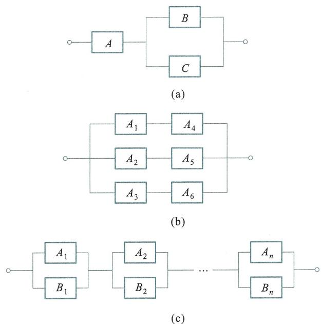  
图1.6

# 二、思考题

1. 怎样理解随机试验,随机试验具有什么特征?

2. 什么是频率?频率是否等同于概率?怎样理解频率的稳定性?

3. 古典概型试验的基本事件有什么特点?若在例1.2.2中求"点数之和等于5"的概率,请分析下例中两种解法答案不一致的原因.

解法一例1.2.2中假定试验有36个基本事件,或样本空间由36个样本点组成,而其中和数为5的有4个,故所求概率为  $\frac{4}{36} = \frac{1}{9}$

解法二将两个骰子"出现的点数之和为  $k$  "看成基本事件,全体基本事件对应的样本空间为

$$
\Omega = \{2,3,4,5,\dots ,12\} ,
$$

而点数之和为5是其中一个结果,所求的概率为  $\frac{1}{11}$

4. 如何理解条件概率,举例说明概率  $P(AB)$  和  $P(A\mid B)$  的概念差别.

5. 分析两个随机事件  $A$  与  $B$  互不相容、  $A$  与  $B$  对立及  $A$  与  $B$  相互独立这三个概念的差别,在一般情形  $A$  与  $B$  相互独立与  $A$  与  $B$  互不相容能否同时成立?

6. 本章基于条件概率的三个公式:乘法公式、全概率公式及贝叶斯公式分别用来解决哪一类问题?

7. 如何理解判断随机事件组的独立性?事件组的相互独立与两两独立有什么差别?

# 第2章 随机变量的分布

# §2.1 随机变量的分布函数

在第1章中, 我们仅讨论了随机事件及其概率, 只是孤立地研究随机试验的一个或几个事件, 不能从整体去深入把握它的统计性质. 例如, 测试电子显像管的寿命, 我们固然关心如“显像管的寿命不到6000小时”这类事件的概率, 但我们更关心显像管寿命的整体变化规律.

为了深入地研究随机现象, 需要把随机试验的结果数量化, 即用一个变量来描述试验结果, 以便从数量关系来研究随机现象的统计规律性.

如例1.1.5中连续抛两次均匀硬币, 正面  $H$  出现的次数  $X$ ; 又如例1.1.6中射手连续向一目标射击, 直至命中为止时的射击次数  $Y$ . 两例中的变量都是样本点的函数, 这样的变量可以将随机试验的试验结果数值化.

定义2.1.1设  $\Omega$  是随机试验  $E$  的样本空间, 若对于每一个样本点  $\omega \in \Omega$ , 都有唯一的实数  $X(\omega)$  与之对应, 且对于任意实数  $x$ , 都有确定的概率  $P\mid X(\omega)\leqslant x\mid$  与之对应, 则称  $X(\omega)$  为随机变量, 简记为  $X$ .

可验证前述变量  $X, Y$  均为定义在样本空间上的随机变量,

例2.1.1一个电话呼叫是在时间区间  $(0, T)$  内随机出现的, 记呼叫时刻为  $t$ , 试验的样本空间为  $\Omega = \{t \mid t \in (0, T)\}$ , 定义随机变量  $X$  为

$$
X(t) = t, t \in \Omega ,
$$

于是  $t$  有双重意义, 它既是该试验的试验结果, 又是随机变量  $X$  的取值.

另外, 取  $(t_{1}, t_{2}) \subset (0, T)$ , 定义

$$
Y(t) = \left\{ \begin{array}{ll}1, & t_{1} \leqslant t \leqslant t_{2}, \\ 0, & \text{其他}. \end{array} \right.
$$

$Y(t)$  是定义在  $\Omega$  上的另一个随机变量,

必须强调指出, 随机变量不同于普通意义下的变量, 它们具有如下的特点:

(1) 它们是由随机试验的结果所决定的量;

(2) 随机变量取各值的可能性大小有确定的统计规律性.

随机变量概念是近代概率论与数理统计学中最重要的基本概念之一. 引进随机变量后, 我们可以借助现代数学工具, 更好地描述、处理与解决各种联系于随机现象的理论和应用问题.

引进分布函数来描述随机变量的统计规律

定义2.1.2 设  $\Omega$  是随机试验  $E$  的样本空间,  $x$  是任意实数, 称函数

$$
F(x) = P\left\{X\leqslant x\right\} = P\left\{\omega \mid X(\omega)\leqslant x\right\} \tag{2.1.1}
$$

为随机变量  $X$  的分布函数,  $F(x)$  也可记为  $F_{X}(x)$ .

可将随机变量  $X$  看成实数轴上随机点的坐标, 称为随机点  $X$ .

分布函数  $F(x)$  的函数值表示事件"随机点  $X$  落在区间  $(- \infty ,x]$  内"的概率, 而"随机点  $X$  落在  $(a,b]$  内"的概率为

$$
P\left\{a< X\leqslant b\right\} = F(b) - F(a), \tag{2.1.2}
$$

这是由于

$$
\{a< X\leqslant b\} = \{X\leqslant b\} -\{X\leqslant a\} ,
$$

且

$$
\{X\leqslant a\} \subset \{X\leqslant b\} ,
$$

故有

$$
P\left\{a< X\leqslant b\right\} = P\left\{X\leqslant b\right\} -P\left\{X\leqslant a\right\} ,
$$

即式(2.1.2)成立.

例2.1.2将一枚均匀硬币连续抛两次, 试写出出现正面次数  $X$  的分布函数及概率  $P\{0< X\leqslant 1\} , P\{1\leqslant X< 2\}$ .

解首先可得

$$
P\left\{X = 0\right\} = P\left\{T T\right\} = \frac{1}{4},
$$

$$
P\left\{X = 1\right\} = P\left(\left\{H T\right\} \cup \left\{T H\right\}\right) = \frac{1}{2},
$$

$$
P\left\{X = 2\right\} = P\left\{H H\right\} = \frac{1}{4},
$$

当  $x< 0,F(x) = P\left\{X\leqslant x\right\} = P(\emptyset) = 0$

当  $0\leqslant x< 1,F(x) = P\left\{X\leqslant x\right\} = P\left\{X = 0\right\} = \frac{1}{4};$

当  $1\leqslant x< 2,F(x) = P\left\{X\leqslant x\right\} = P\left\{X = 0\right\} +P\left\{X = 1\right\} = \frac{3}{4};$

当  $x\geqslant 2,F(x) = P\left\{X\leqslant x\right\} = P\left\{X = 0\right\} +P\left\{X = 1\right\} +P\left\{X = 2\right\} = 1,$

即有

$$
F(x) = \left\{ \begin{array}{ll}0, & x< 0, \\ \frac{1}{4}, & 0\leqslant x< 1, \\ \frac{3}{4}, & 1\leqslant x< 2, \\ 1, & x\geqslant 2. \end{array} \right.
$$

$F(x)$  的图形如图2.1所示, 它是阶梯形的, 在  $x = 0,1,2$  处有阶跃, 而跃变值恰好是随机变量  $X$  在这些点处取值的概率.

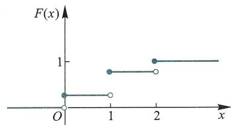  
图2.1

所求概率为

$$
\begin{array}{l}{{P\left\{0< X\leqslant1\right\}=F\left(1\right)-F\left(0\right)=\frac{3}{4}-\frac{1}{4}=\frac{1}{2},}}\\ {{P\left\{1\leqslant X\leqslant2\right\}=P\left\{X=1\right\}+P\left\{1< X\leqslant2\right\}}}\\ {{\qquad=P\left\{X=1\right\}+F\left(2\right)-F\left(1\right)=\frac{1}{2}+1-\frac{3}{4}-\frac{3}{4}.}}\end{array}
$$

例2.1.3 一电话呼叫在时间区间  $(0, T)$  内随机出现, 呼叫时刻记为  $t$ , 事件  $\{t_{1} < t \leqslant t_{2}\}$  的概率为

$$
P\left\{t_{1} < t \leqslant t_{2}\right\} = \frac{1}{T} (t_{2} - t_{1}), \quad (t_{1}, t_{2}) \subset (0, T),
$$

试求随机变量  $X(t) = t$  的分布函数

解若  $x< 0,F(x) = P\{X\leqslant x\} = P(\emptyset) = 0;$

若  $x \geqslant T, F(x) = P\{X \leqslant x\} = P(\Omega) = 1$

若  $0 \leqslant x < T, F(x) = P\{X \leqslant x\} = P\{0 < t \leqslant x\} = \frac{x}{T},$

于是

$$
F(x) = \left\{ \begin{array}{ll} 0, & x < 0, \\ \frac{x}{T}, & 0 \leqslant x < T, \\ 1, & T \leqslant x. \end{array} \right.
$$

图2.2即为随机变量  $X$  的分布函数的图形,  $F(x)$  是一个单调不降处处连续的函数.

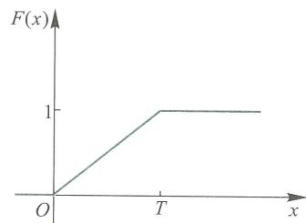  
图2.2

例2.1.4 某系统的寿命为  $T$ , 系统在  $t$  时刻尚正常运行的条件下, 其失效率总保持为某个常数  $\lambda (> 0)$ , 即有

$$
\lim_{h \to 0^{+}} \frac{1}{h} P\{t < T \leqslant t + h \mid T > t\} = \lambda ,
$$

试写出  $T$  的分布函数

解当  $t < 0$  时,  $F(t) = 0$

当  $t > 0, h > 0$  时, 因

$$
\{t < T \leqslant t + h\} = \{t < T \leqslant t + h\} \cap \{t < T\} ,
$$

故

$$
P\{t < T \leqslant t + h \mid T > t\} = \frac{P\{t < T \leqslant t + h\} - F(t + h) - F(t)}{P\{T > t\}} = \frac{F(t + h) - F(t)}{1 - F(t)}.
$$

由题设条件可知, 有

$$
\frac{\lim_{h \to 0^{+}} \frac{F(t + h) - F(t)}{h}}{1 - F(t)} = \lambda ,
$$

得到关于  $F(t)$  的微分方程

$$
\frac{\mathrm{d}F(t)}{\mathrm{d}t} = \lambda \left[1 - F(t)\right],
$$

满足其初值条件  $F(0) = 0$  的解为  $F(t) = 1 - \mathrm{e}^{- \lambda t}$ , 系统寿命  $T$  的分布函数为

$$
F(t) = \left\{ \begin{array}{c c}{1 - \mathrm{e}^{-\lambda t},} & {t\geqslant 0,}\\ {0,} & {t< 0.} \end{array} \right.
$$

分布函数具有以下基本性质:

定理2.1.1 设  $F(x)$  为随机变量  $X$  的分布函数, 则

(1)  $F(x)$  为单调不降函数, 即若  $x_{1}< x_{2}$ , 则有  $F(x_{1}) \leqslant F(x_{2})$

(2)  $0 \leqslant F(x) \leqslant 1$ , 且  $\lim_{x \to -\infty} F(x) = 0$ ,  $\lim_{x \to +\infty} F(x) = 1$

(3)  $F(x)$  是右连续函数, 即  $F(x + 0) = F(x)$

证略.

容易验证  $F(x)$  的单调不降性: 取  $x_{1}< x_{2}$ , 有

$$
F(x_{2}) - F(x_{1}) = P\left\{x_{1}< X \leqslant x_{2}\right\} \geqslant 0,
$$

$0 \leqslant F(x) \leqslant 1$  成立是因为分布函数值实际是随机事件的概率. 而 (2) 中的两个极限式可以从几何上加以说明.

在图2.3中, 若变量  $x$  沿数轴无限向左移动 (即  $x \to - \infty$ ), 则随机事件"随机点  $X$  落在  $(- \infty , x]$  内"趋于不可能事件, 从而其概率趋于0, 亦即  $F(- \infty) = 0$ ; 又若将点无限右移 (即  $x \to +\infty$ ), 则"随机点  $X$  落在  $(- \infty , x]$  内"这一事件趋于必然事件, 从而其概率趋于1, 即有  $F(+\infty) = 1$

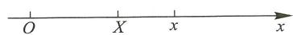  
图2.3

在引进分布函数之前, 我们只能孤立地研究随机试验的一个或数个事件, 不能从整体去深入研究随机试验. 分布函数是一种分析性质良好的函数, 便于处理, 利用它可使许多概率论问题得以量化分析和简化处理.

# §2.2 离散型随机变量

# 一、离散型随机变量及其分布律

按照随机变量的可能取值, 可以从中分出两种基本类型, 即离散型随机变量与连续型随机变量. 实际工程问题中也会遇到其他类型的随机变量.

定义2.2.1 如果随机变量  $X$  只取有限个或可列无穷多个数值:  $x_{1}, x_{2}, \dots , x_{n}, \dots$ , 记  $P\{X = x_{i}\} = p_{i}$ , 它满足

(1)  $p_{i} \geqslant 0$

(2)  $\sum_{i = 1}^{\infty} p_{i} = 1$

则称  $X$  为离散型随机变量, 并称

$$
P\{X = x_{i}\} = p_{i}, i = 1, 2, \dots \tag{2.2.1}
$$

为  $X$  的分布律.

以后我们常用如下表格来表示离散型随机变量  $X$  的分布律:

<table><tr><td>X</td><td>x1</td><td>x2</td><td>...</td><td>xn</td><td>...</td></tr><tr><td>P{X=xi}</td><td>p1</td><td>p2</td><td>...</td><td>pn</td><td>...</td></tr></table>

例2.2.1某射手一次射击命中目标的概率为  $p,0< p< 1$  ,射击进行到第一次命中目标为止,试求射击次数  $X$  的分布律.

解设  $A_{i} = \left\{ \begin{array}{l l} \end{array} \right.$  第  $i$  次射击命中目标  $\left\{ \begin{array}{l l} \end{array} ,i = 1,2,\dots ,$  则

$$
\begin{array}{r l} & {P\left\{X = k\right\} = P(\overline{{A}}_{1}\overline{{A}}_{2}\dots \overline{{A}}_{k - 1}A_{k})}\\ & {\qquad = P(A_{1})P(A_{2})\dots P(A_{k - 1})P(A_{k})}\\ & {\qquad = (1 - p)^{k - 1}p,k = 1,2,\dots ,} \end{array}
$$

且

$$
\sum_{k = 1}^{\infty}P\left\{X = k\right\} = p\sum_{k = 1}^{\infty}\left(1 - p\right)^{k - 1} = \frac{p}{1 - (1 - p)} = 1.
$$

故  $X$  的分布律为

<table><tr><td>X</td><td>1</td><td>2</td><td>...</td><td>k</td><td>...</td></tr><tr><td>P{X=k}</td><td>p</td><td>(1-p)p</td><td>...</td><td>(1-p)k-1p</td><td>...</td></tr></table>

称随机变量  $X$  服从几何分布.

例2.2.2某种产品在生产过程中的废品率为  $p(0< p< 1)$  ,对产品逐个进行检查,直到检查出5个不合格品为止,试写出停止检查时已检查的产品个数  $X$  的分布.

解检查  $k$  件产品,有5件不合格(其余  $k - 5$  件产品合格)的概率为

$$
p^{5}(1 - p)^{k - 5}.
$$

随机事件  $\{X = k\}$  发生相当于第  $k$  次检查的必为不合格品,而前  $k - 1$  次检查中查出4件不合格品,共有  $\mathrm{C}_{k - 1}^{4}$  种不同的方式,故

$$
P\left\{X = k\right\} = \mathrm{C}_{k - 1}^{4}p^{5}(1 - p)^{k - 5},\quad k = 5,6,\dots .
$$

例2.2.3100个产品中有5个次品,从中抽一件进行检查,设  $X$  是抽到的合格品数,试写出  $X$  的分布律.

解设  $A = \left\{ \begin{array}{l l} \end{array} \right.$  抽到合格品  $\left\{ \begin{array}{l l} \end{array} \right.$  ,则  $\{X = 1\} = A,\{X = 0\} = \overline{{A}}$  ,且

$$
P\left\{X = 0\right\} = \frac{5}{100},P\left\{X = 1\right\} = \frac{95}{100},
$$

$X$  的分布律为

<table><tr><td>X</td><td>0</td><td>1</td></tr><tr><td rowspan="2">P|X=x</td><td>5</td><td>95</td></tr><tr><td>100</td><td>100</td></tr></table>

例2.2.3是一个典型例题,题中试验的样本空间仅含两个样本点,即试验只有两个结果:"抽到合格品"和"抽到不合格品".这类试验大量存在,如抛一枚硬币,仅有"出现正面"和"出现反面"两个结果;向一目标射击,关心"命中目标"和"未命中

目标".

若一个试验的样本空间只有两个样本点, 即只有两个可能的对立结果:  $A$  和  $\overline{A}$ , 则称之为伯努利(Bernoulli)试验.

在伯努利试验中,  $A$  为伯努利试验的基本事件, 若  $P(A) = p, 0< p< 1$ , 令

$$
X = {{1,\quad A\atop 0,\quad A\atop \mathcal{K}\atop \mathcal{K}\atop \mathcal{K}\atop \mathcal{K}\atop \mathcal{K}\atop \mathcal{K}\atop \mathcal{K}\atop \mathcal{K}\atop \mathcal{K}\atop \mathcal{K}\atop \mathcal{K}\atop \mathcal{K}\atop \mathcal{K}\atop \atop \atop \atop \atop \atop \atop \atop \atop \atop \atop \atop \atop \atop \atop \atop \atop \atop \atop \atop \atop \atop \atop \atop \atop \atop \atop \atop \atop \atop \atop \atop \atop \atop \) 发生,
$$

则  $X$  的分布律为

<table><tr><td>X</td><td>0</td><td>1</td></tr><tr><td>P{X=x}</td><td>1-p</td><td>p</td></tr></table>

或者

$$
P\left\{X = x\right\} = p^{x}(1 - p)^{1 - x}, \quad x = 0,1,
$$

则称  $X$  服从  $(0 - 1)$  分布 (或两点分布).

设  $X$  是离散型随机变量, 其分布律为

$$
P\left\{X = x_{k}\right\} = p_{k}, k = 1,2, \dots .
$$

由于  $\{X \leqslant x\} = \bigcup_{x_{k} \leqslant x} \{X = x_{k}\}$ , 由概率的可列可加性得

$$
P\left\{X \leqslant x\right\} = P\left[\bigcup_{x_{k} \leqslant x} \{X = x_{k}\} \right] = \sum_{x_{k} \leqslant x} P\left\{X = x_{k}\right\} ,
$$

即有

$$
F(x) = \sum_{x_{k} \leqslant x} p_{k}. \tag{2.2.2}
$$

# 二、伯努利试验与二项分布

随机现象的统计规律, 往往通过相同条件下进行大量重复试验和观察而得以揭示. 这种在相同条件下重复试验的数学模型在概率论中占有重要地位.

定义2.2.2 将一个试验在相同条件下重复进行  $n$  次, 如果在每次试验中, 任一事件出现的概率与其他各次试验结果无关, 则称这  $n$  次试验是  $n$  次重复独立的试验.

$n$  次重复独立的伯努利试验称为  $n$  重伯努利试验, 或称伯努利概型.

一个  $n$  重伯努利试验包含  $n$  次试验, 每次试验中随机事件  $A$  发生的概率保持不变. 我们往往感兴趣的是  $n$  重伯努利试验中事件  $A$  出现的总次数  $X$  及其分布律, 显然  $X$  的可能取值为整数:  $0,1,2, \dots , n$ , 记

$$
P_{n}(k) = P\{X = k\} , k = 0,1,2, \dots , n.
$$

例2.2.4 某书店开设新书征订业务, 每位顾客在一周内收到书店回单的概率是 0.2, 有四位顾客预订新书, 求一周内收到回单的顾客数  $X$  的分布律.

解 每位顾客预订新书, 将观察一周内是否收到回单看作一次试验, 四位预订者是各不相干的, 可认为这四次试验是独立的, 因此这是一个 4 重伯努利试验.

令  $A_{i} = \{$  第  $i$  位顾客收到回单  $\}$ $i = 1,2,3,4$  ,则  $A_{1},A_{2},A_{3},A_{4}$  相互独立,且

$$
P(A_{i}) = 0.2, i = 1,2,3,4,
$$

因  $\{X = 0\} = \overline{A_{1}}\overline{A_{2}}\overline{A_{3}}\overline{A_{4}}$  ,故

$$
P\{X = 0\} = P(\overline{A_{1}})P(\overline{A_{2}})P(\overline{A_{3}})P(\overline{A_{4}}) = 0.8^{4}.
$$

而

$$
\{X = 1\} = A_{1}\overline{A_{2}}\overline{A_{3}}\overline{A_{4}}\cup \overline{A_{1}} A_{2}\overline{A_{3}}\overline{A_{4}}\cup \overline{A_{1}}\overline{A_{2}} A_{3}\overline{A_{4}}\cup \overline{A_{1}}\overline{A_{2}}\overline{A_{3}} A_{4}.
$$

由事件的独立性和概率的有限可加性,得

$$
P\{X = 1\} = 4\times 0.2\times 0.8^{3} = \mathrm{C}_{4}^{1}0.2\times 0.8^{3}.
$$

由

$$
\{X = 2\} = A_{1}A_{2}\overline{A}_{3}\overline{A}_{4}\cup A_{1}A_{2}A_{3}\overline{A}_{4}\cup A_{1}\overline{A}_{2}\overline{A}_{3}A_{4}\cup \overline{A}_{1}A_{2}A_{3}\overline{A}_{4}\cup \overline{A}_{1}\overline{A}_{2}A_{3}A_{4}\cup \overline{A}_{1}A_{2}\overline{A}_{3}A_{4},
$$

有

$$
P\{X = 2\} = \mathrm{C}_{4}^{2}0.2^{2}\times 0.8^{2}.
$$

类似地,

$$
\begin{array}{r}P\{X = 3\} = \mathrm{C}_{4}^{3}0.2^{3}\times 0.8. \\ P\{X = 4\} = \mathrm{C}_{4}^{4}\times 0.2^{4}. \end{array}
$$

记  $p = 0.2$  ,把上述各概率统一改写为

$$
P\{X = k\} = \mathrm{C}_{4}^{k}p^{k}(1 - p)^{4 - k}, k = 0,1,2,3,4.
$$

一般地,  $n$  重伯努利试验中,事件  $A$  在指定的  $k$  次试验中发生的概率为

$$
p^{k}(1 - p)^{n - k},
$$

而  $n$  次试验中选出  $k$  次试验有  $\mathrm{C}_{n}^{k}$  种不同的方式,故  $n$  重伯努利试验中事件  $A$  恰好发生  $k$  次的概率为

$$
P_{n}(k) = \mathrm{C}_{n}^{k}p^{k}(1 - p)^{n - k}.
$$

我们可证得下述定理

定理2.2.1在  $n$  重伯努利试验中,事件  $A$  在每次试验中发生的概率为  $p,0< p< 1$  则  $A$  恰好发生  $k$  次的概率为

$$
P_{n}(k) = \mathrm{C}_{n}^{k}p^{k}(1 - p)^{n - k}, \tag{2.2.3}
$$

其中  $k = 0,1,2,\dots ,n$

注意到  $0< p< 1$  ,显然  $P_{n}(k) > 0$  ,并由二项式定理有

$$
\sum_{k = 0}^{n}P_{n}(k) = \sum_{k = 0}^{n}\mathrm{C}_{n}^{k}p^{k}(1 - p)^{n - k} = [p + (1 - p)]^{n} = 1.
$$

若随机变量  $X$  的分布律为

$$
P\{X = k\} = P_{n}(k) = \mathrm{C}_{n}^{k}p^{k}(1 - p)^{n - k}, \quad k = 0,1,2,\dots ,n,
$$

则称  $X$  服从二项分布,记为  $X\sim B(n,p)$

特别若  $X\sim B(1,p)$  ,则其分布律为

$$
P\{X = k\} = \mathrm{C}_{1}^{k}p^{k}(1 - p)^{1 - k} = p^{k}(1 - p)^{1 - k}, \quad k = 0,1,
$$

即  $X$  服从(0- 1)分布.

例2.2.5某学生参加一项测验,对其中20道是非题纯粹是随机地选择"是"和"非",试计算该生至少做对14道题目的概率.

解此学生随机地选择"是"和"非",他答对每道题目的概率是  $p = 0.5$  ,判断20

道题目相当于做20重伯努利试验.

设  $X$  是该生答对的题目数,则  $X \sim B(20,0.5)$ ,所求概率为

$$
P\left\{X \geqslant 14\right\} = \sum_{k = 14}^{20} P\left\{X = k\right\} = \sum_{k = 14}^{20} \mathrm{C}_{20}^{k}\left(\frac{1}{2}\right)^{20} = 0.0577.
$$

如果要求学生至少做对14道才能通过测验,那么这位学生通过测验的概率仅为0.0577.

例2.2.6一位工人同时看管  $n$  部机床,设每部机床在每一分钟内需修理的概率为  $p(0< p< 1)$ ,试求

(1)  $n$  部机床在同一分钟内有  $k(0 \leqslant k \leqslant n)$  部需要修理的概率  $p_{k}$ ;

(2)若要求此工人不能及时修理机床的概率低于  $1\%$ ,问他最多能看管几台机床?

解在一分钟内观察  $n$  部机床是否需要修理,相当于做  $n$  重伯努利试验,用  $X$  表示同一分钟内需要修理的机床数,则  $X \sim B(n,p)$ ,且

(1)  $n$  部机床在同一分钟内有  $k$  部需要修理的概率为

$$
p_{k} = P\left\{X = k\right\} = \mathrm{C}_{n}^{k}p^{k}(1 - p)^{n - k}.
$$

特别地,  $n$  部机床在同一分钟内均不需要修理的概率为

$$
p_{0} = P\left\{X = 0\right\} = (1 - p)^{n},
$$

恰有一部需修理的概率为

$$
p_{1} = P\left\{X = 1\right\} = np(1 - p)^{n - 1}.
$$

(2)由于该工人在同一时刻只能修理一部机床,当一分钟内有一部以上机床需要修理时,他无法及时修理,其概率为

$$
P\{X > 1\} = 1 - P\{X = 0\} -P\{X = 1\} = 1 - (1 - p)^{n} - np(1 - p)^{n - 1}.
$$

令  $n_{0} = \max \left\{n \mid 1 - (1 - p)^{n} - np(1 - p)^{n - 1} \leqslant 1\% \right\}$ ,则  $n_{0}$  即所求的机床部数.

例2.2.7设某种数字传输器以每秒  $512\times 10^{3}$  个0或1的序列传送信息(即每秒传送0或1的总个数为  $512\times 10^{3}$  ).由于各种干扰在传送过程中会出现将0误为1或将1误为0的情况,这两种情况均称为"误码",设出现一个误码的概率  $p = 10^{- 7}$  ,求在10秒钟内出现一个误码的概率.

解将传输一个数字0或1看作一个试验,关心是否产生误码,这个问题可看成重数为  $n = 512\times 10^{3}\times 10$  的伯努利试验,所求概率为

$$
P_{512\times 10^{4}}(1) = \mathrm{C}_{512\times 10^{4}}^{1}\times 10^{-7}\times (1 - 10^{-7})^{512\times 10^{4} - 1}.
$$

显然,要直接计算此概率较困难

# 三、泊松分布

设随机变量  $X$  的分布律为

$$
P\left\{X = k\right\} = \frac{\lambda^{k}}{k!}\mathrm{e}^{-\lambda},\quad k = 0,1,2,\dots ,\quad \lambda >0,
$$

则称随机变量  $X$  服从参数为  $\lambda$  的泊松(Poisson)分布,记为  $X \sim P(\lambda)$

一种分布之所以重要,通常是由于两种原因:或者它直接产生于许多实际问题中,或者它作为某些重要分布的极限而出现,在理论上有重要意义,泊松分布两者都具备.

泊松分布的实际应用很广, 例如, 在单位时间内, 某电话交换台接到的电话呼叫次数; 某服务台到达的顾客数; 放射性物质放射出的粒子到达计数器的个数; 某自动控制系统中损坏的元件个数等, 都服从泊松分布.

下面的定理说明泊松分布可视为二项分布的极限分布.

定理2.2.2（泊松定理）设随机变量序列  $X_{n}, n = 1,2,\dots$ , 有  $X_{n} \sim B(n, p_{n})$ , 即

$$
P\left\{X_{n} = k\right\} = \mathrm{C}_{n}^{k} p_{n}^{k}(1 - p_{n})^{n - k}, \quad k = 0,1,2,\dots ,n.
$$

若满足

$$
\lim_{n \to \infty} n p_{n} = \lambda > 0,
$$

则有

$$
\lim_{n \to \infty} P\left\{X_{n} = k\right\} = \frac{\lambda^{k}}{k!} \mathrm{e}^{-\lambda}. \tag{2.2.4}
$$

证略.

分析定理成立的条件  $\lim_{n \to \infty} n p_{n} = \lambda > 0$ , 说明参数列  $\{p_{n}\}$  是与数列  $\left\{\frac{1}{n}\right\}$  同阶的无穷小数列. 在实用中, 当事件  $A$  在每次试验中  $P(A) = p$  很小, 试验的次数  $n$  又很大时, 在  $n$  次试验中  $A$  发生的频数就近似服从泊松分布, 从而当  $n$  很大,  $p$  很小时, 可用泊松定理近似计算二项分布的概率

$$
P\left\{X_{n} = k\right\} = \mathrm{C}_{n}^{k} p_{n}^{k}(1 - p_{n})^{n - k} \approx \frac{\lambda^{k}}{k!} \mathrm{e}^{-\lambda}, \quad k = 0,1,2,\dots ,n, \tag{2.2.5}
$$

其中  $\lambda = n p$

例2.2.8 收到一批100个零件的订货, 设每一个零件是次品的概率等于0.01, 该批零件验收合格的条件是次品数不超过3, 试求这批订货合格的概率.

解设  $X$  是这批订货中的次品数, 则  $X \sim B(100,0.01)$ , 所求概率为

$$
P\left\{X \leqslant 3\right\} = \sum_{k = 0}^{3} \mathrm{C}_{100}^{k} 0.01^{k} \times 0.99^{100 - k} = 0.9816,
$$

可认为  $X$  近似服从参数为  $\lambda = n p = 1$  的泊松分布

$$
P\left\{X \leqslant 3\right\} \approx \sum_{k = 0}^{3} \frac{1}{k!} \mathrm{e}^{-1} = 0.9810.
$$

例2.2.9（合理配备维修工人问题）有独立工作的同类设备90台, 每台发生故障的概率为0.01, 现配备三个修理工人, 每人分别包修30台, 求设备发生故障而无人修理的概率, 若三人共同负责维修90台, 求设备发生故障而无人修理的概率是多少?

解设  $X_{i}$  表示第  $i$  人包修的30台设备中同时出现故障的台数, 则  $X_{i} \sim B(30,0.01), i = 1,2,3$ .

记  $A_{i} = \left\{ \begin{array}{ll} \end{array} \right.$  第  $i$  个人负责的30台设备出现故障无人修理  $\Bigg\}$

$$
P(A_{i}) = P\{A_{i} \geqslant 2\} = 1 - P\{A_{i} \leqslant 1\}
$$

$$
\approx 1 - \mathrm{e}^{-0.3} - 0.3 \mathrm{e}^{-0.3} = 0.0369, \quad i = 1,2,3.
$$

90台设备中有故障不能及时修理的事件是  $A_{1} \cup A_{2} \cup A_{3}$

$$
P(A_{1} \cup A_{2} \cup A_{3}) = 1 - P(\overline{A_{1}} \overline{A_{2}} \overline{A_{3}})
$$

$$
\begin{array}{l}{{=1-P(\overline{{{A}}}_{1})P(\overline{{{A}}}_{2})P(\overline{{{A}}}_{3})}}\\ {{=1-(1-0.036 9)^{3}=0.106 7.}}\end{array}
$$

三个工人共同负责时,设  $X$  为90台设备中同时发生故障的台数,则 $X\sim B\left(90,0.01\right)$  ,这时设备发生故障无人修理的概率为

$$
P\left\{X\geqslant 4\right\} = 1 - P\left\{X\leqslant 3\right\} \approx 1 - \sum_{k = 0}^{3}{\frac{0.9^{k}}{k!}}\mathrm{e}^{-0.9} = 0.013 5.
$$

可见,共同负责比分别负责的维修效率更高

例2.2.10(平安保险问题)有2500名小学生参加了保险公司举办的平安保险,每个参加保险的小学生一年交付保险费12元,若在一年内出现意外伤害事故,保险公司一次性赔付2000元.设一年内每名小学生出事故的概率为0.002,求

(1)保险公司亏本的概率;

(2)保险公司获利不少于10000元的概率

解设  $A = \left\{ \begin{array}{l l}{\begin{array}{r l r}\end{array}}\end{array}\right.$  保险公司出现亏本  $\left\{ \begin{array}{l l}{\boldsymbol {B} = \left\{ \begin{array}{l l}{\begin{array}{r l r}\end{array}}\end{array}\right.} \end{array}$  保险公司获利不少于10000元  $\Bigg\}$  ,设  $X$  为一年内出现意外事故的学生人数,则  $X\sim B\left(2 500,0.002\right)$

(1)若一年内有  $X$  名学生出事故,则保险公司应赔付  $2000X$  元,事件发生的概率为

$$
\begin{array}{l}{{P(A)=P\left\{2 000X>2 500\times12\right\}=P\left\{X>15\right\}}}\\ {{=\sum_{k=16}^{2 500}p_{2 500}(k)=1-\sum_{k=0}^{15}p_{2 500}(k)}}\\ {{=1-\sum_{k=0}^{15}C_{2 500}^{k}0.002^{k}\times0.998^{2 500-k}}}\\ {{\approx1-\sum_{k=0}^{15}\frac{5^{k}}{k!}\mathrm{e}^{-5}=0.000 069.}}\end{array}
$$

由此可见,该保险公司在一年内亏本的概率极小

$$
\begin{array}{l}{{P(B)=P\left\{30 000-2 000X\geqslant10 000\right\}=P\left\{X\leqslant10\right\}=\sum_{k=0}^{10}p_{2 500}(k)}}\\ {{\approx\sum_{k=0}^{10}\frac{5^{k}}{k!}\mathrm{e}^{-5}=1-\sum_{k=1}^{\infty}\frac{5^{k}}{k!}\mathrm{e}^{-5}=1-0.013 695=0.986 305.}}\end{array}
$$

此保险公司获利不少于10000元的概率达  $98\%$  以上

# $\S 2.3$  连续型随机变量

# 一、概率密度函数

离散型随机变量至多只取可列无穷个数值,还有一类随机变量的取值却充满某个有限区间或无穷区间.如电话的呼叫时间、测量电源电压的误差值、测试电子管的寿命,等等.非离散型随机变量中重要的一类是连续型随机变量.

定义2.3.1设  $F(x)$  是随机变量  $X$  的分布函数,若存在非负函数  $f(x)$  ,对任意实数  $x$  ,有

$$
F(x) = \int_{-\infty}^{x}f(u)\mathrm{d}u, \tag{2.3.1}
$$

则称  $X$  是连续型随机变量, 称  $f(x)$  为  $X$  的概率密度.

如例2.1.3中随机变量  $X$  (电话呼叫时间)的分布函数为

$$
F(x) = \left\{ \begin{array}{ll}0, & x< 0, \\ \frac{x}{T}, & 0 \leqslant x < T, \\ 1, & T \leqslant x, \end{array} \right.
$$

取

$$
f(x) = \left\{ \begin{array}{ll} \frac{1}{T}, & 0 < x < T, \\ 0, & \text{其他}, \end{array} \right.
$$

可验证得  $F(x) = \int_{- \infty}^{x}f(u)\mathrm{d}u$ , 且  $f(u) \geqslant 0$

例2.1.4中系统的寿命  $T$  的分布函数为

$$
F(t) = \left\{ \begin{array}{ll}1 - \mathrm{e}^{-\lambda t}, & t \geqslant 0, \\ 0, & t < 0 \end{array} \right. \quad (\lambda > 0).
$$

取  $f(t) = \left\{ \begin{array}{ll}\lambda \mathrm{e}^{- \lambda t}, & t \geqslant 0, \\ 0, & t < 0, \end{array} \right.$  则有  $f(t) \geqslant 0$ , 并且  $F(t) = \int_{- \infty}^{t}f(u)\mathrm{d}u$  成立.

由定义2.3.1知  $X$  和  $T$  都是连续型随机变量,

概率密度所对应的平面曲线称为随机变量  $X$  的概率曲线, 由积分的几何意义可知, 分布函数值  $F(x)$  是概率曲线下从  $- \infty$  到  $x$  的一块面积, 如图2.4所示.

连续型随机变量的概率密度具有如下性质:

性质2.3.1  $f(x) \geqslant 0$

性质2.3.2  $\int_{- \infty}^{+\infty}f(x)\mathrm{d}x = 1.$

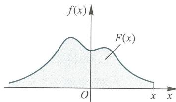  
图2.4

证由定义2.3.1可知  $f(x)$  非负, 且由概率密度的定义和分布函数的性质有

$$
\int_{-\infty}^{+\infty}f(x)\mathrm{d}x = \lim_{x \to +\infty} \int_{-\infty}^{x}f(u)\mathrm{d}u = \lim_{x \to +\infty} F(x) = 1.
$$

反之, 若给出一个非负函数  $f(x)$ , 有

$$
\int_{-\infty}^{+\infty}f(x)\mathrm{d}x = 1
$$

成立, 则  $f(x)$  一定是一个随机变量  $X$  的概率密度. 因此, 验证性质2.3.1和性质2.3.2是判定一个函数是否为概率密度的方法.

性质2.3.3  $P\{x_{1} < X \leqslant x_{2}\} = \int_{x_{1}}^{x_{2}}f(x)\mathrm{d}x.$

$$
\begin{array}{l}P\{x_{1} < X \leqslant x_{2}\} = F(x_{2}) - F(x_{1}) = \int_{-\infty}^{x_{2}}f(x)\mathrm{d}x - \int_{-\infty}^{x_{1}}f(x)\mathrm{d}x \\ = \int_{x_{1}}^{x_{2}}f(x)\mathrm{d}x. \end{array}
$$

以上三条性质的几何意义是:

(1) 概率曲线不在横轴的下方;

(2) 概率曲线与横轴所围成的区域总面积为 1;

(3) 随机点  $X$  落在  $(x_{1}, x_{2}]$  内的概率等于区间  $(x_{1}, x_{2}]$  以上, 概率曲线下方的曲边梯形面积 (见图 2.5).

性质2.3.4 若  $f(x)$  在点  $x$  处连续, 则  $F^{\prime}(x) = f(x)$ .

证 由对变上限积分的求导定理, 有

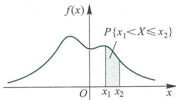  
图2.5

$$
F^{\prime}(x) = \left(\int_{-\infty}^{x} f(u) \mathrm{d}u\right)^{\prime} = f(x).
$$

性质2.3.5 连续型随机变量的分布函数  $F(x)$  是一个在  $(- \infty , +\infty)$  上的连续函数.

证  $F(x)$  具有右连续性, 仅需证明它的左连续性, 对  $\Delta x > 0$

$$
0 \leqslant F(x) - F(x - \Delta x) = P\{x - \Delta x < X \leqslant x\} = \int_{x - \Delta x}^{x} f(u) \mathrm{d}u,
$$

令  $\Delta x \rightarrow 0^{+}$ , 右端极限为 0, 即有

$$
\lim_{\Delta x \rightarrow 0^{+}} F(x - \Delta x) = F(x).
$$

故  $F(x)$  具有左连续性.

性质2.3.6 设  $X$  为连续型随机变量, 则对任一指定实数  $x_{0}$ , 有

$$
P\{X = x_{0}\} = 0, \quad x_{0} \in \mathbf{R}.
$$

证取  $\Delta x > 0$ , 由  $\{X = x_{0}\} \subset \{x_{0} - \Delta x < X \leqslant x_{0}\}$  可得

$$
0 \leqslant P\{X = x_{0}\} \leqslant P\{x_{0} - \Delta x < X \leqslant x_{0}\} = F(x_{0}) - F(x_{0} - \Delta x),
$$

令  $\Delta x \rightarrow 0^{+}$ , 根据性质2.3.5, 上式右端的极限为 0, 从而  $P\{X = x_{0}\} = 0$ .

性质2.3.6 告诉我们两点:

(1) 对于连续型随机变量  $X$ , 有

$$
\begin{array}{l}P\{x_{1} < X < x_{2}\} = P\{x_{1} \leqslant X < x_{2}\} = P\{x_{1} < X \leqslant x_{2}\} \\ = P\{x_{1} \leqslant X \leqslant x_{2}\} = \int_{x}^{x_{2}} f(x) \mathrm{d}x. \end{array}
$$

(2) 连续型随机变量  $X$  取任意数值的概率均为 0, 这与离散型随机变量截然不同.

这里需要特别指出: 对于连续型随机变量, 由  $P\{X = a\} = 0$  不能推断出  $\{X = a\}$  是不可能事件. 实际上  $\{X = a\}$  是一个可能发生的事件. 譬如对前述系统的寿命  $T$ , 随机事件  $\{T = 500\}$  (单位: h) 是可能发生的, 然而  $T$  是一个连续型随机变量, 由性质2.3.6知  $P\{T = 500\} = 0$ . 我们得到一个重要结论: 概率为零的事件不一定是不可能事件. 同样, 概率为 1 的事件不一定是必然事件.

# 二、几种连续型分布

# 1. 均匀分布

设连续型随机变量  $X$  具有概率密度

$$
f(x) = \left\{ \begin{array}{ll}\frac{1}{b - a}, & a< x< b, \\ 0, & \text{其他}, \end{array} \right.
$$

则称  $X$  在区间  $(a,b)$  上服从均匀分布,记为  $X\sim U(a,b)$

可得  $X$  的分布函数为

$$
F(x) = \left\{ \begin{array}{ll}0, & x< a, \\ \frac{x - a}{b - a}, & a\leqslant x< b, \\ 1, & x\geqslant b. \end{array} \right.
$$

$f(x)$  和  $F(x)$  的图形如图2.6和图2.7所示

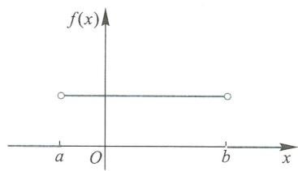  
图2.6

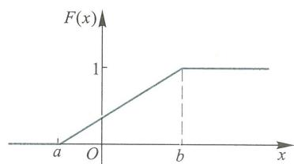  
图2.7

例2.3.1例2.1.3中的电话呼叫时间  $X$  服从  $(0,T)$  上的均匀分布.

解我们已求得  $X$  的分布函数为

$$
F(x) = \left\{ \begin{array}{ll}0, & x< 0, \\ \frac{x}{T}, & 0\leqslant x< T, \\ 1, & T\leqslant x. \end{array} \right.
$$

由于连续型随机变量  $X$  取个别值的概率为0,改变  $f(x)$  在个别点处的值,不影响其有关事件的概率,不妨补充定义:

$$
f(x) = 0,\quad x = 0\quad \text{或}\quad x = T,
$$

即得  $T$  的概率密度为

$$
f(x) = \left\{ \begin{array}{ll}\frac{1}{T}, & 0< x< T, \\ 0, & \text{其他}. \end{array} \right.
$$

若随机变量  $X\sim U(a,b)$ ,则对任意长度为  $l$  的子区间  $(c,c + l)\subset (a,b)$ ,有

$$
P\left\{c< X\leqslant c + l\right\} = \int_{c}^{c + l}f(x)\mathrm{d}x = \int_{c}^{c + l}\frac{1}{b - a}\mathrm{d}x = \frac{l}{b - a}, \tag{2.3.2}
$$

即  $X$  落在  $(a,b)$  的子区间内的概率只依赖于子区间的长度,而与子区间的位置无关.

例2.3.2一电阻器的电阻值  $R$  是一个服从在  $900\Omega$  和  $1100\Omega$  之间(额定值  $1000\Omega$  带有  $\pm 10\%$  的允许误差)均匀分布的随机变量,求  $R$  落在  $950\Omega$  至  $1050\Omega$  之间的概率.

解  $R$  的概率密度为

$$
f(r) = \left\{ \begin{array}{ll} \frac{1}{1100 - 900}, & 900 < r < 1100, \\ 0, & \text{其他}, \end{array} \right.
$$

有

$$
P\{950 < R \leqslant 1050\} = \int_{950}^{1050} \frac{1}{200} \mathrm{d}r = 0.5.
$$

2. 指数分布

例2.3.3 设随机变量  $X$  的概率密度为

$$
f(x) = \left\{ \begin{array}{ll} K\mathrm{e}^{-x / \theta}, & x > \alpha , \\ 0, & x \leqslant \alpha \end{array} \right. \quad (\theta > 0),
$$

试确定常数  $K$

解 由于  $\int_{-\infty}^{+\infty} f(x) \mathrm{d}x = 1$ , 有

$$
1 = \int_{\alpha}^{+\infty} K\mathrm{e}^{-x / \theta} \mathrm{d}x = K\theta \mathrm{e}^{-\alpha /\theta},
$$

可得  $K = \frac{1}{\theta} \mathrm{e}^{\alpha /\theta}$ ,  $X$  的概率密度为

$$
f(x) = \left\{ \begin{array}{ll} \frac{1}{\theta} \mathrm{e}^{-(x - \alpha) / \theta}, & x > \alpha , \\ 0, & x \leqslant \alpha \end{array} \right. \quad (\theta > 0).
$$

取  $\alpha = 0, \theta = \frac{1}{\lambda}$ , 有

$$
f(x) = \left\{ \begin{array}{ll} \lambda \mathrm{e}^{-\lambda x}, & x > 0, \\ 0, & x \leqslant 0 \end{array} \right. \quad (\lambda > 0), \tag{2.3.3}
$$

则称随机变量  $X$  服从参数为  $\lambda$  的指数分布.

指数分布在工程上有广泛用途, 可参见 §2.4"应用"中的寿命问题.

作为一个例子, 这里证明服从指数分布的随机变量的一个有趣性质——"无后效性".

例2.3.4 设随机变量  $X$  服从参数为  $\lambda$  的指数分布, 对任意  $s > 0$  和  $t > 0$ , 有

$$
P\{X > t + s \mid X > t\} = P\{X > s\} .
$$

$$
P\{X > t + s \mid X > t\} = \int_{x}^{+\infty} f(u) \mathrm{d}u = \int_{x}^{+\infty} \lambda \mathrm{e}^{-\lambda u} \mathrm{d}u = -\left. \mathrm{e}^{-\lambda u} \right|_{x}^{+\infty} = \mathrm{e}^{-\lambda x}.
$$

$$
P\{X > t + s \mid X > t\} = \frac{P\{X > t, X > t + s\}}{P\{X > t\}} = \frac{P\{X > t + s\}}{P\{X > t\}}
$$

$$
= \frac{\mathrm{e}^{-\lambda(t + s)}}{\mathrm{e}^{-\lambda t}} = \mathrm{e}^{-\lambda s} = P\{X > s\} .
$$

无后效性又称"无记忆性", 在电子工程中, 指数分布常用来描述处于稳定工作状态的元器件寿命.

# 三、正态分布

正态分布在概率论中起着非常重要的作用,在各种分布中,它居于首要的地位,这是因为在实际问题中,许多随机变量都服从或近似服从正态分布,第5章的中心极限定理将阐明其缘由.

定义2.3.2 若连续型随机变量  $X$  的概率密度为

$$
\phi (x;\mu ,\sigma^{2}) = \frac{1}{\sigma\sqrt{2\pi}}\mathrm{exp}\left\{-(x - \mu)^{2} / 2\sigma^{2}\right\} ,x\in \mathbf{R}, \tag{2.3.4}
$$

其中  $\mu ,\sigma$  均为实数,且  $\sigma >0$  ,则称  $X$  服从参数为  $\mu ,\sigma^{2}$  的正态分布(或高斯分布),记为 $X\sim N(\mu ,\sigma^{2})$

特别当  $\mu = 0,\sigma = 1$  ,即  $X\sim N(0,1)$  时,称  $X$  服从标准正态分布,其概率密度简记为

$$
\phi (x) = \phi (x;0,1) = \frac{1}{\sqrt{2\pi}}\mathrm{e}^{-\frac{x^{2}}{2}},x\in \mathbf{R}. \tag{2.3.5}
$$

下面验证  $\phi (x;\mu ,\sigma^{2})$  是一个概率密度

首先,对任意实数  $x$  ,有  $\phi (x;\mu ,\sigma^{2}) > 0$  ,作代换  $t = \frac{1}{\sigma} (x - \mu)$  ,并令

$$
I = \int_{-\infty}^{+\infty}\frac{1}{\sqrt{2\pi}}\mathrm{e}^{-\frac{t^{2}}{2}}\mathrm{d}t = \int_{-\infty}^{+\infty}\frac{1}{\sigma\sqrt{2\pi}}\mathrm{e}^{-\frac{(x - \mu)^{2}}{2\sigma^{2}}}\mathrm{d}x,
$$

而

$$
\begin{array}{l}{{I^{2}=\left(\int_{-\infty}^{+\infty}\frac{1}{\sqrt{2\pi}}\mathrm{e}^{-\frac{t^{2}}{2}}\mathrm{d}t\right)^{2}=\int_{-\infty}^{+\infty}\frac{1}{\sqrt{2\pi}}\mathrm{e}^{-\frac{x^{2}}{2}}\mathrm{d}x\int_{-\infty}^{+\infty}\frac{1}{\sqrt{2\pi}}\mathrm{e}^{-\frac{t^{2}}{2}}\mathrm{d}y}}\\ {{\mathrm{~}=\frac{1}{2\pi}\int_{-\infty}^{+\infty}\int_{-\infty}^{+\infty}\mathrm{e}^{-\frac{1}{2}(x^{2}+y^{2})}\mathrm{d}x\mathrm{d}y=\frac{1}{2\pi}\int_{0}^{2\pi}\left(\int_{0}^{+\infty}r\mathrm{e}^{-\frac{t^{2}}{2}}\mathrm{d}r\right)\mathrm{d}\theta}}\\ {{\mathrm{~}=\frac{1}{2\pi}\int_{0}^{2\pi}\mathrm{d}\theta=1.}}\end{array}
$$

由于  $I$  非负,故  $I = 1$  ,即

$$
\int_{-\infty}^{+\infty}\phi (x;\mu ,\sigma^{2})\mathrm{d}x = 1.
$$

正态概率密度  $\phi (x;\mu ,\sigma^{2})$  具有以下性质:

(1)  $\phi (x;\mu ,\sigma^{2})$  处处大于0,而且具有各阶连续的导函数;

(2)  $\phi (x;\mu ,\sigma^{2})$  在  $(- \infty ,\mu)$  内单调增加,在点  $x = \mu$  达到最大值  $\frac{1}{\sigma\sqrt{2\pi}}$  在  $(\mu , + \infty)$  上单调减少,当  $x\rightarrow +\infty$  或  $x\rightarrow -\infty$  时,  $\phi (x;\mu ,\sigma^{2})\rightarrow 0$

(3)  $\phi (x;\mu ,\sigma^{2})$  关于直线  $x = \mu$  是对称的,即对任意实数  $x$  ,有

$$
\phi (\mu -x;\mu ,\sigma^{2}) = \phi (\mu +x;\mu ,\sigma^{2}),
$$

从而

$$
P\left\{\mu -x< X\leqslant \mu \right\} = P\left\{\mu < X\leqslant \mu +x\right\} .
$$

根据以上性质并应用函数作图法,可以绘出正态概率曲线,见图2.8和图2.9.

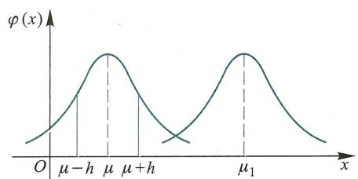  
图2.8

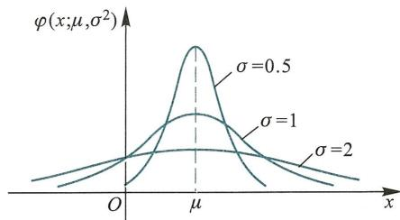  
图2.9

从图形中可以看出, 正态分布中的两个参数  $\mu$  和  $\sigma$  有非常重要的意义:

若固定  $\sigma$  ,改变  $\mu$  的值,则图形沿着  $x$  轴平移,不改变其形状(图2.8);参数  $\mu$  确定了正态概率曲线的中心位置,称  $\mu$  为位置参数.

若固定  $\mu$  ,改变  $\sigma$  的值,则当  $\sigma$  越小时,  $\phi \left(x;\mu ,\sigma^{2}\right)$  的最大值越大,其曲线越陡(图2.9),因而  $X$  落在  $\mu$  附近的概率越大,即参数  $\sigma$  反映了随机变量  $X$  取值的分散程度.

若随机变量  $X\sim N(\mu ,\sigma^{2})$  ,其分布函数为

$$
\Phi \left(x;\mu ,\sigma^{2}\right) = \frac{1}{\sigma\sqrt{2\pi}}\int_{-\infty}^{x}\exp \left\{\frac{-\left(t - \mu\right)^{2}}{2\sigma^{2}}\right\} \mathrm{d}t,x\in \mathbf{R}. \tag{2.3.6}
$$

若  $X$  服从标准正态分布,其分布函数记为

$$
\Phi \left(x\right) = \int_{-\infty}^{x}{\frac{1}{\sqrt{2\pi}}}\mathrm{e}^{-{\frac{t^{2}}{2}}}\mathrm{d}t,x\in \mathbf{R}. \tag{2.3.7}
$$

为计算方便,人们编制了标准正态分布表(见附表2)以供查阅.易知

$$
\Phi \left(-x\right) = 1 - \Phi \left(x\right), \tag{2.3.8}
$$

故附表2仅对  $x\geqslant 0$  给出  $\Phi \left(x\right)$  的函数值.

正态分布随机变量的概率计算都能归结为标准正态分布随机变量的概率计算,有如下常用计算式:

(1)若随机变量  $X\sim N(0,1)$  ,则

$$
P\left\{a{<}X\leqslant b\right\} = \Phi \left(b\right) - \Phi \left(a\right). \tag{2.3.9}
$$

(2)若随机变量  $X\sim N(\mu ,\sigma^{2})$  ,则

$$
P\left\{x_{1}{<}X\leqslant x_{2}\right\} = \Phi \left(\frac{x_{2}{-}\mu}{\sigma}\right) - \Phi \left(\frac{x_{1}{-}\mu}{\sigma}\right). \tag{2.3.10}
$$

事实上,在式(2.3.6)中,令  $x = \frac{t - \mu}{\sigma}$  有  $\mathrm{d}t = \sigma \mathrm{d}y$  ,则

$$
\Phi \left(x;\mu ,\sigma^{2}\right) = \frac{1}{\sqrt{2\pi}}\int_{-\infty}^{\frac{x - \mu}{\sigma}}\mathrm{e}^{-\frac{y^{2}}{2}}\mathrm{d}y = \Phi \left(\frac{x - \mu}{\sigma}\right).
$$

例2.3.5 设随机变量  $X\sim N(0,1)$  ,试求:

(1)  $P\left\{1{<}X\leqslant 2\right\}$

(2)  $P\left\{-2{<}X\leqslant -1\right\}$

(3)  $P\left\{ \begin{array}{l}{\left| X\right| > 1.5\right\} .} \end{array}$

解(1)  $P\left\{1{<}X\leqslant 2\right\} = \Phi \left(2\right) - \Phi \left(1\right) = 0.9772 - 0.8413 = 0.1359.$

根据概率密度  $\phi (x)$  的对称性, 有

$$
\begin{array}{r l} & {P{ \begin{array}{l}{-2< X\leqslant -1} = P{1< X\leqslant 2} = 0.135 9.} \end{array} }\\ & {P{ \begin{array}{l}{| X| > 1.5} = 1 - P{ \begin{array}{l}{| X| \leqslant 1.5}} \end{array} }\\ & {\qquad = 1 - [ \begin{array}{l}{\phi (1.5) - \phi (-1.5)} \end{array} ] = 2 - 2\phi (1.5)}\\ & {\qquad = 2 - 2\times 0.933 2 = 0.133 6.} \end{array}
$$

例2.3.6 设随机变量  $X \sim N(1,4)$ , 试求:

(1)  $P\{X \leqslant -3\}$ ;

(2)  $P\{1 \leqslant X \leqslant 3\}$ ;

(3)  $P\{ \mid X \mid >1\}$ ;

(4)  $P\{0 < X \leqslant 1.6\}$ .

解 (1)  $P\{X \leqslant - 3\} = \Phi \left(\frac{- 3 - 1}{2}\right) = \Phi (- 2)$

$$
= 1 - \Phi (2) = 1 - 0.9772 = 0.0228.
$$

(2)  $P\{1 \leqslant X \leqslant 3\} = \Phi \left(\frac{3 - 1}{2}\right) - \Phi \left(\frac{1 - 1}{2}\right) = \Phi (1) - \Phi (0)$ $= 0.8413 - 0.5 = 0.3413$ .

(3)  $P\{ \mid X \mid >1\} = 1 - P\{ \mid X \mid \leqslant 1\} = 1 - \left[\Phi \left(\frac{1 - 1}{2}\right) - \Phi \left(\frac{-1 - 1}{2}\right)\right]$ $= 1 - \Phi (0) + \Phi (-1) = 2 - \Phi (0) - \Phi (1)$ $= 2 - 0.5 - 0.8413 = 0.6587$ .

(4)  $P\{0 < X \leqslant 1.6\} = \Phi \left(\frac{1.6 - 1}{2}\right) - \Phi \left(\frac{0 - 1}{2}\right) = \Phi (0.3) - \Phi (-0.5)$ $= \Phi (0.3) - 1 + \Phi (0.5) = 0.6179 - 1 + 0.6915$ $= 0.3094$ .

例2.3.7 设随机变量  $X \sim N(\mu , \sigma^2)$ , 求  $X$  落在区间  $(\mu - k\sigma , \mu + k\sigma)$  内的概率,  $k = 1, 2, 3$ .

$$
\begin{array}{r l} & {P\left\{\mu -\sigma < X< \mu +\sigma \right\} = \Phi \left(\frac{\mu + \sigma - \mu}{\sigma}\right) - \Phi \left(\frac{\mu - \sigma - \mu}{\sigma}\right)}\\ & {\qquad = \Phi \left(1\right) - \Phi \left(-1\right) = 2\Phi \left(1\right) - 1 = 0.6826.}\\ & {P\left\{\mu -2\sigma < X< \mu +2\sigma \right\} = 2\Phi \left(2\right) - 1 = 0.9544.}\\ & {P\left\{\mu -3\sigma < X< \mu +3\sigma \right\} = 2\Phi \left(3\right) - 1 = 0.9974.} \end{array}
$$

由此可见, 正态随机变量  $X$  在以位置参数  $\mu$  为中心, 半径为  $3\sigma$  的对称区间内取

值的概率达  $99\%$  以上,  $X$  几乎不在  $(\mu - 3\sigma , \mu + 3\sigma)$  之外取值.

例2.3.8 设随机变量  $X \sim N(0,1)$ , 若

$$
P\{X > u_{\alpha}\} = \int_{u_{\alpha}}^{+\infty} \frac{1}{\sqrt{2\pi}} \mathrm{e}^{\frac{t^2}{2}} \mathrm{d}t = \alpha ,
$$

则称  $u_{\alpha}$  是标准正态分布的上侧分位数 (见图2.10).

因  $P\{X > u_{\alpha}\} = 1 - P\{X \leqslant u_{\alpha}\} = 1 - \Phi (u_{\alpha}) = \alpha$ ,

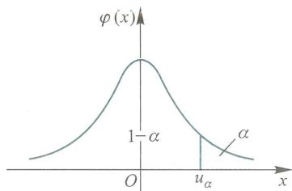  
图2.10

得

$$
\Phi (u_{\alpha}) = 1 - \alpha .
$$

可利用标准正态分布表查得上侧分位数,当  $\alpha = 0.05$  时,有  $\Phi (u_{0.05}) = 1 - 0.05 =$  0.95,查得  $u_{0.05} = 1.645$

例2.3.9某人需乘车到飞机场搭乘飞机,现有两条路线可供选择.走第一条路线所需时间为  $X_{1}, X_{1} \sim N(50,100)$  (单位:  $\min$ ); 走第二条路线所需时间为  $X_{2}, X_{2} \sim N(60,16)$ . 为及时赶到机场,问

(1)若有  $70 \mathrm{min}$ ,应选择哪一条路线更有把握?若有  $65 \mathrm{min}$  呢?

(2)若走第一条线路,并以  $95\%$  的概率保证能及时赶上飞机,距飞机起飞时刻至少需要提前多少时间出发?

解(1)若有  $70 \mathrm{min}$  可用,两条线路可及时赶到机场的概率分别为

$$
P\left\{0< X_{1} \leqslant 70\right\} = \Phi \left(\frac{70 - 50}{10}\right) - \Phi \left(\frac{0 - 50}{10}\right) = \Phi (2) - \Phi (-5) \approx \Phi (2),
$$

$$
P\left\{0< X_{2} \leqslant 70\right\} = \Phi \left(\frac{70 - 60}{4}\right) - \Phi \left(\frac{0 - 60}{4}\right) = \Phi (2.5) - \Phi (-15) \approx \Phi (2.5),
$$

因为  $\Phi (2.5)$  大于  $\Phi (2)$ ,所以选择第二条路线为好

若有  $65 \mathrm{min}$  可用,有

$$
P\left\{0< X_{1} \leqslant 65\right\} = \Phi \left(\frac{65 - 50}{10}\right) - \Phi \left(\frac{0 - 50}{10}\right) \approx \Phi (1.5),
$$

$$
P\left\{0< X_{2} \leqslant 65\right\} = \Phi \left(\frac{65 - 60}{4}\right) - \Phi \left(\frac{0 - 60}{4}\right) \approx \Phi (1.25),
$$

因为  $\Phi (1.5)$  大于  $\Phi (1.25)$ ,所以应选择第一条路线

(2)设需要提前  $x \mathrm{min}$  出发,应有

$$
0.95 \leqslant P\left\{0< X_{1} \leqslant x\right\} \approx \Phi \left(\frac{x - 50}{10}\right),
$$

故  $\frac{x - 50}{10} \geqslant 1.65$ ,解得  $x \geqslant 66.5$ . 因此距飞机起飞时刻至少需要提前  $66.5 \mathrm{min}$  出发,才能以  $95\%$  的概率保证能及时赶上飞机.

# 2.4 应用

随着现代科技的发展,各种设备系统的结构日趋复杂,诸如卫星、火箭、飞机、导航系统等各类系统的可靠性被提上了科学研究的日程.提高系统的工作可靠性,可从两方面着手:一是提高每一组成元件的可靠性,二是研究系统的最佳设计、使用与维修方案等.这里介绍两个利用概率论对系统可靠性进行量化分析的例子.

# 一、元件的寿命

考虑某个元件,假定它在  $t = 0$  时开始正常工作,一直持续到时刻  $T$ ,在  $T$  时刻发生故障,则称  $T$  为首次故障时刻,或称它为元件的寿命.

记随机变量  $T$  的分布函数为  $F(t)$ , 称

$$
R(t) = P\{T > t\} = 1 - F(t)
$$

为此元件的可靠性函数.  $R(t)$  为元件在  $[0, t]$  中正常工作的概率, 由分布函数的性质易知

(1)  $0 \leqslant R(t) \leqslant 1, R(0) \leqslant 1, R(+\infty) = 0$ ;

(2)当  $t< 0$  时,  $R(t) = 1$  ;当  $t > 0$  时,  $R(t)$  是严格单降函数;

(3)  $P\{t < T \leqslant t + \Delta t\} = R(t) - R(t + \Delta t), t > 0, \Delta t > 0$ .

设  $T$  是元件的寿命, 称

$$
\lambda (t) = \lim_{\Delta t \to 0^{+}} \frac{1}{\Delta t} P\{T \leqslant t + \Delta t \mid T > t\}
$$

为  $T$  的瞬时失效率 (故障率).

$\lambda (t)$  是元件在  $t$  时刻以前正常工作, 在  $t$  时刻失效的条件概率.

元件的寿命  $T$  的分布函数  $F(t)$ , 可靠性函数  $R(t)$ , 以及瞬时失效率  $\lambda (t)$  有下述关系成立:

(1)  $R(t) = 1 - F(t)$ ;(2.4.1)

(2)  $\lambda (t) = \frac{R'(t)}{R(t)}, t > 0$ ;(2.4.2)

(3)  $R(t) = \exp \left\{-\int_{0}^{t} \lambda (s) \mathrm{d}s\right\} , t > 0$ .(2.4.3)

证明 (1) (2.4.1) 式显然成立.

(2)当  $t > 0$  时,  $P\{T \leqslant t + \Delta t \mid T > t\} = \frac{P\{t < T < t + \Delta t\}}{P\{T > t\}} = \frac{R(t) - R(t + \Delta t)}{R(t)}$ ,

$$
\lambda (t) = \lim_{\Delta t \to 0^{+}} \frac{1}{\Delta t} \frac{R(t) - R(t + \Delta t)}{R(t)} = \frac{1}{R(t)} \lim_{\Delta t \to 0^{+}} \frac{-[R(t + \Delta t) - R(t)]}{\Delta t} = \frac{R'(t)}{R(t)}.
$$

(3) 若设初值条件  $R(0) = 1$ , 求解微分方程

$$
\left\{ \begin{array}{l} \lambda (t) = -\frac{1}{R(t)} R'(t), \\ R(0) = 1, \end{array} \right.
$$

得

$$
R(t) = \exp \left\{-\int_{0}^{t} \lambda (s) \mathrm{d}s\right\} .
$$

由瞬时失效率的定义知  $\lambda (t)$  是非负函数, 且由函数增量公式

$$
R(t + \Delta t) - R(t) = R'(t) \Delta t + o(\Delta t)
$$

以及  $\lambda (t) = - \frac{R'(t)}{R(t)}$ , 可得

$$
P\{T \leqslant t + \Delta t \mid T > t\} = \frac{R(t) - R(t + \Delta t)}{R(t)} = \lambda (t) \Delta t + o(\Delta t).
$$

很多种类的元器件在稳定工作的情形, 其寿命在  $t$  时刻的瞬时失效率可看成常数

$$
\lambda (t) = \lambda , \lambda > 0,
$$

即有

$$
P\left\{T\leqslant t + \Delta t\mid T > t\right\} = \lambda \Delta t + o\left(\Delta t\right).
$$

代入式(2.4.1)—(2.4.3),得

$$
R(t) = \exp \biggl \{-\int_{0}^{t}\lambda \mathrm{d}s\biggr \} = \mathrm{e}^{-\lambda t},t > 0,
$$

$$
F(t) = 1 - R(t) = \left\{ \begin{array}{l l}{1 - \mathrm{e}^{-\lambda t},} & {t > 0,}\\ {0,} & {t\leqslant 0.} \end{array} \right.
$$

元器件工作相当长时间以后,会产生老化现象,若瞬时失效率与时间增长成正比,设

$$
\lambda \left(t\right) = \lambda^{2}t,\lambda >0,
$$

得

$$
R(t) = \exp \biggl \{-\int_{0}^{t}\lambda^{2}s\mathrm{d}s\biggr \} = \exp \biggl \{-\frac{\lambda^{2}t^{2}}{2}\biggr \} ,
$$

$$
F(t) = \left\{ \begin{array}{l l}{1 - \exp \biggl \{-\frac{t^{2}\lambda^{2}}{2}\biggr \} ,} & {t > 0,}\\ {0,} & {t\leqslant 0.} \end{array} \right.
$$

利用前面的结果,我们还可以讨论更复杂的情形,

# 二、计算的可靠性

用三台计算机独立地并行工作,每次的计算结果采用三台机器"少数服从多数"的原则进行判决,以期提高计算的可靠性。另一方面,使用的机器多了,元件总数增多,出错的机会也增多。那么,这种三台机器按多数表决的工作方式是否一定会提高可靠性?在什么条件下最有利?可靠性的"效率"最大可提高多少?下面我们对这些问题做初步的定量分析。

假定三台机器是同类型的,记每台计算机的寿命为  $\xi$ ,其分布函数为

$$
F(t) = \left\{ \begin{array}{l l}{1 - \mathrm{e}^{-\lambda t},} & {t > 0,}\\ {0,} & {t\leqslant 0.} \end{array} \right.
$$

可靠性函数为

$$
R(t) = P\left\{\xi >t\right\} = \mathrm{e}^{-\lambda t},t > 0.
$$

通常把  $\beta = \lambda t$  称为规格化时间,令  $A = \left\{ \begin{array}{l l} \end{array} \right.$  在  $\beta$  时间内单机正常工作  $\left.\right\}$  ,则

$$
P(A) = \mathrm{e}^{-\beta}. \tag{2.4.4}
$$

由于三台机器独立地工作,因此可考虑伯努利概型,用  $\eta$  表示  $A$  出现的次数,则

$$
\eta \sim B(3,\mathrm{e}^{-\beta}).
$$

三台机器并行工作,执行正确,就表明  $A$  至少出现两次,其概率为

$$
\begin{array}{r l} & {P\left\{\eta \geqslant 2\right\} = P_{3}(2) + P_{3}(3) = \mathrm{C}_{3}^{2}(\mathrm{e}^{-\beta})^{2}(1 - \mathrm{e}^{-\beta}) + \mathrm{C}_{3}^{3}(\mathrm{e}^{-\beta})^{3}}\\ & {\qquad = 3\mathrm{e}^{-2\beta}(1 - \mathrm{e}^{-\beta}) + \mathrm{e}^{-3\beta}.} \end{array} \tag{2.4.5}
$$

(2.4.5)

所谓三台表决比单机可靠,表明以下不等式成立:

$$
P\left\{\eta \geqslant 2\right\} \geqslant P(A),
$$

即

$$
3\mathrm{e}^{-2\beta}(1 - \mathrm{e}^{-\beta}) + \mathrm{e}^{-3\beta}\geqslant \mathrm{e}^{-\beta},
$$

解得

$$
\mathrm{e}^{-\beta} (3 \mathrm{e}^{-\beta} - 2 \mathrm{e}^{-2 \beta} - 1) \geqslant 0.
$$

因  $\mathrm{e}^{- \beta} > 0$ , 有

$$
3 \mathrm{e}^{-\beta} - 2 \mathrm{e}^{-2 \beta} - 1 \geqslant 0. \tag{2.4.6}
$$

令

$$
f(\beta) = 3 \mathrm{e}^{-\beta} - 2 \mathrm{e}^{-2 \beta} - 1, \beta > 0.
$$

由高等数学知识可知  $f(\beta)$  在  $\beta = - \ln \frac{3}{4} = \frac{f(\beta)}{0.288}$  处有一极大值, 且  $f(\beta)$  的函数图像如图2.11所示. 当规格化工作时间  $\beta$  在0.7以下, 式(2.4.6)才成立, 且当  $0.2 < \beta < 0.4$  时才比较明显地表示出三机协同工作比单机工作优越; 当  $\beta > 0.7$  时, 三机协同工作的可靠性反而不如单机.

记

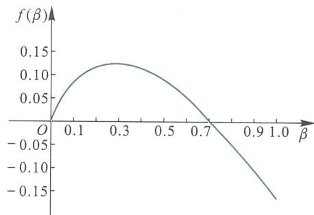  
图2.11

$$
E = \frac{P(\eta \geqslant 2) - P(A)}{P(A)},
$$

$E$  表示三机协同工作相对单机工作所能改善的可靠性的"效率". 将式(2.4.4)和(2.4.5)代入上式, 得

$$
\begin{array}{l}{{ E=\frac{3\mathrm{e}^{-\beta}(1-\mathrm{e}^{-\beta})+\mathrm{e}^{-2\beta}-\mathrm{e}^{-\beta}}{\mathrm{e}^{-\beta}}=3\mathrm{e}^{-\beta}(1-\mathrm{e}^{-\beta})+\mathrm{e}^{-2\beta}-1}}\\ {{\ }}\\ {{\ }}\\ {{\ }}\\ {{\ }}\end{array} \tag{2.4.7}
$$

前面引进的函数  $f(\beta)$  即提高的可靠性的效率. 因此三机协同工作最大可能提高的效率为

$$
E_{\mathrm{max}} = f \left(-\ln \frac{3}{4}\right) = 12.5\% .
$$

应考虑到, 这里提高的  $12.5\%$  的可靠性效率是由多用两台机器设备为代价取得的.

# 一、练习题

1. 一批晶体管中有9个合格品和3个不合格品, 从中任取一个安装在电子设备上, 若取出不合格品, 则不再放回, 求在取得合格品以前已取出的不合格品数的分布律.

2. 做一系列独立试验, 每次试验成功的概率为  $p (0 < p < 1)$ , 求:

(1) 首次成功时试验次数  $Y$  的分布律;

(2) 在  $n$  次成功之前已经失败次数  $X$  的分布律.

3. 设随机变量  $X$  的分布律为

$$
P\left\{X = k\right\} = C\cdot \left(\frac{2}{3}\right)^{k},k = 1,2,3.
$$

求  $C$  的值.

4. 随机变量  $X$  的分布律为

$$
P\left\{X = k\right\} = \left(1 - a\right)a^{k},\quad k = 0,1,2,\dots .
$$

(1)  $a$  可取何值?

(2)证明对于任意两个正整数  $s$  和  $t$  ,有

$$
P\left\{X > s + t\mid X > s\right\} = P\left\{X\geqslant t\right\} .
$$

5. 一批产品共有25件,其中5件次品,从中随机地一个一个取出检查,共取4次,设  $X$  是其中的次品数,若

(1)每次取出的产品仍放回;

(2)每次取出的产品不再放回,

写出  $X$  的分布律.

6. 某射手每次射击击中目标的概率为0.8,现连续射击30次,写出击中目标的次数  $X$  的分布律,并求出30次射击未击中目标的概率.

7. 一放射源放射出的任一粒子穿透某一屏蔽的概率是0.01,现放射出100个粒子,求至少有两个粒子穿透屏蔽的概率.

8. 设随机变量  $X$  服从泊松分布,且  $P\{X = 1\} = P\{X = 2\}$  ,计算  $P\{X = 4\}$

9. 在一个周期内,从一个放射源放射出的粒子数  $X$  是服从泊松分布的随机变量,如果无粒子放射出的概率为  $\frac{1}{3}$  ,试求:

(1)  $X$  的分布律;

(2)放射出一个及更多粒子的概率.

10. 一个口袋中有六个球,在这六个球上标明的数字分别为  $-3, -3,1,1,1,2$  ,从袋中任取一个球,试求取得的球上标明的数字  $X$  的分布律及分布函数.

11. 设随机变量  $X$  的分布函数为  $F(x)$  ,用  $F(x)$  表示下述概率:

(1)  $P\{X< a\} ;(2)P\{X = a\} ;(3)P\{X\geqslant a\} ;(4)P\{X = a\} .$

12. (柯西分布)随机变量  $X$  的分布函数是

$$
F(x) = A + B\arctan x,\quad -\infty < x< +\infty ,
$$

试求:

(1)系数  $A$  和  $B$

(2)  $X$  落在区间  $(-1,1)$  内的概率;

(3)  $X$  的概率密度.

13. 设随机变量  $X$  的分布函数为

$$
F(x) = {\left\{ \begin{array}{l l}{1 - (1 + x)\mathrm{e}^{-x},} & {x > 0,}\\ {0,} & {x\leqslant 0.} \end{array} \right.}
$$

试求  $X$  的概率密度,并计算  $P\{X\leqslant 1\}$  和  $P\{X > 3\}$

14. 设随机变量  $X$  的概率密度为

$$
f(x) = A\mathrm{e}^{-2\mid x\mid},\quad -\infty < x< +\infty ,
$$

试求:(1)系数  $A$  ;(2)  $X$  的分布函数.

15. 设随机变量  $X$  的概率密度为

$$
f(x) = \begin{array}{l l}{\int 6x\big(1 - x\big),} & {0\leqslant x\leqslant 1,}\\ {0,} & {\mathbb{H}\mathbb{H}.} \end{array}
$$

(1)求  $X$  的分布函数;

(2)确定满足  $P\{X\leqslant b\} = P\{X > b\}$  的  $b$

16. 从一批子弹中任意抽出5发试射,若没有一发子弹落在靶心  $2\mathrm{cm}$  以外,则整批子弹将被接受.设弹着点与靶心的距离  $X$  (单位:  $\mathrm{cm}$  )的概率密度为

$$
f(x) = \left\{ \begin{array}{l l}{A x\mathrm{e}^{-x^{2}},} & {0< x< 3,}\\ {0,} & {\mathbb{H}\mathbb{H}.} \end{array} \right.
$$

试求:(1)系数  $A$  ;(2)该批子弹被接受的概率.

17. 在长为  $l$  的线段上随机地选取一点,将其分为两段,短的一段与长的一段之比小于  $\frac{1}{4}$  的概率是多少?

18. 设随机变量  $Y$  服从  $(0,5)$  上的均匀分布,求方程

$$
4x^{2} + 4x Y + Y + 2 = 0
$$

有实根的概率.

19. 一电子信号在  $(0,T)$  时间内随机地出现,设  $0< t_{0}< t_{1}< T$  ,求:

(1)信号出现在区间  $(t_{0},t_{1})$  内的概率;

(2)信号在  $t_{0}$  时刻前不出现,在  $(t_{0},t_{1})$  内出现的概率.

20. 若随机变量  $X\sim N(0,1)$  ,试求:

(1)  $P\{X\leqslant -2.5\}$  ; 
(2)  $P\{\mid X\mid >1.58\}$

21. 若随机变量  $X\sim N(2,0.16)$  ,试求:

(1)  $P\{X\geqslant 2.3\}$  
(2)  $P\{1.8\leqslant X\leqslant 2.1\}$

22. 设某城市男子的身高  $X\sim N(170,36)$  (单位:  $\mathrm{cm}$  ),问应如何选择公共汽车门的高度,使男子乘车时与车门碰头的概率小于0.01?

23. 两台电子仪器的寿命(单位:h)分别为  $X_{1},X_{2}$  ,且  $X_{1}\sim N(40,36),X_{2}\sim N(45,9)$  ,若要在  $45\mathrm{~h~}$  内使用这种仪器,问选用哪一台仪器较好?若在  $52\mathrm{~h~}$  内使用呢?

24. 某工厂生产的电子管寿命(单位:h)  $X$  服从正态分布  $N(1600,\sigma^{2})$  ,如果要求电子管的寿命在  $1200\mathrm{~h~}$  以上的概率达到0.96,求  $\sigma$  的取值范围.

25. 设随机变量  $X\sim N(60,3^{2})$  ,求分点  $x_{1},x_{2}$  ,使  $X$  分别落在  $(- \infty ,x_{1}),(x_{1},x_{2})$  , $(x_{2}, + \infty)$  的概率之比为  $3:4:5$

# 二、思考题

1. 对任意的随机变量  $X$  ,如何根据分布函数计算概率  $P\{X = a\}$  ?

2. 若随机变量  $X$  仅取可列无穷个数值,  $X$  一定是离散型随机变量吗?

3. 如何判断伯努利试验?事件  $A$  是  $n$  重伯努利试验中关注的随机事件,请考虑以下两个随机变量的分布律:

(1)  $n$  次试验中事件  $A$  发生的总次数  $X$ ;

(2) 事件  $A$  首次发生时的试验次数  $Y$ .

4. 二项分布和泊松分布有什么关系, 你认为现实中哪类随机变量可以用泊松分布描述, 请举出实例.

5. 为什么说指数分布是电子工程中的常用分布, 你理解其分布中参数  $\lambda$  的工程意义吗? 什么是指数分布的"无后效性"?

6. 已知随机变量  $X$  的分布函数为

$$
F(x) = \left\{ \begin{array}{ll} 0 & x< 0, \\ \frac{1 + x}{2}, & 0 \leqslant x< 1, \\ 1, & x \geqslant 1. \end{array} \right.
$$

请根据该分布函数的特点分析判断  $X$  是离散型随机变量还是连续型随机变量.

7. 正态分布概率曲线有什么特征? 为什么说正态分布是概率论中最重要的分布?

在实际问题中常需要同时考虑两个或两个以上的随机变量。例如,为研究某一地区学龄前儿童的身体发育情况,对该地区的儿童进行抽查,对每个儿童都要观察他的身高、体重等身体指标。又如,当一个确定的正弦信号经过信道受到随机干扰后,输出信号的振幅、相位和角频率都是随机变量。

# §3.1 二维随机变量及其分布

# 一、联合分布函数

定义3.1.1设随机试验  $E$  的样本空间为  $\Omega , X_{1}(\omega), X_{2}(\omega), \dots , X_{n}(\omega)$  是定义在  $\Omega$  上的  $n$  个随机变量,则将它们构成的有序组  $(X_{1}, X_{2}, \dots , X_{n})$  称为  $n$  维随机变量,或称  $n$  维随机向量。

前述儿童身体健康抽样试验中,样本空间为

$\Omega = \{$  该地区的全体儿童  $\}$  记儿童们的身高为  $H$  和体重为  $W$  ,则  $(H,W)$  构成定义在  $\Omega$  上的二维随机变量.

由于二维随机变量与  $n$  维随机变量没有本质的区别,为讨论简单和便于理解起见,下面着重讨论二维随机变量。

二维随机变量  $(X,Y)$  中的  $X,Y$  是定义在同一样本空间  $\Omega$  上的随机变量,将它们的分布函数分别记为

$$
F_{\scriptscriptstyle X}(x) = P\{X\leqslant x\} ,\quad F_{\scriptscriptstyle Y}(y) = P\{Y\leqslant y\} .
$$

定义3.1.2设  $(X,Y)$  是二维随机变量,  $(x,y)$  是任意实数对,记

$$
\{X\leqslant x,Y\leqslant y\} = \{X\leqslant x\} \cap \{Y\leqslant y\} ,
$$

称二元函数

$$
F(x,y) = P\{X\leqslant x,Y\leqslant y\} \tag{3.1.1}
$$

为  $(X,Y)$  的联合分布函数;  $X$  与  $Y$  的分布函数  $F_{\scriptscriptstyle X}(x)$  和  $F_{\scriptscriptstyle Y}(y)$  分别称为  $(X,Y)$  关于  $X$ $Y$  的边缘分布函数.

因

$$
P\{X\leqslant x\} = P\{X\leqslant x,Y< +\infty \} ,
$$

$$
P\{Y\leqslant y\} = P\{X< +\infty ,Y\leqslant y\} ,
$$

可得联合分布函数与边缘分布函数之间的关系如下:

$$
F_{\scriptscriptstyle X}(x) = \lim_{y\to +\infty}F(x,y),\quad F_{\scriptscriptstyle Y}(y) = \lim_{x\to +\infty}F(x,y). \tag{3.1.2}
$$

若将二维随机变量  $(X,Y)$  看成平面上随机点的坐标,则联合分布函数  $F(x,y)$  就是随机点  $(X,Y)$  落在以  $(x,y)$  为顶点,位于该点左下部阴影部分内的概率,如图3.1所示.

由图3.2不难看出,随机点  $(X,Y)$  落入矩形

$$
D = \left\{\left(x,y\right)\mid x_{1}< x\leqslant x_{2},y_{1}< y\leqslant y_{2}\right\}
$$

内的概率为

$$
P\left\{x_{1}< X\leqslant x_{2},y_{1}< Y\leqslant y_{2}\right\} = F(x_{2},y_{2}) - F(x_{2},y_{1}) - F(x_{1},y_{2}) + F(x_{1},y_{1}). \tag{3.1.3}
$$

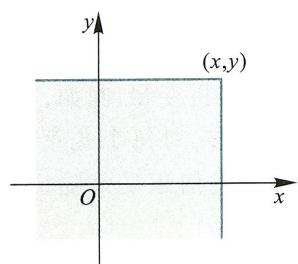  
图3.1

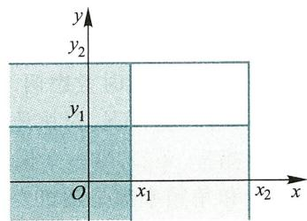  
图3.2

二维联合分布函数  $F(x,y)$  具有以下性质:

(1)  $F(x,y)$  分别对  $x,y$  单调不降,即有

当  $x_{1}< x_{2}$  时,  $F(x_{1},y)\leqslant F(x_{2},y)$  对一切  $y\in \mathbf{R}$  成立;

当  $y_{1}< y_{2}$  时,  $F(x,y_{1})\leqslant F(x,y_{2})$  对一切  $x\in \mathbf{R}$  成立.

(2)对每一个变量  $F(x,y)$  是右连续的,即有

$\lim_{x\to x_{0}^{+}}F(x,y) = F(x_{0},y)$  ,对一切  $y\in \mathbf{R}$  成立;

$\lim_{y\to y_{0}^{+}}F(x,y) = F(x,y_{0})$  ,对一切  $x\in \mathbf{R}$  成立.

(3)  $F(x,y)$  是非负有界函数:  $0\leqslant F(x,y)\leqslant 1$  ,而且有

$$
\lim_{x\to -\infty}F(x,y) = 0,\quad \lim_{y\to -\infty}F(x,y) = 0,\quad \lim_{x\to +\infty}F(x,y) = 1.
$$

(4)对于任意实数  $x_{1}\leqslant x_{2},y_{1}\leqslant y_{2}$  ,有

$$
F(x_{2},y_{2}) - F(x_{2},y_{1}) - F(x_{1},y_{2}) + F(x_{1},y_{1})\geqslant 0.
$$

容易证明以上性质.需指出,若二元函数  $F(x,y)$  满足上述四条性质,则一定存在二维随机变量  $(X,Y)$  以  $F(x,y)$  为联合分布函数.

例3.1.1 二元函数

$$
F(x,y)={\left\{\begin{array}{l l}{1,}&{x+y\geqslant0,}\\ {0,}&{x+y< 0.}\end{array}\right.}
$$

具有性质(1)、(2)、(3),但有

$$
F(1,1) - F(1, - 1) - F(-1,1) + F(-1, - 1) = 1 - 1 - 1 + 0 = -1,
$$

即不满足分布函数的性质(4),故  $F(x,y)$  不是联合分布函数.

例3.1.2 二维随机变量  $(X,Y)$  的联合分布函数为

$$
F(x,y)={\left\{\begin{array}{l l}{1-2^{-x}-2^{-y}+2^{-x-y},}&{x\geqslant0,y\geqslant0,}\\ {0,}&{{\mathrm{~}}{\mathrm{~}}{\mathrm{~}}{\mathrm{~}}{\mathrm{~}}{\mathrm{~}}{\mathrm{~}}{\mathrm{~}}{\mathrm{~}}{\mathrm{~}}{\mathrm{~}}{\mathrm{~}}{\mathrm{~}}{\mathrm{~}}{\mathrm{~}}{\mathrm{~}}{\mathrm{~}}{\mathrm{~}}{\mathrm{~}}{\mathrm{~}}{\mathrm{~}}}\end{array}\right.}
$$

求边缘分布函数  $F_{X}(x)$  和  $F_{Y}(y)$  ,以及概率  $P\left\{1< X\leqslant 2,3< Y\leqslant 5\right\}$

解

$$
F_{X}(x) = \lim_{y\to +\infty}F(x,y) = \left\{ \begin{array}{l l}{1 - 2^{-x},} & {x\geqslant 0,}\\ {0,} & {x< 0.} \end{array} \right.
$$

$$
\begin{array}{r l} & {\quad F_{y}(y) = \underset {x\rightarrow +\infty}{\lim}F(x,y) = \left\{ \begin{array}{l l}{1 - 2^{-y},} & {y\geqslant 0,}\\ {0,} & {y< 0.} \end{array} \right.}\\ & {\quad P\left\{1< X\leqslant 2,3< Y\leqslant 5\right\} = F(2,5) - F(2,3) - F(1,5) + F(1,3)}\\ & {\quad \quad \quad \quad = (1 - 2^{-2} - 2^{-5} + 2^{-7}) - (1 - 2^{-2} - 2^{-3} + 2^{-5}) - (1 - 2^{-1} - 2^{-5} + 2^{-6}) + }\\ & {\quad \quad \quad \quad (1 - 2^{-1} - 2^{-3} + 2^{-4})}\\ & {\quad \quad \quad \quad = \frac{3}{128}.} \end{array}
$$

$n$  维随机变量  $(X_{1}, X_{2}, \dots , X_{n})$  的联合分布函数定义为

$$
F(x_{1}, x_{2}, \dots , x_{n}) = P\{X_{1} \leqslant x_{1}, X_{2} \leqslant x_{2}, \dots , X_{n} \leqslant x_{n}\} , \tag{3.1.4}
$$

式中  $x_{1}, x_{2}, \dots , x_{n}$  是  $n$  个任意实数.

由  $(X_{1}, X_{2}, \dots , X_{n})$  的联合分布函数可确定其中任意  $k$  个  $(1 \leqslant k \leqslant n)$  分量的联合分布函数,称为  $k$  维边缘分布函数,例如

$$
F_{X_{1}}(x_{1}) = F(x_{1}, +\infty , \dots , +\infty), F_{X_{1}, X_{2}}(x_{1}, x_{2}) = F(x_{1}, x_{2}, +\infty , \dots , +\infty)
$$

是  $(X_{1}, X_{2}, \dots , X_{n})$  分别关于  $X_{1}, (X_{1}, X_{2})$  的边缘分布函数.

$n$  维联合分布函数有类似于二维联合分布函数的性质.

# 二、联合分布律

定义3.1.3 二维随机变量  $(X, Y)$  所有可能取值为有限对或可列无穷对:  $(x_{i}, y_{j})$ ,  $i, j = 1, 2, \dots$ , 记

$$
P\{X = x_{i}, Y = y_{j}\} = p_{ij} \quad (i, j = 1, 2, \dots) \tag{3.1.5}
$$

满足以下条件:

(1)  $p_{ij} \geqslant 0 (i, j = 1, 2, \dots)$ ; 
(2)  $\sum_{i = 1}^{\infty} \sum_{j = 1}^{\infty} p_{ij} = 1$ ,

则称  $(X, Y)$  为二维离散型随机变量. 称式(3.1.5)为  $(X, Y)$  的联合分布律.

关于  $(X, Y)$  的联合分布律,有如下性质:

性质3.1.1 随机变量  $(X, Y)$  的联合分布函数为

$$
F(x, y) = \sum_{x_{i} \leqslant x} \sum_{y_{j} \leqslant y} p_{ij}. \tag{3.1.6}
$$

性质3.1.2 随机变量  $X$  与  $Y$  的分布律为

$$
P\{X = x_{i}\} = p_{i}. = \sum_{j = 1}^{\infty} p_{ij} \quad (i = 1, 2, \dots), \tag{3.1.7}
$$

$$
P\{Y = y_{j}\} = p_{.j} = \sum_{i = 1}^{\infty} p_{ij} \quad (j = 1, 2, \dots). \tag{3.1.8}
$$

证

$$
\begin{array}{r l} & {P\left\{X = x_{i}\right\} = P\Big(\left\{X = x_{i}\right\} \cap \Big[\bigcup_{j = 1}^{\infty}\left\{Y = y_{j}\right\} \Big]\Big)}\\ & {\qquad = P\Big(\bigcup_{j = 1}^{\infty}\left[\left\{X = x_{i}\right\} \cap \left\{Y = y_{j}\right\} \right]\Big)}\\ & {\qquad = \sum_{j = 1}^{\infty}P\left\{X = x_{i},Y = y_{j}\right\} = \sum_{j = 1}^{\infty}p_{i j}.} \end{array}
$$

同理

$$
P\left\{Y = y_{j}\right\} = \sum_{i = 1}^{\infty}p_{ij}.
$$

人们习惯用表3.1.1的形式给出二维离散型随机变量的联合分布律.

表3.1.1 二维离散型随机变量的联合分布律  

<table><tr><td rowspan="2">X</td><td colspan="5">Y</td><td rowspan="2">p i.</td></tr><tr><td>y1</td><td>y2</td><td>...</td><td>y2</td><td>...</td></tr><tr><td>x1</td><td>p11</td><td>p12</td><td>...</td><td>p1j</td><td>...</td><td>p1.</td></tr><tr><td>x2</td><td>p21</td><td>p22</td><td>...</td><td>p2j</td><td>...</td><td>p2.</td></tr><tr><td>...</td><td>...</td><td>...</td><td></td><td>...</td><td></td><td>...</td></tr><tr><td>xi</td><td>p i1</td><td>p i2</td><td>...</td><td>p i j</td><td>...</td><td>p i.</td></tr><tr><td>...</td><td>...</td><td>...</td><td></td><td>...</td><td></td><td>...</td></tr><tr><td>p j</td><td>p .1</td><td>p .2</td><td>...</td><td>p . j</td><td>...</td><td>1</td></tr></table>

由表3.1.1可见,将表格中的各行的元素相加,置于最后一列,构成随机变量  $X$  的分布律;将表格中各列的元素相加,排在最下一行,构成了随机变量  $Y$  的分布律,通常称为  $X$  和  $Y$  的边缘分布律.

例3.1.3(有放回摸球试验)袋子中装有2只白色球和3只黑色球,现从中有放回地摸球,每次摸一个,用  $X$  表示第一次摸出的白球数,用  $Y$  表示第二次摸出的白球个数,表3.1.2给出了  $(X,Y)$  的联合分布律以及关于  $X,Y$  的边缘分布律.

表3.1.2 有放回摸球  

<table><tr><td rowspan="2">X</td><td colspan="2">Y</td><td rowspan="2">p i.</td></tr><tr><td>0</td><td>1</td></tr><tr><td>0</td><td>3/5·3/5</td><td>3/5·2/5</td><td>3/5</td></tr><tr><td>1</td><td>2/5·3/5</td><td>2/5·2/5</td><td>2/5</td></tr><tr><td>p j</td><td>3/5</td><td>2/5</td><td></td></tr></table>

例3.1.4(不放回摸球试验)将上例中的试验改为不放回摸球,则  $(X,Y)$  的联合分布律,关于  $X,Y$  的边缘分布律由表3.1.3给出.

<table><tr><td rowspan="2">X</td><td colspan="2">Y</td><td rowspan="2">pi.</td></tr><tr><td>0</td><td>1</td></tr><tr><td>0</td><td>3·2/5·4</td><td>3·2/5·4</td><td>3/5</td></tr><tr><td>1</td><td>2/5·3/4</td><td>2/5·1/4</td><td>2/5</td></tr><tr><td>p1,</td><td>3/5</td><td>2/5</td><td></td></tr></table>

根据式(3.1.7)和式(3.1.8),由  $(X,Y)$  的联合分布律可以完全确定  $X,Y$  的边缘分布律.例3.1.3和例3.1.4中  $X,Y$  的边缘分布律都相同,但两个例子却有完全不同的联合分布律.应认识到:二维随机变量的分布不仅与两个分量有关,还与各分量间的联系有关.

例3.1.5(二维两点分布)设随机变量  $(X,Y)$  的联合分布律如表3.1.4所示,其中  $0< p< 1$  ,称  $(X,Y)$  服从二维两点分布,写出  $(X,Y)$  的联合分布函数.

<table><tr><td rowspan="2">X</td><td>Y</td><td></td></tr><tr><td>0</td><td>1</td></tr><tr><td>0</td><td>1-p</td><td>0</td></tr><tr><td>1</td><td>0</td><td>p</td></tr></table>

解当  $x< 0$  或  $y< 0$  ,  $F(x,y) = P\{X\leqslant x,Y\leqslant y\} = 0;$

当  $0\leqslant x< 1$  且  $y\geqslant 0$  ,  $F(x,y) = P\{X\leqslant x,Y\leqslant y\} = p_{00} = 1 - p;$

当  $0\leqslant y< 1$  且  $x\geqslant 1$  ,  $F(x,y) = P\{X\leqslant x,Y\leqslant y\} = p_{00} = 1 - p;$

当  $x\geqslant 1$  且  $y\geqslant 1$  ,  $F(x,y) = P\{X\leqslant x,Y\leqslant y\} = p_{00} + p_{11} = 1,$

综合得(见图3.3)

$$
F(x,y) = \left\{ \begin{array}{ll}0, & x< 0\text{或} y< 0, \\ 1 - p, & 0\leqslant x< 1,y\geqslant 0\text{或} 0\leqslant y< 1,x\geqslant 1, \\ 1, & x\geqslant 1,y\geqslant 1. \end{array} \right.
$$

# 三、联合概率密度

定义3.1.4二维随机变量  $(X,Y)$  的联合分布函数为  $F(x,y)$  ,如果存在函数  $f(x,y)\geqslant 0$  ,使得对于任意实数对  $(x,y)$  有

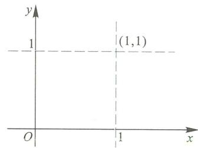  
图3.3

$$
F(x,y) = \int_{-\infty}^{x}\int_{-\infty}^{y}f(u,v)\mathrm{d}u\mathrm{d}v, \tag{3.1.9}
$$

则称  $(X,Y)$  是连续型的二维随机变量,函数  $f(x,y)$  称为  $(X,Y)$  的联合概率密度.

类似于一维的情形,联合概率密度  $f(x,y)$  具有以下性质:

(1)  $f(x,y)\geqslant 0$  处处成立;

$$
\int_{-\infty}^{+\infty}\int_{-\infty}^{+\infty}f(x,y)\mathrm{d}x\mathrm{d}y = 1.
$$

凡是满足性质(1)和(2)的二元函数  $f(x,y)$  必为某个二维随机变量的联合概率密度.

(3)若  $G\subset \mathbf{R}^{2}$  ,则有

$$
P\left\{\mathbf{\Psi}(X,Y)\in G\right\} = \iint_{G}f(x,y)\mathrm{d}\sigma . \tag{3.1.10}
$$

(4)随机变量  $X,Y$  的概率密度分别为

$$
f_{X}(x) = \int_{-\infty}^{+\infty}f(x,y)\mathrm{d}y,\quad x\in \mathbf{R}, \tag{3.1.11}
$$

$$
f_{Y}(y) = \int_{-\infty}^{+\infty}f(x,y)\mathrm{d}x,\quad y\in \mathbf{R}, \tag{3.1.12}
$$

则称  $f_{X}(x),f_{Y}(y)$  为  $(X,Y)$  关于  $X,Y$  的边缘概率密度

因为

$$
F_{_{X}}(x) = F(x, + \infty) = \int_{-\infty}^{x}\left[\int_{-\infty}^{+\infty}f(u,v)\mathrm{d}v\right]\mathrm{d}u,
$$

$$
f_{X}(x) = F_{X}^{\prime}(x) = \int_{-\infty}^{+\infty}f(x,v)\mathrm{d}v,
$$

所以

$$
f_{X}(x) = \int_{-\infty}^{+\infty}f(x,y)\mathrm{d}y.
$$

同理可证得公式(3.1.12).

例3.1.6 已知二维随机变量  $(X,Y)$  的联合概率密度为

$$
f(x,y) = \left\{ \begin{array}{l l}{K\mathrm{e}^{-(2x + y)},} & {x > 0,y > 0,}\\ {0,} & {\mathrm{~}\mathbb{H}\backslash \mathbb{H}.} \end{array} \right.
$$

试求:(1)常数  $K$

(2)边缘概率密度  $f_{X}(x)$

(3)概率  $P\{Y\leqslant X\}$

(4)联合分布函数  $F(x,y)$  和边缘分布函数  $F_{X}(x)$

$$
1 = \int_{-\infty}^{+\infty}\int_{-\infty}^{+\infty}f(x,y)\mathrm{d}x\mathrm{d}y = \int_{0}^{+\infty}\int_{0}^{+\infty}K\mathrm{e}^{-(2x + y)}\mathrm{d}x\mathrm{d}y
$$

$$
= K\left(\int_{0}^{+\infty}\mathrm{e}^{-2x}\mathrm{d}x\right)\left(\int_{0}^{+\infty}\mathrm{e}^{-y}\mathrm{d}y\right) = K\times \frac{1}{2}\times 1 = \frac{K}{2},
$$

故  $K = 2$

$$
f_{X}(x) = \int_{-\infty}^{+\infty}f(x,y)\mathrm{d}y = \left\{ \begin{array}{l l}{\int_{0}^{+\infty}2\mathrm{e}^{-2x}\mathrm{e}^{-y}\mathrm{d}y,} & {x > 0,}\\ {0,} & {x\in 0} \end{array} \right.
$$

$$
= \left\{2\mathrm{e}^{-2x},\quad x > 0,\right.
$$

(3)令  $G = \{(x,y)\mid y\leqslant x\}$

$$
P\left\{Y\leqslant X\right\} = P\left\{X,Y\right\} \in G\} = \iint_{G}f(x,y)\mathrm{d}x\mathrm{d}y
$$

$$
= \int_{0}^{+\infty}\int_{y}^{+\infty}2\mathrm{e}^{-(2x + y)}\mathrm{d}x\mathrm{d}y = \frac{1}{3}.
$$

(4)  $F(x,y) = \int_{- \infty}^{x}\int_{- \infty}^{y}f(u,v)\mathrm{d}u\mathrm{d}v$

$$
\begin{array}{rl} & {= \left\{ \begin{array}{ll}\int_{0}^{x}\int_{0}^{y}2\mathrm{e}^{-(2u + v)}\mathrm{d}u\mathrm{d}v, & x > 0,y > 0,\\ 0, & \text{其他} \end{array} \right.}\\ & {= \left\{ \begin{array}{ll}(1 - \mathrm{e}^{-2x})(1 - \mathrm{e}^{-y}), & x > 0,y > 0,\\ 0, & \text{其他}, \end{array} \right.} \end{array}
$$

$$
F_{x}(x) = \lim_{y\to +\infty}F(x,y) = \left\{ \begin{array}{ll}1 - \mathrm{e}^{-2x}, & x > 0,\\ 0, & \text{其他}. \end{array} \right.
$$

可验证有  $F_{x}^{\prime}(x) = f_{x}(x)$

例3.1.7 二维随机变量  $(X,Y)$  的联合概率密度是

$$
f(x,y) = \left\{ \begin{array}{ll}\frac{1}{2x^2y}, & 1\leqslant x< +\infty ,\frac{1}{x}\leqslant y\leqslant x,\\ 0, & \text{其他}. \end{array} \right.
$$

求关于  $Y$  的边缘概率密度  $f_{Y}(y)$ ，并检验所得  $f_{Y}(y)$  是否为概率密度.

解

$$
f_{Y}(y) = \int_{-\infty}^{+\infty}f(x,y)\mathrm{d}x = \left\{ \begin{array}{ll}\int_{\frac{1}{y}}^{+\infty}\frac{1}{2x^{2}y}\mathrm{d}x, & 0\leqslant y< 1,\\ \displaystyle \int_{y}^{+\infty}\frac{1}{2x^{2}y}\mathrm{d}x, & 1\leqslant y< +\infty ,\\ 0, & y< 0 \end{array} \right.
$$

$$
= \left\{ \begin{array}{ll}\frac{1}{2}, & 0\leqslant y< 1,\\ \displaystyle \frac{1}{2y^2}, & 1\leqslant y< +\infty ,\\ 0, & y< 0. \end{array} \right.
$$

对所有  $y$  值（见图3.4），均有  $f_{Y}(y)\geqslant 0$  成立，而且

$$
\int_{-\infty}^{+\infty}f_{Y}(y)\mathrm{d}y = \int_{-\infty}^{0}0\mathrm{d}y + \int_{0}^{1}\frac{1}{2}\mathrm{d}y + \int_{1}^{+\infty}\frac{1}{2y^{2}}\mathrm{d}y = \frac{1}{2} +\frac{1}{2} = 1.
$$

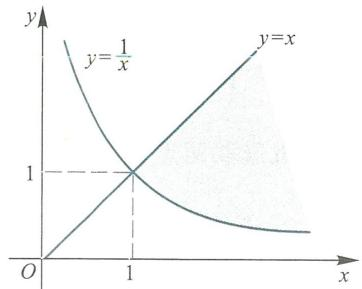  
图3.4

# 四、二维均匀分布(几何概率)

设  $G \subset \mathbf{R}^{2}$ ,其面积记为  $S(G)$ ,若二维随机变量  $(X,Y)$  的联合概率密度为

$$
f(x,y) = \left\{ \begin{array}{l l}{\frac{1}{S(G)},} & {(x,y)\in G,}\\ {0,} & {(x,y)\notin G,} \end{array} \right.
$$

则称  $(X,Y)$  在  $G$  上服从均匀分布.

设  $D$  是  $G$  的子域  $(D \subset G)$ ,则有

$$
P\left\{\left(X,Y\right)\in D\right\} = \iint_{D}{\frac{1}{S\left(G\right)}}\mathrm{d}\sigma = \frac{1}{S\left(G\right)}\iint_{D}\mathrm{d}\sigma = \frac{D\mathrm{~}\mathbb{H}\mathbb{H}\mathbb{H}}{G\mathrm{~}\mathbb{H}\mathbb{H}\mathbb{H}}. \tag{3.1.13}
$$

此公式表明,若二维随机变量  $(X,Y)$  在  $G$  上服从均匀分布,则它落在  $G$  的任意子域中的概率仅与该子域的面积有关,而与其位置无关,从而  $(X,Y)$  落在  $G$  的等面积子域上的概率保持不变,这正是均匀分布的"均匀"含义.

若随机变量  $X$  在  $(a,b)$  上服从均匀分布,则对任意  $(c,d) \subset (a,b)$ ,有

$$
P\left\{c< X\leqslant d\right\} = \frac{d - c}{b - a} = \frac{(c,d)}{(a,b)} \tag{3.1.14}
$$

根据式(3.1.13),(3.1.14)以及类似公式,人们借助于几何度量(长度、面积、体积等)来计算概率,将这种概率称为几何概率.

例3.1.8 在时间间隔  $[0,T]$  内的任意时刻,两个不相干的信号都等可能地进入信号接收机,若这两个信号进入接收机的时间间隔不大于  $t$ ,则会产生干扰.试求信号接收机受到干扰的概率.

解以  $X$  和  $Y$  分别表示两个信号进入接收机的时刻,由题设条件知  $(X,Y)$  在矩形区域

$$
G = \{(x,y) \mid 0 \leqslant x \leqslant T, 0 \leqslant y \leqslant T\}
$$

上服从均匀分布.

信号接收机受到干扰的充要条件是  $(X,Y)$  落入

$$
D = \{(x,y) \mid |x - y| \leqslant t\}
$$

内,根据几何概率公式(3.1.13),如图3.5所示,所求概率为

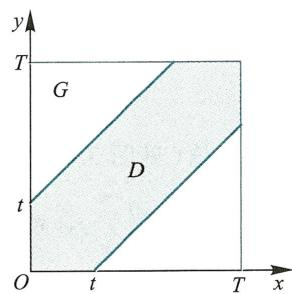  
图3.5

$$
p = \frac{D \text{的面积}}{G \text{的面积}} = \frac{T^{2} - (T - t)^{2}}{T^{2}} = 1 - \left(1 - \frac{t}{T}\right)^{2}.
$$

例3.1.9 在区间  $[- 1,2]$  上随机选取两点,其坐标分别记为  $X$  和  $Y$ ,求两坐标之和大于1而两坐标之积小于1的概率.

解显然二维随机变量  $(X,Y)$  在矩形(如图3.6)

$$
G = \{(x,y) \mid -1 \leqslant x \leqslant 2, -1 \leqslant y \leqslant 2\}
$$

上服从均匀分布, 所求概率为

$$
p = \frac{D \text{的面积}}{G \text{的面积}},
$$

其中  $D$  是图中阴影部分, 该面积是

$$
S(D) = 3 \cdot \frac{1}{2} + 2 \int_{1}^{2} \frac{1}{x} \mathrm{d}x + \frac{3}{2} + 2 \ln 2,
$$

故

$$
p = \frac{S(D)}{S(G)} = \frac{2}{9} \ln 2 + \frac{1}{6}.
$$

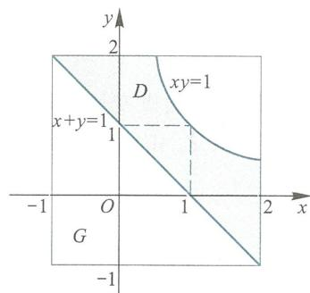  
图3.6

# 五、二维正态分布

二维随机变量  $(X, Y)$  的联合概率密度为

$$
\phi (x,y) = \frac{1}{2\pi\sigma_{1}\sigma_{2}\sqrt{1 - \rho^{2}}}\mathrm{exp}\bigg\{-\frac{1}{2(1 - \rho^{2})}\bigg[\frac{(x - \mu_{1})^{2}}{\sigma_{1}^{2}} -2\rho \frac{(x - \mu_{1})(y - \mu_{2})}{\sigma_{1}\sigma_{2}} +\frac{(y - \mu_{2})^{2}}{\sigma_{2}^{2}}\bigg]\bigg\} ,x\in \mathbf{R},y\in \mathbf{R}.
$$

式中  $\mu_{1}, \mu_{2}, \sigma_{1}, \sigma_{2}, \rho$  均为常数, 且  $\sigma_{1} > 0, \sigma_{2} > 0, - 1 < \rho < 1$ , 则称  $(X, Y)$  服从二维正态分布, 记为  $(X, Y) \sim N(\mu_{1}, \sigma_{1}^{2}; \mu_{2}, \sigma_{2}^{2}; \mu)$ .

例3.1.10 设  $(X, Y) \sim N(0, 1; 0, 1; \rho)$ , 即  $(X, Y)$  具有概率密度

$$
\phi (x, y) = \frac{1}{2\pi \sqrt{1 - \rho^{2}}} \exp \left\{-\frac{1}{2(1 - \rho^{2})} (x^{2} - 2\rho xy + y^{2})\right\} , (x, y) \in \mathbf{R}^{2}.
$$

求  $X, Y$  的边缘概率密度  $\phi_{X}(x)$  和  $\phi_{Y}(y)$ .

解

$$
\begin{array}{l}{\phi_{X}(x) = \int_{-\infty}^{+\infty}\phi (x,y)\mathrm{d}y}\\ {= \int_{-\infty}^{+\infty}\frac{1}{2\pi\sqrt{1 - \rho^{2}}}\mathrm{exp}\bigg[-\frac{1}{2(1 - \rho^{2})} (x^{2} - 2\rho xy + y^{2})\bigg]\mathrm{d}y,} \end{array}
$$

积分式中

$$
\begin{array}{c}{{\frac{1}{2\left(1-\rho^{2}\right)}\left(x^{2}-2\rho x y+y^{2}\right)=\frac{1}{2\left(1-\rho^{2}\right)}\left[\left(y-\rho x\right)^{2}+x^{2}\left(1-\rho^{2}\right)\right]}}\\ {{=\frac{\left(y-\rho x\right)^{2}}{2\left(1-\rho^{2}\right)}+\frac{x^{2}}{2},}}\end{array}
$$

作代换  $\frac{y - \rho x}{\sqrt{1 - \rho^{2}}} = t, \mathrm{d}y = \sqrt{1 - \rho^{2}} \mathrm{d}t$ , 则

$$
\begin{array}{l}{\phi_{x}(x) = \frac{1}{2\pi\sqrt{1 - \rho^{2}}}\int_{-\infty}^{+\infty}\mathrm{e}^{\frac{x^{2}}{2}}\mathrm{e}^{\frac{(y - \rho x)^{2}}{2(1 - \rho^{2})}}\mathrm{d}y = \frac{1}{2\pi}\mathrm{e}^{\frac{x^{2}}{2}}\int_{-\infty}^{+\infty}\mathrm{e}^{\frac{t^{2}}{2}}\mathrm{d}t}\\ {= \frac{1}{2\pi}\mathrm{e}^{\frac{x^{2}}{2}}\cdot \sqrt{2\pi} = \frac{1}{\sqrt{2\pi}}\mathrm{e}^{\frac{x^{2}}{2}},\quad x\in \mathbf{R}.} \end{array}
$$

此例的结果是: 若  $(X, Y) \sim N(0, 1; 0, 1; \rho)$ , 则  $X \sim N(0, 1), Y \sim N(0, 1)$ . 更一般地有

命题3.1.1若二维随机变量  $(X,Y)\sim N(\mu_{1},\sigma_{1}^{2};\mu_{2},\sigma_{2}^{2};\rho)$  ,则  $X\sim N(\mu_{1},\sigma_{1}^{2})$  ,Y\~ $N(\mu_{2},\sigma_{2}^{2})$

二维正态随机变量的边缘分布仍为正态分布,二维联合概率密度完全确定了边缘概率密度.反之,由两个边缘概率密度  $\phi_{X}(x)$  和  $\phi_{Y}(y)$  却不能确定  $(X,Y)$  的联合概率密度  $\phi (x,y)$

# 3.2 随机变量的独立性

由随机事件的独立性概念可引进随机变量的独立性概念.

定义3.2.1 设  $(X,Y)$  是二维随机变量,若对于任意实数  $x$  和  $y$  ,有

$$
P\{X\leqslant x,Y\leqslant y\} = P\{X\leqslant x\} P\{Y\leqslant y\} \tag{3.2.1}
$$

成立,则称随机变量  $X$  和  $Y$  相互独立.

二维随机变量  $(X,Y)$  相互独立的意义是对所有的实数对  $(x,y)$  ,随机事件  $\{X\leqslant x\}$  与随机事件  $\{Y\leqslant y\}$  相互独立.

用分布函数表示式(3.2.1),定义3.2.1等价于对于一切实数对  $(x,y)$  ,有

$$
F(x,y) = F_{x}(x)F_{Y}(y) \tag{3.2.2}
$$

成立,其中  $F(x,y)$  及  $F_{x}(x),F_{Y}(y)$  分别是二维随机变量  $(X,Y)$  的联合分布函数和边缘分布函数.

例3.2.1 证明:若随机变量  $X$  和  $Y$  相互独立,则有

$$
P\left\{x_{1}< X\leqslant x_{2},y_{1}< Y\leqslant y_{2}\right\} = P\left\{x_{1}< X\leqslant x_{2}\right\} P\left\{y_{1}< Y\leqslant y_{2}\right\}
$$

成立.

证 由公式(3.2.2)有

$$
\begin{array}{r l} & {\quad P\left\{x_{1}< X\leqslant x_{2},y_{1}< Y\leqslant y_{2}\right\}}\\ & {= F(x_{2},y_{2}) - F(x_{1},y_{2}) - F(x_{2},y_{1}) + F(x_{1},y_{1})}\\ & {= F_{x}(x_{2})F_{Y}(y_{2}) - F_{x}(x_{1})F_{Y}(y_{2}) - F_{x}(x_{2})F_{Y}(y_{1}) + F_{x}(x_{1})F_{Y}(y_{1})}\\ & {= \left[F_{x}(x_{2}) - F_{x}(x_{1})\right]\left[F_{Y}(y_{2}) - F_{Y}(y_{1})\right]}\\ & {= P\left\{x_{1}< X\leqslant x_{2}\right\} P\left\{y_{1}< Y\leqslant y_{2}\right\} .} \end{array}
$$

例3.2.2设随机变量  $X$  与  $Y$  相互独立,证明随机变量  $X^{2}$  和  $Y^{2}$  也相互独立.

证当  $x\geqslant 0$  且  $y\geqslant 0$  时,

$$
\begin{array}{r l} & {F(x,y) = P\left\{X^{2}\leqslant x,Y^{2}\leqslant y\right\} = P\left\{-\sqrt{x}\leqslant X\leqslant \sqrt{x}, - \sqrt{y}\leqslant Y\leqslant \sqrt{y}\right\}}\\ & {\qquad = P\left\{-\sqrt{x}\leqslant X\leqslant \sqrt{x}\right\} P\left\{-\sqrt{y}\leqslant Y\leqslant \sqrt{y}\right\}}\\ & {\qquad = P\left\{X^{2}\leqslant x\right\} P\left\{Y^{2}\leqslant y\right\} = F_{X^{2}}(x)F_{Y^{2}}(y).} \end{array}
$$

当  $x< 0$  或  $y< 0$  时,

$$
F(x,y) = P\{X^{2}\leqslant x,Y^{2}\leqslant y\} = 0 = P\{X^{2}\leqslant x\} P\{Y^{2}\leqslant y\} = F_{X^{2}}(x)F_{Y^{2}}(y).
$$

同理可证在其他情形也有  $F(x,y) = F_{X^{2}}(x)F_{Y^{2}}(y)$  成立,故  $X^{2}$  和  $Y^{2}$  相互独立.

定理3.2.1设  $(X,Y)$  是二维离散型随机变量,则  $X,Y$  相互独立的充要条件是对  $(X,Y)$  的任意一对取值  $(x,y)$  均有

$$
P\left\{X = x_{i},Y = y_{j}\right\} = P\left\{X = x_{i}\right\} P\left\{Y = y_{j}\right\} . \tag{3.2.3}
$$

按照定理3.2.1, 可以验证例3.1.3中随机变量  $X$  与  $Y$  相互独立, 在例3.1.4中, 因

$$
P\left\{X = 0, Y = 0\right\} = \frac{3}{5} \cdot \frac{2}{4} \neq \frac{3}{5} \cdot \frac{3}{5} = P\left\{X = 0\right\} P\left\{Y = 0\right\} ,
$$

故  $X$  与  $Y$  不相互独立.

例3.2.3 将一枚均匀硬币连续抛两次, 令

$X = \left\{ \begin{array}{ll}1, & \text {第一次出现正面,} \\ 0, & \text {第一次出现反面,} \end{array} \right.$ $Y = \left\{ \begin{array}{ll}1, & \text {第二次出现正面,} \\ 0, & \text {第二次出现反面,} \end{array} \right.$

验证  $X$  与  $Y$  相互独立.

证  $(X, Y)$  的所有可能取值对为  $(0,0), (1,0), (0,1)$  和  $(1,1)$ , 而且取得每一对数值的概率相等, 均为

$$
P\left\{X = i, Y = j\right\} = \frac{1}{4} \quad (i = 0,1; j = 0,1).
$$

而

$$
P\left\{X = i\right\} = \frac{1}{2}, \quad i = 0,1; \quad P\left\{Y = j\right\} = \frac{1}{2}, \quad j = 0,1,
$$

从而

$$
P\left\{X = i, Y = j\right\} = \frac{1}{4} = P\left\{X = i\right\} P\left\{Y = j\right\} \quad (i = 0,1; j = 0,1).
$$

故  $X$  与  $Y$  相互独立.

定理3.2.2 设  $(X, Y)$  是连续型随机变量, 其联合概率密度和边缘概率密度分别是  $f(x, y), f_{X}(x), f_{Y}(y)$ , 则  $X$  与  $Y$  相互独立的充要条件是

$$
f(x, y) = f_{X}(x) f_{Y}(y) \tag{3.2.4}
$$

在平面上除去"面积"为零的集合外成立.

例3.2.4 二维随机变量  $(X, Y)$  在区域  $G$  上服从均匀分布, 其中  $G$  是图3.7中的阴影部分, 讨论  $X$  与  $Y$  是否相互独立.

解 区域  $G$  的面积为1, 故  $(X, Y)$  的联合概率密度为

$$
f(x, y) = \left\{ \begin{array}{ll}1, & (x, y) \in G, \\ 0, & (x, y) \notin G. \end{array} \right.
$$

当  $0 \leqslant x \leqslant 2$  时,

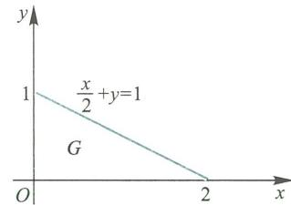  
图3.7

$$
f_{X}(x) = \int_{-\infty}^{+\infty} f(x, y) \mathrm{d}y = \int_{-\infty}^{0} 0 \mathrm{d}y + \int_{0}^{1 - \frac{x}{2}} \mathrm{d}y + \int_{1 - \frac{x}{2}}^{+\infty} 0 \mathrm{d}y = 1 - \frac{x}{2},
$$

当  $x< 0$  或  $x > 2$  时  $,f_{X}(x) = 0$  ,综合而得

$$
f_{X}(x) = \left\{ \begin{array}{ll}1 - \frac{x}{2}, & 0 \leqslant x \leqslant 2, \\ 0, & \text {其他.} \end{array} \right.
$$

同理可得

$$
\begin{array}{r l r} & {} & {f_{Y}(y) = \int_{-\infty}^{+\infty}f(x,y) \mathrm{d}x = \left\{ \begin{array}{l l}{\int_{0}^{2(1 - y)}\mathrm{d}x,} & {0\leqslant y\leqslant 1,}\\ {0,} & {\mathbb{H}\backslash \mathbb{H}} \end{array} \right.}\\ & {} & {= \left\{ \begin{array}{l l}{2\left(1 - y\right),} & {0\leqslant y\leqslant 1,}\\ {0,} & {\mathbb{H}\backslash \mathbb{H}.} \end{array} \right.} \end{array}
$$

当  $(x,y) \in G$  时  $f(x,y) \neq f_{X}(x) f_{Y}(y)$ , 故  $X$  与  $Y$  不相互独立.

例3.2.5 二维随机变量  $(X,Y) \sim N(\mu_{1}, \sigma_{1}^{2}; \mu_{2}, \sigma_{2}^{2}; \rho)$ , 证明  $X$  与  $Y$  相互独立的充要条件是  $\rho = 0$ .

证  $(X,Y)$  的联合概率密度是

$$
\phi (x,y) = \frac{1}{2\pi\sigma_{1}\sigma_{2}\sqrt{1 - \rho^{2}}}\mathrm{exp}\bigg\{-\frac{1}{2(1 - \rho^{2})}\bigg[\frac{(x - \mu_{1})^{2}}{\sigma_{1}^{2}} -2\rho \frac{(x - \mu_{1})(y - \mu_{2})}{\sigma_{1}\sigma_{2}} +\frac{(y - \mu_{2})^{2}}{\sigma_{2}^{2}}\bigg]\bigg\}
$$

$x \in \mathbf{R}, y \in \mathbf{R}$ , 若  $\rho = 0$ , 则

$$
\phi (x,y) = \frac{1}{2\pi\sigma_{1}\sigma_{2}}\mathrm{exp}\bigg\{-\frac{1}{2}\bigg[\frac{(x - \mu_{1})^{2}}{\sigma_{1}^{2}} +\frac{(y - \mu_{2})^{2}}{\sigma_{2}^{2}}\bigg]\bigg\} = \phi_{x}(x)\cdot \phi_{y}(y),
$$

因此  $X$  与  $Y$  相互独立.

反之, 若  $X$  与  $Y$  相互独立, 则  $\phi (x,y) = \phi_{X}(x) \cdot \phi_{Y}(y)$  对一切  $(x,y) \in \mathbf{R}^{2}$  成立, 令  $x = \mu_{1}, y = \mu_{2}$ , 有

$$
\frac{1}{2\pi\sigma_{1}\sigma_{2}\sqrt{1 - \rho^{2}}} = \frac{1}{2\pi\sigma_{1}\sigma_{2}},
$$

故有  $\rho = 0$

定义3.2.2 设  $n$  维随机变量  $(X_{1}, X_{2}, \dots , X_{n})$  的联合分布函数为  $F(x_{1}, x_{2}, \dots , x_{n})$ , 若对所有实数组  $(x_{1}, x_{2}, \dots , x_{n})$  均有

$$
F(x_{1}, x_{2}, \dots , x_{n}) = F_{1}(x_{1}) F_{2}(x_{2}) \dots F_{n}(x_{n}) \tag{3.2.5}
$$

成立, 式中  $F_{k}(x_{i})$  是关于  $X_{k}$  的边缘分布函数, 则称  $X_{1}, X_{2}, \dots , X_{n}$  相互独立.

若  $(X_{1}, X_{2}, \dots , X_{n})$  为  $n$  维连续型随机变量, 则式(3.2.5)可改写为

$$
f(x_{1}, x_{2}, \dots , x_{n}) = f_{X_{1}}(x_{1}) f_{X_{2}}(x_{2}) \dots f_{X_{n}}(x_{n}). \tag{3.2.6}
$$

例3.2.6 设  $n$  个同类电子元件并联使用, 每个元件的寿命  $X_{i}$  的概率密度为

$$
f_{X_{i}}(x_{i}) = \left\{ \begin{array}{ll}x_{i} \mathrm{e}^{-x_{i}}, & x_{i} > 0, \\ 0, & x_{i} \leqslant 0. \end{array} \right.
$$

试求整个系统正常工作的时间未超过  $L(L > 0)$  的概率.

解 由题设条件可知  $X_{1}, X_{2}, \dots , X_{n}$  相互独立, 系统不能正常工作时所有元件均已失效, 所求概率为

$$
\begin{array}{l}{{p=P\big\{X_{1}< L,X_{2}< L,\cdots,X_{n}< L\big\}=\prod_{i=1}^{n}P\big\{X_{i}< L\big\}=\prod_{i=1}^{n}\bigg(\int_{0}^{L}x_{i}\mathrm{e}^{-x_{i}}\mathrm{d}x_{i}\bigg)}}\\ {{=\bigg(\int_{0}^{L}x\mathrm{e}^{-x}\mathrm{d}x\bigg)^{n}=(1-\mathrm{e}^{-L}-L\mathrm{e}^{-L})^{n}.}}\end{array}
$$

类似于例3.2.1和例3.2.2, 可以证明: 若随机变量  $X_{1}, X_{2}, \dots , X_{n}$  相互独立, 则  $X_{1}^{2}, X_{2}^{2}, \dots , X_{n}^{2}$  也相互独立.

更一般地有下述定理.

定理3.2.3 若  $n$  维随机变量  $(X_{1}, X_{2}, \dots , X_{n})$  相互独立, 则

（1）其中任意  $m(2 \leqslant m \leqslant n)$  个随机变量  $X_{k_{1}}, X_{k_{2}}, \dots , X_{k_{m}}$  也相互独立;

（2）若随机变量的函数  $g_{1}(X_{1}), g_{2}(X_{2}), \dots , g_{n}(X_{n})$  是随机变量, 则它们也相互独立;

（3）若  $(X_{1}, X_{2}, \dots , X_{m})$  与  $(X_{m + 1}, X_{m + 2}, \dots , X_{n})$  相互独立, 而且  $h, g$  是连续函数, 则  $h(X_{1}, X_{2}, \dots , X_{m})$  和  $g(X_{m + 1}, X_{m + 2}, \dots , X_{n})$  也相互独立.

# 3.3 条件分布

# 一、条件分布律

设离散型随机变量  $(X, Y)$  的联合分布律为

$$
P\{X = x_{i}, Y = y_{j}\} = p_{ij} \quad (i, j = 1, 2, \dots),
$$

若  $P\{Y = y_{j}\} > 0$ , 则在事件  $\{Y = y_{j}\}$  已发生的条件下, 事件  $\{X = x_{i}\}$  的条件概率为

$$
P\{X = x_{i} \mid Y = y_{j}\} = \frac{P\{X = x_{i}, Y = y_{j}\}}{P\{Y = y_{j}\}} = \frac{p_{ij}}{p_{\cdot j}}, \quad i = 1, 2, \dots
$$

此概率数列具有分布律的性质:

(1)  $P\{X = x_{i} \mid Y = y_{j}\} \geqslant 0, \quad i = 1, 2, \dots ;$  
(2)  $\sum_{i = 1}^{\infty} P\{X = x_{i} \mid Y = y_{j}\} = \frac{1}{p_{\cdot j}} \sum_{i = 1}^{\infty} p_{ij} = 1.$

于是引进下述定义.

定义3.3.1 设  $(X, Y)$  是离散型随机变量, 对固定的  $j$ , 若  $P\{Y = y_{j}\} > 0$ , 则称

$$
P\{X = x_{i} \mid Y = y_{j}\} = \frac{p_{ij}}{p_{\cdot j}} \quad (i = 1, 2, \dots) \tag{3.3.1}
$$

为在  $Y = y_{j}$  的条件下, 随机变量  $X$  的条件分布律.

对固定的  $i$ , 若  $P\{X = x_{i}\} > 0$ , 则称

$$
P\{Y = y_{j} \mid X = x_{i}\} = \frac{p_{ij}}{p_{i\cdot}} \quad (j = 1, 2, \dots) \tag{3.3.2}
$$

为在  $X = x_{i}$  的条件下, 随机变量  $Y$  的条件分布律.

例3.3.1某射手进行射击, 击中目标两次则停止射击, 而且每次射击的命中率为  $p(0< p< 1)$ , 令  $X$  表示第一次命中目标时的射击次数,  $Y$  是第二次命中目标时的射击次数, 求条件分布律.

(1)  $P\{X = i \mid Y = j\}$ , 
(2)  $P\{Y = j \mid X = i\}$ .

解  $(X, Y)$  的联合分布律为

$$
P\{X = i, Y = j\} = p^{2}(1 - p)^{j - 2} \quad (1 \leqslant i< j = 2, 3, \dots).
$$

（1）当  $j = 2, 3, \dots$  时, 条件分布律存在, 为

$$
P\{X = i \mid Y = j\} = \frac{P\{X = i, Y = j\}}{P\{Y = j\}} = \frac{p^{2}(1 - p)^{j - 2}}{(j - 1)p^{2}(1 - p)^{j - 2}} = \frac{1}{j - 1} \quad (i = 1, 2, \dots , j - 1).
$$

$$
P\left\{X = i\right\} = \sum_{j = i + 1}^{\infty}P\left\{X = i,Y = j\right\} = \sum_{j = i + 1}^{\infty}p^{2}(1 - p)^{j - 2} = p(1 - p)^{i - 1}\quad (i = 1,2,\dots).
$$

当  $i = 1,2,\dots$  时,

$$
\begin{array}{c}{{P\left\{Y=j\mid X=i\right\}=\frac{P\left\{X=i,Y=j\right\}}{P\left\{X=i\right\}}=\frac{p^{2}(1-p)^{j-2}}{p(1-p)^{i-1}}}}\\ {{=p(1-p)^{j-i-1}\quad(j=i+1,i+2,\cdots).}}\end{array}
$$

这里,显然  $p(1 - p)^{j - i - 1} > 0$  ,且

$$
\sum_{j = i + 1}^{\infty}p(1 - p)^{j - i - 1} = p\cdot \frac{1}{1 - (1 - p)} = 1.
$$

同理,  $P\left\{X = i\mid Y = j\right\} = \frac{1}{j - 1} (i = 1,2,\dots ,j - 1)$  也满足条件分布律的两条基本性质.

例3.3.2设某矿山一年内发生的事故总数  $X\sim P(\lambda)$  ,一个事故是致命事故的概率为  $p$  ,设一年内发生致命事故的次数为  $Y$  ,试写出  $Y$  的分布律.

解  $X$  的分布律为

$$
P\left\{X = k\right\} = \frac{\lambda^{k}}{k!}\mathrm{e}^{-\lambda},k = 0,1,2,\dots ,
$$

在发生  $k$  次事故的条件下,即"  $X = k^{\prime \prime}$  的条件下,随机变量  $Y$  的条件分布律为

$$
P\left\{Y = m\mid X = k\right\} = \mathbf{C}_{k}^{m}p^{m}(1 - p)^{k - m},m = 0,1,2,\dots ,k,
$$

故  $(X,Y)$  的联合分布律为

$$
P\left\{X = k,Y = m\right\} = P\left\{X = k\right\} P\left\{Y = m\mid X = k\right\} = \frac{\lambda^{k}}{k!}\mathrm{e}^{-\lambda}\mathbf{C}_{k}^{m}p^{m}(1 - p)^{k - m}
$$

$$
(0\leqslant m\leqslant k = 1,2,\dots).
$$

关于  $Y$  的分布律为

$$
\begin{array}{l}{{P\left\{Y=m\right\}=\sum_{k=m}^{\infty}\frac{\lambda^{k}}{k!}\mathrm{e}^{-\lambda}\frac{k!}{m!\left(k-m\right)!}p^{m}(1-p)^{k-m}}}\\ {{=\frac{\left(\lambda p\right)^{m}}{m!}\sum_{k=m}^{\infty}\mathrm{e}^{-\lambda}\frac{\left[\lambda\left(1-p\right)\right]^{k-m}}{\left(k-m\right)!}}}\\ {{=\frac{\left(\lambda p\right)^{m}}{m!}\mathrm{e}^{-\lambda}\mathrm{e}^{\lambda(1-p)}=\frac{\left(\lambda p\right)^{m}}{m!}\mathrm{e}^{-\lambda p}\quad(m=0,1,2,\cdots).}}\end{array}
$$

# 二、条件概率密度

对一般随机变量  $(X,Y)$  而言,不能保证  $P\left\{X = x\right\} \neq 0$  或  $P\left\{Y = y\right\} \neq 0$  ,因此对于非离散型随机变量,不能用条件概率的概念引入"条件分布函数",我们采用极限的方法来处理.

定义3.3.2对于给定的实数  $y$  及任意的  $\Delta y > 0$  ,若  $P\left\{y< Y\leqslant y + \Delta y\right\} >0$  ,且对任意实数  $x$  ,极限

$$
\lim_{\Delta y\to 0^{+}}P\left\{X\leqslant x\mid y< Y\leqslant y + \Delta y\right\} = \lim_{\Delta y\to 0^{+}}\frac{P\left\{X\leqslant x,y< Y\leqslant y + \Delta y\right\}}{P\left\{y< Y\leqslant y + \Delta y\right\}} \tag{3.3.3}
$$

存在,则称此极限为在"  $Y = y^{\prime \prime}$  的条件下,随机变量  $X$  的条件分布函数,记为  $F_{X}\mid_{Y}(x\mid y)$

对二维离散型随机变量  $(X,Y)$ , 若  $P\{Y = y_{j}\} >0$ , 则在“  $Y = y_{j}$ ”的条件下, 随机变量  $X$  的条件分布函数为

$$
F_{X}\mid_{Y}(x\mid y) = \sum_{x_{i}\in x}P\mid X = x_{i}\mid Y = y_{j}\} = \sum_{x_{i}\in x}\frac{p_{ij}}{p\cdot j}. \tag{3.3.4}
$$

设  $(X,Y)$  是连续型随机变量, 其联合概率密度为  $f(x,y)$ , 式(3.3.3)可改写为

$$
F_{X}\mid_{Y}(x\mid y) = \lim_{\Delta y\to 0^{+}}\frac{\int_{-\infty}^{x}\int_{y}^{y + \Delta y}f(u,v)\mathrm{d}u\mathrm{d}v}{\int_{y}^{y + \Delta y}f_{Y}(v)\mathrm{d}v}.
$$

若  $f(x,y),f_{Y}(y)$  在  $(x,y)$  及其附近连续, 并且  $f_{Y}(y) > 0$ , 由积分中值定理可得

$$
F_{X}\mid_{Y}(x\mid y) = \lim_{\Delta y\to 0^{+}}\frac{\int_{-\infty}^{x}f(u,y + \theta_{1}\Delta y)\mathrm{d}u}{f_{Y}(y + \theta_{2}\Delta y)},\quad 0< \theta_{i}< 1,\quad i = 1,2,
$$

从而

$$
F_{X}\mid_{Y}(x\mid y) = \frac{\int_{-\infty}^{x}f(u,y)\mathrm{d}u}{f_{Y}(y)} = \int_{-\infty}^{x}\frac{f(u,y)}{f_{Y}(y)}\mathrm{d}u.
$$

若记  $f_{X}\mid_{Y}(x\mid y)$  为在“  $Y = y^{\prime}$ ”的条件下, 随机变量  $X$  的条件概率密度, 则

$$
f_{X}\mid_{Y}(x\mid y) = F_{X}^{\prime}\mid_{Y}(x\mid y) = \frac{f(x,y)}{f_{Y}(y)}. \tag{3.3.5}
$$

类似地, 在“  $X = x^{\prime \prime}$ ”的条件下, 随机变量  $Y$  的条件概率密度为

$$
f_{Y}\mid_{X}(y\mid x) = F_{Y}^{\prime}\mid_{X}(y\mid x) = \frac{f(x,y)}{f_{X}(x)}. \tag{3.3.6}
$$

在“  $X = c^{\prime \prime}$ ”的条件下, 随机事件  $\{a< Y\leq b\}$  的条件概率由下面公式计算

$$
P\{a< Y\leq b\mid X = c\} = \int_{a}^{b}f_{Y}\mid_{X}(y\mid c)\mathrm{d}y. \tag{3.3.7}
$$

例3.3.3二维随机变量  $(X,Y)$  在圆域  $D = \{(x,y)\mid x^{2} + y^{2}\leqslant 4\}$  上服从均匀分布, 试求  $f_{Y}\mid_{X}(y\mid x)$  和概率  $P\{0\leqslant Y\leqslant 3\mid X = 1\}$ .

解  $(X,Y)$  的联合概率密度为

$$
f(x,y) = \left\{ \begin{array}{ll}\frac{1}{4\pi}, & x^{2} + y^{2}\leqslant 4,\\ 0, & \text{其他}, \end{array} \right.
$$

得

$$
\begin{array}{r l r} & {} & {f_{X}(x) = \int_{-\infty}^{+\infty}f(x,y)\mathrm{d}y = \left\{ \begin{array}{l l}{\int_{-\sqrt{4 - x^{2}}}^{\sqrt{4 - x^{2}}}\frac{1}{4\pi}\mathrm{d}y,} & {\mid x\mid \leqslant 2,}\\ {0,} & {\mathbb{H}\backslash \mathbb{H}} \end{array} \right.}\\ & {} & {= \left\{ \begin{array}{l l}{\frac{1}{2\pi}\sqrt{4 - x^{2}},} & {\mid x\mid \leqslant 2,}\\ {0,} & {\mathbb{H}\backslash \mathbb{H}.} \end{array} \right.} \end{array}
$$

当  $- 2< x< 2$  时,  $f_{X}(x) > 0$ , 从而

$$
f_{Y\mid_{X}}(y\mid_{X}) = \frac{f(x,y)}{f_{X}(x)} = \left\{ \begin{array}{l l}{\frac{1}{2\sqrt{4 - x^{2}}},} & {-\sqrt{4 - x^{2}}\leqslant y\leqslant \sqrt{4 - x^{2}},}\\ {0,} & {\mathbb{H}\backslash \mathbb{H}.} \end{array} \right.
$$

当  $x\in (- 2,2)$  时,在"  $X = c$  "的条件下,随机变量  $Y$  在  $(- \sqrt{4 - x^{2}},\sqrt{4 - x^{2}})$  上服从均匀分布;当  $x\notin (- 2,2)$  时,随机变量  $Y$  的条件概率密度不存在,有

$$
P\left\{0\leqslant Y\leqslant 3\mid X = 1\right\} = \int_{0}^{3}f_{Y\mid_{X}}(y\mid 1)\mathrm{d}y = \int_{0}^{\sqrt{3}}\frac{1}{2\sqrt{3}}\mathrm{d}y + \int_{\sqrt{3}}^{3}0\mathrm{d}y = \frac{1}{2}.
$$

例3.3.4 已知二维随机变量  $(X,Y)$  的条件概率密度为

$$
f_{X\mid_{Y}}(x\mid_{Y}) = \left\{ \begin{array}{l l}{3x^{2},} & {0< x< y,}\\ {y^{3},} & {(0< y< 1),}\\ {0,} & {\mathbb{H}\backslash \mathbb{H}.} \end{array} \right.
$$

关于  $Y$  的边缘概率密度为

$$
f_{Y}(y) = \left\{ \begin{array}{l l}{5y^{4},} & {0< y< 1,}\\ {0,} & {\mathbb{H}\backslash \mathbb{H},} \end{array} \right.
$$

计算概率  $P\left\{X > \frac{1}{2}\right\}$

解 由公式(3.3.5)可得

$$
f(x,y) = f_{X}\mid_{Y}(x\mid_{Y})f_{Y}(y) = \left\{ \begin{array}{l l}{15x^{2}y,} & {0< x< y,0< y< 1,}\\ {0,} & {\mathbb{H}\backslash \mathbb{H},} \end{array} \right.
$$

则

$$
f_{X}(x) = \int_{-\infty}^{+\infty}f(x,y)\mathrm{d}y = \left\{ \begin{array}{l l}{\int_{x}^{1}15x^{2}y\mathrm{d}y,} & {0\leqslant x\leqslant 1,}\\ {0,} & {\mathbb{H}\backslash \mathbb{H}.} \end{array} \right.
$$

$$
= \left\{ \begin{array}{l l}{\frac{15}{2} (x^{2} - x^{4}),} & {0\leqslant x\leqslant 1,}\\ {0,} & {\mathbb{H}\backslash \mathbb{H},} \end{array} \right.
$$

$$
P\left\{X > \frac{1}{2}\right\} = \int_{\frac{1}{2}}^{+\infty}f_{X}(x)\mathrm{d}x = \int_{\frac{1}{2}}^{1}\frac{15}{2} (x^{2} - x^{4})\mathrm{d}x = \frac{47}{64}.
$$

例3.3.5 二维随机变量  $(X,Y)\sim N(0,1;0,1;\rho)$ ,求条件概率密度  $\phi_{X}\mid_{Y}(x\mid_{Y})$

解  $(X,Y)$  的联合概率密度为

$$
\phi (x,y) = \frac{1}{2\pi\sqrt{1 - \rho^{2}}}\mathrm{exp}\left\{-\frac{1}{2(1 - \rho^{2})} (x^{2} - 2\rho x y + y^{2})\right\} ,(x,y)\in \mathbf{R}^{2},
$$

关于  $Y$  的边缘概率密度为

$$
\phi_{Y}(y) = \frac{1}{\sqrt{2\pi}}\mathrm{e}^{-\frac{y^{2}}{2}},\qquad y\in \mathbf{R},
$$

得

$$
\begin{array}{r l} & {\phi_{x}\mid_{y}(x\mid y) = \frac{\phi(x,y)}{\phi_{y}(y)} = \frac{1}{2\pi\sqrt{1 - \rho^{2}}}\mathrm{exp}\frac{\left\{-\frac{(x - \rho y)^{2}}{2(1 - \rho^{2})} - \frac{y^{2}}{2}\right\}}{\frac{1}{\sqrt{2\pi}}\mathrm{e}^{-\frac{y^{2}}{2}}}}\\ & {\qquad = \frac{1}{\sqrt{2\pi}\sqrt{1 - \rho^{2}}}\mathrm{exp}\Big\{-\frac{(x - \rho y)^{2}}{2(1 - \rho^{2})}\Big\} ,\qquad x\in \mathbf{R}.} \end{array}
$$

在"  $Y = y$  "的条件下,随机变量  $X \sim N(\rho y, 1 - \rho^{2})$ ,在"  $X = x$  "条件下,随机变量  $Y \sim N(\rho x, 1 - \rho^{2})$ ,即二维正态分布的条件分布仍是正态分布.

# §3.4 随机变量的函数及其分布

无论从应用或理论方面都需要考虑随机变量的函数问题,需要研究随机变量的函数的分布,譬如:

已知在  $t = t_{0}$  时刻,热噪声的电压  $X$  服从正态分布  $N(0, \sigma^{2})$ ,热噪声的功率  $Y = X^{2} / R$  ( $R$  是电阻值)服从什么分布?

对靶子上的点目标  $O$  进行射击,弹着点的坐标  $(X, Y)$  服从二维均匀分布,点  $(X, Y)$  与点  $O$  的距离  $Z = \sqrt{X^{2} + Y^{2}}$  服从什么分布?

某放射源在  $[0, T_{1}]$  时间内放射的  $\alpha$  粒子数  $X \sim P(\lambda_{1})$ ,在  $(T_{1}, T_{2}]$  时间内放射的  $\alpha$  粒子数  $Y \sim P(\lambda_{2})$ ,问该放射源在  $[0, T_{2}]$  时间内放射的  $\alpha$  粒子数  $Z = X + Y$  的分布如何?

一般地,设  $X, (X, Y)$  是已知其分布的随机变量, $g(x)$  和  $G(x, y)$  是连续函数,则  $X, (X, Y)$  的函数  $g(X)$  和  $G(X, Y)$  也是随机变量.我们将讨论如何由已知随机变量的分布去求它的函数的分布.

# 一、离散型随机变量的函数及其分布律

离散型随机变量  $X$  的分布律为

$$
P\{X = x_{i}\} = p_{i} \quad (i = 1, 2, \dots),
$$

若它的函数  $Y = g(X)$  仍是离散型随机变量,则其分布律为

$$
P\{Y = y_{j}\} = P\{g(X) = y_{j}\} = \sum_{x_{i} \in S_{j}} P\{X = x_{i}\} \quad (j = 1, 2, \dots), \tag{3.4.1}
$$

其中  $S_{j} = \{x_{i} \mid g(x_{i}) = y_{j}\}$ .

例3.4.1 设随机变量  $X$  的分布律为

<table><tr><td>X</td><td>-1</td><td>0</td><td>1</td><td>2</td><td>5/2</td></tr><tr><td>P{X=xi}</td><td>1/5</td><td>1/10</td><td>1/10</td><td>3/10</td><td>3/10</td></tr></table>

试求:(1)  $X - 1$  的分布律;(2)  $X^{2}$  的分布律.

解(1)设  $Y = X - 1$  的取值为  $y_{i}$ ,则  $x_{i} = y_{i} + 1$

$$
P\left\{Y = y_{i}\right\} = P\left\{X - 1 = y_{i}\right\} = P\left\{X = y_{i} + 1\right\} = P\left\{X = x_{i}\right\} ,
$$

故  $X - 1$  的分布律为

<table><tr><td>X-1</td><td>-2</td><td>-1</td><td>0</td><td>1</td><td>3/2</td></tr><tr><td>P{X-1=yi}</td><td>1/5</td><td>1/10</td><td>1/10</td><td>3/10</td><td>3/10</td></tr></table>

(2)  $X^{2}$  的可能取值有  $0,1,4,\frac{25}{4}$ , 而且

$$
P\left\{X^{2} = 0\right\} = P\left\{X = 0\right\} = \frac{1}{10}, \qquad P\left\{X^{2} = 1\right\} = P\left\{X = -1\right\} + P\left\{X = 1\right\} = \frac{1}{5} + \frac{1}{10} = \frac{3}{10},
$$

$$
P\left\{X^{2} = 4\right\} = P\left\{X = 2\right\} = \frac{3}{10}, \qquad P\left\{X^{2} = \frac{25}{4}\right\} = P\left\{X = \frac{5}{2}\right\} = \frac{3}{10},
$$

故  $X^{2}$  的分布律为

<table><tr><td>X²</td><td>0</td><td>1</td><td>4</td><td>25/4</td></tr><tr><td>P{X²=yi}</td><td>1/10</td><td>3/10</td><td>3/10</td><td>3/10</td></tr></table>

设离散型随机变量  $(X,Y)$  的联合分布律为

$$
P\left\{X = x_{i},Y = y_{j}\right\} = p_{ij} \quad (i,j = 1,2,\dots),
$$

$(X,Y)$  的函数  $Z = G(X,Y)$  仍是离散型随机变量, 其分布律为

$$
P\left\{Z = z_{k}\right\} = \sum_{(x_{i},y_{j}) \in T_{k}} P\left\{X = x_{i},Y = y_{j}\right\} \quad (k = 1,2,\dots),
$$

其中

$$
T_{k} = \left\{\left(x_{i},y_{j}\right) \mid G\left(x_{i},y_{j}\right) = z_{k}\right\} . \tag{3.4.2}
$$

例3.4.2 设随机变量  $(X,Y)$  的联合分布律为

<table><tr><td rowspan="2">X</td><td colspan="2">Y</td></tr><tr><td>-1</td><td>1</td></tr><tr><td rowspan="2">-1</td><td>4</td><td>1</td></tr><tr><td>15</td><td>15</td></tr><tr><td rowspan="2">0</td><td>1</td><td>2</td></tr><tr><td>3</td><td>15</td></tr><tr><td rowspan="2">2</td><td>1</td><td rowspan="2">0</td></tr><tr><td>5</td></tr></table>

试求:(1)  $X - Y$  的分布律;(2)  $\max \{X,Y\}$  的分布律.

解(1)  $X - Y$  的可能取值有  $- 2, - 1,0,1,3$

$$
P\left\{X - Y = -2\right\} = P\left\{X = -1,Y = 1\right\} = \frac{1}{15}, \qquad P\left\{X - Y = -1\right\} = P\left\{X = 0,Y = 1\right\} = \frac{2}{15},
$$

$$
P\left\{X - Y = 0\right\} = P\left\{X = -1,Y = -1\right\} = \frac{4}{15},
$$

$$
P\left\{X - Y = 1\right\} = P\left\{X = 0,Y = -1\right\} +P\left\{X = 2,Y = 1\right\} = \frac{1}{3},
$$

$$
P\left\{X - Y = 3\right\} = P\left\{X = 2,Y = -1\right\} = \frac{1}{5},
$$

$X - Y$  的分布律为

<table><tr><td>X-Y</td><td>-2</td><td>-1</td><td>0</td><td>1</td><td>3</td></tr><tr><td rowspan="2">P{X-Y=zk}</td><td>1</td><td>2</td><td>4</td><td>1</td><td>1</td></tr><tr><td>15</td><td>15</td><td>15</td><td>3</td><td>5</td></tr></table>

(2)  $\max \{X,Y\}$  的可能取值有  $-1,0,1,2$ .

$$
P\left\{\max \{X,Y\} = -1\right\} = P\left\{X = -1,Y = -1\right\} = \frac{4}{15},\quad P\left\{\max \{X,Y\} = 0\right\} = P\left\{X = 0,Y = -1\right\} = \frac{1}{3},
$$

$$
P\left\{\max \{X,Y\} = 1\right\} = P\left\{X = -1,Y = 1\right\} +P\left\{X = 0,Y = 1\right\} = \frac{1}{15} +\frac{2}{15} = \frac{1}{5},
$$

$$
P\left\{\max \{X,Y\} = 2\right\} = P\left\{X = 2,Y = -1\right\} +P\left\{X = 2,Y = 1\right\} = \frac{1}{5},
$$

$\max \{X,Y\}$  的分布律为

<table><tr><td>max{X,Y}</td><td>-1</td><td>0</td><td>1</td><td>2</td></tr><tr><td rowspan="2">P|max{X,Y}|=z_k|</td><td>4</td><td>1</td><td>1</td><td>1</td></tr><tr><td>15</td><td>3</td><td>5</td><td>5</td></tr></table>

定理3.4.1 设离散型随机变量  $X$  和  $Y$  相互独立,其分布律分别为

$$
P\{X = k\} = p(k)\quad (k = 0,1,2,\dots),
$$

$$
P\{Y = r\} = q(r)\quad (r = 0,1,2,\dots),
$$

则它们的和  $X + Y$  的分布律为

$$
P\{X + Y = m\} = \sum_{k = 0}^{m}p(k)q(m - k)\quad (m = 0,1,2,\dots). \tag{3.4.3}
$$

例3.4.3 设随机变量  $X$  与  $Y$  相互独立,且  $X\sim P(\lambda_{1}),Y\sim P(\lambda_{2})$ ,求  $X + Y$  的分布律.

解 由公式(3.4.3)

$$
P\{X + Y = m\} = \sum_{k = 0}^{m}P\{X = k\} P\{Y = m - k\} = \sum_{k = 0}^{m}\frac{\lambda_{1}^{k}}{k!}\mathrm{e}^{-\lambda_{1}}\frac{\lambda_{2}^{m - k}}{(m - k)!}\mathrm{e}^{-\lambda_{2}}
$$

$$
= \frac{\mathrm{e}^{-(\lambda_{1} + \lambda_{2})}}{m!}\sum_{k = 0}^{m}\frac{m!}{k!(m - k)!}\lambda_{1}^{k}\lambda_{2}^{m - k} = \frac{(\lambda_{1} + \lambda_{2})^{m}}{m!}\mathrm{e}^{-(\lambda_{1} + \lambda_{2})}
$$

$$
(m = 0,1,2,\dots),
$$

推证过程中用到二项式定理

$X + Y$  服从参数为  $\lambda_{1} + \lambda_{2}$  的泊松分布,即两个相互独立的泊松分布随机变量之和仍服从泊松分布,而且其参数为相应的参数之和.称泊松分布具有可加性(再生性).

利用式(3.4.3),类似地可证得二项分布也具有可加性:若  $X\sim B\left(n_{1},p\right),Y\sim$ $B\left(n_{2},p\right)$  ,而且  $X,Y$  相互独立,则它们的和  $X + Y\sim B\left(n_{1} + n_{2},p\right)$

可以归纳地证出:若  $X_{1},X_{2},\dots ,X_{n}$  相互独立,且  $X_{i}\sim B\left(1,p\right)$  ,则

$$
Y = X_{1} + X_{2} + \dots +X_{n}\sim B\left(n,p\right).
$$

换言之,若随机变量  $Y\sim B\left(n,p\right)$  ,则  $Y$  可以表示成为  $n$  个相互独立的(0- 1)分布随机变量之和.

# 二、连续型随机变量的函数及其概率密度

这里仅考虑两种情形:

(1)  $X$  是连续型随机变量,函数  $Y = g(X)$  也是连续型随机变量,求其概率密度;

(2)  $(X,Y)$  是连续型随机变量,函数  $Z = G(X,Y)$  是一维连续型随机变量,求其概率密度.

首先介绍求连续型随机变量函数的概率密度的基本方法.

设  $X$  的概率密度为  $f_{X}(x)$  ,则  $Y = g(X)$  的分布函数为

$$
F_{Y}(y) = P\left\{g(X)\leqslant y\right\} = \int_{\left\{x\mid g(x)\leqslant y\right\}}f_{X}(x)\mathrm{d}x, \tag{3.4.4}
$$

$Y$  的概率密度为

$$
f_{Y}(y) = \left\{ \begin{array}{l l}{F_{Y}^{\prime}(y),} & {\mathrm{~}\mathcal{H}f_{Y}(y)\mathrm{~}\mathcal{H}\mathrm{~}\mathcal{H}\mathrm{~}\mathcal{H}\mathrm{~}\mathcal{H}\mathrm{~}\mathcal{H}\mathrm{~}\mathcal{H}\mathrm{~}\mathcal{H}\mathrm{~}\mathcal{H}\mathrm{~}\mathcal{H}\mathrm{~}\mathcal{H}\mathrm{~}\mathcal{H}\mathrm{~}\mathcal{H}\mathcal{H}\mathrm{~}\mathcal{H}\mathrm{~}\mathcal{H}\mathrm{~}\mathcal{H}\mathrm{~}\mathcal{H}\mathrm{~}\mathcal{H}\mathrm{~}\mathcal{H}\mathrm{~}\mathcal{H}\mathrm{~}\mathcal{H}\mathrm{~}\mathcal{H}\mathrm{~}\mathcal{H}\mathrm{~}}\\ {0,} & {\mathrm{~}\mathcal{H}\mathrm{~}\mathcal{H}\mathrm{~}\mathcal{H}\mathrm{~}\mathcal{H}\mathrm{~}\mathcal{H}\mathrm{~}\mathcal{H}\mathrm{~}\mathcal{H}\mathrm{~}\mathcal{H}\mathrm{~}\mathcal{H}\mathrm{~}\mathcal{H}\mathrm{~}\mathcal{H}\cdot} \end{array} \right. \tag{3.4.4}
$$

设  $(X,Y)$  的联合概率密度是  $f(x,y)$  ,则  $Z = G(X,Y)$  的分布函数为

$$
F_{Z}(z) = P\left\{G(X,Y)\leqslant z\right\} = \iint_{\left\{x,y\right\} \left\{G(x,y)\leqslant z\right\}}f(x,y)\mathrm{d}x\mathrm{d}y, \tag{3.4.5}
$$

$Z$  的概率密度为

$$
f_{Z}(z) = \left\{ \begin{array}{l l}{F_{Z}^{\prime}(z),} & {\mathrm{~}\mathcal{H}f_{Z}(z)\mathrm{~}\mathcal{H}\mathrm{~}\mathcal{H}\mathrm{~}\mathcal{H}\mathrm{~}\mathcal{H}\mathrm{~}\mathcal{H}\mathrm{~}\mathcal{H}\mathrm{~}\mathcal{H}\mathrm{~}\mathcal{H}\mathrm{~}\mathcal{H}\mathrm{~}\mathcal{H}\mathrm{~}\mathcal{H}}\\ {0,} & {\mathrm{~}\mathcal{H}\mathrm{~}\mathcal{H}\mathrm{~}\mathcal{H}\mathrm{~}\mathcal{H}\mathrm{~}\mathcal{H}\mathrm{~}\mathcal{H}\mathrm{~}\mathcal{H}\mathrm{~}\mathcal{H}\mathrm{~}\mathcal{H}\mathrm{~}\mathcal{H}\mathrm{\quad}} \end{array} \right. \tag{3.4.5}
$$

例3.4.4 已知随机变量  $X$  的概率密度为

$$
f(x) = \left\{ \begin{array}{l l}{\mathrm{e}^{-x},} & {x > 0,}\\ {0,} & {x\leqslant 0,} \end{array} \right.
$$

求随机变量  $Y = \mid X\mid$  的概率密度.

解  $Y$  的分布函数是

$$
\begin{array}{r l} & {F_{Y}(y) = P\left\{Y\leqslant y\right\} = P\left\{ \begin{array}{l l}{\left| X\right|\leqslant y\right\} = \left\{ \begin{array}{l l}{P\left\{-y\leqslant X\leqslant y\right\} ,} & {y\geqslant 0,}\\ {0,} & {y< 0} \end{array} \right.}\\ & {\qquad = \left\{ \begin{array}{l l}{\int_{0}^{y}\mathrm{e}^{-x}\mathrm{d}x,} & {y\geqslant 0,}\\ {0,} & {y< 0,} \end{array} \right.} \end{array}
$$

从而  $Y$  的概率密度为

$$
f_{Y}(y) = F_{Y}^{\prime}(y) = \left\{\left(\int_{0}^{y}\mathrm{e}^{-x}\mathrm{d}x\right)^{\prime},\quad y > 0,\atop 0,\qquad y\leqslant 0\right.\left\{ \begin{array}{l l}{\mathrm{e}^{-y},} & {y > 0,}\\ {0,} & {y\leqslant 0.} \end{array} \right.
$$

例3.4.5 对一个圆片的直径进行测量, 测量结果  $X \sim U(5,6)$ , 求圆片面积  $Y$  的概率密度.

解 圆片面积  $Y = \pi \left(\frac{X}{2}\right)^2 = \frac{\pi}{4} X^2$ , 当  $y > 0$  时, 得  $Y$  的分布函数为

$$
F_{Y}(y) = P\{Y \leqslant y\} = P\left\{\frac{\pi}{4} X^2 \leqslant y\right\} = P\left\{X^2 \leqslant \frac{4}{\pi} y\right\} = P\left\{-\sqrt{\frac{4}{\pi}} y \leqslant X \leqslant \sqrt{\frac{4}{\pi}} y\right\} ,
$$

由于  $X \sim U(5,6)$ , 且  $Y$  的可能取值范围是  $\left(\frac{25}{4} \pi , 9 \pi\right)$ , 故

$$
F_{Y}(y) = \left\{ \begin{array}{ll}0, & y < \frac{25}{4} \pi , \\ \sqrt{\frac{4}{\pi}} y - 5, & \frac{25}{4} \pi \leqslant y < 9 \pi , \\ 1, & y \geqslant 9 \pi , \end{array} \right.
$$

从而

$$
f_{Y}(y) = F_{Y}^{\prime}(y) = \left\{ \begin{array}{ll} \frac{1}{\sqrt{\pi y}}, & \frac{25}{4} \pi < y < 9 \pi , \\ 0, & \text{其他.} \end{array} \right.
$$

例3.4.6 设随机变量  $X$  与  $Y$  相互独立,  $X \sim N(0,1), Y \sim N(0,1)$ , 求点  $(X,Y)$  与点  $O$  的距离  $Z = \sqrt{X^2 + Y^2}$  的概率密度.

解 当  $z < 0, F_{Z}(z) = P\left\{\sqrt{X^2 + Y^2} \leqslant z\right\} = 0$

$$
\begin{array}{r l} & {z\geqslant 0,F_{z}(z) = P\left\{\sqrt{X^{2} + Y^{2}}\leqslant z\right\} = \underset {\sqrt{x^{2} + y^{2}}\leqslant z}{\iint}\frac{1}{2\pi}\mathrm{exp}\left\{-\frac{x^{2} + y^{2}}{2}\right\} \mathrm{d}x\mathrm{d}y}\\ & {\qquad = \frac{1}{2\pi}\int_{0}^{2\pi}\mathrm{d}\theta \int_{0}^{z}r\mathrm{e}^{-\frac{r^{2}}{2}}\mathrm{d}r = 1 - \mathrm{e}^{-\frac{z^{2}}{2}},} \end{array}
$$

综合得

$$
F_{Z}(z) = \left\{ \begin{array}{ll} 1 - \mathrm{e}^{-\frac{z^{2}}{2}}, & z \geqslant 0, \\ 0, & z < 0, \end{array} \right.
$$

从而

$$
f_{Z}(z) = F_{Z}^{\prime}(z) = \left\{ \begin{array}{ll} z \mathrm{e}^{-\frac{z^{2}}{2}}, & z \geqslant 0, \\ 0, & z < 0. \end{array} \right.
$$

利用上述求随机变量函数的分布函数的方法, 可以证明下面的定理:

定理3.4.2 设随机变量  $X$  具有概率密度  $f_{X}(x), - \infty < x < +\infty$ , 又设函数  $y = g(x)$  处处可导而且恒有  $g'(x) > 0$  (或恒有  $g'(x) < 0$ ), 则  $Y = g(X)$  是连续型随机变量, 其概率密度为

$$
f_{Y}(y) = \left\{ \begin{array}{ll} f_{X}[h(y)] \mid h'(y) \mid , & \alpha < y < \beta , \\ 0, & \text{其他}, \end{array} \right. \tag{3.4.6}
$$

其中  $\alpha = \min \{g(- \infty), g(+\infty)\} , \beta = \max \{g(- \infty), g(+\infty)\} , x = h(y)$  是  $y = g(x)$  的反

函数.

证设  $g^{\prime}(x) > 0$  ,由反函数存在定理知,  $\scriptstyle y = g(x)$  的反函数  $x = h\left(y\right)$  存在并处处可导,在  $(\alpha ,\beta)$  上单调增加,有  $h^{\prime}(y) > 0$

因  $y = g(x)$  在  $(\alpha ,\beta)$  内取值,故当  $y< \alpha$  时,  $F_{Y}(y) = P\{Y\leqslant y\} = 0$

当  $y\geqslant \beta$  时,  $F_{Y}(y) = P\{Y\leqslant y\} = 1$

当  $\alpha \leqslant y< \beta$  时,

$$
F_{Y}(y) = P\{g(X)\leqslant y\} = P\{X\leqslant h(y)\} = \int_{-\infty}^{h(y)}f_{X}(x)\mathrm{d}x.
$$

得到  $Y$  的概率密度

$$
f_{Y}(y) = \left\{ \begin{array}{l l}{f_{X}[h(y)]h^{\prime}(y),} & {\alpha < y< \beta ,}\\ {0,} & {\mathbb{H}\mathbb{H}.} \end{array} \right.
$$

类似地可以证明,当  $g^{\prime}(x)< 0$  时有

$$
f_{Y}(y) = \left\{ \begin{array}{l l}{f_{X}[h(y)][-h^{\prime}(y)],} & {\alpha < y< \beta ,}\\ {0,} & {\mathbb{H}\mathbb{H}.} \end{array} \right.
$$

注意到此时  $h^{\prime}(y)< 0$  ,将两式合并证得公式(3.4.6).

例3.4.7设随机变量  $X\sim N(\mu ,\sigma^{2})$  ,证明  $X$  的线性函数  $Y = a X + b(a\neq 0)$  也服从正态分布.

证  $X$  的概率密度为

$$
f_{X}(x) = \frac{1}{\sqrt{2\pi}\sigma}\mathrm{exp}\bigg[-\frac{(x - \mu)^{2}}{2\sigma^{2}}\bigg] \quad (-\infty < x< +\infty)~,
$$

令  $y = g(x) = a x + b$  ,其反函数是

$$
x = h(y) = \frac{y - b}{a},\quad h^{\prime}(y) = \frac{1}{a},
$$

由式(3.4.6)知  $Y = a X + b$  的概率密度为

$$
\begin{array}{l}{{f_{Y}(y)=\frac{1}{\mid a\mid}f_{x}\bigg(\frac{y-b}{a}\bigg)=\frac{1}{\mid a\mid}\frac{1}{\sqrt{2\pi}\sigma}\mathrm{exp}\bigg\{-\frac{\bigg(\frac{y-b}{a}-\mu\bigg)^{2}}{2\sigma^{2}}\bigg\}}}\\ {{=\frac{1}{\sqrt{2\pi}\sigma\mid a\mid}\mathrm{exp}\bigg\{-\frac{\big[y-(b+a\mu)\big]^{2}}{2\left(a\sigma\right)^{2}}\bigg\}^{2}\quad(-\infty< y< +\infty).}}\end{array}
$$

正态随机变量  $X\sim N(\mu ,\sigma^{2})$  ,其线性函数  $Y = a X + b(a\neq 0)$  也服从正态分布,而且 $Y\sim N(a\mu +b,(a\sigma)^{2})$

特别取  $a = \frac{1}{\sigma},b = - \frac{\mu}{\sigma}$  有  $Y = \frac{X - \mu}{\sigma}\sim N(0,1)$

例3.4.8 设随机变量  $X$  的概率密度为

$$
f_{X}(x) = \left\{ \begin{array}{l l}{\frac{x^{2}}{81},} & {-3< x< 6,}\\ {0,} & {\mathbb{H}\mathbb{H},} \end{array} \right.
$$

试求随机变量  $Y = \frac{1}{3} (12 - X)$  的概率密度.

解令  $y = g(x) = \frac{1}{3} (12 - x)$  ,它是单调减函数,其反函数为  $x = h(y) = 3(4 - y)$  ,有 $h^{\prime}(y) = - 3$  ,当  $x = - 3$  时,  $y = g(- 3) = 5$  ;当  $x = 6$  时,  $y = g(6) = 2$  ,代入式(3.4.6),得

$$
\begin{array}{r l} & {f_{Y}(y) = { \begin{array}{l l}{f_{X}[h(y)]\mid h^{\prime}(y)\mid ,} & {2< y< 5,}\\ {0,} & {\mathbb{H}\backslash \mathbb{H}} \end{array}  = {3\times \frac{(12 - 3y)^{2}}{81},\quad 2< y< 5,}\\ & {\qquad \quad { \begin{array}{l l}{\frac{(4 - y)^{2}}{3},} & {2< y< 5,}\\ {0,} & {\mathbb{H}\backslash \mathbb{H}.} \end{array} } \end{array}
$$

应用公式(3.4.6)时,必须仔细验证是否满足条件"函数  $y = g(x)$  处处可导且恒有  $g'(x) > 0$  (或恒有  $g'(x) < 0$ )". 这是比较强的条件,有许多函数不满足此条件,可考虑采用先求分布函数的基本方法.

# 三、几种特殊函数的分布

下面讨论几种特殊函数的分布问题

# 1. 极值分布

最大值与最小值的分布称为极值分布.

设随机变量  $X$  与  $Y$  相互独立,已知其分布函数分别为  $F_{X}(x), F_{Y}(y)$ ,则最大值  $Z_{1} = \max \{X, Y\}$  和最小值  $Z_{2} = \min \{X, Y\}$  的分布函数分别为

$$
\begin{array}{r l} & {F_{z_{1}}(z) = P\left\{\max \left\{X,Y\right\} \leqslant z\right\} = P\left\{X\leqslant z,Y\leqslant z\right\}}\\ & {\qquad = P\left\{X\leqslant z\right\} P\left\{Y\leqslant z\right\} = F_{X}(z)F_{Y}(z),\quad z\in \mathbf{R},} \end{array} \tag{3.4.7}
$$

$$
\begin{array}{r l} & {F_{z_{2}}(z) = P\left\{\min \left\{X,Y\right\} \leqslant z\right\} = 1 - P\left\{\min \left\{X,Y\right\} >z\right\} = 1 - P\left\{X > z,Y > z\right\}}\\ & {\qquad = 1 - P\left\{X > z\right\} P\left\{Y > z\right\} = 1 - \left[1 - P\left\{X\leqslant z\right\} \right]\left[1 - P\left\{Y\leqslant z\right\} \right]}\\ & {\qquad = 1 - \left[1 - F_{X}(z)\right]\left[1 - F_{Y}(z)\right],\quad z\in \mathbf{R}.} \end{array} \tag{3.4.8}
$$

例3.4.9设系统  $L$  由两个独立运行的子系统  $L_{1}$  和  $L_{2}$  连接而成,已知  $L_{1}$  的寿命  $X$  服从参数为  $\alpha$  的指数分布,  $L_{2}$  的寿命  $Y$  服从参数为  $\beta$  的指数分布,其中  $\alpha > 0, \beta > 0$ ,  $\alpha \neq \beta$ . 现假设连接方式为(1)并联;(2)串联. 试写出这两种连接方式下  $L$  的寿命  $Z$  的概率密度.

解(1)并联.因为当且仅当  $L_{1}$  和  $L_{2}$  同时损坏时,系统  $L$  才停止工作,所以  $L$  的寿命为  $Z = \max \{X, Y\}$ . 将

$$
F_{X}(z) = \left\{ \begin{array}{ll}1 - \mathrm{e}^{-\alpha z}, & z > 0, \\ 0, & z \leqslant 0 \end{array} \right. \quad \text{和} \quad F_{Y}(z) = \left\{ \begin{array}{ll}1 - \mathrm{e}^{-\beta z}, & z > 0, \\ 0, & z \leqslant 0 \end{array} \right.
$$

代入式(3.4.7),得

$$
F_{Z}(z) = P\left\{\max \left\{X, Y\right\} \leqslant z\right\} = F_{X}(z)F_{Y}(z) = \left\{ \begin{array}{ll}(1 - \mathrm{e}^{-\alpha z})(1 - \mathrm{e}^{-\beta z}), & z > 0, \\ 0, & z \leqslant 0, \end{array} \right.
$$

$$
f_{Z}(z) = F_{Z}^{\prime}(z) = \left\{ \begin{array}{ll}\alpha \mathrm{e}^{-\alpha z} + \beta \mathrm{e}^{-\beta z} - (\alpha +\beta)\mathrm{e}^{-(\alpha +\beta)z}, & z > 0, \\ 0, & z \leqslant 0. \end{array} \right.
$$

(2)串联. 因为当  $L_{1}, L_{2}$  中有一个损坏时,系统停止工作,所以  $L$  的寿命为  $Z = \min \{X, Y\}$ ,根据式(3.4.8),得

$$
F_{z}(z) = 1 - \left[1 - F_{X}(z)\right]\left[1 - F_{Y}(z)\right] = \left\{ \begin{array}{ll}1 - \mathrm{e}^{-(\alpha +\beta)z}, & z > 0, \\ 0, & z\leqslant 0, \end{array} \right.
$$

从而

$$
f_{Z}(z) = F_{Z}^{\prime}(z) = \left\{ \begin{array}{ll}(\alpha +\beta)\mathrm{e}^{-(\alpha +\beta)z}, & z > 0, \\ 0, & z\leqslant 0, \end{array} \right.
$$

即  $Z = \min \{X,Y\}$  服从参数为  $\alpha +\beta$  的指数分布.

2. 和的分布

设  $(X,Y)$  的联合概率密度是  $f(x,y)$ ,则和  $Z = X + Y$  的分布函数是

$$
F_{Z}(z) = P\{X + Y\leqslant z\} = \iint_{x + y\leqslant z}f(x,y)\mathrm{d}x\mathrm{d}y,
$$

积分区域如图3.8所示,是位于直线  $x + y = z$  的左下方的半平面,将其化成累次积分

$$
F_{Z}(z) = \int_{-\infty}^{+\infty}\left[\int_{-\infty}^{z - y}f(x,y)\mathrm{d}x\right]\mathrm{d}y.
$$

固定  $z$  与  $y$ ,令  $x = u - y$ ,则

$$
\begin{array}{r l r}{{F_{z}(z)=\int_{-\infty}^{+\infty}\left[\int_{-\infty}^{z}f(u-y,y)\mathrm{d}u\right]\mathrm{d}y}}\\ &{}&{=\int_{-\infty}^{z}\left[\int_{-\infty}^{+\infty}f(u-y,y)\mathrm{d}y\right]\mathrm{d}u,}\end{array}
$$

于是  $Z$  的概率密度为

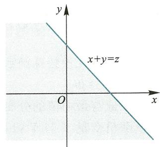  
图3.8

$$
f_{Z}(z) = F_{Z}^{\prime}(z) = \int_{-\infty}^{+\infty}f(z - y,y)\mathrm{d}y. \tag{3.4.9}
$$

由  $X$  与  $Y$  的对称性,又得

$$
f_{Z}(z) = \int_{-\infty}^{+\infty}f(x,z - x)\mathrm{d}x. \tag{3.4.10}
$$

例3.4.10在例3.4.9中,将  $L$  系统中的子系统  $L_{2}$  作为  $L_{1}$  的备用系统(即当系统  $L_{1}$  损坏时,系统  $L_{2}$  立即开始工作),求  $L$  的寿命  $Z$  的概率密度.

解  $L$  的寿命是系统  $L_{1}$  和系统  $L_{2}$  的寿命之和,即  $Z = X + Y.$  按照公式(3.4.9),注意到  $X$  和  $Y$  相互独立,当  $z > 0$  时,  $Z = X + Y$  的概率密度是

$$
\begin{array}{l}{{f_{z}(z)=\int_{-\infty}^{+\infty}f(z-y,y)\mathrm{d}y=\int_{-\infty}^{+\infty}f_{X}(z-y)f_{Y}(y)\mathrm{d}y}}\\ {{=\int_{0}^{z}\alpha\mathrm{e}^{-\alpha(z-y)}\beta\mathrm{e}^{-\beta y}\mathrm{d}y=\alpha\beta\mathrm{e}^{-\alpha z}\int_{0}^{z}\mathrm{e}^{-(\beta-y)}\mathrm{d}y=\frac{\alpha\beta}{\beta-\alpha}(\mathrm{e}^{-\alpha z}-\mathrm{e}^{-\beta z})}.}}\end{array}
$$

当  $z\leqslant 0$  时,  $f_{Z}(z) = 0$ ,从而

$$
f_{Z}(z) = \left\{ \begin{array}{ll}\frac{\alpha\beta}{\beta - \alpha} (\mathrm{e}^{-\alpha z} - \mathrm{e}^{-\beta z}), & z > 0, \\ 0, & z\leqslant 0. \end{array} \right.
$$

例3.4.11设随机变量  $X$  与  $Y$  相互独立,  $X\sim N(0,1),Y\sim N(0,1)$ ,求  $Z = X + Y$  的概率密度.

解由公式(3.4.10),并因  $X$  与  $Y$  相互独立,故有

$$
f_{Z}(z) = \int_{-\infty}^{+\infty}f_{X}(x)f_{Y}(z - x)\mathrm{d}x = \frac{1}{2\pi}\int_{-\infty}^{+\infty}\mathrm{e}^{-\frac{x^{2}}{2}}\mathrm{e}^{-\frac{(z - x)^{2}}{2}}\mathrm{d}x
$$

$$
= \frac{1}{2\pi}\mathrm{e}^{-\frac{z^{2}}{4}}\int_{-\infty}^{+\infty}\mathrm{e}^{-\left(x - \frac{z}{2}\right)^{2}}\mathrm{d}x.
$$

令  $t = x - \frac{z}{2}$ ,

$$
f_{Z}(z) = \frac{1}{2\pi}\mathrm{e}^{-\frac{z^{2}}{4}}\int_{-\infty}^{+\infty}\mathrm{e}^{-t^{2}}\mathrm{d}t = \frac{1}{2\sqrt{\pi}}\mathrm{e}^{-\frac{z^{2}}{4}},\quad z\in \mathbb{R}.
$$

即  $Z\sim N(0,2)$

一般地,若  $X$  与  $Y$  相互独立,  $X\sim N(\mu_{1},\sigma_{1}^{2}),Y\sim N(\mu_{2},\sigma_{2}^{2})$ ,则  $X + Y\sim N(\mu_{1} + \mu_{2},\sigma_{1}^{2} + \sigma_{2}^{2})$ ,即正态分布具有可加性.

利用有关公式求随机变量的函数的概率密度时,计算上的困难是定积分限.对以下的例子,我们借助于作图使求解过程变得更清晰.

例3.4.12设随机变量  $X$  与  $Y$  相互独立,并且都在  $[- a,a]$  上服从均匀分布.求它们的和  $X + Y$  的概率密度.

解  $X$  与  $Y$  的概率密度分别为

$$
f_{X}(x) = \left\{{\frac{1}{2a}},\quad |x|\leqslant a,\right.\qquad f_{Y}(y) = \left\{{\frac{1}{2a}},\quad |y|\leqslant a,\right.
$$

利用公式

$$
f_{Z}(z) = \int_{-\infty}^{+\infty}f_{X}(x)f_{Y}(z - x)\mathrm{d}x,
$$

考虑  $xOz$  平面的子域  $G = \{(x,z)\mid |x|\leqslant a,|z - x|\leqslant a\}$ ,则

$$
f_{X}(x)f_{Y}(z - x) = \left\{{\frac{1}{4a^{2}}},\quad (x,z)\in G,\right.
$$

如图3.9所示,  $G$  是一个平行四边形区域,于是

当  $0\leqslant z\leqslant 2a$  时,

$$
f_{Z}(z) = \frac{1}{4a^{2}}\int_{z - a}^{a}\mathrm{d}x = \frac{2a - z}{4a^{2}};
$$

当  $- 2a\leqslant z< 0$  时,

$$
f_{Z}(z) = \frac{1}{4a^{2}}\int_{-a}^{z + a}\mathrm{d}x = \frac{2a + z}{4a^{2}};
$$

当  $|z| > 2a$  时,  $f_{Z}(z) = 0$

综合以上结果得到  $Z = X + Y$  的概率密度为

$$
f_{Z}(z) = \left\{{\frac{2a + z}{4a^{2}}},\quad -2a\leqslant z< 0,\right.
$$

此时称  $Z$  服从辛普森分布或三角分布.

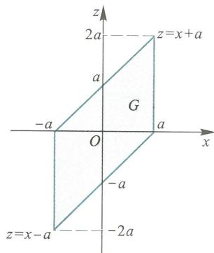  
图3.9

3. 商的分布

设  $(X,Y)$  的联合概率密度为  $f(x,y)$  ,则它们的商  $Z = \frac{X}{Y}$  的分布函数是

$$
F_{z}(z) = P\left\{Z\leqslant z\right\} = \iint_{x / y\leqslant z}f(x,y)\mathrm{d}x\mathrm{d}y = \iint_{G_{1}}f(x,y)\mathrm{d}x\mathrm{d}y + \iint_{G_{2}}f(x,y)\mathrm{d}x\mathrm{d}y,
$$

积分区域  $G_{1},G_{2}$  如图3.10所示,将其化为二次积分得

$$
\iint_{G_{1}}f(x,y)\mathrm{d}x\mathrm{d}y = \int_{0}^{+\infty}\left[\int_{-\infty}^{y z}f(x,y)\mathrm{d}x\right]\mathrm{d}y,
$$

固定  $z,y$  ,令  $u = \frac{z}{y}$  (注意  $y > 0$  ),则  $x = u y,\mathrm{d}x = y\mathrm{d}u$  ,得

$$
\begin{array}{r l r}{{\iint_{G_{1}}f(x,y)\mathrm{d}x\mathrm{d}y=\int_{0}^{+\infty}\left[\int_{-\infty}^{z}y f(u y,y)\mathrm{d}u\right]\mathrm{d}y}}\\ &{}&{=\int_{-\infty}^{z}\left[\int_{0}^{+\infty}y f(u y,y)\mathrm{d}y\right]\mathrm{d}u.}\end{array}
$$

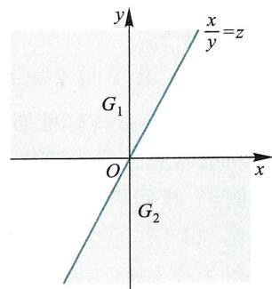  
图3.10

类似地,

$$
\iint_{G_{2}}f(x,y)\mathrm{d}x\mathrm{d}y = \int_{-\infty}^{0}\left[\int_{y z}^{+\infty}f(x,y)\mathrm{d}x\right]\mathrm{d}y,
$$

令  $u = \frac{x}{y}$  (注意现有  $y< 0$  ),有

$$
\begin{array}{r l r}{{\iint_{G_{2}}f(x,y)\mathrm{d}x\mathrm{d}y=\int_{-\infty}^{0}\left[\int_{z}^{+\infty}y f(u y,y)\mathrm{d}u\right]\mathrm{d}y}}\\ &{}&{=-\int_{-\infty}^{z}\left[\int_{-\infty}^{0}y f(u y,y)\mathrm{d}y\right]\mathrm{d}u,}\end{array}
$$

故有

$$
\begin{array}{l}{{F_{z}(z)=P\left\{Z\leqslant z\right\}}}\\ {{=\iint_{G_{1}}f(x,y)\mathrm{d}x\mathrm{d}y+\iint_{G_{2}}f(x,y)\mathrm{d}x\mathrm{d}y}}\\ {{=\int_{-\infty}^{z}\left[\int_{0}^{+\infty}y f(u y,y)\mathrm{d}y-\int_{-\infty}^{0}y f(u y,y)\mathrm{d}y\right]\mathrm{d}u.}}\end{array}
$$

根据连续型随机变量的定义,即可得到  $Z$  的概率密度为

$$
f_{z}(z) = \int_{0}^{+\infty}y f(z y,y)\mathrm{d}y - \int_{-\infty}^{0}y f(z y,y)\mathrm{d}y = \int_{-\infty}^{+\infty}\mid y\mid f(z y,y)\mathrm{d}y. \tag{3.4.11}
$$

例3.4.13 设  $(X,Y)$  的联合概率密度为

$$
f(x,y) = \left\{ \begin{array}{l l}{\sin y,} & {0\leqslant x\leqslant \frac{1}{2},0\leqslant y\leqslant \pi ,}\\ {0,} & {\mathbb{H}\backslash \mathbb{H}.} \end{array} \right.
$$

求  $Z = \frac{X}{Y}$  的概率密度.

解令  $G = \left\{(z,y)\mid 0\leqslant y\leqslant \pi ,0\leqslant z y\leqslant \frac{1}{2}\right\}$  ,则