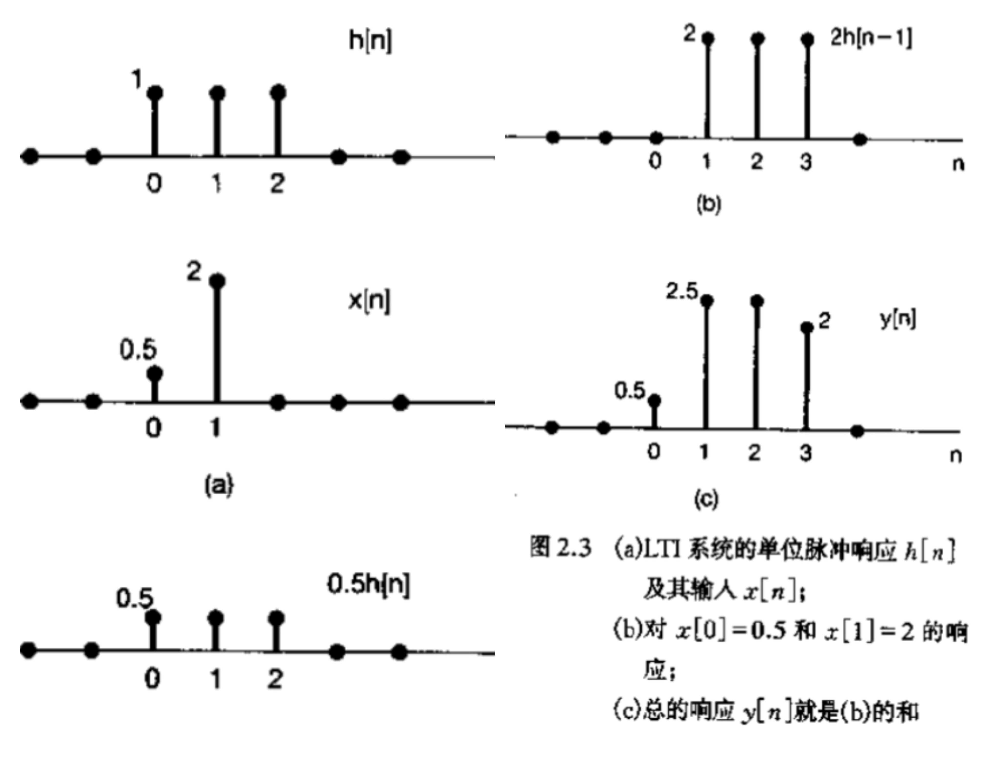

## 第一章 信号与系统
### 信号
#### 一些定义
1. 因果信号
	- 因果信号：t<0时x(t)=0
	- 反因果信号：t>0时x(t)=0
2. 辛格函数 Sinc ：$\sin(\theta) = \frac{\sin(\pi\theta)}{\pi\theta}$ 


#### 信号能量与功率
**瞬时功率**：$\mid x\left(t\right)\mid^2$
##### 总能量
连续时间信号（除以 $t_2-t_1$ 即得平均功率）
$$
\int_{t_{1}}^{t_{2}}\mid x\left(t\right)\mid^{2}\mathrm{d}t
$$
离散时间信号（除以 $n_2-n_1+1$ 即得平均功率）
$$
\sum_{n = n_{1}}^{n_{2}}\mid x[n]\mid^{2}
$$

### 自变量的变换
#### 例子
1. 时移
	- **延迟**：右移
	- **超前**：左移
2. 时间反转
3. 时间尺度变换（伸缩）

#### 周期信号 Periodic Signals
基础周期：最小正周期

#### 奇偶信号
奇偶分解：
$$E(x(t))=\frac{1}{2}(x(t)+x(-t))$$
### 指数信号
#### 实指数信号
$$x(t)=Ce^{at}$$
#### 周期复指数信号
$$x(t) = e^{i\omega_{0}t}$$
可以通过欧拉公式用与其相同周期的正弦信号表示。
#### 欧拉公式
$$
e^{j\omega_{0}t} = \cos \omega_{0}t + \mathrm{j} \sin \omega_{0}t
$$

#### 谐波集
$$
\phi_{k}(t) = \mathrm{e}^{\mathrm{i}k\omega_{0}t},\qquad k = 0,\pm 1,\pm 2,\dots
$$
离散时间谐波复指数信号集只有 $N$ 个，其中 $N$ 为周期。  
#### 一般复指数信号
$$
C\mathrm{e}^{a t} = \mid C\mid \mathrm{e}^{\mathrm{j}\theta}\mathrm{e}^{(r + j\omega_{0})t} = \mid C\mid \mathrm{e}^{rt}\mathrm{e}^{\mathrm{j}(\omega_{0}t + \theta)}
$$
$$
C\mathrm{e}^{a t} = \mid C\mid \mathrm{e}^{r t}\cos (\omega_{0}t + \theta) + j\mid C\mid \mathrm{e}^{r t}\sin (\omega_{0}t + \theta)
$$

#### 离散时间复指数信号周期性质
离散时间复指数信号在频率 $\omega_0$ 和 $\omega_0+2\pi$ 是完全一样的。
$$
\mathrm{e}^{\mathrm{j}(\omega_{0} + 2\pi)n} = \mathrm{e}^{\mathrm{j}2\pi n} \mathrm{e}^{\mathrm{j}\omega_{0}n} = \mathrm{e}^{\mathrm{j}\omega_{0}n}
$$

信号周期性要求 $\omega_{0} = 2\pi\frac{m}{N}$，周期为 $N$。

$\omega_0$ 在 $0-\pi$ 时周期缩短，频率加快；在 $\pi-2\pi$ 时周期增长，频率变慢。

### 单位冲激函数与单位阶跃函数 The Unit Impulse and Unit Step Functions
#### 离散时间单位脉冲和单位阶跃序列
单位脉冲：
$$
\delta [n] = \left\{ \begin{array}{l l}{0,} & {n\neq 0}\\ {1,} & {n = 0} \end{array} \right.
$$
单位阶跃：
$$
u[n] = \left\{ \begin{array}{ll}0, & n< 0 \\ 1, & n\geqslant 0 \end{array} \right.
$$
离散时间单位脉冲是离散时间单位阶跃的**一次差分**，即
$$
\delta [n] = u[n] - u[n - 1]
$$
离散时间阶跃是单位样本的**求和函数（runningsum）**，即
$$
u[n] = \sum_{m = -\infty}^{n}\delta [m]
$$
变换得一个可以**直观看出信号超前延迟的式子**：
$$
u[n] = \sum_{k = 0}^{\infty}\delta [n - k]
$$
#### 连续时间单位阶跃和单位冲激函数
单位阶跃（注意 $t=0$ 处不连续）：
$$
u\left(t\right) = \left\{ \begin{array}{l l}{0\qquad t< 0}\\ {1\qquad t > 0} \end{array} \right. 
$$

假设单位阶跃函数零点处连续微分得到单位冲激函数：
$$
\delta (t) = \frac{\mathrm{d} u(t)}{\mathrm{d} t}
$$
用在  $t = 0$  处箭头指出脉冲的面积是集中在  $t = 0$  ，用箭头旁边的高度 “1” 来表示该冲激的面积，称为**冲激强度**。更为一般地， $k\delta (t)$  的面积就是  $k$  ，因此有

$$
\int_{-\infty}^{t}k\delta (\tau)\mathrm{d}\tau = k u(t)
$$


应用：
```handwritten-ink
{
	"versionAtEmbed": "0.3.4",
	"filepath": "Ink/Writing/2025.9.8 - 11.43am (2).writing"
}
```
单位冲激函数的缩放性质（根据单位冲激函数的面积计算）：
$$
\delta(at)=\frac{1}{|a|}\delta(t)
$$

### 连续时间和离散时间系统
连续时间系统的输入 - 输出关系为 $x(t) \rightarrow y(t)$
离散时间系统的输入 - 输出关系为 $x[t] \rightarrow y[t]$

*系统级联（串联）*：前面系统的输出作为后面系统的输入。
*系统并联*：系统拥有相同的输入，输出为各个系统输出之和。

### 基本系统性质
#### 记忆与无记忆系统 Systems with and without Memory
> 如果对自变量的每一个值,一个系统的输出**仅仅**决定于**该时刻**的输入,这个系统就称为无记忆系统。

#### 可逆性与可逆系统 Invertibility and Inverse Systems
> 一个系统如果在不同的输入下,导致**不同的**输出,就称该系统是可逆的。

#### 因果性 Causality
> 如果一个系统在任何时刻的输出只决定于**现在的**输入以及**过去的**输入，该系统就称为因果系统。

#### 稳定性 Stability
> 直观上看,一个稳定系统在小的输入下的响应是不会发散的。如果怀疑某一系统是不稳定的话，那么一种实用的办法是力图找一个特别的有界输入是否会导致一个无界的输出来确认它，若找到了这样一个例子就能够得出该系统是不稳定的。

#### 时不变性 Time Invariance
> 若系统的特性行为不随时间而变,该系统就是时不变的。如果在输入信号上有一个时移,而在输出信号中产生同样的时移,那么这个系统就是时不变的。

#### 线性 Linearity
> 线性系统(连续时间或离散时间)具有一个很重要的性质就是叠加性质,即:如果某一个输入是由几个信号的加权和组成的话,那么输出也就是系统对这组信号中每一个的响应的加权和。
> 满足可加性（additivity）和齐次性（homogeneity，或称比例性scaling）。

把定义一个线性系统的两个性质结合在一起,可以简单地写成:
$$a x_{1}(t) + b x_{2}(t) \rightarrow a y_{1}(t) + b y_{2}(t)$$
式中  $\pmb{a}$  和  $\pmb{b}$  是任何复常数。


## 第二章：线性时不变系统 LTI System
### 离散时间 LTI 系统：卷积和
#### 用脉冲表示离散时间信号
将 $x[n]$ 看做一整个信号而 $x[0], x[1], \ldots$ 为某一位的值。
$$
\begin{array}{c}{{x[n]=\ldots+x[-3]\delta[n+3]+x[-2]\delta[n+2]+x[-1]\delta[n+1]+x[0]\delta[n]}}\\ {{+x[1]\delta[n-1]+x[2]\delta[n-2]+x[3]\delta[n-3]+\ldots}}\end{array}
$$
即：
$$
x[n] = \sum_{k = -\infty}^{+\infty} x[k] \delta [n - k]
$$
上式称为离散时间单位脉冲序列的**筛选性质**。

#### 离散时间 LTI 系统的单位响应以及卷积和的表示
令  $h_{k}[n]$  记为该线性系统对移位单位脉冲  $\delta [n-k]$  的响应（$h_{k}[n] = h_{0}[n - k]$）。
$$
y[n] = \sum_{k = -\infty}^{+\infty}x[k]h_{k}[n]
$$
将 $h_{0}[n]$ 下标去掉，即令 $h[n] = h_{0}[n]$，则上式变为**卷积和**：
$$
y[n]=\sum_{k=-\infty}^{+\infty}x[k]h[n-k]
$$
右边的运算称为**卷积**，即：
$$
y[n]=\sum_{k=-\infty}^{+\infty}x[k]h[n-k]=x[n]*h[n]
$$
“$*$” 表示卷积。

上图为按照以 $n$ 为变量计算，下面引出一个以 $k$ 为变量的方法：
	法二：
	从 $h[k]$ 开始，将 $h[k]$ 变换成 $h[n-k]$（$n$ 看做常数），将$h[n-k]$ 与 $x[k]$ 每位相乘得 $\sum_{k=-\infty}^{+\infty}x[k]h[n-k]$。

 或者将卷积两边看做两个多项式：
 	法三：
 	$x[n]$ 看做 $x(s)=a_0s^0+a_1s^1+\ldots$；
 	$h[n]$ 看做 $h(s)=b_0s^0+b_1s^1+\ldots$；
 	两者相乘得到每位的结果。

卷积的*性质*：
	$\delta[n-n_1]*\delta[n-n_2]=\delta[n-n_1-n_2]$
	交换律结合律分配律
```handwritten-ink
{
	"versionAtEmbed": "0.3.4",
	"filepath": "Ink/Writing/2025.9.22 - 10.36am.writing"
}
```


### 连续时间 LTI 系统：卷积积分
#### 用冲激表示连续时间信号
$$
\hat{x}\left(t\right) = \sum_{k = -\infty}^{\infty}x(k\Delta)\delta_{\Delta}(t - k\Delta)\Delta
$$
$$
x(t) = \lim_{\Delta \to 0}\sum_{k = -\infty}^{+\infty}x(k\Delta)\delta_{\Delta}(t - k\Delta)\Delta
$$
$$
x(t) = \int_{-\infty}^{+\infty}x(\tau)\delta (t - \tau)\mathrm{d}\tau
$$
当且仅当 $t=\tau$ 时 $\delta(t-\tau)$ 才有值，故此时 $x(t)=x(\tau)$：
$$
\int_{-\infty}^{+\infty}x(\tau)\delta (t - \tau)\mathrm{d}\tau = \int_{-\infty}^{+\infty}x(t)\delta (t - \tau)\mathrm{d}\tau = x(t)\int_{-\infty}^{+\infty}\delta (t - \tau)\mathrm{d}\tau = x(t)
$$

#### 连续时间 LTI 系统的单位冲激响应及卷积积分表示
$$
y(t) = \int_{-\infty}^{+\infty}x(\tau)h_{\tau}(t)\mathrm{d}\tau
$$
$$
y(t) = \int_{-\infty}^{+\infty}x(\tau)h(t - \tau)\mathrm{d}\tau = x(t)\ast h(t)
$$
### LTI 系统的性质
#### 记忆和无记忆 LTI 系统
无记忆 LTI 系统的 $h(t)$ 一定等于 $n\delta(t)$。

#### LTI 系统的可逆性
$$
h(t) * h_{-1}(t) = \delta (t)
$$

#### LTI 系统的因果性
*初始松弛条件*：
	在输入信号前所有状态都为零。即输入在某个时刻点以前是0,那么其输出在那个时刻以前也必须是0。

一个**线性系统**的因果性就等效于初始松弛(initial rest)的条件。

#### LTI 系统的稳定性
*离散时间 LTI 系统稳定性充要条件*：
	单位脉冲响应绝对可和，即：
	$$
	\sum_{k = -\infty}^{+\infty} |h[k]| < \infty
	$$
*连续时间 LTI 系统稳定性充要条件*：
	单位冲激响应绝对可积，即：
	$$
	\int_{-\infty}^{+\infty} |h(\tau)| \mathrm{d}\tau < \infty
	$$

#### LTI 系统的单位阶跃响应
$$
s(t)=u(t)*h(t)=\int^{t}_{-\infty}h(\tau)\mathrm{d}\tau
$$
*积分可分离*：
$$
x^{(-1)}(t)=\int^{t}_{-\infty}x(\tau)\mathrm{d}\tau=\int^{+\infty}_{-\infty}x(\tau)u(t-\tau)\mathrm{d}\tau=x(t)*u(t)
$$
*积分可转嫁*：
$$
x^{(-1)}(t)*h(t)=x(t)*u(t)*h(t)=x(t)*h^{(-1)}(t)
$$
*延迟可分离*：
$$
x(t-t_0)=x(t)*\delta(t-t_0)
$$
*求导可转嫁*：
$$
x^{(1)}(t)*\delta(t)=x(t)*\delta^{(1)}(t)
$$

### 奇异函数
#### 通过卷积定义单位冲激
> 定义  $\delta (t)$  为一个信号, 其对任何  $x(t)$  有 $x(t) = x(t) * \delta (t)$。

单位冲激（Unit Impulse）作为理想化的短脉冲（Pulse）信号。

#### 单位冲激偶和其他奇异函数
$$
u(t)=u_{-1}(t)=\delta^{-1}(t),\quad u_{0}(t)=\delta(t),\quad u_1(t)=\delta^{(1)}(t)
$$
$u_1(t)=\frac{\mathrm{d}x(t)}{\mathrm{d}t}=\delta^{(1)}(t)$ 称为**单位冲激偶**（Unit Doublet）。
由求导可转嫁得
$$x(t)*\delta^{(1)}(t)=x^{(1)}(t)*\delta(t)$$
同理得到
$$
u_k(t)=\underbrace{u_1(t)*u_1(t)*\dots*u_1(t)}_{共k个u_1(t)卷积}
$$
$$
\delta(at)=\frac{1}{|a|}\delta(t),\quad u_1(at)=\frac{1}{a|a|}u_1(t)
$$

## 第三章 周期信号的傅里叶级数表示
### LTI 系统对复指数信号的响应
$$
连续时间：\quad e^{st}\to H(s)e^{st}
$$
其中 $s$ 为任意复数。
$$
y(t) = \int_{-\infty}^{+\infty}h(\tau)x(t - \tau)\mathrm{d}\tau = \int_{-\infty}^{+\infty}h(\tau)\mathrm{e}^{s(t -\tau)}\mathrm{d}\tau
$$
$$
y(t) ＝ h(t)*e^{st} = \mathrm{e}^{s t}\int_{-\infty}^{+\infty}h\left(\tau\right)\mathrm{e}^{-s\tau}\mathrm{d}\tau = H(s)e^{st}
$$
假设右边积分收敛，其中：
$$
H(s) = \int_{-\infty}^{+\infty}h(\tau)\mathrm{e}^{-s\tau}\mathrm{d}\tau \tag{3.6}
$$
上式称为**系统函数**，$H(s)$ 称为复振幅因子，$e^{st}$ 称为 LTI 系统的**特征函数**（即一个信号，若系统对该信号的输出响应仅为一个常复数乘以输入，则称该信号为系统的特征函数），对某一给定的 $\pmb{s}$ 值，复常数 $H(s)$ 就是与特征函数 $\mathbf{e}^{\mathbf{z}}$ 有关的特征值。

当 $x(t) = \sum_{k}a_{k}\mathrm{e}^{s_{k}t}$ 时有 $y(t) = \sum_{k}a_{k}H(s_{k})\mathrm{e}^{s_{k}t}$，如果一个LTI系统的输入能够表示成复指数的线性组合，那么系统的输出也能够表示成相同复指数信号的线性组合。

考虑 $s=j\omega$ 即单位振幅的周期复指数函数 $e^{j\omega t}$。

### 连续时间周期信号的傅里叶级数表示
#### 成谐波关系的复指数信号的线性组合
$$
x(t) = \sum_{k = -\infty}^{+\infty}a_{k}\mathrm{e}^{\mathrm{j}k\omega_{0}t} = \sum_{k = -\infty}^{+\infty}a_{k}\mathrm{e}^{\mathrm{j}k(2\pi /T)t} \tag{3.25}
$$
易知 $x(t)$ 基础周期为 $T$。
上式称为周期信号的**傅里叶级数**（Fourier Series）表示的**综合（synthesis）公式**，$k=\pm N$ 的分量称为第 $N$ 次谐波分量。

$x(t)$ 为一实信号，有 $x^*(t)=x(t)$，其中 $x^*(t)$ 表示共轭。
$$
x(t) ＝ x^*(t) = \sum_{k = -\infty}^{+\infty}a_{k}^{*}\mathrm{e}^{-\mathrm{j}k\omega_{0}t}
$$
在该求和式中, 以  $- k$  代替  $k$ , 则
$$
x(t) = \sum_{k = -\infty}^{+\infty}a_{-k}^{*}\mathrm{e}^{\mathrm{j}k\omega_{0}t}
$$
与 FS 表示比较有 $a_{k} = a_{- k}^{*}$，即 $a_{k}^{*} = a_{-k}$。

则 $a_{-k}e^{-jk\omega t}$ 和 $a_{k}e^{jk\omega t}$ 共轭，$a_{-k}e^{-jk\omega t}＋a_{k}e^{jk\omega t}＝2\Re\{a_ke^{jk\omega t}\}$。
所以有
$$
x(t) = \sum_{k = -\infty}^{+\infty}a_{k}\mathrm{e}^{\mathrm{j}k\omega_{0}t} ＝a_{0} + \sum_{k = 1}^{\infty}2\mathcal{R}_{e}\{a_{k}\mathrm{e}^{\mathrm{i}k\omega_{0}t}\}
$$
以极坐标形式表示，令 $a_k=A_ke^{j\theta_k}$，取实部有
$$
x(t)=a_0+2\sum^{\infty}_{k=1}A_kcos(k\omega_0t+\theta_k) \tag{3.31}
$$
以笛卡尔坐标系形式表示，令 $a_{k} = B_{k} + \mathrm{j}C_{k}$，取实部有
$$
x(t) = a_{0} + 2\sum_{k = 1}^{\infty}\left[B_{k}\cos k\omega_{0}t - C_{k}\sin k\omega_{0}t\right] \tag{3.32}
$$
前两式同样为 FS 表示。

#### 连续时间周期信号傅里叶级数表示的确定
确定系数 $a_k$，将综合公式两边各乘以  $\mathrm{e}^{- \mathrm{j}n\omega_{0}t}$ ,可得
$$
x(t)\mathrm{e}^{-\mathrm{j}n\omega_{0}t} = \sum_{k = -\infty}^{+\infty}a_{k}\mathrm{e}^{\mathrm{j}k\omega_{0}t}\mathrm{e}^{-\mathrm{j}n\omega_{0}t}
$$
在一个周期上积分：
$$
\int_{0}^{T}x(t)\mathrm{e}^{-\mathrm{j}n\omega_{0}t}\mathrm{d}t = \int_{0}^{T}\sum_{k = -\infty}^{+\infty}a_{k}\mathrm{e}^{\mathrm{j}k\omega_{0}t}\mathrm{e}^{-\mathrm{j}n\omega_{0}t}\mathrm{d}t
$$
$$
\int_{0}^{T}x(t)\mathrm{e}^{-\mathrm{j}n\omega_{0}t}\mathrm{d}t = \sum_{k = -\infty}^{+\infty}a_{k}\bigg[\int_{0}^{T}\mathrm{e}^{\mathrm{j}(k - n)\omega_{0}t}\mathrm{d}t\bigg]
$$
$$
\int_{0}^{T}\mathrm{e}^{\mathrm{j}(k - n)\omega_{0}t}\mathrm{d}t = \int_{0}^{T}\cos ((k - n)\omega_{0}t)\mathrm{d}t + \mathrm{j}\int_{0}^{T}\sin ((k - n)\omega_{0}t)\mathrm{d}t
$$
得到
$$
\int_{0}^{T}\mathrm{e}^{\mathrm{j}(k - n)\omega_{0}t}\mathrm{d}t = \left\{ \begin{array}{l l}{T,} & {k = n}\\ {0,} & {k\neq n} \end{array} \right.
$$
故得到**傅里叶级数系数（频谱系数）**（Fourier series coefficients(spectral coefficients)）：
$$
a_{n} = \frac{1}{T}\int_{T}x(t)\mathrm{e}^{-\mathrm{j}n\omega_{0}t}\mathrm{d}t \tag{3.39}
$$
上式（$a_n$ 式）称为**分析公式**，其中 $\int_T$ 表示在任何一个 $T$ 间隔内的积分，$k=0$ 代入得到 $x(t)$ 在一个周期内的平均值 $a_0=\frac{1}{T}\int_Tx(t)\mathrm{d}t$。

周期性方波信号在一个周期内定义如下：
$$x(t) = \left\{ \begin{array}{ll}1, & |t|< T_{1} \\ 0, & T_{1}< |t|< T / 2 \end{array} \right.$$
则方波的傅里叶级数系数为：
$$
a_{k} = \frac{2\sin(k\omega_{0}T_{1})}{k\omega_{0}T} = \frac{\sin(k\omega_{0}T_{1})}{k\pi}, k\neq 0 \tag{3.44}
$$

注：
```handwritten-ink
{
	"versionAtEmbed": "0.3.4",
	"filepath": "笔记/信号与系统/images/Ink/Writing/2025.9.29 - 11.36am.writing"
}
```

### 傅里叶级数的收敛
$a_k$ 收敛的条件：
$$
\int_{T}|x(t)|^{2}\mathrm{d}t< \infty \tag{3.51}
$$
#### 狄利赫里条件
*条件一*：
	任何周期内，$x(t)$ 必须绝对可积，即
$$
\int_{T}\mid x\left(t\right)\mid \mathrm{d}t< \infty \tag{3.56}
$$
*条件二*：
	在任意有限区间内，$x(t)$ 具有有限个起伏变化；也就是说，在任何单个周期内，$x(t)$ 的最大值和最小值的数目有限。
*条件三*：
	在 $x(t)$ 的任何有限区间内，只有有限个不连续点，而且在这些不连续点上,函数是有限值。

在 $x(t)$ 不连续的点上，无穷傅里叶级数收敛于不连续点两边值的平均值。
#### 不满足狄利赫里条件的信号
![[不满足狄利赫里条件的信号.jpg]]

#### 吉伯斯现象
> 一个不连续信号  $\pmb {x}(t)$  的傅里叶级数的截断近似  $\pmb{x}_{N}(t)$  ，一般说来，在接近不连续点处将呈现高频起伏和超量。

### 连续时间傅里叶级数的性质
若 $x(t)$ 的傅里叶级数系数记作 $a_{k}$，则用 $x(t)\xleftrightarrow{\mathcal{FS}}a_k$ 表示。
#### 线性性
> 令 $x(t)$ 和 $y(t)$ 为两个周期信号，周期为 $T$，它们的傅里叶级数系数分别为 $a_{k}$ 和 $b_{k}$，则 $x(t)$ 和 $y(t)$ 的线性组合 $z(t) = A x(t) + B y(t)$ 的傅里叶级数系数  $c_{k}=A a_{k} + B b_{k}$。

#### 时移性
$y(t)$ $= x\left(t - t_{0}\right)$  的傅里叶级数系数  $b_{k}$  可以表示为
$$
b_{k} = \frac{1}{T}\int_{T}x(t - t_{0})\mathrm{e}^{-\mathrm{i}k\omega_{0}t}\mathrm{d}t
$$
$$
\frac{1}{T}\int_{T}x(\tau)\mathrm{e}^{-\mathrm{i}k\omega_{0}(\tau +t_{0})}\mathrm{d}\tau = \mathrm{e}^{-\mathrm{i}k\omega_{0}t_{0}}\frac{1}{T}\int_{T}x(\tau)\mathrm{e}^{-\mathrm{i}k\omega_{0}\tau}\mathrm{d}\tau = \mathrm{e}^{-\mathrm{i}k\omega_{0}t_{0}}a_{k} = \mathrm{e}^{-\mathrm{i}k(2\pi /T)t_{0}}a_{k}
$$
若  $x(t)\xleftrightarrow{FS}a_k$  则 $x(t-t_0)\xleftrightarrow{FS}e^{-jk\omega_0t_0}a_k$。
得到当一个周期信号在时间上移位时，它的傅里叶级数系数的模保持不变，即  $\left| b_{k} \right| = \left| a_{k} \right|$。

#### 时间反转
$$
x(- t) = \sum_{k = -\infty}^{\infty}a_{k}\mathbf{e}^{-j k2\pi t / T}＝ \sum_{m = -\infty}^{\infty}a_{-m}\mathrm{e}^{\mathrm{i}m2\pi t / T}
$$
若  $x(t)\xleftrightarrow{FS}a_k$  则  $x(-t)\xleftrightarrow{FS}a_{-k}$。
得到若  $x\left(t\right)$  为偶函数，即  $x\left(- t\right) = x\left(t\right)$  ，则其傅里叶级数系数也为偶，即  $a_{－k} = a_{k}$  ；若  $x\left(t\right)$  为奇函数，即  $x\left(- t\right) = - x\left(t\right)$  ，则其傅里叶级数系数也为奇，即  $a_{-k} = - a_{k}$  。

#### 时域尺度变换
$$
x(\alpha t) = \sum_{k = -\infty}^{\infty}a_{k}\mathrm{e}^{\mathrm{i}k(\alpha \omega_{0}t)}
$$
傅里叶级数系数不变，傅里叶级数改变。

#### 相乘
$x(t)$ 和 $y(t)$ 是两个周期为 $\pmb{T}$ 的周期信号，且有 $x(t)\xleftrightarrow{\mathcal{FS}}a_k$，$y(t)\xleftrightarrow{\mathcal{FS}}b_k$。得到
$$
x(t)y(t)\xleftrightarrow{\mathcal{FS}}h_k=\sum_{i = -\infty}^{\infty} a_{i} b_{k - i}=a*b
$$

#### 共轭及共轭对称
若 $x(t)\xleftrightarrow{\mathcal{FS}}a_k$，有 $x^*(t)\xleftrightarrow{\mathcal{FS}}a^*_{-k}$。
当 $x(t)$ 为**实函数**时**傅里叶级数系数共轭对称**，即 $a_{-k}=a^*_k$。此时对于实信号的傅里叶级数系数的模、相位、实部和虚部又依次意味着各种对称性质。
若  $x(t)$  为实且为偶函数,那么它的傅里叶级数系数也为实且为偶函数。类似地有,若  $x(t)$  为实且为奇函数,那么它的傅里叶级数系数为纯虚数且为奇函数。

#### 连续时间周期信号的帕斯瓦尔定理
> 一个周期信号的总平均功率等于它的全部谐波分量的平均功率之和。
> $$\frac{1}{T} \int_{T} |x(t)|^{2} \mathrm{~d}t = \sum_{k = -\infty}^{+\infty} |a_{k}|^{2} \tag{3.67}$$

式子左边是周期信号在一个周期内的平均功率（单位时间内的能量）。
同时有
$$
\frac{1}{T}\int_{T}\left|a_{k}\mathrm{e}^{\mathrm{j}k\omega_{0}t}\right|^{2}\mathrm{d}t = \frac{1}{T}\int_{T}\left|a_{k}\right|^{2}\mathrm{d}t = \left|a_{k}\right|^{2} \tag{3.68}
$$
左边为第 $k$ 次谐波的平均功率。

#### 微分
若 $x(t)\xleftrightarrow{\mathcal{FS}}a_k$ 则  $\frac{\mathrm{d}x(t)}{\mathrm{d}t}\xleftrightarrow{\mathcal{FS}}jk\omega_0a_k$。

#### 连续时间傅里叶级数性质列表
![[连续时间傅里叶级数性质列表.jpg]]


### 离散时间周期信号的傅里叶级数表示
#### 成谐波关系的复指数信号的线性组合
$$
x[n]= \sum_{k = \langle N\rangle}^{N}a_{k}\mathrm{e}^{\mathrm{i}k\omega_{0}n} = \sum_{k = \langle N\rangle}^{N}a_{k}\mathrm{e}^{\mathrm{i}k(2\pi /N)n}
$$
上式为离散时间傅里叶级数对分析公式。

一个周期复指数序列的值在整个一个周期内求和,除非该复指数是某一常数,否则,其和为零。
$$
\sum_{n = \langle N\rangle}e^{\mathrm{i}k(2\pi /N)n} = \left\{ \begin{array}{l l}{N,} & {k = 0,\pm N,\pm 2N,\dots ,}\\ {0,} & {其他} \end{array} \right. \tag{3.90}
$$
类似连续时间周期信号的傅里叶级数求解，在式子两边各乘以  $\mathrm{e}^{- \mathrm{j}r(2\pi /N)n}$  ,然后在  $N$  项上求和,得到
$$
\sum_{n = \langle N\rangle}x\left[n\right]\mathrm{e}^{-\mathrm{j}r(2\pi /N)n} = \sum_{n = \langle N\rangle}\sum_{k = \langle N\rangle}a_{k}\mathrm{e}^{\mathrm{j}(k - r)(2\pi /N)n} \tag{3.91}
$$
$$
\sum_{n = \langle N\rangle}x\left[n\right]\mathrm{e}^{-\mathrm{j}r(2\pi /N)n} = \sum_{k = \langle N\rangle}a_{k}\sum_{n = \langle N\rangle}\mathrm{e}^{\mathrm{j}(k - r)(2\pi /N)n} \tag{3.92}
$$
得到傅里叶系数级数（频谱系数）：
$$
a_{r} = \frac{1}{N}\sum_{n = \langle N\rangle}x\left[n\right]\mathrm{e}^{-\mathrm{j}r(2\pi /N)n} \tag{3.93}
$$
其傅里叶级数和傅里叶级数系数都以 $N$ 为周期，则两者都是有限的序列。


### 傅里叶级数与 LTI 系统
当 $s$ 为一般复数时，$H(s)$ 称为该系统的**系统函数**。以下令 $s=j\omega$。具有  $s = \mathrm{j}\omega$  形式的系统函数(即  $H(j\omega)$  看作  $\omega$  的函数)就称为该系统的频率响应，即：
$$
H(\mathrm{j}\omega) = \int_{-\infty}^{+\infty}h\left(t\right)\mathrm{e}^{-\mathrm{j}\omega t}\mathrm{d}t \tag{3.121}
$$
则对于傅里叶级数 $x(t) = \sum_{k = -\infty}^{+\infty}a_{k}\mathrm{e}^{\mathrm{j}k\omega_{0}t}$，其作为 LTI 输入得到的输出为
$$
y(t) = \sum_{k = -\infty}^{+\infty}a_{k}H(\mathrm{j}k\omega_{0})\mathrm{e}^{\mathrm{j}k\omega_{0}t} \tag{3.124}
$$
这就是说, LTI 系统的作用就是通过乘以相应频率点上的频率响应值来逐个地改变输入信号的每一个傅里叶系数。


### 滤波
用于改变频谱形状的线性时不变系统往往称之为**频率成形滤波器**。专门设计成基本上无失真地通过某些频率，而显著地衰减掉或消除掉另一些频率的系统称为**频率选择性滤波器**。

注意离散信号的频率特殊性，即 $0$ 和 $2\pi$ 附近为低频，$\pi$ 附近为高频。


## 第四章：连续时间傅里叶变换（Fourier Transform）
### 非周期信号的表示：连续时间傅里叶变换
#### 从傅里叶级数导出傅里叶变换
将非周期信号当成一个周期信号在周期无限大时的极限看待。

对于周期信号 $\tilde{x}(t)$，$x(t)$ 为$\tilde{x}(t)$ 的一个周期：
$$
\tilde{\pmb{x}}\left(\pmb {t}\right) = \sum_{k = -\infty}^{\infty}a_{k}\mathrm{e}^{\mathrm{i}k\omega_{0}t} \tag{4.3}
$$
$$
a_{k} = \frac{1}{T}\int_{-T / 2}^{T / 2}\tilde{x}\left(t\right)\mathrm{e}^{-\mathrm{i}k\omega_{0}t}\mathrm{d}t \tag{4.4}
$$
式中  $\omega_{0} = 2\pi /T$  。由于在  $|t|< T / 2$  内，  $\tilde{x} (t) = x(t)$  ,而在其余地方  $x\left(t\right) = 0$  ,所以(4.4)式可以重新写成
$$
a_{k} = \frac{1}{T}\int_{-T / 2}^{T / 2}x\left(t\right)\mathrm{e}^{-\mathrm{i}k\omega_{0}t}\mathrm{d}t = \frac{1}{T}\int_{-\infty}^{+\infty}x\left(t\right)\mathrm{e}^{-\mathrm{i}k\omega_{0}t}\mathrm{d}t
$$
因此,定义  $T a_{k}$  的包络  $X(\mathrm{j}\omega)$  为
$$
X(\mathrm{j}\omega) = \int_{-\infty}^{+\infty}x(t)\mathrm{e}^{-\mathrm{i}\omega t}\mathrm{d}t \tag{4.5}
$$
这时，系数  $\pmb{a}_{k}$  可以写为
$$
a_{k} = \frac{1}{T} X(\mathrm{j}k\omega_{0}) \tag{4.6}
$$
则
$$
\tilde{x} (t) = \sum_{k = -\infty}^{+\infty}\frac{1}{T} X(j k\omega_{0})\mathrm{e}^{\mathrm{i}k\omega_{0}t}(t) = \frac{1}{2\pi}\sum_{k = -\infty}^{+\infty}X(\mathrm{j}k\omega_{0})\mathrm{e}^{\mathrm{j}k\omega_{0}t}\omega_{0}
$$
因为 $x(t)=\lim_{T\to\infty}\tilde{x}(t)$，同时 $\omega_0\to 0$，则上式和式(4.5)变为
$$
\boxed{x(t) = \frac{1}{2\pi}\int_{-\infty}^{+\infty}X(\mathrm{j}\omega)\mathrm{e}^{\mathrm{j}\omega t}\mathrm{d}\omega} \tag{4.8}
$$
$$
\boxed{X(\mathrm{j}\omega) = \int_{-\infty}^{+\infty}x(t)\mathrm{e}^{-\mathrm{j}\omega t}\mathrm{d}t} \tag{4.9}
$$
上面两式称为**傅里叶变换对**。函数  $X(\mathrm{j}\omega)$  称为  ${\pmb x}(t)$  的**傅里叶变换**或**傅里叶积分**或称为 ${\pmb x}(t)$ 的频谱，而(4.8)式称为**傅里叶反变换式**。
$$
a_{k} = \frac{1}{T} X(\mathrm{j}\omega)\bigg|_{\omega = k\omega_{0}} \tag{4.10}
$$
即 $\tilde{x} (t)$ 的傅里叶系数正比于**一个周期内**的  $\tilde{x} (t)$  信号傅里叶变换的样本，注意这里的 $X(j\omega)$ 是单周期信号的傅里叶变换。

由上可知式 (3.6) 中 $H(s)$ 实际上就是 $h(t)$ 的傅里叶变换。

对于两个信号 $a(t)\leftrightarrow A(j\omega),\quad b(t)\leftrightarrow B(j\omega)$，若 $a(t)=B(\omega)$，则 $A(\omega)=2\pi b(-\omega)$。

记 $\mathrm{sinc}(\theta)=\frac{\sin\pi\theta}{\pi\theta}$。
![[傅里叶变换例子.jpg]]

#### 傅里叶变换的收敛
*狄利赫里条件*：
1.  $x(t)$  绝对可积,即
$$
\int_{-\infty}^{+\infty}|x(t)|\mathrm{d}t< \infty \tag{4.13}
$$
2. 在任何有限区间内,  $x(t)$  只有有限个最大值和最小值。
3. 在任何有限区间内，  $x\left(t\right)$  有有限个不连续点，并且在每个不连续点都必须是有限值。因此，本身是连续的或者只有有限个不连续点的绝对可积信号都存在傅里叶变换。

#### 重要例子
$$
\delta(t)\xleftrightarrow{FT}1
$$
$$
e^{-at}u(t)\xleftrightarrow{FT}\frac{1}{a + \mathrm{j}\omega},\quad a > 0
$$
$$
e^{at}u(-t)\xleftrightarrow{FT}\frac{1}{a - \mathrm{j}\omega},\quad a > 0
$$
$$
\int_{-\infty}^{+\infty}e^{\pm jxy}\mathrm{d}x=2\pi\delta(y)
$$
$$
P_{2T_1}(t)\xleftrightarrow{FT}\frac{\sin(\omega T_{1})}{\omega /2} = 2T_1\frac{\sin(\omega T_{1})}{\omega T_1}
$$
$$
sgn(t)=\begin{cases}1,\quad x>0;\\0,\quad x<0.\end{cases}\quad  sgn(t)\overset{FT}{\leftrightarrow}\frac{2}{\mathrm{j}\omega}
$$
$$
u(t)=\frac{1}{2}+\frac{1}{2}sgn(t),\quad u(t)\overset{FT}{\leftrightarrow}\pi\delta(\omega)+\frac{1}{\mathrm{j}\omega}
$$
### 周期信号的傅里叶变换
对于一个周期函数：
$$
x(t) = \sum_{k = -\infty}^{+\infty}a_{k}\mathrm{e}^{\mathrm{i}k\omega_{0}t}\xleftrightarrow{FT}X(\mathrm{j}\omega) = \sum_{k = -\infty}^{+\infty}2\pi a_{k}\delta (\omega - k\omega_{0})
$$
由上可知周期信号的频谱是离散的。

得到 $a_k=\frac{1}{2\pi}X(\mathrm{j}\omega)|_{\omega=k\omega_0}$，注意这里的 $X(\mathrm{j}\omega)$ 是周期信号的傅里叶变换。

### 连续时间傅里叶变换性质
$X(\mathrm{j}\omega)$ 记作 $\mathcal{F}\{x(t)\}$，$x(t)$ 记作 $\mathcal{F}^{- 1}\{X(\mathrm{j}\omega)\}$，这一对记作$x(t)\overset {\mathcal{F}}{\leftrightarrow}X(\mathrm{j}\omega)$
#### 线性
若 $x(t)\overset {\mathcal{F}}{\leftrightarrow}X(\mathrm{j}\omega)$ 和 $y(t)\overset {\mathcal{F}}{\leftrightarrow}Y(\mathrm{j}\omega)$，则
$$
a x(t) + b y(t)\overset {\mathcal{F}}{\leftrightarrow}a X(\mathrm{j}\omega) + b Y(\mathrm{j}\omega) \tag{4.26}
$$
#### 时移性质
若 $x(t)\overset {\mathcal{F}}{\leftrightarrow}X(\mathrm{j}\omega)$，则
$$
x(t - t_{0})\overset{\mathcal{F}}{\leftrightarrow}\mathrm{e}^{-\mathrm{j}\omega t_{0}}X(\mathrm{j}\omega) \tag{4.27}
$$
例如
$$
\delta(t - t_{0})\overset{\mathcal{F}}{\leftrightarrow}\mathrm{e}^{-\mathrm{j}\omega t_{0}}
$$
*频移（时移的对偶）*：
$$
\mathrm{e}^{\mathrm{j}\omega_{0}t}x(t)\overset {\mathcal{F}}{\leftrightarrow}X(\mathrm{j}(\omega -\omega_{0})) \tag{4.41}
$$
#### 共轭与共轭对称性
若 $x(t) \stackrel{\mathcal{F}}{\leftrightarrow} X(\mathrm{j}\omega)$，则
$$
x^{*}(t) \stackrel{\mathcal{F}}{\leftrightarrow} X^{*}(-\mathrm{j}\omega) \tag{4.28}
$$

若  ${\pmb x}\left({\pmb t}\right)$  为实函数,那么  $X(\mathrm{j}\omega)$  就具有共轭对称性,即
$$
X(-\mathrm{j}\omega) = X^{*}(\mathrm{j}\omega)\qquad x(t)为实函数 \tag{4.30}
$$
用直角坐标系表示：
$$
X(\mathrm{j}\omega) = \mathcal{Re}\{X(\mathrm{j}\omega)\} +\mathrm{j}\mathcal{Im}\{X(\mathrm{j}\omega)\}
$$
若  ${\pmb x}\left({\pmb t}\right)$  为实函数，傅里叶变换的实部是频率的偶函数,而虚部则是频率的奇函数。
$$
\mathcal{Re}\{X(\mathrm{j}\omega)\} = \mathcal{Re}\{X(-\mathrm{j}\omega)\}
$$
$$
\mathcal{Im}\{X(\mathrm{j}\omega)\} = -\mathcal{Im}\{X(-\mathrm{j}\omega)\}
$$

用极坐标表示：
$$
X(j\omega) = \{X(j\omega)\} \mathrm{e}^{\mathrm{j}\sphericalangle X(j\omega)}
$$
若  ${\pmb x}\left({\pmb t}\right)$  为实函数，$\mid X(\mathrm{j}\omega)\mid$  是频率  $\omega$  的偶函数,  $\sphericalangle X(\mathrm{j}\omega)$  是频率  $\omega$  的奇函数。

$x(t)$ 为实偶函数， $X(jw)$ 是实偶函数。
$x(t)$ 为实奇函数， $X(jw)$ 是纯虚奇函数。

$x(t) \stackrel{\mathcal{F}}{\leftrightarrow} X(\mathrm{j}\omega)$，则
$$
\mathcal{Ev}\{x(t)\} \overset {\mathcal{F}}{\leftrightarrow}\mathcal{Re}\{X(\mathrm{j}\omega)\}
$$
$$
\mathcal{Od}\{x(t)\} \overset {\mathcal{F}}{\leftrightarrow}\mathrm{j}\mathcal{Im}\{X(\mathrm{j}\omega)\}
$$

#### 微积分
$$
x^{(1)}(t)\overset {\mathcal{F}}{\leftrightarrow}\mathrm{j}\omega X(\mathrm{j}\omega) \tag{4.31}
$$
$$
x^{(-1)}(t) \overset {\mathcal{F}}{\leftrightarrow}\frac{1}{\mathrm{j}\omega} X(\mathrm{j}\omega) + \pi X(\omega)\delta (\omega) \tag{4.32}
$$
*微分的对偶*：
$$
-\mathrm{j}t x\left(t\right)\xleftrightarrow{F} \frac{\mathrm{d}X\left(\mathrm{j}\omega\right)}{\mathrm{d}\omega} \tag{4.40}
$$
*积分的对偶*：
$$
-\frac{1}{\mathrm{j}t} x(t) + \pi x(t)\delta (t)\overset {\mathcal{F}}{\leftrightarrow}\int_{-\infty}^{\omega}x(\eta)\mathrm{d}\eta \tag{4.42}
$$

#### 时间与频率的尺度变换
$x(t) \stackrel{\mathcal{F}}{\leftrightarrow} X(\mathrm{j}\omega)$，则
$$
x(\alpha t) \stackrel{\mathcal{F}}{\leftrightarrow} \frac{1}{|\alpha|} X\left(\frac{\mathrm{j}\omega}{\alpha}\right) \tag{4.34}
$$
式中  $\pmb{a}$  是一个实常数。
简单理解就比如一个声音慢放时（$0<\alpha <1$）声音低沉频率较低，快放时（$\alpha >1$）声音尖锐频率较高。

$$
x(at+b) \stackrel{\mathcal{F}}{\leftrightarrow} \frac{e^{-j\omega b/a}}{|a|} X\left(\frac{\mathrm{j}\omega}{\alpha}\right) 
$$
#### 对偶性
对于两个信号 $a(t)\leftrightarrow A(j\omega),\quad b(t)\leftrightarrow B(j\omega)$，若 $a(t)=B(\omega)$，则 $A(\omega)=2\pi b(-\omega)$。也就是说 $f(t)\leftrightarrow F(\mathrm{j}\omega) \Longrightarrow F(\mathrm{j}t)\leftrightarrow f(\omega)$。
例如
$$
\delta(t-t_0)\xleftrightarrow{FT}e^{-j\omega t_0}
$$
$$
e^{j\omega_0 t}\xleftrightarrow{FT} 2\pi\delta(\omega-\omega_0)
$$
一个时域函数的特性或运算在频域有对偶的特性或运算（在前面分别给出）。

#### 帕斯瓦尔定理
$x(t) \stackrel{\mathcal{F}}{\leftrightarrow} X(\mathrm{j}\omega)$，则
$$
\int_{-\infty}^{+\infty}\mid x(t)\mid^{2}\mathrm{d}t = \frac{1}{2\pi}\int_{-\infty}^{+\infty}\mid X(\mathrm{j}\omega)\mid^{2}\mathrm{d}\omega \tag{4.43}
$$
即信号在时域和频域能量的关系，$\mid X(\mathrm{j}\omega)\mid^{2}$  称为信号  $x(t)$  的能谱密度。


### 卷积性质
$$
y(t) = \int_{-\infty}^{+\infty}x(\tau)h(t - \tau)\mathrm{d}\tau \tag{4.52}
$$
要求的  $Y(\mathrm{j}\omega)$  是
$$
Y(\mathrm{j}\omega) = \mathcal{F}\{y(t)\} = \int_{-\infty}^{+\infty}\left[\int_{-\infty}^{+\infty}x(\tau)h(t - \tau)\mathrm{d}\tau \right]\mathrm{e}^{-\mathrm{j}\omega t}\mathrm{d}t \tag{4.53}
$$
交换积分次序,并注意到  $\boldsymbol {x}(\tau)$  与  $t$  无关,则有
$$
Y(\mathrm{j}\omega) = \int_{-\infty}^{+\infty}x(\tau)\left[\int_{-\infty}^{+\infty}h(t - \tau)\mathrm{e}^{-\mathrm{j}\omega t}\mathrm{d}t\right]\mathrm{d}\tau \tag{4.54}
$$
根据时移性质(4.27)式,上式方括号内就是  $\mathrm{e}^{- \mathrm{j}\omega \tau}H(\mathrm{j}\omega)$ ,将其代入(4.54)式得
$$
Y(\mathrm{j}\omega) = \int_{-\infty}^{+\infty}x(\tau)\mathrm{e}^{-\mathrm{j}\omega \tau}H(\mathrm{j}\omega)\mathrm{d}\tau = H(\mathrm{j}\omega)\int_{-\infty}^{+\infty}x(\tau)\mathrm{e}^{-\mathrm{j}\omega \tau}\mathrm{d}\tau \tag{4.55}
$$
上式右边的积分部分就是  $X(\mathrm{j}\omega)$ ,所以
$$
Y(\mathrm{j}\omega) = H(\mathrm{j}\omega)X(\mathrm{j}\omega)
$$
也即
$$
y(t) = h(t)*x(t)\overset {\mathcal{F}}{\underset{\mathrm{~\scriptstyle~\cdot~}}{\leftrightarrow}}Y(\mathrm{j}\omega) = H(\mathrm{j}\omega)X(\mathrm{j}\omega)) \tag{4.56}
$$
上式**将两个信号时域的卷积映射为它们傅里叶变换即频域的乘积**。

#### 举例
**延时系统**在频域中对应**线性相位系统**：
$$
h(t) = \delta (t - t_{0})\leftrightarrow H(\mathrm{j}\omega) = \mathrm{e}^{-\mathrm{j}\omega t_{0}} 
$$
$$
Y(\mathrm{j}\omega) = H(\mathrm{j}\omega)X(\mathrm{j}\omega) = \mathrm{e}^{-\mathrm{j}\omega_{0}}X(\mathrm{j}\omega)
$$

对于微分器 $y(t)=\frac{\mathrm{d}x(t)}{\mathrm{d}t}$，有
$$
Y(\mathrm{j}\omega) = H(\mathrm{j}\omega)X(\mathrm{j}\omega) = \mathrm{j}\omega X(\mathrm{j}\omega)
$$

对于积分器 $y(t) = \int_{-\infty}^{t}x(\tau)\mathrm{d}\tau$，有
$$
H(\mathrm{j}\omega) = \frac{1}{\mathrm{j}\omega} +\pi \delta (\omega)
$$


### 相乘性质
$$
r(t) = s(t) p(t) \stackrel{\mathcal{F}}{\leftrightarrow} R(\mathrm{j} \omega) = \frac{1}{2\pi} [S(\mathrm{j} \omega) * P(\mathrm{j} \omega)] \tag{4.70}
$$
一个信号被另一个信号去乘,可以理解为用一个信号去**调制另一个信号的振幅**,因此两个信号相乘往往也称之为**幅度调制**。

### 由线性常系数微分方程表征的系统
对于写成 N 阶微分方程形式的连续时间 LTI 系统
$$
\sum_{k = 0}^{N}a_{k} \frac{\mathrm{d}^{k}y(t)}{\mathrm{d}t^{k}} = \sum_{k = 0}^{M}b_{k} \frac{\mathrm{d}^{k}x(t)}{\mathrm{d}t^{k}} \tag{4.72}
$$
要确定其频率响应问题。

#### 求 $H(\mathrm{j}\omega)$
法一：
可以通过 $x(t) = \mathrm{e}^{\mathrm{j}\omega t},y(t) = H(\mathrm{j}\omega) \mathrm{e}^{\mathrm{j}\omega t}$ 代入求得。

法二：
$$
H(\mathrm{j}\omega) = \frac{Y(\mathrm{j}\omega)}{X(\mathrm{j}\omega)} \tag{4.73}
$$
对(4.72)式两边取傅里叶变换，得
$$
\mathcal{F}\Big\{\sum_{k = 0}^{N}a_{k} \frac{\mathrm{d}^{k}y(t)}{\mathrm{d}t^{k}}\Big\} = \mathcal{F}\Big\{\sum_{k = 0}^{M}b_{k} \frac{\mathrm{d}^{k}x(t)}{\mathrm{d}t^{k}}\Big\} \tag{4.74}
$$
由线性性得
$$
\sum_{k = 0}^{N}a_{k}\mathcal{F}\Big|\frac{\mathrm{d}^{k}y(t)}{\mathrm{d}t^{k}}\Big| = \sum_{k = 0}^{M}b_{k}\mathcal{F}\Big|\frac{\mathrm{d}^{k}x(t)}{\mathrm{d}t^{k}}\Big| \tag{4.75}
$$
等效为
$$
Y(\mathrm{j}\omega)\Big[\sum_{k = 0}^{N}a_{k}(\mathrm{j}\omega)^{k}\Big] = X(\mathrm{j}\omega)\Big[\sum_{k = 0}^{M}b_{k}(\mathrm{j}\omega)^{k}\Big]
$$
最后得到
$$
H(\mathrm{j}\omega) = \frac{Y(\mathrm{j}\omega)}{X(\mathrm{j}\omega)} = \frac{\sum_{k = 0}^{M}b_{k}(\mathrm{j}\omega)^{k}}{\sum_{k = 0}^{N}a_{k}(\mathrm{j}\omega)^{k}} \tag{4.76}
$$
可以看出，$H(\mathrm{j}\omega)$ 是一个有理函数，也就是两个 $(\mathrm{j}\omega)$ 的多项式之比。

## 第五章：离散时间傅里叶变换
$$
x[n] = \frac{1}{2\pi}\int_{2\pi}X(\mathrm{e}^{\mathrm{j}\omega})\mathrm{e}^{\mathrm{j}\omega \mathrm{n}}\mathrm{d}\omega \tag{5.8}
$$
$$
X(\mathrm{e}^{\mathrm{i}\omega}) = \sum_{n = 1}^{+\infty}x[n]\mathrm{e}^{-\mathrm{j}\omega n} \tag{5.9}
$$

## 第七章：采样
### 采样定理
> 设  $x\left(t\right)$  是某一个带限信号，在  $|\omega | > \omega_{M}$  时，  $X(\mathrm{j}\omega) = 0$  。如果  $\omega_{s} > 2\omega_{M}$（$2\omega_M$ 称为奈奎斯特率）,其中  $\omega_{s} = 2\pi /T$  ,那么  $x\left(t\right)$  就唯一地由其样本  $x\left(n T\right), n = 0, \pm 1, \pm 2,$  所确定。
> 已知这些样本值，我们能用如下办法重建  $x\left(t\right)$  ：产生一个周期冲激串，其冲激幅度就是这些依次而来的样本值；然后将该冲激串通过一个增益为T，截止频率大于  $\omega_{M}$  ，而小于  $(\omega_{s} - \omega_{M})$  的理想低通滤波器，该滤波器的输出就是 $x\left(t\right)$  。

#### 冲激串采样
通过用一个周期冲激串去乘待采样的连续时间信号 $x(t)$，这一方法称为冲激串采样。
该周期冲激串  $p(t)$  称作采样函数,周期  $T$  称为采样周期,而  $p(t)$  的基波频率  $\omega_{s} = 2\pi /T$  称为采样频率。

时域中有
$$
x_{p}(t) = x(t)p (t),\quad p(t) = \sum_{n = -\infty}^{+\infty}\delta (t - n T)  \tag{7.1}
$$

#### 零阶保持采样
在一个给定的瞬时对  $x(t)$  采样，并保持这一样本值直到下一个样本被采到为止。

### 利用内插由样本重建信号
内插：
	用一连续信号对一组样本值的拟合。
线性内插：
	将相邻的样本点用直线直接连起来。
带限内插：
	利用理想低通滤波器的单位冲激响应的内插。


## 第八章：通信系统
### 复指数与正弦幅度调制
一个复指数信号或正弦信号 $c(t)$ 的振幅被载有信息的信号 $x(t)$ 相乘（或调制）。信号  $x(t)$  一般称为调制信号，而信号 $c(t)$  称为截波信号，已调信号  $y(t)$  就是这两个信号的乘积，即 $y(t) = x(t)c(t)$。

#### 复指数载波的幅度调制
正弦幅度调制有两种常用的形式，其一是载波信号  $c(t)$  为如下复指数：
$$
c(t) = e^{i(\omega_{c}t + \theta_{c})} \tag{8.1}
$$
第二种载波信号是正弦的
$$
c(t) = \cos (\omega_{c}t + \theta_{c}) \tag{8.2}
$$
频率 $\omega_{c}$ 称为载波频率。


## 第九章：拉普拉斯变换
将 $e^{j\omega t}\leftrightarrow H(j\omega)e^{j\omega t}$ 从纯虚数域推广到 $e^{st}\leftrightarrow H(s)e^{st}$。
### 拉普拉斯变换
一个单位冲激响应为  $h\left(t\right)$  的线性时不变系统，对  $\mathbf{e}^{st}$  复指数输入信号的响应  $y(t)$  是
$$
y(t) = H(s)e^{st} \tag{9.1}
$$
这里 $h(t)$ 的**拉普拉斯变换**为
$$
H(s) = \int_{-\infty}^{\infty}h(t)\mathrm{e}^{-s t}d t \tag{9.2}
$$
上式中当 $s=\mathrm{j}\omega$ 时，得到 $h(t)$ 傅里叶变换。

一个信号  $x(t)$  的拉普拉斯变换定义如下：
$$
X(s) \triangleq \int_{-\infty}^{+\infty}x(t)\mathrm{e}^{-st} \mathrm{d}t \tag{9.3}
$$
记作
$$
x(t) \xrightarrow{LT} X(s) \tag{9.4}
$$


$s = \sigma +\mathrm{j}\omega$，则有
$$
X(\sigma +\mathrm{j}\omega) = \int_{-\infty}^{+\infty}x(t)\mathrm{e}^{-(\sigma +\mathrm{j}\omega)t}\mathrm{d}t = \mathcal{F}\{x(t)e^{-\sigma t}\}
$$

#### 重要例子
$$
e^{-at}u(t)\xleftrightarrow{LT}\frac{1}{s+a},\quad \Re\{s\}>-a
$$
$$
u(t)\xleftrightarrow{LT}\frac{1}{s}, \quad \Re\{s\}>0
$$
$$
-e^{-at}u(-t)\xleftrightarrow{LT}\frac{1}{s+a},\quad \Re\{s\}<-a
$$

### 傅里叶变换收敛域
*收敛域*：
	ROC是由这样一些  $s = \sigma + \mathrm{j} \omega$  组成的，对这些  $s$  来说,  $x(t) \mathrm{e}^{- \sigma t}$  的傅里叶变换收敛。

**必须要同时有 $X(s)$ 和收敛域（ROC，region of convergence）（或者零极点图和 ROC）才能唯一表示拉普拉斯变换**。

很多拉普拉斯变换式是有理的，即
$$
X(s) = \frac{N(s)}{D(s)} \tag{9.31}
$$
$N(s)$  和  $D(s)$  分别是分子多项式和分母多项式。
只要  $x(t)$  是实指数或复指数信号的线性组合,  $X(s)$  就一定是有理的。

*零极点*：
	$N(s)$ （分子多项式）的根称为**零点（zero）**，在零极点图中用○表示；
	$D(s)$ （分母多项式）的根称为**极点（pole）**，在零极点图中用×表示。

*收敛域的性质*：
1. $X(s)$  的ROC在  $\mathbf{s}$  平面内由平行于  $\mathrm{j}\omega$  轴的带状区域所组成（由绝对可积推得）；
2. 对有理拉普拉斯变换来说，ROC内不包括任何极点；
3. 如果  $x(t)$  是**有限持续时间函数**，并且是绝对可积的，那么ROC就是整个  $\mathbf{s}$  平面；
4. 如果  $x(t)$  是右边信号，**而且如果  $\mathcal{R}_{0}\{s\} = \sigma_{0}$  这条线位于ROC内**，那么  $\mathcal{R}_{0}\{s\} >\sigma_{0}$  的全部  $\pmb{s}$  值都一定在ROC内；
5. 如果  $x\left(t\right)$  是左边信号，**而且如果  $\mathcal{R}_{\mathfrak{e}}\left\{s\right\} = \sigma_{0}$  这条线位于ROC内**，那么  $\mathcal{R}_{\mathfrak{e}}\left\{s\right\} < \sigma_{0}$  的全部  $\pmb{s}$  值也一定在ROC内；
6. 如果  $x(t)$  是双边信号，**而且如果  $\mathcal{R}_{0}\left\{s\right\} = \sigma_{0}$  这条线位于ROC内**，那么ROC就一定是由s平面的一条带状区域所组成，直线  $\mathcal{R}_{0}\left\{s\right\} = \sigma_{0}$  位于带中；
7. 如果  $x(t)$  的拉普拉斯变换  $X(s)$  是有理的，那么它的ROC是被极点所界定或延伸到无限远；
8. 如果  $x(t)$  的拉普拉斯变换  $X(s)$  是有理的，若  $x(t)$  是右边信号，则其ROC在s平面上位于最右边极点的右边；若  $x(t)$  是左边信号，则其ROC在s平面上位于最左边极点的左边。

### 拉普拉斯反变换
将  $\pmb{s}$  表示成  $\pmb {s} = \pmb {\sigma} + \mathbf{j}\pmb{\omega}$  ，一个信号  $\pmb {x}\left(\pmb {t}\right)$  的拉普拉斯变换是
$$
X(\sigma +\mathrm{j}\omega) = \mathcal{F}\{x(t)\mathrm{e}^{-\sigma t}\} = \int_{-\infty}^{+\infty}x(t)\mathrm{e}^{-\sigma t}\mathrm{e}^{+\mathrm{j}\omega t}d t \tag{9.53}
$$
利用(4.9)式的傅里叶反变换关系对(9.53)式求反变换为
$$
x(t)\mathrm{e}^{-\sigma t} = \mathcal{F}^{-1}\{X(\sigma +\mathrm{j}\omega)\} = \frac{1}{2\pi}\int_{-\infty}^{+\infty}X(\sigma +\mathrm{j}\omega)\mathrm{e}^{\mathrm{j}\omega t}\mathrm{d}\omega \tag{9.54}
$$
将两边各乘以  $\mathbf{e}^{-\sigma t}$  ，可得
$$
x(t) = \frac{1}{2\pi}\int_{-\infty}^{+\infty}X(\sigma +\mathrm{j}\omega)\mathrm{e}^{(\sigma +\mathrm{j}\omega)t}\mathrm{d}\omega \tag{9.55}
$$
$\mathrm{d}s = \mathrm{j}\mathrm{d}\omega$  ，可得**拉普拉斯反变换**的基本关系式为
$$
x(t) = \frac{1}{2\pi\mathrm{j}}\int_{\sigma -\mathrm{j}\infty}^{\sigma +\mathrm{j}\infty}X(s)\mathrm{e}^{st}\mathrm{d}s \tag{9.56}
$$


### 拉普拉斯变换的性质
#### 线性性质
$$
x_1(t)\xleftrightarrow{LT}X_1(s),ROC=R_1,\quad x_2(t)\xleftrightarrow{LT}X_2(s),ROC=R_2
$$
则
$$
ax_1(t)+bx_2(t)\xleftrightarrow{LT}aX_1(s)+bX_2(s),ROC\supseteq R_1\cap R_2
$$

注：交可能是空的，此时 $x(t)$ 不存在拉普拉斯变换。

#### 时移性质
$$
x(t) \stackrel{LT}{\leftrightarrow} X(s) \qquad \mathrm{ROC} = R
$$
则
$$
x(t - t_{0}) \stackrel{LT}{\leftrightarrow} e^{-st_{0}} X(s), \qquad \mathrm{ROC} = R \tag{9.87}
$$

#### s域平移
$$
x(t) \stackrel{LT}{\leftrightarrow} X(s) \qquad \mathrm{ROC} = R
$$
则
$$
e^{s_{0} t} x(t) \stackrel{LT}{\leftrightarrow} X(s - s_{0}), \qquad \mathrm{ROC} = R + \mathcal{Re} \{s_{0}\} \tag{9.88}
$$

#### 时域尺度变换
$$
x(t) \stackrel{LT}{\leftrightarrow} X(s) \qquad \mathrm{ROC} = R
$$
则
$$
x(a t) \xleftrightarrow{LT} \frac{1}{|a|} X\left(\frac{s}{a}\right), \qquad \mathrm{ROC}R_{1} = \frac{R}{a}\tag{9.90}
$$

#### 共轭
$$
x(t) \stackrel{LT}{\leftrightarrow} X(s) \qquad \mathrm{ROC} = R \tag{9.92}
$$
则
$$
x^{*}(t) \stackrel{LT}{\leftrightarrow} X^{*}(s^{*}), \qquad \mathrm{ROC} = R \tag{9.93}
$$
$$
X(s)=X^*(s^*) \quad x(t)为实数
$$
因此,若  $x(t)$  为实函数,如果  $X(s)$  有一个极点或零点在  $s = s_{0}$  (也就是如果  $X(s)$  在  $s = s_{0}$  无界或为零)，那么  $X(s)$  也一定有一个复数共轭的  $s = s_{0}^{*}$  的极点或零点。

#### 卷积性质
$$
x_1(t)\xleftrightarrow{LT}X_1(s),ROC=R_1,\quad x_2(t)\xleftrightarrow{LT}X_2(s),ROC=R_2
$$
则
$$
x_{1}(t) * x_{2}(t) \stackrel{LT}{\leftrightarrow} X_{1}(s) X_{2}(s), \qquad \mathrm{ROC} \supseteq R_{1} \cap R_{2} \tag{9.95}
$$

#### 时域微分
$$
x(t) \stackrel{LT}{\leftrightarrow} X(s) \qquad \mathrm{ROC} = R \tag{9.92}
$$
则
$$
\frac{\mathrm{d}x(t)}{\mathrm{d}t}\xleftrightarrow{LT}sX(s),\quad ROC \supseteq R
$$
#### s域微分
$$
x(t) \stackrel{LT}{\leftrightarrow} X(s) \qquad \mathrm{ROC} = R \tag{9.92}
$$
则
$$
-tx(t)\xleftrightarrow{LT}\frac{\mathrm{d}X(s)}{\mathrm{d}s},\quad ROC = R
$$
#### 时域积分
$$
x(t) \stackrel{LT}{\leftrightarrow} X(s) \qquad \mathrm{ROC} = R \tag{9.92}
$$
则
$$
\int^{t}_{-\infty}x(\tau)\mathrm{d}\tau\xleftrightarrow{LT}\frac{1}{s}X(s),\quad ROC \supseteq R\cap \{\Re\{s\}>0\}
$$

#### 初值定理与终值定理
若 $t< 0, x(t) = 0$，并且在 $t = 0$ 时，$x(t)$ 不包含冲激或者高阶奇异函数：
*初值定理*：
$$
x(0^{+}) = \lim_{t\to \infty}s X(s) \tag{9.110}
$$
*终值定理*：
$$
\lim_{t\to \infty}x(t) = \lim_{s\to 0}s X(s) \tag{9.111}
$$

### 常用拉普拉斯变换对
![[拉普拉斯变换性质表.jpg]]
![[常用拉普拉斯变换对.jpg]]

### 用拉普拉斯变换分析与表征 LTI 系统
#### 因果性
一个因果系统的系统函数的ROC是某个右半平面。

当仅当 $H(s)$ 是**有理的**其否命题成立。

对于一个具有**有理系统函数**的系统来说，系统的因果性就**等效于**ROC位于最右边极点的右边的右半平面。

#### 稳定性
当且仅当系统函数  $H(s)$  的ROC包括  $\mathrm{j}\omega$  轴，即 $\Re \{s\} = 0$ 时，一个LTI系统就是稳定的。

当且仅当  $H(s)$  的全部极点都位于s平面的左半平面时,也即全部极点都有负的实部时,一个具有有理系统函数  $H(s)$  的因果系统才是稳定的。

#### 由线性常系数微分方程表征的 LTI 系统
考虑一个 LTI 系统的输入为 $x(t)$，单位冲击响应为 $h(t)$，则 $y(t)=\mathcal{L^{-1}}\{H(s)X(s)\}$。

考虑一个 LTI 系统的输入为 $x(t)=e^{s_0 t}$，则 $y(t)=\int^{+\infty}_{-\infty}h(\tau)e^{s_0 (t-\tau)}\mathrm{d}\tau=H(s_0)e^{s_0 t}$。

### 系统函数的代数属性与方框图表示
以 $H(s)=\frac{1}{(s+1)(s+2)}=\frac{1}{s^{2}+3s+2}$ 为例得到 $\frac{\mathrm{d}^{2}y(t)}{\mathrm{d}t^{2}}+3\frac{\mathrm{d}y(t)}{\mathrm{d}t}+2y(t)=x(t)$。
#### 直接型（direct-form）
原式写成  $\frac{\mathrm{d}^{2}y(t)}{\mathrm{d}t^{2}}=-3\frac{\mathrm{d}y(t)}{\mathrm{d}t}-2y(t)+x(t)$，得到积分形式；
或者 $y(t)=-\frac{1}{2}\frac{\mathrm{d}^{2}y(t)}{\mathrm{d}t^{2}}-\frac{3}{2}\frac{\mathrm{d}y(t)}{\mathrm{d}t}+\frac{1}{2}x(t)$，得到微分形式。
![[直接型方框图.jpg]]
#### 级联型（cascade-form）
$H(s)$ 写成 $H(s)=\left(\frac{1}{s+1}\right)\left(\frac{1}{s+2}\right)$，得到两个一阶系统的级联。
![[级联型方框图.jpg]]
#### 并联型（parallel-form）
$H(s)$ 进行部分分式展开，得到 $H(s)=\frac{1}{s+1}-\frac{1}{s+2}$。
![[并联型方框图.jpg]]


## Z 变换
对离散时间傅里叶变换进行推广。
### Z 变换
单位脉冲响应为  $h[n]$  的离散时间线性时不变系统对复指数输入  $z^{n}$ 的响应  $y[n]$  为
$$
y[n] = H(z)z^{n} \tag{10.1}
$$
式中
$$
H(z) = \sum_{n = -\infty}^{+\infty}h[n]z^{-n} \tag{10.2}
$$
若  $z = \mathbf{e}^{\mathrm{i}\omega}$  ，这里  $\omega$  为实数（即，  $|z| = 1)$  ，则（10.2）式的求和式就是  $h\left[n\right]$  的离散时间傅里叶变换。

在更为一般的情况下，当  $|z|$  不限制为1的时候，（10.2）式就称为  $h\left[n\right]$  的  $\mathbf{z}$  变换。
一个离散时间信号  $x\left[n\right]$  的  $\mathbf{z}$  变换定义为
$$
X(z)\triangleq \sum_{n = -\infty}^{+\infty}x[ n] z^{-n}
$$
$x[ n ]$  的  $\mathbf{z}$  变换写为  $\mathcal{Z}\{x[n] \}$  ，而  $x[ n ]$  和它的  $\mathbf{z}$ 变换之间的关系记作 $x[n]\xleftrightarrow{\mathcal{Z}}X(z)$。

现将复变量  $z$  表示成极坐标形式 $z = r\mathrm{e}^{\mathrm{j}\omega}$，用  $r$  表示  $z$  的模,而用  $\omega$  表示它的相角。利用  $r$  和  $\omega$ , (10.3) 式变成
$$
X(r\mathrm{e}^{\mathrm{j}\omega}) = \sum_{n = -\infty}^{+\infty}\{x[n]r^{-n}\} \mathrm{e}^{-\mathrm{j}\omega n} \tag{10.6}
$$
由(10.6)式可见,  $X(r\mathrm{e}^{\mathrm{j}\omega})$  就是序列  $x[n]$  乘以实指数  $r^{- n}$  后的傅里叶变换,即
$$
X(r\mathrm{e}^{\mathrm{j}\omega}) = \mathcal{F}\{x[n]r^{-n}\} \tag{10.7}
$$
$|z|=1$ 时：
$$
X(z)\big|_{z = \mathrm{e}^{\mathrm{j}\omega}} = X(\mathrm{e}^{\mathrm{j}\omega}) = \mathcal{F}\{x[n]\} \tag{10.8}
$$

#### 重要例子


### Z 变换的收敛域
1. $X(z)$  的ROC是在  $\pmb{z}$  平面内以原点为中心的圆环；
2. ROC内不包含任何极点；
3. 如果 $x[n]$ 是有限长序列，那么ROC就是整个 $\pmb{z}$ 平面，可能除去 $\pmb{z} = 0$ 和/或 $z = \infty$，此时
$$
X(z) = \sum_{n = N_{1}}^{N_{2}}x[n]z^{-n} \tag{10.22}
$$
	- $N_1<0,N2>0$ 时，ROC 不包括 0 和 $\infty$；
	- $N_1\geq 0$ 时，ROC 不包括 0；
	- $N_2\leq0$ 时，ROC 不包括 $\infty$。
4. 如果  $x[n]$  是一个右边序列，并且  $|z| = r_{0}$  的圆位于ROC内，那么 $|z| > r_{0}$  的全部有限  $z$  值都一定在这个ROC内；
5. 如果  $x\left[n\right]$  是一个左边序列，而且  $| z | = r_{0}$  的圆位于ROC内，那么，满足 $0< | z | < r_{0}$  的全部  $z$  值都一定在这个ROC内；
6. 如果  $x\left[n\right]$  是双边序列，而且  $| z | = r_{0}$  的圆位于ROC内，那么该ROC一定是由包括  $| z | = r_{0}$  的圆环所组成；
7. 如果  $x[n]$  的  $\pmb{z}$  变换  $X(z)$  是有理的,那么它的ROC就被极点所界定,或者延伸至无限远；
8. 如果  $x[n]$  的  $\pmb{z}$  变换  $X(z)$  是有理的，而且若  $x[n]$  是右边序列，那么，ROC就位于  $\pmb{z}$  平面内最外层极点的外边。特别是，若  $x[n]$  是因果序列，那么，ROC也包括  $z = \infty$；
9. 如果  $x[n]$  的  $\pmb{z}$  变换  $X(z)$  是有理的，而且若  $x[n]$  是左边序列，那么，ROC就位于  $\pmb{z}$  平面内最里层的非零极点的里边。特别是，若  $x[n]$  是反因果序列，那么，ROC也包括 $z = 0$。


### Z 反变换
$$
X(r\mathrm{e}^{\mathrm{j}\omega}) = \mathcal{F}\{x[n]r^{-n}\} \tag{10.38}
$$
$$
x[n]r^{-n} = \mathcal{F}^{-1}\{X(r\mathrm{e}^{\mathrm{j}\omega})\}
$$
$$
x[n] = r^{n}\mathcal{F}^{-1}\{X(r e^{j\omega})\} \tag{10.39}
$$
利用(5.8)式的傅里叶反变换表示式,可得
$$
x[n] = r^{n}\frac{1}{2\pi}\int_{2\pi}X(r e^{j\omega})c^{j\omega n}\mathrm{d}\omega
$$
或者,将  $r^{n}$  的指数因子移进积分号内,与  $\mathrm{e}^{\mathrm{i}\omega n}$  项归并成  $(r e^{j\omega})^{n}$ ,则得
$$
x[n] = \frac{1}{2\pi}\int_{2\pi}X(r e^{j\omega})(r e^{j\omega})^{n}\mathrm{d}\omega \tag{10.40}
$$
这就是说,将  $z$  变换沿着在ROC内  $z = r e^{j\omega},r$  固定而  $\omega$  在一个  $2\pi$  区间内变化的闭合围线上求值,就能够将  $x[n]$  恢复出来。上式可以改写成
$$
x[n] = \frac{1}{2\pi}\oint_{2\pi}X(z)z^{n - 1}\mathrm{d}z \tag{10.41}
$$

### Z变换的性质
#### 线性性
若 $x_{1}[ n ]\leftrightarrow X_{1}( z),\quad \mathrm{ROC} = R_{1}$ 和 $x_{2}[ n ]\leftrightarrow X_{2}( z),\quad \mathrm{ROC} = R_{2}$，则
$$
ax_{1}[ n ]+bx_2[n]{\leftrightarrow} aX_{1}( z)+bX_2(z),\quad \mathrm{ROC}\supseteq R_1\cap R_2
$$

#### 时移性质
若 $x[ n ]\leftrightarrow X( z),\quad \mathrm{ROC} = R$，则
$$
x[n-n_0]\xleftrightarrow{Z}z^{-n_0}X(z),\quad ROC = R,原点或无穷远点可能加上或除掉
$$

#### z域尺度变换
若 $x[ n ]\leftrightarrow X( z),\quad \mathrm{ROC} = R$，则
$$z_{0}^{n}x\left[n\right]\overset{Z}{\leftrightarrow}X\left(\frac{z}{z_{0}}\right),\qquad \mathrm{ROC} = |z_{0}| R \tag{10.73}
$$

#### 时间反转
若 $x[ n ]\leftrightarrow X( z),\quad \mathrm{ROC} = R$，则
$$
x[-n] \stackrel{Z}{\leftrightarrow} X\left(\frac{1}{z}\right), \qquad \mathrm{ROC} = \frac{1}{R} \tag{10.75}
$$

#### 时间扩展
$$
x_{(k)}[n]=\left\{\begin{array}{l l}x[\frac{n}{k}],&n是k的整数倍\\0,&n不是k的整数倍\end{array}\right.
$$
若 $x[ n ]\leftrightarrow X( z),\quad \mathrm{ROC} = R$，则
$$
x_{(k)}[n]\leftrightarrow X(z^k),\quad ROC=R^{\frac{1}{k}}
$$

#### 共轭
若 $x[ n ]\leftrightarrow X( z),\quad \mathrm{ROC} = R$，则
$$
x^*[ n ]\leftrightarrow X^*( z^*),\quad \mathrm{ROC} = R
$$
若 $x[n]$ 为实序列，则
$$
X(z)=X^*(z^*)
$$

#### 卷积性质
若 $x_{1}[ n ]\leftrightarrow X_{1}( z),\quad \mathrm{ROC} = R_{1}$ 和 $x_{2}[ n ]\leftrightarrow X_{2}( z),\quad \mathrm{ROC} = R_{2}$，则
$$
x_1[n]* x_2[n]\xleftrightarrow{Z}X_1(z)X_2(z),\quad ROC\supseteq R\cap R \tag{10.81}
$$

#### z域微分
若 $x[ n ]\leftrightarrow X( z),\quad \mathrm{ROC} = R$，则
$$
nx[n]\xleftrightarrow{Z}-z\frac{\mathrm{d}X(z)}{\mathrm{d}z},\quad ROC=R
$$

#### 初值定理
若 $n<0$ 时 $x[n]=0$，则
$$
x[0]=\lim_{z\to\infty}X(z)
$$

### 常用 Z 变换对
![[常用Z变换对.jpg]]

### 利用 Z 变换分析与表征LTI系统
#### 因果性
一个离散时间LTI系统当且仅当它的系统函数的ROC是在某一个圆的外边，且包括无限远点，该系统就是因果的。

一个具有有理系统函数  $H(z)$  的LTI系统要是因果的，当且仅当：
1. ROC位于最外层极点外边某一个圆的外面；
2. 若  $H(z)$  表示成  $\pmb{z}$  的多项式之比，其分子的阶次不能大于分母的阶次。

#### 稳定性
一个LTI系统当且仅当它的系统函数  $H(z)$  的ROC包括单位圆，  $|z| = 1$ 时，该系统就是稳定的。
一个具有有理系统函数的因果LTI系统，当且仅当  $H(z)$  的全部极点都位于单位圆内时，也即全部极点其模均小于1时，系统就是稳定的。

#### 由线性常系数差分方程表征的LTI系统
对于一般的  $N$  阶差分方程，对方程两边进行  $z$  变换,并利用线性和时移性质。现考虑一个LTI系统，其输入、输出满足如下线性常系数差分方程:
$$
\sum_{k = 0}^{N}a_{k}y[n - k] = \sum_{k = 0}^{M}b_{k}z[n - k] \tag{10.105}
$$
在(10.105)式两边取  $z$  变换,并利用线性和时移性质可得
$$
\sum_{k = 0}^{N}a_{k}z^{-k}Y(z) = \sum_{k = 0}^{M}b_{k}z^{-k}X(z)
$$
这样就有
$$
H(z) = \frac{Y(z)}{X(z)} = \frac{\sum_{k = 0}^{M}b_{k}z^{-k}}{\sum_{k = 0}^{N}a_{k}z^{-k}} \tag{10.106}
$$
从这里特别注意到,一个满足线性常系数差分方程的系统,其系统函数总是有理的。差分方程本身也没有提供关于与代数表示式  $H(z)$  有关的ROC的信息。因此,诸如像因果性、稳定性等这些附加的限制应该用来作为标定收敛域的条件。

