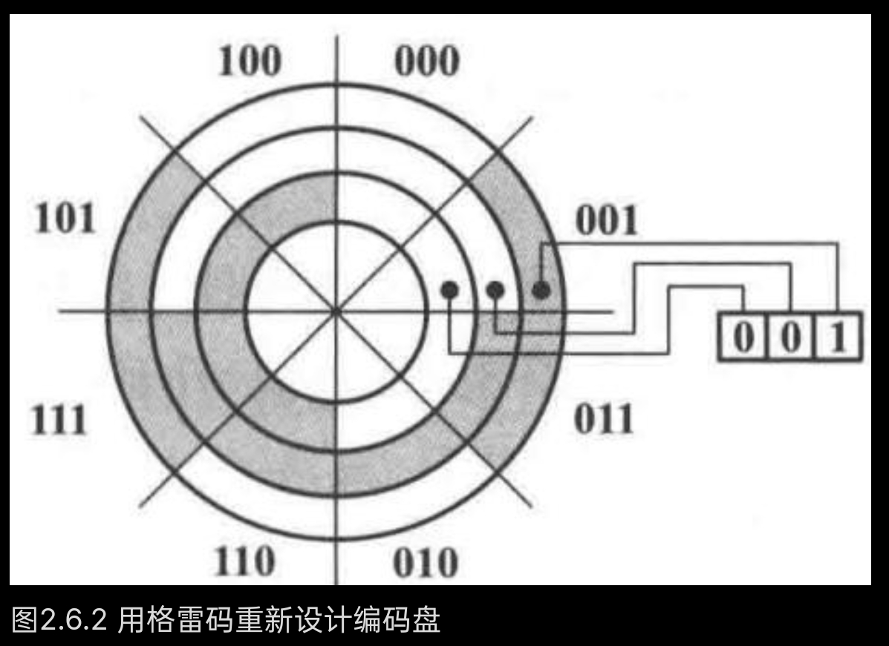

## 数制与编码
*以二进制为例：*
**Radix/Base**（基数）：$2$
Weight（权重）：$2^{i}$
MSB（最高有效位）
LSB（最低有效位）

### 符号数的表示
#### 原码
MSB 0正1负

#### 补码 （2' 补）
$[n]$ 表示 $n$  的补码表示。

正数和原码相同
负数 $-a$ 在 $n$ 位补码表示系统中用二进制数 $(2^n-a)$ 表示

补码转换为十进制方法与二进制转换为十进制所用的按权展开式的计算方法相类似，只是**补码数最高位（MSB）的权值为  $- 2^{n - 1}$  ，而不是  $+2^{n - 1}$**

表示范围：$-2^{n-1}\sim 2^{n - 1} - 1$

#### 反码 （1' 补）
正数和原码相同
负数 $-a$ 用二进制数 $(2^n-1-a)$ 表示，即补码减一

#### 符号位扩展
将 $n$ 位数扩展为 $m$ 位数（$n<m$），只需将符号位向高位复制即可。

#### 判断溢出方法
MSB 低一位进位数字与 MSB 进位数字相同则不溢出，反之溢出。

### 编码
#### BCD码（8421码）
> 采用4位二进制码表达十进制符号，称为BCD(binary-coded decimal)码

#### 2421码
2421是每位的权重。

#### 余三码
> 由 8421BCD 码的每个编码加上二进制数 0011 （即十进制3）形成。

### 格雷码
> 每对连续的码字之间只有一个数位变化的编码叫作格雷码(gray code)。



从  $n$  位二进制码得到格雷码的方法如下：
1. 保持位数不变，保持最高位不变；
2. 其余位数的转变规则：将二进制码码位与相邻高位作异或运算。

从  $n$  位格雷码得到二进制码的方法如下：
	二进制码第n位=格雷码第n位异或二进制码第n+1位（从最高位开始，最高位二进制码=最高位格雷码）。


## 数字电路
### CMOS 结构
```handwritten-ink
{
	"versionAtEmbed": "0.3.4",
	"filepath": "Ink/Writing/2025.9.11 - 10.04am.writing"
}
```

*扇入*：输入信号数量。

### 电压与电流的容限设置
#### 逻辑电平与噪声容限
*放大区*：
	斜率绝对值大于1的区域。
*衰减区*：
	斜率绝对值小于1的区域。
*电平容限*：
	低于放大区的电压范围称为低电平容限(low level tolerance),而高于放大区的电压范围称为高电平容限(high level tolerance)。
*噪声容限*：
	输入与输出对应电平容限之差称为噪声容限(noisemargin)。
*驱动能力 $I_M$*：
	器件在保持逻辑电平时,能够提供的最大输出电流
*吸收电流*：流入电流（＋）
*提供电流*：流出电流（－）


## 组合逻辑设计原理
组合逻辑电路：输出取决于当前输入
时序逻辑电路：输出取决于历史和当前输入

### 开关代数定理
*交换律(commutativity)*：
	$X + Y = Y + X;$ 
	$X \cdot Y = Y \cdot X;$
*结合律(associativity)*：
	$X \cdot (Y \cdot Z) = (X \cdot Y) \cdot Z;$ 
	$X + (Y + Z) = (X + Y) + Z;$
*分配律(distributivity)*：
	$X \cdot (Y + Z) = X \cdot Y + X \cdot Z;$ 
	$X + Y \cdot Z = (X + Y) \cdot (X + Z);$
*吸收律(covering)*：
	$X + X \cdot Y = X;$ 
	$X \cdot (X + Y) = X;$
*组合律(combining)*：
	$X \cdot Y + X \cdot Y^{\prime} = X;$ 
	$(X + Y) \cdot (X + Y^{\prime}) = X;$
*添加律(一致性定理)(consensus)*：
	$X \cdot Y + X^{\prime} \cdot Z + Y \cdot Z = X \cdot Y + X^{\prime} \cdot Z;$
	$(X + Y) \cdot (X^{\prime} + Z) \cdot (Y + Z) = (X + Y) \cdot (X^{\prime} + Z);$
*德摩根定律(Demorgan's theorems)*：
	$(X_{1} \cdot X_{2} \dots \dots X_{n})' = X_{1}' + X_{2}' + \dots + X_{n}';$
	$(X_{1} + X_{2} + \dots + X_{n})' = X_{1}' \cdot X_{2}' \dots \dots X_{n}'$。

*对偶定理（反演定理）*：
	对任何开关代数的定理或恒等式，若交换所有的 0 和 1，“＋” 和 “·”，结果仍正确。$F$ 的对偶式写作 $F^D$。
*香农展开定理(Shannon's expansion theorems)*：
$$F(X_{1},X_{2},\dots ,X_{n}) = X_{1}\cdot F(\mathbf{1},X_{2},\dots ,X_{n}) + X_{1}^{\prime}\cdot F(\mathbf{0},X_{2},\dots ,X_{n})$$
$$
F(X_{1},X_{2},\dots ,X_{n}) = [ X_{1} + F(\mathbf{0},X_{2},\dots ,X_{n}) ]\cdot [ X_{1}^{\prime} + F(\mathbf{1},X_{2},\dots ,X_{n}) ]
$$

*正逻辑*：高电平对应 1。


### 逻辑函数表达形式

异或：$\oplus$
同或：$\odot$
#### 真值表
*变量*：
	由单个字母表示；
*因子（literal）*：
	一个变量或变量的非；
*乘积项*：
	单个因子或几个因子的逻辑积；
*积之和表达式（SOP）*：
	几个乘积项的逻辑和，即**与或表达式**；
*求和项*：
	单个因子或几个因子的逻辑和；
*和之积表达式（POS）*：
	几个求和项的逻辑积，即**或与表达式**；
*标准项（normal term）*：
	一个乘积项或求和项，其中每个变量都以原变量或反变量出现，且每个变量只出现一次，如最小项和最大项。


#### 最小项和最大项
##### 最小项
> $n$  变量最小项(n-variable minterm)是指具有  $n$  个因子的标准乘积项。

对任何一个最小项,有且只有一组变量的取值组合使得它的值为1。
在 n 变量真值表中，第 i 行（即对应十进制数 i）对应的最小项即 1 对应原变量，0 对应反变量。例如 1101 对应 $m_{13}=A\cdot B\cdot C'\cdot D$。其中 $m_{13}$ 称为最小项编号。

*逻辑相邻性*：
	两个最小项仅有一个因子不同。

##### 最大项
> $n$  变量最大项(n-variable maxterm)是指具有  $n$  个因子的标准求和项。

对任何一个最大项,有且只有一组变量的取值组合使得它的值为0。
在 n 变量真值表中，第 i 行（即对应十进制数 i）对应的最大项即 1 对应反变量，0 对应原变量。例如 1010 对应 $M_{10}=A'+ B+ C'+ D$。其中 $M_{10}$ 称为最小项编号。


#### 逻辑函数标准形式
*积之和的标准形式*：
	函数的标准和（canonical sum），即最小项之和的形式，亦即标准的与或表达式。例如：
$$\scriptstyle F = A^{\prime}B^{\prime}C + A^{\prime}B C + A B^{\prime}C + A B C^{\prime} + A B C= m_{1} + m_{3} + m_{5} + m_{6} + m_{7} = \sum_{A,B,C}(1,3,5,6,7)$$
	最右侧符号 $\sum_{A,B,C}(1,3,5,6,7)$ 称为最小项列表，即最小项1、3、5、6、7的和，也称为逻辑函数的开集。

*和之积的标准形式*：
	函数的标准积（canonical product），即最大项之积的形式，亦即标准的或与表达式。例如：
$$
\scriptstyle F = (A + B + C)\cdot (A + B^{\prime} + C)\cdot (A^{\prime} + B + C)= M_{0}\cdot M_{2}\cdot M_{4}= \prod_{A,B,C}(0,2,4)
$$
	最右侧符号 $\prod_{A,B,C}(0,2,4)$ 称为最大项列表，即最大项的积，也称为逻辑函数的闭集。

==注意在**标准项**语境中标准和是变量（变量是单个字母）之和，而在**积之和的标准形式**语境中标准和是最小项之和。==

最小项和最大项的关系:
1. 编号相同的最小项和最大项互为反函数,即  $M_{i} = m_{i}^{\prime},m_{i} = M_{i}^{\prime}$
2. 某逻辑函数 F ,若用 P 项最小项之和表示,则其反函数 F' 可用 P 项最大项之积表示,两者标号完全一致。
3. 一个  $n$  变量函数,既可用最小项之和表示,也可用最大项之积表示,两者标号互补。
4. 一个  $n$  变量函数的最小项  $m_{i}$ ,其对偶为$(m_{i})^{\mathrm{D}} = M_{(2^{n} - 1) - i}$。


### 逻辑电路的化简
#### 卡诺图法化简逻辑函数
$n$  变量的卡诺图含有  $2^{n}$  个方格单元,每个方格代表一个可能的输入组合或最小项。每个方格都有一个编号,编号按**格雷码**排列。图形两侧标注的0和1表示该单元对应的输入组合,同时,单元格内的数字是真值表中对应的最小项编号。
![[卡诺图.jpg]]

*逻辑函数卡诺图表示*：
1. 把逻辑函数化为最小项之和的形式;
2. 在卡诺图上与这些最小项对应的位置上填入 1 , 在其余的位置上填入 0。

*卡诺图化简逻辑函数*：
1. 填写卡诺图：函化为最小项之和的形式,则在对应每个最小项的卡诺图方格中填1；化为最大项之积的形式,则在对应于每个最大项的卡诺图方格中填0。
2. 圈组：找出可以合并的最小项(或最大项)。
	- 原则如下:
		- 若圈1,将得化简"与或式"。要求所有的"1"都必须圈定。
		- 若圈0,将得化简"或与式"。要求所有的"0"都必须圈定。
		- 在每个圈组中1(或0)的个数须为  $2^{i}$  个,  $i$  为0,1,2,…。
	- 首先,保证圈组数最少；其次，圈组范围尽量大；方格可重复使用，但每个圈组至少要有一个1(或0)未被其他组圈过。
	- 圈组步骤如下:
		- 先圈孤立的1格(或0格)。
		- 再圈只能按一个方向合并的分组，要求圈子尽量大。
		- 圈其余可任意方向合并的分组，要求圈数尽量少。
3. 读图：将每个圈组写成与项(或者或项),再进行逻辑加(或乘)。
	- 消掉既能为0也能为1的变量，保留始终为0或1的变量。
	- 对于乘积项,0对应写出反变量，1对应写出原变量；对于求和项，0对应写出原变量，1对应写出反变量。


##### 蕴含
> 蕴含（Implication），记作 $P\rightarrow Q$ 或 $P \supset Q$（读作“如果……那么……”），表示 “如果 P，那么 Q” “只要 P，就 Q” “P 是 Q 的充分条件”。P 称为前件（Antecedent）或条件；Q 称为后件（Consequent）或结论。

*蕴含项*：
	对于布尔函数 F，若一个乘积项 P满足：当 P = 1 时，F 一定等于 1（即 $P \implies F$），则 P 称为 F 的蕴含项（Implicant）。
	蕴含项 P 对应卡诺图中 一个或多个相邻的最小项组成的矩形区域（如单个格、一行、一列或更大的矩形块）。

*主蕴含项（prime implicant）*：
	不能再被更大的蕴含项包含的最小乘积项，即移除其中任何一个变量后会导致该乘积项不再蕴含原函数。所有主蕴含项的集合能完全覆盖函数的全部最小项，且无冗余。

*奇异单元（distinguished 1-cell）*：
	奇异“1”单元是指仅能被单一主蕴含项覆盖的最小项方格。

*质主蕴含项（essential prime implicant）*：
	包含奇异单元的主蕴含项。

*最小和（最简和，minimal sum）*：
	利用卡诺图化简时圈 1 则得到最小和的表达式；在积之和表达式中有最少的乘积项以及在乘积项个数最少时每个乘积项中变量个数也最少；最小和是**主蕴含项之和**。

*完全和（complete sum）*：
	**所有**主蕴含项之和。


#### 具有无关项的逻辑函数
> 在逻辑电路的输入中,有些输入组合不会出现,则相应的输出就未被定义我们将这样的不会出现的输入组合称为无关项(don't care terms)。

在卡诺图中无关项用 d 表示，可圈可不圈。


### 定时冒险
#### 静态冒险
> 对电路的输入组合进行静态分析后电路的输出为固定的0或1，由于延迟作用,输出出现短暂的与固定输出反相的尖峰电路的可能性。

*静态- 1型冒险(static- 1hazard)*：
	当预期电路有静态1输出时却产生"0尖峰"的可能性。
*静态- 0型冒险"(static- 0hazard)*：
	当预期电路有静态0输出时却产生"1尖峰"的可能性。

##### 利用代数法发现静态冒险
某个变量A同时以原变量(original variable)和反变量(complemented variable)的形式出现在逻辑函数表达式中，且在一定条件下该逻辑函数表达式可以简化为  $A + A^{\prime}$  或  $A\cdot A^{\prime}$  的形式时，则该逻辑函数表达式对应的电路在变量A发生变化时，可能产生冒险。
##### 利用卡诺图发现静态冒险
圈有相切现象，即两圈边界处各有一个最小项相邻，则可能产生冒险。
可以通过将相切部分圈在一起消除冒险。

#### 动态冒险
> 一个输入转变一次而引起输出变化多次的可能性。


## 组合逻辑设计实践
### 组合逻辑电路的文档标准
![[信号命名标准.jpg]]

### 译码器
#### 二进制译码器
![[38译码器.jpg]]
G 为使能端（$G_1=1,G_{2A}\_L=0,G_{2B}\_L=0$ 时使能），CBA 为输入端，Y 为输出端。
输入中 C 为高位，A 为低位。
输入 CBA，对应的 Y 输出低电平（有效电平为低电平）。
![[74138真值表.jpg]]

#### 七段显示译码器
![[七段显示译码器.jpg]]


### 编码器
#### 二进制编码器
输入编码是  $2^{n}$  中取1码,输出编码为  $n$  位二进制数。

#### 优先编码器
优先编码器(priorityencoder)规定了编码器全部输入信号各自的优先等级(priority),当多个输入信号同时有效(asserted)时,它能够根据事先安排好的优先顺序,只对优先级最高的有效输入信号进行编码。

74x148：8-3优先编码器。EI_L 为使能端，输入 0 使能；$I_7\_L$ 到 $I_0\_L$ 优先级从高到低，即高位输入 0 （0 有效）后就不考虑后面几位；输出 $Y_2\_L$ 到 $Y_0\_L$ 为从高到低三位二进制的反码。
![[74148功能表.jpg]]


### 三态器件
#### 三态缓冲器
![[三态缓冲器.jpg]]
符号顶端的信号输入端为三态使能输入，当使能输入信号有效时，三态缓冲器按照正常的缓冲器或反相器工作，输出为0或1；当使能输入信号无效时，三态缓冲器输出悬空，即高阻状态(hi- Z)。

#### 三态缓冲器应用
一般门电路的输出是不允许连在一起的, 但三态缓冲器输出可以连在一起, 实现多个数据共享单个同线 (party line), 但要保证每一时刻仅有一个三态缓冲器使能有效。

### 多路复用器（multiplexer）
多路复用器又称数据选择器或多路开关。若多路复用器有 n 路数据输入端，1 路数据输出端，我们称之为 n 选 1 的多路复用器。

多路复用器的标准逻辑函数为
$$
Y = E N \sum_{i = 0}^{n} m_{i} D_{i}
$$

### 多路分配器和奇偶校验电路
多路分配器与多路复用器相反，根据地址选择码选择将输入输出到多路输出的某一路。

奇偶校验：
异或(XOR)运算结果取决于变量为1的个数:
若  $A_{0}\oplus A_{1}\oplus \dots \oplus A_{n} = 1$  则  $A_{0}{\sim}A_{n}$  中,1的个数是奇数；
若  $A_{0}\oplus A_{1}\oplus \dots \oplus A_{n} = \mathbf{0}$  则  $A_{0}{\sim}A_{n}$  中,1的个数是偶数。

同样,多变量同或(XNOR)运算,结果取决于0的个数:
若  $A_{0}\odot A_{1}\odot \dots \odot A_{n} = \mathbf{1}$  则  $A_{0}{\sim}A_{n}$  中,0的个数是偶数；
若  $A_{0}\odot A_{1}\odot \dots \odot A_{n} = \mathbf{0}$  则  $A_{0}{\sim}A_{n}$  中,0的个数是奇数。


### 比较器
#### 等值比较器
同或异或门实现。
迭代电路实现：
![[迭代比较器.jpg]]

#### 数值比较器
数值比较器(magnitude comparator)是对两个位数相同的二进制数进行数值比较并判定其大小关系的算术运算电路。

![[数值比较器.jpg]]

一位数值比较器：
$$
\begin{array}{r l} & {E Q\_ L = A\cdot B^{\prime} + A^{\prime}\cdot B = A\oplus B = (A\odot B)^{\prime}}\\ & {L T\_ L = (A^{\prime}B)^{\prime}}\\ & {G T\_ L = (A B^{\prime})^{\prime}} \end{array}
$$
十二位数值比较器：
![[十二位数值比较器.jpg]]


### 加法器
*半加器*：
	能对两个1位二进制数进行相加而求得和及进位的逻辑电路。
*全加器*：
	能对两个1位二进制数进行相加并考虑低位来的进位,即相当于3个1位二进制数相加,求得和及进位的逻辑电路。
	
![[串行加法器.jpg]]
C 为进位，S 为输出；串行加法器的速度缓慢。

超前进位并行加法器 74x283。

## 时序逻辑设计原理
时序逻辑电路(sequential logic circuit)的输出不仅取决于当前的输入,还和过去的输入序列有关。这意味着时序逻辑电路从电路结构来讲必然包含着反馈回路。
把状态变量先存在记忆器件 (memory) 中, 然后在时钟 (clock) 信号的控制下进行反馈, 使时序电路状态变化所发生的时间由统一的时钟信号规定, 这样的电路结构称为时钟同步状态机 (clocked synchronous state machine)。

### 双稳态元件（bistable element）
存储电路是一种具有记忆功能 (memory function) 而且能够存储数字信号的基本单元电路 (unit circuit)。其特点：
1. 具有两个相对稳定的输出状态, 称为双稳态 (bistable), 用来表示逻辑状态 0 和逻辑状态 1, 称为 0 态和 1 态；
2. 能够通过外加触发信号, 设置或改变存储元件的状态。在外加触发信号之前, 存储电路一直保持两个稳定状态中的一个 (0 态或 1 态)。

*亚稳态（metastable）*

### S-R锁存器（latch）
S-R锁存器：置位复位锁存器，基本储存电路。S代表置位输入端（set input），R代表复位输入端（reset input）。
两个或非门交叉耦合构成 S-R锁存器，高电平触发；两个与非门交叉耦合构成S'-R'锁存器，低电平触发，注意S-R锁存器S在QN端而S'-R'锁存器S_L在Q端。

S-R锁存器的特征方程(characteristic equation)为: $Q^{*} = S + R^{\prime} \cdot Q$。
约束条件：$S\cdot R=0$。
![[SR锁存器状态转移表.jpg]]
![[SR锁存器.jpg]]

*透明性*：
	指锁存器在特定条件下输出状态会实时跟随输入信号变化的特性。

#### 带使能端的S-R锁存器
引入同步信号(synchronous signal)来作为控制电路,这个同步信号也称为使能(enable)、门控(gate)信号或时钟(clock)信号。
具有使能端的  $S - R$  锁存器(S- R latch with enable),也称为同步  $S - R$  锁存器(synchronous  $S - R$  latch),或时钟  $S - R$  锁存器(clock  $S - R$  latch)。

![[带使能端的SR锁存器.jpg]]

### D锁存器
以同步  $S - R$  锁存器的  $S$  端作为数据输入端,用一个反相器将输入信号反向后作为  $R$  端的输入信号,这种锁存器称为  $D$  锁存器。
特征方程为 $Q^*=D(C=1)$。
![[D锁存器.jpg]]
$C$ 有效时，$D$ 锁存器的输出 $Q$ 与输入 $D$ 一致，称锁存器"打开"，并且从 $D$ 输入端到 $Q$ 输出端的通道是"透明的"(transparent)，所以  $D$  锁存器又称透明锁存器。$C$  无效时称锁存器"关闭"。

在  $C$  信号的下降沿附近有一个时间窗(time window)，包括建立时间(setup time)和保持时间(hold time)，在这段时间内  $D$  输入一定不能发生变化；如果  $D$  输入发生变化,则  $D$  锁存器的输出就是不可预测的，可能进入亚稳态(metastable)

### D触发器（flip-flop）
对于锁存器来说，在时钟(使能)信号有效期间，锁存器的输入都会影响到输出；
对于触发器来说，仅在时钟信号变化的瞬间即时钟触发沿，输出才会发生变化。

时钟信号的触发沿可分为上升沿(rising- edge)和下降沿(falling- edge)，也可以称为正边沿(positive- edge)和负边沿(negative- edge)。

#### 边沿触发式D触发器
![[边沿触发D触发器.jpg]]
两个D锁存器为主从结构（master-slave structure）。左边为主锁存器。从锁存器的输出只在CLK从0变到1的时刻发生变化,体现出边沿触发(edge-triggered)特性。
电路的输出  $Q$  只有在时钟上升沿到来的时刻, 才随输入  $D$  变化且整个时钟周期只变化一次。因此, 体现出边沿触发的特性。
特征方程：$Q^*=D$，功能表如下：
<table><tr><td>CLK</td><td>D</td><td>Q*</td></tr><tr><td>×</td><td>×</td><td>Q</td></tr><tr><td>↑</td><td>0</td><td>0</td></tr><tr><td>↑</td><td>1</td><td>1</td></tr></table>
状态转移图与 D 锁存器的状态转移图相同。

#### 可复位触发器
新增复位键，按下即清零。
分为同步可复位触发器（synchronously resettable flip- flop）和异步可复位触发器（asynchronously resettable flip- flop），同步受时钟控制，异步按下立即清零。

#### 具有清零和预置端的 D 触发器
![[具有清零和预置端的D触发器.jpg]]
当预置端 PR_L 置零时，实现异步置位，迫使 Q 输出 1，QN 输出 0。

#### 具有使能端的边沿 D 触发器
![[具有使能端的边沿 D 触发器.jpg]]
如果EN有效，则选择外部数据输入端 $D$ 的输入；如果EN无效，则选择的是触发器现在的输出 $Q$（即维持原态）。

### JK触发器（edge-triggered J-K flip-flop）
$$
Q^*=D=J\cdot Q'+K'\cdot Q
$$
类比 SR 锁存器多了 J=1，K=1 （JK对应SR）的状态，此时触发器翻转。
![[JK触发器.jpg]]
![[JK触发器功能表.jpg]]

### T（toggle）触发器
$$
Q^{*}=Q'
$$
即状态在每一个时钟的有效边沿都会翻转，因此触发器的输出信号频率正好是输入信号频率的一半。
![[T触发器结构.jpg]]
![[带使能端的T触发器.jpg]]
带使能端 T 触发器的特征方程为：
$$
Q^{*} = E N \cdot Q^{\prime} + E N^{\prime} \cdot Q = E N \oplus Q
$$

### 时钟同步状态机的结构
通常将时序电路的"状态(state)"存储于触发器中,将一个触发器的输出称为一个"状态变量(state variable)"。时序电路也称为时钟同步状态机(clocked synchronous state machine)。同步(synchronous)表示构成"状态机"的所有触发器都使用同一个时钟信号。
#### 时钟同步状态机的结构
时钟同步状态机的输出同时取决于当前状态和外输入，这样的状态机称为Mealy机。
![[米利机.jpg]]

时钟同步状态机的输出只由当前状态决定，这样的状态机称为Moore机。
![[摩尔机.jpg]]

要保证状态机尽快地产生输出，并且在每个时钟周期期间保持不变：
1. 输出编码状态赋值(output-coded state assignment)：对状态进行编码，这样就可以把状态变量本身作为输出，采用这种方法能得到一个Moore机；
2. 设计状态机：使其在一个时钟周期内的输出,取决于前一个时钟周期内的状态和外输入,我们称这种输出为流水线输出(pipelined output)。

#### 时钟同步状态机的表达
通过三个方程描述电路：
1. 激励方程(excitation equation)：说明下一个状态可以由现在已知的状态和当前的输入来确定，表示为：触发器激励端 = F(当前状态, 输入)；
2. 输出方程(output equation)：说明当前的输出由当前状态和输入来确定, 表示为: 电路输出端 = G(当前状态, 输入)；
3. 转移方程(transition equation)：用来说明状态存储器在激励的作用下, 如何从当前状态  $Q$  转移到下一状态  $Q^{*}$ , 通常这由触发器的特征方程确定。


### 时钟同步状态机分析
1. 根据电路图, 确定触发器的激励方程；
2. 根据电路图, 确定输出方程；
3. 将激励方程带入触发器特征方程(characteristic equation),得到电路的状态转移方程；
4. 构造状态转移/输出表(state transition/output table),对当前状态和输入的每一个可能组合,指定电路的下一状态和输出；
5. 绘制状态转移/输出图(state transition/output diagram),简称状态图(state diagram)(可选)；
6. 绘制波形图(waveform diagram),更直观地显示电路行为特性(可选)。

![[状态机转移表状态表.jpg]]
将转移表中  $Q_{1}Q_{0}$  的取值组合用如 $\mathbf{00}{=}A$，$\mathbf{01}{=}B$，$\mathbf{10}{=}C$，$\mathbf{11}{=}D$ 的状态名表示,就可以得到状态表(state table)，通常用  $S$  (state)代表当前状态,  $S^{*}$  代表下一状态。

状态图以图形方式表示出状态/输出表中的信息,用圆圈表示状态,箭头表示状态转移,箭头上标注转移和输出信息。
![[状态转移图.jpg]]


### 时钟同步状态机的设计
1. 根据题目的逻辑要求,构造原始的状态图(state diagram)或构造原始的状态/输出表(state/output table)；
2. 状态化简(state minimization)；
3. 进行状态分配(state assignment)，建立状态转移/输出表(state transition/output table)，状态分配就是给每个状态进行二进制编码,故状态分配又叫状态编码(state coded)；
4. 触发器选型(flip-flop selection),求出电路的状态方程(state equation)、激励方程(excitation equation)和输出方程(output equation)；
5. 检查电路的自启动性(self-startup),或称自校正性(self-correcting)，即电路在上电后无论初始状态如何，都能通过有限次状态跳变自动进入预设的有效状态，可以通过遍历或验证状态转移图闭合性判断；
6. 画逻辑电路图(logic circuit)。

无效状态的处理：
1. 最小风险法(minimal risk design)。假设状态机可能由于某种原因会进入到未用的(或无效的)状态，对每一种未用状态都规定一个明确的下一状态项,从而使得对于任何一种输入组合,未用状态都能进入到"初始"状态、"空闲"状态或者其他一些"安全"状态中,从而最大限度减少电路停留在无效状态的时间；
2. 最小成本法(minimal cost design)。在初始设计时,假设状态机永远不会进入未用状态，因此未用状态的下一状态可以看作"无关"项（在卡诺图中用 d 表示），设计完以后要检查自启动性。

两个状态在所有输入组合下都产生相同输出和下一状态，则称两个状态等价。

状态图应该是明确而无二义性的, 要满足互斥性(mutualexclusion)和完备性(all inclusion)的要求：
1. 互斥性是指,对于每一个状态,在离开这一状态的弧线上所标的任意一对转移表达式的逻辑积等于0,这意味着不会出现同一个状态的两个转移表达式的值同时为1；
2. 完备性表示,对于每一种状态,在离开这一状态的弧线上所标的所有转移表达式的逻辑和等于1。

#### 例子
[计数器设计](教材/数字逻辑设计及应用/full#7.9.1 简单计数功能设计)
[序列发生器设计](教材/数字逻辑设计及应用/full#7.9.2 序列发生器设计)
[序列检测器设计](教材/数字逻辑设计及应用/full#7.9.3 序列检测器设计)


## 时序逻辑设计实践
### 计数器原理及应用
模m计数器，又称除m计数器，又称m分频器。
#### 异步计数器和同步计数器
##### 行波计数器
一个 4bit 行波计数器是由四个 T 触发器串联而成的异步计数器，要求时钟信号不能太快。
##### 同步计数器
![[同步计数器.jpg]]

#### 二进制计数模块 74x163
![[二进制计数模块74x163.jpg]]

输入：
1. CLK时钟输入；
2. CLR同步清零，低电平有效；
3. LD同步预置控制，也是低电平有效；
4. ENP和ENT两个使能控制，这两个使能相与，形成总的使能控制；
5. $A,B,C,D$ 为4bit的预置值输入。

输出：
1. $Q_{0},Q_{1},Q_{2},Q_{3}$  四个计数输出,  $Q_{3}$  为高位,  $Q_{0}$  为低位；
2. RCO为进位输出。

#### 计数器的应用
##### 自由运行模式
即 CLR、LD、ENP、ENT 均接高电平时的自由计数模式。此时电路就是对输入时钟信号模16的计数器。
##### 模 M 的计数器设计
1. 同步预置法：
	将预置输入值作为初始计数状态，一直计数到状态终值，检测状态终值，如果是需要的终值，则通过反馈逻辑，输出满足控制需要的电平，控制预置控制输入 $LD$，预置初值，进入下一个循环。
2. 